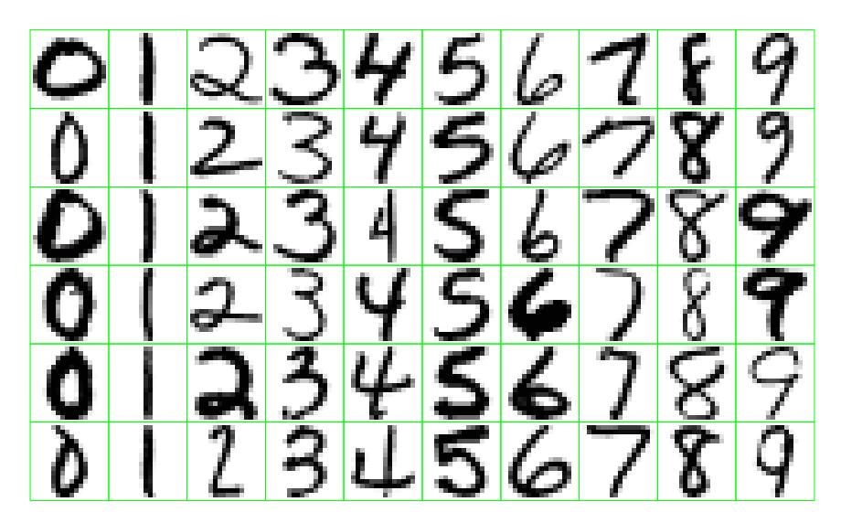

# Introduction

Statistical learning plays a key role in many areas of science, finance and industry. Here are some examples of learning problems:

- Predict whether a patient, hospitalized due to a heart attack, will have a second heart attack. The prediction is to be based on demographic, diet and clinical measurements for that patient.
- Predict the price of a stock in 6 months from now, on the basis of company performance measures and economic data.
- Identify the numbers in a handwritten ZIP code, from a digitized image.
- Estimate the amount of glucose in the blood of a diabetic person, from the infrared absorption spectrum of that person's blood.
- Identify the risk factors for prostate cancer, based on clinical and demographic variables.

The science of learning plays a key role in the fields of statistics, data mining and artificial intelligence, intersecting with areas of engineering and other disciplines.

This book is about learning from data. In a typical scenario, we have an outcome measurement, usually quantitative (such as a stock price) or categorical (such as heart attack/no heart attack), that we wish to predict based on a set of features (such as diet and clinical measurements). We have a training set of data, in which we observe the outcome and feature measurements for a set of objects (such as people). Using this data we build a prediction model, or learner, which will enable us to predict the outcome for new unseen objects. A good learner is one that accurately predicts such an outcome.

The examples above describe what is called the supervised learning problem. It is called "supervised" because of the presence of the outcome variable to guide the learning process. In the unsupervised learning problem, we observe only the features and have no measurements of the outcome. Our task is rather to describe how the data are organized or clustered. We devote most of this book to supervised learning; the unsupervised problem is less developed in the literature, and is the focus of Chapter 14.

Here are some examples of real learning problems that are discussed in this book.

## Example 1: Email Spam

The data for this example consists of information from 4601 email messages, in a study to try to predict whether the email was junk email, or "spam." The objective was to design an automatic spam detector that could filter out spam before clogging the users' mailboxes. For all 4601 email messages, the true outcome (email type) email or spam is available, along with the relative frequencies of 57 of the most commonly occurring words and punctuation marks in the email message. This is a supervised learning problem, with the outcome the class variable email/spam. It is also called a classification problem.

Table 1.1 lists the words and characters showing the largest average difference between spam and email.

|       | george | you  | your | hp   | free | hpl  | !    | our  | re   | edu  | remove |
|-------|--------|------|------|------|------|------|------|------|------|------|--------|
| spam  | 0.00   | 2.26 | 1.38 | 0.02 | 0.52 | 0.01 | 0.51 | 0.51 | 0.13 | 0.01 | 0.28   |
| email | 1.27   | 1.27 | 0.44 | 0.90 | 0.07 | 0.43 | 0.11 | 0.18 | 0.42 | 0.29 | 0.01   |

**TABLE 1.1.** Average percentage of words or characters in an email message equal to the indicated word or character. We have chosen the words and characters showing the largest difference between spam and email.

Our learning method has to decide which features to use and how: for example, we might use a rule such as

$$\text{if } (0.2 \cdot \text{\%you} - 0.3 \cdot \text{\%george}) > 0 \text{ then spam, else email.}$$

Another form of a rule might be:

$$\text{if } (\text{\%george} < 0.6) \text{ and } (\text{\%you} > 1.5) \text{ then spam, else email.}$$

For this problem not all errors are equal; we want to avoid filtering out good email, while letting spam get through is not desirable but less serious in its consequences. We discuss a number of different methods for tackling this learning problem in the book.

## Example 2: Prostate Cancer

The data for this example, displayed in Figure 1.1$^{1}$, come from a study by Stamey et al. (1989) that examined the correlation between the level of prostate specific antigen (PSA) and a number of clinical measures, in 97 men who were about to receive a radical prostatectomy.

$^{1}$There was an error in these data in the first edition of this book. Subject 32 had a value of 6.1 for lweight, which translates to a 449 gm prostate! The correct value is 44.9 gm. We are grateful to Prof. Stephen W. Link for alerting us to this error.

The goal is to predict the log of PSA (lpsa) from a number of measurements including log cancer volume (lcavol), log prostate weight lweight, age, log of benign prostatic hyperplasia amount lbph, seminal vesicle invasion svi, log of capsular penetration lcp, Gleason score gleason, and percent of Gleason scores 4 or 5 pgg45. Figure 1.1 is a scatterplot matrix of the variables. Some correlations with lpsa are evident, but a good predictive model is difficult to construct by eye.

**FIGURE 1.1.** Scatterplot matrix of the prostate cancer data. The first row shows the response against each of the predictors in turn. Two of the predictors, svi and gleason, are categorical.

This is a supervised learning problem, known as a regression problem, because the outcome measurement is quantitative.

## Example 3: Handwritten Digit Recognition

The data from this example come from the handwritten ZIP codes on envelopes from U.S. postal mail. Each image is a segment from a five digit ZIP code, isolating a single digit. The images are 16$\times$16 eight-bit grayscale maps, with each pixel ranging in intensity from 0 to 255. Some sample images are shown in Figure 1.2.

**FIGURE 1.2.** Examples of handwritten digits from U.S. postal envelopes.

The images have been normalized to have approximately the same size and orientation. The task is to predict, from the 16 $\times$ 16 matrix of pixel intensities, the identity of each image (0, 1, . . . , 9) quickly and accurately. If it is accurate enough, the resulting algorithm would be used as part of an automatic sorting procedure for envelopes. This is a classification problem for which the error rate needs to be kept very low to avoid misdirection of mail. In order to achieve this low error rate, some objects can be assigned to a "don't know" category, and sorted instead by hand.

## Example 4: DNA Expression Microarrays

DNA stands for deoxyribonucleic acid, and is the basic material that makes up human chromosomes. DNA microarrays measure the expression of a gene in a cell by measuring the amount of mRNA (messenger ribonucleic acid) present for that gene. Microarrays are considered a breakthrough technology in biology, facilitating the quantitative study of thousands of genes simultaneously from a single sample of cells.

Here is how a DNA microarray works. The nucleotide sequences for a few thousand genes are printed on a glass slide. A target sample and a reference sample are labeled with red and green dyes, and each are hybridized with the DNA on the slide. Through fluoroscopy, the log (red/green) intensities of RNA hybridizing at each site is measured. The result is a few thousand numbers, typically ranging from say −6 to 6, measuring the expression level of each gene in the target relative to the reference sample. Positive values indicate higher expression in the target versus the reference, and vice versa for negative values.

A gene expression dataset collects together the expression values from a series of DNA microarray experiments, with each column representing an experiment. There are therefore several thousand rows representing individual genes, and tens of columns representing samples: in the particular example of Figure 1.3 there are 6830 genes (rows) and 64 samples (columns), although for clarity only a random sample of 100 rows are shown. The figure displays the data set as a heat map, ranging from green (negative) to red (positive). The samples are 64 cancer tumors from different patients.

The challenge here is to understand how the genes and samples are organized. Typical questions include the following:

- (a) which samples are most similar to each other, in terms of their expression profiles across genes?
- (b) which genes are most similar to each other, in terms of their expression profiles across samples?
- (c) do certain genes show very high (or low) expression for certain cancer samples?

We could view this task as a regression problem, with two categorical predictor variables—genes and samples—with the response variable being the level of expression. However, it is probably more useful to view it as unsupervised learning problem. For example, for question (a) above, we think of the samples as points in 6830–dimensional space, which we want to cluster together in some way.

**FIGURE 1.3.** DNA microarray data: expression matrix of 6830 genes (rows) and 64 samples (columns), for the human tumor data. Only a random sample of 100 rows are shown. The display is a heat map, ranging from bright green (negative, under expressed) to bright red (positive, over expressed). Missing values are gray. The rows and columns are displayed in a randomly chosen order.

## Who Should Read this Book

This book is designed for researchers and students in a broad variety of fields: statistics, artificial intelligence, engineering, finance and others. We expect that the reader will have had at least one elementary course in statistics, covering basic topics including linear regression.

We have not attempted to write a comprehensive catalog of learning methods, but rather to describe some of the most important techniques. Equally notable, we describe the underlying concepts and considerations by which a researcher can judge a learning method. We have tried to write this book in an intuitive fashion, emphasizing concepts rather than mathematical details.

As statisticians, our exposition will naturally reflect our backgrounds and areas of expertise. However in the past eight years we have been attending conferences in neural networks, data mining and machine learning, and our thinking has been heavily influenced by these exciting fields. This influence is evident in our current research, and in this book.

## How This Book is Organized

Our view is that one must understand simple methods before trying to grasp more complex ones. Hence, after giving an overview of the supervising learning problem in Chapter 2, we discuss linear methods for regression and classification in Chapters 3 and 4. In Chapter 5 we describe splines, wavelets and regularization/penalization methods for a single predictor, while Chapter 6 covers kernel methods and local regression. Both of these sets of methods are important building blocks for high-dimensional learning techniques. Model assessment and selection is the topic of Chapter 7, covering the concepts of bias and variance, overfitting and methods such as cross-validation for choosing models. Chapter 8 discusses model inference and averaging, including an overview of maximum likelihood, Bayesian inference and the bootstrap, the EM algorithm, Gibbs sampling and bagging, A related procedure called boosting is the focus of Chapter 10.

In Chapters 9–13 we describe a series of structured methods for supervised learning, with Chapters 9 and 11 covering regression and Chapters 12 and 13 focusing on classification. Chapter 14 describes methods for unsupervised learning. Two recently proposed techniques, random forests and ensemble learning, are discussed in Chapters 15 and 16. We describe undirected graphical models in Chapter 17 and finally we study highdimensional problems in Chapter 18.

At the end of each chapter we discuss computational considerations important for data mining applications, including how the computations scale with the number of observations and predictors. Each chapter ends with Bibliographic Notes giving background references for the material.

We recommend that Chapters 1–4 be first read in sequence. Chapter 7 should also be considered mandatory, as it covers central concepts that pertain to all learning methods. With this in mind, the rest of the book can be read sequentially, or sampled, depending on the reader's interest.

The symbol indicates a technically difficult section, one that can be skipped without interrupting the flow of the discussion.

## Book Website

The website for this book is located at

<http://www-stat.stanford.edu/ElemStatLearn>

It contains a number of resources, including many of the datasets used in this book.

## Note for Instructors

We have successively used the first edition of this book as the basis for a two-quarter course, and with the additional materials in this second edition, it could even be used for a three-quarter sequence. Exercises are provided at the end of each chapter. It is important for students to have access to good software tools for these topics. We used the R and S-PLUS programming languages in our courses.
