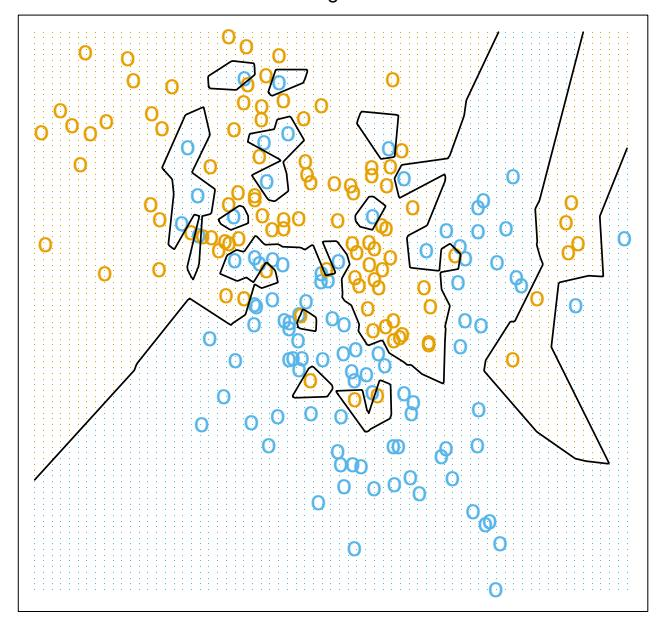
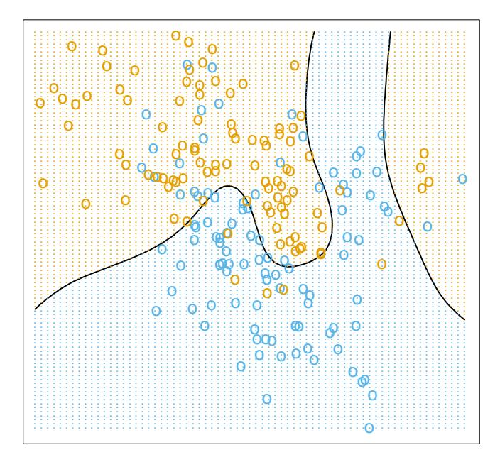
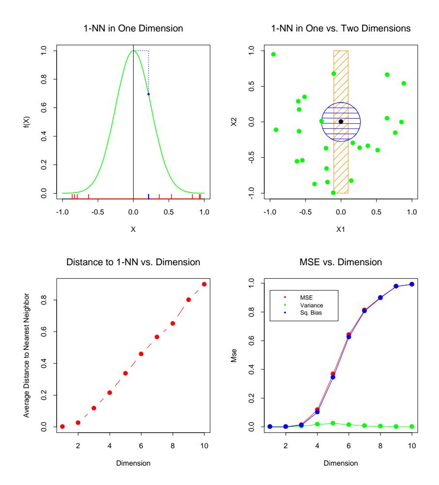
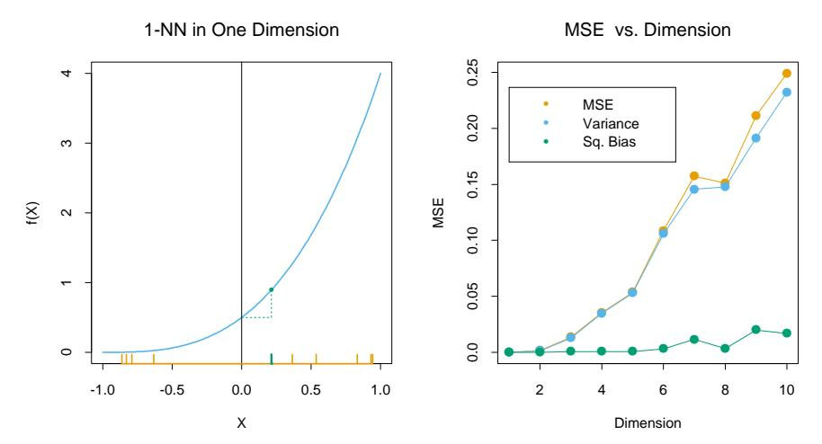
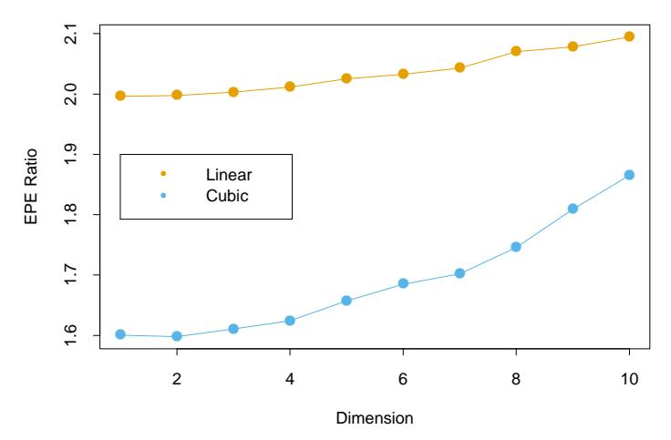
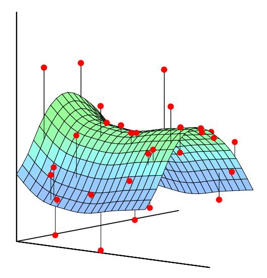
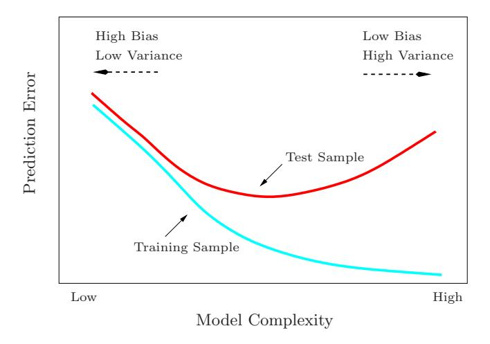

# Overview of Supervised Learning

## 2.1 Introduction

The first three examples described in Chapter 1 have several components in common. For each there is a set of variables that might be denoted as inputs, which are measured or preset. These have some influence on one or more outputs. For each example the goal is to use the inputs to predict the values of the outputs. This exercise is called supervised learning.

We have used the more modern language of machine learning. In the statistical literature the inputs are often called the predictors, a term we will use interchangeably with inputs, and more classically the independent variables. In the pattern recognition literature the term features is preferred, which we use as well. The outputs are called the responses, or classically the dependent variables.

## 2.2 Variable Types and Terminology

The outputs vary in nature among the examples. In the glucose prediction example, the output is a quantitative measurement, where some measurements are bigger than others, and measurements close in value are close in nature. In the famous Iris discrimination example due to R. A. Fisher, the output is qualitative (species of Iris) and assumes values in a finite set G = {Virginica, Setosa and Versicolor}. In the handwritten digit example the output is one of 10 different digit classes: G = {0, 1, . . . , 9}. In both of these there is no explicit ordering in the classes, and in fact often descriptive labels rather than numbers are used to denote the classes. Qualitative variables are also referred to as categorical or discrete variables as well as factors.

For both types of outputs it makes sense to think of using the inputs to predict the output. Given some specific atmospheric measurements today and yesterday, we want to predict the ozone level tomorrow. Given the grayscale values for the pixels of the digitized image of the handwritten digit, we want to predict its class label.

This distinction in output type has led to a naming convention for the prediction tasks: regression when we predict quantitative outputs, and classification when we predict qualitative outputs. We will see that these two tasks have a lot in common, and in particular both can be viewed as a task in function approximation.

Inputs also vary in measurement type; we can have some of each of qualitative and quantitative input variables. These have also led to distinctions in the types of methods that are used for prediction: some methods are defined most naturally for quantitative inputs, some most naturally for qualitative and some for both.

A third variable type is ordered categorical, such as small, medium and large, where there is an ordering between the values, but no metric notion is appropriate (the difference between medium and small need not be the same as that between large and medium). These are discussed further in Chapter 4.

Qualitative variables are typically represented numerically by codes. The easiest case is when there are only two classes or categories, such as "success" or "failure," "survived" or "died." These are often represented by a single binary digit or bit as 0 or 1, or else by −1 and 1. For reasons that will become apparent, such numeric codes are sometimes referred to as targets. When there are more than two categories, several alternatives are available. The most useful and commonly used coding is via dummy variables. Here a K-level qualitative variable is represented by a vector of K binary variables or bits, only one of which is "on" at a time. Although more compact coding schemes are possible, dummy variables are symmetric in the levels of the factor.

We will typically denote an input variable by the symbol $X$. If $X$ is a vector, its components can be accessed by subscripts $X_j$. Quantitative outputs will be denoted by $Y$, and qualitative outputs by $G$ (for group). We use uppercase letters such as $X$, $Y$ or $G$ when referring to the generic aspects of a variable. Observed values are written in lowercase; hence the $i$th observed value of $X$ is written as $x_i$ (where $x_i$ is again a scalar or vector). Matrices are represented by bold uppercase letters; for example, a set of $N$ input $p$-vectors $x^i$, $i = 1, \ldots, N$ would be represented by the $N \times p$ matrix $\mathbf{X}$. In general, vectors will not be bold, except when they have $N$ components; this convention distinguishes a $p$-vector of inputs $x_i$ for the $i$th observation from the $N$-vector $\mathbf{x}_j$ consisting of all the observations on variable $X_j$. Since all vectors are assumed to be column vectors, the $i$th row of $\mathbf{X}$ is $x_i^T$, the vector transpose of $x_i$.

For the moment we can loosely state the learning task as follows: given the value of an input vector X, make a good prediction of the output Y, denoted by  $\hat{Y}$  (pronounced "y-hat"). If Y takes values in  $\mathbb{R}$  then so should  $\hat{Y}$ ; likewise for categorical outputs,  $\hat{G}$  should take values in the same set  $\mathcal{G}$  associated with G.

For a two-class G, one approach is to denote the binary coded target as Y, and then treat it as a quantitative output. The predictions  $\hat{Y}$  will typically lie in [0,1], and we can assign to  $\hat{G}$  the class label according to whether  $\hat{y} > 0.5$ . This approach generalizes to K-level qualitative outputs as well.

We need data to construct prediction rules, often a lot of it. We thus suppose we have available a set of measurements  $(x_i, y_i)$  or  $(x_i, g_i)$ ,  $i = 1, \ldots, N$ , known as the *training data*, with which to construct our prediction rule.

## 2.3 Two Simple Approaches to Prediction: Least Squares and Nearest Neighbors

In this section we develop two simple but powerful prediction methods: the linear model fit by least squares and the k-nearest-neighbor prediction rule. The linear model makes huge assumptions about structure and yields stable but possibly inaccurate predictions. The method of k-nearest neighbors makes very mild structural assumptions: its predictions are often accurate but can be unstable.

### 2.3.1 Linear Models and Least Squares

The linear model has been a mainstay of statistics for the past 30 years and remains one of our most important tools. Given a vector of inputs  $X^T = (X_1, X_2, \dots, X_p)$ , we predict the output Y via the model

$$\hat{Y} = \hat{\beta}_0 + \sum_{j=1}^p X_j \hat{\beta}_j, \tag{2.1}$$

The term  $\hat{\beta}_0$  is the intercept, also known as the *bias* in machine learning. Often it is convenient to include the constant variable 1 in X, include  $\hat{\beta}_0$  in the vector of coefficients  $\hat{\beta}$ , and then write the linear model in vector form as an inner product

$$\hat{Y} = X^T \hat{\beta},\tag{2.2}$$

where  $X^T$  denotes vector or matrix transpose (X being a column vector). Here we are modeling a single output, so  $\hat{Y}$  is a scalar; in general  $\hat{Y}$  can be a K-vector, in which case  $\beta$  would be a  $p \times K$  matrix of coefficients. In the (p+1)-dimensional input-output space,  $(X,\hat{Y})$  represents a hyperplane. If the constant is included in X, then the hyperplane includes the origin and is a subspace; if not, it is an affine set cutting the Y-axis at the point  $(0,\hat{\beta}_0)$ . From now on we assume that the intercept is included in  $\hat{\beta}$ .

Viewed as a function over the *p*-dimensional input space,  $f(X) = X^T \beta$  is linear, and the gradient  $f'(X) = \beta$  is a vector in input space that points in the steepest uphill direction.

How do we fit the linear model to a set of training data? There are many different methods, but by far the most popular is the method of least squares. In this approach, we pick the coefficients  $\beta$  to minimize the residual sum of squares
$$RSS(\beta) = \sum_{i=1}^{N} (y_i - x_i^T \beta)^2, \tag{2.3}$$

RSS($\beta$) is a quadratic function of the parameters, and hence its minimum always exists, but may not be unique. The solution is easiest to characterize in matrix notation. We can write

$$RSS(\beta) = (\mathbf{y} - \mathbf{X}\beta)^T (\mathbf{y} - \mathbf{X}\beta), \tag{2.4}$$

where **X** is an  $N \times p$  matrix with each row an input vector, and **y** is an N-vector of the outputs in the training set. Differentiating w.r.t.  $\beta$  we get the normal equations

$$\mathbf{X}^T(\mathbf{y} - \mathbf{X}\beta) = 0. \tag{2.5}$$

If  $\mathbf{X}^T \mathbf{X}$  is nonsingular, then the unique solution is given by

$$\hat{\beta} = (\mathbf{X}^T \mathbf{X})^{-1} \mathbf{X}^T \mathbf{y}, \tag{2.6}$$

and the fitted value at the *i*th input  $x_i$  is  $\hat{y}_i = \hat{y}(x_i) = x_i^T \hat{\beta}$ . At an arbitrary input  $x_0$  the prediction is  $\hat{y}(x_0) = x_0^T \hat{\beta}$ . The entire fitted surface is characterized by the p parameters  $\hat{\beta}$ . Intuitively, it seems that we do not need a very large data set to fit such a model.

Let's look at an example of the linear model in a classification context. Figure 2.1 shows a scatterplot of training data on a pair of inputs  $X_1$  and  $X_2$ . The data are simulated, and for the present the simulation model is not important. The output class variable G has the values BLUE or ORANGE, and is represented as such in the scatterplot. There are 100 points in each of the two classes. The linear regression model was fit to these data, with the response Y coded as 0 for BLUE and 1 for ORANGE. The fitted values  $\hat{Y}$  are converted to a fitted class variable  $\hat{G}$  according to the rule

$$\hat{G} = \begin{cases} \text{ORANGE} & \text{if } \hat{Y} > 0.5, \\ \text{BLUE} & \text{if } \hat{Y} \le 0.5. \end{cases} \tag{2.7}$$

Linear Regression of 0/1 Response

**FIGURE 2.1.** A classification example in two dimensions. The classes are coded as a binary variable (BLUE = 0, ORANGE = 1), and then fit by linear regression. The line is the decision boundary defined by  $x^T \hat{\beta} = 0.5$ . The orange shaded region denotes that part of input space classified as ORANGE, while the blue region is classified as BLUE.

The set of points in  $\mathbb{R}^2$  classified as ORANGE corresponds to  $\{x: x^T \hat{\beta} > 0.5\}$ , indicated in Figure 2.1, and the two predicted classes are separated by the decision boundary  $\{x: x^T \hat{\beta} = 0.5\}$ , which is linear in this case. We see that for these data there are several misclassifications on both sides of the decision boundary. Perhaps our linear model is too rigid— or are such errors unavoidable? Remember that these are errors on the training data itself, and we have not said where the constructed data came from. Consider the two possible scenarios:

Scenario 1: The training data in each class were generated from bivariate Gaussian distributions with uncorrelated components and different means.

Scenario 2: The training data in each class came from a mixture of 10 low-variance Gaussian distributions, with individual means themselves distributed as Gaussian.

A mixture of Gaussians is best described in terms of the generative model. One first generates a discrete variable that determines which of the component Gaussians to use, and then generates an observation from the chosen density. In the case of one Gaussian per class, we will see in Chapter 4 that a linear decision boundary is the best one can do, and that our estimate is almost optimal. The region of overlap is inevitable, and future data to be predicted will be plagued by this overlap as well.

In the case of mixtures of tightly clustered Gaussians the story is different. A linear decision boundary is unlikely to be optimal, and in fact is not. The optimal decision boundary is nonlinear and disjoint, and as such will be much more difficult to obtain.

We now look at another classification and regression procedure that is in some sense at the opposite end of the spectrum to the linear model, and far better suited to the second scenario.

### 2.3.2 Nearest-Neighbor Methods

Nearest-neighbor methods use those observations in the training set  $\mathcal{T}$  closest in input space to x to form  $\hat{Y}$ . Specifically, the k-nearest neighbor fit for  $\hat{Y}$  is defined as follows:

$$\hat{Y}(x) = \frac{1}{k} \sum_{x_i \in N_k(x)} y_i, \tag{2.8}$$

where  $N_k(x)$  is the neighborhood of x defined by the k closest points  $x_i$  in the training sample. Closeness implies a metric, which for the moment we assume is Euclidean distance. So, in words, we find the k observations with  $x_i$  closest to x in input space, and average their responses.

In Figure 2.2 we use the same training data as in Figure 2.1, and use 15-nearest-neighbor averaging of the binary coded response as the method of fitting. Thus  $\hat{Y}$  is the proportion of `ORANGE`'s in the neighborhood, and so assigning class `ORANGE` to  $\hat{G}$  if  $\hat{Y}>0.5$  amounts to a majority vote in the neighborhood. The colored regions indicate all those points in input space classified as `BLUE` or `ORANGE` by such a rule, in this case found by evaluating the procedure on a fine grid in input space. We see that the decision boundaries that separate the `BLUE` from the `ORANGE` regions are far more irregular, and respond to local clusters where one class dominates.

Figure 2.3 shows the results for 1-nearest-neighbor classification:  $\hat{Y}$  is assigned the value  $y_{\ell}$  of the closest point  $x_{\ell}$  to x in the training data. In this case the regions of classification can be computed relatively easily, and correspond to a *Voronoi tessellation* of the training data. Each point  $x_i$  has an associated tile bounding the region for which it is the closest input point. For all points x in the tile,  $\hat{G}(x) = g_i$ . The decision boundary is even more irregular than before.

The method of k-nearest-neighbor averaging is defined in exactly the same way for regression of a quantitative output Y, although k=1 would be an unlikely choice.

15-Nearest Neighbor Classifier

**FIGURE 2.2.** The same classification example in two dimensions as in Figure 2.1. The classes are coded as a binary variable (BLUE = 0, ORANGE = 1) and then fit by 15-nearest-neighbor averaging as in (2.8). The predicted class is hence chosen by majority vote amongst the 15-nearest neighbors.

In Figure 2.2 we see that far fewer training observations are misclassified than in Figure 2.1. This should not give us too much comfort, though, since in Figure 2.3 none of the training data are misclassified. A little thought suggests that for k-nearest-neighbor fits, the error on the training data should be approximately an increasing function of k, and will always be 0 for k = 1. An independent test set would give us a more satisfactory means for comparing the different methods.

It appears that k-nearest-neighbor fits have a single parameter, the number of neighbors k, compared to the p parameters in least-squares fits. Although this is the case, we will see that the *effective* number of parameters of k-nearest neighbors is N/k and is generally bigger than p, and decreases with increasing k. To get an idea of why, note that if the neighborhoods were nonoverlapping, there would be N/k neighborhoods and we would fit one parameter (a mean) in each neighborhood.

It is also clear that we cannot use sum-of-squared errors on the training set as a criterion for picking k, since we would always pick k=1! It would seem that k-nearest-neighbor methods would be more appropriate for the mixture Scenario 2 described above, while for Gaussian data the decision boundaries of k-nearest neighbors would be unnecessarily noisy.

1-Nearest Neighbor Classifier

**FIGURE 2.3.** The same classification example in two dimensions as in Figure 2.1. The classes are coded as a binary variable (BLUE = 0, ORANGE = 1), and then predicted by 1-nearest-neighbor classification.

### 2.3.3 From Least Squares to Nearest Neighbors

The linear decision boundary from least squares is very smooth, and apparently stable to fit. It does appear to rely heavily on the assumption that a linear decision boundary is appropriate. In language we will develop shortly, it has low variance and potentially high bias.

On the other hand, the k-nearest-neighbor procedures do not appear to rely on any stringent assumptions about the underlying data, and can adapt to any situation. However, any particular subregion of the decision boundary depends on a handful of input points and their particular positions, and is thus wiggly and unstable—high variance and low bias.

Each method has its own situations for which it works best; in particular linear regression is more appropriate for Scenario 1 above, while nearest neighbors are more suitable for Scenario 2. The time has come to expose the oracle! The data in fact were simulated from a model somewhere between the two, but closer to Scenario 2. First we generated 10 means  $m_k$  from a bivariate Gaussian distribution  $N((1,0)^T, \mathbf{I})$  and labeled this class BLUE. Similarly, 10 more were drawn from  $N((0,1)^T, \mathbf{I})$  and labeled class ORANGE. Then for each class we generated 100 observations as follows: for each observation, we picked an  $m_k$  at random with probability 1/10, and

FIGURE 2.4. Misclassification curves for the simulation example used in Figures 2.1, 2.2 and 2.3. A single training sample of size 200 was used, and a test sample of size 10, 000. The orange curves are test and the blue are training error for k-nearest-neighbor classification. The results for linear regression are the bigger orange and blue squares at three degrees of freedom. The purple line is the optimal Bayes error rate.

then generated a N(mk, I/5), thus leading to a mixture of Gaussian clusters for each class. Figure 2.4 shows the results of classifying 10,000 new observations generated from the model. We compare the results for least squares and those for k-nearest neighbors for a range of values of k.

A large subset of the most popular techniques in use today are variants of these two simple procedures. In fact 1-nearest-neighbor, the simplest of all, captures a large percentage of the market for low-dimensional problems. The following list describes some ways in which these simple procedures have been enhanced:

- Kernel methods use weights that decrease smoothly to zero with distance from the target point, rather than the effective 0/1 weights used by k-nearest neighbors.
- In high-dimensional spaces the distance kernels are modified to emphasize some variable more than others.

- Local regression fits linear models by locally weighted least squares, rather than fitting constants locally.
- Linear models fit to a basis expansion of the original inputs allow arbitrarily complex models.
- Projection pursuit and neural network models consist of sums of nonlinearly transformed linear models.

## 2.4 Statistical Decision Theory

In this section we develop a small amount of theory that provides a framework for developing models such as those discussed informally so far. We first consider the case of a quantitative output, and place ourselves in the world of random variables and probability spaces. Let  $X \in \mathbb{R}^p$  denote a real valued random input vector, and  $Y \in \mathbb{R}$  a real valued random output variable, with joint distribution  $\Pr(X,Y)$ . We seek a function f(X) for predicting Y given values of the input X. This theory requires a loss function L(Y, f(X)) for penalizing errors in prediction, and by far the most common and convenient is squared error loss:  $L(Y, f(X)) = (Y - f(X))^2$ . This leads us to a criterion for choosing f,

$$EPE(f) = E(Y - f(X))^2\tag{2.9}$$

$$= \int [y - f(x)]^2 \Pr(dx, dy), \tag{2.10}$$

the expected (squared) prediction error . By conditioning  $^1$  on X, we can write EPE as

$$EPE(f) = E_X E_{Y|X} ([Y - f(X)]^2 | X)\tag{2.11}$$

and we see that it suffices to minimize EPE pointwise:

$$f(x) = \operatorname{argmin}_{c} \mathbb{E}_{Y|X} \left( [Y - c]^{2} | X = x \right). \tag{2.12}$$

The solution is

$$f(x) = \mathcal{E}(Y|X=x), \tag{2.13}$$

the conditional expectation, also known as the *regression* function. Thus the best prediction of Y at any point X=x is the conditional mean, when best is measured by average squared error.

The nearest-neighbor methods attempt to directly implement this recipe using the training data. At each point x, we might ask for the average of all

^1^Conditioning here amounts to factoring the joint density  $\Pr(X,Y) = \Pr(Y|X)\Pr(X)$  where  $\Pr(Y|X) = \Pr(Y,X)/\Pr(X)$ , and splitting up the bivariate integral accordingly.

those  $y_i$ s with input  $x_i = x$ . Since there is typically at most one observation at any point x, we settle for

$$\hat{f}(x) = \text{Ave}(y_i | x_i \in N_k(x)), \tag{2.14}$$

where "Ave" denotes average, and  $N_k(x)$  is the neighborhood containing the k points in  $\mathcal{T}$  closest to x. Two approximations are happening here:

- expectation is approximated by averaging over sample data;
- conditioning at a point is relaxed to conditioning on some region "close" to the target point.

For large training sample size N, the points in the neighborhood are likely to be close to x, and as k gets large the average will get more stable. In fact, under mild regularity conditions on the joint probability distribution  $\Pr(X,Y)$ , one can show that as  $N,k\to\infty$  such that  $k/N\to 0$ ,  $\hat{f}(x)\to \mathrm{E}(Y|X=x)$ . In light of this, why look further, since it seems we have a universal approximator? We often do not have very large samples. If the linear or some more structured model is appropriate, then we can usually get a more stable estimate than k-nearest neighbors, although such knowledge has to be learned from the data as well. There are other problems though, sometimes disastrous. In Section 2.5 we see that as the dimension p gets large, so does the metric size of the k-nearest neighborhood. So settling for nearest neighborhood as a surrogate for conditioning will fail us miserably. The convergence above still holds, but the rate of convergence decreases as the dimension increases.

How does linear regression fit into this framework? The simplest explanation is that one assumes that the regression function f(x) is approximately linear in its arguments:

$$f(x) \approx x^T \beta. \tag{2.15}$$

This is a model-based approach—we specify a model for the regression function. Plugging this linear model for f(x) into EPE (2.9) and differentiating we can solve for  $\beta$  theoretically:

$$\beta = [\mathbf{E}(XX^T)]^{-1}\mathbf{E}(XY). \tag{2.16}$$

Note we have *not* conditioned on X; rather we have used our knowledge of the functional relationship to *pool* over values of X. The least squares solution (2.6) amounts to replacing the expectation in (2.16) by averages over the training data.

So both k-nearest neighbors and least squares end up approximating conditional expectations by averages. But they differ dramatically in terms of model assumptions:

• Least squares assumes f(x) is well approximated by a globally linear function.

• k-nearest neighbors assumes f(x) is well approximated by a locally constant function.

Although the latter seems more palatable, we have already seen that we may pay a price for this flexibility.

Many of the more modern techniques described in this book are model based, although far more flexible than the rigid linear model. For example, additive models assume that

$$f(X) = \sum_{j=1}^{p} f_j(X_j). \tag{2.17}$$

This retains the additivity of the linear model, but each coordinate function  $f_j$  is arbitrary. It turns out that the optimal estimate for the additive model uses techniques such as k-nearest neighbors to approximate univariate conditional expectations simultaneously for each of the coordinate functions. Thus the problems of estimating a conditional expectation in high dimensions are swept away in this case by imposing some (often unrealistic) model assumptions, in this case additivity.

Are we happy with the criterion (2.11)? What happens if we replace the  $L_2$  loss function with the  $L_1$ : E|Y - f(X)|? The solution in this case is the conditional median,

$$\hat{f}(x) = \text{median}(Y|X=x), \tag{2.18}$$

which is a different measure of location, and its estimates are more robust than those for the conditional mean.  $L_1$  criteria have discontinuities in their derivatives, which have hindered their widespread use. Other more resistant loss functions will be mentioned in later chapters, but squared error is analytically convenient and the most popular.

What do we do when the output is a categorical variable G? The same paradigm works here, except we need a different loss function for penalizing prediction errors. An estimate  $\hat{G}$  will assume values in  $\mathcal{G}$ , the set of possible classes. Our loss function can be represented by a  $K \times K$  matrix  $\mathbf{L}$ , where  $K = \operatorname{card}(\mathcal{G})$ .  $\mathbf{L}$  will be zero on the diagonal and nonnegative elsewhere, where  $L(k,\ell)$  is the price paid for classifying an observation belonging to class  $\mathcal{G}_k$  as  $\mathcal{G}_\ell$ . Most often we use the zero-one loss function, where all misclassifications are charged a single unit. The expected prediction error is

$$EPE = E[L(G, \hat{G}(X))], \tag{2.19}$$

where again the expectation is taken with respect to the joint distribution Pr(G, X). Again we condition, and can write EPE as

$$EPE = E_X \sum_{k=1}^{K} L[\mathcal{G}_k, \hat{G}(X)] Pr(\mathcal{G}_k | X)\tag{2.20}$$

Bayes Optimal Classifier

**FIGURE 2.5.** The optimal Bayes decision boundary for the simulation example of Figures 2.1, 2.2 and 2.3. Since the generating density is known for each class, this boundary can be calculated exactly (Exercise 2.2).

and again it suffices to minimize EPE pointwise:

$$\hat{G}(x) = \operatorname{argmin}_{g \in \mathcal{G}} \sum_{k=1}^{K} L(\mathcal{G}_k, g) \Pr(\mathcal{G}_k | X = x).\tag{2.21}$$

With the 0-1 loss function this simplifies to

$$\hat{G}(x) = \operatorname{argmin}_{g \in \mathcal{G}} [1 - \Pr(g|X = x)]\tag{2.22}$$

or simply

$$\hat{G}(x) = \mathcal{G}_k \text{ if } \Pr(\mathcal{G}_k|X=x) = \max_{g \in \mathcal{G}} \Pr(g|X=x).\tag{2.23}$$

This reasonable solution is known as the *Bayes classifier*, and says that we classify to the most probable class, using the conditional (discrete) distribution  $\Pr(G|X)$ . Figure 2.5 shows the Bayes-optimal decision boundary for our simulation example. The error rate of the Bayes classifier is called the *Bayes rate*.

Again we see that the k-nearest neighbor classifier directly approximates this solution—a majority vote in a nearest neighborhood amounts to exactly this, except that conditional probability at a point is relaxed to conditional probability within a neighborhood of a point, and probabilities are estimated by training-sample proportions.

Suppose for a two-class problem we had taken the dummy-variable approach and coded G via a binary Y, followed by squared error loss estimation. Then  $\hat{f}(X) = \mathrm{E}(Y|X) = \mathrm{Pr}(G = \mathcal{G}_1|X)$  if  $\mathcal{G}_1$  corresponded to Y = 1. Likewise for a K-class problem,  $\mathrm{E}(Y_k|X) = \mathrm{Pr}(G = \mathcal{G}_k|X)$ . This shows that our dummy-variable regression procedure, followed by classification to the largest fitted value, is another way of representing the Bayes classifier. Although this theory is exact, in practice problems can occur, depending on the regression model used. For example, when linear regression is used,  $\hat{f}(X)$  need not be positive, and we might be suspicious about using it as an estimate of a probability. We will discuss a variety of approaches to modeling  $\mathrm{Pr}(G|X)$  in Chapter 4.

## 2.5 Local Methods in High Dimensions

We have examined two learning techniques for prediction so far: the stable but biased linear model and the less stable but apparently less biased class of k-nearest-neighbor estimates. It would seem that with a reasonably large set of training data, we could always approximate the theoretically optimal conditional expectation by k-nearest-neighbor averaging, since we should be able to find a fairly large neighborhood of observations close to any x and average them. This approach and our intuition breaks down in high dimensions, and the phenomenon is commonly referred to as the curse of dimensionality (Bellman, 1961). There are many manifestations of this problem, and we will examine a few here.

Consider the nearest-neighbor procedure for inputs uniformly distributed in a p-dimensional unit hypercube, as in Figure 2.6. Suppose we send out a hypercubical neighborhood about a target point to capture a fraction r of the observations. Since this corresponds to a fraction r of the unit volume, the expected edge length will be  $e_p(r) = r^{1/p}$ . In ten dimensions  $e_{10}(0.01) = 0.63$  and  $e_{10}(0.1) = 0.80$ , while the entire range for each input is only 1.0. So to capture 1% or 10% of the data to form a local average, we must cover 63% or 80% of the range of each input variable. Such neighborhoods are no longer "local." Reducing r dramatically does not help much either, since the fewer observations we average, the higher is the variance of our fit.

Another consequence of the sparse sampling in high dimensions is that all sample points are close to an edge of the sample. Consider N data points uniformly distributed in a p-dimensional unit ball centered at the origin. Suppose we consider a nearest-neighbor estimate at the origin. The median

FIGURE 2.6. The curse of dimensionality is well illustrated by a subcubical neighborhood for uniform data in a unit cube. The figure on the right shows the side-length of the subcube needed to capture a fraction r of the volume of the data, for different dimensions p. In ten dimensions we need to cover 80% of the range of each coordinate to capture 10% of the data.

distance from the origin to the closest data point is given by the expression

$$d(p,N) = \left(1 - \frac{1}{2}^{1/N}\right)^{1/p} \tag{2.24}$$

(Exercise 2.3). A more complicated expression exists for the mean distance to the closest point. For N = 500, p = 10 , d(p, N) $\approx$ 0.52, more than halfway to the boundary. Hence most data points are closer to the boundary of the sample space than to any other data point. The reason that this presents a problem is that prediction is much more difficult near the edges of the training sample. One must extrapolate from neighboring sample points rather than interpolate between them.

Another manifestation of the curse is that the sampling density is proportional to $N^{1/p}$, where p is the dimension of the input space and N is the sample size. Thus, if $N_1 = 100$ represents a dense sample for a single input problem, then $N_{10} = 100^{10}$ is the sample size required for the same sampling density with 10 inputs. Thus in high dimensions all feasible training samples sparsely populate the input space.

Let us construct another uniform example. Suppose we have 1000 training examples $x_i$ generated uniformly on $[−1, 1]^p$ . Assume that the true relationship between X and Y is

$$Y = f(X) = e^{-8||X||^2},$$

without any measurement error. We use the 1-nearest-neighbor rule to predict $y_0$ at the test-point $x_0 = 0$. Denote the training set by T . We can compute the expected prediction error at  $x_0$  for our procedure, averaging over all such samples of size 1000. Since the problem is deterministic, this is the mean squared error (MSE) for estimating $f(0)$:

$$\begin{aligned}
MSE(x_0) &= E_{\mathcal{T}}[f(x_0) - \hat{y}_0]^2 \\
&= E_{\mathcal{T}}[\hat{y}_0 - E_{\mathcal{T}}(\hat{y}_0)]^2 + [E_{\mathcal{T}}(\hat{y}_0) - f(x_0)]^2 \\
&= Var_{\mathcal{T}}(\hat{y}_0) + Bias^2(\hat{y}_0). \end{aligned} \tag{2.25}$$

Figure 2.7 illustrates the setup. We have broken down the MSE into two components that will become familiar as we proceed: variance and squared bias. Such a decomposition is always possible and often useful, and is known as the bias-variance decomposition. Unless the nearest neighbor is at 0,  $\hat{y}_0$  will be smaller than f(0) in this example, and so the average estimate will be biased downward. The variance is due to the sampling variance of the 1-nearest neighbor. In low dimensions and with N=1000, the nearest neighbor is very close to 0, and so both the bias and variance are small. As the dimension increases, the nearest neighbor tends to stray further from the target point, and both bias and variance are incurred. By p=10, for more than 99% of the samples the nearest neighbor is a distance greater than 0.5 from the origin. Thus as p increases, the estimate tends to be 0 more often than not, and hence the MSE levels off at 1.0, as does the bias, and the variance starts dropping (an artifact of this example).

Although this is a highly contrived example, similar phenomena occur more generally. The complexity of functions of many variables can grow exponentially with the dimension, and if we wish to be able to estimate such functions with the same accuracy as function in low dimensions, then we need the size of our training set to grow exponentially as well. In this example, the function is a complex interaction of all p variables involved.

The dependence of the bias term on distance depends on the truth, and it need not always dominate with 1-nearest neighbor. For example, if the function always involves only a few dimensions as in Figure 2.8, then the variance can dominate instead.

Suppose, on the other hand, that we know that the relationship between Y and X is linear,

$$Y = X^T \beta + \varepsilon, \tag{2.26}$$

where  $\varepsilon \sim N(0, \sigma^2)$  and we fit the model by least squares to the training data. For an arbitrary test point  $x_0$ , we have  $\hat{y}_0 = x_0^T \hat{\beta}$ , which can be written as  $\hat{y}_0 = x_0^T \beta + \sum_{i=1}^N \ell_i(x_0)\varepsilon_i$ , where  $\ell_i(x_0)$  is the *i*th element of  $\mathbf{X}(\mathbf{X}^T\mathbf{X})^{-1}x_0$ . Since under this model the least squares estimates are

**FIGURE 2.7.** A simulation example, demonstrating the curse of dimensionality and its effect on MSE, bias and variance. The input features are uniformly distributed in  $[-1,1]^p$  for  $p=1,\ldots,10$  The top left panel shows the target function (no noise) in  $\mathbb{R}$ :  $f(X)=e^{-8||X||^2}$ , and demonstrates the error that 1-nearest neighbor makes in estimating f(0). The training point is indicated by the blue tick mark. The top right panel illustrates why the radius of the 1-nearest neighborhood increases with dimension p. The lower left panel shows the average radius of the 1-nearest neighborhoods. The lower-right panel shows the MSE, squared bias and variance curves as a function of dimension p.

**FIGURE 2.8.** A simulation example with the same setup as in Figure 2.7. Here the function is constant in all but one dimension:  $f(X) = \frac{1}{2}(X_1 + 1)^3$ . The variance dominates.

unbiased, we find that

$$\begin{aligned}
\text{EPE}(x_0) &=  \text{E}_{y_0|x_0} \text{E}_{\mathcal{T}} (y_0 - \hat{y}_0)^2 \\
&=  \text{Var}(y_0|x_0) + \text{E}_{\mathcal{T}} [\hat{y}_0 - \text{E}_{\mathcal{T}} \hat{y}_0]^2 + [\text{E}_{\mathcal{T}} \hat{y}_0 - x_0^T \beta]^2 \\
&=  \text{Var}(y_0|x_0) + \text{Var}_{\mathcal{T}} (\hat{y}_0) + \text{Bias}^2 (\hat{y}_0) \\
&=  \sigma^2 + \text{E}_{\mathcal{T}} x_0^T (\mathbf{X}^T \mathbf{X})^{-1} x_0 \sigma^2 + 0^2.
\end{aligned} \tag{2.27}$$

Here we have incurred an additional variance  $\sigma^2$  in the prediction error, since our target is not deterministic. There is no bias, and the variance depends on  $x_0$ . If N is large and  $\mathcal{T}$  were selected at random, and assuming E(X) = 0, then  $\mathbf{X}^T \mathbf{X} \to N \text{Cov}(X)$  and

$$\begin{aligned}
E_{x_0} \text{EPE}(x_0) &\sim E_{x_0} x_0^T \text{Cov}(X)^{-1} x_0 \sigma^2 / N + \sigma^2 \\
&= \text{trace}[\text{Cov}(X)^{-1} \text{Cov}(x_0)] \sigma^2 / N + \sigma^2 \\
&= \sigma^2 (p/N) + \sigma^2. \end{aligned} \tag{2.28}$$

Here we see that the expected EPE increases linearly as a function of p, with slope  $\sigma^2/N$ . If N is large and/or  $\sigma^2$  is small, this growth in variance is negligible (0 in the deterministic case). By imposing some heavy restrictions on the class of models being fitted, we have avoided the curse of dimensionality. Some of the technical details in (2.27) and (2.28) are derived in Exercise 2.5.

Figure 2.9 compares 1-nearest neighbor vs. least squares in two situations, both of which have the form  $Y = f(X) + \varepsilon$ , X uniform as before, and  $\varepsilon \sim N(0,1)$ . The sample size is N = 500. For the orange curve, f(x)

Expected Prediction Error of 1NN vs. OLS

FIGURE 2.9. The curves show the expected prediction error (at x$^{0}$ = 0) for 1-nearest neighbor relative to least squares for the model Y = f(X) + $\epsilon$. For the orange curve, f(x) = x1, while for the blue curve f(x) = $^{1}$ 2 (x$^{1}$ + 1)$^{3}$ .

is linear in the first coordinate, for the blue curve, cubic as in Figure 2.8. Shown is the relative EPE of 1-nearest neighbor to least squares, which appears to start at around 2 for the linear case. Least squares is unbiased in this case, and as discussed above the EPE is slightly above $\sigma$ $^{2}$ = 1. The EPE for 1-nearest neighbor is always above 2, since the variance of ˆf(x0) in this case is at least $\sigma$ 2 , and the ratio increases with dimension as the nearest neighbor strays from the target point. For the cubic case, least squares is biased, which moderates the ratio. Clearly we could manufacture examples where the bias of least squares would dominate the variance, and the 1-nearest neighbor would come out the winner.

By relying on rigid assumptions, the linear model has no bias at all and negligible variance, while the error in 1-nearest neighbor is substantially larger. However, if the assumptions are wrong, all bets are off and the 1-nearest neighbor may dominate. We will see that there is a whole spectrum of models between the rigid linear models and the extremely flexible 1-nearest-neighbor models, each with their own assumptions and biases, which have been proposed specifically to avoid the exponential growth in complexity of functions in high dimensions by drawing heavily on these assumptions.

Before we delve more deeply, let us elaborate a bit on the concept of statistical models and see how they fit into the prediction framework.

## 2.6 Statistical Models, Supervised Learning and Function Approximation

Our goal is to find a useful approximation  $\hat{f}(x)$  to the function f(x) that underlies the predictive relationship between the inputs and outputs. In the theoretical setting of Section 2.4, we saw that squared error loss lead us to the regression function  $f(x) = \mathrm{E}(Y|X=x)$  for a quantitative response. The class of nearest-neighbor methods can be viewed as direct estimates of this conditional expectation, but we have seen that they can fail in at least two ways:

- if the dimension of the input space is high, the nearest neighbors need not be close to the target point, and can result in large errors;
- if special structure is known to exist, this can be used to reduce both the bias and the variance of the estimates.

We anticipate using other classes of models for f(x), in many cases specifically designed to overcome the dimensionality problems, and here we discuss a framework for incorporating them into the prediction problem.

### 2.6.1 A Statistical Model for the Joint Distribution Pr(X,Y)

Suppose in fact that our data arose from a statistical model

$$Y = f(X) + \varepsilon, \tag{2.29}$$

where the random error  $\varepsilon$  has  $\mathrm{E}(\varepsilon)=0$  and is independent of X. Note that for this model,  $f(x)=\mathrm{E}(Y|X=x)$ , and in fact the conditional distribution  $\mathrm{Pr}(Y|X)$  depends on X only through the conditional mean f(x).

The additive error model is a useful approximation to the truth. For most systems the input–output pairs (X,Y) will not have a deterministic relationship Y = f(X). Generally there will be other unmeasured variables that also contribute to Y, including measurement error. The additive model assumes that we can capture all these departures from a deterministic relationship via the error  $\varepsilon$ .

For some problems a deterministic relationship does hold. Many of the classification problems studied in machine learning are of this form, where the response surface can be thought of as a colored map defined in  $\mathbb{R}^p$ . The training data consist of colored examples from the map  $\{x_i, g_i\}$ , and the goal is to be able to color any point. Here the function is deterministic, and the randomness enters through the x location of the training points. For the moment we will not pursue such problems, but will see that they can be handled by techniques appropriate for the error-based models.

The assumption in (2.29) that the errors are independent and identically distributed is not strictly necessary, but seems to be at the back of our mind

when we average squared errors uniformly in our EPE criterion. With such a model it becomes natural to use least squares as a data criterion for model estimation as in (2.1). Simple modifications can be made to avoid the independence assumption; for example, we can have  $\mathrm{Var}(Y|X=x)=\sigma(x)$ , and now both the mean and variance depend on X. In general the conditional distribution  $\mathrm{Pr}(Y|X)$  can depend on X in complicated ways, but the additive error model precludes these.

So far we have concentrated on the quantitative response. Additive error models are typically not used for qualitative outputs G; in this case the target function p(X) is the conditional density  $\Pr(G|X)$ , and this is modeled directly. For example, for two-class data, it is often reasonable to assume that the data arise from independent binary trials, with the probability of one particular outcome being p(X), and the other 1-p(X). Thus if Y is the 0–1 coded version of G, then  $\operatorname{E}(Y|X=x)=p(x)$ , but the variance depends on x as well:  $\operatorname{Var}(Y|X=x)=p(x)[1-p(x)]$ .

### 2.6.2 Supervised Learning

Before we launch into more statistically oriented jargon, we present the function-fitting paradigm from a machine learning point of view. Suppose for simplicity that the errors are additive and that the model  $Y = f(X) + \varepsilon$  is a reasonable assumption. Supervised learning attempts to learn f by example through a teacher. One observes the system under study, both the inputs and outputs, and assembles a training set of observations  $\mathcal{T} = (x_i, y_i)$ , i = 1, ..., N. The observed input values to the system  $x_i$  are also fed into an artificial system, known as a learning algorithm (usually a computer program), which also produces outputs  $\hat{f}(x_i)$  in response to the inputs. The learning algorithm has the property that it can modify its input/output relationship  $\hat{f}$  in response to differences  $y_i - \hat{f}(x_i)$  between the original and generated outputs. This process is known as learning by example. Upon completion of the learning process the hope is that the artificial and real outputs will be close enough to be useful for all sets of inputs likely to be encountered in practice.

### 2.6.3 Function Approximation

The learning paradigm of the previous section has been the motivation for research into the supervised learning problem in the fields of machine learning (with analogies to human reasoning) and neural networks (with biological analogies to the brain). The approach taken in applied mathematics and statistics has been from the perspective of function approximation and estimation. Here the data pairs  $\{x_i, y_i\}$  are viewed as points in a (p+1)-dimensional Euclidean space. The function f(x) has domain equal to the p-dimensional input subspace, and is related to the data via a model

such as y$^{i}$ = f(xi) + $\epsilon$$^{i}$ . For convenience in this chapter we will assume the domain is IR$^{p}$ , a p-dimensional Euclidean space, although in general the inputs can be of mixed type. The goal is to obtain a useful approximation to f(x) for all x in some region of IR$^{p}$ , given the representations in T . Although somewhat less glamorous than the learning paradigm, treating supervised learning as a problem in function approximation encourages the geometrical concepts of Euclidean spaces and mathematical concepts of probabilistic inference to be applied to the problem. This is the approach taken in this book.

Many of the approximations we will encounter have associated a set of parameters $\theta$ that can be modified to suit the data at hand. For example, the linear model f(x) = x $^{T}$ $\beta$ has $\theta$ = $\beta$. Another class of useful approximators can be expressed as linear basis expansions

$$f_{\theta}(x) = \sum_{k=1}^{K} h_k(x)\theta_k, \tag{2.30}$$

where the h$^{k}$ are a suitable set of functions or transformations of the input vector x. Traditional examples are polynomial and trigonometric expansions, where for example h$^{k}$ might be x 2 1 , x1x 2 2 , cos(x1) and so on. We also encounter nonlinear expansions, such as the sigmoid transformation common to neural network models,

$$h_k(x) = \frac{1}{1 + \exp(-x^T \beta_k)}, \tag{2.31}$$

We can use least squares to estimate the parameters $\theta$ in f$^{\theta}$ as we did for the linear model, by minimizing the residual sum-of-squares

$$RSS(\theta) = \sum_{i=1}^{N} (y_i - f_{\theta}(x_i))^2 \tag{2.32}$$

as a function of $\theta$. This seems a reasonable criterion for an additive error model. In terms of function approximation, we imagine our parameterized function as a surface in p + 1 space, and what we observe are noisy realizations from it. This is easy to visualize when p = 2 and the vertical coordinate is the output y, as in Figure 2.10. The noise is in the output coordinate, so we find the set of parameters such that the fitted surface gets as close to the observed points as possible, where close is measured by the sum of squared vertical errors in RSS($\theta$).

For the linear model we get a simple closed form solution to the minimization problem. This is also true for the basis function methods, if the basis functions themselves do not have any hidden parameters. Otherwise the solution requires either iterative methods or numerical optimization.

While least squares is generally very convenient, it is not the only criterion used and in some cases would not make much sense. A more general

**FIGURE 2.10.** Least squares fitting of a function of two inputs. The parameters of  $f_{\theta}(x)$  are chosen so as to minimize the sum-of-squared vertical errors.

principle for estimation is maximum likelihood estimation. Suppose we have a random sample  $y_i$ , i = 1, ..., N from a density  $\Pr_{\theta}(y)$  indexed by some parameters  $\theta$ . The log-probability of the observed sample is

$$L(\theta) = \sum_{i=1}^{N} \log \Pr_{\theta}(y_i). \tag{2.33}$$

The principle of maximum likelihood assumes that the most reasonable values for  $\theta$  are those for which the probability of the observed sample is largest. Least squares for the additive error model  $Y = f_{\theta}(X) + \varepsilon$ , with  $\varepsilon \sim N(0, \sigma^2)$ , is equivalent to maximum likelihood using the conditional likelihood

$$Pr(Y|X,\theta) = N(f_{\theta}(X), \sigma^2). \tag{2.34}$$

So although the additional assumption of normality seems more restrictive, the results are the same. The log-likelihood of the data is

$$L(\theta) = -\frac{N}{2}\log(2\pi) - N\log\sigma - \frac{1}{2\sigma^2}\sum_{i=1}^{N}(y_i - f_{\theta}(x_i))^2, \tag{2.35}$$

and the only term involving  $\theta$  is the last, which is  $RSS(\theta)$  up to a scalar negative multiplier.

A more interesting example is the multinomial likelihood for the regression function  $\Pr(G|X)$  for a qualitative output G. Suppose we have a model  $\Pr(G = \mathcal{G}_k | X = x) = p_{k,\theta}(x), k = 1, \dots, K$  for the conditional probability of each class given X, indexed by the parameter vector  $\theta$ . Then the

log-likelihood (also referred to as the cross-entropy) is

$$L(\theta) = \sum_{i=1}^{N} \log p_{g_i,\theta}(x_i), \tag{2.36}$$

and when maximized it delivers values of $\theta$ that best conform with the data in this likelihood sense.

## 2.7 Structured Regression Models

We have seen that although nearest-neighbor and other local methods focus directly on estimating the function at a point, they face problems in high dimensions. They may also be inappropriate even in low dimensions in cases where more structured approaches can make more efficient use of the data. This section introduces classes of such structured approaches. Before we proceed, though, we discuss further the need for such classes.

### 2.7.1 Difficulty of the Problem

Consider the RSS criterion for an arbitrary function f,

$$RSS(f) = \sum_{i=1}^{N} (y_i - f(x_i))^2.\tag{2.37}$$

Minimizing (2.37) leads to infinitely many solutions: any function ˆf passing through the training points (x$^{i}$ , yi) is a solution. Any particular solution chosen might be a poor predictor at test points different from the training points. If there are multiple observation pairs x$^{i}$ , yi$\ell$, $\ell$ = 1, . . . , N$^{i}$ at each value of x$^{i}$ , the risk is limited. In this case, the solutions pass through the average values of the yi$\ell$ at each x$^{i}$ ; see Exercise 2.6. The situation is similar to the one we have already visited in Section 2.4; indeed, (2.37) is the finite sample version of (2.11) on page 18. If the sample size N were sufficiently large such that repeats were guaranteed and densely arranged, it would seem that these solutions might all tend to the limiting conditional expectation.

In order to obtain useful results for finite N, we must restrict the eligible solutions to (2.37) to a smaller set of functions. How to decide on the nature of the restrictions is based on considerations outside of the data. These restrictions are sometimes encoded via the parametric representation of f$\theta$, or may be built into the learning method itself, either implicitly or explicitly. These restricted classes of solutions are the major topic of this book. One thing should be clear, though. Any restrictions imposed on f that lead to a unique solution to (2.37) do not really remove the ambiguity caused by the multiplicity of solutions. There are infinitely many possible restrictions, each leading to a unique solution, so the ambiguity has simply been transferred to the choice of constraint.

In general the constraints imposed by most learning methods can be described as complexity restrictions of one kind or another. This usually means some kind of regular behavior in small neighborhoods of the input space. That is, for all input points x sufficiently close to each other in some metric, ˆf exhibits some special structure such as nearly constant, linear or low-order polynomial behavior. The estimator is then obtained by averaging or polynomial fitting in that neighborhood.

The strength of the constraint is dictated by the neighborhood size. The larger the size of the neighborhood, the stronger the constraint, and the more sensitive the solution is to the particular choice of constraint. For example, local constant fits in infinitesimally small neighborhoods is no constraint at all; local linear fits in very large neighborhoods is almost a globally linear model, and is very restrictive.

The nature of the constraint depends on the metric used. Some methods, such as kernel and local regression and tree-based methods, directly specify the metric and size of the neighborhood. The nearest-neighbor methods discussed so far are based on the assumption that locally the function is constant; close to a target input x0, the function does not change much, and so close outputs can be averaged to produce ˆf(x0). Other methods such as splines, neural networks and basis-function methods implicitly define neighborhoods of local behavior. In Section 5.4.1 we discuss the concept of an equivalent kernel (see Figure 5.8 on page 157), which describes this local dependence for any method linear in the outputs. These equivalent kernels in many cases look just like the explicitly defined weighting kernels discussed above—peaked at the target point and falling away smoothly away from it.

One fact should be clear by now. Any method that attempts to produce locally varying functions in small isotropic neighborhoods will run into problems in high dimensions—again the curse of dimensionality. And conversely, all methods that overcome the dimensionality problems have an associated—and often implicit or adaptive—metric for measuring neighborhoods, which basically does not allow the neighborhood to be simultaneously small in all directions.

## 2.8 Classes of Restricted Estimators

The variety of nonparametric regression techniques or learning methods fall into a number of different classes depending on the nature of the restrictions imposed. These classes are not distinct, and indeed some methods fall in several classes. Here we give a brief summary, since detailed descriptions are given in later chapters. Each of the classes has associated with it one or more parameters, sometimes appropriately called *smoothing* parameters, that control the effective size of the local neighborhood. Here we describe three broad classes.

### 2.8.1 Roughness Penalty and Bayesian Methods

Here the class of functions is controlled by explicitly penalizing  $\mathrm{RSS}(f)$  with a roughness penalty

$$PRSS(f;\lambda) = RSS(f) + \lambda J(f). \tag{2.38}$$

The user-selected functional J(f) will be large for functions f that vary too rapidly over small regions of input space. For example, the popular cubic smoothing spline for one-dimensional inputs is the solution to the penalized least-squares criterion

$$PRSS(f;\lambda) = \sum_{i=1}^{N} (y_i - f(x_i))^2 + \lambda \int [f''(x)]^2 dx.\tag{2.39}$$

The roughness penalty here controls large values of the second derivative of f, and the amount of penalty is dictated by  $\lambda \geq 0$ . For  $\lambda = 0$  no penalty is imposed, and any interpolating function will do, while for  $\lambda = \infty$  only functions linear in x are permitted.

Penalty functionals J can be constructed for functions in any dimension, and special versions can be created to impose special structure. For example, additive penalties  $J(f) = \sum_{j=1}^p J(f_j)$  are used in conjunction with additive functions  $f(X) = \sum_{j=1}^p f_j(X_j)$  to create additive models with smooth coordinate functions. Similarly, projection pursuit regression models have  $f(X) = \sum_{m=1}^M g_m(\alpha_m^T X)$  for adaptively chosen directions  $\alpha_m$ , and the functions  $g_m$  can each have an associated roughness penalty.

Penalty function, or regularization methods, express our prior belief that the type of functions we seek exhibit a certain type of smooth behavior, and indeed can usually be cast in a Bayesian framework. The penalty J corresponds to a log-prior, and  $\mathrm{PRSS}(f;\lambda)$  the log-posterior distribution, and minimizing  $\mathrm{PRSS}(f;\lambda)$  amounts to finding the posterior mode. We discuss roughness-penalty approaches in Chapter 5 and the Bayesian paradigm in Chapter 8.

### 2.8.2 Kernel Methods and Local Regression

These methods can be thought of as explicitly providing estimates of the regression function or conditional expectation by specifying the nature of the local neighborhood, and of the class of regular functions fitted locally. The local neighborhood is specified by a kernel function  $K_{\lambda}(x_0, x)$  which assigns

weights to points x in a region around x$^{0}$ (see Figure 6.1 on page 192). For example, the Gaussian kernel has a weight function based on the Gaussian density function

$$K_{\lambda}(x_0, x) = \frac{1}{\lambda} \exp\left[-\frac{||x - x_0||^2}{2\lambda}\right]\tag{2.40}$$

and assigns weights to points that die exponentially with their squared Euclidean distance from x0. The parameter $\lambda$ corresponds to the variance of the Gaussian density, and controls the width of the neighborhood. The simplest form of kernel estimate is the Nadaraya–Watson weighted average

$$\hat{f}(x_0) = \frac{\sum_{i=1}^{N} K_{\lambda}(x_0, x_i) y_i}{\sum_{i=1}^{N} K_{\lambda}(x_0, x_i)}.\tag{2.41}$$

In general we can define a local regression estimate of f(x0) as f$\theta$$^{ˆ}$(x0), where ˆ$\theta$ minimizes

$$RSS(f_{\theta}, x_0) = \sum_{i=1}^{N} K_{\lambda}(x_0, x_i)(y_i - f_{\theta}(x_i))^2, \tag{2.42}$$

and f$^{\theta}$ is some parameterized function, such as a low-order polynomial. Some examples are:

- f$\theta$(x) = $\theta$0, the constant function; this results in the Nadaraya– Watson estimate in (2.41) above.
- f$\theta$(x) = $\theta$$^{0}$ + $\theta$1x gives the popular local linear regression model.

Nearest-neighbor methods can be thought of as kernel methods having a more data-dependent metric. Indeed, the metric for k-nearest neighbors is

$$K_k(x, x_0) = I(||x - x_0|| \le ||x_{(k)} - x_0||),$$

where x(k) is the training observation ranked kth in distance from x0, and I(S) is the indicator of the set S.

These methods of course need to be modified in high dimensions, to avoid the curse of dimensionality. Various adaptations are discussed in Chapter 6.

### 2.8.3 Basis Functions and Dictionary Methods

This class of methods includes the familiar linear and polynomial expansions, but more importantly a wide variety of more flexible models. The model for f is a linear expansion of basis functions

$$f_{\theta}(x) = \sum_{m=1}^{M} \theta_m h_m(x), \tag{2.43}$$

where each of the h$^{m}$ is a function of the input x, and the term linear here refers to the action of the parameters $\theta$. This class covers a wide variety of methods. In some cases the sequence of basis functions is prescribed, such as a basis for polynomials in x of total degree M.

For one-dimensional x, polynomial splines of degree K can be represented by an appropriate sequence of M spline basis functions, determined in turn by M−K−1 knots. These produce functions that are piecewise polynomials of degree K between the knots, and joined up with continuity of degree K − 1 at the knots. As an example consider linear splines, or piecewise linear functions. One intuitively satisfying basis consists of the functions b1(x) = 1, b2(x) = x, and bm+2(x) = (x − tm)+, m = 1, . . . , M − 2, where t$^{m}$ is the mth knot, and z$^{+}$ denotes positive part. Tensor products of spline bases can be used for inputs with dimensions larger than one (see Section 5.2, and the CART and MARS models in Chapter 9.) The parameter M controls the degree of the polynomial or the number of knots in the case of splines.

Radial basis functions are symmetric p-dimensional kernels located at particular centroids,

$$f_{\theta}(x) = \sum_{m=1}^{M} K_{\lambda_m}(\mu_m, x)\theta_m, \tag{2.44}$$

for example, the Gaussian kernel K$\lambda$($\mu$, x) = e −||x−$\mu$||2/2$\lambda$ is popular.

Radial basis functions have centroids $\mu$$^{m}$ and scales $\lambda$$^{m}$ that have to be determined. The spline basis functions have knots. In general we would like the data to dictate them as well. Including these as parameters changes the regression problem from a straightforward linear problem to a combinatorially hard nonlinear problem. In practice, shortcuts such as greedy algorithms or two stage processes are used. Section 6.7 describes some such approaches.

A single-layer feed-forward neural network model with linear output weights can be thought of as an adaptive basis function method. The model has the form

$$f_{\theta}(x) = \sum_{m=1}^{M} \beta_m \sigma(\alpha_m^T x + b_m), \tag{2.45}$$

where $\sigma$(x) = 1/(1 + e −x ) is known as the activation function. Here, as in the projection pursuit model, the directions $\alpha$$^{m}$ and the bias terms b$^{m}$ have to be determined, and their estimation is the meat of the computation. Details are given in Chapter 11.

These adaptively chosen basis function methods are also known as dictionary methods, where one has available a possibly infinite set or dictionary D of candidate basis functions from which to choose, and models are built up by employing some kind of search mechanism.

## 2.9 Model Selection and the Bias-Variance Tradeoff

All the models described above and many others discussed in later chapters have a *smoothing* or *complexity* parameter that has to be determined:

- the multiplier of the penalty term;
- the width of the kernel;
- or the number of basis functions.

In the case of the smoothing spline, the parameter  $\lambda$  indexes models ranging from a straight line fit to the interpolating model. Similarly a local degree-m polynomial model ranges between a degree-m global polynomial when the window size is infinitely large, to an interpolating fit when the window size shrinks to zero. This means that we cannot use residual sum-of-squares on the training data to determine these parameters as well, since we would always pick those that gave interpolating fits and hence zero residuals. Such a model is unlikely to predict future data well at all.

The k-nearest-neighbor regression fit  $f_k(x_0)$  usefully illustrates the competing forces that affect the predictive ability of such approximations. Suppose the data arise from a model  $Y = f(X) + \varepsilon$ , with  $E(\varepsilon) = 0$  and  $Var(\varepsilon) = \sigma^2$ . For simplicity here we assume that the values of  $x_i$  in the sample are fixed in advance (nonrandom). The expected prediction error at  $x_0$ , also known as test or generalization error, can be decomposed:

$$\begin{aligned} \text{EPE}_{k}(x_{0}) &= \text{E}[(Y - \hat{f}_{k}(x_{0}))^{2} | X = x_{0}] \\ &= \sigma^{2} + \left[ \text{Bias}^{2}(\hat{f}_{k}(x_{0})) + \text{Var}_{\mathcal{T}}(\hat{f}_{k}(x_{0})) \right] \\ &= \sigma^{2} + \left[ f(x_{0}) - \frac{1}{k} \sum_{\ell=1}^{k} f(x_{(\ell)}) \right]^{2} + \frac{\sigma^{2}}{k}. \end{aligned} (2.47)$$

The subscripts in parentheses  $(\ell)$  indicate the sequence of nearest neighbors to  $x_0$ .

There are three terms in this expression. The first term  $\sigma^2$  is the *ir-reducible* error—the variance of the new test target—and is beyond our control, even if we know the true  $f(x_0)$ .

The second and third terms are under our control, and make up the mean squared error of  $\hat{f}_k(x_0)$  in estimating  $f(x_0)$ , which is broken down into a bias component and a variance component. The bias term is the squared difference between the true mean  $f(x_0)$  and the expected value of the estimate— $[E_T(\hat{f}_k(x_0)) - f(x_0)]^2$ —where the expectation averages the randomness in the training data. This term will most likely increase with k, if the true function is reasonably smooth. For small k the few closest neighbors will have values  $f(x_{(\ell)})$  close to  $f(x_0)$ , so their average should

**FIGURE 2.11.** Test and training error as a function of model complexity.

be close to  $f(x_0)$ . As k grows, the neighbors are further away, and then anything can happen.

The variance term is simply the variance of an average here, and decreases as the inverse of k. So as k varies, there is a bias-variance tradeoff.

More generally, as the *model complexity* of our procedure is increased, the variance tends to increase and the squared bias tends to decrease. The opposite behavior occurs as the model complexity is decreased. For k-nearest neighbors, the model complexity is controlled by k.

Typically we would like to choose our model complexity to trade bias off with variance in such a way as to minimize the test error. An obvious estimate of test error is the training error  $\frac{1}{N}\sum_i(y_i-\hat{y}_i)^2$ . Unfortunately training error is not a good estimate of test error, as it does not properly account for model complexity.

Figure 2.11 shows the typical behavior of the test and training error, as model complexity is varied. The training error tends to decrease whenever we increase the model complexity, that is, whenever we fit the data harder. However with too much fitting, the model adapts itself too closely to the training data, and will not generalize well (i.e., have large test error). In that case the predictions  $\hat{f}(x_0)$  will have large variance, as reflected in the last term of expression (2.46). In contrast, if the model is not complex enough, it will underfit and may have large bias, again resulting in poor generalization. In Chapter 7 we discuss methods for estimating the test error of a prediction method, and hence estimating the optimal amount of model complexity for a given prediction method and training set.

## Bibliographic Notes

Some good general books on the learning problem are Duda et al. (2000), Bishop (1995), (Bishop, 2006), Ripley (1996), Cherkassky and Mulier (2007) and Vapnik (1996). Parts of this chapter are based on Friedman (1994b).

### Exercises

Ex. 2.1 Suppose each of K-classes has an associated target  $t_k$ , which is a vector of all zeros, except a one in the kth position. Show that classifying to the largest element of  $\hat{y}$  amounts to choosing the closest target,  $\min_k ||t_k - \hat{y}||$ , if the elements of  $\hat{y}$  sum to one.

Ex. 2.2 Show how to compute the Bayes decision boundary for the simulation example in Figure 2.5.

Ex. 2.3 Derive equation (2.24).

Ex. 2.4 The edge effect problem discussed on page 23 is not peculiar to uniform sampling from bounded domains. Consider inputs drawn from a spherical multinormal distribution  $X \sim N(0, \mathbf{I}_p)$ . The squared distance from any sample point to the origin has a  $\chi_p^2$  distribution with mean p. Consider a prediction point  $x_0$  drawn from this distribution, and let  $a = x_0/||x_0||$  be an associated unit vector. Let  $z_i = a^T x_i$  be the projection of each of the training points on this direction.

Show that the  $z_i$  are distributed N(0,1) with expected squared distance from the origin 1, while the target point has expected squared distance p from the origin.

Hence for p = 10, a randomly drawn test point is about 3.1 standard deviations from the origin, while all the training points are on average one standard deviation along direction a. So most prediction points see themselves as lying on the edge of the training set.

Ex. 2.5

- (a) Derive equation (2.27). The last line makes use of (3.8) through a conditioning argument.
- (b) Derive equation (2.28), making use of the *cyclic* property of the trace operator  $[\operatorname{trace}(AB) = \operatorname{trace}(BA)]$ , and its linearity (which allows us to interchange the order of trace and expectation).

Ex. 2.6 Consider a regression problem with inputs  $x_i$  and outputs  $y_i$ , and a parameterized model  $f_{\theta}(x)$  to be fit by least squares. Show that if there are observations with *tied* or *identical* values of x, then the fit can be obtained from a reduced weighted least squares problem.

Ex. 2.7 Suppose we have a sample of N pairs  $x_i, y_i$  drawn i.i.d. from the distribution characterized as follows:

 $x_i \sim h(x)$ , the design density  $y_i = f(x_i) + \varepsilon_i$ , f is the regression function  $\varepsilon_i \sim (0, \sigma^2)$  (mean zero, variance  $\sigma^2$ )

We construct an estimator for f linear in the  $y_i$ ,

$$\hat{f}(x_0) = \sum_{i=1}^{N} \ell_i(x_0; \mathcal{X}) y_i,$$

where the weights  $\ell_i(x_0; \mathcal{X})$  do not depend on the  $y_i$ , but do depend on the entire training sequence of  $x_i$ , denoted here by  $\mathcal{X}$ .

- (a) Show that linear regression and k-nearest-neighbor regression are members of this class of estimators. Describe explicitly the weights  $\ell_i(x_0; \mathcal{X})$  in each of these cases.
- (b) Decompose the conditional mean-squared error

$$E_{\mathcal{Y}|\mathcal{X}}(f(x_0) - \hat{f}(x_0))^2$$

into a conditional squared bias and a conditional variance component. Like  $\mathcal{X}$ ,  $\mathcal{Y}$  represents the entire training sequence of  $y_i$ .

(c) Decompose the (unconditional) mean-squared error

$$E_{\mathcal{Y},\mathcal{X}}(f(x_0) - \hat{f}(x_0))^2$$

into a squared bias and a variance component.

- (d) Establish a relationship between the squared biases and variances in the above two cases.
- Ex. 2.8 Compare the classification performance of linear regression and k-nearest neighbor classification on the zipcode data. In particular, consider only the 2's and 3's, and k = 1, 3, 5, 7 and 15. Show both the training and test error for each choice. The zipcode data are available from the book website www-stat.stanford.edu/ElemStatLearn.
- Ex. 2.9 Consider a linear regression model with p parameters, fit by least squares to a set of training data  $(x_1, y_1), \ldots, (x_N, y_N)$  drawn at random from a population. Let  $\hat{\beta}$  be the least squares estimate. Suppose we have some test data  $(\tilde{x}_1, \tilde{y}_1), \ldots, (\tilde{x}_M, \tilde{y}_M)$  drawn at random from the same population as the training data. If  $R_{tr}(\beta) = \frac{1}{N} \sum_{1}^{N} (y_i \beta^T x_i)^2$  and  $R_{te}(\beta) = \frac{1}{M} \sum_{1}^{M} (\tilde{y}_i \beta^T \tilde{x}_i)^2$ , prove that

$$E[R_{tr}(\hat{\beta})] \leq E[R_{te}(\hat{\beta})],$$

where the expectations are over all that is random in each expression. [This exercise was brought to our attention by Ryan Tibshirani, from a homework assignment given by Andrew Ng.]
