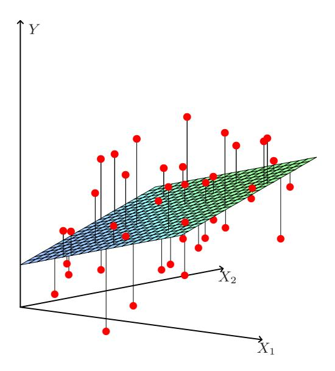
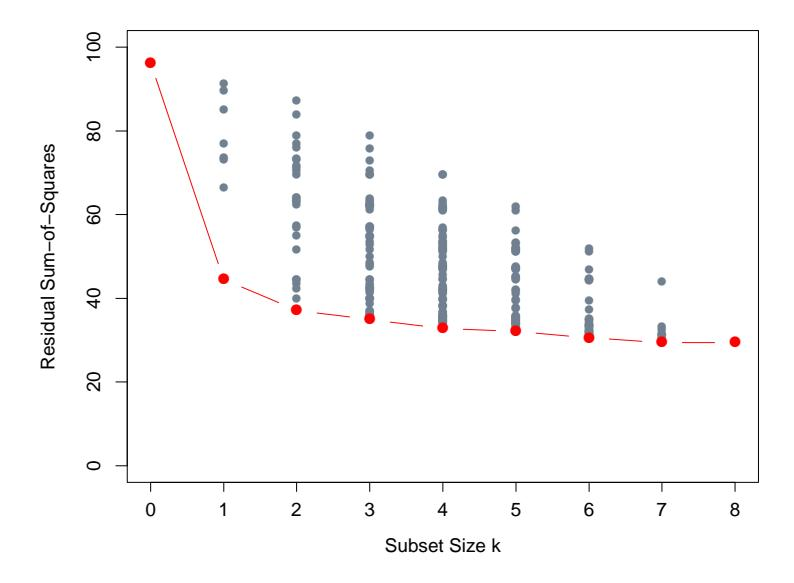
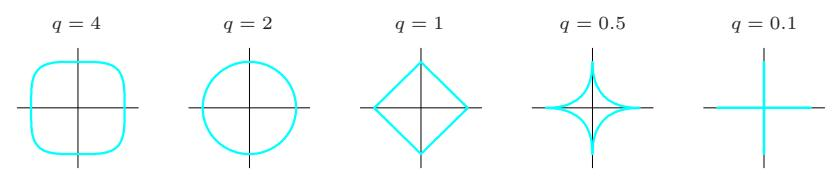
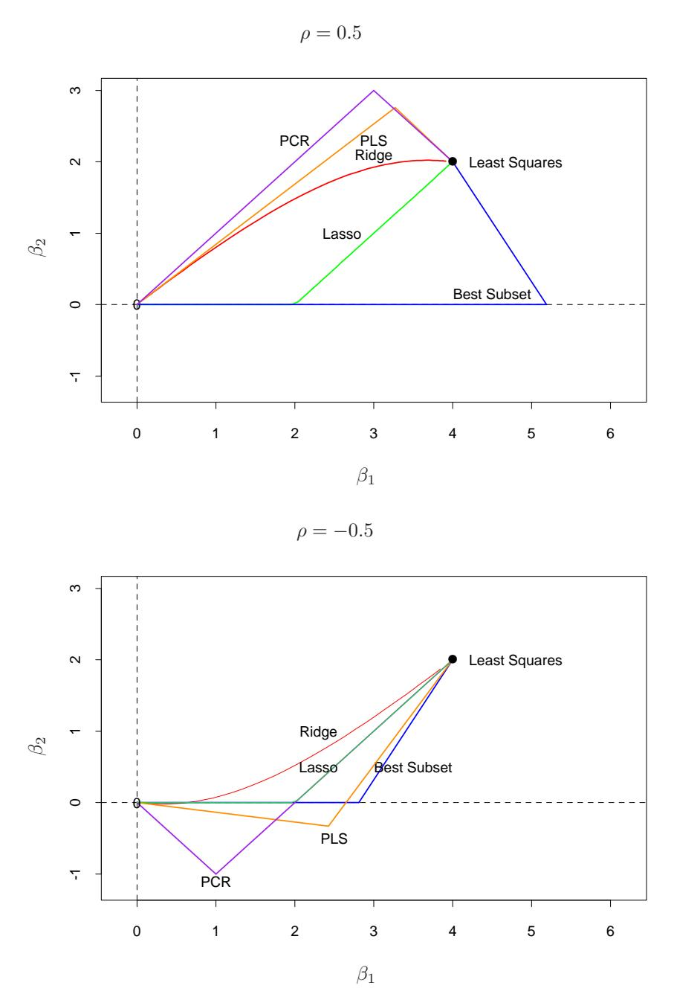
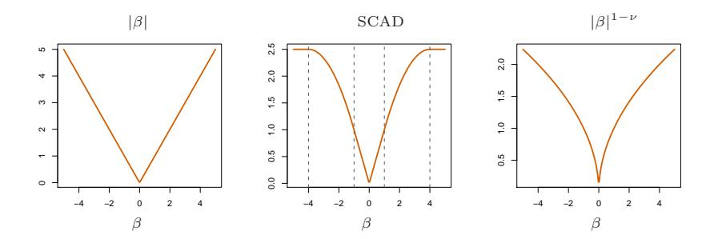

# Linear Methods for Regression

## 3.1 Introduction

A linear regression model assumes that the regression function E(Y |X) is linear in the inputs X1, . . . , Xp. Linear models were largely developed in the precomputer age of statistics, but even in today's computer era there are still good reasons to study and use them. They are simple and often provide an adequate and interpretable description of how the inputs affect the output. For prediction purposes they can sometimes outperform fancier nonlinear models, especially in situations with small numbers of training cases, low signal-to-noise ratio or sparse data. Finally, linear methods can be applied to transformations of the inputs and this considerably expands their scope. These generalizations are sometimes called basis-function methods, and are discussed in Chapter 5.

In this chapter we describe linear methods for regression, while in the next chapter we discuss linear methods for classification. On some topics we go into considerable detail, as it is our firm belief that an understanding of linear methods is essential for understanding nonlinear ones. In fact, many nonlinear techniques are direct generalizations of the linear methods discussed here.

## 3.2 Linear Regression Models and Least Squares

As introduced in Chapter 2, we have an input vector  $X^T = (X_1, X_2, \dots, X_p)$ , and want to predict a real-valued output Y. The linear regression model has the form

$$f(X) = \beta_0 + \sum_{j=1}^{p} X_j \beta_j.$$
 (3.1)

The linear model either assumes that the regression function  $\mathrm{E}(Y|X)$  is linear, or that the linear model is a reasonable approximation. Here the  $\beta_j$ 's are unknown parameters or coefficients, and the variables  $X_j$  can come from different sources:

- quantitative inputs;
- transformations of quantitative inputs, such as log, square-root or square;
- basis expansions, such as  $X_2 = X_1^2$ ,  $X_3 = X_1^3$ , leading to a polynomial representation;
- numeric or "dummy" coding of the levels of qualitative inputs. For example, if G is a five-level factor input, we might create  $X_j$ ,  $j = 1, \ldots, 5$ , such that  $X_j = I(G = j)$ . Together this group of  $X_j$  represents the effect of G by a set of level-dependent constants, since in  $\sum_{j=1}^{5} X_j \beta_j$ , one of the  $X_j$ s is one, and the others are zero.
- interactions between variables, for example,  $X_3 = X_1 \cdot X_2$ .

No matter the source of the  $X_i$ , the model is linear in the parameters.

Typically we have a set of training data  $(x_1, y_1) \dots (x_N, y_N)$  from which to estimate the parameters  $\beta$ . Each  $x_i = (x_{i1}, x_{i2}, \dots, x_{ip})^T$  is a vector of feature measurements for the *i*th case. The most popular estimation method is *least squares*, in which we pick the coefficients  $\beta = (\beta_0, \beta_1, \dots, \beta_p)^T$  to minimize the residual sum of squares

RSS(
$$\beta$$
) =  $\sum_{i=1}^{N} (y_i - f(x_i))^2$
=  $\sum_{i=1}^{N} (y_i - \beta_0 - \sum_{j=1}^{p} x_{ij}\beta_j)^2$ . (3.2)

From a statistical point of view, this criterion is reasonable if the training observations  $(x_i, y_i)$  represent independent random draws from their population. Even if the  $x_i$ 's were not drawn randomly, the criterion is still valid if the  $y_i$ 's are conditionally independent given the inputs  $x_i$ . Figure 3.1 illustrates the geometry of least-squares fitting in the  $\mathbb{R}^{p+1}$ -dimensional

**FIGURE 3.1.** Linear least squares fitting with  $X \in \mathbb{R}^2$ . We seek the linear function of X that minimizes the sum of squared residuals from Y.

space occupied by the pairs (X,Y). Note that (3.2) makes no assumptions about the validity of model (3.1); it simply finds the best linear fit to the data. Least squares fitting is intuitively satisfying no matter how the data arise; the criterion measures the average lack of fit.

How do we minimize (3.2)? Denote by **X** the  $N \times (p+1)$  matrix with each row an input vector (with a 1 in the first position), and similarly let **y** be the N-vector of outputs in the training set. Then we can write the residual sum-of-squares as

$$RSS(\beta) = (\mathbf{y} - \mathbf{X}\beta)^{T}(\mathbf{y} - \mathbf{X}\beta). \tag{3.3}$$

This is a quadratic function in the p+1 parameters. Differentiating with respect to  $\beta$  we obtain

$$\frac{\partial \text{RSS}}{\partial \beta} = -2\mathbf{X}^T (\mathbf{y} - \mathbf{X}\beta)$$

$$\frac{\partial^2 \text{RSS}}{\partial \beta \partial \beta^T} = 2\mathbf{X}^T \mathbf{X}.$$
(3.4)

Assuming (for the moment) that  $\mathbf{X}$  has full column rank, and hence  $\mathbf{X}^T\mathbf{X}$  is positive definite, we set the first derivative to zero

$$\mathbf{X}^{T}(\mathbf{y} - \mathbf{X}\beta) = 0 \tag{3.5}$$

to obtain the unique solution

$$\hat{\beta} = (\mathbf{X}^T \mathbf{X})^{-1} \mathbf{X}^T \mathbf{y}. \tag{3.6}$$

**FIGURE 3.2.** The N-dimensional geometry of least squares regression with two predictors. The outcome vector  $\mathbf{y}$  is orthogonally projected onto the hyperplane spanned by the input vectors  $\mathbf{x}_1$  and  $\mathbf{x}_2$ . The projection  $\hat{\mathbf{y}}$  represents the vector of the least squares predictions

The predicted values at an input vector  $x_0$  are given by  $\hat{f}(x_0) = (1 : x_0)^T \hat{\beta}$ ; the fitted values at the training inputs are

$$\hat{\mathbf{y}} = \mathbf{X}\hat{\boldsymbol{\beta}} = \mathbf{X}(\mathbf{X}^T\mathbf{X})^{-1}\mathbf{X}^T\mathbf{y},\tag{3.7}$$

where  $\hat{y}_i = \hat{f}(x_i)$ . The matrix  $\mathbf{H} = \mathbf{X}(\mathbf{X}^T\mathbf{X})^{-1}\mathbf{X}^T$  appearing in equation (3.7) is sometimes called the "hat" matrix because it puts the hat on  $\mathbf{y}$ .

Figure 3.2 shows a different geometrical representation of the least squares estimate, this time in  $\mathbb{R}^N$ . We denote the column vectors of  $\mathbf{X}$  by  $\mathbf{x}_0, \mathbf{x}_1, \dots, \mathbf{x}_p$ , with  $\mathbf{x}_0 \equiv 1$ . For much of what follows, this first column is treated like any other. These vectors span a subspace of  $\mathbb{R}^N$ , also referred to as the column space of  $\mathbf{X}$ . We minimize  $\mathrm{RSS}(\beta) = \|\mathbf{y} - \mathbf{X}\beta\|^2$  by choosing  $\hat{\beta}$  so that the residual vector  $\mathbf{y} - \hat{\mathbf{y}}$  is orthogonal to this subspace. This orthogonality is expressed in (3.5), and the resulting estimate  $\hat{\mathbf{y}}$  is hence the *orthogonal projection* of  $\mathbf{y}$  onto this subspace. The hat matrix  $\mathbf{H}$  computes the orthogonal projection, and hence it is also known as a projection matrix.

It might happen that the columns of  $\mathbf{X}$  are not linearly independent, so that  $\mathbf{X}$  is not of full rank. This would occur, for example, if two of the inputs were perfectly correlated, (e.g.,  $\mathbf{x}_2 = 3\mathbf{x}_1$ ). Then  $\mathbf{X}^T\mathbf{X}$  is singular and the least squares coefficients  $\hat{\beta}$  are not uniquely defined. However, the fitted values  $\hat{\mathbf{y}} = \mathbf{X}\hat{\beta}$  are still the projection of  $\mathbf{y}$  onto the column space of  $\mathbf{X}$ ; there is just more than one way to express that projection in terms of the column vectors of  $\mathbf{X}$ . The non-full-rank case occurs most often when one or more qualitative inputs are coded in a redundant fashion. There is usually a natural way to resolve the non-unique representation, by recoding and/or dropping redundant columns in  $\mathbf{X}$ . Most regression software packages detect these redundancies and automatically implement

some strategy for removing them. Rank deficiencies can also occur in signal and image analysis, where the number of inputs p can exceed the number of training cases N. In this case, the features are typically reduced by filtering or else the fitting is controlled by regularization (Section 5.2.3 and Chapter 18).

Up to now we have made minimal assumptions about the true distribution of the data. In order to pin down the sampling properties of  $\hat{\beta}$ , we now assume that the observations  $y_i$  are uncorrelated and have constant variance  $\sigma^2$ , and that the  $x_i$  are fixed (non random). The variance—covariance matrix of the least squares parameter estimates is easily derived from (3.6) and is given by

$$Var(\hat{\beta}) = (\mathbf{X}^T \mathbf{X})^{-1} \sigma^2. \tag{3.8}$$

Typically one estimates the variance  $\sigma^2$  by

$$\hat{\sigma}^2 = \frac{1}{N - p - 1} \sum_{i=1}^{N} (y_i - \hat{y}_i)^2.$$

The N-p-1 rather than N in the denominator makes  $\hat{\sigma}^2$  an unbiased estimate of  $\sigma^2$ :  $E(\hat{\sigma}^2) = \sigma^2$ .

To draw inferences about the parameters and the model, additional assumptions are needed. We now assume that (3.1) is the correct model for the mean; that is, the conditional expectation of Y is linear in  $X_1, \ldots, X_p$ . We also assume that the deviations of Y around its expectation are additive and Gaussian. Hence

$$Y = E(Y|X_1, ..., X_p) + \varepsilon$$
$$= \beta_0 + \sum_{j=1}^p X_j \beta_j + \varepsilon, \tag{3.9}$$

where the error  $\varepsilon$  is a Gaussian random variable with expectation zero and variance  $\sigma^2$ , written  $\varepsilon \sim N(0, \sigma^2)$ .

Under (3.9), it is easy to show that

$$\hat{\beta} \sim N(\beta, (\mathbf{X}^T \mathbf{X})^{-1} \sigma^2). \tag{3.10}$$

This is a multivariate normal distribution with mean vector and variance—covariance matrix as shown. Also

$$(N-p-1)\hat{\sigma}^2 \sim \sigma^2 \chi_{N-p-1}^2,$$
 (3.11)

a chi-squared distribution with N-p-1 degrees of freedom. In addition  $\hat{\beta}$  and  $\hat{\sigma}^2$  are statistically independent. We use these distributional properties to form tests of hypothesis and confidence intervals for the parameters  $\beta_i$ .

FIGURE 3.3. The tail probabilities Pr(|Z| > z) for three distributions, t30, t$^{100}$ and standard normal. Shown are the appropriate quantiles for testing significance at the p = 0.05 and 0.01 levels. The difference between t and the standard normal becomes negligible for N bigger than about 100.

To test the hypothesis that a particular coefficient $\beta$$^{j}$ = 0, we form the standardized coefficient or Z-score

$$z_j = \frac{\hat{\beta}_j}{\hat{\sigma}\sqrt{v_j}},\tag{3.12}$$

where v$^{j}$ is the jth diagonal element of (X$^{T}$ X) −1 . Under the null hypothesis that $\beta$$^{j}$ = 0, z$^{j}$ is distributed as tN−p−$^{1}$ (a t distribution with N − p − 1 degrees of freedom), and hence a large (absolute) value of z$^{j}$ will lead to rejection of this null hypothesis. If ˆ$\sigma$ is replaced by a known value $\sigma$, then z$^{j}$ would have a standard normal distribution. The difference between the tail quantiles of a t-distribution and a standard normal become negligible as the sample size increases, and so we typically use the normal quantiles (see Figure 3.3).

Often we need to test for the significance of groups of coefficients simultaneously. For example, to test if a categorical variable with k levels can be excluded from a model, we need to test whether the coefficients of the dummy variables used to represent the levels can all be set to zero. Here we use the F statistic,

$$F = \frac{(RSS_0 - RSS_1)/(p_1 - p_0)}{RSS_1/(N - p_1 - 1)},$$
(3.13)

where RSS$^{1}$ is the residual sum-of-squares for the least squares fit of the bigger model with p1+1 parameters, and RSS$^{0}$ the same for the nested smaller model with p$^{0}$ + 1 parameters, having p$^{1}$ −p$^{0}$ parameters constrained to be

zero. The F statistic measures the change in residual sum-of-squares per additional parameter in the bigger model, and it is normalized by an estimate of  $\sigma^2$ . Under the Gaussian assumptions, and the null hypothesis that the smaller model is correct, the F statistic will have a  $F_{p_1-p_0,N-p_1-1}$  distribution. It can be shown (Exercise 3.1) that the  $z_i$  in (3.12) are equivalent to the F statistic for dropping the single coefficient  $\beta_j$  from the model. For large N, the quantiles of  $F_{p_1-p_0,N-p_1-1}$  approach those of  $\chi^2_{p_1-p_0}/(p_1-p_0)$ . Similarly, we can isolate  $\beta_j$  in (3.10) to obtain a  $1-2\alpha$  confidence interval

for  $\beta_i$ :

$$(\hat{\beta}_j - z^{(1-\alpha)}v_j^{\frac{1}{2}}\hat{\sigma}, \ \hat{\beta}_j + z^{(1-\alpha)}v_j^{\frac{1}{2}}\hat{\sigma}).$$
 (3.14)

Here  $z^{(1-\alpha)}$  is the  $1-\alpha$  percentile of the normal distribution:

$$\begin{array}{lcl} z^{(1-0.025)} & = & 1.96, \\ z^{(1-.05)} & = & 1.645, \ \ \text{etc.} \end{array}$$

Hence the standard practice of reporting  $\hat{\beta} \pm 2 \cdot \text{se}(\hat{\beta})$  amounts to an approximate 95% confidence interval. Even if the Gaussian error assumption does not hold, this interval will be approximately correct, with its coverage approaching  $1-2\alpha$  as the sample size  $N\to\infty$ .

In a similar fashion we can obtain an approximate confidence set for the entire parameter vector  $\beta$ , namely

$$C_{\beta} = \{\beta | (\hat{\beta} - \beta)^T \mathbf{X}^T \mathbf{X} (\hat{\beta} - \beta) \le \hat{\sigma}^2 \chi_{n+1}^2(1-\alpha) \}, \tag{3.15}$$

where  $\chi_{\ell}^2(1-\alpha)$  is the  $1-\alpha$  percentile of the chi-squared distribution on  $\ell$  degrees of freedom: for example,  $\chi_{5}^2(1-0.05)=11.1, \chi_{5}^2(1-0.1)=9.2$ . This confidence set for  $\beta$  generates a corresponding confidence set for the true function  $f(x) = x^T \beta$ , namely  $\{x^T \beta | \beta \in C_\beta\}$  (Exercise 3.2; see also Figure 5.4 in Section 5.2.2 for examples of confidence bands for functions).

### 3.2.1 Example: Prostate Cancer

The data for this example come from a study by Stamev et al. (1989). They examined the correlation between the level of prostate-specific antigen and a number of clinical measures in men who were about to receive a radical prostatectomy. The variables are log cancer volume (lcavol), log prostate weight (lweight), age, log of the amount of benign prostatic hyperplasia (1bph), seminal vesicle invasion (svi), log of capsular penetration (1cp), Gleason score (gleason), and percent of Gleason scores 4 or 5 (pgg45). The correlation matrix of the predictors given in Table 3.1 shows many strong correlations. Figure 1.1 (page 3) of Chapter 1 is a scatterplot matrix showing every pairwise plot between the variables. We see that svi is a binary variable, and gleason is an ordered categorical variable. We see, for

|         | lcavol | lweight | age   | lbph   | svi   | lcp   | gleason |
|---------|--------|---------|-------|--------|-------|-------|---------|
| lweight | 0.300  |         |       |        |       |       |         |
| age     | 0.286  | 0.317   |       |        |       |       |         |
| lbph    | 0.063  | 0.437   | 0.287 |        |       |       |         |
| svi     | 0.593  | 0.181   | 0.129 | -0.139 |       |       |         |
| lcp     | 0.692  | 0.157   | 0.173 | -0.089 | 0.671 |       |         |
| gleason | 0.426  | 0.024   | 0.366 | 0.033  | 0.307 | 0.476 |         |
| pgg45   | 0.483  | 0.074   | 0.276 | -0.030 | 0.481 | 0.663 | 0.757   |

**TABLE 3.1.** Correlations of predictors in the prostate cancer data.

**TABLE 3.2.** Linear model fit to the prostate cancer data. The Z score is the coefficient divided by its standard error (3.12). Roughly a Z score larger than two in absolute value is significantly nonzero at the p=0.05 level.

| Term      | Coefficient | Std. Error | Z Score |
|-----------|-------------|------------|---------|
| Intercept | 2.46        | 0.09       | 27.60   |
| lcavol    | 0.68        | 0.13       | 5.37    |
| lweight   | 0.26        | 0.10       | 2.75    |
| age       | -0.14       | 0.10       | -1.40   |
| lbph      | 0.21        | 0.10       | 2.06    |
| svi       | 0.31        | 0.12       | 2.47    |
| lcp       | -0.29       | 0.15       | -1.87   |
| gleason   | -0.02       | 0.15       | -0.15   |
| pgg45     | 0.27        | 0.15       | 1.74    |

example, that both lcavol and lcp show a strong relationship with the response lpsa, and with each other. We need to fit the effects jointly to untangle the relationships between the predictors and the response.

We fit a linear model to the log of prostate-specific antigen, 1psa, after first standardizing the predictors to have unit variance. We randomly split the dataset into a training set of size 67 and a test set of size 30. We applied least squares estimation to the training set, producing the estimates, standard errors and Z-scores shown in Table 3.2. The Z-scores are defined in (3.12), and measure the effect of dropping that variable from the model. A Z-score greater than 2 in absolute value is approximately significant at the 5% level. (For our example, we have nine parameters, and the 0.025 tail quantiles of the  $t_{67-9}$  distribution are  $\pm 2.002!$ ) The predictor 1cavol shows the strongest effect, with 1weight and svi also strong. Notice that 1cp is not significant, once 1cavol is in the model (when used in a model without 1cavol, 1cp is strongly significant). We can also test for the exclusion of a number of terms at once, using the F-statistic (3.13). For example, we consider dropping all the non-significant terms in Table 3.2, namely age,

lcp, gleason, and pgg45. We get

$$F = \frac{(32.81 - 29.43)/(9 - 5)}{29.43/(67 - 9)} = 1.67,$$
(3.16)

which has a p-value of 0.17 ( $Pr(F_{4,58} > 1.67) = 0.17$ ), and hence is not significant.

The mean prediction error on the test data is 0.521. In contrast, prediction using the mean training value of lpsa has a test error of 1.057, which is called the "base error rate." Hence the linear model reduces the base error rate by about 50%. We will return to this example later to compare various selection and shrinkage methods.

### 3.2.2 The Gauss-Markov Theorem

One of the most famous results in statistics asserts that the least squares estimates of the parameters  $\beta$  have the smallest variance among all linear unbiased estimates. We will make this precise here, and also make clear that the restriction to unbiased estimates is not necessarily a wise one. This observation will lead us to consider biased estimates such as ridge regression later in the chapter. We focus on estimation of any linear combination of the parameters  $\theta = a^T \beta$ ; for example, predictions  $f(x_0) = x_0^T \beta$  are of this form. The least squares estimate of  $a^T \beta$  is

$$\hat{\theta} = a^T \hat{\beta} = a^T (\mathbf{X}^T \mathbf{X})^{-1} \mathbf{X}^T \mathbf{y}. \tag{3.17}$$

Considering **X** to be fixed, this is a linear function  $\mathbf{c}_0^T \mathbf{y}$  of the response vector  $\mathbf{y}$ . If we assume that the linear model is correct,  $a^T \hat{\beta}$  is unbiased since

$$E(a^{T}\hat{\beta}) = E(a^{T}(\mathbf{X}^{T}\mathbf{X})^{-1}\mathbf{X}^{T}\mathbf{y})$$

$$= a^{T}(\mathbf{X}^{T}\mathbf{X})^{-1}\mathbf{X}^{T}\mathbf{X}\beta$$

$$= a^{T}\beta.$$
(3.18)

The Gauss–Markov theorem states that if we have any other linear estimator  $\tilde{\theta} = \mathbf{c}^T \mathbf{y}$  that is unbiased for  $a^T \beta$ , that is,  $\mathbf{E}(\mathbf{c}^T \mathbf{y}) = a^T \beta$ , then

$$\operatorname{Var}(a^T \hat{\beta}) \le \operatorname{Var}(\mathbf{c}^T \mathbf{y}). \tag{3.19}$$

The proof (Exercise 3.3) uses the triangle inequality. For simplicity we have stated the result in terms of estimation of a single parameter  $a^T \beta$ , but with a few more definitions one can state it in terms of the entire parameter vector  $\beta$  (Exercise 3.3).

Consider the mean squared error of an estimator  $\tilde{\theta}$  in estimating  $\theta$ :

$$MSE(\tilde{\theta}) = E(\tilde{\theta} - \theta)^{2}$$
  
=  $Var(\tilde{\theta}) + [E(\tilde{\theta}) - \theta]^{2}$ . (3.20)

The first term is the variance, while the second term is the squared bias. The Gauss-Markov theorem implies that the least squares estimator has the smallest mean squared error of all linear estimators with no bias. However, there may well exist a biased estimator with smaller mean squared error. Such an estimator would trade a little bias for a larger reduction in variance. Biased estimates are commonly used. Any method that shrinks or sets to zero some of the least squares coefficients may result in a biased estimate. We discuss many examples, including variable subset selection and ridge regression, later in this chapter. From a more pragmatic point of view, most models are distortions of the truth, and hence are biased; picking the right model amounts to creating the right balance between bias and variance. We go into these issues in more detail in Chapter 7.

Mean squared error is intimately related to prediction accuracy, as discussed in Chapter 2. Consider the prediction of the new response at input  $x_0$ ,

$$Y_0 = f(x_0) + \varepsilon_0. \tag{3.21}$$

Then the expected prediction error of an estimate  $\tilde{f}(x_0) = x_0^T \tilde{\beta}$  is

$$E(Y_0 - \tilde{f}(x_0))^2 = \sigma^2 + E(x_0^T \tilde{\beta} - f(x_0))^2$$
  
=  $\sigma^2 + \text{MSE}(\tilde{f}(x_0)).$  (3.22)

Therefore, expected prediction error and mean squared error differ only by the constant  $\sigma^2$ , representing the variance of the new observation  $y_0$ .

### 3.2.3 Multiple Regression from Simple Univariate Regression

The linear model (3.1) with p > 1 inputs is called the *multiple linear* regression model. The least squares estimates (3.6) for this model are best understood in terms of the estimates for the *univariate* (p = 1) linear model, as we indicate in this section.

Suppose first that we have a univariate model with no intercept, that is,

$$Y = X\beta + \varepsilon. \tag{3.23}$$

The least squares estimate and residuals are

$$\hat{\beta} = \frac{\sum_{1}^{N} x_{i} y_{i}}{\sum_{1}^{N} x_{i}^{2}},$$

$$r_{i} = y_{i} - x_{i} \hat{\beta}.$$
(3.24)

In convenient vector notation, we let  $\mathbf{y} = (y_1, \dots, y_N)^T$ ,  $\mathbf{x} = (x_1, \dots, x_N)^T$  and define

$$\langle \mathbf{x}, \mathbf{y} \rangle = \sum_{i=1}^{N} x_i y_i,$$
  
=  $\mathbf{x}^T \mathbf{y}$ , (3.25)

the inner product between x and  $y^1$ . Then we can write

$$\hat{\beta} = \frac{\langle \mathbf{x}, \mathbf{y} \rangle}{\langle \mathbf{x}, \mathbf{x} \rangle},$$

$$\mathbf{r} = \mathbf{y} - \mathbf{x}\hat{\beta}.$$
(3.26)

As we will see, this simple univariate regression provides the building block for multiple linear regression. Suppose next that the inputs  $\mathbf{x}_1, \mathbf{x}_2, \dots, \mathbf{x}_p$  (the columns of the data matrix  $\mathbf{X}$ ) are orthogonal; that is  $\langle \mathbf{x}_j, \mathbf{x}_k \rangle = 0$  for all  $j \neq k$ . Then it is easy to check that the multiple least squares estimates  $\hat{\beta}_j$  are equal to  $\langle \mathbf{x}_j, \mathbf{y} \rangle / \langle \mathbf{x}_j, \mathbf{x}_j \rangle$ —the univariate estimates. In other words, when the inputs are orthogonal, they have no effect on each other's parameter estimates in the model.

Orthogonal inputs occur most often with balanced, designed experiments (where orthogonality is enforced), but almost never with observational data. Hence we will have to orthogonalize them in order to carry this idea further. Suppose next that we have an intercept and a single input  $\mathbf{x}$ . Then the least squares coefficient of  $\mathbf{x}$  has the form

$$\hat{\beta}_1 = \frac{\langle \mathbf{x} - \bar{x}\mathbf{1}, \mathbf{y} \rangle}{\langle \mathbf{x} - \bar{x}\mathbf{1}, \mathbf{x} - \bar{x}\mathbf{1} \rangle},\tag{3.27}$$

where  $\bar{x} = \sum_i x_i/N$ , and  $\mathbf{1} = \mathbf{x}_0$ , the vector of N ones. We can view the estimate (3.27) as the result of two applications of the simple regression (3.26). The steps are:

- 1. regress **x** on **1** to produce the residual  $\mathbf{z} = \mathbf{x} \bar{x}\mathbf{1}$ ;
- 1. regress **y** on the residual **z** to give the coefficient  $\hat{\beta}_1$ .

In this procedure, "regress **b** on **a**" means a simple univariate regression of **b** on **a** with no intercept, producing coefficient  $\hat{\gamma} = \langle \mathbf{a}, \mathbf{b} \rangle / \langle \mathbf{a}, \mathbf{a} \rangle$  and residual vector  $\mathbf{b} - \hat{\gamma} \mathbf{a}$ . We say that **b** is adjusted for **a**, or is "orthogonalized" with respect to **a**.

Step 1 orthogonalizes  $\mathbf{x}$  with respect to  $\mathbf{x}_0 = \mathbf{1}$ . Step 2 is just a simple univariate regression, using the orthogonal predictors  $\mathbf{1}$  and  $\mathbf{z}$ . Figure 3.4 shows this process for two general inputs  $\mathbf{x}_1$  and  $\mathbf{x}_2$ . The orthogonalization does not change the subspace spanned by  $\mathbf{x}_1$  and  $\mathbf{x}_2$ , it simply produces an orthogonal basis for representing it.

This recipe generalizes to the case of p inputs, as shown in Algorithm 3.1. Note that the inputs  $\mathbf{z}_0, \dots, \mathbf{z}_{j-1}$  in step 2 are orthogonal, hence the simple regression coefficients computed there are in fact also the multiple regression coefficients.

$ ^{1} $The inner-product notation is suggestive of generalizations of linear regression to different metric spaces, as well as to probability spaces.

**FIGURE 3.4.** Least squares regression by orthogonalization of the inputs. The vector  $\mathbf{x}_2$  is regressed on the vector  $\mathbf{x}_1$ , leaving the residual vector  $\mathbf{z}$ . The regression of  $\mathbf{y}$  on  $\mathbf{z}$  gives the multiple regression coefficient of  $\mathbf{x}_2$ . Adding together the projections of  $\mathbf{y}$  on each of  $\mathbf{x}_1$  and  $\mathbf{z}$  gives the least squares fit  $\hat{\mathbf{y}}$ .

#### Algorithm 3.1 Regression by Successive Orthogonalization

- 1. Initialize  $\mathbf{z}_0 = \mathbf{x}_0 = \mathbf{1}$ .
- 1. For  $j = 1, 2, \dots, p$

Regress
$$\mathbf{x}_j$$
 on  $\mathbf{z}_0, \mathbf{z}_1, \dots, \mathbf{z}_{j-1}$  to produce coefficients  $\hat{\gamma}_{\ell j} = \langle \mathbf{z}_\ell, \mathbf{x}_j \rangle / \langle \mathbf{z}_\ell, \mathbf{z}_\ell \rangle$ ,  $\ell = 0, \dots, j-1$  and residual vector  $\mathbf{z}_j = \mathbf{x}_j - \sum_{k=0}^{j-1} \hat{\gamma}_{kj} \mathbf{z}_k$ .

1. Regress **y** on the residual  $\mathbf{z}_p$  to give the estimate  $\hat{\beta}_p$ .

The result of this algorithm is

$$\hat{\beta}_p = \frac{\langle \mathbf{z}_p, \mathbf{y} \rangle}{\langle \mathbf{z}_p, \mathbf{z}_p \rangle}.$$
 (3.28)

Re-arranging the residual in step 2, we can see that each of the  $\mathbf{x}_j$  is a linear combination of the  $\mathbf{z}_k$ ,  $k \leq j$ . Since the  $\mathbf{z}_j$  are all orthogonal, they form a basis for the column space of  $\mathbf{X}$ , and hence the least squares projection onto this subspace is  $\hat{\mathbf{y}}$ . Since  $\mathbf{z}_p$  alone involves  $\mathbf{x}_p$  (with coefficient 1), we see that the coefficient (3.28) is indeed the multiple regression coefficient of  $\mathbf{y}$  on  $\mathbf{x}_p$ . This key result exposes the effect of correlated inputs in multiple regression. Note also that by rearranging the  $\mathbf{x}_j$ , any one of them could be in the last position, and a similar results holds. Hence stated more generally, we have shown that the jth multiple regression coefficient is the univariate regression coefficient of  $\mathbf{y}$  on  $\mathbf{x}_{j\cdot 012...(j-1)(j+1)...,p}$ , the residual after regressing  $\mathbf{x}_j$  on  $\mathbf{x}_0, \mathbf{x}_1, \ldots, \mathbf{x}_{j-1}, \mathbf{x}_{j+1}, \ldots, \mathbf{x}_p$ :

The multiple regression coefficient  $\hat{\beta}_i$  represents the additional contribution of  $\mathbf{x}_i$  on  $\mathbf{y}$ , after  $\mathbf{x}_i$  has been adjusted for  $\mathbf{x}_0, \mathbf{x}_1, \dots, \mathbf{x}_{i-1}$ ,  $\mathbf{x}_{j+1},\ldots,\mathbf{x}_{p}$ .

If  $\mathbf{x}_p$  is highly correlated with some of the other  $\mathbf{x}_k$ 's, the residual vector  $\mathbf{z}_p$  will be close to zero, and from (3.28) the coefficient  $\hat{\beta}_p$  will be very unstable. This will be true for all the variables in the correlated set. In such situations, we might have all the Z-scores (as in Table 3.2) be small any one of the set can be deleted—yet we cannot delete them all. From (3.28) we also obtain an alternate formula for the variance estimates (3.8),

$$\operatorname{Var}(\hat{\beta}_p) = \frac{\sigma^2}{\langle \mathbf{z}_p, \mathbf{z}_p \rangle} = \frac{\sigma^2}{\|\mathbf{z}_p\|^2}.$$
 (3.29)

In other words, the precision with which we can estimate  $\hat{\beta}_p$  depends on the length of the residual vector  $\mathbf{z}_p$ ; this represents how much of  $\mathbf{x}_p$  is unexplained by the other  $\mathbf{x}_k$ 's.

Algorithm 3.1 is known as the *Gram-Schmidt* procedure for multiple regression, and is also a useful numerical strategy for computing the estimates. We can obtain from it not just  $\hat{\beta}_p$ , but also the entire multiple least squares fit, as shown in Exercise 3.4.

We can represent step 2 of Algorithm 3.1 in matrix form:

$$\mathbf{X} = \mathbf{Z}\mathbf{\Gamma},\tag{3.30}$$

where **Z** has as columns the  $\mathbf{z}_i$  (in order), and  $\Gamma$  is the upper triangular matrix with entries  $\hat{\gamma}_{kj}$ . Introducing the diagonal matrix **D** with jth diagonal entry  $D_{ij} = ||\mathbf{z}_i||$ , we get

$$X = ZD^{-1}D\Gamma$$

$$= QR,$$
(3.31)

the so-called QR decomposition of **X**. Here **Q** is an  $N \times (p+1)$  orthogonal matrix,  $\mathbf{Q}^T\mathbf{Q} = \mathbf{I}$ , and  $\mathbf{R}$  is a  $(p+1) \times (p+1)$  upper triangular matrix.

The QR decomposition represents a convenient orthogonal basis for the column space of X. It is easy to see, for example, that the least squares solution is given by

$$\hat{\beta} = \mathbf{R}^{-1} \mathbf{Q}^T \mathbf{y}, \qquad (3.32)$$

$$\hat{\mathbf{y}} = \mathbf{Q} \mathbf{Q}^T \mathbf{y}. \qquad (3.33)$$

$$\hat{\mathbf{y}} = \mathbf{Q}\mathbf{Q}^T\mathbf{y}. \tag{3.33}$$

Equation (3.32) is easy to solve because **R** is upper triangular (Exercise 3.4).

### 3.2.4 Multiple Outputs

Suppose we have multiple outputs  $Y_1, Y_2, \ldots, Y_K$  that we wish to predict from our inputs  $X_0, X_1, X_2, \ldots, X_p$ . We assume a linear model for each output

$$Y_k = \beta_{0k} + \sum_{j=1}^p X_j \beta_{jk} + \varepsilon_k \tag{3.34}$$

$$= f_k(X) + \varepsilon_k. \tag{3.35}$$

With N training cases we can write the model in matrix notation

$$\mathbf{Y} = \mathbf{XB} + \mathbf{E}.\tag{3.36}$$

Here **Y** is the  $N \times K$  response matrix, with ik entry  $y_{ik}$ , **X** is the  $N \times (p+1)$  input matrix, **B** is the  $(p+1) \times K$  matrix of parameters and **E** is the  $N \times K$  matrix of errors. A straightforward generalization of the univariate loss function (3.2) is

$$RSS(\mathbf{B}) = \sum_{k=1}^{K} \sum_{i=1}^{N} (y_{ik} - f_k(x_i))^2$$
(3.37)

$$= \operatorname{tr}[(\mathbf{Y} - \mathbf{X}\mathbf{B})^{T}(\mathbf{Y} - \mathbf{X}\mathbf{B})]. \tag{3.38}$$

The least squares estimates have exactly the same form as before

$$\hat{\mathbf{B}} = (\mathbf{X}^T \mathbf{X})^{-1} \mathbf{X}^T \mathbf{Y}. \tag{3.39}$$

Hence the coefficients for the kth outcome are just the least squares estimates in the regression of  $\mathbf{y}_k$  on  $\mathbf{x}_0, \mathbf{x}_1, \dots, \mathbf{x}_p$ . Multiple outputs do not affect one another's least squares estimates.

If the errors  $\varepsilon = (\varepsilon_1, \dots, \varepsilon_K)$  in (3.34) are correlated, then it might seem appropriate to modify (3.37) in favor of a multivariate version. Specifically, suppose  $\text{Cov}(\varepsilon) = \Sigma$ , then the multivariate weighted criterion

$$RSS(\mathbf{B}; \mathbf{\Sigma}) = \sum_{i=1}^{N} (y_i - f(x_i))^T \mathbf{\Sigma}^{-1} (y_i - f(x_i))$$
 (3.40)

arises naturally from multivariate Gaussian theory. Here f(x) is the vector function  $(f_1(x), \ldots, f_K(x))^T$ , and  $y_i$  the vector of K responses for observation i. However, it can be shown that again the solution is given by (3.39); K separate regressions that ignore the correlations (Exercise 3.11). If the  $\Sigma_i$  vary among observations, then this is no longer the case, and the solution for  $\mathbf{B}$  no longer decouples.

In Section 3.7 we pursue the multiple outcome problem, and consider situations where it does pay to combine the regressions.

## 3.3 Subset Selection

There are two reasons why we are often not satisfied with the least squares estimates (3.6).

- The first is prediction accuracy: the least squares estimates often have low bias but large variance. Prediction accuracy can sometimes be improved by shrinking or setting some coefficients to zero. By doing so we sacrifice a little bit of bias to reduce the variance of the predicted values, and hence may improve the overall prediction accuracy.
- The second reason is interpretation. With a large number of predictors, we often would like to determine a smaller subset that exhibit the strongest effects. In order to get the "big picture," we are willing to sacrifice some of the small details.

In this section we describe a number of approaches to variable subset selection with linear regression. In later sections we discuss shrinkage and hybrid approaches for controlling variance, as well as other dimension-reduction strategies. These all fall under the general heading model selection. Model selection is not restricted to linear models; Chapter 7 covers this topic in some detail.

With subset selection we retain only a subset of the variables, and eliminate the rest from the model. Least squares regression is used to estimate the coefficients of the inputs that are retained. There are a number of different strategies for choosing the subset.

### 3.3.1 Best-Subset Selection

Best subset regression finds for each k $\in$ {0, 1, 2, . . . , p} the subset of size k that gives smallest residual sum of squares (3.2). An efficient algorithm the leaps and bounds procedure (Furnival and Wilson, 1974)—makes this feasible for p as large as 30 or 40. Figure 3.5 shows all the subset models for the prostate cancer example. The lower boundary represents the models that are eligible for selection by the best-subsets approach. Note that the best subset of size 2, for example, need not include the variable that was in the best subset of size 1 (for this example all the subsets are nested). The best-subset curve (red lower boundary in Figure 3.5) is necessarily decreasing, so cannot be used to select the subset size k. The question of how to choose k involves the tradeoff between bias and variance, along with the more subjective desire for parsimony. There are a number of criteria that one may use; typically we choose the smallest model that minimizes an estimate of the expected prediction error.

Many of the other approaches that we discuss in this chapter are similar, in that they use the training data to produce a sequence of models varying in complexity and indexed by a single parameter. In the next section we use

**FIGURE 3.5.** All possible subset models for the prostate cancer example. At each subset size is shown the residual sum-of-squares for each model of that size.

cross-validation to estimate prediction error and select k; the AIC criterion is a popular alternative. We defer more detailed discussion of these and other approaches to Chapter 7.

### 3.3.2 Forward- and Backward-Stepwise Selection

Rather than search through all possible subsets (which becomes infeasible for p much larger than 40), we can seek a good path through them. Forward-stepwise selection starts with the intercept, and then sequentially adds into the model the predictor that most improves the fit. With many candidate predictors, this might seem like a lot of computation; however, clever updating algorithms can exploit the QR decomposition for the current fit to rapidly establish the next candidate (Exercise 3.9). Like best-subset regression, forward stepwise produces a sequence of models indexed by k, the subset size, which must be determined.

Forward-stepwise selection is a *greedy algorithm*, producing a nested sequence of models. In this sense it might seem sub-optimal compared to best-subset selection. However, there are several reasons why it might be preferred:

- Computational; for large p we cannot compute the best subset sequence, but we can always compute the forward stepwise sequence (even when  $p \gg N$ ).
- Statistical; a price is paid in variance for selecting the best subset of each size; forward stepwise is a more constrained search, and will have lower variance, but perhaps more bias.

![**FIGURE 3.6.** Comparison of four subset-selection techniques on a simulated linear regression problem  $Y = X^T \beta + \varepsilon$ . There are N = 300 observations on p = 31 standard Gaussian variables, with pairwise correlations all equal to 0.85. For 10 of the variables, the coefficients are drawn at random from a N(0,0.4) distribution; the rest are zero. The noise  $\varepsilon \sim N(0,6.25)$ , resulting in a signal-to-noise ratio of 0.64. Results are averaged over 50 simulations. Shown is the mean-squared error of the estimated coefficient  $\hat{\beta}(k)$  at each step from the true  $\beta$ .](../figures/_page_77_Figure_4.jpeg)

**FIGURE 3.6.** Comparison of four subset-selection techniques on a simulated linear regression problem  $Y = X^T \beta + \varepsilon$ . There are N = 300 observations on p = 31 standard Gaussian variables, with pairwise correlations all equal to 0.85. For 10 of the variables, the coefficients are drawn at random from a N(0,0.4) distribution; the rest are zero. The noise  $\varepsilon \sim N(0,6.25)$ , resulting in a signal-to-noise ratio of 0.64. Results are averaged over 50 simulations. Shown is the mean-squared error of the estimated coefficient  $\hat{\beta}(k)$  at each step from the true  $\beta$ .

Backward-stepwise selection starts with the full model, and sequentially deletes the predictor that has the least impact on the fit. The candidate for dropping is the variable with the smallest Z-score (Exercise 3.10). Backward selection can only be used when N>p, while forward stepwise can always be used.

Figure 3.6 shows the results of a small simulation study to compare best-subset regression with the simpler alternatives forward and backward selection. Their performance is very similar, as is often the case. Included in the figure is forward stagewise regression (next section), which takes longer to reach minimum error.

On the prostate cancer example, best-subset, forward and backward selection all gave exactly the same sequence of terms.

Some software packages implement hybrid stepwise-selection strategies that consider both forward and backward moves at each step, and select the "best" of the two. For example in the R package the step function uses the AIC criterion for weighing the choices, which takes proper account of the number of parameters fit; at each step an add or drop will be performed that minimizes the AIC score.

Other more traditional packages base the selection on F-statistics, adding "significant" terms, and dropping "non-significant" terms. These are out of fashion, since they do not take proper account of the multiple testing issues. It is also tempting after a model search to print out a summary of the chosen model, such as in Table 3.2; however, the standard errors are not valid, since they do not account for the search process. The bootstrap (Section 8.2) can be useful in such settings.

Finally, we note that often variables come in groups (such as the dummy variables that code a multi-level categorical predictor). Smart stepwise procedures (such as step in R) will add or drop whole groups at a time, taking proper account of their degrees-of-freedom.

### 3.3.3 Forward-Stagewise Regression

Forward-stagewise regression (FS) is even more constrained than forwardstepwise regression. It starts like forward-stepwise regression, with an intercept equal to ¯y, and centered predictors with coefficients initially all 0. At each step the algorithm identifies the variable most correlated with the current residual. It then computes the simple linear regression coefficient of the residual on this chosen variable, and then adds it to the current coefficient for that variable. This is continued till none of the variables have correlation with the residuals—i.e. the least-squares fit when N > p.

Unlike forward-stepwise regression, none of the other variables are adjusted when a term is added to the model. As a consequence, forward stagewise can take many more than p steps to reach the least squares fit, and historically has been dismissed as being inefficient. It turns out that this "slow fitting" can pay dividends in high-dimensional problems. We see in Section 3.8.1 that both forward stagewise and a variant which is slowed down even further are quite competitive, especially in very highdimensional problems.

Forward-stagewise regression is included in Figure 3.6. In this example it takes over 1000 steps to get all the correlations below 10−$^{4}$ . For subset size k, we plotted the error for the last step for which there where k nonzero coefficients. Although it catches up with the best fit, it takes longer to do so.

### 3.3.4 Prostate Cancer Data Example (Continued)

Table 3.3 shows the coefficients from a number of different selection and shrinkage methods. They are best-subset selection using an all-subsets search, ridge regression, the lasso, principal components regression and partial least squares. Each method has a complexity parameter, and this was chosen to minimize an estimate of prediction error based on tenfold cross-validation; full details are given in Section 7.10. Briefly, cross-validation works by dividing the training data randomly into ten equal parts. The learning method is fit—for a range of values of the complexity parameter—to nine-tenths of the data, and the prediction error is computed on the remaining one-tenth. This is done in turn for each one-tenth of the data, and the ten prediction error estimates are averaged. From this we obtain an estimated prediction error curve as a function of the complexity parameter.

Note that we have already divided these data into a training set of size 67 and a test set of size 30. Cross-validation is applied to the training set, since selecting the shrinkage parameter is part of the training process. The test set is there to judge the performance of the selected model.

The estimated prediction error curves are shown in Figure 3.7. Many of the curves are very flat over large ranges near their minimum. Included are estimated standard error bands for each estimated error rate, based on the ten error estimates computed by cross-validation. We have used the "one-standard-error" rule—we pick the most parsimonious model within one standard error of the minimum (Section 7.10, page 244). Such a rule acknowledges the fact that the tradeoff curve is estimated with error, and hence takes a conservative approach.

Best-subset selection chose to use the two predictors lcvol and lweight. The last two lines of the table give the average prediction error (and its estimated standard error) over the test set.

## 3.4 Shrinkage Methods

By retaining a subset of the predictors and discarding the rest, subset selection produces a model that is interpretable and has possibly lower prediction error than the full model. However, because it is a discrete process variables are either retained or discarded—it often exhibits high variance, and so doesn't reduce the prediction error of the full model. Shrinkage methods are more continuous, and don't suffer as much from high variability.

### 3.4.1 Ridge Regression

Ridge regression shrinks the regression coefficients by imposing a penalty on their size. The ridge coefficients minimize a penalized residual sum of

![FIGURE 3.7. Estimated prediction error curves and their standard errors for the various selection and shrinkage methods. Each curve is plotted as a function of the corresponding complexity parameter for that method. The horizontal axis has been chosen so that the model complexity increases as we move from left to right. The estimates of prediction error and their standard errors were obtained by tenfold cross-validation; full details are given in Section 7.10. The least complex model within one standard error of the best is chosen, indicated by the purple vertical broken lines.](../figures/_page_80_Figure_2.jpeg)

FIGURE 3.7. Estimated prediction error curves and their standard errors for the various selection and shrinkage methods. Each curve is plotted as a function of the corresponding complexity parameter for that method. The horizontal axis has been chosen so that the model complexity increases as we move from left to right. The estimates of prediction error and their standard errors were obtained by tenfold cross-validation; full details are given in Section 7.10. The least complex model within one standard error of the best is chosen, indicated by the purple vertical broken lines.

| Term       | LS     | Best Subset | Ridge  | Lasso | PCR    | PLS    |
|------------|--------|-------------|--------|-------|--------|--------|
| Intercept  | 2.465  | 2.477       | 2.452  | 2.468 | 2.497  | 2.452  |
| lcavol     | 0.680  | 0.740       | 0.420  | 0.533 | 0.543  | 0.419  |
| lweight    | 0.263  | 0.316       | 0.238  | 0.169 | 0.289  | 0.344  |
| age        | -0.141 |             | -0.046 |       | -0.152 | -0.026 |
| lbph       | 0.210  |             | 0.162  | 0.002 | 0.214  | 0.220  |
| svi        | 0.305  |             | 0.227  | 0.094 | 0.315  | 0.243  |
| lcp        | -0.288 |             | 0.000  |       | -0.051 | 0.079  |
| gleason    | -0.021 |             | 0.040  |       | 0.232  | 0.011  |
| pgg45      | 0.267  |             | 0.133  |       | -0.056 | 0.084  |
| Test Error | 0.521  | 0.492       | 0.492  | 0.479 | 0.449  | 0.528  |
| Std Error  | 0.179  | 0.143       | 0.165  | 0.164 | 0.105  | 0.152  |

**TABLE 3.3.** Estimated coefficients and test error results, for different subset and shrinkage methods applied to the prostate data. The blank entries correspond to variables omitted.

squares,

$$\hat{\beta}^{\text{ridge}} = \underset{\beta}{\operatorname{argmin}} \left\{ \sum_{i=1}^{N} (y_i - \beta_0 - \sum_{j=1}^{p} x_{ij} \beta_j)^2 + \lambda \sum_{j=1}^{p} \beta_j^2 \right\}.$$
 (3.41)

Here  $\lambda \geq 0$  is a complexity parameter that controls the amount of shrinkage: the larger the value of  $\lambda$ , the greater the amount of shrinkage. The coefficients are shrunk toward zero (and each other). The idea of penalizing by the sum-of-squares of the parameters is also used in neural networks, where it is known as weight decay (Chapter 11).

An equivalent way to write the ridge problem is

$$\hat{\beta}^{\text{ridge}} = \underset{\beta}{\operatorname{argmin}} \sum_{i=1}^{N} \left( y_i - \beta_0 - \sum_{j=1}^{p} x_{ij} \beta_j \right)^2,$$
subject to
$$\sum_{j=1}^{p} \beta_j^2 \le t,$$
(3.42)

which makes explicit the size constraint on the parameters. There is a one-to-one correspondence between the parameters  $\lambda$  in (3.41) and t in (3.42). When there are many correlated variables in a linear regression model, their coefficients can become poorly determined and exhibit high variance. A wildly large positive coefficient on one variable can be canceled by a similarly large negative coefficient on its correlated cousin. By imposing a size constraint on the coefficients, as in (3.42), this problem is alleviated.

The ridge solutions are not equivariant under scaling of the inputs, and so one normally standardizes the inputs before solving (3.41). In addition,

notice that the intercept  $\beta_0$  has been left out of the penalty term. Penalization of the intercept would make the procedure depend on the origin chosen for Y; that is, adding a constant c to each of the targets  $y_i$  would not simply result in a shift of the predictions by the same amount c. It can be shown (Exercise 3.5) that the solution to (3.41) can be separated into two parts, after reparametrization using centered inputs: each  $x_{ij}$  gets replaced by  $x_{ij} - \bar{x}_j$ . We estimate  $\beta_0$  by  $\bar{y} = \frac{1}{N} \sum_{1}^{N} y_i$ . The remaining coefficients get estimated by a ridge regression without intercept, using the centered  $x_{ij}$ . Henceforth we assume that this centering has been done, so that the input matrix  $\mathbf{X}$  has p (rather than p + 1) columns.

Writing the criterion in (3.41) in matrix form,

$$RSS(\lambda) = (\mathbf{y} - \mathbf{X}\beta)^{T} (\mathbf{y} - \mathbf{X}\beta) + \lambda \beta^{T} \beta, \tag{3.43}$$

the ridge regression solutions are easily seen to be

$$\hat{\beta}^{\text{ridge}} = (\mathbf{X}^T \mathbf{X} + \lambda \mathbf{I})^{-1} \mathbf{X}^T \mathbf{y}, \tag{3.44}$$

where **I** is the  $p \times p$  identity matrix. Notice that with the choice of quadratic penalty  $\beta^T \beta$ , the ridge regression solution is again a linear function of **y**. The solution adds a positive constant to the diagonal of  $\mathbf{X}^T \mathbf{X}$  before inversion. This makes the problem nonsingular, even if  $\mathbf{X}^T \mathbf{X}$  is not of full rank, and was the main motivation for ridge regression when it was first introduced in statistics (Hoerl and Kennard, 1970). Traditional descriptions of ridge regression start with definition (3.44). We choose to motivate it via (3.41) and (3.42), as these provide insight into how it works.

Figure 3.8 shows the ridge coefficient estimates for the prostate cancer example, plotted as functions of  $df(\lambda)$ , the effective degrees of freedom implied by the penalty  $\lambda$  (defined in (3.50) on page 68). In the case of orthonormal inputs, the ridge estimates are just a scaled version of the least squares estimates, that is,  $\hat{\beta}^{\text{ridge}} = \hat{\beta}/(1 + \lambda)$ .

Ridge regression can also be derived as the mean or mode of a posterior distribution, with a suitably chosen prior distribution. In detail, suppose  $y_i \sim N(\beta_0 + x_i^T \beta, \sigma^2)$ , and the parameters  $\beta_j$  are each distributed as  $N(0, \tau^2)$ , independently of one another. Then the (negative) log-posterior density of  $\beta$ , with  $\tau^2$  and  $\sigma^2$  assumed known, is equal to the expression in curly braces in (3.41), with  $\lambda = \sigma^2/\tau^2$  (Exercise 3.6). Thus the ridge estimate is the mode of the posterior distribution; since the distribution is Gaussian, it is also the posterior mean.

The singular value decomposition (SVD) of the centered input matrix  $\mathbf{X}$  gives us some additional insight into the nature of ridge regression. This decomposition is extremely useful in the analysis of many statistical methods. The SVD of the  $N \times p$  matrix  $\mathbf{X}$  has the form

$$\mathbf{X} = \mathbf{U}\mathbf{D}\mathbf{V}^T. \tag{3.45}$$

**FIGURE 3.8.** Profiles of ridge coefficients for the prostate cancer example, as the tuning parameter  $\lambda$  is varied. Coefficients are plotted versus  $df(\lambda)$ , the effective degrees of freedom. A vertical line is drawn at df = 5.0, the value chosen by cross-validation.

Here **U** and **V** are  $N \times p$  and  $p \times p$  orthogonal matrices, with the columns of **U** spanning the column space of **X**, and the columns of **V** spanning the row space. **D** is a  $p \times p$  diagonal matrix, with diagonal entries  $d_1 \geq d_2 \geq \cdots \geq d_p \geq 0$  called the singular values of **X**. If one or more values  $d_j = 0$ , **X** is singular.

Using the singular value decomposition we can write the least squares fitted vector as

$$\mathbf{X}\hat{\beta}^{\text{ls}} = \mathbf{X}(\mathbf{X}^T\mathbf{X})^{-1}\mathbf{X}^T\mathbf{y}$$
$$= \mathbf{U}\mathbf{U}^T\mathbf{y}, \tag{3.46}$$

after some simplification. Note that  $\mathbf{U}^T\mathbf{y}$  are the coordinates of  $\mathbf{y}$  with respect to the orthonormal basis  $\mathbf{U}$ . Note also the similarity with (3.33);  $\mathbf{Q}$  and  $\mathbf{U}$  are generally different orthogonal bases for the column space of  $\mathbf{X}$  (Exercise 3.8).

Now the ridge solutions are

$$\mathbf{X}\hat{\beta}^{\text{ridge}} = \mathbf{X}(\mathbf{X}^{T}\mathbf{X} + \lambda \mathbf{I})^{-1}\mathbf{X}^{T}\mathbf{y}$$

$$= \mathbf{U}\mathbf{D}(\mathbf{D}^{2} + \lambda \mathbf{I})^{-1}\mathbf{D}\mathbf{U}^{T}\mathbf{y}$$

$$= \sum_{j=1}^{p} \mathbf{u}_{j} \frac{d_{j}^{2}}{d_{j}^{2} + \lambda} \mathbf{u}_{j}^{T}\mathbf{y}, \qquad (3.47)$$

where the  $\mathbf{u}_j$  are the columns of  $\mathbf{U}$ . Note that since  $\lambda \geq 0$ , we have  $d_j^2/(d_j^2 + \lambda) \leq 1$ . Like linear regression, ridge regression computes the coordinates of  $\mathbf{y}$  with respect to the orthonormal basis  $\mathbf{U}$ . It then shrinks these coordinates by the factors  $d_j^2/(d_j^2 + \lambda)$ . This means that a greater amount of shrinkage is applied to the coordinates of basis vectors with smaller  $d_j^2$ .

What does a small value of  $d_j^2$  mean? The SVD of the centered matrix **X** is another way of expressing the *principal components* of the variables in **X**. The sample covariance matrix is given by  $\mathbf{S} = \mathbf{X}^T \mathbf{X}/N$ , and from (3.45) we have

$$\mathbf{X}^T \mathbf{X} = \mathbf{V} \mathbf{D}^2 \mathbf{V}^T, \tag{3.48}$$

which is the eigen decomposition of  $\mathbf{X}^T\mathbf{X}$  (and of  $\mathbf{S}$ , up to a factor N). The eigenvectors  $v_j$  (columns of  $\mathbf{V}$ ) are also called the principal components (or Karhunen–Loeve) directions of  $\mathbf{X}$ . The first principal component direction  $v_1$  has the property that  $\mathbf{z}_1 = \mathbf{X}v_1$  has the largest sample variance amongst all normalized linear combinations of the columns of  $\mathbf{X}$ . This sample variance is easily seen to be

$$\operatorname{Var}(\mathbf{z}_1) = \operatorname{Var}(\mathbf{X}v_1) = \frac{d_1^2}{N},\tag{3.49}$$

and in fact  $\mathbf{z}_1 = \mathbf{X}v_1 = \mathbf{u}_1d_1$ . The derived variable  $\mathbf{z}_1$  is called the first principal component of  $\mathbf{X}$ , and hence  $\mathbf{u}_1$  is the normalized first principal

**FIGURE 3.9.** Principal components of some input data points. The largest principal component is the direction that maximizes the variance of the projected data, and the smallest principal component minimizes that variance. Ridge regression projects **y** onto these components, and then shrinks the coefficients of the low-variance components more than the high-variance components.

component. Subsequent principal components  $\mathbf{z}_j$  have maximum variance  $d_j^2/N$ , subject to being orthogonal to the earlier ones. Conversely the last principal component has minimum variance. Hence the small singular values  $d_j$  correspond to directions in the column space of  $\mathbf{X}$  having small variance, and ridge regression shrinks these directions the most.

Figure 3.9 illustrates the principal components of some data points in two dimensions. If we consider fitting a linear surface over this domain (the Y-axis is sticking out of the page), the configuration of the data allow us to determine its gradient more accurately in the long direction than the short. Ridge regression protects against the potentially high variance of gradients estimated in the short directions. The implicit assumption is that the response will tend to vary most in the directions of high variance of the inputs. This is often a reasonable assumption, since predictors are often chosen for study because they vary with the response variable, but need not hold in general.

In Figure 3.7 we have plotted the estimated prediction error versus the quantity

$$df(\lambda) = tr[\mathbf{X}(\mathbf{X}^T\mathbf{X} + \lambda \mathbf{I})^{-1}\mathbf{X}^T],$$

$$= tr(\mathbf{H}_{\lambda})$$

$$= \sum_{j=1}^{p} \frac{d_j^2}{d_j^2 + \lambda}.$$
(3.50)

This monotone decreasing function of  $\lambda$  is the effective degrees of freedom of the ridge regression fit. Usually in a linear-regression fit with p variables, the degrees-of-freedom of the fit is p, the number of free parameters. The idea is that although all p coefficients in a ridge fit will be non-zero, they are fit in a restricted fashion controlled by  $\lambda$ . Note that  $\mathrm{df}(\lambda)=p$  when  $\lambda=0$  (no regularization) and  $\mathrm{df}(\lambda)\to 0$  as  $\lambda\to\infty$ . Of course there is always an additional one degree of freedom for the intercept, which was removed apriori. This definition is motivated in more detail in Section 3.4.4 and Sections 7.4–7.6. In Figure 3.7 the minimum occurs at  $\mathrm{df}(\lambda)=5.0$ . Table 3.3 shows that ridge regression reduces the test error of the full least squares estimates by a small amount.

### 3.4.2 The Lasso

The lasso is a shrinkage method like ridge, with subtle but important differences. The lasso estimate is defined by

$$\hat{\beta}^{\text{lasso}} = \underset{\beta}{\operatorname{argmin}} \sum_{i=1}^{N} \left( y_i - \beta_0 - \sum_{j=1}^{p} x_{ij} \beta_j \right)^2$$
subject to
$$\sum_{j=1}^{p} |\beta_j| \le t.$$
(3.51)

Just as in ridge regression, we can re-parametrize the constant  $\beta_0$  by standardizing the predictors; the solution for  $\hat{\beta}_0$  is  $\bar{y}$ , and thereafter we fit a model without an intercept (Exercise 3.5). In the signal processing literature, the lasso is also known as *basis pursuit* (Chen et al., 1998).

We can also write the lasso problem in the equivalent Lagrangian form

$$\hat{\beta}^{\text{lasso}} = \underset{\beta}{\operatorname{argmin}} \left\{ \frac{1}{2} \sum_{i=1}^{N} (y_i - \beta_0 - \sum_{j=1}^{p} x_{ij} \beta_j)^2 + \lambda \sum_{j=1}^{p} |\beta_j| \right\}.$$
(3.52)

Notice the similarity to the ridge regression problem (3.42) or (3.41): the  $L_2$  ridge penalty  $\sum_{1}^{p} \beta_j^2$  is replaced by the  $L_1$  lasso penalty  $\sum_{1}^{p} |\beta_j|$ . This latter constraint makes the solutions nonlinear in the  $y_i$ , and there is no closed form expression as in ridge regression. Computing the lasso solution

is a quadratic programming problem, although we see in Section 3.4.4 that efficient algorithms are available for computing the entire path of solutions as  $\lambda$  is varied, with the same computational cost as for ridge regression. Because of the nature of the constraint, making t sufficiently small will cause some of the coefficients to be exactly zero. Thus the lasso does a kind of continuous subset selection. If t is chosen larger than  $t_0 = \sum_1^p |\hat{\beta}_j|$  (where  $\hat{\beta}_j = \hat{\beta}_j^{\text{ls}}$ , the least squares estimates), then the lasso estimates are the  $\hat{\beta}_j$ 's. On the other hand, for  $t = t_0/2$  say, then the least squares coefficients are shrunk by about 50% on average. However, the nature of the shrinkage is not obvious, and we investigate it further in Section 3.4.4 below. Like the subset size in variable subset selection, or the penalty parameter in ridge regression, t should be adaptively chosen to minimize an estimate of expected prediction error.

In Figure 3.7, for ease of interpretation, we have plotted the lasso prediction error estimates versus the standardized parameter  $s=t/\sum_1^p |\hat{\beta}_j|$ . A value  $\hat{s}\approx 0.36$  was chosen by 10-fold cross-validation; this caused four coefficients to be set to zero (fifth column of Table 3.3). The resulting model has the second lowest test error, slightly lower than the full least squares model, but the standard errors of the test error estimates (last line of Table 3.3) are fairly large.

Figure 3.10 shows the lasso coefficients as the standardized tuning parameter  $s=t/\sum_1^p|\hat{\beta}_j|$  is varied. At s=1.0 these are the least squares estimates; they decrease to 0 as  $s\to 0$ . This decrease is not always strictly monotonic, although it is in this example. A vertical line is drawn at s=0.36, the value chosen by cross-validation.

## 3.4.3 Discussion: Subset Selection, Ridge Regression and the Lasso

In this section we discuss and compare the three approaches discussed so far for restricting the linear regression model: subset selection, ridge regression and the lasso.

In the case of an orthonormal input matrix **X** the three procedures have explicit solutions. Each method applies a simple transformation to the least squares estimate  $\hat{\beta}_i$ , as detailed in Table 3.4.

Ridge regression does a proportional shrinkage. Lasso translates each coefficient by a constant factor  $\lambda$ , truncating at zero. This is called "soft thresholding," and is used in the context of wavelet-based smoothing in Section 5.9. Best-subset selection drops all variables with coefficients smaller than the Mth largest; this is a form of "hard-thresholding."

Back to the nonorthogonal case; some pictures help understand their relationship. Figure 3.11 depicts the lasso (left) and ridge regression (right) when there are only two parameters. The residual sum of squares has elliptical contours, centered at the full least squares estimate. The constraint

**FIGURE 3.10.** Profiles of lasso coefficients, as the tuning parameter t is varied. Coefficients are plotted versus  $s = t/\sum_{1}^{p} |\hat{\beta}_{j}|$ . A vertical line is drawn at s = 0.36, the value chosen by cross-validation. Compare Figure 3.8 on page 65; the lasso profiles hit zero, while those for ridge do not. The profiles are piece-wise linear, and so are computed only at the points displayed; see Section 3.4.4 for details.

**TABLE 3.4.** Estimators of  $\beta_j$  in the case of orthonormal columns of  $\mathbf{X}$ . M and  $\lambda$  are constants chosen by the corresponding techniques; sign denotes the sign of its argument ( $\pm 1$ ), and  $x_+$  denotes "positive part" of x. Below the table, estimators are shown by broken red lines. The  $45^{\circ}$  line in gray shows the unrestricted estimate for reference.

| Estimator | Formula |
|:----------|:--------|
| Best subset (size $M$) | $hat{beta}_j cdot I(|hat{beta}_j| ge |hat{beta}_{(M)}|)$ |
| Ridge | $hat{beta}_j / (1 + lambda)$ |
| Lasso | $operatorname{sign}(hat{beta}_j)(|hat{beta}_j| - lambda)_+$ |

**FIGURE 3.11.** Estimation picture for the lasso (left) and ridge regression (right). Shown are contours of the error and constraint functions. The solid blue areas are the constraint regions  $|\beta_1| + |\beta_2| \le t$  and  $\beta_1^2 + \beta_2^2 \le t^2$ , respectively, while the red ellipses are the contours of the least squares error function.

region for ridge regression is the disk  $\beta_1^2 + \beta_2^2 \leq t$ , while that for lasso is the diamond  $|\beta_1| + |\beta_2| \leq t$ . Both methods find the first point where the elliptical contours hit the constraint region. Unlike the disk, the diamond has corners; if the solution occurs at a corner, then it has one parameter  $\beta_j$  equal to zero. When p > 2, the diamond becomes a rhomboid, and has many corners, flat edges and faces; there are many more opportunities for the estimated parameters to be zero.

We can generalize ridge regression and the lasso, and view them as Bayes estimates. Consider the criterion

$$\tilde{\beta} = \underset{\beta}{\operatorname{argmin}} \left\{ \sum_{i=1}^{N} (y_i - \beta_0 - \sum_{j=1}^{p} x_{ij} \beta_j)^2 + \lambda \sum_{j=1}^{p} |\beta_j|^q \right\}$$
(3.53)

for  $q \geq 0$ . The contours of constant value of  $\sum_j |\beta_j|^q$  are shown in Figure 3.12, for the case of two inputs.

Thinking of  $|\beta_j|^q$  as the log-prior density for  $\beta_j$ , these are also the equicontours of the prior distribution of the parameters. The value q=0 corresponds to variable subset selection, as the penalty simply counts the number of nonzero parameters; q=1 corresponds to the lasso, while q=2 to ridge regression. Notice that for  $q\leq 1$ , the prior is not uniform in direction, but concentrates more mass in the coordinate directions. The prior corresponding to the q=1 case is an independent double exponential (or Laplace) distribution for each input, with density  $(1/2\tau) \exp(-|\beta|/\tau)$  and  $\tau=1/\lambda$ . The case q=1 (lasso) is the smallest q such that the constraint region is convex; non-convex constraint regions make the optimization problem more difficult.

In this view, the lasso, ridge regression and best subset selection are Bayes estimates with different priors. Note, however, that they are derived as posterior modes, that is, maximizers of the posterior. It is more common to use the mean of the posterior as the Bayes estimate. Ridge regression is also the posterior mean, but the lasso and best subset selection are not.

Looking again at the criterion (3.53), we might try using other values of q besides 0, 1, or 2. Although one might consider estimating q from the data, our experience is that it is not worth the effort for the extra variance incurred. Values of  $q \in (1,2)$  suggest a compromise between the lasso and ridge regression. Although this is the case, with q > 1,  $|\beta_j|^q$  is differentiable at 0, and so does not share the ability of lasso (q = 1) for

**FIGURE 3.12.** Contours of constant value of  $\sum_{j} |\beta_{j}|^{q}$  for given values of q.

**FIGURE 3.13.** Contours of constant value of  $\sum_{j} |\beta_{j}|^{q}$  for q = 1.2 (left plot), and the elastic-net penalty  $\sum_{j} (\alpha \beta_{j}^{2} + (1-\alpha)|\beta_{j}|)$  for  $\alpha = 0.2$  (right plot). Although visually very similar, the elastic-net has sharp (non-differentiable) corners, while the q = 1.2 penalty does not.

setting coefficients exactly to zero. Partly for this reason as well as for computational tractability, Zou and Hastie (2005) introduced the *elastic-net* penalty

$$\lambda \sum_{j=1}^{p} \left( \alpha \beta_j^2 + (1 - \alpha) |\beta_j| \right), \tag{3.54}$$

a different compromise between ridge and lasso. Figure 3.13 compares the  $L_q$  penalty with q=1.2 and the elastic-net penalty with  $\alpha=0.2$ ; it is hard to detect the difference by eye. The elastic-net selects variables like the lasso, and shrinks together the coefficients of correlated predictors like ridge. It also has considerable computational advantages over the  $L_q$  penalties. We discuss the elastic-net further in Section 18.4.

### 3.4.4 Least Angle Regression

Least angle regression (LAR) is a relative newcomer (Efron et al., 2004), and can be viewed as a kind of "democratic" version of forward stepwise regression (Section 3.3.2). As we will see, LAR is intimately connected with the lasso, and in fact provides an extremely efficient algorithm for computing the entire lasso path as in Figure 3.10.

Forward stepwise regression builds a model sequentially, adding one variable at a time. At each step, it identifies the best variable to include in the active set, and then updates the least squares fit to include all the active variables.

Least angle regression uses a similar strategy, but only enters "as much" of a predictor as it deserves. At the first step it identifies the variable most correlated with the response. Rather than fit this variable completely, LAR moves the coefficient of this variable continuously toward its least-squares value (causing its correlation with the evolving residual to decrease in absolute value). As soon as another variable "catches up" in terms of correlation with the residual, the process is paused. The second variable then joins the active set, and their coefficients are moved together in a way that keeps their correlations tied and decreasing. This process is continued

until all the variables are in the model, and ends at the full least-squares fit. Algorithm 3.2 provides the details. The termination condition in step 5 requires some explanation. If p > N-1, the LAR algorithm reaches a zero residual solution after N-1 steps (the -1 is because we have centered the data).

#### Algorithm 3.2 Least Angle Regression

- 1. Standardize the predictors to have mean zero and unit norm. Start with the residual  $\mathbf{r} = \mathbf{y} \bar{\mathbf{y}}, \, \beta_1, \beta_2, \dots, \beta_p = 0$ .
- 1. Find the predictor  $\mathbf{x}_i$  most correlated with  $\mathbf{r}$ .
- 1. Move  $\beta_j$  from 0 towards its least-squares coefficient  $\langle \mathbf{x}_j, \mathbf{r} \rangle$ , until some other competitor  $\mathbf{x}_k$  has as much correlation with the current residual as does  $\mathbf{x}_j$ .
- 1. Move  $\beta_j$  and  $\beta_k$  in the direction defined by their joint least squares coefficient of the current residual on  $(\mathbf{x}_j, \mathbf{x}_k)$ , until some other competitor  $\mathbf{x}_l$  has as much correlation with the current residual.
- 1. Continue in this way until all p predictors have been entered. After  $\min(N-1,p)$  steps, we arrive at the full least-squares solution.

Suppose  $\mathcal{A}_k$  is the active set of variables at the beginning of the kth step, and let  $\beta_{\mathcal{A}_k}$  be the coefficient vector for these variables at this step; there will be k-1 nonzero values, and the one just entered will be zero. If  $\mathbf{r}_k = \mathbf{y} - \mathbf{X}_{\mathcal{A}_k} \beta_{\mathcal{A}_k}$  is the current residual, then the direction for this step is

$$\delta_k = (\mathbf{X}_{\mathcal{A}_k}^T \mathbf{X}_{\mathcal{A}_k})^{-1} \mathbf{X}_{\mathcal{A}_k}^T \mathbf{r}_k. \tag{3.55}$$

The coefficient profile then evolves as  $\beta_{\mathcal{A}_k}(\alpha) = \beta_{\mathcal{A}_k} + \alpha \cdot \delta_k$ . Exercise 3.23 verifies that the directions chosen in this fashion do what is claimed: keep the correlations tied and decreasing. If the fit vector at the beginning of this step is  $\hat{\mathbf{f}}_k$ , then it evolves as  $\hat{\mathbf{f}}_k(\alpha) = \hat{\mathbf{f}}_k + \alpha \cdot \mathbf{u}_k$ , where  $\mathbf{u}_k = \mathbf{X}_{\mathcal{A}_k}\delta_k$  is the new fit direction. The name "least angle" arises from a geometrical interpretation of this process;  $\mathbf{u}_k$  makes the smallest (and equal) angle with each of the predictors in  $\mathcal{A}_k$  (Exercise 3.24). Figure 3.14 shows the absolute correlations decreasing and joining ranks with each step of the LAR algorithm, using simulated data.

By construction the coefficients in LAR change in a piecewise linear fashion. Figure 3.15 [left panel] shows the LAR coefficient profile evolving as a function of their  $L_1$  arc length $^{2}$. Note that we do not need to take small

$ ^{2} $The  $L_1$  arc-length of a differentiable curve  $\beta(s)$  for  $s \in [0, S]$  is given by  $\text{TV}(\beta, S) = \int_0^S ||\dot{\beta}(s)||_1 ds$ , where  $\dot{\beta}(s) = \partial \beta(s)/\partial s$ . For the piecewise-linear LAR coefficient profile, this amounts to summing the  $L_1$  norms of the changes in coefficients from step to step.

FIGURE 3.14. Progression of the absolute correlations during each step of the LAR procedure, using a simulated data set with six predictors. The labels at the top of the plot indicate which variables enter the active set at each step. The step length are measured in units of L$^{1}$ arc length.

FIGURE 3.15. Left panel shows the LAR coefficient profiles on the simulated data, as a function of the L$^{1}$ arc length. The right panel shows the Lasso profile. They are identical until the dark-blue coefficient crosses zero at an arc length of about 18.

steps and recheck the correlations in step 3; using knowledge of the covariance of the predictors and the piecewise linearity of the algorithm, we can work out the exact step length at the beginning of each step (Exercise 3.25).

The right panel of Figure 3.15 shows the lasso coefficient profiles on the same data. They are almost identical to those in the left panel, and differ for the first time when the blue coefficient passes back through zero. For the prostate data, the LAR coefficient profile turns out to be identical to the lasso profile in Figure 3.10, which never crosses zero. These observations lead to a simple modification of the LAR algorithm that gives the entire lasso path, which is also piecewise-linear.

#### Algorithm 3.2a Least Angle Regression: Lasso Modification

4a. If a non-zero coefficient hits zero, drop its variable from the active set of variables and recompute the current joint least squares direction.

The LAR(lasso) algorithm is extremely efficient, requiring the same order of computation as that of a single least squares fit using the p predictors. Least angle regression always takes p steps to get to the full least squares estimates. The lasso path can have more than p steps, although the two are often quite similar. Algorithm 3.2 with the lasso modification 3.2a is an efficient way of computing the solution to any lasso problem, especially when  $p \gg N$ . Osborne et al. (2000a) also discovered a piecewise-linear path for computing the lasso, which they called a homotopy algorithm.

We now give a heuristic argument for why these procedures are so similar. Although the LAR algorithm is stated in terms of correlations, if the input features are standardized, it is equivalent and easier to work with inner-products. Suppose  $\mathcal A$  is the active set of variables at some stage in the algorithm, tied in their absolute inner-product with the current residuals  $\mathbf y - \mathbf X \boldsymbol \beta$ . We can express this as

$$\mathbf{x}_{j}^{T}(\mathbf{y} - \mathbf{X}\beta) = \gamma \cdot s_{j}, \ \forall j \in \mathcal{A}$$
 (3.56)

where  $s_j \in \{-1, 1\}$  indicates the sign of the inner-product, and  $\gamma$  is the common value. Also  $|\mathbf{x}_k^T(\mathbf{y} - \mathbf{X}\beta)| \leq \gamma \ \forall k \notin \mathcal{A}$ . Now consider the lasso criterion (3.52), which we write in vector form

$$R(\beta) = \frac{1}{2} ||\mathbf{y} - \mathbf{X}\beta||_2^2 + \lambda ||\beta||_1.$$
 (3.57)

Let  $\mathcal{B}$  be the active set of variables in the solution for a given value of  $\lambda$ . For these variables  $R(\beta)$  is differentiable, and the stationarity conditions give

$$\mathbf{x}_{i}^{T}(\mathbf{y} - \mathbf{X}\boldsymbol{\beta}) = \lambda \cdot \operatorname{sign}(\boldsymbol{\beta}_{i}), \ \forall j \in \mathcal{B}$$
 (3.58)

Comparing (3.58) with (3.56), we see that they are identical only if the sign of  $\beta_i$  matches the sign of the inner product. That is why the LAR

algorithm and lasso start to differ when an active coefficient passes through zero; condition (3.58) is violated for that variable, and it is kicked out of the active set  $\mathcal{B}$ . Exercise 3.23 shows that these equations imply a piecewise-linear coefficient profile as  $\lambda$  decreases. The stationarity conditions for the non-active variables require that

$$|\mathbf{x}_k^T(\mathbf{y} - \mathbf{X}\beta)| \le \lambda, \ \forall k \notin \mathcal{B},$$
 (3.59)

which again agrees with the LAR algorithm.

Figure 3.16 compares LAR and lasso to forward stepwise and stagewise regression. The setup is the same as in Figure 3.6 on page 59, except here N=100 here rather than 300, so the problem is more difficult. We see that the more aggressive forward stepwise starts to overfit quite early (well before the 10 true variables can enter the model), and ultimately performs worse than the slower forward stagewise regression. The behavior of LAR and lasso is similar to that of forward stagewise regression. Incremental forward stagewise is similar to LAR and lasso, and is described in Section 3.8.1.

#### Degrees-of-Freedom Formula for LAR and Lasso

Suppose that we fit a linear model via the least angle regression procedure, stopping at some number of steps k < p, or equivalently using a lasso bound t that produces a constrained version of the full least squares fit. How many parameters, or "degrees of freedom" have we used?

Consider first a linear regression using a subset of k features. If this subset is prespecified in advance without reference to the training data, then the degrees of freedom used in the fitted model is defined to be k. Indeed, in classical statistics, the number of linearly independent parameters is what is meant by "degrees of freedom." Alternatively, suppose that we carry out a best subset selection to determine the "optimal" set of k predictors. Then the resulting model has k parameters, but in some sense we have used up more than k degrees of freedom.

We need a more general definition for the effective degrees of freedom of an adaptively fitted model. We define the degrees of freedom of the fitted vector  $\hat{\mathbf{y}} = (\hat{y}_1, \hat{y}_2, \dots, \hat{y}_N)$  as

$$\mathrm{df}(\hat{\mathbf{y}}) = \frac{1}{\sigma^2} \sum_{i=1}^{N} \mathrm{Cov}(\hat{y}_i, y_i). \tag{3.60}$$

Here  $\text{Cov}(\hat{y}_i, y_i)$  refers to the sampling covariance between the predicted value  $\hat{y}_i$  and its corresponding outcome value  $y_i$ . This makes intuitive sense: the harder that we fit to the data, the larger this covariance and hence  $\text{df}(\hat{\mathbf{y}})$ . Expression (3.60) is a useful notion of degrees of freedom, one that can be applied to any model prediction  $\hat{\mathbf{y}}$ . This includes models that are

![FIGURE 3.16. Comparison of LAR and lasso with forward stepwise, forward stagewise (FS) and incremental forward stagewise (FS0) regression. The setup is the same as in Figure 3.6, except N = 100 here rather than 300. Here the slower FS regression ultimately outperforms forward stepwise. LAR and lasso show similar behavior to FS and FS0. Since the procedures take different numbers of steps (across simulation replicates and methods), we plot the MSE as a function of the fraction of total L$^{1}$ arc-length toward the least-squares fit.](../figures/_page_96_Figure_2.jpeg)

FIGURE 3.16. Comparison of LAR and lasso with forward stepwise, forward stagewise (FS) and incremental forward stagewise (FS0) regression. The setup is the same as in Figure 3.6, except N = 100 here rather than 300. Here the slower FS regression ultimately outperforms forward stepwise. LAR and lasso show similar behavior to FS and FS0. Since the procedures take different numbers of steps (across simulation replicates and methods), we plot the MSE as a function of the fraction of total L$^{1}$ arc-length toward the least-squares fit.

adaptively fitted to the training data. This definition is motivated and discussed further in Sections 7.4–7.6.

Now for a linear regression with k fixed predictors, it is easy to show that df(yˆ) = k. Likewise for ridge regression, this definition leads to the closed-form expression (3.50) on page 68: df(yˆ) = tr(S$\lambda$). In both these cases, (3.60) is simple to evaluate because the fit yˆ = H$\lambda$y is linear in y. If we think about definition (3.60) in the context of a best subset selection of size k, it seems clear that df(yˆ) will be larger than k, and this can be verified by estimating Cov(ˆy$^{i}$ , yi)/$\sigma$$^{2}$ directly by simulation. However there is no closed form method for estimating df(yˆ) for best subset selection.

For LAR and lasso, something magical happens. These techniques are adaptive in a smoother way than best subset selection, and hence estimation of degrees of freedom is more tractable. Specifically it can be shown that after the kth step of the LAR procedure, the effective degrees of freedom of the fit vector is exactly k. Now for the lasso, the (modified) LAR procedure often takes more than p steps, since predictors can drop out. Hence the definition is a little different; for the lasso, at any stage df(yˆ) approximately equals the number of predictors in the model. While this approximation works reasonably well anywhere in the lasso path, for each k it works best at the last model in the sequence that contains k predictors. A detailed study of the degrees of freedom for the lasso may be found in Zou et al. (2007).

## 3.5 Methods Using Derived Input Directions

In many situations we have a large number of inputs, often very correlated. The methods in this section produce a small number of linear combinations Zm, m = 1, . . . , M of the original inputs X$^{j}$ , and the Z$^{m}$ are then used in place of the X$^{j}$ as inputs in the regression. The methods differ in how the linear combinations are constructed.

### 3.5.1 Principal Components Regression

In this approach the linear combinations Z$^{m}$ used are the principal components as defined in Section 3.4.1 above.

Principal component regression forms the derived input columns z$^{m}$ = Xvm, and then regresses y on z1, z2, . . . , z$^{M}$ for some M $\le$ p. Since the z$^{m}$ are orthogonal, this regression is just a sum of univariate regressions:

$$\hat{\mathbf{y}}_{(M)}^{\text{pcr}} = \bar{y}\mathbf{1} + \sum_{m=1}^{M} \hat{\theta}_{m}\mathbf{z}_{m}, \tag{3.61}$$

where $^{ˆ}$$\theta$$^{m}$ $^{=}$ $^{h}$zm, $^{y}$i/hzm, $^{z}$mi. Since the $^{z}$$^{m}$ are each linear combinations of the original x$^{j}$ , we can express the solution (3.61) in terms of coefficients of the x$^{j}$ (Exercise 3.13):

$$\hat{\beta}^{\text{pcr}}(M) = \sum_{m=1}^{M} \hat{\theta}_m v_m. \tag{3.62}$$

As with ridge regression, principal components depend on the scaling of the inputs, so typically we first standardize them. Note that if M = p, we would just get back the usual least squares estimates, since the columns of Z = UD span the column space of X. For M < p we get a reduced regression. We see that principal components regression is very similar to ridge regression: both operate via the principal components of the input matrix. Ridge regression shrinks the coefficients of the principal components (Figure 3.17), shrinking more depending on the size of the corresponding eigenvalue; principal components regression discards the p − M smallest eigenvalue components. Figure 3.17 illustrates this.

**FIGURE 3.17.** Ridge regression shrinks the regression coefficients of the principal components, using shrinkage factors  $d_j^2/(d_j^2 + \lambda)$  as in (3.47). Principal component regression truncates them. Shown are the shrinkage and truncation patterns corresponding to Figure 3.7, as a function of the principal component index.

In Figure 3.7 we see that cross-validation suggests seven terms; the resulting model has the lowest test error in Table 3.3.

### 3.5.2 Partial Least Squares

This technique also constructs a set of linear combinations of the inputs for regression, but unlike principal components regression it uses y (in addition to X) for this construction. Like principal component regression, partial least squares (PLS) is not scale invariant, so we assume that each  $\mathbf{x}_i$  is standardized to have mean 0 and variance 1. PLS begins by computing  $\hat{\varphi}_{1j} = \langle \mathbf{x}_j, \mathbf{y} \rangle$  for each j. From this we construct the derived input  $\mathbf{z}_1 = \sum_j \hat{\varphi}_{1j} \mathbf{x}_j$ , which is the first partial least squares direction. Hence in the construction of each  $\mathbf{z}_m$ , the inputs are weighted by the strength of their univariate effect on  $y^3$ . The outcome y is regressed on  $z_1$  giving coefficient  $\hat{\theta}_1$ , and then we orthogonalize  $\mathbf{x}_1, \dots, \mathbf{x}_p$  with respect to  $\mathbf{z}_1$ . We continue this process, until  $M \leq p$  directions have been obtained. In this manner, partial least squares produces a sequence of derived, orthogonal inputs or directions  $\mathbf{z}_1, \mathbf{z}_2, \dots, \mathbf{z}_M$ . As with principal-component regression, if we were to construct all M = p directions, we would get back a solution equivalent to the usual least squares estimates; using M < p directions produces a reduced regression. The procedure is described fully in Algorithm 3.3.

$ ^{3} $Since the  $\mathbf{x}_j$  are standardized, the first directions  $\hat{\varphi}_{1j}$  are the univariate regression coefficients (up to an irrelevant constant); this is not the case for subsequent directions.

#### Algorithm 3.3 Partial Least Squares

- 1. Standardize each  $\mathbf{x}_j$  to have mean zero and variance one. Set  $\hat{\mathbf{y}}^{(0)} = \bar{y}\mathbf{1}$ , and  $\mathbf{x}_j^{(0)} = \mathbf{x}_j$ ,  $j = 1, \dots, p$ .
- 1. For m = 1, 2, ..., p

(a)
$$\mathbf{z}_m = \sum_{j=1}^p \hat{\varphi}_{mj} \mathbf{x}_j^{(m-1)}$$
, where  $\hat{\varphi}_{mj} = \langle \mathbf{x}_j^{(m-1)}, \mathbf{y} \rangle$ .

- (b)  $\hat{\theta}_m = \langle \mathbf{z}_m, \mathbf{y} \rangle / \langle \mathbf{z}_m, \mathbf{z}_m \rangle$ .
- (c)  $\hat{\mathbf{y}}^{(m)} = \hat{\mathbf{y}}^{(m-1)} + \hat{\theta}_m \mathbf{z}_m$ .
- (d) Orthogonalize each  $\mathbf{x}_{j}^{(m-1)}$  with respect to  $\mathbf{z}_{m}$ :  $\mathbf{x}_{j}^{(m)} = \mathbf{x}_{j}^{(m-1)} [\langle \mathbf{z}_{m}, \mathbf{x}_{j}^{(m-1)} \rangle / \langle \mathbf{z}_{m}, \mathbf{z}_{m} \rangle] \mathbf{z}_{m}$ ,  $j = 1, 2, \dots, p$ .
- 1. Output the sequence of fitted vectors  $\{\hat{\mathbf{y}}^{(m)}\}_1^p$ . Since the  $\{\mathbf{z}_\ell\}_1^m$  are linear in the original  $\mathbf{x}_j$ , so is  $\hat{\mathbf{y}}^{(m)} = \mathbf{X}\hat{\beta}^{\mathrm{pls}}(m)$ . These linear coefficients can be recovered from the sequence of PLS transformations.

In the prostate cancer example, cross-validation chose M=2 PLS directions in Figure 3.7. This produced the model given in the rightmost column of Table 3.3.

What optimization problem is partial least squares solving? Since it uses the response  $\mathbf{y}$  to construct its directions, its solution path is a nonlinear function of  $\mathbf{y}$ . It can be shown (Exercise 3.15) that partial least squares seeks directions that have high variance and have high correlation with the response, in contrast to principal components regression which keys only on high variance (Stone and Brooks, 1990; Frank and Friedman, 1993). In particular, the mth principal component direction  $v_m$  solves:

$$\max_{\alpha} \operatorname{Var}(\mathbf{X}\alpha)$$
 subject to  $||\alpha|| = 1, \ \alpha^T \mathbf{S} v_{\ell} = 0, \ \ell = 1, \dots, m-1,$

where **S** is the sample covariance matrix of the  $\mathbf{x}_j$ . The conditions  $\alpha^T \mathbf{S} v_\ell = 0$  ensures that  $\mathbf{z}_m = \mathbf{X}\alpha$  is uncorrelated with all the previous linear combinations  $\mathbf{z}_\ell = \mathbf{X} v_\ell$ . The *m*th PLS direction  $\hat{\varphi}_m$  solves:

$$\max_{\alpha} \operatorname{Corr}^{2}(\mathbf{y}, \mathbf{X}\alpha) \operatorname{Var}(\mathbf{X}\alpha)$$
 subject to  $||\alpha|| = 1, \ \alpha^{T} \mathbf{S} \hat{\varphi}_{\ell} = 0, \ \ell = 1, \dots, m - 1.$  (3.64)

Further analysis reveals that the variance aspect tends to dominate, and so partial least squares behaves much like ridge regression and principal components regression. We discuss this further in the next section.

If the input matrix  $\mathbf{X}$  is orthogonal, then partial least squares finds the least squares estimates after m=1 steps. Subsequent steps have no effect

since the ˆ$\phi$mj are zero for m > 1 (Exercise 3.14). It can also be shown that the sequence of PLS coefficients for m = 1, 2, . . . , p represents the conjugate gradient sequence for computing the least squares solutions (Exercise 3.18).

## 3.6 Discussion: A Comparison of the Selection and Shrinkage Methods

There are some simple settings where we can understand better the relationship between the different methods described above. Consider an example with two correlated inputs X$^{1}$ and X2, with correlation $\rho$. We assume that the true regression coefficients are $\beta$$^{1}$ = 4 and $\beta$$^{2}$ = 2. Figure 3.18 shows the coefficient profiles for the different methods, as their tuning parameters are varied. The top panel has $\rho$ = 0.5, the bottom panel $\rho$ = −0.5. The tuning parameters for ridge and lasso vary over a continuous range, while best subset, PLS and PCR take just two discrete steps to the least squares solution. In the top panel, starting at the origin, ridge regression shrinks the coefficients together until it finally converges to least squares. PLS and PCR show similar behavior to ridge, although are discrete and more extreme. Best subset overshoots the solution and then backtracks. The behavior of the lasso is intermediate to the other methods. When the correlation is negative (lower panel), again PLS and PCR roughly track the ridge path, while all of the methods are more similar to one another.

It is interesting to compare the shrinkage behavior of these different methods. Recall that ridge regression shrinks all directions, but shrinks low-variance directions more. Principal components regression leaves M high-variance directions alone, and discards the rest. Interestingly, it can be shown that partial least squares also tends to shrink the low-variance directions, but can actually inflate some of the higher variance directions. This can make PLS a little unstable, and cause it to have slightly higher prediction error compared to ridge regression. A full study is given in Frank and Friedman (1993). These authors conclude that for minimizing prediction error, ridge regression is generally preferable to variable subset selection, principal components regression and partial least squares. However the improvement over the latter two methods was only slight.

To summarize, PLS, PCR and ridge regression tend to behave similarly. Ridge regression may be preferred because it shrinks smoothly, rather than in discrete steps. Lasso falls somewhere between ridge regression and best subset regression, and enjoys some of the properties of each.

FIGURE 3.18. Coefficient profiles from different methods for a simple problem: two inputs with correlation $\pm$0.5, and the true regression coefficients $\beta$ = (4, 2).

## 3.7 Multiple Outcome Shrinkage and Selection

As noted in Section 3.2.4, the least squares estimates in a multiple-output linear model are simply the individual least squares estimates for each of the outputs.

To apply selection and shrinkage methods in the multiple output case, one could apply a univariate technique individually to each outcome or simultaneously to all outcomes. With ridge regression, for example, we could apply formula (3.44) to each of the K columns of the outcome matrix Y , using possibly different parameters $\lambda$, or apply it to all columns using the same value of $\lambda$. The former strategy would allow different amounts of regularization to be applied to different outcomes but require estimation of k separate regularization parameters $\lambda$1, . . . , $\lambda$k, while the latter would permit all k outputs to be used in estimating the sole regularization parameter $\lambda$.

Other more sophisticated shrinkage and selection strategies that exploit correlations in the different responses can be helpful in the multiple output case. Suppose for example that among the outputs we have

$$Y_k = f(X) + \varepsilon_k \tag{3.65}$$

$$Y_{\ell} = f(X) + \varepsilon_{\ell}; \tag{3.66}$$

i.e., (3.65) and (3.66) share the same structural part f(X) in their models. It is clear in this case that we should pool our observations on Y$^{k}$ and Y$^{l}$ to estimate the common f.

Combining responses is at the heart of canonical correlation analysis (CCA), a data reduction technique developed for the multiple output case. Similar to PCA, CCA finds a sequence of uncorrelated linear combinations Xvm, m = 1, . . . , M of the x$^{j}$ , and a corresponding sequence of uncorrelated linear combinations Yu$^{m}$ of the responses yk, such that the correlations

$$Corr^2(\mathbf{Y}u_m, \mathbf{X}v_m) \tag{3.67}$$

are successively maximized. Note that at most M = min(K, p) directions can be found. The leading canonical response variates are those linear combinations (derived responses) best predicted by the x$^{j}$ ; in contrast, the trailing canonical variates can be poorly predicted by the x$^{j}$ , and are candidates for being dropped. The CCA solution is computed using a generalized SVD of the sample cross-covariance matrix Y$^{T}$ X/N (assuming Y and X are centered; Exercise 3.20).

Reduced-rank regression (Izenman, 1975; van der Merwe and Zidek, 1980) formalizes this approach in terms of a regression model that explicitly pools information. Given an error covariance Cov($\epsilon$) = $\Sigma$, we solve the following restricted multivariate regression problem:

$$\hat{\mathbf{B}}^{\mathrm{rr}}(m) = \underset{\mathrm{rank}(\mathbf{B})=m}{\operatorname{argmin}} \sum_{i=1}^{N} (y_i - \mathbf{B}^T x_i)^T \mathbf{\Sigma}^{-1} (y_i - \mathbf{B}^T x_i). \tag{3.68}$$

With  $\Sigma$  replaced by the estimate  $\mathbf{Y}^T\mathbf{Y}/N$ , one can show (Exercise 3.21) that the solution is given by a CCA of  $\mathbf{Y}$  and  $\mathbf{X}$ :

$$\hat{\mathbf{B}}^{\mathrm{rr}}(m) = \hat{\mathbf{B}}\mathbf{U}_m\mathbf{U}_m^-,\tag{3.69}$$

where  $\mathbf{U}_m$  is the  $K \times m$  sub-matrix of  $\mathbf{U}$  consisting of the first m columns, and  $\mathbf{U}$  is the  $K \times M$  matrix of *left* canonical vectors  $u_1, u_2, \ldots, u_M$ .  $\mathbf{U}_m^-$  is its generalized inverse. Writing the solution as

$$\hat{\mathbf{B}}^{\mathrm{rr}}(M) = (\mathbf{X}^T \mathbf{X})^{-1} \mathbf{X}^T (\mathbf{Y} \mathbf{U}_m) \mathbf{U}_m^-, \tag{3.70}$$

we see that reduced-rank regression performs a linear regression on the pooled response matrix  $\mathbf{Y}\mathbf{U}_m$ , and then maps the coefficients (and hence the fits as well) back to the original response space. The reduced-rank fits are given by

$$\hat{\mathbf{Y}}^{\mathrm{rr}}(m) = \mathbf{X}(\mathbf{X}^T \mathbf{X})^{-1} \mathbf{X}^T \mathbf{Y} \mathbf{U}_m \mathbf{U}_m^-$$

$$= \mathbf{H} \mathbf{Y} \mathbf{P}_m.$$
(3.71)

where **H** is the usual linear regression projection operator, and  $\mathbf{P}_m$  is the rank-m CCA response projection operator. Although a better estimate of  $\mathbf{\Sigma}$  would be  $(\mathbf{Y} - \mathbf{X}\hat{\mathbf{B}})^T (\mathbf{Y} - \mathbf{X}\hat{\mathbf{B}})/(N - pK)$ , one can show that the solution remains the same (Exercise 3.22).

Reduced-rank regression borrows strength among responses by truncating the CCA. Breiman and Friedman (1997) explored with some success shrinkage of the canonical variates between  $\mathbf{X}$  and  $\mathbf{Y}$ , a smooth version of reduced rank regression. Their proposal has the form (compare (3.69))

$$\hat{\mathbf{B}}^{c+w} = \hat{\mathbf{B}} \mathbf{U} \Lambda \mathbf{U}^{-1}, \tag{3.72}$$

where  $\Lambda$  is a diagonal shrinkage matrix (the "c+w" stands for "Curds and Whey," the name they gave to their procedure). Based on optimal prediction in the population setting, they show that  $\Lambda$  has diagonal entries

$$\lambda_m = \frac{c_m^2}{c_m^2 + \frac{p}{N}(1 - c_m^2)}, \ m = 1, \dots, M,$$
 (3.73)

where  $c_m$  is the mth canonical correlation coefficient. Note that as the ratio of the number of input variables to sample size p/N gets small, the shrinkage factors approach 1. Breiman and Friedman (1997) proposed modified versions of  $\Lambda$  based on training data and cross-validation, but the general form is the same. Here the fitted response has the form

$$\hat{\mathbf{Y}}^{c+w} = \mathbf{HYS}^{c+w}, \tag{3.74}$$

where S c+w = UΛU$^{−}$$^{1}$ is the response shrinkage operator.

Breiman and Friedman (1997) also suggested shrinking in both the Y space and X space. This leads to hybrid shrinkage models of the form

$$\hat{\mathbf{Y}}^{\text{ridge,c+w}} = \mathbf{A}_{\lambda} \mathbf{Y} \mathbf{S}^{\text{c+w}}, \tag{3.75}$$

where A$^{\lambda}$ = X(X$^{T}$ X+$\lambda$I) $^{−}$1X$^{T}$ is the ridge regression shrinkage operator, as in (3.46) on page 66. Their paper and the discussions thereof contain many more details.

## 3.8 More on the Lasso and Related Path Algorithms

Since the publication of the LAR algorithm (Efron et al., 2004) there has been a lot of activity in developing algorithms for fitting regularization paths for a variety of different problems. In addition, L$^{1}$ regularization has taken on a life of its own, leading to the development of the field compressed sensing in the signal-processing literature. (Donoho, 2006a; Candes, 2006). In this section we discuss some related proposals and other path algorithms, starting off with a precursor to the LAR algorithm.

### 3.8.1 Incremental Forward Stagewise Regression

Here we present another LAR-like algorithm, this time focused on forward stagewise regression. Interestingly, efforts to understand a flexible nonlinear regression procedure (boosting) led to a new algorithm for linear models (LAR). In reading the first edition of this book and the forward stagewise

#### Algorithm 3.4 Incremental Forward Stagewise Regression—FS$\epsilon$

- 1. Start with the residual r equal to y and $\beta$1, $\beta$2, . . . , $\beta$$^{p}$ = 0. All the predictors are standardized to have mean zero and unit norm.
- 1. Find the predictor x$^{j}$ most correlated with r
- 1. Update $\beta$$^{j}$ ← $\beta$$^{j}$ + $\delta$$^{j}$ , where $\delta$$^{j}$ = $\epsilon$ $\cdot$ sign[hx$^{j}$ , ri] and $\epsilon$ > 0 is a small step size, and set r ← r − $\delta$jx$^{j}$ .
- 1. Repeat steps 2 and 3 many times, until the residuals are uncorrelated with all the predictors.

Algorithm 16.1 of Chapter 16$^{4}$ , our colleague Brad Efron realized that with

$^{4}$ In the first edition, this was Algorithm 10.4 in Chapter 10.

**FIGURE 3.19.** Coefficient profiles for the prostate data. The left panel shows incremental forward stagewise regression with step size  $\epsilon = 0.01$ . The right panel shows the infinitesimal version  $FS_0$  obtained letting  $\epsilon \to 0$ . This profile was fit by the modification 3.2b to the LAR Algorithm 3.2. In this example the  $FS_0$  profiles are monotone, and hence identical to those of lasso and LAR.

linear models, one could explicitly construct the piecewise-linear lasso paths of Figure 3.10. This led him to propose the LAR procedure of Section 3.4.4, as well as the incremental version of forward-stagewise regression presented here.

Consider the linear-regression version of the forward-stagewise boosting algorithm 16.1 proposed in Section 16.1 (page 608). It generates a coefficient profile by repeatedly updating (by a small amount  $\epsilon$ ) the coefficient of the variable most correlated with the current residuals. Algorithm 3.4 gives the details. Figure 3.19 (left panel) shows the progress of the algorithm on the prostate data with step size  $\epsilon = 0.01$ . If  $\delta_j = \langle \mathbf{x}_j, \mathbf{r} \rangle$  (the least-squares coefficient of the residual on jth predictor), then this is exactly the usual forward stagewise procedure (FS) outlined in Section 3.3.3.

Here we are mainly interested in small values of  $\epsilon$ . Letting  $\epsilon \to 0$  gives the right panel of Figure 3.19, which in this case is identical to the lasso path in Figure 3.10. We call this limiting procedure infinitesimal forward stagewise regression or FS$_{0}$. This procedure plays an important role in non-linear, adaptive methods like boosting (Chapters 10 and 16) and is the version of incremental forward stagewise regression that is most amenable to theoretical analysis. Bühlmann and Hothorn (2007) refer to the same procedure as "L2boost", because of its connections to boosting.

Efron originally thought that the LAR Algorithm 3.2 was an implementation of FS0, allowing each tied predictor a chance to update their coefficients in a balanced way, while remaining tied in correlation. However, he then realized that the LAR least-squares fit amongst the tied predictors can result in coefficients moving in the opposite direction to their correlation, which cannot happen in Algorithm 3.4. The following modification of the LAR algorithm implements FS0:

#### Algorithm 3.2b Least Angle Regression: FS$^{0}$ Modification

1. Find the new direction by solving the constrained least squares problem

$$\min_{b} ||\mathbf{r} - \mathbf{X}_{\mathcal{A}}b||_2^2 \text{ subject to } b_j s_j \ge 0, \ j \in \mathcal{A},$$

where s$^{j}$ is the sign of hx$^{j}$ , ri.

The modification amounts to a non-negative least squares fit, keeping the signs of the coefficients the same as those of the correlations. One can show that this achieves the optimal balancing of infinitesimal "update turns" for the variables tied for maximal correlation (Hastie et al., 2007). Like lasso, the entire FS$^{0}$ path can be computed very efficiently via the LAR algorithm.

As a consequence of these results, if the LAR profiles are monotone nonincreasing or non-decreasing, as they are in Figure 3.19, then all three methods—LAR, lasso, and FS0—give identical profiles. If the profiles are not monotone but do not cross the zero axis, then LAR and lasso are identical.

Since FS$^{0}$ is different from the lasso, it is natural to ask if it optimizes a criterion. The answer is more complex than for lasso; the FS$^{0}$ coefficient profile is the solution to a differential equation. While the lasso makes optimal progress in terms of reducing the residual sum-of-squares per unit increase in L1-norm of the coefficient vector $\beta$, FS$^{0}$ is optimal per unit increase in L$^{1}$ arc-length traveled along the coefficient path. Hence its coefficient path is discouraged from changing directions too often.

FS$^{0}$ is more constrained than lasso, and in fact can be viewed as a monotone version of the lasso; see Figure 16.3 on page 614 for a dramatic example. FS$^{0}$ may be useful in p ≫ N situations, where its coefficient profiles are much smoother and hence have less variance than those of lasso. More details on FS$^{0}$ are given in Section 16.2.3 and Hastie et al. (2007). Figure 3.16 includes FS$^{0}$ where its performance is very similar to that of the lasso.

### 3.8.2 Piecewise-Linear Path Algorithms

The least angle regression procedure exploits the piecewise linear nature of the lasso solution paths. It has led to similar "path algorithms" for other regularized problems. Suppose we solve

$$\hat{\beta}(\lambda) = \operatorname{argmin}_{\beta} \left[ R(\beta) + \lambda J(\beta) \right], \tag{3.76}$$

with

$$R(\beta) = \sum_{i=1}^{N} L(y_i, \beta_0 + \sum_{j=1}^{p} x_{ij}\beta_j),$$
 (3.77)

where both the loss function L and the penalty function J are convex. Then the following are sufficient conditions for the solution path $\beta$ˆ($\lambda$) to be piecewise linear (Rosset and Zhu, 2007):

- 1. R is quadratic or piecewise-quadratic as a function of $\beta$, and
- 1. J is piecewise linear in $\beta$.

This also implies (in principle) that the solution path can be efficiently computed. Examples include squared- and absolute-error loss, "Huberized" losses, and the L1, L$^{\infty}$ penalties on $\beta$. Another example is the "hinge loss" function used in the support vector machine. There the loss is piecewise linear, and the penalty is quadratic. Interestingly, this leads to a piecewiselinear path algorithm in the dual space; more details are given in Section 12.3.5.

### 3.8.3 The Dantzig Selector

Candes and Tao (2007) proposed the following criterion:

$$\min_{\beta} ||\beta||_1 \text{ subject to } ||\mathbf{X}^T(\mathbf{y} - \mathbf{X}\beta)||_{\infty} \le s.$$
 (3.78)

They call the solution the Dantzig selector (DS). It can be written equivalently as

$$\min_{\beta} ||\mathbf{X}^{T}(\mathbf{y} - \mathbf{X}\beta)||_{\infty} \text{ subject to } ||\beta||_{1} \le t.$$
 (3.79)

Here || $\cdot$ ||$^{\infty}$ denotes the L$^{\infty}$ norm, the maximum absolute value of the components of the vector. In this form it resembles the lasso, replacing squared error loss by the maximum absolute value of its gradient. Note that as t gets large, both procedures yield the least squares solution if N < p. If p $\ge$ N, they both yield the least squares solution with minimum L$^{1}$ norm. However for smaller values of t, the DS procedure produces a different path of solutions than the lasso.

Candes and Tao (2007) show that the solution to DS is a linear programming problem; hence the name Dantzig selector, in honor of the late George Dantzig, the inventor of the simplex method for linear programming. They also prove a number of interesting mathematical properties for the method, related to its ability to recover an underlying sparse coefficient vector. These same properties also hold for the lasso, as shown later by Bickel et al. (2008).

Unfortunately the operating properties of the DS method are somewhat unsatisfactory. The method seems similar in spirit to the lasso, especially when we look at the lasso's stationary conditions (3.58). Like the LAR algorithm, the lasso maintains the same inner product (and correlation) with the current residual for all variables in the active set, and moves their coefficients to optimally decrease the residual sum of squares. In the process, this common correlation is decreased monotonically (Exercise 3.23), and at all times this correlation is larger than that for non-active variables. The Dantzig selector instead tries to minimize the maximum inner product of the current residual with all the predictors. Hence it can achieve a smaller maximum than the lasso, but in the process a curious phenomenon can occur. If the size of the active set is m, there will be m variables tied with maximum correlation. However, these need not coincide with the active set! Hence it can include a variable in the model that has smaller correlation with the current residual than some of the excluded variables (Efron et al., 2007). This seems unreasonable and may be responsible for its sometimes inferior prediction accuracy. Efron et al. (2007) also show that DS can yield extremely erratic coefficient paths as the regularization parameter s is varied.

### 3.8.4 The Grouped Lasso

In some problems, the predictors belong to pre-defined groups; for example genes that belong to the same biological pathway, or collections of indicator (dummy) variables for representing the levels of a categorical predictor. In this situation it may be desirable to shrink and select the members of a group together. The grouped lasso is one way to achieve this. Suppose that the p predictors are divided into L groups, with p$^{\ell}$ the number in group $\ell$. For ease of notation, we use a matrix X$^{\ell}$ to represent the predictors corresponding to the $\ell$th group, with corresponding coefficient vector $\beta$$\ell$. The grouped-lasso minimizes the convex criterion

$$\min_{\beta \in \mathbb{R}^p} \left( ||\mathbf{y} - \beta_0 \mathbf{1} - \sum_{\ell=1}^L \mathbf{X}_{\ell} \beta_{\ell}||_2^2 + \lambda \sum_{\ell=1}^L \sqrt{p_{\ell}} ||\beta_{\ell}||_2 \right), \tag{3.80}$$

where the $^{\sqrt{}}$p$^{\ell}$ terms accounts for the varying group sizes, and || $\cdot$ ||$^{2}$ is the Euclidean norm (not squared). Since the Euclidean norm of a vector $\beta$$^{\ell}$ is zero only if all of its components are zero, this procedure encourages sparsity at both the group and individual levels. That is, for some values of $\lambda$, an entire group of predictors may drop out of the model. This procedure was proposed by Bakin (1999) and Lin and Zhang (2006), and studied and generalized by Yuan and Lin (2007). Generalizations include more general  $L_2$  norms  $||\eta||_K = (\eta^T K \eta)^{1/2}$ , as well as allowing overlapping groups of predictors (Zhao et al., 2008). There are also connections to methods for fitting sparse additive models (Lin and Zhang, 2006; Ravikumar et al., 2008).

### 3.8.5 Further Properties of the Lasso

A number of authors have studied the ability of the lasso and related procedures to recover the correct model, as N and p grow. Examples of this work include Knight and Fu (2000), Greenshtein and Ritov (2004), Tropp (2004), Donoho (2006b), Meinshausen (2007), Meinshausen and Bühlmann (2006), Tropp (2006), Zhao and Yu (2006), Wainwright (2006), and Bunea et al. (2007). For example Donoho (2006b) focuses on the p > N case and considers the lasso solution as the bound t gets large. In the limit this gives the solution with minimum  $L_1$  norm among all models with zero training error. He shows that under certain assumptions on the model matrix  $\mathbf{X}$ , if the true model is sparse, this solution identifies the correct predictors with high probability.

Many of the results in this area assume a condition on the model matrix of the form

$$\max_{j \in \mathcal{S}^c} ||\mathbf{x}_j^T \mathbf{X}_{\mathcal{S}} (\mathbf{X}_{\mathcal{S}}^T \mathbf{X}_{\mathcal{S}})^{-1}||_1 \le (1 - \epsilon) \text{ for some } \epsilon \in (0, 1].$$
 (3.81)

Here S indexes the subset of features with non-zero coefficients in the true underlying model, and  $X_S$  are the columns of X corresponding to those features. Similarly  $S^c$  are the features with true coefficients equal to zero, and  $X_{S^c}$  the corresponding columns. This says that the least squares coefficients for the columns of  $X_{S^c}$  on  $X_S$  are not too large, that is, the "good" variables S are not too highly correlated with the nuisance variables  $S^c$ .

Regarding the coefficients themselves, the lasso shrinkage causes the estimates of the non-zero coefficients to be biased towards zero, and in general they are not consistent$^{5}$. One approach for reducing this bias is to run the lasso to identify the set of non-zero coefficients, and then fit an unrestricted linear model to the selected set of features. This is not always feasible, if the selected set is large. Alternatively, one can use the lasso to select the set of non-zero predictors, and then apply the lasso again, but using only the selected predictors from the first step. This is known as the relaxed lasso (Meinshausen, 2007). The idea is to use cross-validation to estimate the initial penalty parameter for the lasso, and then again for a second penalty parameter applied to the selected set of predictors. Since

 $$^{^5}$$ Statistical consistency means as the sample size grows, the estimates converge to the true values.

the variables in the second step have less "competition" from noise variables, cross-validation will tend to pick a smaller value for  $\lambda$ , and hence their coefficients will be shrunken less than those in the initial estimate.

Alternatively, one can modify the lasso penalty function so that larger coefficients are shrunken less severely; the *smoothly clipped absolute deviation* (SCAD) penalty of Fan and Li (2005) replaces  $\lambda |\beta|$  by  $J_a(\beta, \lambda)$ , where

$$\frac{dJ_a(\beta,\lambda)}{d\beta} = \lambda \cdot \operatorname{sign}(\beta) \left[ I(|\beta| \le \lambda) + \frac{(a\lambda - |\beta|)_+}{(a-1)\lambda} I(|\beta| > \lambda) \right]$$
(3.82)

for some  $a \geq 2$ . The second term in square-braces reduces the amount of shrinkage in the lasso for larger values of  $\beta$ , with ultimately no shrinkage as  $a \to \infty$ . Figure 3.20 shows the SCAD penalty, along with the lasso and

**FIGURE 3.20.** The lasso and two alternative non-convex penalties designed to penalties large coefficients less. For SCAD we use  $\lambda = 1$  and a = 4, and  $\nu = \frac{1}{2}$  in the last panel.

 $|\beta|^{1-\nu}$ . However this criterion is non-convex, which is a drawback since it makes the computation much more difficult. The *adaptive lasso* (Zou, 2006) uses a weighted penalty of the form  $\sum_{j=1}^p w_j |\beta_j|$  where  $w_j = 1/|\hat{\beta}_j|^{\nu}$ ,  $\hat{\beta}_j$  is the ordinary least squares estimate and  $\nu > 0$ . This is a practical approximation to the  $|\beta|^q$  penalties ( $q = 1 - \nu$  here) discussed in Section 3.4.3. The adaptive lasso yields consistent estimates of the parameters while retaining the attractive convexity property of the lasso.

### 3.8.6 Pathwise Coordinate Optimization

An alternate approach to the LARS algorithm for computing the lasso solution is simple coordinate descent. This idea was proposed by Fu (1998) and Daubechies et al. (2004), and later studied and generalized by Friedman et al. (2007), Wu and Lange (2008) and others. The idea is to fix the penalty parameter  $\lambda$  in the Lagrangian form (3.52) and optimize successively over each parameter, holding the other parameters fixed at their current values.

Suppose the predictors are all standardized to have mean zero and unit norm. Denote by  $\tilde{\beta}_k(\lambda)$  the current estimate for  $\beta_k$  at penalty parameter

 $\lambda$ . We can rearrange (3.52) to isolate  $\beta_i$ ,

$$R(\tilde{\beta}(\lambda), \beta_j) = \frac{1}{2} \sum_{i=1}^{N} \left( y_i - \sum_{k \neq j} x_{ik} \tilde{\beta}_k(\lambda) - x_{ij} \beta_j \right)^2 + \lambda \sum_{k \neq j} |\tilde{\beta}_k(\lambda)| + \lambda |\beta_j|,$$
(3.83)

where we have suppressed the intercept and introduced a factor  $\frac{1}{2}$  for convenience. This can be viewed as a univariate lasso problem with response variable the partial residual  $y_i - \tilde{y}_i^{(j)} = y_i - \sum_{k \neq j} x_{ik} \tilde{\beta}_k(\lambda)$ . This has an explicit solution, resulting in the update

$$\tilde{\beta}_j(\lambda) \leftarrow S\left(\sum_{i=1}^N x_{ij}(y_i - \tilde{y}_i^{(j)}), \lambda\right).$$
 (3.84)

Here  $S(t,\lambda) = \operatorname{sign}(t)(|t|-\lambda)_+$  is the soft-thresholding operator in Table 3.4 on page 71. The first argument to  $S(\cdot)$  is the simple least-squares coefficient of the partial residual on the standardized variable  $x_{ij}$ . Repeated iteration of (3.84)—cycling through each variable in turn until convergence—yields the lasso estimate  $\hat{\beta}(\lambda)$ .

We can also use this simple algorithm to efficiently compute the lasso solutions at a grid of values of  $\lambda$ . We start with the smallest value  $\lambda_{\mathrm max}$  for which  $\hat{\beta}(\lambda_{\mathrm max})=0$ , decrease it a little and cycle through the variables until convergence. Then  $\lambda$  is decreased again and the process is repeated, using the previous solution as a "warm start" for the new value of  $\lambda$ . This can be faster than the LARS algorithm, especially in large problems. A key to its speed is the fact that the quantities in (3.84) can be updated quickly as j varies, and often the update is to leave  $\tilde{\beta}_j=0$ . On the other hand, it delivers solutions over a grid of  $\lambda$  values, rather than the entire solution path. The same kind of algorithm can be applied to the elastic net, the grouped lasso and many other models in which the penalty is a sum of functions of the individual parameters (Friedman et al., 2010). It can also be applied, with some substantial modifications, to the fused lasso (Section 18.4.2); details are in Friedman et al. (2007).

## 3.9 Computational Considerations

Least squares fitting is usually done via the Cholesky decomposition of the matrix  $\mathbf{X}^T\mathbf{X}$  or a QR decomposition of  $\mathbf{X}$ . With N observations and p features, the Cholesky decomposition requires  $p^3 + Np^2/2$  operations, while the QR decomposition requires  $Np^2$  operations. Depending on the relative size of N and p, the Cholesky can sometimes be faster; on the other hand, it can be less numerically stable (Lawson and Hansen, 1974). Computation of the lasso via the LAR algorithm has the same order of computation as a least squares fit.

## Bibliographic Notes

Linear regression is discussed in many statistics books, for example, Seber (1984), Weisberg (1980) and Mardia et al. (1979). Ridge regression was introduced by Hoerl and Kennard (1970), while the lasso was proposed by Tibshirani (1996). Around the same time, lasso-type penalties were proposed in the basis pursuit method for signal processing (Chen et al., 1998). The least angle regression procedure was proposed in Efron et al. (2004); related to this is the earlier homotopy procedure of Osborne et al. (2000a) and Osborne et al. (2000b). Their algorithm also exploits the piecewise linearity used in the LAR/lasso algorithm, but lacks its transparency. The criterion for the forward stagewise criterion is discussed in Hastie et al. (2007). Park and Hastie (2007) develop a path algorithm similar to least angle regression for generalized regression models. Partial least squares was introduced by Wold (1975). Comparisons of shrinkage methods may be found in Copas (1983) and Frank and Friedman (1993).

## Exercises

- Ex. 3.1 Show that the F statistic (3.13) for dropping a single coefficient from a model is equal to the square of the corresponding z-score (3.12).
- Ex. 3.2 Given data on two variables X and Y, consider fitting a cubic polynomial regression model  $f(X) = \sum_{j=0}^{3} \beta_j X^j$ . In addition to plotting the fitted curve, you would like a 95% confidence band about the curve. Consider the following two approaches:
  - 1. At each point  $x_0$ , form a 95% confidence interval for the linear function  $a^T\beta = \sum_{j=0}^3 \beta_j x_0^j$ .
  - 1. Form a 95% confidence set for  $\beta$  as in (3.15), which in turn generates confidence intervals for  $f(x_0)$ .

How do these approaches differ? Which band is likely to be wider? Conduct a small simulation experiment to compare the two methods.

Ex. 3.3 Gauss–Markov theorem

- (a) Prove the Gauss–Markov theorem: the least squares estimate of a parameter  $a^T\beta$  has variance no bigger than that of any other linear unbiased estimate of  $a^T\beta$  (Section 3.2.2).
- (b) The matrix inequality  $\mathbf{B} \preceq \mathbf{A}$  holds if  $\mathbf{A} \mathbf{B}$  is positive semidefinite. Show that if  $\hat{\mathbf{V}}$  is the variance-covariance matrix of the least squares estimate of  $\beta$  and  $\tilde{\mathbf{V}}$  is the variance-covariance matrix of any other linear unbiased estimate, then  $\hat{\mathbf{V}} \preceq \tilde{\mathbf{V}}$ .

Ex. 3.4 Show how the vector of least squares coefficients can be obtained from a single pass of the Gram–Schmidt procedure (Algorithm 3.1). Represent your solution in terms of the QR decomposition of X.

Ex. 3.5 Consider the ridge regression problem (3.41). Show that this problem is equivalent to the problem

$$\hat{\beta}^c = \underset{\beta^c}{\operatorname{argmin}} \left\{ \sum_{i=1}^N \left[ y_i - \beta_0^c - \sum_{j=1}^p (x_{ij} - \bar{x}_j) \beta_j^c \right]^2 + \lambda \sum_{j=1}^p \beta_j^{c2} \right\}.$$
 (3.85)

Give the correspondence between  $\beta^c$  and the original  $\beta$  in (3.41). Characterize the solution to this modified criterion. Show that a similar result holds for the lasso.

Ex. 3.6 Show that the ridge regression estimate is the mean (and mode) of the posterior distribution, under a Gaussian prior  $\beta \sim N(0, \tau \mathbf{I})$ , and Gaussian sampling model  $\mathbf{y} \sim N(\mathbf{X}\beta, \sigma^2 \mathbf{I})$ . Find the relationship between the regularization parameter  $\lambda$  in the ridge formula, and the variances  $\tau$  and  $\sigma^2$ .

Ex. 3.7 Assume  $y_i \sim N(\beta_0 + x_i^T \beta, \sigma^2), i = 1, 2, ..., N$ , and the parameters  $\beta_j$ , j = 1, ..., p are each distributed as  $N(0, \tau^2)$ , independently of one another. Assuming  $\sigma^2$  and  $\tau^2$  are known, and  $\beta_0$  is not governed by a prior (or has a flat improper prior), show that the (minus) log-posterior density of  $\beta$  is proportional to  $\sum_{i=1}^{N} (y_i - \beta_0 - \sum_j x_{ij}\beta_j)^2 + \lambda \sum_{j=1}^{p} \beta_j^2$  where  $\lambda = \sigma^2/\tau^2$ .

Ex. 3.8 Consider the QR decomposition of the uncentered  $N \times (p+1)$  matrix **X** (whose first column is all ones), and the SVD of the  $N \times p$  centered matrix  $\tilde{\mathbf{X}}$ . Show that  $\mathbf{Q}_2$  and  $\mathbf{U}$  span the same subspace, where  $\mathbf{Q}_2$  is the sub-matrix of  $\mathbf{Q}$  with the first column removed. Under what circumstances will they be the same, up to sign flips?

Ex. 3.9 Forward stepwise regression. Suppose we have the QR decomposition for the  $N \times q$  matrix  $\mathbf{X}_1$  in a multiple regression problem with response  $\mathbf{y}$ , and we have an additional p-q predictors in the matrix  $\mathbf{X}_2$ . Denote the current residual by  $\mathbf{r}$ . We wish to establish which one of these additional variables will reduce the residual-sum-of squares the most when included with those in  $\mathbf{X}_1$ . Describe an efficient procedure for doing this.

Ex. 3.10 Backward stepwise regression. Suppose we have the multiple regression fit of y on X, along with the standard errors and Z-scores as in Table 3.2. We wish to establish which variable, when dropped, will increase the residual sum-of-squares the least. How would you do this?

Ex. 3.11 Show that the solution to the multivariate linear regression problem (3.40) is given by (3.39). What happens if the covariance matrices  $\Sigma_i$  are different for each observation? Ex. 3.12 Show that the ridge regression estimates can be obtained by ordinary least squares regression on an augmented data set. We augment the centered matrix  $\mathbf{X}$  with p additional rows  $\sqrt{\lambda}\mathbf{I}$ , and augment  $\mathbf{y}$  with p zeros. By introducing artificial data having response value zero, the fitting procedure is forced to shrink the coefficients toward zero. This is related to the idea of *hints* due to Abu-Mostafa (1995), where model constraints are implemented by adding artificial data examples that satisfy them.

Ex. 3.13 Derive the expression (3.62), and show that  $\hat{\beta}^{pcr}(p) = \hat{\beta}^{ls}$ .

Ex. 3.14 Show that in the orthogonal case, PLS stops after m=1 steps, because subsequent  $\hat{\varphi}_{mj}$  in step 2 in Algorithm 3.3 are zero.

Ex. 3.15 Verify expression (3.64), and hence show that the partial least squares directions are a compromise between the ordinary regression coefficient and the principal component directions.

Ex. 3.16 Derive the entries in Table 3.4, the explicit forms for estimators in the orthogonal case.

Ex. 3.17 Repeat the analysis of Table 3.3 on the spam data discussed in Chapter 1.

Ex. 3.18 Read about conjugate gradient algorithms (Murray et al., 1981, for example), and establish a connection between these algorithms and partial least squares.

Ex. 3.19 Show that  $\|\hat{\beta}^{\text{ridge}}\|$  increases as its tuning parameter  $\lambda \to 0$ . Does the same property hold for the lasso and partial least squares estimates? For the latter, consider the "tuning parameter" to be the successive steps in the algorithm.

Ex. 3.20 Consider the canonical-correlation problem (3.67). Show that the leading pair of canonical variates  $u_1$  and  $v_1$  solve the problem

$$\max_{\substack{u^T(\mathbf{Y}^T\mathbf{Y})u=1\\v_T(\mathbf{X}^T\mathbf{X})v=1}} u^T(\mathbf{Y}^T\mathbf{X})v, \tag{3.86}$$

a generalized SVD problem. Show that the solution is given by  $u_1 = (\mathbf{Y}^T \mathbf{Y})^{-\frac{1}{2}} u_1^*$ , and  $v_1 = (\mathbf{X}^T \mathbf{X})^{-\frac{1}{2}} v_1^*$ , where  $u_1^*$  and  $v_1^*$  are the leading left and right singular vectors in

$$(\mathbf{Y}^T \mathbf{Y})^{-\frac{1}{2}} (\mathbf{Y}^T \mathbf{X}) (\mathbf{X}^T \mathbf{X})^{-\frac{1}{2}} = \mathbf{U}^* \mathbf{D}^* \mathbf{V}^{*T}. \tag{3.87}$$

Show that the entire sequence  $u_m$ ,  $v_m$ ,  $m = 1, ..., \min(K, p)$  is also given by (3.87).

Ex. 3.21 Show that the solution to the reduced-rank regression problem (3.68), with  $\Sigma$  estimated by  $\mathbf{Y}^T\mathbf{Y}/N$ , is given by (3.69). *Hint:* Transform

Y to  $\mathbf{Y}^* = \mathbf{Y} \mathbf{\Sigma}^{-\frac{1}{2}}$ , and solved in terms of the canonical vectors  $u_m^*$ . Show that  $\mathbf{U}_m = \mathbf{\Sigma}^{-\frac{1}{2}} \mathbf{U}_m^*$ , and a generalized inverse is  $\mathbf{U}_m^- = \mathbf{U}_m^* \mathbf{\Sigma}^{\frac{1}{2}}$ .

Ex. 3.22 Show that the solution in Exercise 3.21 does not change if  $\Sigma$  is estimated by the more natural quantity  $(\mathbf{Y} - \mathbf{X}\hat{\mathbf{B}})^T(\mathbf{Y} - \mathbf{X}\hat{\mathbf{B}})/(N - pK)$ .

Ex. 3.23 Consider a regression problem with all variables and response having mean zero and standard deviation one. Suppose also that each variable has identical absolute correlation with the response:

$$\frac{1}{N}|\langle \mathbf{x}_j, \mathbf{y} \rangle| = \lambda, \ j = 1, \dots, p.$$

Let  $\hat{\beta}$  be the least-squares coefficient of  $\mathbf{y}$  on  $\mathbf{X}$ , and let  $\mathbf{u}(\alpha) = \alpha \mathbf{X} \hat{\beta}$  for  $\alpha \in [0,1]$  be the vector that moves a fraction  $\alpha$  toward the least squares fit  $\mathbf{u}$ . Let RSS be the residual sum-of-squares from the full least squares fit.

(a) Show that

$$\frac{1}{N}|\langle \mathbf{x}_j, \mathbf{y} - \mathbf{u}(\alpha) \rangle| = (1 - \alpha)\lambda, \ j = 1, \dots, p,$$

and hence the correlations of each  $\mathbf{x}_j$  with the residuals remain equal in magnitude as we progress toward  $\mathbf{u}$ .

(b) Show that these correlations are all equal to

$$\lambda(\alpha) = \frac{(1-\alpha)}{\sqrt{(1-\alpha)^2 + \frac{\alpha(2-\alpha)}{N} \cdot RSS}} \cdot \lambda,$$

and hence they decrease monotonically to zero.

(c) Use these results to show that the LAR algorithm in Section 3.4.4 keeps the correlations tied and monotonically decreasing, as claimed in (3.55).

Ex. 3.24 LAR directions. Using the notation around equation (3.55) on page 74, show that the LAR direction makes an equal angle with each of the predictors in  $A_k$ .

Ex. 3.25 LAR look-ahead (Efron et al., 2004, Sec. 2). Starting at the beginning of the kth step of the LAR algorithm, derive expressions to identify the next variable to enter the active set at step k+1, and the value of  $\alpha$  at which this occurs (using the notation around equation (3.55) on page 74).

Ex. 3.26 Forward stepwise regression enters the variable at each step that most reduces the residual sum-of-squares. LAR adjusts variables that have the most (absolute) correlation with the current residuals. Show that these two entry criteria are not necessarily the same. [Hint: let  $\mathbf{x}_{j,\mathcal{A}}$  be the jth

variable, linearly adjusted for all the variables currently in the model. Show that the first criterion amounts to identifying the j for which  $Cor(\mathbf{x}_{j,\mathcal{A}}, \mathbf{r})$  is largest in magnitude.

Ex. 3.27 Lasso and LAR: Consider the lasso problem in Lagrange multiplier form: with  $L(\beta) = \frac{1}{2} \sum_i (y_i - \sum_j x_{ij} \beta_j)^2$ , we minimize

$$L(\beta) + \lambda \sum_{j} |\beta_{j}| \tag{3.88}$$

for fixed  $\lambda > 0$ .

(a) Setting  $\beta_j = \beta_j^+ - \beta_j^-$  with  $\beta_j^+, \beta_j^- \ge 0$ , expression (3.88) becomes  $L(\beta) + \lambda \sum_j (\beta_j^+ + \beta_j^-)$ . Show that the Lagrange dual function is

$$L(\beta) + \lambda \sum_{j} (\beta_{j}^{+} + \beta_{j}^{-}) - \sum_{j} \lambda_{j}^{+} \beta_{j}^{+} - \sum_{j} \lambda_{j}^{-} \beta_{j}^{-}$$
 (3.89)

and the Karush-Kuhn-Tucker optimality conditions are

$$\nabla L(\beta)_j + \lambda - \lambda_j^+ = 0$$

$$-\nabla L(\beta)_j + \lambda - \lambda_j^- = 0$$

$$\lambda_j^+ \beta_j^+ = 0$$

$$\lambda_j^- \beta_j^- = 0,$$

along with the non-negativity constraints on the parameters and all the Lagrange multipliers.

(b) Show that  $|\nabla L(\beta)_j| \leq \lambda \ \forall j$ , and that the KKT conditions imply one of the following three scenarios:

$$\lambda = 0 \quad \Rightarrow \quad \nabla L(\beta)_j = 0 \ \forall j$$
  
$$\beta_j^+ > 0, \ \lambda > 0 \quad \Rightarrow \quad \lambda_j^+ = 0, \ \nabla L(\beta)_j = -\lambda < 0, \ \beta_j^- = 0$$
  
$$\beta_j^- > 0, \ \lambda > 0 \quad \Rightarrow \quad \lambda_j^- = 0, \ \nabla L(\beta)_j = \lambda > 0, \ \beta_j^+ = 0.$$

Hence show that for any "active" predictor having  $\beta_j \neq 0$ , we must have  $\nabla L(\beta)_j = -\lambda$  if  $\beta_j > 0$ , and  $\nabla L(\beta)_j = \lambda$  if  $\beta_j < 0$ . Assuming the predictors are standardized, relate  $\lambda$  to the correlation between the jth predictor and the current residuals.

(c) Suppose that the set of active predictors is unchanged for  $\lambda_0 \geq \lambda \geq \lambda_1$ . Show that there is a vector  $\gamma_0$  such that

$$\hat{\beta}(\lambda) = \hat{\beta}(\lambda_0) - (\lambda - \lambda_0)\gamma_0 \tag{3.90}$$

Thus the lasso solution path is linear as  $\lambda$  ranges from  $\lambda_0$  to  $\lambda_1$  (Efron et al., 2004; Rosset and Zhu, 2007).

Ex. 3.28 Suppose for a given t in (3.51), the fitted lasso coefficient for variable  $X_j$  is  $\hat{\beta}_j = a$ . Suppose we augment our set of variables with an identical copy  $X_j^* = X_j$ . Characterize the effect of this exact collinearity by describing the set of solutions for  $\hat{\beta}_j$  and  $\hat{\beta}_j^*$ , using the same value of t.

Ex. 3.29 Suppose we run a ridge regression with parameter  $\lambda$  on a single variable X, and get coefficient a. We now include an exact copy  $X^* = X$ , and refit our ridge regression. Show that both coefficients are identical, and derive their value. Show in general that if m copies of a variable  $X_j$  are included in a ridge regression, their coefficients are all the same.

Ex. 3.30 Consider the elastic-net optimization problem:

$$\min_{\beta} ||\mathbf{y} - \mathbf{X}\beta||^2 + \lambda \left[\alpha ||\beta||_2^2 + (1 - \alpha)||\beta||_1\right]. \tag{3.91}$$

Show how one can turn this into a lasso problem, using an augmented version of X and y.

100 3. Linear Methods for Regression
