# Linear Methods for Classification

## 4.1 Introduction

In this chapter we revisit the classification problem and focus on linear methods for classification. Since our predictor G(x) takes values in a discrete set  $\mathcal{G}$ , we can always divide the input space into a collection of regions labeled according to the classification. We saw in Chapter 2 that the boundaries of these regions can be rough or smooth, depending on the prediction function. For an important class of procedures, these decision boundaries are linear; this is what we will mean by linear methods for classification.

There are several different ways in which linear decision boundaries can be found. In Chapter 2 we fit linear regression models to the class indicator variables, and classify to the largest fit. Suppose there are K classes, for convenience labeled  $1, 2, \ldots, K$ , and the fitted linear model for the kth indicator response variable is  $\hat{f}_k(x) = \hat{\beta}_{k0} + \hat{\beta}_k^T x$ . The decision boundary between class k and  $\ell$  is that set of points for which  $\hat{f}_k(x) = \hat{f}_\ell(x)$ , that is, the set  $\{x: (\hat{\beta}_{k0} - \hat{\beta}_{\ell0}) + (\hat{\beta}_k - \hat{\beta}_{\ell})^T x = 0\}$ , an affine set or hyperplane. Since the same is true for any pair of classes, the input space is divided into regions of constant classification, with piecewise hyperplanar decision boundaries. This regression approach is a member of a class of methods that model discriminant functions  $\delta_k(x)$  for each class, and then classify x to the class with the largest value for its discriminant function. Methods

$ ^{1} $Strictly speaking, a hyperplane passes through the origin, while an affine set need not. We sometimes ignore the distinction and refer in general to hyperplanes.

that model the posterior probabilities  $\Pr(G = k|X = x)$  are also in this class. Clearly, if either the  $\delta_k(x)$  or  $\Pr(G = k|X = x)$  are linear in x, then the decision boundaries will be linear.

Actually, all we require is that some monotone transformation of  $\delta_k$  or  $\Pr(G = k | X = x)$  be linear for the decision boundaries to be linear. For example, if there are two classes, a popular model for the posterior probabilities is

$$\Pr(G = 1|X = x) = \frac{\exp(\beta_0 + \beta^T x)}{1 + \exp(\beta_0 + \beta^T x)},$$

$$\Pr(G = 2|X = x) = \frac{1}{1 + \exp(\beta_0 + \beta^T x)}.$$
(4.1)

Here the monotone transformation is the logit transformation: log[p/(1-p)], and in fact we see that

$$\log \frac{\Pr(G = 1|X = x)}{\Pr(G = 2|X = x)} = \beta_0 + \beta^T x.$$
 (4.2)

The decision boundary is the set of points for which the log-odds are zero, and this is a hyperplane defined by  $\{x|\beta_0 + \beta^T x = 0\}$ . We discuss two very popular but different methods that result in linear log-odds or logits: linear discriminant analysis and linear logistic regression. Although they differ in their derivation, the essential difference between them is in the way the linear function is fit to the training data.

A more direct approach is to explicitly model the boundaries between the classes as linear. For a two-class problem in a p-dimensional input space, this amounts to modeling the decision boundary as a hyperplane—in other words, a normal vector and a cut-point. We will look at two methods that explicitly look for "separating hyperplanes." The first is the well-known perceptron model of Rosenblatt (1958), with an algorithm that finds a separating hyperplane in the training data, if one exists. The second method, due to Vapnik (1996), finds an optimally separating hyperplane if one exists, else finds a hyperplane that minimizes some measure of overlap in the training data. We treat the separable case here, and defer treatment of the nonseparable case to Chapter 12.

While this entire chapter is devoted to linear decision boundaries, there is considerable scope for generalization. For example, we can expand our variable set  $X_1, \ldots, X_p$  by including their squares and cross-products  $X_1^2, X_2^2, \ldots, X_1 X_2, \ldots$ , thereby adding p(p+1)/2 additional variables. Linear functions in the augmented space map down to quadratic functions in the original space—hence linear decision boundaries to quadratic decision boundaries. Figure 4.1 illustrates the idea. The data are the same: the left plot uses linear decision boundaries in the two-dimensional space shown, while the right plot uses linear decision boundaries in the augmented five-dimensional space described above. This approach can be used with any basis transfor-

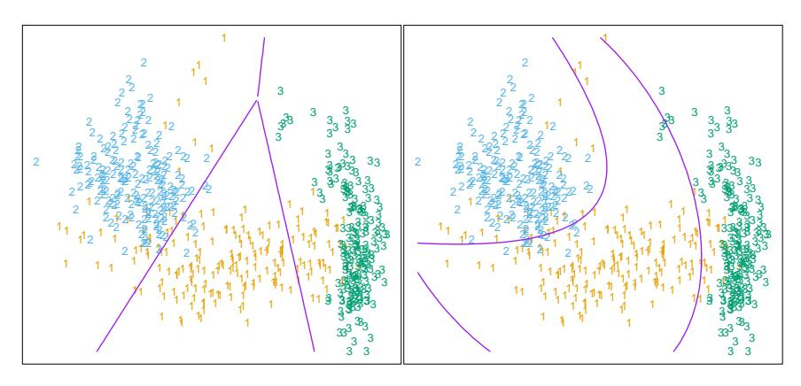

**FIGURE 4.1.** The left plot shows some data from three classes, with linear decision boundaries found by linear discriminant analysis. The right plot shows quadratic decision boundaries. These were obtained by finding linear boundaries in the five-dimensional space  $X_1, X_2, X_1X_2, X_1^2, X_2^2$ . Linear inequalities in this space are quadratic inequalities in the original space.

mation h(X) where  $h: \mathbb{R}^p \to \mathbb{R}^q$  with q > p, and will be explored in later chapters.

## 4.2 Linear Regression of an Indicator Matrix

Here each of the response categories are coded via an indicator variable. Thus if  $\mathcal{G}$  has K classes, there will be K such indicators  $Y_k$ ,  $k = 1, \ldots, K$ , with  $Y_k = 1$  if G = k else 0. These are collected together in a vector  $Y = (Y_1, \ldots, Y_K)$ , and the N training instances of these form an  $N \times K$  indicator response matrix  $\mathbf{Y}$ .  $\mathbf{Y}$  is a matrix of 0's and 1's, with each row having a single 1. We fit a linear regression model to each of the columns of  $\mathbf{Y}$  simultaneously, and the fit is given by

$$\hat{\mathbf{Y}} = \mathbf{X}(\mathbf{X}^T \mathbf{X})^{-1} \mathbf{X}^T \mathbf{Y}. \tag{4.3}$$

Chapter 3 has more details on linear regression. Note that we have a coefficient vector for each response column  $\mathbf{y}_k$ , and hence a  $(p+1) \times K$  coefficient matrix  $\hat{\mathbf{B}} = (\mathbf{X}^T \mathbf{X})^{-1} \mathbf{X}^T \mathbf{Y}$ . Here  $\mathbf{X}$  is the model matrix with p+1 columns corresponding to the p inputs, and a leading column of 1's for the intercept.

A new observation with input x is classified as follows:

- compute the fitted output  $\hat{f}(x)^T = (1, x^T)\hat{\mathbf{B}}$ , a K vector;
- identify the largest component and classify accordingly:

$$\hat{G}(x) = \operatorname{argmax}_{k \in G} \hat{f}_k(x). \tag{4.4}$$

What is the rationale for this approach? One rather formal justification is to view the regression as an estimate of conditional expectation. For the random variable  $Y_k$ ,  $E(Y_k|X=x) = \Pr(G=k|X=x)$ , so conditional expectation of each of the  $Y_k$  seems a sensible goal. The real issue is: how good an approximation to conditional expectation is the rather rigid linear regression model? Alternatively, are the  $\hat{f}_k(x)$  reasonable estimates of the posterior probabilities  $\Pr(G=k|X=x)$ , and more importantly, does this matter?

It is quite straightforward to verify that  $\sum_{k \in \mathcal{G}} \hat{f}_k(x) = 1$  for any x, as long as there is an intercept in the model (column of 1's in  $\mathbf{X}$ ). However, the  $\hat{f}_k(x)$  can be negative or greater than 1, and typically some are. This is a consequence of the rigid nature of linear regression, especially if we make predictions outside the hull of the training data. These violations in themselves do not guarantee that this approach will not work, and in fact on many problems it gives similar results to more standard linear methods for classification. If we allow linear regression onto basis expansions h(X) of the inputs, this approach can lead to consistent estimates of the probabilities. As the size of the training set N grows bigger, we adaptively include more basis elements so that linear regression onto these basis functions approaches conditional expectation. We discuss such approaches in Chapter 5.

A more simplistic viewpoint is to construct  $targets\ t_k$  for each class, where  $t_k$  is the kth column of the  $K\times K$  identity matrix. Our prediction problem is to try and reproduce the appropriate target for an observation. With the same coding as before, the response vector  $y_i$  (ith row of  $\mathbf{Y}$ ) for observation i has the value  $y_i = t_k$  if  $g_i = k$ . We might then fit the linear model by least squares:

$$\min_{\mathbf{B}} \sum_{i=1}^{N} ||y_i - [(1, x_i^T)\mathbf{B}]^T||^2.$$
 (4.5)

The criterion is a sum-of-squared Euclidean distances of the fitted vectors from their targets. A new observation is classified by computing its fitted vector  $\hat{f}(x)$  and classifying to the closest target:

$$\hat{G}(x) = \underset{k}{\operatorname{argmin}} ||\hat{f}(x) - t_k||^2.$$
 (4.6)

This is exactly the same as the previous approach:

• The sum-of-squared-norm criterion is exactly the criterion for multiple response linear regression, just viewed slightly differently. Since a squared norm is itself a sum of squares, the components decouple and can be rearranged as a separate linear model for each element. Note that this is only possible because there is nothing in the model that binds the different responses together.

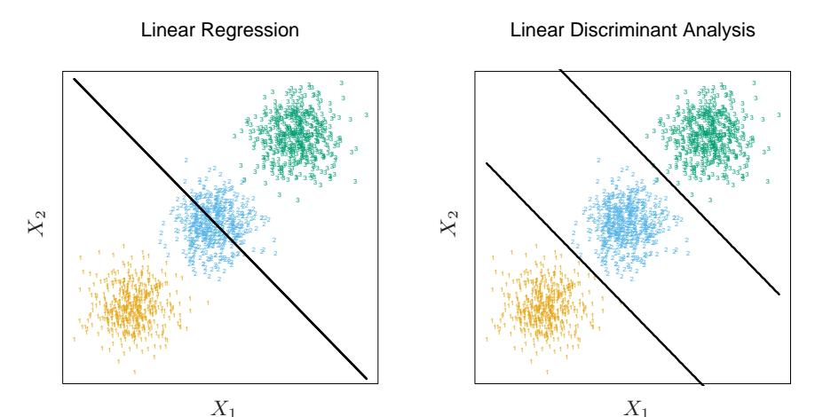

**FIGURE 4.2.** The data come from three classes in  $\mathbb{R}^2$  and are easily separated by linear decision boundaries. The right plot shows the boundaries found by linear discriminant analysis. The left plot shows the boundaries found by linear regression of the indicator response variables. The middle class is completely masked (never dominates).

• The closest target classification rule (4.6) is easily seen to be exactly the same as the maximum fitted component criterion (4.4).

There is a serious problem with the regression approach when the number of classes  $K \geq 3$ , especially prevalent when K is large. Because of the rigid nature of the regression model, classes can be masked by others. Figure 4.2 illustrates an extreme situation when K=3. The three classes are perfectly separated by linear decision boundaries, yet linear regression misses the middle class completely.

In Figure 4.3 we have projected the data onto the line joining the three centroids (there is no information in the orthogonal direction in this case), and we have included and coded the three response variables  $Y_1$ ,  $Y_2$  and  $Y_3$ . The three regression lines (left panel) are included, and we see that the line corresponding to the middle class is horizontal and its fitted values are never dominant! Thus, observations from class 2 are classified either as class 1 or class 3. The right panel uses quadratic regression rather than linear regression. For this simple example a quadratic rather than linear fit (for the middle class at least) would solve the problem. However, it can be seen that if there were four rather than three classes lined up like this, a quadratic would not come down fast enough, and a cubic would be needed as well. A loose but general rule is that if  $K \geq 3$  classes are lined up, polynomial terms up to degree K-1 might be needed to resolve them. Note also that these are polynomials along the derived direction passing through the centroids, which can have arbitrary orientation. So in

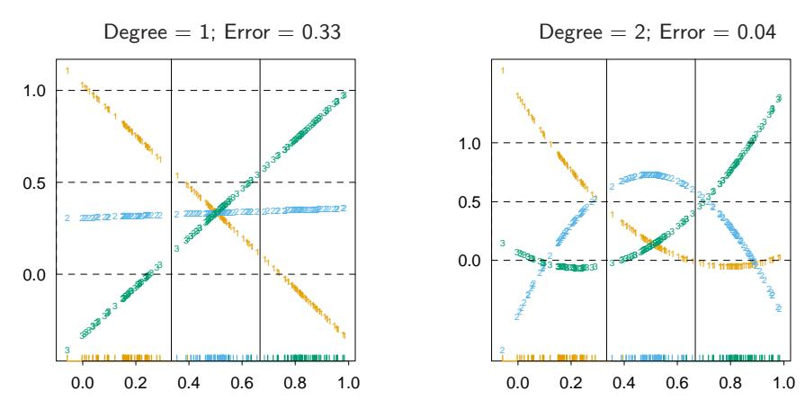

**FIGURE 4.3.** The effects of masking on linear regression in  $\mathbb{R}$  for a three-class problem. The rug plot at the base indicates the positions and class membership of each observation. The three curves in each panel are the fitted regressions to the three-class indicator variables; for example, for the blue class,  $y_{blue}$  is 1 for the blue observations, and 0 for the green and orange. The fits are linear and quadratic polynomials. Above each plot is the training error rate. The Bayes error rate is 0.025 for this problem, as is the LDA error rate.

p-dimensional input space, one would need general polynomial terms and cross-products of total degree K-1,  $O(p^{K-1})$  terms in all, to resolve such worst-case scenarios.

The example is extreme, but for large K and small p such maskings naturally occur. As a more realistic illustration, Figure 4.4 is a projection of the training data for a vowel recognition problem onto an informative two-dimensional subspace. There are K=11 classes in p=10 dimensions. This is a difficult classification problem, and the best methods achieve around 40% errors on the test data. The main point here is summarized in Table 4.1; linear regression has an error rate of 67%, while a close relative, linear discriminant analysis, has an error rate of 56%. It seems that masking has hurt in this case. While all the other methods in this chapter are based on linear functions of x as well, they use them in such a way that avoids this masking problem.

## 4.3 Linear Discriminant Analysis

Decision theory for classification (Section 2.4) tells us that we need to know the class posteriors  $\Pr(G|X)$  for optimal classification. Suppose  $f_k(x)$  is the class-conditional density of X in class G=k, and let  $\pi_k$  be the prior probability of class k, with  $\sum_{k=1}^K \pi_k = 1$ . A simple application of Bayes

Linear Discriminant Analysis

**FIGURE 4.4.** A two-dimensional plot of the vowel training data. There are eleven classes with  $X \in \mathbb{R}^{10}$ , and this is the best view in terms of a LDA model (Section 4.3.3). The heavy circles are the projected mean vectors for each class. The class overlap is considerable.

**TABLE 4.1.** Training and test error rates using a variety of linear techniques on the vowel data. There are eleven classes in ten dimensions, of which three account for 90% of the variance (via a principal components analysis). We see that linear regression is hurt by masking, increasing the test and training error by over 10%.

| Technique                       | Error Rates |      |  |
|---------------------------------|-------------|------|--|
|                                 | Training    | Test |  |
| Linear regression               | 0.48        | 0.67 |  |
| Linear discriminant analysis    | 0.32        | 0.56 |  |
| Quadratic discriminant analysis | 0.01        | 0.53 |  |
| Logistic regression             | 0.22        | 0.51 |  |

theorem gives us

$$\Pr(G = k | X = x) = \frac{f_k(x)\pi_k}{\sum_{\ell=1}^K f_\ell(x)\pi_\ell}.$$
 (4.7)

We see that in terms of ability to classify, having the  $f_k(x)$  is almost equivalent to having the quantity Pr(G = k|X = x).

Many techniques are based on models for the class densities:

- linear and quadratic discriminant analysis use Gaussian densities;
- more flexible mixtures of Gaussians allow for nonlinear decision boundaries (Section 6.8);
- general nonparametric density estimates for each class density allow the most flexibility (Section 6.6.2);
- Naive Bayes models are a variant of the previous case, and assume that each of the class densities are products of marginal densities; that is, they assume that the inputs are conditionally independent in each class (Section 6.6.3).

Suppose that we model each class density as multivariate Gaussian

$$f_k(x) = \frac{1}{(2\pi)^{p/2} |\mathbf{\Sigma}_k|^{1/2}} e^{-\frac{1}{2}(x-\mu_k)^T \mathbf{\Sigma}_k^{-1}(x-\mu_k)}.$$
 (4.8)

Linear discriminant analysis (LDA) arises in the special case when we assume that the classes have a common covariance matrix  $\Sigma_k = \Sigma \ \forall k$ . In comparing two classes k and  $\ell$ , it is sufficient to look at the log-ratio, and we see that

$$\log \frac{\Pr(G = k | X = x)}{\Pr(G = \ell | X = x)} = \log \frac{f_k(x)}{f_{\ell}(x)} + \log \frac{\pi_k}{\pi_{\ell}}$$

$$= \log \frac{\pi_k}{\pi_{\ell}} - \frac{1}{2} (\mu_k + \mu_{\ell})^T \mathbf{\Sigma}^{-1} (\mu_k - \mu_{\ell})$$

$$+ x^T \mathbf{\Sigma}^{-1} (\mu_k - \mu_{\ell}).$$
(4.9)

an equation linear in x. The equal covariance matrices cause the normalization factors to cancel, as well as the quadratic part in the exponents. This linear log-odds function implies that the decision boundary between classes k and  $\ell$ —the set where  $\Pr(G = k|X = x) = \Pr(G = \ell|X = x)$ —is linear in x; in p dimensions a hyperplane. This is of course true for any pair of classes, so all the decision boundaries are linear. If we divide  $\mathbb{R}^p$  into regions that are classified as class 1, class 2, etc., these regions will be separated by hyperplanes. Figure 4.5 (left panel) shows an idealized example with three classes and p = 2. Here the data do arise from three Gaussian distributions with a common covariance matrix. We have included in

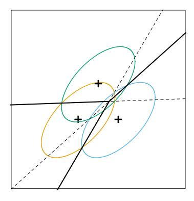

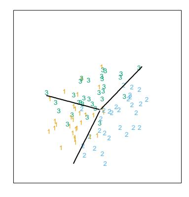

**FIGURE 4.5.** The left panel shows three Gaussian distributions, with the same covariance and different means. Included are the contours of constant density enclosing 95% of the probability in each case. The Bayes decision boundaries between each pair of classes are shown (broken straight lines), and the Bayes decision boundaries separating all three classes are the thicker solid lines (a subset of the former). On the right we see a sample of 30 drawn from each Gaussian distribution, and the fitted LDA decision boundaries.

the figure the contours corresponding to 95% highest probability density, as well as the class centroids. Notice that the decision boundaries are not the perpendicular bisectors of the line segments joining the centroids. This would be the case if the covariance  $\Sigma$  were spherical  $\sigma^2 \mathbf{I}$ , and the class priors were equal. From (4.9) we see that the *linear discriminant functions*

$$\delta_k(x) = x^T \mathbf{\Sigma}^{-1} \mu_k - \frac{1}{2} \mu_k^T \mathbf{\Sigma}^{-1} \mu_k + \log \pi_k$$
 (4.10)

are an equivalent description of the decision rule, with  $G(x) = \operatorname{argmax}_k \delta_k(x)$ . In practice we do not know the parameters of the Gaussian distributions, and will need to estimate them using our training data:

- $\hat{\pi}_k = N_k/N$ , where  $N_k$  is the number of class-k observations;
- $\hat{\mu}_k = \sum_{g_i=k} x_i/N_k;$
- $\hat{\Sigma} = \sum_{k=1}^{K} \sum_{g_i=k} (x_i \hat{\mu}_k) (x_i \hat{\mu}_k)^T / (N K).$

Figure 4.5 (right panel) shows the estimated decision boundaries based on a sample of size 30 each from three Gaussian distributions. Figure 4.1 on page 103 is another example, but here the classes are not Gaussian.

With two classes there is a simple correspondence between linear discriminant analysis and classification by linear regression, as in (4.5). The LDA rule classifies to class 2 if

$$x^{T} \hat{\boldsymbol{\Sigma}}^{-1} (\hat{\mu}_{2} - \hat{\mu}_{1}) > \frac{1}{2} (\hat{\mu}_{2} + \hat{\mu}_{1})^{T} \hat{\boldsymbol{\Sigma}}^{-1} (\hat{\mu}_{2} - \hat{\mu}_{1}) - \log(N_{2}/N_{1}), \quad (4.11)$$

and class 1 otherwise. Suppose we code the targets in the two classes as +1 and −1, respectively. It is easy to show that the coefficient vector from least squares is proportional to the LDA direction given in (4.11) (Exercise 4.2). [In fact, this correspondence occurs for any (distinct) coding of the targets; see Exercise 4.2]. However unless N$^{1}$ = N$^{2}$ the intercepts are different and hence the resulting decision rules are different.

Since this derivation of the LDA direction via least squares does not use a Gaussian assumption for the features, its applicability extends beyond the realm of Gaussian data. However the derivation of the particular intercept or cut-point given in (4.11) does require Gaussian data. Thus it makes sense to instead choose the cut-point that empirically minimizes training error for a given dataset. This is something we have found to work well in practice, but have not seen it mentioned in the literature.

With more than two classes, LDA is not the same as linear regression of the class indicator matrix, and it avoids the masking problems associated with that approach (Hastie et al., 1994). A correspondence between regression and LDA can be established through the notion of optimal scoring, discussed in Section 12.5.

Getting back to the general discriminant problem (4.8), if the $\Sigma$$^{k}$ are not assumed to be equal, then the convenient cancellations in (4.9) do not occur; in particular the pieces quadratic in x remain. We then get quadratic discriminant functions (QDA),

$$\delta_k(x) = -\frac{1}{2}\log|\mathbf{\Sigma}_k| - \frac{1}{2}(x - \mu_k)^T \mathbf{\Sigma}_k^{-1}(x - \mu_k) + \log \pi_k.$$
 (4.12)

The decision boundary between each pair of classes k and $\ell$ is described by a quadratic equation {x : $\delta$k(x) = $\delta$$\ell$(x)}.

Figure 4.6 shows an example (from Figure 4.1 on page 103) where the three classes are Gaussian mixtures (Section 6.8) and the decision boundaries are approximated by quadratic equations in x. Here we illustrate two popular ways of fitting these quadratic boundaries. The right plot uses QDA as described here, while the left plot uses LDA in the enlarged five-dimensional quadratic polynomial space. The differences are generally small; QDA is the preferred approach, with the LDA method a convenient substitute $^{2}$ .

The estimates for QDA are similar to those for LDA, except that separate covariance matrices must be estimated for each class. When p is large this can mean a dramatic increase in parameters. Since the decision boundaries are functions of the parameters of the densities, counting the number of parameters must be done with care. For LDA, it seems there are (K − 1) $\times$ (p + 1) parameters, since we only need the differences $\delta$k(x) − $\delta$K(x)

$^{2}$For this figure and many similar figures in the book we compute the decision boundaries by an exhaustive contouring method. We compute the decision rule on a fine lattice of points, and then use contouring algorithms to compute the boundaries.

**FIGURE 4.6.** Two methods for fitting quadratic boundaries. The left plot shows the quadratic decision boundaries for the data in Figure 4.1 (obtained using LDA in the five-dimensional space  $X_1, X_2, X_1X_2, X_1^2, X_2^2$ ). The right plot shows the quadratic decision boundaries found by QDA. The differences are small, as is usually the case.

between the discriminant functions where K is some pre-chosen class (here we have chosen the last), and each difference requires p+1 parameters$^{3}$. Likewise for QDA there will be  $(K-1) \times \{p(p+3)/2+1\}$  parameters. Both LDA and QDA perform well on an amazingly large and diverse set of classification tasks. For example, in the STATLOG project (Michie et al., 1994) LDA was among the top three classifiers for 7 of the 22 datasets, QDA among the top three for four datasets, and one of the pair were in the top three for 10 datasets. Both techniques are widely used, and entire books are devoted to LDA. It seems that whatever exotic tools are the rage of the day, we should always have available these two simple tools. The question arises why LDA and QDA have such a good track record. The reason is not likely to be that the data are approximately Gaussian, and in addition for LDA that the covariances are approximately equal. More likely a reason is that the data can only support simple decision boundaries such as linear or quadratic, and the estimates provided via the Gaussian models are stable. This is a bias variance tradeoff—we can put up with the bias of a linear decision boundary because it can be estimated with much lower variance than more exotic alternatives. This argument is less believable for QDA, since it can have many parameters itself, although perhaps fewer than the non-parametric alternatives.

$ ^{3} $ Although we fit the covariance matrix  $\hat{\Sigma}$  to compute the LDA discriminant functions, a much reduced function of it is all that is required to estimate the O(p) parameters needed to compute the decision boundaries.

### Regularized Discriminant Analysis on the Vowel Data

![**FIGURE 4.7.** Test and training errors for the vowel data, using regularized discriminant analysis with a series of values of $\alpha$ $\in$ [0, 1]. The optimum for the test data occurs around $\alpha$ = 0.9, close to quadratic discriminant analysis.](../figures/_page_130_Figure_3.jpeg)

**FIGURE 4.7.** Test and training errors for the vowel data, using regularized discriminant analysis with a series of values of $\alpha$ $\in$ [0, 1]. The optimum for the test data occurs around $\alpha$ = 0.9, close to quadratic discriminant analysis.

### 4.3.1 Regularized Discriminant Analysis

Friedman (1989) proposed a compromise between LDA and QDA, which allows one to shrink the separate covariances of QDA toward a common covariance as in LDA. These methods are very similar in flavor to ridge regression. The regularized covariance matrices have the form

$$\hat{\Sigma}_k(\alpha) = \alpha \hat{\Sigma}_k + (1 - \alpha)\hat{\Sigma}, \tag{4.13}$$

where $^{\Sigma}$$^{ˆ}$ is the pooled covariance matrix as used in LDA. Here $^{\alpha}$ $^{\in}$ [0, 1] allows a continuum of models between LDA and QDA, and needs to be specified. In practice $\alpha$ can be chosen based on the performance of the model on validation data, or by cross-validation.

Figure 4.7 shows the results of RDA applied to the vowel data. Both the training and test error improve with increasing $\alpha$, although the test error increases sharply after $\alpha$ = 0.9. The large discrepancy between the training and test error is partly due to the fact that there are many repeat measurements on a small number of individuals, different in the training and test set.

Similar modifications allow $\Sigma$ˆ itself to be shrunk toward the scalar covariance,

$$\hat{\mathbf{\Sigma}}(\gamma) = \gamma \hat{\mathbf{\Sigma}} + (1 - \gamma)\hat{\sigma}^2 \mathbf{I}$$
 (4.14)

for $^{γ}$ $^{\in}$ [0, 1]. Replacing $^{\Sigma}$$^{ˆ}$ in (4.13) by $^{\Sigma}$$^{ˆ}$ (γ) leads to a more general family of covariances $\Sigma$ˆ ($\alpha$, γ) indexed by a pair of parameters.

In Chapter 12, we discuss other regularized versions of LDA, which are more suitable when the data arise from digitized analog signals and images. In these situations the features are high-dimensional and correlated, and the LDA coefficients can be regularized to be smooth or sparse in the original domain of the signal. This leads to better generalization and allows for easier interpretation of the coefficients. In Chapter 18 we also deal with very high-dimensional problems, where for example the features are gene-expression measurements in microarray studies. There the methods focus on the case  $\gamma=0$  in (4.14), and other severely regularized versions of LDA.

### 4.3.2 Computations for LDA

As a lead-in to the next topic, we briefly digress on the computations required for LDA and especially QDA. Their computations are simplified by diagonalizing  $\hat{\Sigma}$  or  $\hat{\Sigma}_k$ . For the latter, suppose we compute the eigendecomposition for each  $\hat{\Sigma}_k = \mathbf{U}_k \mathbf{D}_k \mathbf{U}_k^T$ , where  $\mathbf{U}_k$  is  $p \times p$  orthonormal, and  $\mathbf{D}_k$  a diagonal matrix of positive eigenvalues  $d_{k\ell}$ . Then the ingredients for  $\delta_k(x)$  (4.12) are

- $(x \hat{\mu}_k)^T \hat{\Sigma}_k^{-1} (x \hat{\mu}_k) = [\mathbf{U}_k^T (x \hat{\mu}_k)]^T \mathbf{D}_k^{-1} [\mathbf{U}_k^T (x \hat{\mu}_k)];$
- $\log |\hat{\Sigma}_k| = \sum_{\ell} \log d_{k\ell}$ .

In light of the computational steps outlined above, the LDA classifier can be implemented by the following pair of steps:

- Sphere the data with respect to the common covariance estimate  $\hat{\Sigma}$ :  $X^* \leftarrow \mathbf{D}^{-\frac{1}{2}}\mathbf{U}^T X$ , where  $\hat{\Sigma} = \mathbf{U}\mathbf{D}\mathbf{U}^T$ . The common covariance estimate of  $X^*$  will now be the identity.
- Classify to the closest class centroid in the transformed space, modulo the effect of the class prior probabilities  $\pi_k$ .

### 4.3.3 Reduced-Rank Linear Discriminant Analysis

So far we have discussed LDA as a restricted Gaussian classifier. Part of its popularity is due to an additional restriction that allows us to view informative low-dimensional projections of the data.

The K centroids in p-dimensional input space lie in an affine subspace of dimension  $\leq K-1$ , and if p is much larger than K, this will be a considerable drop in dimension. Moreover, in locating the closest centroid, we can ignore distances orthogonal to this subspace, since they will contribute equally to each class. Thus we might just as well project the  $X^*$  onto this centroid-spanning subspace  $H_{K-1}$ , and make distance comparisons there. Thus there is a fundamental dimension reduction in LDA, namely, that we need only consider the data in a subspace of dimension at most K-1.

If K=3, for instance, this could allow us to view the data in a two-dimensional plot, color-coding the classes. In doing so we would not have relinquished any of the information needed for LDA classification.

What if K>3? We might then ask for a L< K-1 dimensional subspace  $H_L\subseteq H_{K-1}$  optimal for LDA in some sense. Fisher defined optimal to mean that the projected centroids were spread out as much as possible in terms of variance. This amounts to finding principal component subspaces of the centroids themselves (principal components are described briefly in Section 3.5.1, and in more detail in Section 14.5.1). Figure 4.4 shows such an optimal two-dimensional subspace for the vowel data. Here there are eleven classes, each a different vowel sound, in a ten-dimensional input space. The centroids require the full space in this case, since K-1=p, but we have shown an optimal two-dimensional subspace. The dimensions are ordered, so we can compute additional dimensions in sequence. Figure 4.8 shows four additional pairs of coordinates, also known as canonical or discriminant variables. In summary then, finding the sequences of optimal subspaces for LDA involves the following steps:

- compute the  $K \times p$  matrix of class centroids **M** and the common covariance matrix **W** (for *within-class* covariance);
- compute  $\mathbf{M}^* = \mathbf{M}\mathbf{W}^{-\frac{1}{2}}$  using the eigen-decomposition of  $\mathbf{W}$ ;
- compute  $\mathbf{B}^*$ , the covariance matrix of  $\mathbf{M}^*$  ( $\mathbf{B}$  for between-class covariance), and its eigen-decomposition  $\mathbf{B}^* = \mathbf{V}^* \mathbf{D}_B \mathbf{V}^{*T}$ . The columns  $v_\ell^*$  of  $\mathbf{V}^*$  in sequence from first to last define the coordinates of the optimal subspaces.

Combining all these operations the  $\ell$ th discriminant variable is given by  $Z_{\ell} = v_{\ell}^T X$  with  $v_{\ell} = \mathbf{W}^{-\frac{1}{2}} v_{\ell}^*$ .

Fisher arrived at this decomposition via a different route, without referring to Gaussian distributions at all. He posed the problem:

Find the linear combination  $Z = a^T X$  such that the betweenclass variance is maximized relative to the within-class variance.

Again, the between class variance is the variance of the class means of Z, and the within class variance is the pooled variance about the means. Figure 4.9 shows why this criterion makes sense. Although the direction joining the centroids separates the means as much as possible (i.e., maximizes the between-class variance), there is considerable overlap between the projected classes due to the nature of the covariances. By taking the covariance into account as well, a direction with minimum overlap can be found.

The between-class variance of Z is  $a^T \mathbf{B} a$  and the within-class variance  $a^T \mathbf{W} a$ , where  $\mathbf{W}$  is defined earlier, and  $\mathbf{B}$  is the covariance matrix of the class centroid matrix  $\mathbf{M}$ . Note that  $\mathbf{B} + \mathbf{W} = \mathbf{T}$ , where  $\mathbf{T}$  is the *total* covariance matrix of X, ignoring class information.

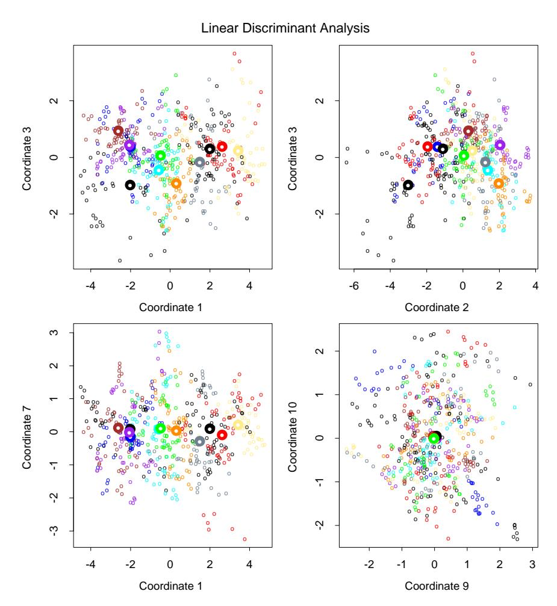

**FIGURE 4.8.** Four projections onto pairs of canonical variates. Notice that as the rank of the canonical variates increases, the centroids become less spread out. In the lower right panel they appear to be superimposed, and the classes most confused.

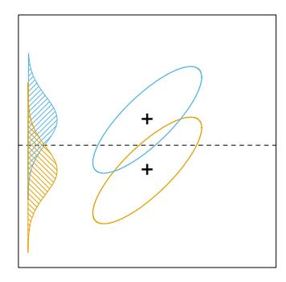

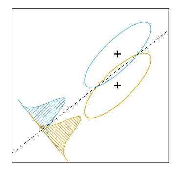

**FIGURE 4.9.** Although the line joining the centroids defines the direction of greatest centroid spread, the projected data overlap because of the covariance (left panel). The discriminant direction minimizes this overlap for Gaussian data (right panel).

Fisher's problem therefore amounts to maximizing the Rayleigh quotient,

$$\max_{a} \frac{a^T \mathbf{B} a}{a^T \mathbf{W} a},\tag{4.15}$$

or equivalently

$$\max_{a} a^{T} \mathbf{B} a \text{ subject to } a^{T} \mathbf{W} a = 1. \tag{4.16}$$

This is a generalized eigenvalue problem, with a given by the largest eigenvalue of  $\mathbf{W}^{-1}\mathbf{B}$ . It is not hard to show (Exercise 4.1) that the optimal  $a_1$  is identical to  $v_1$  defined above. Similarly one can find the next direction  $a_2$ , orthogonal in  $\mathbf{W}$  to  $a_1$ , such that  $a_2^T\mathbf{B}a_2/a_2^T\mathbf{W}a_2$  is maximized; the solution is  $a_2 = v_2$ , and so on. The  $a_\ell$  are referred to as discriminant coordinates, not to be confused with discriminant functions. They are also referred to as canonical variates, since an alternative derivation of these results is through a canonical correlation analysis of the indicator response matrix  $\mathbf{Y}$  on the predictor matrix  $\mathbf{X}$ . This line is pursued in Section 12.5.

To summarize the developments so far:

- Gaussian classification with common covariances leads to linear decision boundaries. Classification can be achieved by sphering the data with respect to  $\mathbf{W}$ , and classifying to the closest centroid (modulo  $\log \pi_k$ ) in the sphered space.
- Since only the relative distances to the centroids count, one can confine the data to the subspace spanned by the centroids in the sphered space.
- This subspace can be further decomposed into successively optimal subspaces in term of centroid separation. This decomposition is identical to the decomposition due to Fisher.

#### LDA and Dimension Reduction on the Vowel Data

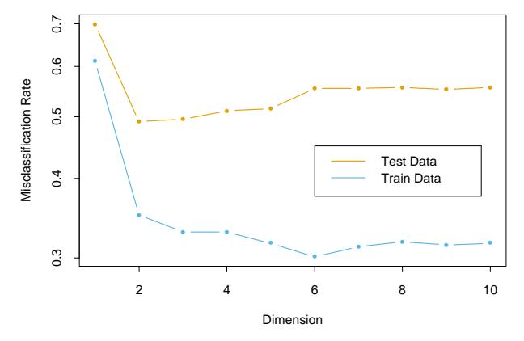

**FIGURE 4.10.** Training and test error rates for the vowel data, as a function of the dimension of the discriminant subspace. In this case the best error rate is for dimension 2. Figure 4.11 shows the decision boundaries in this space.

The reduced subspaces have been motivated as a data reduction (for viewing) tool. Can they also be used for classification, and what is the rationale? Clearly they can, as in our original derivation; we simply limit the distance-to-centroid calculations to the chosen subspace. One can show that this is a Gaussian classification rule with the additional restriction that the centroids of the Gaussians lie in a L-dimensional subspace of IR$^{p}$ . Fitting such a model by maximum likelihood, and then constructing the posterior probabilities using Bayes' theorem amounts to the classification rule described above (Exercise 4.8).

Gaussian classification dictates the log $\pi$$^{k}$ correction factor in the distance calculation. The reason for this correction can be seen in Figure 4.9. The misclassification rate is based on the area of overlap between the two densities. If the $\pi$$^{k}$ are equal (implicit in that figure), then the optimal cut-point is midway between the projected means. If the $\pi$$^{k}$ are not equal, moving the cut-point toward the smaller class will improve the error rate. As mentioned earlier for two classes, one can derive the linear rule using LDA (or any other method), and then choose the cut-point to minimize misclassification error over the training data.

As an example of the benefit of the reduced-rank restriction, we return to the vowel data. There are 11 classes and 10 variables, and hence 10 possible dimensions for the classifier. We can compute the training and test error in each of these hierarchical subspaces; Figure 4.10 shows the results. Figure 4.11 shows the decision boundaries for the classifier based on the two-dimensional LDA solution.

There is a close connection between Fisher's reduced rank discriminant analysis and regression of an indicator response matrix. It turns out that

Canonical Coordinate 2

Classification in Reduced Subspace

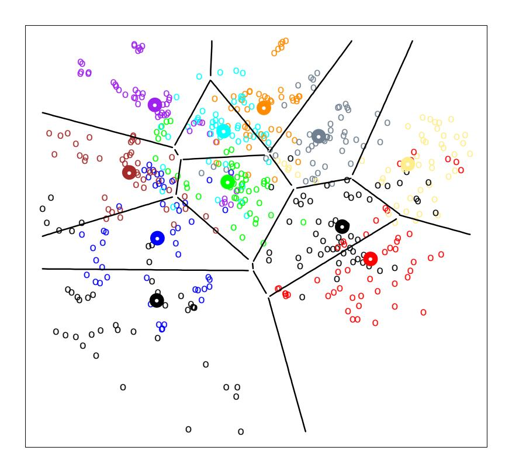

Canonical Coordinate 1

**FIGURE 4.11.** Decision boundaries for the vowel training data, in the two-dimensional subspace spanned by the first two canonical variates. Note that in any higher-dimensional subspace, the decision boundaries are higher-dimensional affine planes, and could not be represented as lines.

LDA amounts to the regression followed by an eigen-decomposition of  $\hat{\mathbf{Y}}^T\mathbf{Y}$ . In the case of two classes, there is a single discriminant variable that is identical up to a scalar multiplication to either of the columns of  $\hat{\mathbf{Y}}$ . These connections are developed in Chapter 12. A related fact is that if one transforms the original predictors  $\mathbf{X}$  to  $\hat{\mathbf{Y}}$ , then LDA using  $\hat{\mathbf{Y}}$  is identical to LDA in the original space (Exercise 4.3).

## 4.4 Logistic Regression

The logistic regression model arises from the desire to model the posterior probabilities of the K classes via linear functions in x, while at the same time ensuring that they sum to one and remain in [0,1]. The model has the form

$$\log \frac{\Pr(G = 1|X = x)}{\Pr(G = K|X = x)} = \beta_{10} + \beta_1^T x$$

$$\log \frac{\Pr(G = 2|X = x)}{\Pr(G = K|X = x)} = \beta_{20} + \beta_2^T x$$

$$\vdots$$

$$\log \frac{\Pr(G = K - 1|X = x)}{\Pr(G = K|X = x)} = \beta_{(K-1)0} + \beta_{K-1}^T x.$$
(4.17)

The model is specified in terms of K-1 log-odds or logit transformations (reflecting the constraint that the probabilities sum to one). Although the model uses the last class as the denominator in the odds-ratios, the choice of denominator is arbitrary in that the estimates are equivariant under this choice. A simple calculation shows that

$$\Pr(G = k | X = x) = \frac{\exp(\beta_{k0} + \beta_k^T x)}{1 + \sum_{\ell=1}^{K-1} \exp(\beta_{\ell0} + \beta_\ell^T x)}, \ k = 1, \dots, K - 1,$$

$$\Pr(G = K | X = x) = \frac{1}{1 + \sum_{\ell=1}^{K-1} \exp(\beta_{\ell0} + \beta_\ell^T x)},$$
(4.18)

and they clearly sum to one. To emphasize the dependence on the entire parameter set  $\theta = \{\beta_{10}, \beta_1^T, \dots, \beta_{(K-1)0}, \beta_{K-1}^T\}$ , we denote the probabilities  $\Pr(G = k | X = x) = p_k(x; \theta)$ .

When K=2, this model is especially simple, since there is only a single linear function. It is widely used in biostatistical applications where binary responses (two classes) occur quite frequently. For example, patients survive or die, have heart disease or not, or a condition is present or absent.

### 4.4.1 Fitting Logistic Regression Models

Logistic regression models are usually fit by maximum likelihood, using the conditional likelihood of G given X. Since  $\Pr(G|X)$  completely specifies the conditional distribution, the *multinomial* distribution is appropriate. The log-likelihood for N observations is

$$\ell(\theta) = \sum_{i=1}^{N} \log p_{g_i}(x_i; \theta), \tag{4.19}$$

where  $p_k(x_i; \theta) = \Pr(G = k | X = x_i; \theta)$ .

We discuss in detail the two-class case, since the algorithms simplify considerably. It is convenient to code the two-class  $g_i$  via a 0/1 response  $y_i$ , where  $y_i = 1$  when  $g_i = 1$ , and  $y_i = 0$  when  $g_i = 2$ . Let  $p_1(x; \theta) = p(x; \theta)$ , and  $p_2(x; \theta) = 1 - p(x; \theta)$ . The log-likelihood can be written

$$\ell(\beta) = \sum_{i=1}^{N} \left\{ y_i \log p(x_i; \beta) + (1 - y_i) \log(1 - p(x_i; \beta)) \right\}$$
$$= \sum_{i=1}^{N} \left\{ y_i \beta^T x_i - \log(1 + e^{\beta^T x_i}) \right\}. \tag{4.20}$$

Here  $\beta = \{\beta_{10}, \beta_1\}$ , and we assume that the vector of inputs  $x_i$  includes the constant term 1 to accommodate the intercept.

To maximize the log-likelihood, we set its derivatives to zero. These  $\mathit{score}$  equations are

$$\frac{\partial \ell(\beta)}{\partial \beta} = \sum_{i=1}^{N} x_i (y_i - p(x_i; \beta)) = 0, \tag{4.21}$$

which are p+1 equations nonlinear in  $\beta$ . Notice that since the first component of  $x_i$  is 1, the first score equation specifies that  $\sum_{i=1}^{N} y_i = \sum_{i=1}^{N} p(x_i; \beta)$ ; the expected number of class ones matches the observed number (and hence also class twos.)

To solve the score equations (4.21), we use the Newton-Raphson algorithm, which requires the second-derivative or Hessian matrix

$$\frac{\partial^2 \ell(\beta)}{\partial \beta \partial \beta^T} = -\sum_{i=1}^N x_i x_i^T p(x_i; \beta) (1 - p(x_i; \beta)). \tag{4.22}$$

Starting with  $\beta^{\text{old}}$ , a single Newton update is

$$\beta^{\text{new}} = \beta^{\text{old}} - \left(\frac{\partial^2 \ell(\beta)}{\partial \beta \partial \beta^T}\right)^{-1} \frac{\partial \ell(\beta)}{\partial \beta},$$
 (4.23)

where the derivatives are evaluated at  $\beta^{\text{old}}$ .

It is convenient to write the score and Hessian in matrix notation. Let  $\mathbf{y}$  denote the vector of  $y_i$  values,  $\mathbf{X}$  the  $N \times (p+1)$  matrix of  $x_i$  values,  $\mathbf{p}$  the vector of fitted probabilities with ith element  $p(x_i; \beta^{\text{old}})$  and  $\mathbf{W}$  a  $N \times N$  diagonal matrix of weights with ith diagonal element  $p(x_i; \beta^{\text{old}})(1 - p(x_i; \beta^{\text{old}}))$ . Then we have

$$\frac{\partial \ell(\beta)}{\partial \beta} = \mathbf{X}^T (\mathbf{y} - \mathbf{p}) \tag{4.24}$$

$$\frac{\partial^2 \ell(\beta)}{\partial \beta \partial \beta^T} = -\mathbf{X}^T \mathbf{W} \mathbf{X}$$
 (4.25)

The Newton step is thus

$$\beta^{\text{new}} = \beta^{\text{old}} + (\mathbf{X}^T \mathbf{W} \mathbf{X})^{-1} \mathbf{X}^T (\mathbf{y} - \mathbf{p})$$

$$= (\mathbf{X}^T \mathbf{W} \mathbf{X})^{-1} \mathbf{X}^T \mathbf{W} (\mathbf{X} \beta^{\text{old}} + \mathbf{W}^{-1} (\mathbf{y} - \mathbf{p}))$$

$$= (\mathbf{X}^T \mathbf{W} \mathbf{X})^{-1} \mathbf{X}^T \mathbf{W} \mathbf{z}. \tag{4.26}$$

In the second and third line we have re-expressed the Newton step as a weighted least squares step, with the response

$$\mathbf{z} = \mathbf{X}\beta^{\text{old}} + \mathbf{W}^{-1}(\mathbf{y} - \mathbf{p}), \tag{4.27}$$

sometimes known as the *adjusted response*. These equations get solved repeatedly, since at each iteration  $\mathbf{p}$  changes, and hence so does  $\mathbf{W}$  and  $\mathbf{z}$ . This algorithm is referred to as *iteratively reweighted least squares* or IRLS, since each iteration solves the weighted least squares problem:

$$\beta^{\text{new}} \leftarrow \arg\min_{\beta} (\mathbf{z} - \mathbf{X}\beta)^T \mathbf{W} (\mathbf{z} - \mathbf{X}\beta).$$
 (4.28)

It seems that  $\beta=0$  is a good starting value for the iterative procedure, although convergence is never guaranteed. Typically the algorithm does converge, since the log-likelihood is concave, but overshooting can occur. In the rare cases that the log-likelihood decreases, step size halving will guarantee convergence.

For the multiclass case  $(K \geq 3)$  the Newton algorithm can also be expressed as an iteratively reweighted least squares algorithm, but with a vector of K-1 responses and a nondiagonal weight matrix per observation. The latter precludes any simplified algorithms, and in this case it is numerically more convenient to work with the expanded vector  $\theta$  directly (Exercise 4.4). Alternatively coordinate-descent methods (Section 3.8.6) can be used to maximize the log-likelihood efficiently. The R package glmnet (Friedman et al., 2010) can fit very large logistic regression problems efficiently, both in N and p. Although designed to fit regularized models, options allow for unregularized fits.

Logistic regression models are used mostly as a data analysis and inference tool, where the goal is to understand the role of the input variables

|             | Coefficient | Std. Error | Z Score |
|-------------|-------------|------------|------------|
| (Intercept) | −4.130      | 0.964      | −4.285     |
| sbp         | 0.006       | 0.006      | 1.023      |
| tobacco     | 0.080       | 0.026      | 3.034      |
| ldl         | 0.185       | 0.057      | 3.219      |
| famhist     | 0.939       | 0.225      | 4.178      |
| obesity     | -0.035      | 0.029      | −1.187     |
| alcohol     | 0.001       | 0.004      | 0.136      |
| age         | 0.043       | 0.010      | 4.184      |

TABLE 4.2. Results from a logistic regression fit to the South African heart disease data.

in explaining the outcome. Typically many models are fit in a search for a parsimonious model involving a subset of the variables, possibly with some interactions terms. The following example illustrates some of the issues involved.

### 4.4.2 Example: South African Heart Disease

Here we present an analysis of binary data to illustrate the traditional statistical use of the logistic regression model. The data in Figure 4.12 are a subset of the Coronary Risk-Factor Study (CORIS) baseline survey, carried out in three rural areas of the Western Cape, South Africa (Rousseauw et al., 1983). The aim of the study was to establish the intensity of ischemic heart disease risk factors in that high-incidence region. The data represent white males between 15 and 64, and the response variable is the presence or absence of myocardial infarction (MI) at the time of the survey (the overall prevalence of MI was 5.1% in this region). There are 160 cases in our data set, and a sample of 302 controls. These data are described in more detail in Hastie and Tibshirani (1987).

We fit a logistic-regression model by maximum likelihood, giving the results shown in Table 4.2. This summary includes Z scores for each of the coefficients in the model (coefficients divided by their standard errors); a nonsignificant Z score suggests a coefficient can be dropped from the model. Each of these correspond formally to a test of the null hypothesis that the coefficient in question is zero, while all the others are not (also known as the Wald test). A Z score greater than approximately 2 in absolute value is significant at the 5% level.

There are some surprises in this table of coefficients, which must be interpreted with caution. Systolic blood pressure (sbp) is not significant! Nor is obesity, and its sign is negative. This confusion is a result of the correlation between the set of predictors. On their own, both sbp and obesity are significant, and with positive sign. However, in the presence of many

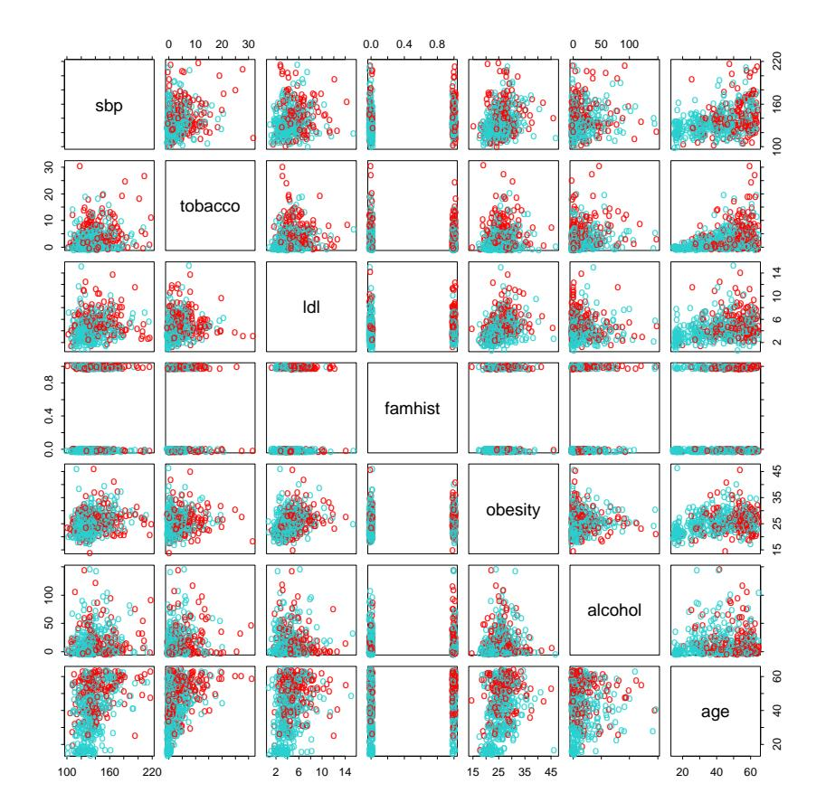

**FIGURE 4.12.** A scatterplot matrix of the South African heart disease data. Each plot shows a pair of risk factors, and the cases and controls are color coded (red is a case). The variable family history of heart disease (famhist) is binary (yes or no).

|             | Coefficient | Std. Error | Z score |
|-------------|-------------|------------|------------|
| (Intercept) | −4.204      | 0.498      | −8.45      |
| tobacco     | 0.081       | 0.026      | 3.16       |
| ldl         | 0.168       | 0.054      | 3.09       |
| famhist     | 0.924       | 0.223      | 4.14       |
| age         | 0.044       | 0.010      | 4.52       |

TABLE 4.3. Results from stepwise logistic regression fit to South African heart disease data.

other correlated variables, they are no longer needed (and can even get a negative sign).

At this stage the analyst might do some model selection; find a subset of the variables that are sufficient for explaining their joint effect on the prevalence of chd. One way to proceed by is to drop the least significant coefficient, and refit the model. This is done repeatedly until no further terms can be dropped from the model. This gave the model shown in Table 4.3.

A better but more time-consuming strategy is to refit each of the models with one variable removed, and then perform an analysis of deviance to decide which variable to exclude. The residual deviance of a fitted model is minus twice its log-likelihood, and the deviance between two models is the difference of their individual residual deviances (in analogy to sums-ofsquares). This strategy gave the same final model as above.

How does one interpret a coefficient of 0.081 (Std. Error = 0.026) for tobacco, for example? Tobacco is measured in total lifetime usage in kilograms, with a median of 1.0kg for the controls and 4.1kg for the cases. Thus an increase of 1kg in lifetime tobacco usage accounts for an increase in the odds of coronary heart disease of exp(0.081) = 1.084 or 8.4%. Incorporating the standard error we get an approximate 95% confidence interval of exp(0.081 $\pm$ 2 $\times$ 0.026) = (1.03, 1.14).

We return to these data in Chapter 5, where we see that some of the variables have nonlinear effects, and when modeled appropriately, are not excluded from the model.

### 4.4.3 Quadratic Approximations and Inference

The maximum-likelihood parameter estimates $\beta$ˆ satisfy a self-consistency relationship: they are the coefficients of a weighted least squares fit, where the responses are

$$z_i = x_i^T \hat{\beta} + \frac{(y_i - \hat{p}_i)}{\hat{p}_i (1 - \hat{p}_i)}, \tag{4.29}$$

and the weights are  $w_i = \hat{p}_i(1-\hat{p}_i)$ , both depending on  $\hat{\beta}$  itself. Apart from providing a convenient algorithm, this connection with least squares has more to offer:

• The weighted residual sum-of-squares is the familiar Pearson chisquare statistic

$$\sum_{i=1}^{N} \frac{(y_i - \hat{p}_i)^2}{\hat{p}_i(1 - \hat{p}_i)},\tag{4.30}$$

a quadratic approximation to the deviance.

- Asymptotic likelihood theory says that if the model is correct, then  $\hat{\beta}$  is consistent (i.e., converges to the *true*  $\beta$ ).
- A central limit theorem then shows that the distribution of  $\hat{\beta}$  converges to  $N(\beta, (\mathbf{X}^T \mathbf{W} \mathbf{X})^{-1})$ . This and other asymptotics can be derived directly from the weighted least squares fit by mimicking normal theory inference.
- Model building can be costly for logistic regression models, because each model fitted requires iteration. Popular shortcuts are the Rao score test which tests for inclusion of a term, and the Wald test which can be used to test for exclusion of a term. Neither of these require iterative fitting, and are based on the maximum-likelihood fit of the current model. It turns out that both of these amount to adding or dropping a term from the weighted least squares fit, using the same weights. Such computations can be done efficiently, without recomputing the entire weighted least squares fit.

Software implementations can take advantage of these connections. For example, the generalized linear modeling software in R (which includes logistic regression as part of the binomial family of models) exploits them fully. GLM (generalized linear model) objects can be treated as linear model objects, and all the tools available for linear models can be applied automatically.

### 4.4.4 L$_{1}$ Regularized Logistic Regression

The  $L_1$  penalty used in the lasso (Section 3.4.2) can be used for variable selection and shrinkage with any linear regression model. For logistic regression, we would maximize a penalized version of (4.20):

$$\max_{\beta_0,\beta} \left\{ \sum_{i=1}^{N} \left[ y_i (\beta_0 + \beta^T x_i) - \log(1 + e^{\beta_0 + \beta^T x_i}) \right] - \lambda \sum_{j=1}^{p} |\beta_j| \right\}.$$
 (4.31)

As with the lasso, we typically do not penalize the intercept term, and standardize the predictors for the penalty to be meaningful. Criterion (4.31) is

concave, and a solution can be found using nonlinear programming methods (Koh et al., 2007, for example). Alternatively, using the same quadratic approximations that were used in the Newton algorithm in Section 4.4.1, we can solve (4.31) by repeated application of a weighted lasso algorithm. Interestingly, the score equations [see (4.24)] for the variables with non-zero coefficients have the form

$$\mathbf{x}_{i}^{T}(\mathbf{y} - \mathbf{p}) = \lambda \cdot \operatorname{sign}(\beta_{j}), \tag{4.32}$$

which generalizes (3.58) in Section 3.4.4; the active variables are tied in their *generalized* correlation with the residuals.

Path algorithms such as LAR for lasso are more difficult, because the coefficient profiles are piecewise smooth rather than linear. Nevertheless, progress can be made using quadratic approximations.

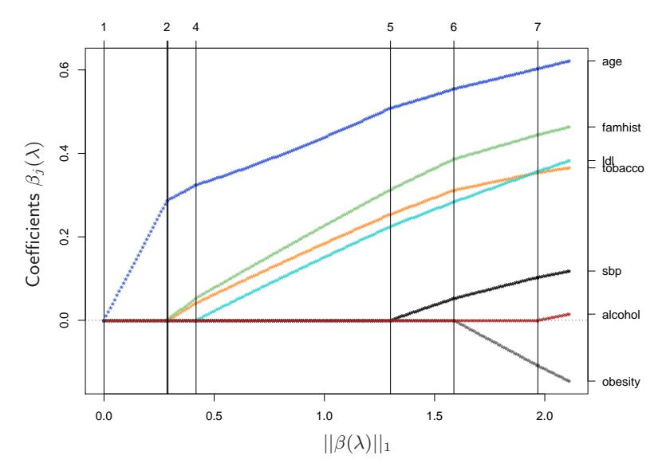

**FIGURE 4.13.**  $L_1$  regularized logistic regression coefficients for the South African heart disease data, plotted as a function of the  $L_1$  norm. The variables were all standardized to have unit variance. The profiles are computed exactly at each of the plotted points.

Figure 4.13 shows the  $L_1$  regularization path for the South African heart disease data of Section 4.4.2. This was produced using the R package glmpath (Park and Hastie, 2007), which uses predictor-corrector methods of convex optimization to identify the exact values of  $\lambda$  at which the active set of non-zero coefficients changes (vertical lines in the figure). Here the profiles look almost linear; in other examples the curvature will be more visible.

Coordinate descent methods (Section 3.8.6) are very efficient for computing the coefficient profiles on a grid of values for  $\lambda$ . The R package glmnet

(Friedman et al., 2010) can fit coefficient paths for very large logistic regression problems efficiently (large in N or p). Their algorithms can exploit sparsity in the predictor matrix  $\mathbf{X}$ , which allows for even larger problems. See Section 18.4 for more details, and a discussion of  $L_1$ -regularized multinomial models.

### 4.4.5 Logistic Regression or LDA?

In Section 4.3 we find that the log-posterior odds between class k and K are linear functions of x (4.9):

$$\log \frac{\Pr(G = k | X = x)}{\Pr(G = K | X = x)} = \log \frac{\pi_k}{\pi_K} - \frac{1}{2} (\mu_k + \mu_K)^T \mathbf{\Sigma}^{-1} (\mu_k - \mu_K) + x^T \mathbf{\Sigma}^{-1} (\mu_k - \mu_K)$$

$$= \alpha_{k0} + \alpha_k^T x. \tag{4.33}$$

This linearity is a consequence of the Gaussian assumption for the class densities, as well as the assumption of a common covariance matrix. The linear logistic model (4.17) by construction has linear logists:

$$\log \frac{\Pr(G = k | X = x)}{\Pr(G = K | X = x)} = \beta_{k0} + \beta_k^T x.$$
 (4.34)

It seems that the models are the same. Although they have exactly the same form, the difference lies in the way the linear coefficients are estimated. The logistic regression model is more general, in that it makes less assumptions. We can write the *joint density* of X and G as

$$Pr(X, G = k) = Pr(X)Pr(G = k|X), \tag{4.35}$$

where Pr(X) denotes the marginal density of the inputs X. For both LDA and logistic regression, the second term on the right has the logit-linear form

$$\Pr(G = k | X = x) = \frac{e^{\beta_{k0} + \beta_k^T x}}{1 + \sum_{\ell=1}^{K-1} e^{\beta_{\ell0} + \beta_\ell^T x}},$$
(4.36)

where we have again arbitrarily chosen the last class as the reference.

The logistic regression model leaves the marginal density of X as an arbitrary density function  $\Pr(X)$ , and fits the parameters of  $\Pr(G|X)$  by maximizing the conditional likelihood—the multinomial likelihood with probabilities the  $\Pr(G=k|X)$ . Although  $\Pr(X)$  is totally ignored, we can think of this marginal density as being estimated in a fully nonparametric and unrestricted fashion, using the empirical distribution function which places mass 1/N at each observation.

With LDA we fit the parameters by maximizing the full log-likelihood, based on the joint density

$$Pr(X, G = k) = \phi(X; \mu_k, \Sigma)\pi_k, \tag{4.37}$$

where φ is the Gaussian density function. Standard normal theory leads easily to the estimates ˆ$\mu$k,$\Sigma$ˆ , and ˆ$\pi$$^{k}$ given in Section 4.3. Since the linear parameters of the logistic form (4.33) are functions of the Gaussian parameters, we get their maximum-likelihood estimates by plugging in the corresponding estimates. However, unlike in the conditional case, the marginal density Pr(X) does play a role here. It is a mixture density

$$\Pr(X) = \sum_{k=1}^{K} \pi_k \phi(X; \mu_k, \Sigma), \tag{4.38}$$

which also involves the parameters.

What role can this additional component/restriction play? By relying on the additional model assumptions, we have more information about the parameters, and hence can estimate them more efficiently (lower variance). If in fact the true fk(x) are Gaussian, then in the worst case ignoring this marginal part of the likelihood constitutes a loss of efficiency of about 30% asymptotically in the error rate (Efron, 1975). Paraphrasing: with 30% more data, the conditional likelihood will do as well.

For example, observations far from the decision boundary (which are down-weighted by logistic regression) play a role in estimating the common covariance matrix. This is not all good news, because it also means that LDA is not robust to gross outliers.

From the mixture formulation, it is clear that even observations without class labels have information about the parameters. Often it is expensive to generate class labels, but unclassified observations come cheaply. By relying on strong model assumptions, such as here, we can use both types of information.

The marginal likelihood can be thought of as a regularizer, requiring in some sense that class densities be visible from this marginal view. For example, if the data in a two-class logistic regression model can be perfectly separated by a hyperplane, the maximum likelihood estimates of the parameters are undefined (i.e., infinite; see Exercise 4.5). The LDA coefficients for the same data will be well defined, since the marginal likelihood will not permit these degeneracies.

In practice these assumptions are never correct, and often some of the components of X are qualitative variables. It is generally felt that logistic regression is a safer, more robust bet than the LDA model, relying on fewer assumptions. It is our experience that the models give very similar results, even when LDA is used inappropriately, such as with qualitative predictors.

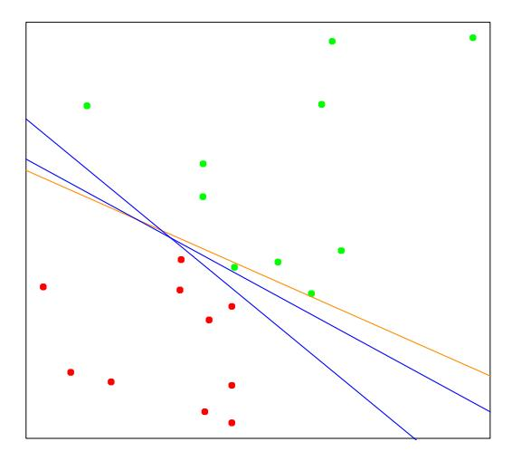

**FIGURE 4.14.** A toy example with two classes separable by a hyperplane. The orange line is the least squares solution, which misclassifies one of the training points. Also shown are two blue separating hyperplanes found by the perceptron learning algorithm with different random starts.

## 4.5 Separating Hyperplanes

We have seen that linear discriminant analysis and logistic regression both estimate linear decision boundaries in similar but slightly different ways. For the rest of this chapter we describe separating hyperplane classifiers. These procedures construct linear decision boundaries that explicitly try to separate the data into different classes as well as possible. They provide the basis for support vector classifiers, discussed in Chapter 12. The mathematical level of this section is somewhat higher than that of the previous sections.

Figure 4.14 shows 20 data points in two classes in  $\mathbb{R}^2$ . These data can be separated by a linear boundary. Included in the figure (blue lines) are two of the infinitely many possible *separating hyperplanes*. The orange line is the least squares solution to the problem, obtained by regressing the -1/1 response Y on X (with intercept); the line is given by

$$\{x: \hat{\beta}_0 + \hat{\beta}_1 x_1 + \hat{\beta}_2 x_2 = 0\}. \tag{4.39}$$

This least squares solution does not do a perfect job in separating the points, and makes one error. This is the same boundary found by LDA, in light of its equivalence with linear regression in the two-class case (Section 4.3 and Exercise 4.2).

Classifiers such as (4.39), that compute a linear combination of the input features and return the sign, were called *perceptrons* in the engineering liter-

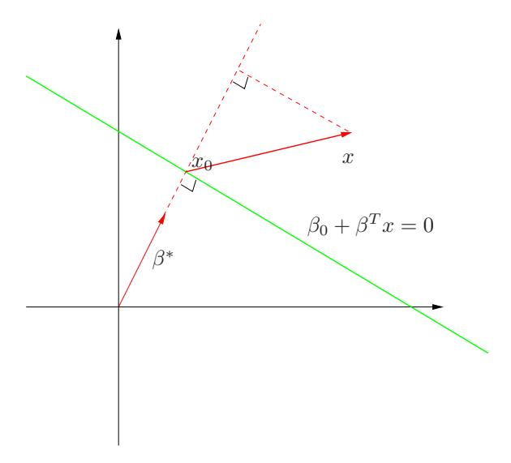

**FIGURE 4.15.** The linear algebra of a hyperplane (affine set).

ature in the late 1950s (Rosenblatt, 1958). Perceptrons set the foundations for the neural network models of the 1980s and 1990s.

Before we continue, let us digress slightly and review some vector algebra. Figure 4.15 depicts a hyperplane or *affine set L* defined by the equation  $f(x) = \beta_0 + \beta^T x = 0$ ; since we are in  $\mathbb{R}^2$  this is a line.

Here we list some properties:

1. For any two points  $x_1$  and  $x_2$  lying in L,  $\beta^T(x_1 x_2) = 0$ , and hence  $\beta^* = \beta/||\beta||$  is the vector normal to the surface of L.
2. For any point  $x_0$  in L,  $\beta^T x_0 = -\beta_0$ .
3. The signed distance of any point x to L is given by

$$\beta^{*T}(x - x_0) = \frac{1}{\|\beta\|} (\beta^T x + \beta_0)$$

$$= \frac{1}{\|f'(x)\|} f(x). \tag{4.40}$$

Hence f(x) is proportional to the signed distance from x to the hyperplane defined by f(x) = 0.

### 4.5.1 Rosenblatt's Perceptron Learning Algorithm

The perceptron learning algorithm tries to find a separating hyperplane by minimizing the distance of misclassified points to the decision boundary. If

a response y$^{i}$ = 1 is misclassified, then x T $^{i}$ $\beta$ + $\beta$$^{0}$ < 0, and the opposite for a misclassified response with y$^{i}$ = −1. The goal is to minimize

$$D(\beta, \beta_0) = -\sum_{i \in \mathcal{M}} y_i(x_i^T \beta + \beta_0), \tag{4.41}$$

where M indexes the set of misclassified points. The quantity is nonnegative and proportional to the distance of the misclassified points to the decision boundary defined by $\beta$ $^{T}$ x + $\beta$$^{0}$ = 0. The gradient (assuming M is fixed) is given by

$$\partial \frac{D(\beta, \beta_0)}{\partial \beta} = -\sum_{i \in \mathcal{M}} y_i x_i, \tag{4.42}$$

$$\partial \frac{D(\beta, \beta_0)}{\partial \beta_0} = -\sum_{i \in \mathcal{M}} y_i. \tag{4.43}$$

The algorithm in fact uses stochastic gradient descent to minimize this piecewise linear criterion. This means that rather than computing the sum of the gradient contributions of each observation followed by a step in the negative gradient direction, a step is taken after each observation is visited. Hence the misclassified observations are visited in some sequence, and the parameters $\beta$ are updated via

$$\begin{pmatrix} \beta \\ \beta_0 \end{pmatrix} \leftarrow \begin{pmatrix} \beta \\ \beta_0 \end{pmatrix} + \rho \begin{pmatrix} y_i x_i \\ y_i \end{pmatrix}. \tag{4.44}$$

Here $\rho$ is the learning rate, which in this case can be taken to be 1 without loss in generality. If the classes are linearly separable, it can be shown that the algorithm converges to a separating hyperplane in a finite number of steps (Exercise 4.6). Figure 4.14 shows two solutions to a toy problem, each started at a different random guess.

There are a number of problems with this algorithm, summarized in Ripley (1996):

- When the data are separable, there are many solutions, and which one is found depends on the starting values.
- The "finite" number of steps can be very large. The smaller the gap, the longer the time to find it.
- When the data are not separable, the algorithm will not converge, and cycles develop. The cycles can be long and therefore hard to detect.

The second problem can often be eliminated by seeking a hyperplane not in the original space, but in a much enlarged space obtained by creating many basis-function transformations of the original variables. This is analogous to driving the residuals in a polynomial regression problem down to zero by making the degree sufficiently large. Perfect separation cannot always be achieved: for example, if observations from two different classes share the same input. It may not be desirable either, since the resulting model is likely to be overfit and will not generalize well. We return to this point at the end of the next section.

A rather elegant solution to the first problem is to add additional constraints to the separating hyperplane.

### 4.5.2 Optimal Separating Hyperplanes

The optimal separating hyperplane separates the two classes and maximizes the distance to the closest point from either class (Vapnik, 1996). Not only does this provide a unique solution to the separating hyperplane problem, but by maximizing the margin between the two classes on the training data, this leads to better classification performance on test data.

We need to generalize criterion (4.41). Consider the optimization problem

$$\max_{\beta,\beta_0,||\beta||=1} M$$
subject to  $y_i(x_i^T \beta + \beta_0) \ge M, \ i = 1, \dots, N.$

$$(4.45)$$

The set of conditions ensure that all the points are at least a signed distance M from the decision boundary defined by $\beta$ and $\beta$0, and we seek the largest such M and associated parameters. We can get rid of the ||$\beta$|| = 1 constraint by replacing the conditions with

$$\frac{1}{||\beta||} y_i(x_i^T \beta + \beta_0) \ge M, \tag{4.46}$$

(which redefines $\beta$0) or equivalently

$$y_i(x_i^T \beta + \beta_0) \ge M||\beta||. \tag{4.47}$$

Since for any $\beta$ and $\beta$$^{0}$ satisfying these inequalities, any positively scaled multiple satisfies them too, we can arbitrarily set ||$\beta$|| = 1/M. Thus (4.45) is equivalent to

$$\min_{\beta,\beta_0} \frac{1}{2} ||\beta||^2$$
subject to  $y_i(x_i^T \beta + \beta_0) \ge 1, \ i = 1, \dots, N.$

In light of (4.40), the constraints define an empty slab or margin around the linear decision boundary of thickness 1/||$\beta$||. Hence we choose $\beta$ and $\beta$$^{0}$ to maximize its thickness. This is a convex optimization problem (quadratic criterion with linear inequality constraints). The Lagrange (primal) function, to be minimized w.r.t. $\beta$ and $\beta$0, is

$$L_P = \frac{1}{2}||\beta||^2 - \sum_{i=1}^N \alpha_i [y_i(x_i^T \beta + \beta_0) - 1]. \tag{4.49}$$

Setting the derivatives to zero, we obtain:

$$\beta = \sum_{i=1}^{N} \alpha_i y_i x_i, \tag{4.50}$$

$$0 = \sum_{i=1}^{N} \alpha_i y_i, \tag{4.51}$$

and substituting these in (4.49) we obtain the so-called Wolfe dual

$$L_D = \sum_{i=1}^{N} \alpha_i - \frac{1}{2} \sum_{i=1}^{N} \sum_{k=1}^{N} \alpha_i \alpha_k y_i y_k x_i^T x_k$$
subject to  $\alpha_i \ge 0$  and  $\sum_{i=1}^{N} \alpha_i y_i = 0$ . (4.52)

The solution is obtained by maximizing L$^{D}$ in the positive orthant, a simpler convex optimization problem, for which standard software can be used. In addition the solution must satisfy the Karush–Kuhn–Tucker conditions, which include (4.50), (4.51), (4.52) and

$$\alpha_i[y_i(x_i^T\beta + \beta_0) - 1] = 0 \,\forall i. \tag{4.53}$$

From these we can see that

- if $\alpha$$^{i}$ > 0, then yi(x T $^{i}$ $\beta$ + $\beta$0) = 1, or in other words, x$^{i}$ is on the boundary of the slab;
- if yi(x T $^{i}$ $\beta$+$\beta$0) > 1, x$^{i}$ is not on the boundary of the slab, and $\alpha$$^{i}$ = 0.

From (4.50) we see that the solution vector $\beta$ is defined in terms of a linear combination of the support points xi—those points defined to be on the boundary of the slab via $\alpha$$^{i}$ > 0. Figure 4.16 shows the optimal separating hyperplane for our toy example; there are three support points. Likewise, $\beta$$^{0}$ is obtained by solving (4.53) for any of the support points.

The optimal separating hyperplane produces a function ˆf(x) = x $^{T}$ $\beta$ˆ+$\beta$ˆ 0 for classifying new observations:

$$\hat{G}(x) = \operatorname{sign}\hat{f}(x). \tag{4.54}$$

Although none of the training observations fall in the margin (by construction), this will not necessarily be the case for test observations. The

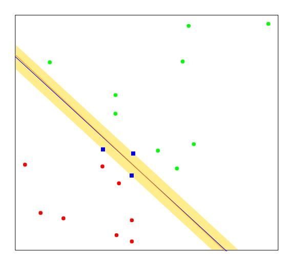

**FIGURE 4.16.** The same data as in Figure 4.14. The shaded region delineates the maximum margin separating the two classes. There are three support points indicated, which lie on the boundary of the margin, and the optimal separating hyperplane (blue line) bisects the slab. Included in the figure is the boundary found using logistic regression (red line), which is very close to the optimal separating hyperplane (see Section 12.3.3).

intuition is that a large margin on the training data will lead to good separation on the test data.

The description of the solution in terms of support points seems to suggest that the optimal hyperplane focuses more on the points that count, and is more robust to model misspecification. The LDA solution, on the other hand, depends on all of the data, even points far away from the decision boundary. Note, however, that the identification of these support points required the use of all the data. Of course, if the classes are really Gaussian, then LDA is optimal, and separating hyperplanes will pay a price for focusing on the (noisier) data at the boundaries of the classes.

Included in Figure 4.16 is the logistic regression solution to this problem, fit by maximum likelihood. Both solutions are similar in this case. When a separating hyperplane exists, logistic regression will always find it, since the log-likelihood can be driven to 0 in this case (Exercise 4.5). The logistic regression solution shares some other qualitative features with the separating hyperplane solution. The coefficient vector is defined by a weighted least squares fit of a zero-mean linearized response on the input features, and the weights are larger for points near the decision boundary than for those further away.

When the data are not separable, there will be no feasible solution to this problem, and an alternative formulation is needed. Again one can enlarge the space using basis transformations, but this can lead to artificial separation through over-fitting. In Chapter 12 we discuss a more attractive alternative known as the support vector machine, which allows for overlap, but minimizes a measure of the extent of this overlap.

## Bibliographic Notes

Good general texts on classification include Duda et al. (2000), Hand (1981), McLachlan (1992) and Ripley (1996). Mardia et al. (1979) have a concise discussion of linear discriminant analysis. Michie et al. (1994) compare a large number of popular classifiers on benchmark datasets. Linear separating hyperplanes are discussed in Vapnik (1996). Our account of the perceptron learning algorithm follows Ripley (1996).

## Exercises

Ex. 4.1 Show how to solve the generalized eigenvalue problem max a $^{T}$ Ba subject to a $^{T}$Wa = 1 by transforming to a standard eigenvalue problem.

Ex. 4.2 Suppose we have features $^{x}$ $^{\in}$ IR$^{p}$ , a two-class response, with class sizes N1, N2, and the target coded as −N/N1, N/N2.

(a) Show that the LDA rule classifies to class 2 if

$$x^T \hat{\boldsymbol{\Sigma}}^{-1}(\hat{\mu}_2 - \hat{\mu}_1) > \frac{1}{2}(\hat{\mu}_2 + \hat{\mu}_1)^T \hat{\boldsymbol{\Sigma}}^{-1}(\hat{\mu}_2 - \hat{\mu}_1) - \log(N_2/N_1),$$

and class 1 otherwise.

(b) Consider minimization of the least squares criterion

$$\sum_{i=1}^{N} (y_i - \beta_0 - x_i^T \beta)^2. \tag{4.55}$$

Show that the solution $\beta$ˆ satisfies

$$\left[ (N-2)\hat{\Sigma} + N\hat{\Sigma}_B \right] \beta = N(\hat{\mu}_2 - \hat{\mu}_1)$$
 (4.56)

(after simplification), where $\Sigma$ˆ $^{B}$ = N1N$^{2}$ $^{N}$$^{2}$ (ˆ$\mu$$^{2}$ − $\mu$ˆ1)(ˆ$\mu$$^{2}$ − $\mu$ˆ1) T .

(c) Hence show that $^{\Sigma}$$^{ˆ}$ $^{B}$$^{\beta}$ is in the direction (ˆ$\mu$$^{2}$ $^{−}$ $^{\mu}$ˆ1) and thus

$$\hat{\beta} \propto \hat{\Sigma}^{-1} (\hat{\mu}_2 - \hat{\mu}_1). \tag{4.57}$$

Therefore the least-squares regression coefficient is identical to the LDA coefficient, up to a scalar multiple.

- (d) Show that this result holds for any (distinct) coding of the two classes.
- (e) Find the solution  $\hat{\beta}_0$  (up to the same scalar multiple as in (c), and hence the predicted value  $\hat{f}(x) = \hat{\beta}_0 + x^T \hat{\beta}$ . Consider the following rule: classify to class 2 if  $\hat{f}(x) > 0$  and class 1 otherwise. Show this is not the same as the LDA rule unless the classes have equal numbers of observations.

(Fisher, 1936; Ripley, 1996)

Ex. 4.3 Suppose we transform the original predictors  $\mathbf{X}$  to  $\hat{\mathbf{Y}}$  via linear regression. In detail, let  $\hat{\mathbf{Y}} = \mathbf{X}(\mathbf{X}^T\mathbf{X})^{-1}\mathbf{X}^T\mathbf{Y} = \mathbf{X}\hat{\mathbf{B}}$ , where  $\mathbf{Y}$  is the indicator response matrix. Similarly for any input  $x \in \mathbb{R}^p$ , we get a transformed vector  $\hat{y} = \hat{\mathbf{B}}^T x \in \mathbb{R}^K$ . Show that LDA using  $\hat{\mathbf{Y}}$  is identical to LDA in the original space.

Ex. 4.4 Consider the multilogit model with K classes (4.17). Let  $\beta$  be the (p+1)(K-1)-vector consisting of all the coefficients. Define a suitably enlarged version of the input vector x to accommodate this vectorized coefficient matrix. Derive the Newton-Raphson algorithm for maximizing the multinomial log-likelihood, and describe how you would implement this algorithm.

Ex. 4.5 Consider a two-class logistic regression problem with  $x \in \mathbb{R}$ . Characterize the maximum-likelihood estimates of the slope and intercept parameter if the sample  $x_i$  for the two classes are separated by a point  $x_0 \in \mathbb{R}$ . Generalize this result to (a)  $x \in \mathbb{R}^p$  (see Figure 4.16), and (b) more than two classes.

Ex. 4.6 Suppose we have N points  $x_i$  in  $\mathbb{R}^p$  in general position, with class labels  $y_i \in \{-1, 1\}$ . Prove that the perceptron learning algorithm converges to a separating hyperplane in a finite number of steps:

- (a) Denote a hyperplane by  $f(x) = \beta_1^T x + \beta_0 = 0$ , or in more compact notation  $\beta^T x^* = 0$ , where  $x^* = (x, 1)$  and  $\beta = (\beta_1, \beta_0)$ . Let  $z_i = x_i^*/||x_i^*||$ . Show that separability implies the existence of a  $\beta_{\text{sep}}$  such that  $y_i \beta_{\text{sep}}^T z_i \geq 1 \ \forall i$
- (b) Given a current  $\beta_{\text{old}}$ , the perceptron algorithm identifies a point  $z_i$  that is misclassified, and produces the update  $\beta_{\text{new}} \leftarrow \beta_{\text{old}} + y_i z_i$ . Show that  $||\beta_{\text{new}} \beta_{\text{sep}}||^2 \le ||\beta_{\text{old}} \beta_{\text{sep}}||^2 1$ , and hence that the algorithm converges to a separating hyperplane in no more than  $||\beta_{\text{start}} \beta_{\text{sep}}||^2$  steps (Ripley, 1996).

Ex. 4.7 Consider the criterion

$$D^*(\beta, \beta_0) = -\sum_{i=1}^{N} y_i (x_i^T \beta + \beta_0), \tag{4.58}$$

a generalization of (4.41) where we sum over all the observations. Consider minimizing  $D^*$  subject to  $||\beta|| = 1$ . Describe this criterion in words. Does it solve the optimal separating hyperplane problem?

Ex. 4.8 Consider the multivariate Gaussian model  $X|G = k \sim N(\mu_k, \Sigma)$ , with the additional restriction that  $\operatorname{rank}\{\mu_k\}_1^K = L < \max(K-1, p)$ . Derive the constrained MLEs for the  $\mu_k$  and  $\Sigma$ . Show that the Bayes classification rule is equivalent to classifying in the reduced subspace computed by LDA (Hastie and Tibshirani, 1996b).

Ex. 4.9 Write a computer program to perform a quadratic discriminant analysis by fitting a separate Gaussian model per class. Try it out on the vowel data, and compute the misclassification error for the test data. The data can be found in the book website www-stat.stanford.edu/ElemStatLearn.
