# Basis Expansions and Regularization

# 5.1 Introduction

We have already made use of models linear in the input features, both for regression and classification. Linear regression, linear discriminant analysis, logistic regression and separating hyperplanes all rely on a linear model. It is extremely unlikely that the true function f(X) is actually linear in X. In regression problems, f(X) = E(Y |X) will typically be nonlinear and nonadditive in X, and representing f(X) by a linear model is usually a convenient, and sometimes a necessary, approximation. Convenient because a linear model is easy to interpret, and is the first-order Taylor approximation to f(X). Sometimes necessary, because with N small and/or p large, a linear model might be all we are able to fit to the data without overfitting. Likewise in classification, a linear, Bayes-optimal decision boundary implies that some monotone transformation of Pr(Y = 1|X) is linear in X. This is inevitably an approximation.

In this chapter and the next we discuss popular methods for moving beyond linearity. The core idea in this chapter is to augment/replace the vector of inputs X with additional variables, which are transformations of X, and then use linear models in this new space of derived input features.

Denote by hm(X) : IRp 7→ IR the mth transformation of X, m = 1, . . . , M. We then model

$$f(X) = \sum_{m=1}^{M} \beta_m h_m(X),$$
 (5.1)

a linear basis expansion in X. The beauty of this approach is that once the basis functions  $h_m$  have been determined, the models are linear in these new variables, and the fitting proceeds as before.

Some simple and widely used examples of the  $h_m$  are the following:

- $h_m(X) = X_m$ , m = 1, ..., p recovers the original linear model.
- $h_m(X) = X_j^2$  or  $h_m(X) = X_j X_k$  allows us to augment the inputs with polynomial terms to achieve higher-order Taylor expansions. Note, however, that the number of variables grows exponentially in the degree of the polynomial. A full quadratic model in p variables requires  $O(p^2)$  square and cross-product terms, or more generally  $O(p^d)$  for a degree-d polynomial.
- $h_m(X) = \log(X_j)$ ,  $\sqrt{X_j}$ ,... permits other nonlinear transformations of single inputs. More generally one can use similar functions involving several inputs, such as  $h_m(X) = ||X||$ .
- $h_m(X) = I(L_m \le X_k < U_m)$ , an indicator for a region of  $X_k$ . By breaking the range of  $X_k$  up into  $M_k$  such nonoverlapping regions results in a model with a piecewise constant contribution for  $X_k$ .

Sometimes the problem at hand will call for particular basis functions  $h_m$ , such as logarithms or power functions. More often, however, we use the basis expansions as a device to achieve more flexible representations for f(X). Polynomials are an example of the latter, although they are limited by their global nature—tweaking the coefficients to achieve a functional form in one region can cause the function to flap about madly in remote regions. In this chapter we consider more useful families of piecewise-polynomials and splines that allow for local polynomial representations. We also discuss the wavelet bases, especially useful for modeling signals and images. These methods produce a dictionary  $\mathcal D$  consisting of typically a very large number  $|\mathcal D|$  of basis functions, far more than we can afford to fit to our data. Along with the dictionary we require a method for controlling the complexity of our model, using basis functions from the dictionary. There are three common approaches:

 Restriction methods, where we decide before-hand to limit the class of functions. Additivity is an example, where we assume that our model has the form

$$f(X) = \sum_{j=1}^{p} f_j(X_j)$$

$$= \sum_{j=1}^{p} \sum_{m=1}^{M_j} \beta_{jm} h_{jm}(X_j).$$
 (5.2)

The size of the model is limited by the number of basis functions  $M_j$  used for each component function  $f_j$ .

- Selection methods, which adaptively scan the dictionary and include only those basis functions  $h_m$  that contribute significantly to the fit of the model. Here the variable selection techniques discussed in Chapter 3 are useful. The stagewise greedy approaches such as CART, MARS and boosting fall into this category as well.
- Regularization methods where we use the entire dictionary but restrict the coefficients. Ridge regression is a simple example of a regularization approach, while the lasso is both a regularization and selection method. Here we discuss these and more sophisticated methods for regularization.

# 5.2 Piecewise Polynomials and Splines

We assume until Section 5.7 that X is one-dimensional. A piecewise polynomial function f(X) is obtained by dividing the domain of X into contiguous intervals, and representing f by a separate polynomial in each interval. Figure 5.1 shows two simple piecewise polynomials. The first is piecewise constant, with three basis functions:

$$h_1(X) = I(X < \xi_1), \quad h_2(X) = I(\xi_1 \le X < \xi_2), \quad h_3(X) = I(\xi_2 \le X).$$

Since these are positive over disjoint regions, the least squares estimate of the model  $f(X) = \sum_{m=1}^{3} \beta_m h_m(X)$  amounts to  $\hat{\beta}_m = \bar{Y}_m$ , the mean of Y in the mth region.

The top right panel shows a piecewise linear fit. Three additional basis functions are needed:  $h_{m+3} = h_m(X)X$ , m = 1, ..., 3. Except in special cases, we would typically prefer the third panel, which is also piecewise linear, but restricted to be continuous at the two knots. These continuity restrictions lead to linear constraints on the parameters; for example,  $f(\xi_1^-) = f(\xi_1^+)$  implies that  $\beta_1 + \xi_1 \beta_4 = \beta_2 + \xi_1 \beta_5$ . In this case, since there are two restrictions, we expect to  $get\ back$  two parameters, leaving four free parameters.

A more direct way to proceed in this case is to use a basis that incorporates the constraints:

$$h_1(X) = 1$$
,  $h_2(X) = X$ ,  $h_3(X) = (X - \xi_1)_+$ ,  $h_4(X) = (X - \xi_2)_+$ ,

where  $t_+$  denotes the positive part. The function  $h_3$  is shown in the lower right panel of Figure 5.1. We often prefer smoother functions, and these can be achieved by increasing the order of the local polynomial. Figure 5.2 shows a series of piecewise-cubic polynomials fit to the same data, with

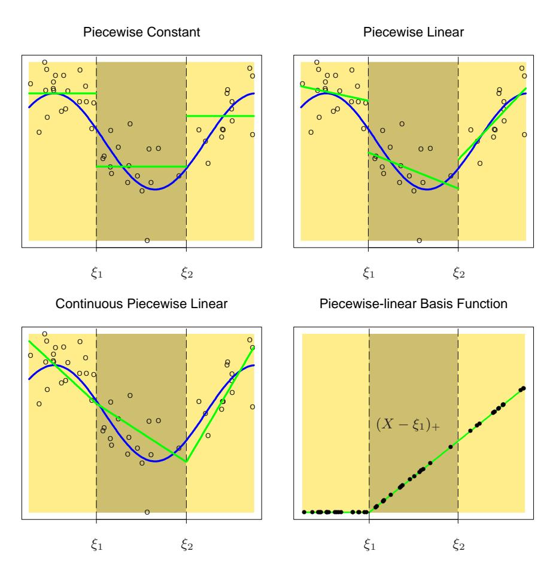

**FIGURE 5.1.** The top left panel shows a piecewise constant function fit to some artificial data. The broken vertical lines indicate the positions of the two knots  $\xi_1$  and  $\xi_2$ . The blue curve represents the true function, from which the data were generated with Gaussian noise. The remaining two panels show piecewise linear functions fit to the same data—the top right unrestricted, and the lower left restricted to be continuous at the knots. The lower right panel shows a piecewise–linear basis function,  $h_3(X) = (X - \xi_1)_+$ , continuous at  $\xi_1$ . The black points indicate the sample evaluations  $h_3(x_i)$ ,  $i = 1, \ldots, N$ .

#### Piecewise Cubic Polynomials

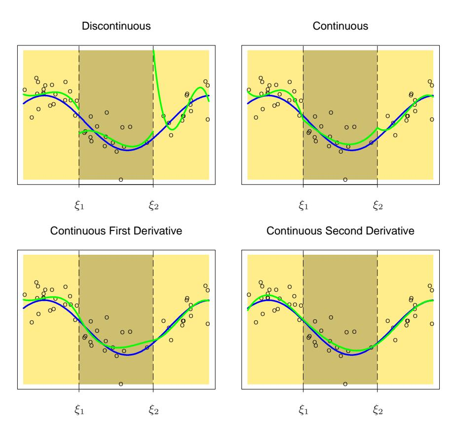

**FIGURE 5.2.** A series of piecewise-cubic polynomials, with increasing orders of continuity.

increasing orders of continuity at the knots. The function in the lower right panel is continuous, and has continuous first and second derivatives at the knots. It is known as a *cubic spline*. Enforcing one more order of continuity would lead to a global cubic polynomial. It is not hard to show (Exercise 5.1) that the following basis represents a cubic spline with knots at  $\xi_1$  and  $\xi_2$ :

$$h_1(X) = 1, \quad h_3(X) = X^2, \quad h_5(X) = (X - \xi_1)_+^3,$$
  
 $h_2(X) = X, \quad h_4(X) = X^3, \quad h_6(X) = (X - \xi_2)_+^3.$  (5.3)

There are six basis functions corresponding to a six-dimensional linear space of functions. A quick check confirms the parameter count:  $(3 \text{ regions}) \times (4 \text{ parameters per region}) - (2 \text{ knots}) \times (3 \text{ constraints per knot}) = 6.$ 

More generally, an order-M spline with knots ξj , j = 1, . . . , K is a piecewise-polynomial of order M, and has continuous derivatives up to order M − 2. A cubic spline has M = 4. In fact the piecewise-constant function in Figure 5.1 is an order-1 spline, while the continuous piecewise linear function is an order-2 spline. Likewise the general form for the truncated-power basis set would be

$$h_j(X) = X^{j-1}, j = 1, \dots, M,$$
  
 $h_{M+\ell}(X) = (X - \xi_{\ell})_+^{M-1}, \ell = 1, \dots, K.$ 

It is claimed that cubic splines are the lowest-order spline for which the knot-discontinuity is not visible to the human eye. There is seldom any good reason to go beyond cubic-splines, unless one is interested in smooth derivatives. In practice the most widely used orders are M = 1, 2 and 4.

These fixed-knot splines are also known as regression splines. One needs to select the order of the spline, the number of knots and their placement. One simple approach is to parameterize a family of splines by the number of basis functions or degrees of freedom, and have the observations xi determine the positions of the knots. For example, the expression bs(x,df=7) in R generates a basis matrix of cubic-spline functions evaluated at the N observations in x, with the 7−3 = 41 interior knots at the appropriate percentiles of x (20, 40, 60 and 80th.) One can be more explicit, however; bs(x, degree=1, knots = c(0.2, 0.4, 0.6)) generates a basis for linear splines, with three interior knots, and returns an N × 4 matrix.

Since the space of spline functions of a particular order and knot sequence is a vector space, there are many equivalent bases for representing them (just as there are for ordinary polynomials.) While the truncated power basis is conceptually simple, it is not too attractive numerically: powers of large numbers can lead to severe rounding problems. The B-spline basis, described in the Appendix to this chapter, allows for efficient computations even when the number of knots K is large.

#### 5.2.1 Natural Cubic Splines

We know that the behavior of polynomials fit to data tends to be erratic near the boundaries, and extrapolation can be dangerous. These problems are exacerbated with splines. The polynomials fit beyond the boundary knots behave even more wildly than the corresponding global polynomials in that region. This can be conveniently summarized in terms of the pointwise variance of spline functions fit by least squares (see the example in the next section for details on these variance calculations). Figure 5.3 compares

1A cubic spline with four knots is eight-dimensional. The bs() function omits by default the constant term in the basis, since terms like this are typically included with other terms in the model.

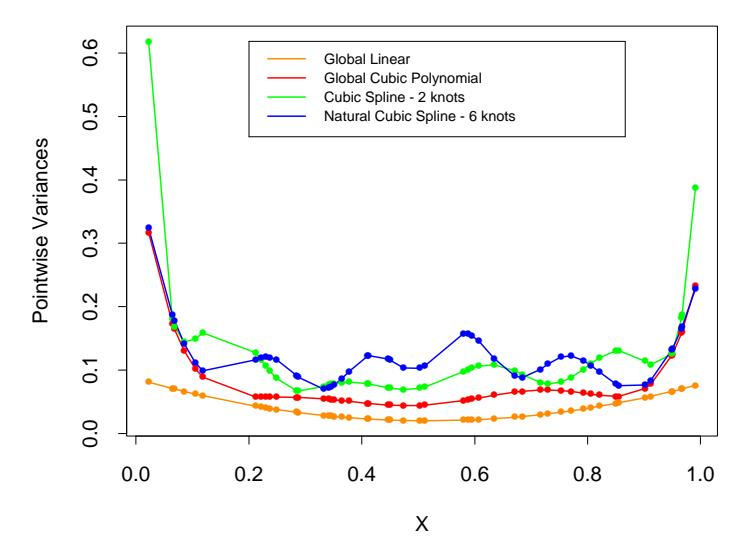

**FIGURE 5.3.** Pointwise variance curves for four different models, with X consisting of 50 points drawn at random from U[0,1], and an assumed error model with constant variance. The linear and cubic polynomial fits have two and four degrees of freedom, respectively, while the cubic spline and natural cubic spline each have six degrees of freedom. The cubic spline has two knots at 0.33 and 0.66, while the natural spline has boundary knots at 0.1 and 0.9, and four interior knots uniformly spaced between them.

the pointwise variances for a variety of different models. The explosion of the variance near the boundaries is clear, and inevitably is worst for cubic splines.

A natural cubic spline adds additional constraints, namely that the function is linear beyond the boundary knots. This frees up four degrees of freedom (two constraints each in both boundary regions), which can be spent more profitably by sprinkling more knots in the interior region. This tradeoff is illustrated in terms of variance in Figure 5.3. There will be a price paid in bias near the boundaries, but assuming the function is linear near the boundaries (where we have less information anyway) is often considered reasonable.

A natural cubic spline with K knots is represented by K basis functions. One can start from a basis for cubic splines, and derive the reduced basis by imposing the boundary constraints. For example, starting from the truncated power series basis described in Section 5.2, we arrive at (Exercise 5.4):

$$N_1(X) = 1, \quad N_2(X) = X, \quad N_{k+2}(X) = d_k(X) - d_{K-1}(X),$$
 (5.4)

where

$$d_k(X) = \frac{(X - \xi_k)_+^3 - (X - \xi_K)_+^3}{\xi_K - \xi_k}.$$
 (5.5)

Each of these basis functions can be seen to have zero second and third derivative for  $X \geq \xi_K$ .

#### 5.2.2 Example: South African Heart Disease (Continued)

In Section 4.4.2 we fit linear logistic regression models to the South African heart disease data. Here we explore nonlinearities in the functions using natural splines. The functional form of the model is

$$logit[Pr(chd|X)] = \theta_0 + h_1(X_1)^T \theta_1 + h_2(X_2)^T \theta_2 + \dots + h_p(X_p)^T \theta_p, (5.6)$$

where each of the  $\theta_j$  are vectors of coefficients multiplying their associated vector of natural spline basis functions  $h_j$ .

We use four natural spline bases for each term in the model. For example, with  $X_1$  representing  $\operatorname{sbp}$ ,  $h_1(X_1)$  is a basis consisting of four basis functions. This actually implies three rather than two interior knots (chosen at uniform quantiles of  $\operatorname{sbp}$ ), plus two boundary knots at the extremes of the data, since we exclude the constant term from each of the  $h_j$ .

Since famhist is a two-level factor, it is coded by a simple binary or dummy variable, and is associated with a single coefficient in the fit of the model.

More compactly we can combine all p vectors of basis functions (and the constant term) into one big vector h(X), and then the model is simply  $h(X)^T \theta$ , with total number of parameters  $\mathrm{d} f = 1 + \sum_{j=1}^p \mathrm{d} f_j$ , the sum of the parameters in each component term. Each basis function is evaluated at each of the N samples, resulting in a  $N \times \mathrm{d} f$  basis matrix  $\mathbf{H}$ . At this point the model is like any other linear logistic model, and the algorithms described in Section 4.4.1 apply.

We carried out a backward stepwise deletion process, dropping terms from this model while preserving the group structure of each term, rather than dropping one coefficient at a time. The AIC statistic (Section 7.5) was used to drop terms, and all the terms remaining in the final model would cause AIC to increase if deleted from the model (see Table 5.1). Figure 5.4 shows a plot of the final model selected by the stepwise regression. The functions displayed are  $\hat{f}_j(X_j) = h_j(X_j)^T \hat{\theta}_j$  for each variable  $X_j$ . The covariance matrix  $\text{Cov}(\hat{\theta}) = \Sigma$  is estimated by  $\hat{\Sigma} = (\mathbf{H}^T \mathbf{W} \mathbf{H})^{-1}$ , where  $\mathbf{W}$  is the diagonal weight matrix from the logistic regression. Hence  $v_j(X_j) = \text{Var}[\hat{f}_j(X_j)] = h_j(X_j)^T \hat{\Sigma}_{jj} h_j(X_j)$  is the pointwise variance function of  $\hat{f}_j$ , where  $\text{Cov}(\hat{\theta}_j) = \hat{\Sigma}_{jj}$  is the appropriate sub-matrix of  $\hat{\Sigma}$ . The shaded region in each panel is defined by  $\hat{f}_j(X_j) \pm 2\sqrt{v_j(X_j)}$ .

The AIC statistic is slightly more generous than the likelihood-ratio test (deviance test). Both sbp and obesity are included in this model, while

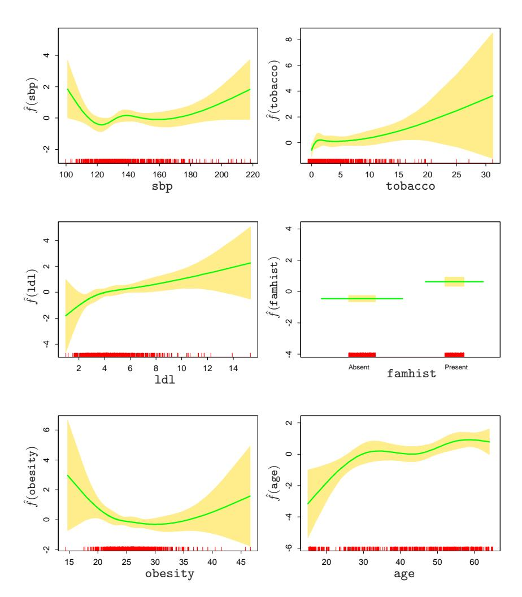

FIGURE 5.4. Fitted natural-spline functions for each of the terms in the final model selected by the stepwise procedure. Included are pointwise standard-error bands. The rug plot at the base of each figure indicates the location of each of the sample values for that variable (jittered to break ties).

TABLE 5.1. Final logistic regression model, after stepwise deletion of natural splines terms. The column labeled "LRT" is the likelihood-ratio test statistic when that term is deleted from the model, and is the change in deviance from the full model (labeled "none").

| Terms   | Df | Deviance | AIC    | LRT    | P-value |
|---------|----|----------|--------|--------|---------|
| none    |    | 458.09   | 502.09 |        |         |
| sbp     | 4  | 467.16   | 503.16 | 9.076  | 0.059   |
| tobacco | 4  | 470.48   | 506.48 | 12.387 | 0.015   |
| ldl     | 4  | 472.39   | 508.39 | 14.307 | 0.006   |
| famhist | 1  | 479.44   | 521.44 | 21.356 | 0.000   |
| obesity | 4  | 466.24   | 502.24 | 8.147  | 0.086   |
| age     | 4  | 481.86   | 517.86 | 23.768 | 0.000   |

they were not in the linear model. The figure explains why, since their contributions are inherently nonlinear. These effects at first may come as a surprise, but an explanation lies in the nature of the retrospective data. These measurements were made sometime after the patients suffered a heart attack, and in many cases they had already benefited from a healthier diet and lifestyle, hence the apparent increase in risk at low values for obesity and sbp. Table 5.1 shows a summary of the selected model.

#### 5.2.3 Example: Phoneme Recognition

In this example we use splines to reduce flexibility rather than increase it; the application comes under the general heading of functional modeling. In the top panel of Figure 5.5 are displayed a sample of 15 log-periodograms for each of the two phonemes "aa" and "ao" measured at 256 frequencies. The goal is to use such data to classify a spoken phoneme. These two phonemes were chosen because they are difficult to separate.

The input feature is a vector x of length 256, which we can think of as a vector of evaluations of a function X(f) over a grid of frequencies f. In reality there is a continuous analog signal which is a function of frequency, and we have a sampled version of it.

The gray lines in the lower panel of Figure 5.5 show the coefficients of a linear logistic regression model fit by maximum likelihood to a training sample of 1000 drawn from the total of 695 "aa"s and 1022 "ao"s. The coefficients are also plotted as a function of frequency, and in fact we can think of the model in terms of its continuous counterpart

$$\log \frac{\Pr(\operatorname{aa}|X)}{\Pr(\operatorname{ao}|X)} = \int X(f)\beta(f)df, \tag{5.7}$$

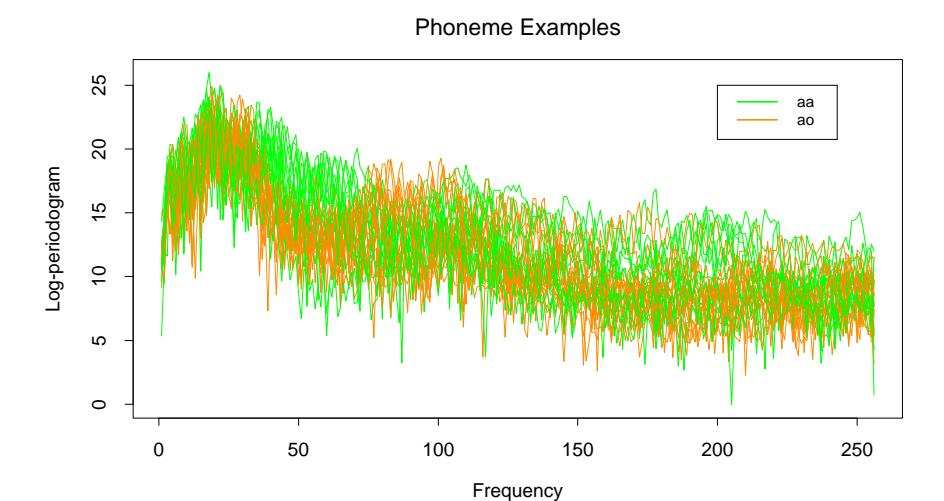

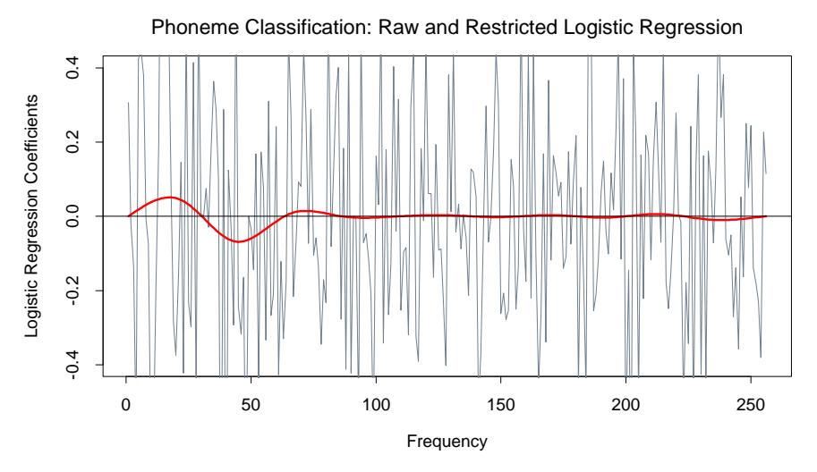

FIGURE 5.5. The top panel displays the log-periodogram as a function of frequency for 15 examples each of the phonemes "aa" and "ao" sampled from a total of 695 "aa"s and 1022 "ao"s. Each log-periodogram is measured at 256 uniformly spaced frequencies. The lower panel shows the coefficients (as a function of frequency) of a logistic regression fit to the data by maximum likelihood, using the 256 log-periodogram values as inputs. The coefficients are restricted to be smooth in the red curve, and are unrestricted in the jagged gray curve.

which we approximate by

$$\sum_{j=1}^{256} X(f_j)\beta(f_j) = \sum_{j=1}^{256} x_j\beta_j.$$
 (5.8)

The coefficients compute a contrast functional, and will have appreciable values in regions of frequency where the log-periodograms differ between the two classes.

The gray curves are very rough. Since the input signals have fairly strong positive autocorrelation, this results in negative autocorrelation in the coefficients. In addition the sample size effectively provides only four observations per coefficient.

Applications such as this permit a natural regularization. We force the coefficients to vary smoothly as a function of frequency. The red curve in the lower panel of Figure 5.5 shows such a smooth coefficient curve fit to these data. We see that the lower frequencies offer the most discriminatory power. Not only does the smoothing allow easier interpretation of the contrast, it also produces a more accurate classifier:

|                | Raw   | Regularized |
|----------------|-------|-------------|
| Training error | 0.080 | 0.185       |
| Test error     | 0.255 | 0.158       |

The smooth red curve was obtained through a very simple use of natural cubic splines. We can represent the coefficient function as an expansion of splines  $\beta(f) = \sum_{m=1}^{M} h_m(f)\theta_m$ . In practice this means that  $\beta = \mathbf{H}\theta$  where,  $\mathbf{H}$  is a  $p \times M$  basis matrix of natural cubic splines, defined on the set of frequencies. Here we used M = 12 basis functions, with knots uniformly placed over the integers  $1, 2, \ldots, 256$  representing the frequencies. Since  $x^T\beta = x^T\mathbf{H}\theta$ , we can simply replace the input features x by their filtered versions  $x^* = \mathbf{H}^T x$ , and fit  $\theta$  by linear logistic regression on the  $x^*$ . The red curve is thus  $\hat{\beta}(f) = h(f)^T\hat{\theta}$ .

### 5.3 Filtering and Feature Extraction

In the previous example, we constructed a  $p \times M$  basis matrix  $\mathbf{H}$ , and then transformed our features x into new features  $x^* = \mathbf{H}^T x$ . These filtered versions of the features were then used as inputs into a learning procedure: in the previous example, this was linear logistic regression.

Preprocessing of high-dimensional features is a very general and powerful method for improving the performance of a learning algorithm. The preprocessing need not be linear as it was above, but can be a general

(nonlinear) function of the form x ∗ = g(x). The derived features x ∗ can then be used as inputs into any (linear or nonlinear) learning procedure.

For example, for signal or image recognition a popular approach is to first transform the raw features via a wavelet transform x ∗ = HT x (Section 5.9) and then use the features x ∗ as inputs into a neural network (Chapter 11). Wavelets are effective in capturing discrete jumps or edges, and the neural network is a powerful tool for constructing nonlinear functions of these features for predicting the target variable. By using domain knowledge to construct appropriate features, one can often improve upon a learning method that has only the raw features x at its disposal.

# 5.4 Smoothing Splines

Here we discuss a spline basis method that avoids the knot selection problem completely by using a maximal set of knots. The complexity of the fit is controlled by regularization. Consider the following problem: among all functions f(x) with two continuous derivatives, find one that minimizes the penalized residual sum of squares

$$RSS(f,\lambda) = \sum_{i=1}^{N} \{y_i - f(x_i)\}^2 + \lambda \int \{f''(t)\}^2 dt,$$
 (5.9)

where λ is a fixed smoothing parameter. The first term measures closeness to the data, while the second term penalizes curvature in the function, and λ establishes a tradeoff between the two. Two special cases are:

λ = 0 : f can be any function that interpolates the data.

λ = ∞ : the simple least squares line fit, since no second derivative can be tolerated.

These vary from very rough to very smooth, and the hope is that λ ∈ (0,∞) indexes an interesting class of functions in between.

The criterion (5.9) is defined on an infinite-dimensional function space in fact, a Sobolev space of functions for which the second term is defined. Remarkably, it can be shown that (5.9) has an explicit, finite-dimensional, unique minimizer which is a natural cubic spline with knots at the unique values of the xi , i = 1, . . . , N (Exercise 5.7). At face value it seems that the family is still over-parametrized, since there are as many as N knots, which implies N degrees of freedom. However, the penalty term translates to a penalty on the spline coefficients, which are shrunk some of the way toward the linear fit.

Since the solution is a natural spline, we can write it as

$$f(x) = \sum_{j=1}^{N} N_j(x)\theta_j,$$
 (5.10)

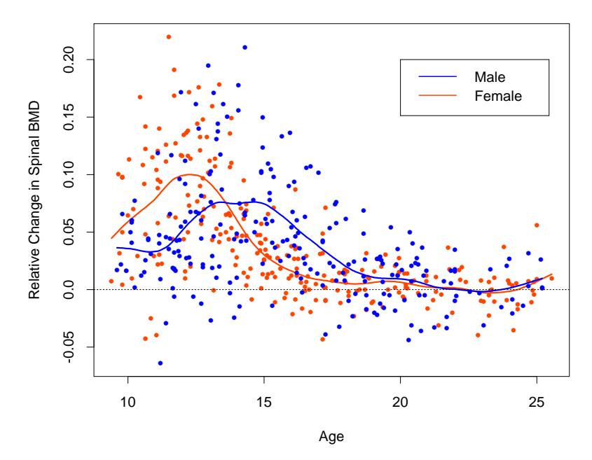

**FIGURE 5.6.** The response is the relative change in bone mineral density measured at the spine in adolescents, as a function of age. A separate smoothing spline was fit to the males and females, with  $\lambda \approx 0.00022$ . This choice corresponds to about 12 degrees of freedom.

where the  $N_j(x)$  are an N-dimensional set of basis functions for representing this family of natural splines (Section 5.2.1 and Exercise 5.4). The criterion thus reduces to

$$RSS(\theta, \lambda) = (\mathbf{y} - \mathbf{N}\theta)^{T} (\mathbf{y} - \mathbf{N}\theta) + \lambda \theta^{T} \mathbf{\Omega}_{N} \theta, \tag{5.11}$$

where  $\{\mathbf{N}\}_{ij}=N_j(x_i)$  and  $\{\Omega_N\}_{jk}=\int N_j''(t)N_k''(t)dt$ . The solution is easily seen to be

$$\hat{\theta} = (\mathbf{N}^T \mathbf{N} + \lambda \mathbf{\Omega}_N)^{-1} \mathbf{N}^T \mathbf{y}, \tag{5.12}$$

a generalized ridge regression. The fitted smoothing spline is given by

$$\hat{f}(x) = \sum_{j=1}^{N} N_j(x)\hat{\theta}_j.$$
 (5.13)

Efficient computational techniques for smoothing splines are discussed in the Appendix to this chapter.

Figure 5.6 shows a smoothing spline fit to some data on bone mineral density (BMD) in adolescents. The response is relative change in spinal BMD over two consecutive visits, typically about one year apart. The data are color coded by gender, and two separate curves were fit. This simple

summary reinforces the evidence in the data that the growth spurt for females precedes that for males by about two years. In both cases the smoothing parameter  $\lambda$  was approximately 0.00022; this choice is discussed in the next section.

#### 5.4.1 Degrees of Freedom and Smoother Matrices

We have not yet indicated how  $\lambda$  is chosen for the smoothing spline. Later in this chapter we describe automatic methods using techniques such as cross-validation. In this section we discuss intuitive ways of prespecifying the amount of smoothing.

A smoothing spline with prechosen  $\lambda$  is an example of a linear smoother (as in linear operator). This is because the estimated parameters in (5.12) are a linear combination of the  $y_i$ . Denote by  $\hat{\mathbf{f}}$  the N-vector of fitted values  $\hat{f}(x_i)$  at the training predictors  $x_i$ . Then

$$\hat{\mathbf{f}} = \mathbf{N}(\mathbf{N}^T \mathbf{N} + \lambda \mathbf{\Omega}_N)^{-1} \mathbf{N}^T \mathbf{y} 
= \mathbf{S}_{\lambda} \mathbf{y}.$$
(5.14)

Again the fit is linear in  $\mathbf{y}$ , and the finite linear operator  $\mathbf{S}_{\lambda}$  is known as the *smoother matrix*. One consequence of this linearity is that the recipe for producing  $\hat{\mathbf{f}}$  from  $\mathbf{y}$  does not depend on  $\mathbf{y}$  itself;  $\mathbf{S}_{\lambda}$  depends only on the  $x_i$  and  $\lambda$ .

Linear operators are familiar in more traditional least squares fitting as well. Suppose  $\mathbf{B}_{\xi}$  is a  $N \times M$  matrix of M cubic-spline basis functions evaluated at the N training points  $x_i$ , with knot sequence  $\xi$ , and  $M \ll N$ . Then the vector of fitted spline values is given by

$$\hat{\mathbf{f}} = \mathbf{B}_{\xi} (\mathbf{B}_{\xi}^T \mathbf{B}_{\xi})^{-1} \mathbf{B}_{\xi}^T \mathbf{y} 
= \mathbf{H}_{\xi} \mathbf{y}.$$
(5.15)

Here the linear operator  $\mathbf{H}_{\xi}$  is a projection operator, also known as the *hat* matrix in statistics. There are some important similarities and differences between  $\mathbf{H}_{\xi}$  and  $\mathbf{S}_{\lambda}$ :

- Both are symmetric, positive semidefinite matrices.
- $\mathbf{H}_{\xi}\mathbf{H}_{\xi} = \mathbf{H}_{\xi}$  (idempotent), while  $\mathbf{S}_{\lambda}\mathbf{S}_{\lambda} \leq \mathbf{S}_{\lambda}$ , meaning that the right-hand side exceeds the left-hand side by a positive semidefinite matrix. This is a consequence of the *shrinking* nature of  $\mathbf{S}_{\lambda}$ , which we discuss further below.
- $\mathbf{H}_{\xi}$  has rank M, while  $\mathbf{S}_{\lambda}$  has rank N.

The expression  $M = \operatorname{trace}(\mathbf{H}_{\xi})$  gives the dimension of the projection space, which is also the number of basis functions, and hence the number of parameters involved in the fit. By analogy we define the *effective degrees of* 

freedom of a smoothing spline to be

$$df_{\lambda} = \operatorname{trace}(\mathbf{S}_{\lambda}), \tag{5.16}$$

the sum of the diagonal elements of  $\mathbf{S}_{\lambda}$ . This very useful definition allows us a more intuitive way to parameterize the smoothing spline, and indeed many other smoothers as well, in a consistent fashion. For example, in Figure 5.6 we specified  $\mathrm{df}_{\lambda}=12$  for each of the curves, and the corresponding  $\lambda\approx0.00022$  was derived numerically by solving  $\mathrm{trace}(\mathbf{S}_{\lambda})=12$ . There are many arguments supporting this definition of degrees of freedom, and we cover some of them here.

Since  $\mathbf{S}_{\lambda}$  is symmetric (and positive semidefinite), it has a real eigendecomposition. Before we proceed, it is convenient to rewrite  $\mathbf{S}_{\lambda}$  in the Reinsch form

$$\mathbf{S}_{\lambda} = (\mathbf{I} + \lambda \mathbf{K})^{-1},\tag{5.17}$$

where **K** does not depend on  $\lambda$  (Exercise 5.9). Since  $\hat{\mathbf{f}} = \mathbf{S}_{\lambda} \mathbf{y}$  solves

$$\min_{\mathbf{f}} (\mathbf{y} - \mathbf{f})^T (\mathbf{y} - \mathbf{f}) + \lambda \mathbf{f}^T \mathbf{K} \mathbf{f}, \tag{5.18}$$

**K** is known as the *penalty matrix*, and indeed a quadratic form in **K** has a representation in terms of a weighted sum of squared (divided) second differences. The eigen-decomposition of  $S_{\lambda}$  is

$$\mathbf{S}_{\lambda} = \sum_{k=1}^{N} \rho_k(\lambda) \mathbf{u}_k \mathbf{u}_k^T \tag{5.19}$$

with

$$\rho_k(\lambda) = \frac{1}{1 + \lambda d_k},\tag{5.20}$$

and  $d_k$  the corresponding eigenvalue of **K**. Figure 5.7 (top) shows the results of applying a cubic smoothing spline to some air pollution data (128 observations). Two fits are given: a *smoother* fit corresponding to a larger penalty  $\lambda$  and a *rougher* fit for a smaller penalty. The lower panels represent the eigenvalues (lower left) and some eigenvectors (lower right) of the corresponding smoother matrices. Some of the highlights of the eigenrepresentation are the following:

- The eigenvectors are not affected by changes in  $\lambda$ , and hence the whole family of smoothing splines (for a particular sequence  $\mathbf{x}$ ) indexed by  $\lambda$  have the same eigenvectors.
- $\mathbf{S}_{\lambda}\mathbf{y} = \sum_{k=1}^{N} \mathbf{u}_{k} \rho_{k}(\lambda) \langle \mathbf{u}_{k}, \mathbf{y} \rangle$ , and hence the smoothing spline operates by decomposing  $\mathbf{y}$  w.r.t. the (complete) basis  $\{\mathbf{u}_{k}\}$ , and differentially shrinking the contributions using  $\rho_{k}(\lambda)$ . This is to be contrasted with a basis-regression method, where the components are

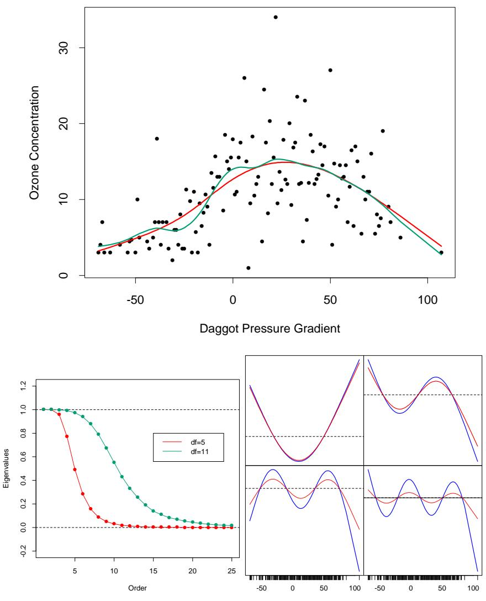

**FIGURE 5.7.** (Top:) Smoothing spline fit of ozone concentration versus Daggot pressure gradient. The two fits correspond to different values of the smoothing parameter, chosen to achieve five and eleven effective degrees of freedom, defined by  $df_{\lambda} = trace(\mathbf{S}_{\lambda})$ . (Lower left:) First 25 eigenvalues for the two smoothing-spline matrices. The first two are exactly 1, and all are  $\geq 0$ . (Lower right:) Third to sixth eigenvectors of the spline smoother matrices. In each case,  $\mathbf{u}_k$  is plotted against  $\mathbf{x}$ , and as such is viewed as a function of x. The rug at the base of the plots indicate the occurrence of data points. The damped functions represent the smoothed versions of these functions (using the 5 df smoother).

either left alone, or shrunk to zero—that is, a projection matrix such as  $\mathbf{H}_{\xi}$  above has M eigenvalues equal to 1, and the rest are 0. For this reason smoothing splines are referred to as *shrinking* smoothers, while regression splines are *projection* smoothers (see Figure 3.17 on page 80).

- The sequence of  $\mathbf{u}_k$ , ordered by decreasing  $\rho_k(\lambda)$ , appear to increase in complexity. Indeed, they have the zero-crossing behavior of polynomials of increasing degree. Since  $\mathbf{S}_{\lambda}\mathbf{u}_k = \rho_k(\lambda)\mathbf{u}_k$ , we see how each of the eigenvectors themselves are shrunk by the smoothing spline: the higher the complexity, the more they are shrunk. If the domain of X is periodic, then the  $\mathbf{u}_k$  are sines and cosines at different frequencies.
- The first two eigenvalues are *always* one, and they correspond to the two-dimensional eigenspace of functions linear in x (Exercise 5.11), which are never shrunk.
- The eigenvalues  $\rho_k(\lambda) = 1/(1 + \lambda d_k)$  are an inverse function of the eigenvalues  $d_k$  of the penalty matrix **K**, moderated by  $\lambda$ ;  $\lambda$  controls the rate at which the  $\rho_k(\lambda)$  decrease to zero.  $d_1 = d_2 = 0$  and again linear functions are not penalized.
- One can reparametrize the smoothing spline using the basis vectors  $\mathbf{u}_k$  (the *Demmler–Reinsch* basis). In this case the smoothing spline solves

$$\min_{\boldsymbol{\theta}} \|\mathbf{y} - \mathbf{U}\boldsymbol{\theta}\|^2 + \lambda \boldsymbol{\theta}^T \mathbf{D}\boldsymbol{\theta}, \tag{5.21}$$

where **U** has columns  $\mathbf{u}_k$  and **D** is a diagonal matrix with elements  $d_k$ .

•  $df_{\lambda} = trace(\mathbf{S}_{\lambda}) = \sum_{k=1}^{N} \rho_k(\lambda)$ . For projection smoothers, all the eigenvalues are 1, each one corresponding to a dimension of the projection subspace.

Figure 5.8 depicts a smoothing spline matrix, with the rows ordered with x. The banded nature of this representation suggests that a smoothing spline is a local fitting method, much like the locally weighted regression procedures in Chapter 6. The right panel shows in detail selected rows of  $\mathbf{S}$ , which we call the *equivalent kernels*. As  $\lambda \to 0$ ,  $\mathrm{df}_{\lambda} \to N$ , and  $\mathbf{S}_{\lambda} \to \mathbf{I}$ , the N-dimensional identity matrix. As  $\lambda \to \infty$ ,  $\mathrm{df}_{\lambda} \to 2$ , and  $\mathbf{S}_{\lambda} \to \mathbf{H}$ , the hat matrix for linear regression on  $\mathbf{x}$ .

# 5.5 Automatic Selection of the Smoothing Parameters

The smoothing parameters for regression splines encompass the degree of the splines, and the number and placement of the knots. For smoothing

#### Equivalent Kernels

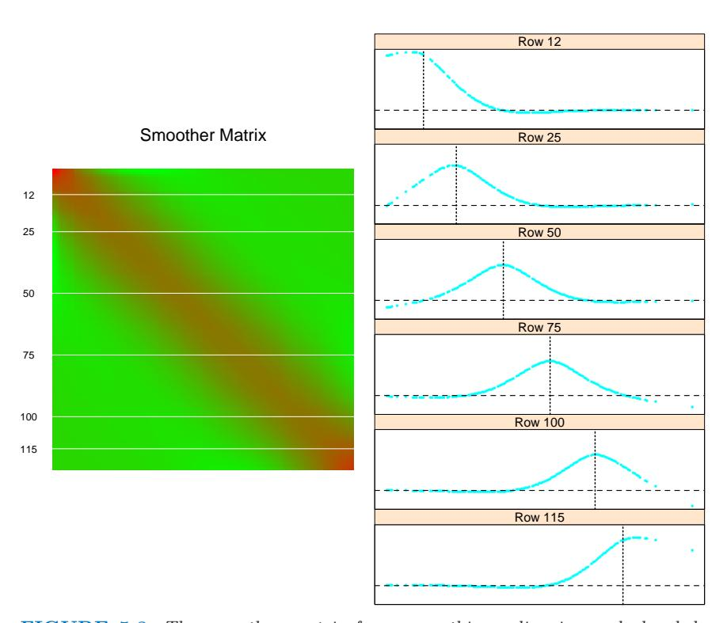

FIGURE 5.8. The smoother matrix for a smoothing spline is nearly banded, indicating an equivalent kernel with local support. The left panel represents the elements of S as an image. The right panel shows the equivalent kernel or weighting function in detail for the indicated rows.

splines, we have only the penalty parameter  $\lambda$  to select, since the knots are at all the unique training X's, and cubic degree is almost always used in practice.

Selecting the placement and number of knots for regression splines can be a combinatorially complex task, unless some simplifications are enforced. The MARS procedure in Chapter 9 uses a greedy algorithm with some additional approximations to achieve a practical compromise. We will not discuss this further here.

#### 5.5.1 Fixing the Degrees of Freedom

Since  $\mathrm{df}_{\lambda} = \mathrm{trace}(\mathbf{S}_{\lambda})$  is monotone in  $\lambda$  for smoothing splines, we can invert the relationship and specify  $\lambda$  by fixing df. In practice this can be achieved by simple numerical methods. So, for example, in R one can use smooth.spline(x,y,df=6) to specify the amount of smoothing. This encourages a more traditional mode of model selection, where we might try a couple of different values of df, and select one based on approximate F-tests, residual plots and other more subjective criteria. Using df in this way provides a uniform approach to compare many different smoothing methods. It is particularly useful in generalized additive models (Chapter 9), where several smoothing methods can be simultaneously used in one model.

#### 5.5.2 The Bias-Variance Tradeoff

Figure 5.9 shows the effect of the choice of  $df_{\lambda}$  when using a smoothing spline on a simple example:

$$Y = f(X) + \varepsilon,$$
  

$$f(X) = \frac{\sin(12(X+0.2))}{X+0.2},$$
(5.22)

with  $X \sim U[0,1]$  and  $\varepsilon \sim N(0,1)$ . Our training sample consists of N=100 pairs  $x_i, y_i$  drawn independently from this model.

The fitted splines for three different values of  $df_{\lambda}$  are shown. The yellow shaded region in the figure represents the pointwise standard error of  $\hat{f}_{\lambda}$ , that is, we have shaded the region between  $\hat{f}_{\lambda}(x) \pm 2 \cdot \text{se}(\hat{f}_{\lambda}(x))$ . Since  $\hat{\mathbf{f}} = \mathbf{S}_{\lambda} \mathbf{y}$ ,

$$Cov(\hat{\mathbf{f}}) = \mathbf{S}_{\lambda}Cov(\mathbf{y})\mathbf{S}_{\lambda}^{T}$$
$$= \mathbf{S}_{\lambda}\mathbf{S}_{\lambda}^{T}. \tag{5.23}$$

The diagonal contains the pointwise variances at the training  $x_i$ . The bias is given by

$$Bias(\hat{\mathbf{f}}) = \mathbf{f} - E(\hat{\mathbf{f}})$$

$$= \mathbf{f} - \mathbf{S}_{\lambda} \mathbf{f}, \qquad (5.24)$$

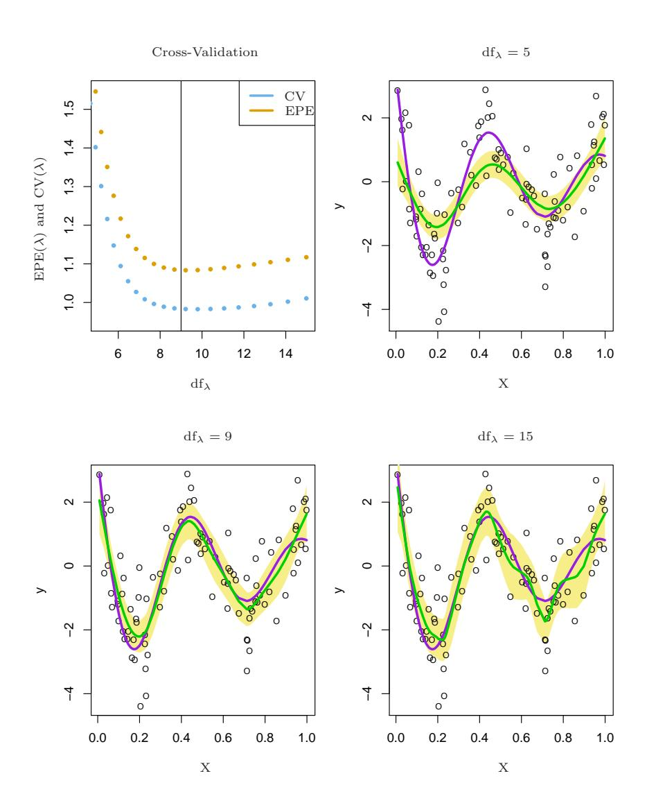

**FIGURE 5.9.** The top left panel shows the  $\text{EPE}(\lambda)$  and  $\text{CV}(\lambda)$  curves for a realization from a nonlinear additive error model (5.22). The remaining panels show the data, the true functions (in purple), and the fitted curves (in green) with yellow shaded  $\pm 2 \times$  standard error bands, for three different values of  $df_{\lambda}$ .

where **f** is the (unknown) vector of evaluations of the true f at the training X's. The expectations and variances are with respect to repeated draws of samples of size N=100 from the model (5.22). In a similar fashion  $\operatorname{Var}(\hat{f}_{\lambda}(x_0))$  and  $\operatorname{Bias}(\hat{f}_{\lambda}(x_0))$  can be computed at any point  $x_0$  (Exercise 5.10). The three fits displayed in the figure give a visual demonstration of the bias-variance tradeoff associated with selecting the smoothing parameter.

- $df_{\lambda} = 5$ : The spline under fits, and clearly trims down the hills and fills in the valleys. This leads to a bias that is most dramatic in regions of high curvature. The standard error band is very narrow, so we estimate a badly biased version of the true function with great reliability!
- $df_{\lambda} = 9$ : Here the fitted function is close to the true function, although a slight amount of bias seems evident. The variance has not increased appreciably.
- $df_{\lambda} = 15$ : The fitted function is somewhat wiggly, but close to the true function. The wiggliness also accounts for the increased width of the standard error bands—the curve is starting to follow some individual points too closely.

Note that in these figures we are seeing a single realization of data and hence fitted spline  $\hat{f}$  in each case, while the bias involves an expectation  $E(\hat{f})$ . We leave it as an exercise (5.10) to compute similar figures where the bias is shown as well. The middle curve seems "just right," in that it has achieved a good compromise between bias and variance.

The integrated squared prediction error (EPE) combines both bias and variance in a single summary:

$$\begin{aligned} \operatorname{EPE}(\hat{f}_{\lambda}) &= \operatorname{E}(Y - \hat{f}_{\lambda}(X))^{2} \\ &= \operatorname{Var}(Y) + \operatorname{E}\left[\operatorname{Bias}^{2}(\hat{f}_{\lambda}(X)) + \operatorname{Var}(\hat{f}_{\lambda}(X))\right] \\ &= \sigma^{2} + \operatorname{MSE}(\hat{f}_{\lambda}). \end{aligned} (5.25)$$

Note that this is averaged both over the training sample (giving rise to  $\hat{f}_{\lambda}$ ), and the values of the (independently chosen) prediction points (X,Y). EPE is a natural quantity of interest, and does create a tradeoff between bias and variance. The blue points in the top left panel of Figure 5.9 suggest that  $df_{\lambda} = 9$  is spot on!

Since we don't know the true function, we do not have access to EPE, and need an estimate. This topic is discussed in some detail in Chapter 7, and techniques such as K-fold cross-validation, GCV and  $C_p$  are all in common use. In Figure 5.9 we include the N-fold (leave-one-out) cross-validation curve:

$$CV(\hat{f}_{\lambda}) = \frac{1}{N} \sum_{i=1}^{N} (y_i - \hat{f}_{\lambda}^{(-i)}(x_i))^2$$
 (5.26)

$$= \frac{1}{N} \sum_{i=1}^{N} \left( \frac{y_i - \hat{f}_{\lambda}(x_i)}{1 - S_{\lambda}(i, i)} \right)^2, \tag{5.27}$$

which can (remarkably) be computed for each value of  $\lambda$  from the original fitted values and the diagonal elements  $S_{\lambda}(i,i)$  of  $\mathbf{S}_{\lambda}$  (Exercise 5.13).

The EPE and CV curves have a similar shape, but the entire CV curve is above the EPE curve. For some realizations this is reversed, and overall the CV curve is approximately unbiased as an estimate of the EPE curve.

# 5.6 Nonparametric Logistic Regression

The smoothing spline problem (5.9) in Section 5.4 is posed in a regression setting. It is typically straightforward to transfer this technology to other domains. Here we consider logistic regression with a single quantitative input X. The model is

$$\log \frac{\Pr(Y=1|X=x)}{\Pr(Y=0|X=x)} = f(x), \tag{5.28}$$

which implies

$$\Pr(Y = 1|X = x) = \frac{e^{f(x)}}{1 + e^{f(x)}}.$$
(5.29)

Fitting f(x) in a smooth fashion leads to a smooth estimate of the conditional probability Pr(Y = 1|x), which can be used for classification or risk scoring.

We construct the penalized log-likelihood criterion

$$\ell(f;\lambda) = \sum_{i=1}^{N} \left[ y_i \log p(x_i) + (1 - y_i) \log(1 - p(x_i)) \right] - \frac{1}{2} \lambda \int \{f''(t)\}^2 dt$$

$$= \sum_{i=1}^{N} \left[ y_i f(x_i) - \log(1 + e^{f(x_i)}) \right] - \frac{1}{2} \lambda \int \{f''(t)\}^2 dt, \qquad (5.30)$$

where we have abbreviated  $p(x) = \Pr(Y = 1|x)$ . The first term in this expression is the log-likelihood based on the binomial distribution (c.f. Chapter 4, page 120). Arguments similar to those used in Section 5.4 show that the optimal f is a finite-dimensional natural spline with knots at the unique

values of x. This means that we can represent  $f(x) = \sum_{i=1}^{N} N_i(x)\theta_i$ . We compute the first and second derivatives

$$\frac{\partial \ell(\theta)}{\partial \theta} = \mathbf{N}^T (\mathbf{y} - \mathbf{p}) - \lambda \mathbf{\Omega} \theta, \tag{5.31}$$

$$\frac{\partial \ell(\theta)}{\partial \theta} = \mathbf{N}^{T}(\mathbf{y} - \mathbf{p}) - \lambda \mathbf{\Omega} \theta, \qquad (5.31)$$

$$\frac{\partial^{2} \ell(\theta)}{\partial \theta \partial \theta^{T}} = -\mathbf{N}^{T} \mathbf{W} \mathbf{N} - \lambda \mathbf{\Omega}, \qquad (5.32)$$

where **p** is the N-vector with elements  $p(x_i)$ , and **W** is a diagonal matrix of weights  $p(x_i)(1-p(x_i))$ . The first derivative (5.31) is nonlinear in  $\theta$ , so we need to use an iterative algorithm as in Section 4.4.1. Using Newton-Raphson as in (4.23) and (4.26) for linear logistic regression, the update equation can be written

$$\theta^{\text{new}} = (\mathbf{N}^T \mathbf{W} \mathbf{N} + \lambda \mathbf{\Omega})^{-1} \mathbf{N}^T \mathbf{W} (\mathbf{N} \theta^{\text{old}} + \mathbf{W}^{-1} (\mathbf{y} - \mathbf{p}))$$
$$= (\mathbf{N}^T \mathbf{W} \mathbf{N} + \lambda \mathbf{\Omega})^{-1} \mathbf{N}^T \mathbf{W} \mathbf{z}.$$
(5.33)

We can also express this update in terms of the fitted values

$$\mathbf{f}^{\text{new}} = \mathbf{N}(\mathbf{N}^T \mathbf{W} \mathbf{N} + \lambda \mathbf{\Omega})^{-1} \mathbf{N}^T \mathbf{W} \left( \mathbf{f}^{\text{old}} + \mathbf{W}^{-1} (\mathbf{y} - \mathbf{p}) \right)$$
$$= \mathbf{S}_{\lambda m} \mathbf{z}. \tag{5.34}$$

Referring back to (5.12) and (5.14), we see that the update fits a weighted smoothing spline to the working response  $\mathbf{z}$  (Exercise 5.12).

The form of (5.34) is suggestive. It is tempting to replace  $S_{\lambda,w}$  by any nonparametric (weighted) regression operator, and obtain general families of nonparametric logistic regression models. Although here x is onedimensional, this procedure generalizes naturally to higher-dimensional x. These extensions are at the heart of *generalized additive models*, which we pursue in Chapter 9.

# Multidimensional Splines

So far we have focused on one-dimensional spline models. Each of the approaches have multidimensional analogs. Suppose  $X \in \mathbb{R}^2$ , and we have a basis of functions  $h_{1k}(X_1), k = 1, \ldots, M_1$  for representing functions of coordinate  $X_1$ , and likewise a set of  $M_2$  functions  $h_{2k}(X_2)$  for coordinate  $X_2$ . Then the  $M_1 \times M_2$  dimensional tensor product basis defined by

$$g_{jk}(X) = h_{1j}(X_1)h_{2k}(X_2), \ j = 1, \dots, M_1, \ k = 1, \dots, M_2$$
 (5.35)

can be used for representing a two-dimensional function:

$$g(X) = \sum_{i=1}^{M_1} \sum_{k=1}^{M_2} \theta_{jk} g_{jk}(X).$$
 (5.36)

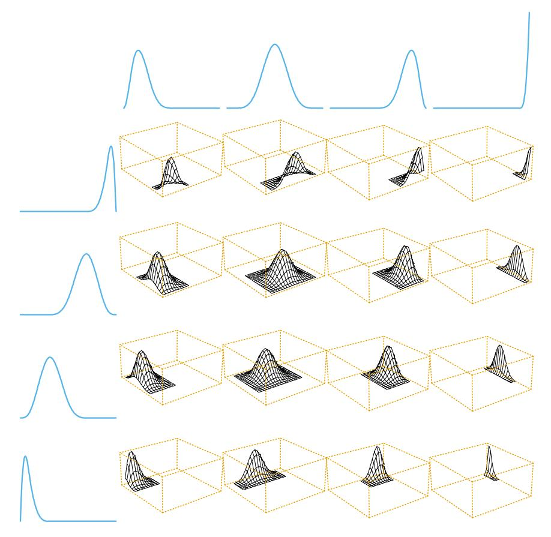

FIGURE 5.10. A tensor product basis of B-splines, showing some selected pairs. Each two-dimensional function is the tensor product of the corresponding one dimensional marginals.

Figure 5.10 illustrates a tensor product basis using B-splines. The coefficients can be fit by least squares, as before. This can be generalized to d dimensions, but note that the dimension of the basis grows exponentially fast—yet another manifestation of the curse of dimensionality. The MARS procedure discussed in Chapter 9 is a greedy forward algorithm for including only those tensor products that are deemed necessary by least squares.

Figure 5.11 illustrates the difference between additive and tensor product (natural) splines on the simulated classification example from Chapter 2. A logistic regression model logit[Pr(T|x)] = h(x) T θ is fit to the binary response, and the estimated decision boundary is the contour h(x) T ˆθ = 0. The tensor product basis can achieve more flexibility at the decision boundary, but introduces some spurious structure along the way.

#### Additive Natural Cubic Splines - 4 df each

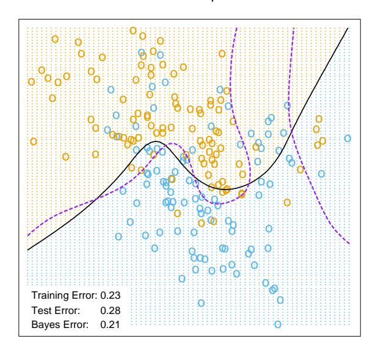

#### Natural Cubic Splines - Tensor Product - 4 df each

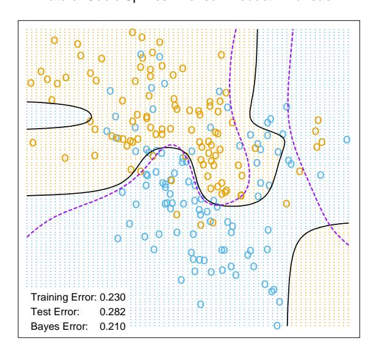

**FIGURE 5.11.** The simulation example of Figure 2.1. The upper panel shows the decision boundary of an additive logistic regression model, using natural splines in each of the two coordinates (total df = 1 + (4 - 1) + (4 - 1) = 7). The lower panel shows the results of using a tensor product of natural spline bases in each coordinate (total  $df = 4 \times 4 = 16$ ). The broken purple boundary is the Bayes decision boundary for this problem.

One-dimensional smoothing splines (via regularization) generalize to higher dimensions as well. Suppose we have pairs  $y_i, x_i$  with  $x_i \in \mathbb{R}^d$ , and we seek a d-dimensional regression function f(x). The idea is to set up the problem

$$\min_{f} \sum_{i=1}^{N} \{y_i - f(x_i)\}^2 + \lambda J[f], \tag{5.37}$$

where J is an appropriate penalty functional for stabilizing a function f in  $\mathbb{R}^d$ . For example, a natural generalization of the one-dimensional roughness penalty (5.9) for functions on  $\mathbb{R}^2$  is

$$J[f] = \int \int_{\mathbb{R}^2} \left[ \left( \frac{\partial^2 f(x)}{\partial x_1^2} \right)^2 + 2 \left( \frac{\partial^2 f(x)}{\partial x_1 \partial x_2} \right)^2 + \left( \frac{\partial^2 f(x)}{\partial x_2^2} \right)^2 \right] dx_1 dx_2. \quad (5.38)$$

Optimizing (5.37) with this penalty leads to a smooth two-dimensional surface, known as a thin-plate spline. It shares many properties with the one-dimensional cubic smoothing spline:

- as  $\lambda \to 0$ , the solution approaches an interpolating function [the one with smallest penalty (5.38)];
- as  $\lambda \to \infty$ , the solution approaches the least squares plane;
- for intermediate values of  $\lambda$ , the solution can be represented as a linear expansion of basis functions, whose coefficients are obtained by a form of generalized ridge regression.

The solution has the form

$$f(x) = \beta_0 + \beta^T x + \sum_{j=1}^{N} \alpha_j h_j(x),$$
 (5.39)

where  $h_j(x) = ||x - x_j||^2 \log ||x - x_j||$ . These  $h_j$  are examples of radial basis functions, which are discussed in more detail in the next section. The coefficients are found by plugging (5.39) into (5.37), which reduces to a finite-dimensional penalized least squares problem. For the penalty to be finite, the coefficients  $\alpha_j$  have to satisfy a set of linear constraints; see Exercise 5.14.

Thin-plate splines are defined more generally for arbitrary dimension d, for which an appropriately more general J is used.

There are a number of hybrid approaches that are popular in practice, both for computational and conceptual simplicity. Unlike one-dimensional smoothing splines, the computational complexity for thin-plate splines is  $O(N^3)$ , since there is not in general any sparse structure that can be exploited. However, as with univariate smoothing splines, we can get away with substantially less than the N knots prescribed by the solution (5.39).

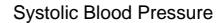

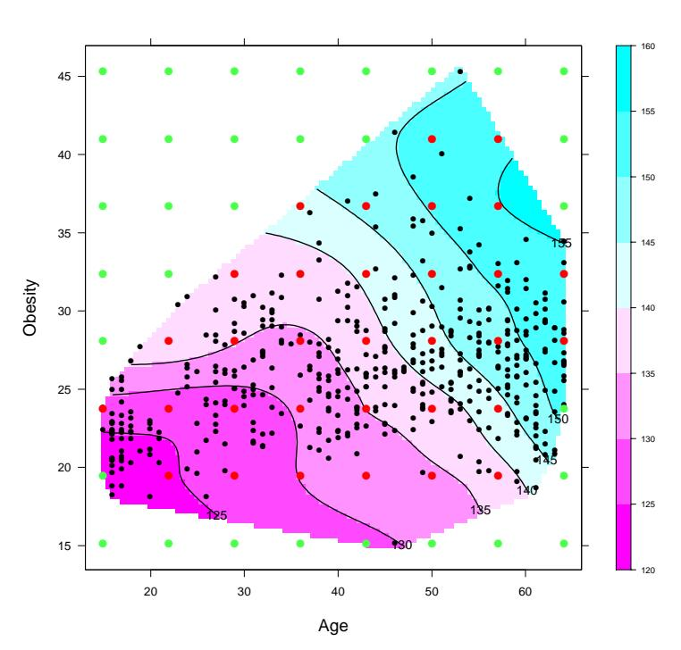

FIGURE 5.12. A thin-plate spline fit to the heart disease data, displayed as a contour plot. The response is systolic blood pressure, modeled as a function of age and obesity. The data points are indicated, as well as the lattice of points used as knots. Care should be taken to use knots from the lattice inside the convex hull of the data (red), and ignore those outside (green).

In practice, it is usually sufficient to work with a lattice of knots covering the domain. The penalty is computed for the reduced expansion just as before. Using K knots reduces the computations to  $O(NK^2 + K^3)$ . Figure 5.12 shows the result of fitting a thin-plate spline to some heart disease risk factors, representing the surface as a contour plot. Indicated are the location of the input features, as well as the knots used in the fit. Note that  $\lambda$  was specified via  $\mathrm{df}_{\lambda} = \mathrm{trace}(S_{\lambda}) = 15$ .

More generally one can represent  $f \in \mathbb{R}^d$  as an expansion in any arbitrarily large collection of basis functions, and control the complexity by applying a regularizer such as (5.38). For example, we could construct a basis by forming the tensor products of all pairs of univariate smoothing-spline basis functions as in (5.35), using, for example, the univariate B-splines recommended in Section 5.9.2 as ingredients. This leads to an exponential

growth in basis functions as the dimension increases, and typically we have to reduce the number of functions per coordinate accordingly.

The additive spline models discussed in Chapter 9 are a restricted class of multidimensional splines. They can be represented in this general formulation as well; that is, there exists a penalty J[f] that guarantees that the solution has the form f(X) = α + f1(X1) + · · · + fd(Xd) and that each of the functions fj are univariate splines. In this case the penalty is somewhat degenerate, and it is more natural to assume that f is additive, and then simply impose an additional penalty on each of the component functions:

$$J[f] = J(f_1 + f_2 + \dots + f_d)$$

$$= \sum_{j=1}^{d} \int f_j''(t_j)^2 dt_j.$$
 (5.40)

These are naturally extended to ANOVA spline decompositions,

$$f(X) = \alpha + \sum_{j} f_{j}(X_{j}) + \sum_{j < k} f_{jk}(X_{j}, X_{k}) + \cdots, \qquad (5.41)$$

where each of the components are splines of the required dimension. There are many choices to be made:

- The maximum order of interaction—we have shown up to order 2 above.
- Which terms to include—not all main effects and interactions are necessarily needed.
- What representation to use—some choices are:
  - regression splines with a relatively small number of basis functions per coordinate, and their tensor products for interactions;
  - a complete basis as in smoothing splines, and include appropriate regularizers for each term in the expansion.

In many cases when the number of potential dimensions (features) is large, automatic methods are more desirable. The MARS and MART procedures (Chapters 9 and 10, respectively), both fall into this category.

# 5.8 Regularization and Reproducing Kernel Hilbert Spaces

In this section we cast splines into the larger context of regularization methods and reproducing kernel Hilbert spaces. This section is quite technical and can be skipped by the disinterested or intimidated reader.

A general class of regularization problems has the form

$$\min_{f \in \mathcal{H}} \left[ \sum_{i=1}^{N} L(y_i, f(x_i)) + \lambda J(f) \right]$$
 (5.42)

where L(y, f(x)) is a loss function, J(f) is a penalty functional, and  $\mathcal{H}$  is a space of functions on which J(f) is defined. Girosi et al. (1995) describe quite general penalty functionals of the form

$$J(f) = \int_{\mathbb{R}^d} \frac{|\tilde{f}(s)|^2}{\tilde{G}(s)} ds, \qquad (5.43)$$

where  $\tilde{f}$  denotes the Fourier transform of f, and  $\tilde{G}$  is some positive function that falls off to zero as  $||s|| \to \infty$ . The idea is that  $1/\tilde{G}$  increases the penalty for high-frequency components of f. Under some additional assumptions they show that the solutions have the form

$$f(X) = \sum_{k=1}^{K} \alpha_k \phi_k(X) + \sum_{i=1}^{N} \theta_i G(X - x_i),$$
 (5.44)

where the  $\phi_k$  span the null space of the penalty functional J, and G is the inverse Fourier transform of  $\tilde{G}$ . Smoothing splines and thin-plate splines fall into this framework. The remarkable feature of this solution is that while the criterion (5.42) is defined over an infinite-dimensional space, the solution is finite-dimensional. In the next sections we look at some specific examples.

#### 5.8.1 Spaces of Functions Generated by Kernels

An important subclass of problems of the form (5.42) are generated by a positive definite kernel K(x,y), and the corresponding space of functions  $\mathcal{H}_K$  is called a reproducing kernel Hilbert space (RKHS). The penalty functional J is defined in terms of the kernel as well. We give a brief and simplified introduction to this class of models, adapted from Wahba (1990) and Girosi et al. (1995), and nicely summarized in Evgeniou et al. (2000).

Let  $x, y \in \mathbb{R}^p$ . We consider the space of functions generated by the linear span of  $\{K(\cdot,y),\ y \in \mathbb{R}^p)\}$ ; i.e arbitrary linear combinations of the form  $f(x) = \sum_m \alpha_m K(x,y_m)$ , where each kernel term is viewed as a function of the first argument, and indexed by the second. Suppose that K has an eigen-expansion

$$K(x,y) = \sum_{i=1}^{\infty} \gamma_i \phi_i(x) \phi_i(y)$$
 (5.45)

with  $\gamma_i \geq 0$ ,  $\sum_{i=1}^{\infty} \gamma_i^2 < \infty$ . Elements of  $\mathcal{H}_K$  have an expansion in terms of these eigen-functions,

$$f(x) = \sum_{i=1}^{\infty} c_i \phi_i(x), \qquad (5.46)$$

with the constraint that

$$||f||_{\mathcal{H}_K}^2 \stackrel{\text{def}}{=} \sum_{i=1}^{\infty} c_i^2 / \gamma_i < \infty, \tag{5.47}$$

where  $||f||_{\mathcal{H}_K}$  is the norm induced by K. The penalty functional in (5.42) for the space  $\mathcal{H}_K$  is defined to be the squared norm  $J(f) = ||f||_{\mathcal{H}_K}^2$ . The quantity J(f) can be interpreted as a generalized ridge penalty, where functions with large eigenvalues in the expansion (5.45) get penalized less, and vice versa.

Rewriting (5.42) we have

$$\min_{f \in \mathcal{H}_K} \left[ \sum_{i=1}^N L(y_i, f(x_i)) + \lambda ||f||_{\mathcal{H}_K}^2 \right]$$
 (5.48)

or equivalently

$$\min_{\{c_j\}_1^{\infty}} \left[ \sum_{i=1}^{N} L(y_i, \sum_{j=1}^{\infty} c_j \phi_j(x_i)) + \lambda \sum_{j=1}^{\infty} c_j^2 / \gamma_j \right].$$
 (5.49)

It can be shown (Wahba, 1990, see also Exercise 5.15) that the solution to (5.48) is finite-dimensional, and has the form

$$f(x) = \sum_{i=1}^{N} \alpha_i K(x, x_i).$$
 (5.50)

The basis function  $h_i(x) = K(x, x_i)$  (as a function of the first argument) is known as the representer of evaluation at  $x_i$  in  $\mathcal{H}_K$ , since for  $f \in \mathcal{H}_K$ , it is easily seen that  $\langle K(\cdot, x_i), f \rangle_{\mathcal{H}_K} = f(x_i)$ . Similarly  $\langle K(\cdot, x_i), K(\cdot, x_j) \rangle_{\mathcal{H}_K} =$  $K(x_i, x_i)$  (the reproducing property of  $\mathcal{H}_K$ ), and hence

$$J(f) = \sum_{i=1}^{N} \sum_{j=1}^{N} K(x_i, x_j) \alpha_i \alpha_j$$
 (5.51)

for  $f(x) = \sum_{i=1}^{N} \alpha_i K(x, x_i)$ .

In light of (5.50) and (5.51), (5.48) reduces to a finite-dimensional criterion

$$\min_{\alpha} L(\mathbf{y}, \mathbf{K}\alpha) + \lambda \alpha^T \mathbf{K}\alpha. \tag{5.52}$$

We are using a vector notation, in which **K** is the  $N \times N$  matrix with ijth entry  $K(x_i, x_j)$  and so on. Simple numerical algorithms can be used to optimize (5.52). This phenomenon, whereby the infinite-dimensional problem (5.48) or (5.49) reduces to a finite dimensional optimization problem, has been dubbed the *kernel property* in the literature on support-vector machines (see Chapter 12).

There is a Bayesian interpretation of this class of models, in which f is interpreted as a realization of a zero-mean stationary Gaussian process, with prior covariance function K. The eigen-decomposition produces a series of orthogonal eigen-functions  $\phi_j(x)$  with associated variances  $\gamma_j$ . The typical scenario is that "smooth" functions  $\phi_j$  have large prior variance, while "rough"  $\phi_j$  have small prior variances. The penalty in (5.48) is the contribution of the prior to the joint likelihood, and penalizes more those components with smaller prior variance (compare with (5.43)).

For simplicity we have dealt with the case here where all members of  $\mathcal{H}$  are penalized, as in (5.48). More generally, there may be some components in  $\mathcal{H}$  that we wish to leave alone, such as the linear functions for cubic smoothing splines in Section 5.4. The multidimensional thin-plate splines of Section 5.7 and tensor product splines fall into this category as well. In these cases there is a more convenient representation  $\mathcal{H} = \mathcal{H}_0 \oplus \mathcal{H}_1$ , with the null space  $\mathcal{H}_0$  consisting of, for example, low degree polynomials in x that do not get penalized. The penalty becomes  $J(f) = ||P_1 f||$ , where  $P_1$  is the orthogonal projection of f onto  $\mathcal{H}_1$ . The solution has the form  $f(x) = \sum_{j=1}^M \beta_j h_j(x) + \sum_{i=1}^N \alpha_i K(x, x_i)$ , where the first term represents an expansion in  $\mathcal{H}_0$ . From a Bayesian perspective, the coefficients of components in  $\mathcal{H}_0$  have improper priors, with infinite variance.

#### 5.8.2 Examples of RKHS

The machinery above is driven by the choice of the kernel K and the loss function L. We consider first regression using squared-error loss. In this case (5.48) specializes to penalized least squares, and the solution can be characterized in two equivalent ways corresponding to (5.49) or (5.52):

$$\min_{\{c_j\}_1^{\infty}} \sum_{i=1}^{N} \left( y_i - \sum_{j=1}^{\infty} c_j \phi_j(x_i) \right)^2 + \lambda \sum_{j=1}^{\infty} \frac{c_j^2}{\gamma_j}$$
 (5.53)

an infinite-dimensional, generalized ridge regression problem, or

$$\min_{\alpha} (\mathbf{y} - \mathbf{K}\alpha)^T (\mathbf{y} - \mathbf{K}\alpha) + \lambda \alpha^T \mathbf{K}\alpha.$$
 (5.54)

The solution for  $\alpha$  is obtained simply as

$$\hat{\boldsymbol{\alpha}} = (\mathbf{K} + \lambda \mathbf{I})^{-1} \mathbf{y},\tag{5.55}$$

and

$$\hat{f}(x) = \sum_{j=1}^{N} \hat{\alpha}_j K(x, x_j). \tag{5.56}$$

The vector of N fitted values is given by

$$\hat{\mathbf{f}} = \mathbf{K}\hat{\boldsymbol{\alpha}} 
= \mathbf{K}(\mathbf{K} + \lambda \mathbf{I})^{-1}\mathbf{y}$$

$$= (\mathbf{I} + \lambda \mathbf{K}^{-1})^{-1}\mathbf{y}.$$
(5.57)
(5.58)

The estimate (5.57) also arises as the *kriging* estimate of a Gaussian random field in spatial statistics (Cressie, 1993). Compare also (5.58) with the smoothing spline fit (5.17) on page 154.

#### Penalized Polynomial Regression

The kernel  $K(x,y)=(\langle x,y\rangle+1)^d$  (Vapnik, 1996), for  $x,y\in\mathbb{R}^p$ , has  $M=\binom{p+d}{d}$  eigen-functions that span the space of polynomials in  $\mathbb{R}^p$  of total degree d. For example, with p=2 and d=2, M=6 and

$$K(x,y) = 1 + 2x_1y_1 + 2x_2y_2 + x_1^2y_1^2 + x_2^2y_2^2 + 2x_1x_2y_1y_2$$
 (5.59)  
= 
$$\sum_{m=1}^{M} h_m(x)h_m(y)$$
 (5.60)

with

$$h(x)^{T} = (1, \sqrt{2}x_1, \sqrt{2}x_2, x_1^2, x_2^2, \sqrt{2}x_1x_2).$$
 (5.61)

One can represent h in terms of the M orthogonal eigen-functions and eigenvalues of K,

$$h(x) = \mathbf{V}\mathbf{D}_{\gamma}^{\frac{1}{2}}\phi(x),\tag{5.62}$$

where  $\mathbf{D}_{\gamma} = \operatorname{diag}(\gamma_1, \gamma_2, \dots, \gamma_M)$ , and  $\mathbf{V}$  is  $M \times M$  and orthogonal.

Suppose we wish to solve the penalized polynomial regression problem

$$\min_{\{\beta_m\}_1^M} \sum_{i=1}^N \left( y_i - \sum_{m=1}^M \beta_m h_m(x_i) \right)^2 + \lambda \sum_{m=1}^M \beta_m^2.$$
 (5.63)

Substituting (5.62) into (5.63), we get an expression of the form (5.53) to optimize (Exercise 5.16).

The number of basis functions  $M = \binom{p+d}{d}$  can be very large, often much larger than N. Equation (5.55) tells us that if we use the kernel representation for the solution function, we have only to evaluate the kernel  $N^2$  times, and can compute the solution in  $O(N^3)$  operations.

This simplicity is not without implications. Each of the polynomials  $h_m$  in (5.61) inherits a scaling factor from the particular form of K, which has a bearing on the impact of the penalty in (5.63). We elaborate on this in the next section.

# -2 -1 0 1 2 3 4

Radial Kernel in  $\mathbb{R}^1$ 

**FIGURE 5.13.** Radial kernels  $k_k(x)$  for the mixture data, with scale parameter  $\nu = 1$ . The kernels are centered at five points  $x_m$  chosen at random from the 200.

#### Gaussian Radial Basis Functions

In the preceding example, the kernel is chosen because it represents an expansion of polynomials and can conveniently compute high-dimensional inner products. In this example the kernel is chosen because of its functional form in the representation (5.50).

The Gaussian kernel  $K(x,y) = e^{-\nu||x-y||^2}$  along with squared-error loss, for example, leads to a regression model that is an expansion in Gaussian radial basis functions.

$$k_m(x) = e^{-\nu||x-x_m||^2}, \ m = 1, \dots, N,$$
 (5.64)

each one centered at one of the training feature vectors  $x_m$ . The coefficients are estimated using (5.54).

Figure 5.13 illustrates radial kernels in  $\mathbb{R}^1$  using the first coordinate of the mixture example from Chapter 2. We show five of the 200 kernel basis functions  $k_m(x) = K(x, x_m)$ .

Figure 5.14 illustrates the implicit feature space for the radial kernel with  $x \in \mathbb{R}^1$ . We computed the  $200 \times 200$  kernel matrix  $\mathbf{K}$ , and its eigendecomposition  $\mathbf{\Phi}\mathbf{D}_{\gamma}\mathbf{\Phi}^T$ . We can think of the columns of  $\mathbf{\Phi}$  and the corresponding eigenvalues in  $\mathbf{D}_{\gamma}$  as empirical estimates of the eigen expansion  $(5.45)^2$ . Although the eigenvectors are discrete, we can represent them as functions on  $\mathbb{R}^1$  (Exercise 5.17). Figure 5.15 shows the largest 50 eigenvalues of  $\mathbf{K}$ . The leading eigenfunctions are smooth, and they are successively more wiggly as the order increases. This brings to life the penalty in (5.49), where we see the coefficients of higher-order functions get penalized more than lower-order ones. The right panel in Figure 5.14 shows the correspond-

&lt;sup>2The  $\ell$ th column of  $\Phi$  is an estimate of  $\phi_{\ell}$ , evaluated at each of the N observations. Alternatively, the ith row of  $\Phi$  is the estimated vector of basis functions  $\phi(x_i)$ , evaluated at the point  $x_i$ . Although in principle, there can be infinitely many elements in  $\phi$ , our estimate has at most N elements.

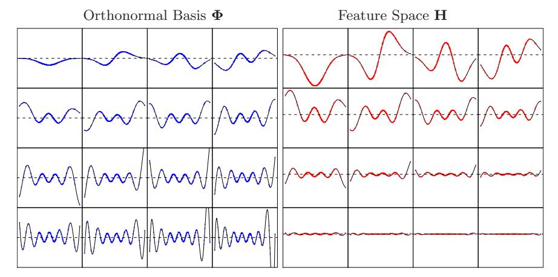

**FIGURE 5.14.** (Left panel) The first 16 normalized eigenvectors of **K**, the  $200 \times 200$  kernel matrix for the first coordinate of the mixture data. These are viewed as estimates  $\hat{\phi}_{\ell}$  of the eigenfunctions in (5.45), and are represented as functions in  $\mathbb{R}^1$  with the observed values superimposed in color. They are arranged in rows, starting at the top left. (Right panel) Rescaled versions  $h_{\ell} = \sqrt{\hat{\gamma}_{\ell}} \hat{\phi}_{\ell}$  of the functions in the left panel, for which the kernel computes the "inner product."

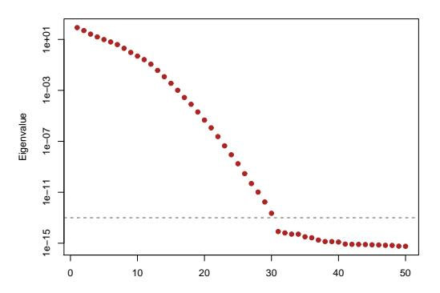

**FIGURE 5.15.** The largest 50 eigenvalues of **K**; all those beyond the 30th are effectively zero.

ing feature space representation of the eigenfunctions

$$h_{\ell}(x) = \sqrt{\hat{\gamma}_{\ell}} \hat{\phi}_{\ell}(x), \ \ell = 1, \dots, N.$$
 (5.65)

Note that  $\langle h(x_i), h(x_{i'}) \rangle = K(x_i, x_{i'})$ . The scaling by the eigenvalues quickly shrinks most of the functions down to zero, leaving an effective dimension of about 12 in this case. The corresponding optimization problem is a standard ridge regression, as in (5.63). So although in principle the implicit feature space is infinite dimensional, the effective dimension is dramatically lower because of the relative amounts of shrinkage applied to each basis function. The kernel scale parameter  $\nu$  plays a role here as well; larger  $\nu$  implies more local  $k_m$  functions, and increases the effective dimension of the feature space. See Hastie and Zhu (2006) for more details.

It is also known (Girosi et al., 1995) that a thin-plate spline (Section 5.7) is an expansion in radial basis functions, generated by the kernel

$$K(x,y) = ||x - y||^2 \log(||x - y||).$$
 (5.66)

Radial basis functions are discussed in more detail in Section 6.7.

#### Support Vector Classifiers

The support vector machines of Chapter 12 for a two-class classification problem have the form  $f(x) = \alpha_0 + \sum_{i=1}^{N} \alpha_i K(x, x_i)$ , where the parameters are chosen to minimize

$$\min_{\alpha_0, \alpha} \left\{ \sum_{i=1}^{N} [1 - y_i f(x_i)]_+ + \frac{\lambda}{2} \alpha^T \mathbf{K} \alpha \right\}, \tag{5.67}$$

where  $y_i \in \{-1,1\}$ , and  $[z]_+$  denotes the positive part of z. This can be viewed as a quadratic optimization problem with linear constraints, and requires a quadratic programming algorithm for its solution. The name support vector arises from the fact that typically many of the  $\hat{\alpha}_i = 0$  [due to the piecewise-zero nature of the loss function in (5.67)], and so  $\hat{f}$  is an expansion in a subset of the  $K(\cdot, x_i)$ . See Section 12.3.3 for more details.

# 5.9 Wavelet Smoothing

We have seen two different modes of operation with dictionaries of basis functions. With regression splines, we select a subset of the bases, using either subject-matter knowledge, or else automatically. The more adaptive procedures such as MARS (Chapter 9) can capture both smooth and non-smooth behavior. With smoothing splines, we use a complete basis, but then shrink the coefficients toward smoothness.

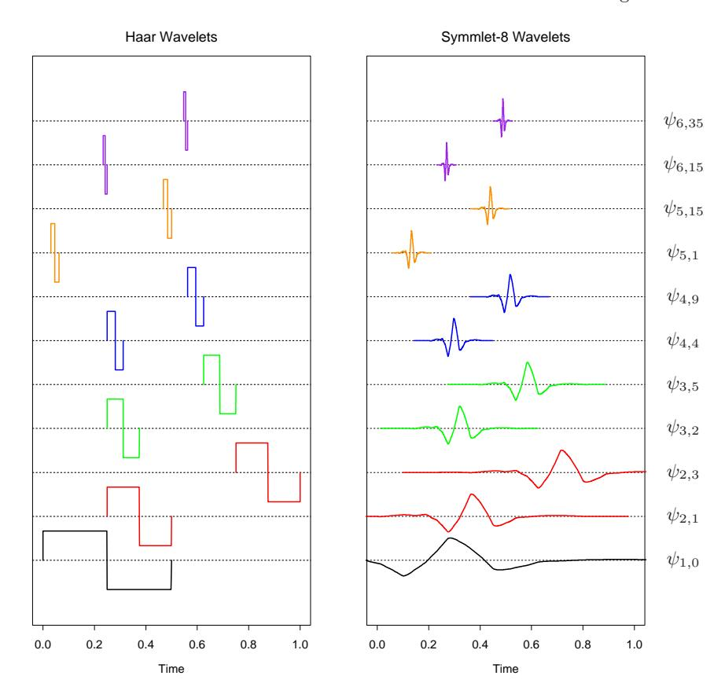

FIGURE 5.16. Some selected wavelets at different translations and dilations for the Haar and symmlet families. The functions have been scaled to suit the display.

Wavelets typically use a complete orthonormal basis to represent functions, but then shrink and select the coefficients toward a sparse representation. Just as a smooth function can be represented by a few spline basis functions, a mostly flat function with a few isolated bumps can be represented with a few (bumpy) basis functions. Wavelets bases are very popular in signal processing and compression, since they are able to represent both smooth and/or locally bumpy functions in an efficient way—a phenomenon dubbed time and frequency localization. In contrast, the traditional Fourier basis allows only frequency localization.

Before we give details, let's look at the Haar wavelets in the left panel of Figure 5.16 to get an intuitive idea of how wavelet smoothing works. The vertical axis indicates the scale (frequency) of the wavelets, from low scale at the bottom to high scale at the top. At each scale the wavelets are "packed in" side-by-side to completely fill the time axis: we have only shown a selected subset. Wavelet smoothing fits the coefficients for this basis by least squares, and then thresholds (discards, filters) the smaller coefficients. Since there are many basis functions at each scale, it can use bases where it needs them and discard the ones it does not need, to achieve time and frequency localization. The Haar wavelets are simple to understand, but not smooth enough for most purposes. The *symmlet* wavelets in the right panel of Figure 5.16 have the same orthonormal properties, but are smoother.

Figure 5.17 displays an NMR (nuclear magnetic resonance) signal, which appears to be composed of smooth components and isolated spikes, plus some noise. The wavelet transform, using a symmlet basis, is shown in the lower left panel. The wavelet coefficients are arranged in rows, from lowest scale at the bottom, to highest scale at the top. The length of each line segment indicates the size of the coefficient. The bottom right panel shows the wavelet coefficients after they have been thresholded. The threshold procedure, given below in equation (5.69), is the same soft-thresholding rule that arises in the lasso procedure for linear regression (Section 3.4.2). Notice that many of the smaller coefficients have been set to zero. The green curve in the top panel shows the back-transform of the thresholded coefficients: this is the smoothed version of the original signal. In the next section we give the details of this process, including the construction of wavelets and the thresholding rule.

#### 5.9.1 Wavelet Bases and the Wavelet Transform

In this section we give details on the construction and filtering of wavelets. Wavelet bases are generated by translations and dilations of a single scaling function  $\phi(x)$  (also known as the *father*). The red curves in Figure 5.18 are the *Haar* and *symmlet-8* scaling functions. The Haar basis is particularly easy to understand, especially for anyone with experience in analysis of variance or trees, since it produces a piecewise-constant representation. Thus if  $\phi(x) = I(x \in [0, 1])$ , then  $\phi_{0,k}(x) = \phi(x-k)$ , k an integer, generates an orthonormal basis for functions with jumps at the integers. Call this *reference* space  $V_0$ . The dilations  $\phi_{1,k}(x) = \sqrt{2}\phi(2x-k)$  form an orthonormal basis for a space  $V_1 \supset V_0$  of functions piecewise constant on intervals of length  $\frac{1}{2}$ . In fact, more generally we have  $\cdots \supset V_1 \supset V_0 \supset V_{-1} \supset \cdots$  where each  $V_i$  is spanned by  $\phi_{i,k} = 2^{j/2}\phi(2^jx - k)$ .

Now to the definition of wavelets. In analysis of variance, we often represent a pair of means  $\mu_1$  and  $\mu_2$  by their grand mean  $\mu = \frac{1}{2}(\mu_1 + \mu_2)$ , and then a contrast  $\alpha = \frac{1}{2}(\mu_1 - \mu_2)$ . A simplification occurs if the contrast  $\alpha$  is very small, because then we can set it to zero. In a similar manner we might represent a function in  $V_{j+1}$  by a component in  $V_j$  plus the component in the orthogonal complement  $W_j$  of  $V_j$  to  $V_{j+1}$ , written as  $V_{j+1} = V_j \oplus W_j$ . The component in  $W_j$  represents detail, and we might wish to set some elements of this component to zero. It is easy to see that the functions  $\psi(x-k)$ 

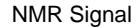

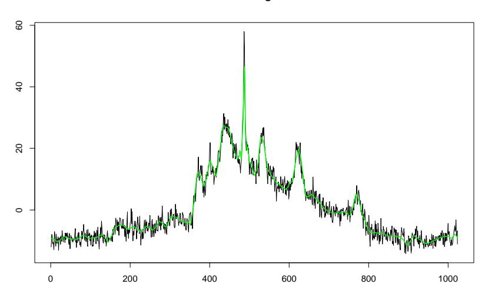

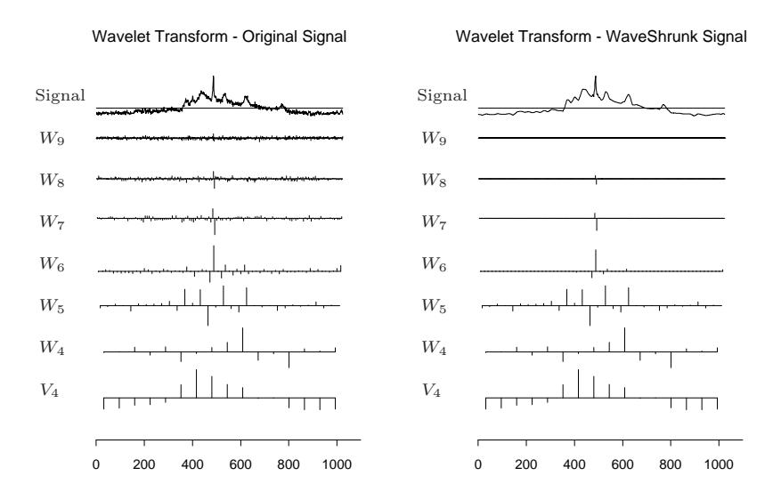

FIGURE 5.17. The top panel shows an NMR signal, with the wavelet-shrunk version superimposed in green. The lower left panel represents the wavelet transform of the original signal, down to V4, using the symmlet-8 basis. Each coefficient is represented by the height (positive or negative) of the vertical bar. The lower right panel represents the wavelet coefficients after being shrunken using the waveshrink function in S-PLUS, which implements the SureShrink method of wavelet adaptation of Donoho and Johnstone.

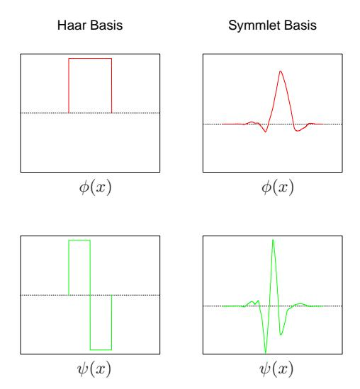

**FIGURE 5.18.** The Haar and symmlet father (scaling) wavelet  $\phi(x)$  and mother wavelet  $\psi(x)$ .

generated by the mother wavelet  $\psi(x) = \phi(2x) - \phi(2x-1)$  form an orthonormal basis for  $W_0$  for the Haar family. Likewise  $\psi_{j,k} = 2^{j/2} \psi(2^j x - k)$  form a basis for  $W_j$ .

Now  $V_{j+1} = V_j \oplus W_j = V_{j-1} \oplus W_{j-1} \oplus W_j$ , so besides representing a function by its level-j detail and level-j rough components, the latter can be broken down to level-(j-1) detail and rough, and so on. Finally we get a representation of the form  $V_J = V_0 \oplus W_0 \oplus W_1 \cdots \oplus W_{J-1}$ . Figure 5.16 on page 175 shows particular wavelets  $\psi_{j,k}(x)$ .

Notice that since these spaces are orthogonal, all the basis functions are orthonormal. In fact, if the domain is discrete with  $N = 2^J$  (time) points, this is as far as we can go. There are  $2^j$  basis elements at level j, and adding up, we have a total of  $2^J - 1$  elements in the  $W_j$ , and one in  $V_0$ . This structured orthonormal basis allows for a multiresolution analysis, which we illustrate in the next section.

While helpful for understanding the construction above, the Haar basis is often too coarse for practical purposes. Fortunately, many clever wavelet bases have been invented. Figures 5.16 and 5.18 include the *Daubechies symmlet-8* basis. This basis has smoother elements than the corresponding Haar basis, but there is a tradeoff:

• Each wavelet has a support covering 15 consecutive time intervals, rather than one for the Haar basis. More generally, the symmlet-p family has a support of 2p-1 consecutive intervals. The wider the support, the more time the wavelet has to die to zero, and so it can

achieve this more smoothly. Note that the effective support seems to be much narrower.

• The symmlet-p wavelet  $\psi(x)$  has p vanishing moments; that is,

$$\int \psi(x)x^{j}dx = 0, \ j = 0, \dots, p - 1.$$

One implication is that any order-p polynomial over the  $N=2^J$  times points is reproduced exactly in  $V_0$  (Exercise 5.18). In this sense  $V_0$  is equivalent to the null space of the smoothing-spline penalty. The Haar wavelets have one vanishing moment, and  $V_0$  can reproduce any constant function.

The symmlet-p scaling functions are one of many families of wavelet generators. The operations are similar to those for the Haar basis:

- If  $V_0$  is spanned by  $\phi(x-k)$ , then  $V_1 \supset V_0$  is spanned by  $\phi_{1,k}(x) = \sqrt{2}\phi(2x-k)$  and  $\phi(x) = \sum_{k \in \mathcal{Z}} h(k)\phi_{1,k}(x)$ , for some filter coefficients h(k).
- $W_0$  is spanned by  $\psi(x) = \sum_{k \in \mathbb{Z}} g(k) \phi_{1,k}(x)$ , with filter coefficients  $g(k) = (-1)^{1-k} h(1-k)$ .

#### 5.9.2 Adaptive Wavelet Filtering

Wavelets are particularly useful when the data are measured on a uniform lattice, such as a discretized signal, image, or a time series. We will focus on the one-dimensional case, and having  $N = 2^J$  lattice-points is convenient. Suppose  $\mathbf{y}$  is the response vector, and  $\mathbf{W}$  is the  $N \times N$  orthonormal wavelet basis matrix evaluated at the N uniformly spaced observations. Then  $\mathbf{y}^* = \mathbf{W}^T \mathbf{y}$  is called the wavelet transform of  $\mathbf{y}$  (and is the full least squares regression coefficient). A popular method for adaptive wavelet fitting is known as SURE shrinkage (Stein Unbiased Risk Estimation, Donoho and Johnstone (1994)). We start with the criterion

$$\min_{\mathbf{\theta}} ||\mathbf{y} - \mathbf{W}\boldsymbol{\theta}||_2^2 + 2\lambda ||\boldsymbol{\theta}||_1, \tag{5.68}$$

which is the same as the lasso criterion in Chapter 3. Because W is orthonormal, this leads to the simple solution:

$$\hat{\theta}_i = \text{sign}(y_i^*)(|y_i^*| - \lambda)_+.$$
 (5.69)

The least squares coefficients are translated toward zero, and truncated at zero. The fitted function (vector) is then given by the *inverse wavelet transform*  $\hat{\mathbf{f}} = \mathbf{W}\hat{\boldsymbol{\theta}}$ .

A simple choice for  $\lambda$  is  $\lambda = \sigma \sqrt{2 \log N}$ , where  $\sigma$  is an estimate of the standard deviation of the noise. We can give some motivation for this choice. Since  $\mathbf{W}$  is an orthonormal transformation, if the elements of  $\mathbf{y}$  are white noise (independent Gaussian variates with mean 0 and variance  $\sigma^2$ ), then so are  $\mathbf{y}^*$ . Furthermore if random variables  $Z_1, Z_2, \ldots, Z_N$  are white noise, the expected maximum of  $|Z_j|, j=1,\ldots,N$  is approximately  $\sigma \sqrt{2 \log N}$ . Hence all coefficients below  $\sigma \sqrt{2 \log N}$  are likely to be noise and are set to zero.

The space **W** could be any basis of orthonormal functions: polynomials, natural splines or cosinusoids. What makes wavelets special is the particular form of basis functions used, which allows for a representation *localized in time and in frequency*.

Let's look again at the NMR signal of Figure 5.17. The wavelet transform was computed using a symmlet-8 basis. Notice that the coefficients do not descend all the way to  $V_0$ , but stop at  $V_4$  which has 16 basis functions. As we ascend to each level of detail, the coefficients get smaller, except in locations where spiky behavior is present. The wavelet coefficients represent characteristics of the signal localized in time (the basis functions at each level are translations of each other) and localized in frequency. Each dilation increases the detail by a factor of two, and in this sense corresponds to doubling the frequency in a traditional Fourier representation. In fact, a more mathematical understanding of wavelets reveals that the wavelets at a particular scale have a Fourier transform that is restricted to a limited range or octave of frequencies.

The shrinking/truncation in the right panel was achieved using the SURE approach described in the introduction to this section. The orthonormal  $N \times N$  basis matrix **W** has columns which are the wavelet basis functions evaluated at the N time points. In particular, in this case there will be 16 columns corresponding to the  $\phi_{4,k}(x)$ , and the remainder devoted to the  $\psi_{j,k}(x)$ ,  $j=4,\ldots,11$ . In practice  $\lambda$  depends on the noise variance, and has to be estimated from the data (such as the variance of the coefficients at the highest level).

Notice the similarity between the SURE criterion (5.68) on page 179, and the smoothing spline criterion (5.21) on page 156:

- Both are hierarchically structured from coarse to fine detail, although wavelets are also localized in time within each resolution level.
- The splines build in a bias toward smooth functions by imposing differential shrinking constants  $d_k$ . Early versions of SURE shrinkage treated all scales equally. The S+wavelets function waveshrink() has many options, some of which allow for differential shrinkage.
- The spline  $L_2$  penalty cause pure shrinkage, while the SURE  $L_1$  penalty does shrinkage and selection.

More generally smoothing splines achieve compression of the original signal by imposing smoothness, while wavelets impose sparsity. Figure 5.19 compares a wavelet fit (using SURE shrinkage) to a smoothing spline fit (using cross-validation) on two examples different in nature. For the NMR data in the upper panel, the smoothing spline introduces detail everywhere in order to capture the detail in the isolated spikes; the wavelet fit nicely localizes the spikes. In the lower panel, the true function is smooth, and the noise is relatively high. The wavelet fit has let in some additional and unnecessary wiggles—a price it pays in variance for the additional adaptivity.

The wavelet transform is not performed by matrix multiplication as in y ∗ = WT y. In fact, using clever pyramidal schemes y ∗ can be obtained in O(N) computations, which is even faster than the N log(N) of the fast Fourier transform (FFT). While the general construction is beyond the scope of this book, it is easy to see for the Haar basis (Exercise 5.19). Likewise, the inverse wavelet transform Wθˆ is also O(N).

This has been a very brief glimpse of this vast and growing field. There is a very large mathematical and computational base built on wavelets. Modern image compression is often performed using two-dimensional wavelet representations.

# Bibliographic Notes

Splines and B-splines are discussed in detail in de Boor (1978). Green and Silverman (1994) and Wahba (1990) give a thorough treatment of smoothing splines and thin-plate splines; the latter also covers reproducing kernel Hilbert spaces. See also Girosi et al. (1995) and Evgeniou et al. (2000) for connections between many nonparametric regression techniques using RKHS approaches. Modeling functional data, as in Section 5.2.3, is covered in detail in Ramsay and Silverman (1997).

Daubechies (1992) is a classic and mathematical treatment of wavelets. Other useful sources are Chui (1992) and Wickerhauser (1994). Donoho and Johnstone (1994) developed the SURE shrinkage and selection technology from a statistical estimation framework; see also Vidakovic (1999). Bruce and Gao (1996) is a useful applied introduction, which also describes the wavelet software in S-PLUS.

# Exercises

Ex. 5.1 Show that the truncated power basis functions in (5.3) represent a basis for a cubic spline with the two knots as indicated.

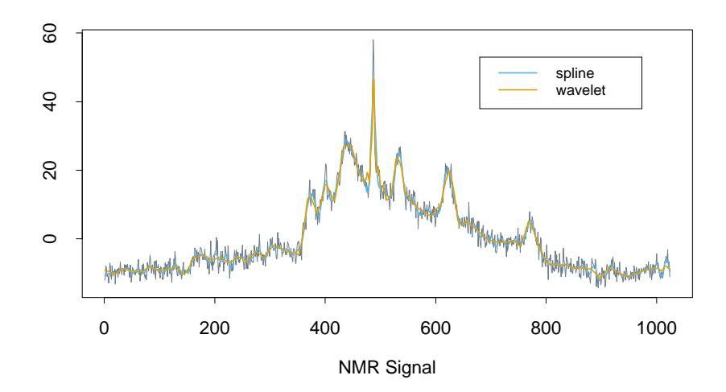

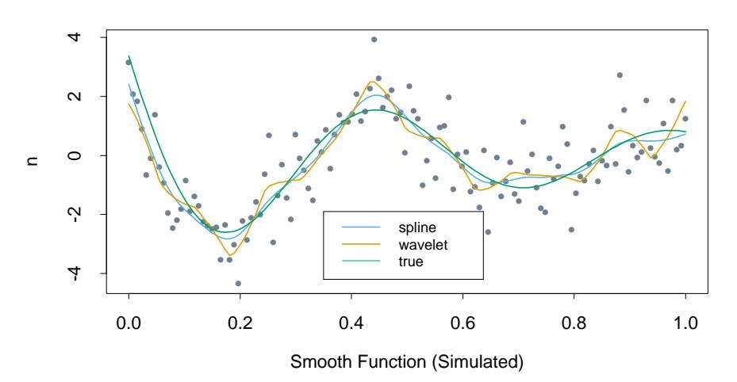

**FIGURE 5.19.** Wavelet smoothing compared with smoothing splines on two examples. Each panel compares the SURE-shrunk wavelet fit to the cross-validated smoothing spline fit.

Ex. 5.2 Suppose that  $B_{i,M}(x)$  is an order-M B-spline defined in the Appendix on page 186 through the sequence (5.77)–(5.78).

- (a) Show by induction that  $B_{i,M}(x) = 0$  for  $x \notin [\tau_i, \tau_{i+M}]$ . This shows, for example, that the support of cubic B-splines is at most 5 knots.
- (b) Show by induction that  $B_{i,M}(x) > 0$  for  $x \in (\tau_i, \tau_{i+M})$ . The *B*-splines are positive in the interior of their support.
- (c) Show by induction that  $\sum_{i=1}^{K+M} B_{i,M}(x) = 1 \, \forall x \in [\xi_0, \xi_{K+1}].$
- (d) Show that  $B_{i,M}$  is a piecewise polynomial of order M (degree M-1) on  $[\xi_0, \xi_{K+1}]$ , with breaks only at the knots  $\xi_1, \ldots, \xi_K$ .
- (e) Show that an order-M B-spline basis function is the density function of a convolution of M uniform random variables.

Ex. 5.3 Write a program to reproduce Figure 5.3 on page 145.

Ex. 5.4 Consider the truncated power series representation for cubic splines with K interior knots. Let

$$f(X) = \sum_{j=0}^{3} \beta_j X^j + \sum_{k=1}^{K} \theta_k (X - \xi_k)_+^3.$$
 (5.70)

Prove that the natural boundary conditions for natural cubic splines (Section 5.2.1) imply the following linear constraints on the coefficients:

$$\beta_2 = 0,$$
  $\sum_{k=1}^{K} \theta_k = 0,$   $\beta_3 = 0,$   $\sum_{k=1}^{K} \xi_k \theta_k = 0.$  (5.71)

Hence derive the basis (5.4) and (5.5).

Ex. 5.5 Write a program to classify the phoneme data using a quadratic discriminant analysis (Section 4.3). Since there are many correlated features, you should filter them using a smooth basis of natural cubic splines (Section 5.2.3). Decide beforehand on a series of five different choices for the number and position of the knots, and use tenfold cross-validation to make the final selection. The phoneme data are available from the book website www-stat.stanford.edu/ElemStatLearn.

Ex. 5.6 Suppose you wish to fit a periodic function, with a known period T. Describe how you could modify the truncated power series basis to achieve this goal.

Ex. 5.7 Derivation of smoothing splines (Green and Silverman, 1994). Suppose that  $N \geq 2$ , and that g is the natural cubic spline interpolant to the pairs  $\{x_i, z_i\}_1^N$ , with  $a < x_1 < \cdots < x_N < b$ . This is a natural spline

with a knot at every xi ; being an N-dimensional space of functions, we can determine the coefficients such that it interpolates the sequence zi exactly. Let ˜g be any other differentiable function on [a, b] that interpolates the N pairs.

(a) Let h(x) = ˜g(x) − g(x). Use integration by parts and the fact that g is a natural cubic spline to show that

$$\int_{a}^{b} g''(x)h''(x)dx = -\sum_{j=1}^{N-1} g'''(x_{j}^{+})\{h(x_{j+1}) - h(x_{j})\} (5.72)$$
$$= 0.$$

(b) Hence show that

$$\int_{a}^{b} \tilde{g}''(t)^{2} dt \ge \int_{a}^{b} g''(t)^{2} dt,$$

and that equality can only hold if h is identically zero in [a, b].

(c) Consider the penalized least squares problem

$$\min_{f} \left[ \sum_{i=1}^{N} (y_i - f(x_i))^2 + \lambda \int_{a}^{b} f''(t)^2 dt \right].$$

Use (b) to argue that the minimizer must be a cubic spline with knots at each of the xi .

Ex. 5.8 In the appendix to this chapter we show how the smoothing spline computations could be more efficiently carried out using a (N + 4) dimensional basis of B-splines. Describe a slightly simpler scheme using a (N + 2) dimensional B-spline basis defined on the N − 2 interior knots.

Ex. 5.9 Derive the Reinsch form Sλ = (I+λK) −1 for the smoothing spline.

Ex. 5.10 Derive an expression for Var( ˆfλ(x0)) and bias( ˆfλ(x0)). Using the example (5.22), create a version of Figure 5.9 where the mean and several (pointwise) quantiles of ˆfλ(x) are shown.

Ex. 5.11 Prove that for a smoothing spline the null space of K is spanned by functions linear in X.

Ex. 5.12 Characterize the solution to the following problem,

$$\min_{f} RSS(f, \lambda) = \sum_{i=1}^{N} w_i \{y_i - f(x_i)\}^2 + \lambda \int \{f''(t)\}^2 dt,$$
 (5.73)

where the wi ≥ 0 are observation weights.

Characterize the solution to the smoothing spline problem (5.9) when the training data have ties in X.

Ex. 5.13 You have fitted a smoothing spline  $\hat{f}_{\lambda}$  to a sample of N pairs  $(x_i, y_i)$ . Suppose you augment your original sample with the pair  $x_0, \hat{f}_{\lambda}(x_0)$ , and refit; describe the result. Use this to derive the N-fold cross-validation formula (5.26).

Ex. 5.14 Derive the constraints on the  $\alpha_j$  in the thin-plate spline expansion (5.39) to guarantee that the penalty J(f) is finite. How else could one ensure that the penalty was finite?

Ex. 5.15 This exercise derives some of the results quoted in Section 5.8.1. Suppose K(x, y) satisfying the conditions (5.45) and let  $f(x) \in \mathcal{H}_K$ . Show that

- (a)  $\langle K(\cdot, x_i), f \rangle_{\mathcal{H}_K} = f(x_i)$ .
- (b)  $\langle K(\cdot, x_i), K(\cdot, x_j) \rangle_{\mathcal{H}_K} = K(x_i, x_j).$
- (c) If  $g(x) = \sum_{i=1}^{N} \alpha_i K(x, x_i)$ , then

$$J(g) = \sum_{i=1}^{N} \sum_{j=1}^{N} K(x_i, x_j) \alpha_i \alpha_j.$$

Suppose that  $\tilde{g}(x) = g(x) + \rho(x)$ , with  $\rho(x) \in \mathcal{H}_K$ , and orthogonal in  $\mathcal{H}_K$  to each of  $K(x, x_i)$ , i = 1, ..., N. Show that

(d) 
$$\sum_{i=1}^{N} L(y_i, \tilde{g}(x_i)) + \lambda J(\tilde{g}) \ge \sum_{i=1}^{N} L(y_i, g(x_i)) + \lambda J(g)$$
 (5.74)

with equality iff  $\rho(x) = 0$ .

Ex. 5.16 Consider the ridge regression problem (5.53), and assume  $M \ge N$ . Assume you have a kernel K that computes the inner product  $K(x,y) = \sum_{m=1}^{M} h_m(x)h_m(y)$ .

- (a) Derive (5.62) on page 171 in the text. How would you compute the matrices  $\mathbf{V}$  and  $\mathbf{D}_{\gamma}$ , given K? Hence show that (5.63) is equivalent to (5.53).
- (b) Show that

$$\hat{\mathbf{f}} = \mathbf{H}\hat{\boldsymbol{\beta}} 
= \mathbf{K}(\mathbf{K} + \lambda \mathbf{I})^{-1}\mathbf{y},$$
(5.75)

where **H** is the  $N \times M$  matrix of evaluations  $h_m(x_i)$ , and  $\mathbf{K} = \mathbf{H}\mathbf{H}^T$  the  $N \times N$  matrix of inner-products  $h(x_i)^T h(x_j)$ .

(c) Show that

$$\hat{f}(x) = h(x)^T \hat{\boldsymbol{\beta}}$$

$$= \sum_{i=1}^N K(x, x_i) \hat{\boldsymbol{\alpha}}_i$$
 (5.76)

and 
$$\hat{\boldsymbol{\alpha}} = (\mathbf{K} + \lambda \mathbf{I})^{-1} \mathbf{y}$$
.

(d) How would you modify your solution if M < N?

Ex. 5.17 Show how to convert the discrete eigen-decomposition of K in Section 5.8.2 to estimates of the eigenfunctions of K.

Ex. 5.18 The wavelet function ψ(x) of the symmlet-p wavelet basis has vanishing moments up to order p. Show that this implies that polynomials of order p are represented exactly in V0, defined on page 176.

Ex. 5.19 Show that the Haar wavelet transform of a signal of length N = 2J can be computed in O(N) computations.

# Appendix: Computations for Splines

In this Appendix, we describe the B-spline basis for representing polynomial splines. We also discuss their use in the computations of smoothing splines.

## B-splines

Before we can get started, we need to augment the knot sequence defined in Section 5.2. Let ξ0 < ξ1 and ξK < ξK+1 be two boundary knots, which typically define the domain over which we wish to evaluate our spline. We now define the augmented knot sequence τ such that

- τ1 ≤ τ2 ≤ · · · ≤ τM ≤ ξ0;
- τj+M = ξj , j = 1, · · · , K;
- ξK+1 ≤ τK+M+1 ≤ τK+M+2 ≤ · · · ≤ τK+2M.

The actual values of these additional knots beyond the boundary are arbitrary, and it is customary to make them all the same and equal to ξ0 and ξK+1, respectively.

Denote by Bi,m(x) the ith B-spline basis function of order m for the knot-sequence τ , m ≤ M. They are defined recursively in terms of divided differences as follows:

$$B_{i,1}(x) = \begin{cases} 1 & \text{if } \tau_i \le x < \tau_{i+1} \\ 0 & \text{otherwise} \end{cases}$$
 (5.77)

for i = 1, ..., K + 2M - 1. These are also known as Haar basis functions.

$$B_{i,m}(x) = \frac{x - \tau_i}{\tau_{i+m-1} - \tau_i} B_{i,m-1}(x) + \frac{\tau_{i+m} - x}{\tau_{i+m} - \tau_{i+1}} B_{i+1,m-1}(x)$$
for  $i = 1, \dots, K + 2M - m$ . (5.78)

Thus with M=4,  $B_{i,4}$ ,  $i=1,\cdots,K+4$  are the K+4 cubic B-spline basis functions for the knot sequence  $\xi$ . This recursion can be continued and will generate the B-spline basis for any order spline. Figure 5.20 shows the sequence of B-splines up to order four with knots at the points  $0.0,0.1,\ldots,1.0$ . Since we have created some duplicate knots, some care has to be taken to avoid division by zero. If we adopt the convention that  $B_{i,1}=0$  if  $\tau_i=\tau_{i+1}$ , then by induction  $B_{i,m}=0$  if  $\tau_i=\tau_{i+1}=\ldots=\tau_{i+m}$ . Note also that in the construction above, only the subset  $B_{i,m}$ ,  $i=M-m+1,\ldots,M+K$  are required for the B-spline basis of order m < M with knots  $\xi$ .

To fully understand the properties of these functions, and to show that they do indeed span the space of cubic splines for the knot sequence, requires additional mathematical machinery, including the properties of divided differences. Exercise 5.2 explores these issues.

The scope of B-splines is in fact bigger than advertised here, and has to do with knot duplication. If we duplicate an interior knot in the construction of the  $\tau$  sequence above, and then generate the B-spline sequence as before, the resulting basis spans the space of piecewise polynomials with one less continuous derivative at the duplicated knot. In general, if in addition to the repeated boundary knots, we include the interior knot  $\xi_j$   $1 \le r_j \le M$  times, then the lowest-order derivative to be discontinuous at  $x = \xi_j$  will be order  $M - r_j$ . Thus for cubic splines with no repeats,  $r_j = 1, j = 1, \ldots, K$ , and at each interior knot the third derivatives (4-1) are discontinuous. Repeating the jth knot three times leads to a discontinuous 1st derivative; repeating it four times leads to a discontinuous zeroth derivative, i.e., the function is discontinuous at  $x = \xi_j$ . This is exactly what happens at the boundary knots; we repeat the knots M times, so the spline becomes discontinuous at the boundary knots (i.e., undefined beyond the boundary).

The local support of B-splines has important computational implications, especially when the number of knots K is large. Least squares computations with N observations and K+M variables (basis functions) take  $O(N(K+M)^2+(K+M)^3)$  flops (floating point operations.) If K is some appreciable fraction of N, this leads to  $O(N^3)$  algorithms which becomes

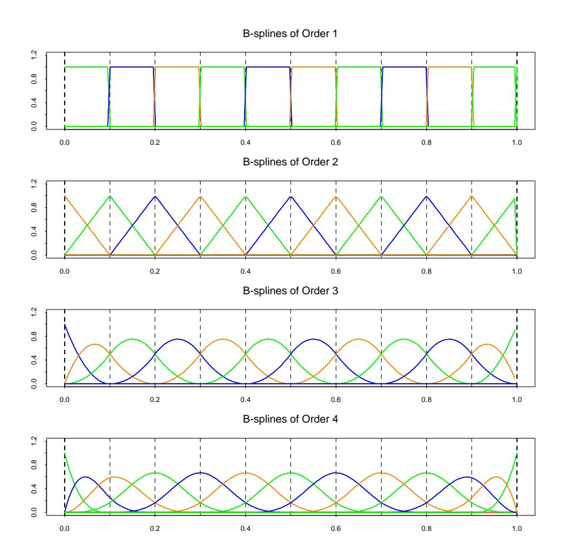

FIGURE 5.20. The sequence of B-splines up to order four with ten knots evenly spaced from 0 to 1. The B-splines have local support; they are nonzero on an interval spanned by M + 1 knots.

unacceptable for large N. If the N observations are sorted, the  $N \times (K+M)$  regression matrix consisting of the K+M B-spline basis functions evaluated at the N points has many zeros, which can be exploited to reduce the computational complexity back to O(N). We take this up further in the next section.

#### Computations for Smoothing Splines

Although natural splines (Section 5.2.1) provide a basis for smoothing splines, it is computationally more convenient to operate in the larger space of unconstrained B-splines. We write  $f(x) = \sum_{1}^{N+4} \gamma_{j} B_{j}(x)$ , where  $\gamma_{j}$  are coefficients and the  $B_{j}$  are the cubic B-spline basis functions. The solution looks the same as before,

$$\hat{\gamma} = (\mathbf{B}^T \mathbf{B} + \lambda \mathbf{\Omega}_B)^{-1} \mathbf{B}^T \mathbf{y}, \tag{5.79}$$

except now the  $N \times N$  matrix  $\mathbf{N}$  is replaced by the  $N \times (N+4)$  matrix  $\mathbf{B}$ , and similarly the  $(N+4) \times (N+4)$  penalty matrix  $\mathbf{\Omega}_B$  replaces the  $N \times N$  dimensional  $\mathbf{\Omega}_N$ . Although at face value it seems that there are no boundary derivative constraints, it turns out that the penalty term automatically imposes them by giving effectively infinite weight to any non zero derivative beyond the boundary. In practice,  $\hat{\gamma}$  is restricted to a linear subspace for which the penalty is always finite.

Since the columns of **B** are the evaluated *B*-splines, in order from left to right and evaluated at the *sorted* values of X, and the cubic *B*-splines have local support, **B** is lower 4-banded. Consequently the matrix  $\mathbf{M} = (\mathbf{B}^T\mathbf{B} + \lambda \mathbf{\Omega})$  is 4-banded and hence its Cholesky decomposition  $\mathbf{M} = \mathbf{L}\mathbf{L}^T$  can be computed easily. One then solves  $\mathbf{L}\mathbf{L}^T\gamma = \mathbf{B}^T\mathbf{y}$  by back-substitution to give  $\gamma$  and hence the solution  $\hat{f}$  in O(N) operations.

In practice, when N is large, it is unnecessary to use all N interior knots, and any reasonable *thinning* strategy will save in computations and have negligible effect on the fit. For example, the <code>smooth.spline</code> function in S-PLUS uses an approximately logarithmic strategy: if N < 50 all knots are included, but even at N = 5,000 only 204 knots are used.