# Kernel Smoothing Methods

In this chapter we describe a class of regression techniques that achieve flexibility in estimating the regression function f(X) over the domain IR$^{p}$ by fitting a different but simple model separately at each query point x0. This is done by using only those observations close to the target point x$^{0}$ to fit the simple model, and in such a way that the resulting estimated function ˆf(X) is smooth in IR$^{p}$ . This localization is achieved via a weighting function or kernel K$\lambda$(x0, xi), which assigns a weight to x$^{i}$ based on its distance from x0. The kernels K$^{\lambda}$ are typically indexed by a parameter $\lambda$ that dictates the width of the neighborhood. These memory-based methods require in principle little or no training; all the work gets done at evaluation time. The only parameter that needs to be determined from the training data is $\lambda$. The model, however, is the entire training data set.

We also discuss more general classes of kernel-based techniques , which tie in with structured methods in other chapters, and are useful for density estimation and classification.

The techniques in this chapter should not be confused with those associated with the more recent usage of the phrase "kernel methods". In this chapter kernels are mostly used as a device for localization. We discuss kernel methods in Sections 5.8, 14.5.4, 18.5 and Chapter 12; in those contexts the kernel computes an inner product in a high-dimensional (implicit) feature space, and is used for regularized nonlinear modeling. We make some connections to the methodology in this chapter at the end of Section 6.7.

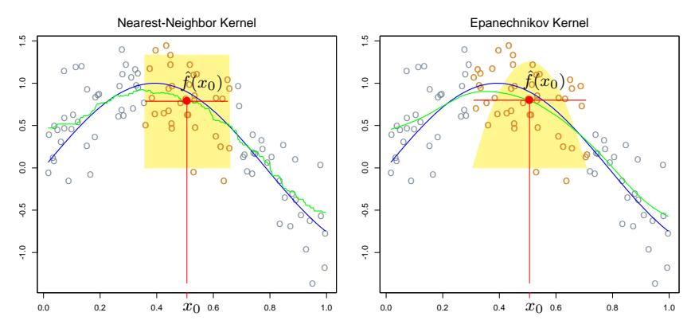

**FIGURE 6.1.** In each panel 100 pairs  $x_i$ ,  $y_i$  are generated at random from the blue curve with Gaussian errors:  $Y = \sin(4X) + \varepsilon$ ,  $X \sim U[0,1]$ ,  $\varepsilon \sim N(0,1/3)$ . In the left panel the green curve is the result of a 30-nearest-neighbor running-mean smoother. The red point is the fitted constant  $\hat{f}(x_0)$ , and the red circles indicate those observations contributing to the fit at  $x_0$ . The solid yellow region indicates the weights assigned to observations. In the right panel, the green curve is the kernel-weighted average, using an Epanechnikov kernel with (half) window width  $\lambda = 0.2$ .

#### 6.1 One-Dimensional Kernel Smoothers

In Chapter 2, we motivated the k-nearest-neighbor average

$$\hat{f}(x) = \text{Ave}(y_i | x_i \in N_k(x)) \tag{6.1}$$

as an estimate of the regression function E(Y|X=x). Here  $N_k(x)$  is the set of k points nearest to x in squared distance, and Ave denotes the average (mean). The idea is to relax the definition of conditional expectation, as illustrated in the left panel of Figure 6.1, and compute an average in a neighborhood of the target point. In this case we have used the 30-nearest neighborhood—the fit at  $x_0$  is the average of the 30 pairs whose  $x_i$  values are closest to  $x_0$ . The green curve is traced out as we apply this definition at different values  $x_0$ . The green curve is bumpy, since  $\hat{f}(x)$  is discontinuous in x. As we move  $x_0$  from left to right, the k-nearest neighborhood remains constant, until a point  $x_i$  to the right of  $x_0$  becomes closer than the furthest point  $x_{i'}$  in the neighborhood to the left of  $x_0$ , at which time  $x_i$  replaces  $x_{i'}$ . The average in (6.1) changes in a discrete way, leading to a discontinuous  $\hat{f}(x)$ .

This discontinuity is ugly and unnecessary. Rather than give all the points in the neighborhood equal weight, we can assign weights that die off smoothly with distance from the target point. The right panel shows an example of this, using the so-called Nadaraya–Watson kernel-weighted

average

$$\hat{f}(x_0) = \frac{\sum_{i=1}^{N} K_{\lambda}(x_0, x_i) y_i}{\sum_{i=1}^{N} K_{\lambda}(x_0, x_i)},$$
(6.2)

with the Epanechnikov quadratic kernel

$$K_{\lambda}(x_0, x) = D\left(\frac{|x - x_0|}{\lambda}\right),$$
 (6.3)

with

$$D(t) = \begin{cases} \frac{3}{4}(1-t^2) & \text{if } |t| \le 1; \\ 0 & \text{otherwise.} \end{cases}$$
 (6.4)

The fitted function is now continuous, and quite smooth in the right panel of Figure 6.1. As we move the target from left to right, points enter the neighborhood initially with weight zero, and then their contribution slowly increases (see Exercise 6.1).

In the right panel we used a metric window size  $\lambda=0.2$  for the kernel fit, which does not change as we move the target point  $x_0$ , while the size of the 30-nearest-neighbor smoothing window adapts to the local density of the  $x_i$ . One can, however, also use such adaptive neighborhoods with kernels, but we need to use a more general notation. Let  $h_{\lambda}(x_0)$  be a width function (indexed by  $\lambda$ ) that determines the width of the neighborhood at  $x_0$ . Then more generally we have

$$K_{\lambda}(x_0, x) = D\left(\frac{|x - x_0|}{h_{\lambda}(x_0)}\right). \tag{6.5}$$

In (6.3),  $h_{\lambda}(x_0) = \lambda$  is constant. For k-nearest neighborhoods, the neighborhood size k replaces  $\lambda$ , and we have  $h_k(x_0) = |x_0 - x_{[k]}|$  where  $x_{[k]}$  is the kth closest  $x_i$  to  $x_0$ .

There are a number of details that one has to attend to in practice:

- The smoothing parameter  $\lambda$ , which determines the width of the local neighborhood, has to be determined. Large  $\lambda$  implies lower variance (averages over more observations) but higher bias (we essentially assume the true function is constant within the window).
- Metric window widths (constant  $h_{\lambda}(x)$ ) tend to keep the bias of the estimate constant, but the variance is inversely proportional to the local density. Nearest-neighbor window widths exhibit the opposite behavior; the variance stays constant and the absolute bias varies inversely with local density.
- Issues arise with nearest-neighbors when there are ties in the  $x_i$ . With most smoothing techniques one can simply reduce the data set by averaging the  $y_i$  at tied values of X, and supplementing these new observations at the unique values of  $x_i$  with an additional weight  $w_i$  (which multiples the kernel weight).

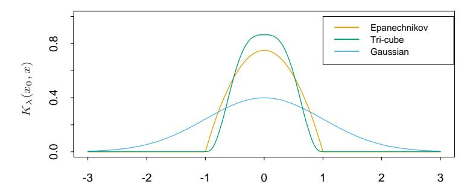

**FIGURE 6.2.** A comparison of three popular kernels for local smoothing. Each has been calibrated to integrate to 1. The tri-cube kernel is compact and has two continuous derivatives at the boundary of its support, while the Epanechnikov kernel has none. The Gaussian kernel is continuously differentiable, but has infinite support.

- This leaves a more general problem to deal with: observation weights  $w_i$ . Operationally we simply multiply them by the kernel weights before computing the weighted average. With nearest neighborhoods, it is now natural to insist on neighborhoods with a total weight content k (relative to  $\sum w_i$ ). In the event of overflow (the last observation needed in a neighborhood has a weight  $w_j$  which causes the sum of weights to exceed the budget k), then fractional parts can be used.
- Boundary issues arise. The metric neighborhoods tend to contain less points on the boundaries, while the nearest-neighborhoods get wider.
- The Epanechnikov kernel has compact support (needed when used with nearest-neighbor window size). Another popular compact kernel is based on the tri-cube function

$$D(t) = \begin{cases} (1-|t|^3)^3 & \text{if } |t| \le 1; \\ 0 & \text{otherwise} \end{cases}$$
 (6.6)

This is flatter on the top (like the nearest-neighbor box) and is differentiable at the boundary of its support. The Gaussian density function  $D(t) = \phi(t)$  is a popular noncompact kernel, with the standard-deviation playing the role of the window size. Figure 6.2 compares the three.

#### 6.1.1 Local Linear Regression

We have progressed from the raw moving average to a smoothly varying locally weighted average by using kernel weighting. The smooth kernel fit still has problems, however, as exhibited in Figure 6.3 (left panel). Locally-weighted averages can be badly biased on the boundaries of the domain,

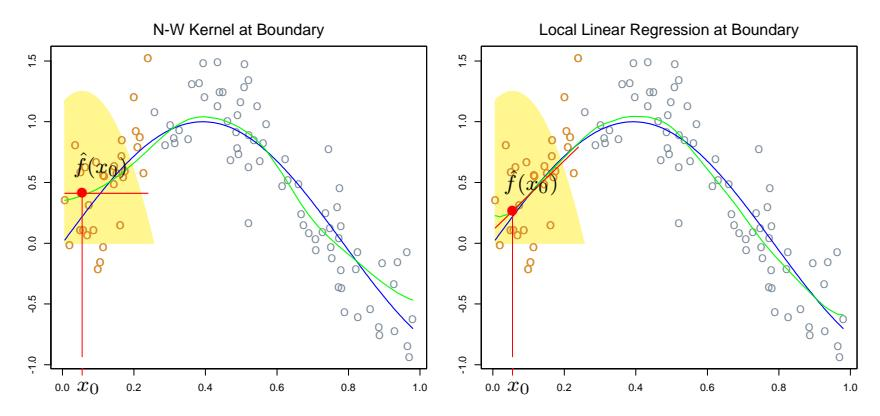

**FIGURE 6.3.** The locally weighted average has bias problems at or near the boundaries of the domain. The true function is approximately linear here, but most of the observations in the neighborhood have a higher mean than the target point, so despite weighting, their mean will be biased upwards. By fitting a locally weighted linear regression (right panel), this bias is removed to first order.

because of the asymmetry of the kernel in that region. By fitting straight lines rather than constants locally, we can remove this bias exactly to first order; see Figure 6.3 (right panel). Actually, this bias can be present in the interior of the domain as well, if the X values are not equally spaced (for the same reasons, but usually less severe). Again locally weighted linear regression will make a first-order correction.

Locally weighted regression solves a separate weighted least squares problem at each target point  $x_0$ :

$$\min_{\alpha(x_0), \beta(x_0)} \sum_{i=1}^{N} K_{\lambda}(x_0, x_i) \left[ y_i - \alpha(x_0) - \beta(x_0) x_i \right]^2.$$
 (6.7)

The estimate is then  $\hat{f}(x_0) = \hat{\alpha}(x_0) + \hat{\beta}(x_0)x_0$ . Notice that although we fit an entire linear model to the data in the region, we only use it to evaluate the fit at the single point  $x_0$ .

Define the vector-valued function  $b(x)^T = (1, x)$ . Let **B** be the  $N \times 2$  regression matrix with ith row  $b(x_i)^T$ , and  $\mathbf{W}(x_0)$  the  $N \times N$  diagonal matrix with ith diagonal element  $K_{\lambda}(x_0, x_i)$ . Then

$$\hat{f}(x_0) = b(x_0)^T (\mathbf{B}^T \mathbf{W}(x_0) \mathbf{B})^{-1} \mathbf{B}^T \mathbf{W}(x_0) \mathbf{y}$$
 (6.8)

$$= \sum_{i=1}^{N} l_i(x_0) y_i. (6.9)$$

Equation (6.8) gives an explicit expression for the local linear regression estimate, and (6.9) highlights the fact that the estimate is *linear* in the

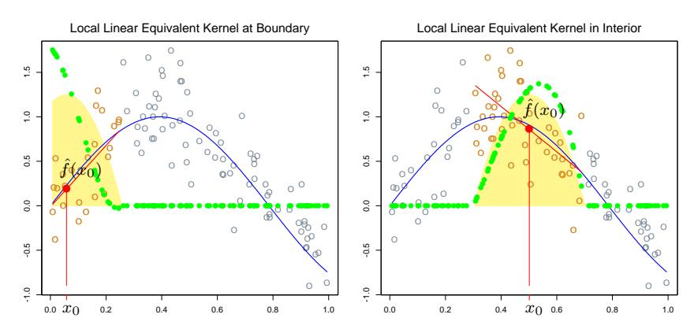

**FIGURE 6.4.** The green points show the equivalent kernel  $l_i(x_0)$  for local regression. These are the weights in  $\hat{f}(x_0) = \sum_{i=1}^N l_i(x_0)y_i$ , plotted against their corresponding  $x_i$ . For display purposes, these have been rescaled, since in fact they sum to 1. Since the yellow shaded region is the (rescaled) equivalent kernel for the Nadaraya-Watson local average, we see how local regression automatically modifies the weighting kernel to correct for biases due to asymmetry in the smoothing window.

 $y_i$  (the  $l_i(x_0)$  do not involve  $\mathbf{y}$ ). These weights  $l_i(x_0)$  combine the weighting kernel  $K_{\lambda}(x_0,\cdot)$  and the least squares operations, and are sometimes referred to as the equivalent kernel. Figure 6.4 illustrates the effect of local linear regression on the equivalent kernel. Historically, the bias in the Nadaraya-Watson and other local average kernel methods were corrected by modifying the kernel. These modifications were based on theoretical asymptotic mean-square-error considerations, and besides being tedious to implement, are only approximate for finite sample sizes. Local linear regression automatically modifies the kernel to correct the bias exactly to first order, a phenomenon dubbed as automatic kernel carpentry. Consider the following expansion for  $\mathbf{E}\hat{f}(x_0)$ , using the linearity of local regression and a series expansion of the true function f around  $x_0$ ,

where the remainder term R involves third- and higher-order derivatives of f, and is typically small under suitable smoothness assumptions. It can be

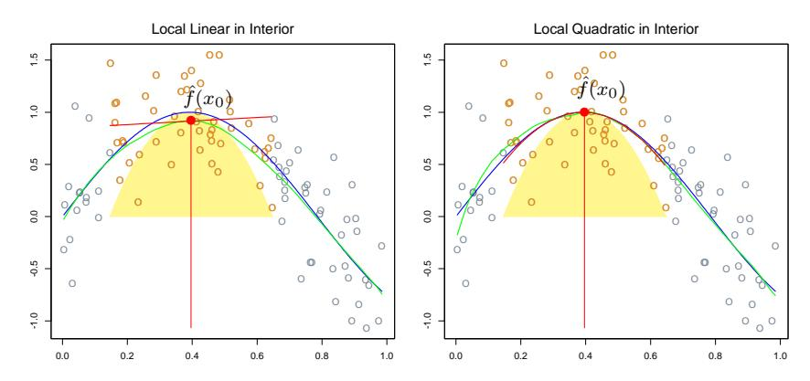

**FIGURE 6.5.** Local linear fits exhibit bias in regions of curvature of the true function. Local quadratic fits tend to eliminate this bias.

shown (Exercise 6.2) that for local linear regression,  $\sum_{i=1}^{N} l_i(x_0) = 1$  and  $\sum_{i=1}^{N} (x_i - x_0) l_i(x_0) = 0$ . Hence the middle term equals  $f(x_0)$ , and since the bias is  $E\hat{f}(x_0) - f(x_0)$ , we see that it depends only on quadratic and higher-order terms in the expansion of f.

#### 6.1.2 Local Polynomial Regression

Why stop at local linear fits? We can fit local polynomial fits of any degree d,

$$\min_{\alpha(x_0), \beta_j(x_0), \ j=1, \dots, d} \sum_{i=1}^{N} K_{\lambda}(x_0, x_i) \left[ y_i - \alpha(x_0) - \sum_{j=1}^{d} \beta_j(x_0) x_i^j \right]^2$$
 (6.11)

with solution  $\hat{f}(x_0) = \hat{\alpha}(x_0) + \sum_{j=1}^d \hat{\beta}_j(x_0) x_0^j$ . In fact, an expansion such as (6.10) will tell us that the bias will only have components of degree d+1 and higher (Exercise 6.2). Figure 6.5 illustrates local quadratic regression. Local linear fits tend to be biased in regions of curvature of the true function, a phenomenon referred to as trimming the hills and filling the valleys. Local quadratic regression is generally able to correct this bias.

There is of course a price to be paid for this bias reduction, and that is increased variance. The fit in the right panel of Figure 6.5 is slightly more wiggly, especially in the tails. Assuming the model  $y_i = f(x_i) + \varepsilon_i$ , with  $\varepsilon_i$  independent and identically distributed with mean zero and variance  $\sigma^2$ ,  $\operatorname{Var}(\hat{f}(x_0)) = \sigma^2 ||l(x_0)||^2$ , where  $l(x_0)$  is the vector of equivalent kernel weights at  $x_0$ . It can be shown (Exercise 6.3) that  $||l(x_0)||$  increases with d, and so there is a bias-variance tradeoff in selecting the polynomial degree. Figure 6.6 illustrates these variance curves for degree zero, one and two

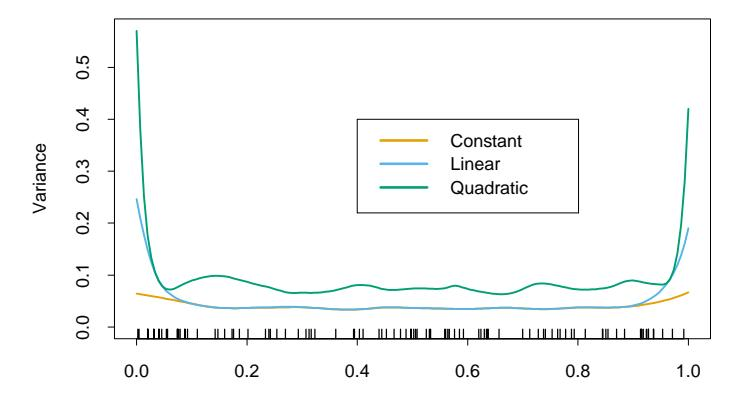

FIGURE 6.6. The variances functions ||l(x)||$^{2}$ for local constant, linear and quadratic regression, for a metric bandwidth ($\lambda$ = 0.2) tri-cube kernel.

local polynomials. To summarize some collected wisdom on this issue:

- Local linear fits can help bias dramatically at the boundaries at a modest cost in variance. Local quadratic fits do little at the boundaries for bias, but increase the variance a lot.
- Local quadratic fits tend to be most helpful in reducing bias due to curvature in the interior of the domain.
- Asymptotic analysis suggest that local polynomials of odd degree dominate those of even degree. This is largely due to the fact that asymptotically the MSE is dominated by boundary effects.

While it may be helpful to tinker, and move from local linear fits at the boundary to local quadratic fits in the interior, we do not recommend such strategies. Usually the application will dictate the degree of the fit. For example, if we are interested in extrapolation, then the boundary is of more interest, and local linear fits are probably more reliable.

# 6.2 Selecting the Width of the Kernel

In each of the kernels K$\lambda$, $\lambda$ is a parameter that controls its width:

- For the Epanechnikov or tri-cube kernel with metric width, $\lambda$ is the radius of the support region.
- For the Gaussian kernel, $\lambda$ is the standard deviation.
- $\lambda$ is the number k of nearest neighbors in k-nearest neighborhoods, often expressed as a fraction or span k/N of the total training sample.

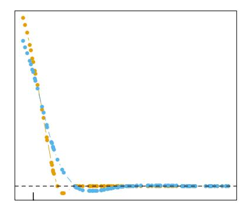

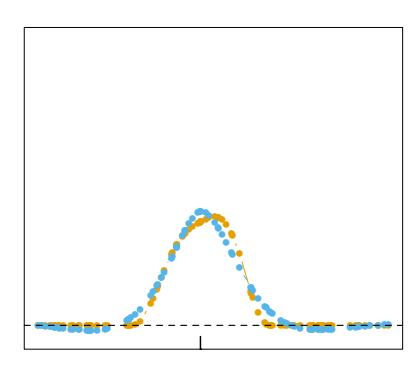

**FIGURE 6.7.** Equivalent kernels for a local linear regression smoother (tri-cube kernel; orange) and a smoothing spline (blue), with matching degrees of freedom. The vertical spikes indicates the target points.

There is a natural bias-variance tradeoff as we change the width of the averaging window, which is most explicit for local averages:

- If the window is narrow,  $f(x_0)$  is an average of a small number of  $y_i$  close to  $x_0$ , and its variance will be relatively large—close to that of an individual  $y_i$ . The bias will tend to be small, again because each of the  $E(y_i) = f(x_i)$  should be close to  $f(x_0)$ .
- If the window is wide, the variance of  $\hat{f}(x_0)$  will be small relative to the variance of any  $y_i$ , because of the effects of averaging. The bias will be higher, because we are now using observations  $x_i$  further from  $x_0$ , and there is no guarantee that  $f(x_i)$  will be close to  $f(x_0)$ .

Similar arguments apply to local regression estimates, say local linear: as the width goes to zero, the estimates approach a piecewise-linear function that interpolates the training data$^{1}$; as the width gets infinitely large, the fit approaches the global linear least-squares fit to the data.

The discussion in Chapter 5 on selecting the regularization parameter for smoothing splines applies here, and will not be repeated. Local regression smoothers are linear estimators; the smoother matrix in  $\hat{\mathbf{f}} = \mathbf{S}_{\lambda} \mathbf{y}$  is built up from the equivalent kernels (6.8), and has ijth entry  $\{\mathbf{S}_{\lambda}\}_{ij} = l_i(x_j)$ . Leave-one-out cross-validation is particularly simple (Exercise 6.7), as is generalized cross-validation,  $C_p$  (Exercise 6.10), and k-fold cross-validation. The effective degrees of freedom is again defined as trace( $\mathbf{S}_{\lambda}$ ), and can be used to calibrate the amount of smoothing. Figure 6.7 compares the equivalent kernels for a smoothing spline and local linear regression. The local regression smoother has a span of 40%, which results in df = trace( $\mathbf{S}_{\lambda}$ ) = 5.86. The smoothing spline was calibrated to have the same df, and their equivalent kernels are qualitatively quite similar.

$ ^{1} $With uniformly spaced  $x_i$ ; with irregularly spaced  $x_i$ , the behavior can deteriorate.

# 6.3 Local Regression in $\mathbb{R}^p$

Kernel smoothing and local regression generalize very naturally to two or more dimensions. The Nadaraya–Watson kernel smoother fits a constant locally with weights supplied by a p-dimensional kernel. Local linear regression will fit a hyperplane locally in X, by weighted least squares, with weights supplied by a p-dimensional kernel. It is simple to implement and is generally preferred to the local constant fit for its superior performance on the boundaries.

Let b(X) be a vector of polynomial terms in X of maximum degree d. For example, with d=1 and p=2 we get  $b(X)=(1,X_1,X_2)$ ; with d=2 we get  $b(X)=(1,X_1,X_2,X_1^2,X_2^2,X_1X_2)$ ; and trivially with d=0 we get b(X)=1. At each  $x_0 \in \mathbb{R}^p$  solve

$$\min_{\beta(x_0)} \sum_{i=1}^{N} K_{\lambda}(x_0, x_i) (y_i - b(x_i)^T \beta(x_0))^2$$
 (6.12)

to produce the fit  $\hat{f}(x_0) = b(x_0)^T \hat{\beta}(x_0)$ . Typically the kernel will be a radial function, such as the radial Epanechnikov or tri-cube kernel

$$K_{\lambda}(x_0, x) = D\left(\frac{||x - x_0||}{\lambda}\right),\tag{6.13}$$

where  $||\cdot||$  is the Euclidean norm. Since the Euclidean norm depends on the units in each coordinate, it makes most sense to standardize each predictor, for example, to unit standard deviation, prior to smoothing.

While boundary effects are a problem in one-dimensional smoothing, they are a much bigger problem in two or higher dimensions, since the fraction of points on the boundary is larger. In fact, one of the manifestations of the curse of dimensionality is that the fraction of points close to the boundary increases to one as the dimension grows. Directly modifying the kernel to accommodate two-dimensional boundaries becomes very messy, especially for irregular boundaries. Local polynomial regression seamlessly performs boundary correction to the desired order in any dimensions. Figure 6.8 illustrates local linear regression on some measurements from an astronomical study with an unusual predictor design (star-shaped). Here the boundary is extremely irregular, and the fitted surface must also interpolate over regions of increasing data sparsity as we approach the boundary.

Local regression becomes less useful in dimensions much higher than two or three. We have discussed in some detail the problems of dimensionality, for example, in Chapter 2. It is impossible to simultaneously maintain localness ( $\Rightarrow$  low bias) and a sizable sample in the neighborhood ( $\Rightarrow$  low variance) as the dimension increases, without the total sample size increasing exponentially in p. Visualization of  $\hat{f}(X)$  also becomes difficult in higher dimensions, and this is often one of the primary goals of smoothing.

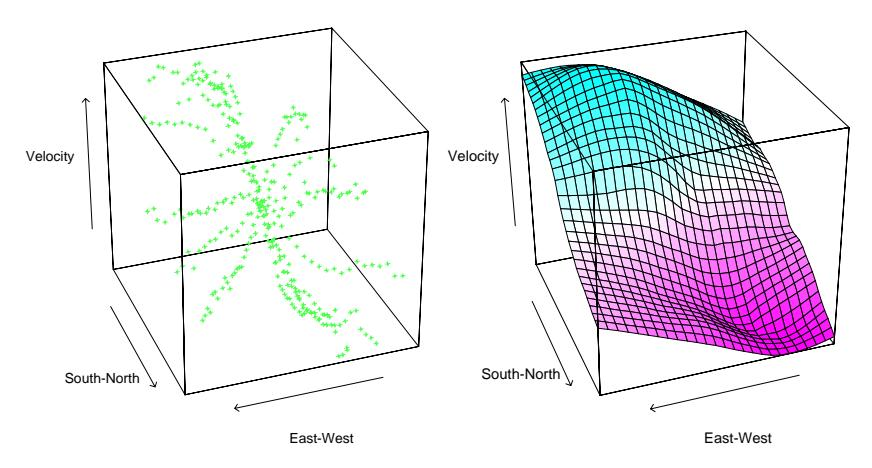

FIGURE 6.8. The left panel shows three-dimensional data, where the response is the velocity measurements on a galaxy, and the two predictors record positions on the celestial sphere. The unusual "star"-shaped design indicates the way the measurements were made, and results in an extremely irregular boundary. The right panel shows the results of local linear regression smoothing in IR$^{2}$ , using a nearest-neighbor window with 15% of the data.

Although the scatter-cloud and wire-frame pictures in Figure 6.8 look attractive, it is quite difficult to interpret the results except at a gross level. From a data analysis perspective, conditional plots are far more useful.

Figure 6.9 shows an analysis of some environmental data with three predictors. The trellis display here shows ozone as a function of radiation, conditioned on the other two variables, temperature and wind speed. However, conditioning on the value of a variable really implies local to that value (as in local regression). Above each of the panels in Figure 6.9 is an indication of the range of values present in that panel for each of the conditioning values. In the panel itself the data subsets are displayed (response versus remaining variable), and a one-dimensional local linear regression is fit to the data. Although this is not quite the same as looking at slices of a fitted three-dimensional surface, it is probably more useful in terms of understanding the joint behavior of the data.

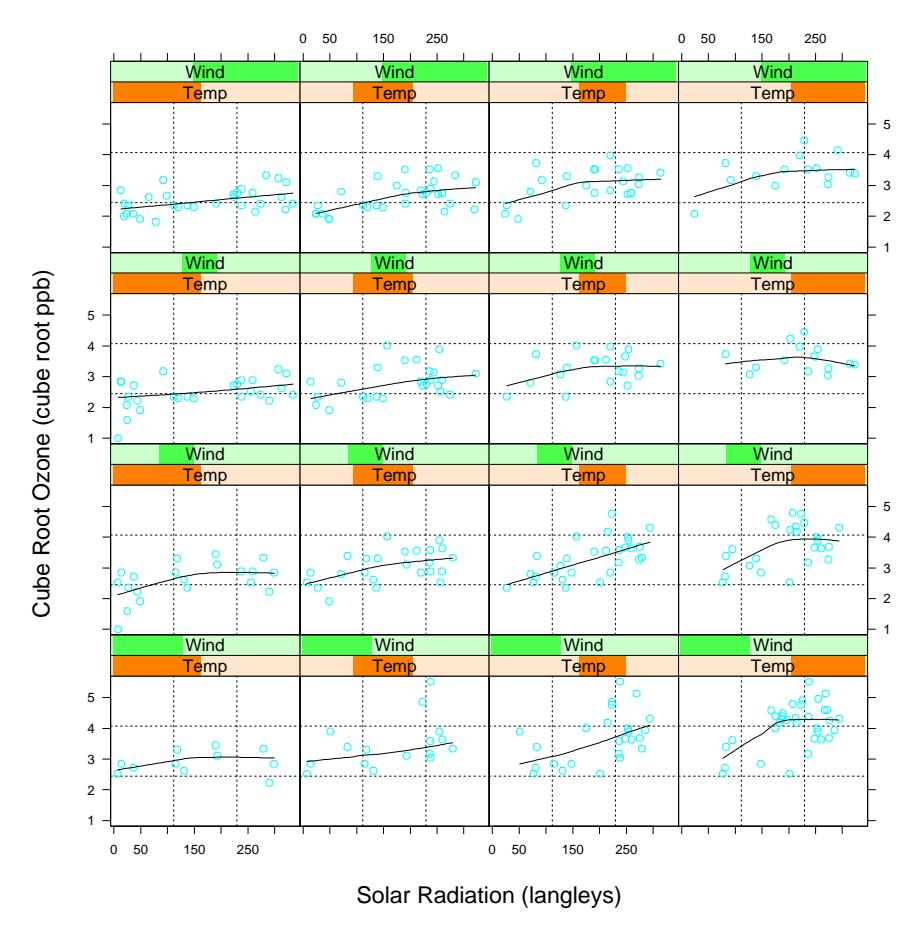

FIGURE 6.9. Three-dimensional smoothing example. The response is (cube-root of ) ozone concentration, and the three predictors are temperature, wind speed and radiation. The trellis display shows ozone as a function of radiation, conditioned on intervals of temperature and wind speed (indicated by darker green or orange shaded bars). Each panel contains about 40% of the range of each of the conditioned variables. The curve in each panel is a univariate local linear regression, fit to the data in the panel.

# 6.4 Structured Local Regression Models in IR$^{p}$

When the dimension to sample-size ratio is unfavorable, local regression does not help us much, unless we are willing to make some structural assumptions about the model. Much of this book is about structured regression and classification models. Here we focus on some approaches directly related to kernel methods.

#### 6.4.1 Structured Kernels

One line of approach is to modify the kernel. The default spherical kernel (6.13) gives equal weight to each coordinate, and so a natural default strategy is to standardize each variable to unit standard deviation. A more general approach is to use a positive semidefinite matrix  $\mathbf A$  to weigh the different coordinates:

$$K_{\lambda,A}(x_0,x) = D\left(\frac{(x-x_0)^T \mathbf{A}(x-x_0)}{\lambda}\right). \tag{6.14}$$

Entire coordinates or directions can be downgraded or omitted by imposing appropriate restrictions on  $\mathbf{A}$ . For example, if  $\mathbf{A}$  is diagonal, then we can increase or decrease the influence of individual predictors  $X_j$  by increasing or decreasing  $A_{jj}$ . Often the predictors are many and highly correlated, such as those arising from digitized analog signals or images. The covariance function of the predictors can be used to tailor a metric  $\mathbf{A}$  that focuses less, say, on high-frequency contrasts (Exercise 6.4). Proposals have been made for learning the parameters for multidimensional kernels. For example, the projection-pursuit regression model discussed in Chapter 11 is of this flavor, where low-rank versions of  $\mathbf{A}$  imply ridge functions for  $\hat{f}(X)$ . More general models for  $\mathbf{A}$  are cumbersome, and we favor instead the structured forms for the regression function discussed next.

#### 6.4.2 Structured Regression Functions

We are trying to fit a regression function  $E(Y|X) = f(X_1, X_2, ..., X_p)$  in  $\mathbb{R}^p$ , in which every level of interaction is potentially present. It is natural to consider analysis-of-variance (ANOVA) decompositions of the form

$$f(X_1, X_2, \dots, X_p) = \alpha + \sum_j g_j(X_j) + \sum_{k < \ell} g_{k\ell}(X_k, X_\ell) + \dots$$
 (6.15)

and then introduce structure by eliminating some of the higher-order terms. Additive models assume only main effect terms:  $f(X) = \alpha + \sum_{j=1}^p g_j(X_j)$ ; second-order models will have terms with interactions of order at most two, and so on. In Chapter 9, we describe iterative backfitting algorithms for fitting such low-order interaction models. In the additive model, for example, if all but the kth term is assumed known, then we can estimate  $g_k$  by local regression of  $Y - \sum_{j \neq k} g_j(X_j)$  on  $X_k$ . This is done for each function in turn, repeatedly, until convergence. The important detail is that at any stage, one-dimensional local regression is all that is needed. The same ideas can be used to fit low-dimensional ANOVA decompositions.

An important special case of these structured models are the class of varying coefficient models. Suppose, for example, that we divide the p predictors in X into a set  $(X_1, X_2, \ldots, X_q)$  with q < p, and the remainder of

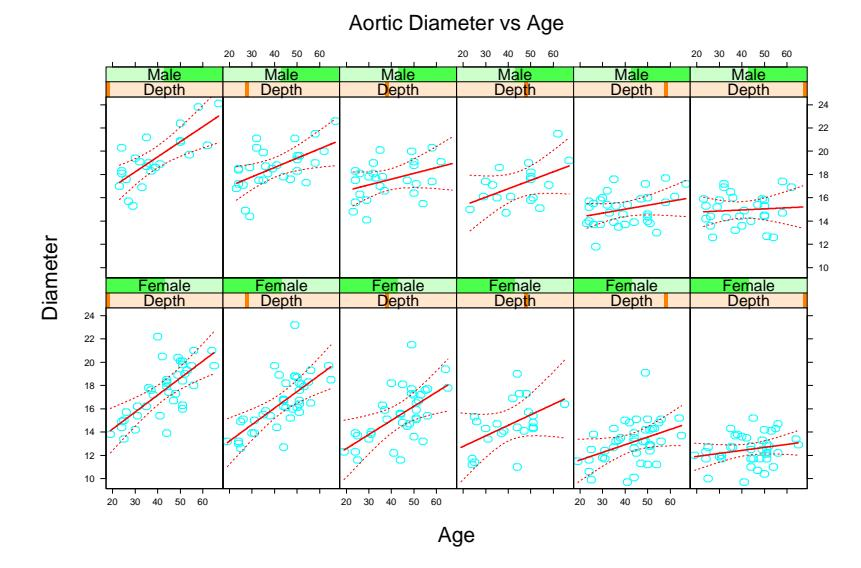

FIGURE 6.10. In each panel the aorta diameter is modeled as a linear function of age. The coefficients of this model vary with gender and depth down the aorta (left is near the top, right is low down). There is a clear trend in the coefficients of the linear model.

the variables we collect in the vector Z. We then assume the conditionally linear model

$$f(X) = \alpha(Z) + \beta_1(Z)X_1 + \dots + \beta_q(Z)X_q.$$
 (6.16)

For given Z, this is a linear model, but each of the coefficients can vary with Z. It is natural to fit such a model by locally weighted least squares:

$$\min_{\alpha(z_0),\beta(z_0)} \sum_{i=1}^{N} K_{\lambda}(z_0, z_i) \left( y_i - \alpha(z_0) - x_{1i}\beta_1(z_0) - \dots - x_{qi}\beta_q(z_0) \right)^2.$$
(6.17)

Figure 6.10 illustrates the idea on measurements of the human aorta. A longstanding claim has been that the aorta thickens with age. Here we model the diameter of the aorta as a linear function of age, but allow the coefficients to vary with gender and depth down the aorta. We used a local regression model separately for males and females. While the aorta clearly does thicken with age at the higher regions of the aorta, the relationship fades with distance down the aorta. Figure 6.11 shows the intercept and slope as a function of depth.

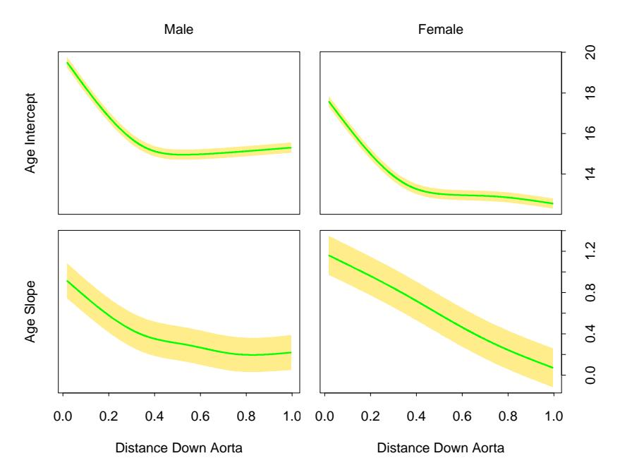

FIGURE 6.11. The intercept and slope of age as a function of distance down the aorta, separately for males and females. The yellow bands indicate one standard error.

#### 6.5 Local Likelihood and Other Models

The concept of local regression and varying coefficient models is extremely broad: any parametric model can be made local if the fitting method accommodates observation weights. Here are some examples:

• Associated with each observation  $y_i$  is a parameter  $\theta_i = \theta(x_i) = x_i^T \beta$  linear in the covariate(s)  $x_i$ , and inference for  $\beta$  is based on the log-likelihood  $l(\beta) = \sum_{i=1}^N l(y_i, x_i^T \beta)$ . We can model  $\theta(X)$  more flexibly by using the likelihood local to  $x_0$  for inference of  $\theta(x_0) = x_0^T \beta(x_0)$ :

$$l(\beta(x_0)) = \sum_{i=1}^{N} K_{\lambda}(x_0, x_i) l(y_i, x_i^T \beta(x_0)).$$

Many likelihood models, in particular the family of generalized linear models including logistic and log-linear models, involve the covariates in a linear fashion. Local likelihood allows a relaxation from a globally linear model to one that is locally linear.

• As above, except different variables are associated with  $\theta$  from those used for defining the local likelihood:

$$l(\theta(z_0)) = \sum_{i=1}^{N} K_{\lambda}(z_0, z_i) l(y_i, \eta(x_i, \theta(z_0))).$$

For example,  $\eta(x,\theta) = x^T \theta$  could be a linear model in x. This will fit a varying coefficient model  $\theta(z)$  by maximizing the local likelihood.

• Autoregressive time series models of order k have the form  $y_t = \beta_0 + \beta_1 y_{t-1} + \beta_2 y_{t-2} + \cdots + \beta_k y_{t-k} + \varepsilon_t$ . Denoting the lag set by  $z_t = (y_{t-1}, y_{t-2}, \dots, y_{t-k})$ , the model looks like a standard linear model  $y_t = z_t^T \beta + \varepsilon_t$ , and is typically fit by least squares. Fitting by local least squares with a kernel  $K(z_0, z_t)$  allows the model to vary according to the short-term history of the series. This is to be distinguished from the more traditional dynamic linear models that vary by windowing time.

As an illustration of local likelihood, we consider the local version of the multiclass linear logistic regression model (4.36) of Chapter 4. The data consist of features  $x_i$  and an associated categorical response  $g_i \in \{1, 2, ..., J\}$ , and the linear model has the form

$$\Pr(G = j | X = x) = \frac{e^{\beta_{j0} + \beta_j^T x}}{1 + \sum_{k=1}^{J-1} e^{\beta_{k0} + \beta_k^T x}}.$$
 (6.18)

The local log-likelihood for this J class model can be written

$$\sum_{i=1}^{N} K_{\lambda}(x_0, x_i) \left\{ \beta_{g_i 0}(x_0) + \beta_{g_i}(x_0)^T (x_i - x_0) - \log \left[ 1 + \sum_{k=1}^{J-1} \exp \left( \beta_{k 0}(x_0) + \beta_k (x_0)^T (x_i - x_0) \right) \right] \right\}.$$
(6.19)

Notice that

- we have used  $g_i$  as a subscript in the first line to pick out the appropriate numerator;
- $\beta_{J0} = 0$  and  $\beta_J = 0$  by the definition of the model;
- we have centered the local regressions at  $x_0$ , so that the fitted posterior probabilities at  $x_0$  are simply

$$\hat{\Pr}(G = j | X = x_0) = \frac{e^{\hat{\beta}_{j0}(x_0)}}{1 + \sum_{k=1}^{J-1} e^{\hat{\beta}_{k0}(x_0)}}.$$
 (6.20)

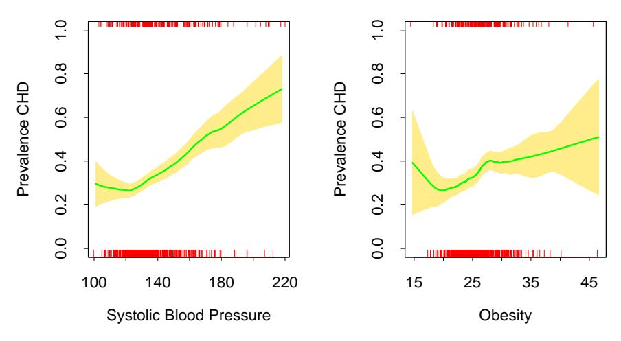

FIGURE 6.12. Each plot shows the binary response CHD (coronary heart disease) as a function of a risk factor for the South African heart disease data. For each plot we have computed the fitted prevalence of CHD using a local linear logistic regression model. The unexpected increase in the prevalence of CHD at the lower ends of the ranges is because these are retrospective data, and some of the subjects had already undergone treatment to reduce their blood pressure and weight. The shaded region in the plot indicates an estimated pointwise standard error band.

This model can be used for flexible multiclass classification in moderately low dimensions, although successes have been reported with the highdimensional ZIP-code classification problem. Generalized additive models (Chapter 9) using kernel smoothing methods are closely related, and avoid dimensionality problems by assuming an additive structure for the regression function.

As a simple illustration we fit a two-class local linear logistic model to the heart disease data of Chapter 4. Figure 6.12 shows the univariate local logistic models fit to two of the risk factors (separately). This is a useful screening device for detecting nonlinearities, when the data themselves have little visual information to offer. In this case an unexpected anomaly is uncovered in the data, which may have gone unnoticed with traditional methods.

Since CHD is a binary indicator, we could estimate the conditional prevalence Pr(G = j|x0) by simply smoothing this binary response directly without resorting to a likelihood formulation. This amounts to fitting a locally constant logistic regression model (Exercise 6.5). In order to enjoy the biascorrection of local-linear smoothing, it is more natural to operate on the unrestricted logit scale.

Typically with logistic regression, we compute parameter estimates as well as their standard errors. This can be done locally as well, and so

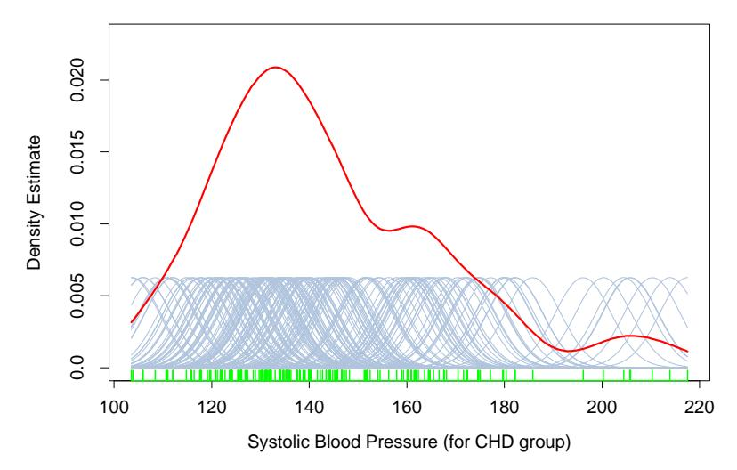

FIGURE 6.13. A kernel density estimate for systolic blood pressure (for the CHD group). The density estimate at each point is the average contribution from each of the kernels at that point. We have scaled the kernels down by a factor of 10 to make the graph readable.

we can produce, as shown in the plot, estimated pointwise standard-error bands about our fitted prevalence.

# 6.6 Kernel Density Estimation and Classification

Kernel density estimation is an unsupervised learning procedure, which historically precedes kernel regression. It also leads naturally to a simple family of procedures for nonparametric classification.

# 6.6.1 Kernel Density Estimation

Suppose we have a random sample x1, . . . , x$^{N}$ drawn from a probability density fX(x), and we wish to estimate f$^{X}$ at a point x0. For simplicity we assume for now that X $\in$ IR. Arguing as before, a natural local estimate has the form

$$\hat{f}_X(x_0) = \frac{\#x_i \in \mathcal{N}(x_0)}{N\lambda},\tag{6.21}$$

where N (x0) is a small metric neighborhood around x$^{0}$ of width $\lambda$. This estimate is bumpy, and the smooth Parzen estimate is preferred

$$\hat{f}_X(x_0) = \frac{1}{N\lambda} \sum_{i=1}^{N} K_{\lambda}(x_0, x_i),$$
 (6.22)

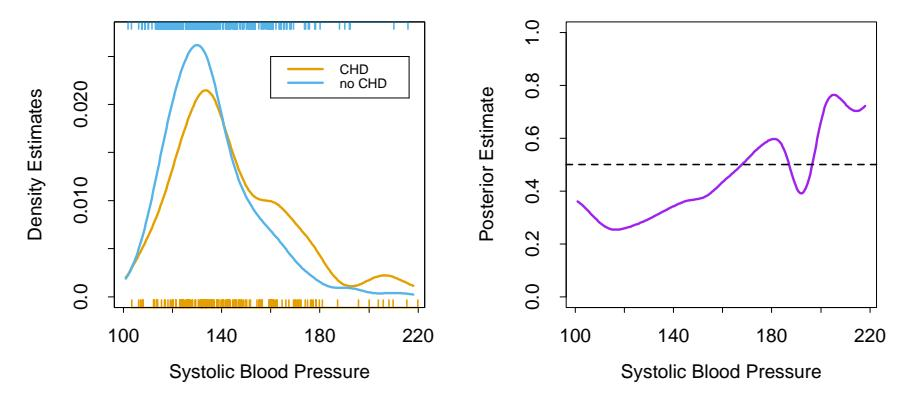

**FIGURE 6.14.** The left panel shows the two separate density estimates for systolic blood pressure in the CHD versus no-CHD groups, using a Gaussian kernel density estimate in each. The right panel shows the estimated posterior probabilities for CHD, using (6.25).

because it counts observations close to  $x_0$  with weights that decrease with distance from  $x_0$ . In this case a popular choice for  $K_\lambda$  is the Gaussian kernel  $K_\lambda(x_0,x)=\phi(|x-x_0|/\lambda)$ . Figure 6.13 shows a Gaussian kernel density fit to the sample values for systolic blood pressure for the CHD group. Letting  $\phi_\lambda$  denote the Gaussian density with mean zero and standard-deviation  $\lambda$ , then (6.22) has the form

$$\hat{f}_X(x) = \frac{1}{N} \sum_{i=1}^N \phi_{\lambda}(x - x_i)$$

$$= (\hat{F} \star \phi_{\lambda})(x), \qquad (6.23)$$

the convolution of the sample empirical distribution  $\hat{F}$  with  $\phi_{\lambda}$ . The distribution  $\hat{F}(x)$  puts mass 1/N at each of the observed  $x_i$ , and is jumpy; in  $\hat{f}_X(x)$  we have smoothed  $\hat{F}$  by adding independent Gaussian noise to each observation  $x_i$ .

The Parzen density estimate is the equivalent of the local average, and improvements have been proposed along the lines of local regression [on the log scale for densities; see Loader (1999)]. We will not pursue these here. In  $\mathbb{R}^p$  the natural generalization of the Gaussian density estimate amounts to using the Gaussian product kernel in (6.23),

$$\hat{f}_X(x_0) = \frac{1}{N(2\lambda^2\pi)^{\frac{p}{2}}} \sum_{i=1}^{N} e^{-\frac{1}{2}(||x_i - x_0||/\lambda)^2}.$$
 (6.24)

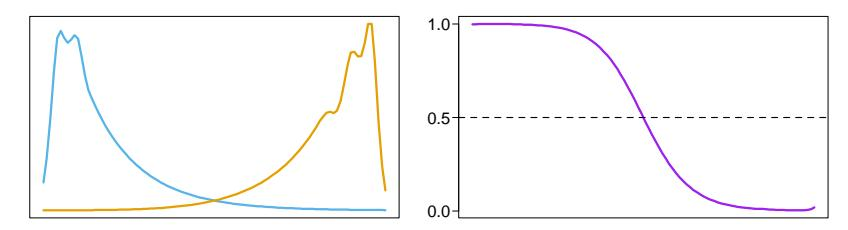

**FIGURE 6.15.** The population class densities may have interesting structure (left) that disappears when the posterior probabilities are formed (right).

#### 6.6.2 Kernel Density Classification

One can use nonparametric density estimates for classification in a straightforward fashion using Bayes' theorem. Suppose for a J class problem we fit nonparametric density estimates  $\hat{f}_j(X)$ ,  $j=1,\ldots,J$  separately in each of the classes, and we also have estimates of the class priors  $\hat{\pi}_j$  (usually the sample proportions). Then

$$\hat{\Pr}(G = j | X = x_0) = \frac{\hat{\pi}_j \hat{f}_j(x_0)}{\sum_{k=1}^J \hat{\pi}_k \hat{f}_k(x_0)}.$$
 (6.25)

Figure 6.14 uses this method to estimate the prevalence of CHD for the heart risk factor study, and should be compared with the left panel of Figure 6.12. The main difference occurs in the region of high SBP in the right panel of Figure 6.14. In this region the data are sparse for both classes, and since the Gaussian kernel density estimates use metric kernels, the density estimates are low and of poor quality (high variance) in these regions. The local logistic regression method (6.20) uses the tri-cube kernel with k-NN bandwidth; this effectively widens the kernel in this region, and makes use of the local linear assumption to smooth out the estimate (on the logit scale).

If classification is the ultimate goal, then learning the separate class densities well may be unnecessary, and can in fact be misleading. Figure 6.15 shows an example where the densities are both multimodal, but the posterior ratio is quite smooth. In learning the separate densities from data, one might decide to settle for a rougher, high-variance fit to capture these features, which are irrelevant for the purposes of estimating the posterior probabilities. In fact, if classification is the ultimate goal, then we need only to estimate the posterior well near the decision boundary (for two classes, this is the set  $\{x|\Pr(G=1|X=x)=\frac{1}{2}\}$ ).

#### 6.6.3 The Naive Bayes Classifier

This is a technique that has remained popular over the years, despite its name (also known as "Idiot's Bayes"!) It is especially appropriate when

the dimension p of the feature space is high, making density estimation unattractive. The naive Bayes model assumes that given a class G = j, the features  $X_k$  are independent:

$$f_j(X) = \prod_{k=1}^p f_{jk}(X_k). \tag{6.26}$$

While this assumption is generally not true, it does simplify the estimation dramatically:

- The individual class-conditional marginal densities  $f_{jk}$  can each be estimated separately using one-dimensional kernel density estimates. This is in fact a generalization of the original naive Bayes procedures, which used univariate Gaussians to represent these marginals.
- If a component  $X_j$  of X is discrete, then an appropriate histogram estimate can be used. This provides a seamless way of mixing variable types in a feature vector.

Despite these rather optimistic assumptions, naive Bayes classifiers often outperform far more sophisticated alternatives. The reasons are related to Figure 6.15: although the individual class density estimates may be biased, this bias might not hurt the posterior probabilities as much, especially near the decision regions. In fact, the problem may be able to withstand considerable bias for the savings in variance such a "naive" assumption earns.

Starting from (6.26) we can derive the logit-transform (using class J as the base):

$$\log \frac{\Pr(G = \ell | X)}{\Pr(G = J | X)} = \log \frac{\pi_{\ell} f_{\ell}(X)}{\pi_{J} f_{J}(X)}$$

$$= \log \frac{\pi_{\ell} \prod_{k=1}^{p} f_{\ell k}(X_{k})}{\pi_{J} \prod_{k=1}^{p} f_{J k}(X_{k})}$$

$$= \log \frac{\pi_{\ell}}{\pi_{J}} + \sum_{k=1}^{p} \log \frac{f_{\ell k}(X_{k})}{f_{J k}(X_{k})}$$

$$= \alpha_{\ell} + \sum_{l=1}^{p} g_{\ell k}(X_{k}).$$
(6.27)

This has the form of a *generalized additive model*, which is described in more detail in Chapter 9. The models are fit in quite different ways though; their differences are explored in Exercise 6.9. The relationship between naive Bayes and generalized additive models is analogous to that between linear discriminant analysis and logistic regression (Section 4.4.5).

#### 6.7 Radial Basis Functions and Kernels

In Chapter 5, functions are represented as expansions in basis functions:  $f(x) = \sum_{j=1}^{M} \beta_j h_j(x)$ . The art of flexible modeling using basis expansions consists of picking an appropriate family of basis functions, and then controlling the complexity of the representation by selection, regularization, or both. Some of the families of basis functions have elements that are defined locally; for example, B-splines are defined locally in IR. If more flexibility is desired in a particular region, then that region needs to be represented by more basis functions (which in the case of B-splines translates to more knots). Tensor products of IR-local basis functions deliver basis functions local in  $\mathbb{R}^p$ . Not all basis functions are local—for example, the truncated power bases for splines, or the sigmoidal basis functions  $\sigma(\alpha_0 + \alpha x)$  used in neural-networks (see Chapter 11). The composed function f(x) can nevertheless show local behavior, because of the particular signs and values of the coefficients causing cancellations of global effects. For example, the truncated power basis has an equivalent B-spline basis for the same space of functions; the cancellation is exact in this case.

Kernel methods achieve flexibility by fitting simple models in a region local to the target point  $x_0$ . Localization is achieved via a weighting kernel  $K_{\lambda}$ , and individual observations receive weights  $K_{\lambda}(x_0, x_i)$ .

Radial basis functions combine these ideas, by treating the kernel functions  $K_{\lambda}(\xi, x)$  as basis functions. This leads to the model

$$f(x) = \sum_{j=1}^{M} K_{\lambda_j}(\xi_j, x) \beta_j$$
$$= \sum_{j=1}^{M} D\left(\frac{||x - \xi_j||}{\lambda_j}\right) \beta_j, \tag{6.28}$$

where each basis element is indexed by a location or prototype parameter  $\xi_j$  and a scale parameter  $\lambda_j$ . A popular choice for D is the standard Gaussian density function. There are several approaches to learning the parameters  $\{\lambda_j, \xi_j, \beta_j\}, j = 1, \ldots, M$ . For simplicity we will focus on least squares methods for regression, and use the Gaussian kernel.

• Optimize the sum-of-squares with respect to all the parameters:

$$\min_{\\{\lambda_j, \xi_j, \beta_j\\}_1^M} \sum_{i=1}^N \left( y_i - \beta_0 - \sum_{j=1}^M \beta_j \exp\left\{ -\frac{(x_i - \xi_j)^T (x_i - \xi_j)}{\lambda_j^2} \right\} \right)^2.$$
(6.29)

This model is commonly referred to as an RBF network, an alternative to the sigmoidal neural network discussed in Chapter 11; the  $\xi_j$  and  $\lambda_j$  playing the role of the weights. This criterion is nonconvex

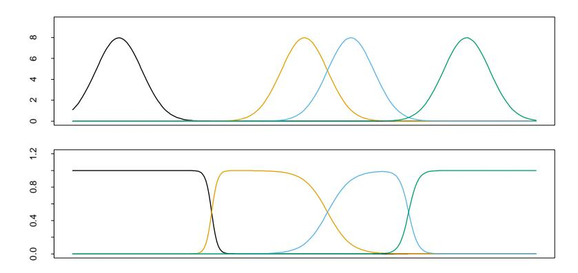

**FIGURE 6.16.** Gaussian radial basis functions in  $\mathbb{R}$  with fixed width can leave holes (top panel). Renormalized Gaussian radial basis functions avoid this problem, and produce basis functions similar in some respects to B-splines.

with multiple local minima, and the algorithms for optimization are similar to those used for neural networks.

• Estimate the  $\{\lambda_j, \xi_j\}$  separately from the  $\beta_j$ . Given the former, the estimation of the latter is a simple least squares problem. Often the kernel parameters  $\lambda_j$  and  $\xi_j$  are chosen in an unsupervised way using the X distribution alone. One of the methods is to fit a Gaussian mixture density model to the training  $x_i$ , which provides both the centers  $\xi_j$  and the scales  $\lambda_j$ . Other even more adhoc approaches use clustering methods to locate the prototypes  $\xi_j$ , and treat  $\lambda_j = \lambda$  as a hyper-parameter. The obvious drawback of these approaches is that the conditional distribution  $\Pr(Y|X)$  and in particular E(Y|X) is having no say in where the action is concentrated. On the positive side, they are much simpler to implement.

While it would seem attractive to reduce the parameter set and assume a constant value for  $\lambda_j = \lambda$ , this can have an undesirable side effect of creating *holes*—regions of  $\mathbb{R}^p$  where none of the kernels has appreciable support, as illustrated in Figure 6.16 (upper panel). Renormalized radial basis functions,

$$h_j(x) = \frac{D(||x - \xi_j||/\lambda)}{\sum_{k=1}^{M} D(||x - \xi_k||/\lambda)},$$
(6.30)

avoid this problem (lower panel).

The Nadaraya–Watson kernel regression estimator (6.2) in  $\mathbb{R}^p$  can be viewed as an expansion in renormalized radial basis functions,

$$\hat{f}(x_0) = \sum_{i=1}^{N} y_i \frac{K_{\lambda}(x_0, x_i)}{\sum_{i=1}^{N} K_{\lambda}(x_0, x_i)} 
= \sum_{i=1}^{N} y_i h_i(x_0)$$
(6.31)

with a basis function  $h_i$  located at every observation and coefficients  $y_i$ ; that is,  $\xi_i = x_i$ ,  $\hat{\beta}_i = y_i$ , i = 1, ..., N.

Note the similarity between the expansion (6.31) and the solution (5.50) on page 169 to the regularization problem induced by the kernel K. Radial basis functions form the bridge between the modern "kernel methods" and local fitting technology.

# 6.8 Mixture Models for Density Estimation and Classification

The mixture model is a useful tool for density estimation, and can be viewed as a kind of kernel method. The Gaussian mixture model has the form

$$f(x) = \sum_{m=1}^{M} \alpha_m \phi(x; \mu_m, \Sigma_m)$$
 (6.32)

with mixing proportions  $\alpha_m$ ,  $\sum_m \alpha_m = 1$ , and each Gaussian density has a mean  $\mu_m$  and covariance matrix  $\Sigma_m$ . In general, mixture models can use any component densities in place of the Gaussian in (6.32): the Gaussian mixture model is by far the most popular.

The parameters are usually fit by maximum likelihood, using the EM algorithm as described in Chapter 8. Some special cases arise:

- If the covariance matrices are constrained to be scalar:  $\Sigma_m = \sigma_m \mathbf{I}$ , then (6.32) has the form of a radial basis expansion.
- If in addition  $\sigma_m = \sigma > 0$  is fixed, and  $M \uparrow N$ , then the maximum likelihood estimate for (6.32) approaches the kernel density estimate (6.22) where  $\hat{\alpha}_m = 1/N$  and  $\hat{\mu}_m = x_m$ .

Using Bayes' theorem, separate mixture densities in each class lead to flexible models for Pr(G|X); this is taken up in some detail in Chapter 12.

Figure 6.17 shows an application of mixtures to the heart disease risk-factor study. In the top row are histograms of Age for the no CHD and CHD groups separately, and then combined on the right. Using the combined data, we fit a two-component mixture of the form (6.32) with the (scalars)  $\Sigma_1$  and  $\Sigma_2$  not constrained to be equal. Fitting was done via the EM algorithm (Chapter 8): note that the procedure does not use knowledge of the CHD labels. The resulting estimates were

$$\hat{\mu}_1 = 36.4,$$
  $\hat{\Sigma}_1 = 157.7,$   $\hat{\alpha}_1 = 0.7,$   $\hat{\mu}_2 = 58.0,$   $\hat{\Sigma}_2 = 15.6,$   $\hat{\alpha}_2 = 0.3.$ 

The component densities  $\phi(\hat{\mu}_1, \hat{\Sigma}_1)$  and  $\phi(\hat{\mu}_2, \hat{\Sigma}_2)$  are shown in the lower-left and middle panels. The lower-right panel shows these component densities (orange and blue) along with the estimated mixture density (green).

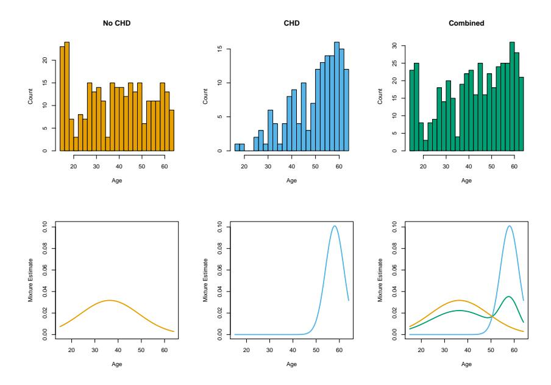

FIGURE 6.17. Application of mixtures to the heart disease risk-factor study. (Top row:) Histograms of Age for the no CHD and CHD groups separately, and combined. (Bottom row:) estimated component densities from a Gaussian mixture model, (bottom left, bottom middle); (bottom right:) Estimated component densities (blue and orange) along with the estimated mixture density (green). The orange density has a very large standard deviation, and approximates a uniform density.

The mixture model also provides an estimate of the probability that observation i belongs to component m,

$$\hat{r}_{im} = \frac{\hat{\alpha}_m \phi(x_i; \hat{\mu}_m, \hat{\Sigma}_m)}{\sum_{k=1}^{M} \hat{\alpha}_k \phi(x_i; \hat{\mu}_k, \hat{\Sigma}_k)},$$
(6.33)

where  $x_i$  is Age in our example. Suppose we threshold each value  $\hat{r}_{i2}$  and hence define  $\hat{\delta}_i = I(\hat{r}_{i2} > 0.5)$ . Then we can compare the classification of each observation by CHD and the mixture model:

$$\begin{array}{c|cccc} & \text{Mixture model} \\ & \hat{\delta} = 0 & \hat{\delta} = 1 \\ \hline \text{CHD} & \text{No} & 232 & 70 \\ & \text{Yes} & 76 & 84 \\ \end{array}$$

Although the mixture model did not use the CHD labels, it has done a fair job in discovering the two CHD subpopulations. Linear logistic regression, using the CHD as a response, achieves the same error rate (32%) when fit to these data using maximum-likelihood (Section 4.4).

# 6.9 Computational Considerations

Kernel and local regression and density estimation are *memory-based* methods: the model is the entire training data set, and the fitting is done at evaluation or prediction time. For many real-time applications, this can make this class of methods infeasible.

The computational cost to fit at a single observation  $x_0$  is O(N) flops, except in oversimplified cases (such as square kernels). By comparison, an expansion in M basis functions costs O(M) for one evaluation, and typically  $M \sim O(\log N)$ . Basis function methods have an initial cost of at least  $O(NM^2 + M^3)$ .

The smoothing parameter(s)  $\lambda$  for kernel methods are typically determined off-line, for example using cross-validation, at a cost of  $O(N^2)$  flops.

Popular implementations of local regression, such as the loess function in S-PLUS and R and the locfit procedure (Loader, 1999), use triangulation schemes to reduce the computations. They compute the fit exactly at M carefully chosen locations (O(NM)), and then use blending techniques to interpolate the fit elsewhere (O(M)) per evaluation).

# Bibliographic Notes

There is a vast literature on kernel methods which we will not attempt to summarize. Rather we will point to a few good references that themselves have extensive bibliographies. Loader (1999) gives excellent coverage of local regression and likelihood, and also describes state-of-the-art software for fitting these models. Fan and Gijbels (1996) cover these models from a more theoretical aspect. Hastie and Tibshirani (1990) discuss local regression in the context of additive modeling. Silverman (1986) gives a good overview of density estimation, as does Scott (1992).

#### Exercises

Ex. 6.1 Show that the Nadaraya–Watson kernel smooth with fixed metric bandwidth  $\lambda$  and a Gaussian kernel is differentiable. What can be said for the Epanechnikov kernel? What can be said for the Epanechnikov kernel with adaptive nearest-neighbor bandwidth  $\lambda(x_0)$ ?

Ex. 6.2 Show that  $\sum_{i=1}^{N} (x_i - x_0) l_i(x_0) = 0$  for local linear regression. Define  $b_j(x_0) = \sum_{i=1}^{N} (x_i - x_0)^j l_i(x_0)$ . Show that  $b_0(x_0) = 1$  for local polynomial regression of any degree (including local constants). Show that  $b_j(x_0) = 0$  for all  $j \in \{1, 2, ..., k\}$  for local polynomial regression of degree k. What are the implications of this on the bias?

- Ex. 6.3 Show that ||l(x)|| (Section 6.1.2) increases with the degree of the local polynomial.
- Ex. 6.4 Suppose that the p predictors X arise from sampling relatively smooth analog curves at p uniformly spaced abscissa values. Denote by  $Cov(X|Y) = \Sigma$  the conditional covariance matrix of the predictors, and assume this does not change much with Y. Discuss the nature of Mahalanobis choice  $\mathbf{A} = \Sigma^{-1}$  for the metric in (6.14). How does this compare with  $\mathbf{A} = \mathbf{I}$ ? How might you construct a kernel  $\mathbf{A}$  that (a) downweights high-frequency components in the distance metric; (b) ignores them completely?
- Ex. 6.5 Show that fitting a locally constant multinomial logit model of the form (6.19) amounts to smoothing the binary response indicators for each class separately using a Nadaraya–Watson kernel smoother with kernel weights  $K_{\lambda}(x_0, x_i)$ .
- Ex. 6.6 Suppose that all you have is software for fitting local regression, but you can specify exactly which monomials are included in the fit. How could you use this software to fit a varying-coefficient model in some of the variables?
- Ex. 6.7 Derive an expression for the leave-one-out cross-validated residual sum-of-squares for local polynomial regression.
- Ex. 6.8 Suppose that for continuous response Y and predictor X, we model the joint density of X,Y using a multivariate Gaussian kernel estimator. Note that the kernel in this case would be the product kernel  $\phi_{\lambda}(X)\phi_{\lambda}(Y)$ . Show that the conditional mean E(Y|X) derived from this estimate is a Nadaraya–Watson estimator. Extend this result to classification by providing a suitable kernel for the estimation of the joint distribution of a continuous X and discrete Y.
- Ex. 6.9 Explore the differences between the naive Bayes model (6.27) and a generalized additive logistic regression model, in terms of (a) model assumptions and (b) estimation. If all the variables  $X_k$  are discrete, what can you say about the corresponding GAM?
- Ex. 6.10 Suppose we have N samples generated from the model  $y_i = f(x_i) + \varepsilon_i$ , with  $\varepsilon_i$  independent and identically distributed with mean zero and variance  $\sigma^2$ , the  $x_i$  assumed fixed (non random). We estimate f using a linear smoother (local regression, smoothing spline, etc.) with smoothing parameter  $\lambda$ . Thus the vector of fitted values is given by  $\hat{\mathbf{f}} = \mathbf{S}_{\lambda} \mathbf{y}$ . Consider the *in-sample* prediction error

$$PE(\lambda) = E \frac{1}{N} \sum_{i=1}^{N} (y_i^* - \hat{f}_{\lambda}(x_i))^2$$
 (6.34)

for predicting new responses at the N input values. Show that the average squared residual on the training data, ASR($\lambda$), is a biased estimate (optimistic) for PE($\lambda$), while

$$C_{\lambda} = ASR(\lambda) + \frac{2\sigma^2}{N} trace(\mathbf{S}_{\lambda})$$
 (6.35)

is unbiased.

Ex. 6.11 Show that for the Gaussian mixture model (6.32) the likelihood is maximized at +$\infty$, and describe how.

Ex. 6.12 Write a computer program to perform a local linear discriminant analysis. At each query point x0, the training data receive weights K$\lambda$(x0, xi) from a weighting kernel, and the ingredients for the linear decision boundaries (see Section 4.3) are computed by weighted averages. Try out your program on the zipcode data, and show the training and test errors for a series of five pre-chosen values of $\lambda$. The zipcode data are available from the book website www-stat.stanford.edu/ElemStatLearn.
