# Model Assessment and Selection

#### 7.1 Introduction

The generalization performance of a learning method relates to its prediction capability on independent test data. Assessment of this performance is extremely important in practice, since it guides the choice of learning method or model, and gives us a measure of the quality of the ultimately chosen model.

In this chapter we describe and illustrate the key methods for performance assessment, and show how they are used to select models. We begin the chapter with a discussion of the interplay between bias, variance and model complexity.

# 7.2 Bias, Variance and Model Complexity

Figure 7.1 illustrates the important issue in assessing the ability of a learning method to generalize. Consider first the case of a quantitative or interval scale response. We have a target variable Y, a vector of inputs X, and a prediction model  $\hat{f}(X)$  that has been estimated from a training set  $\mathcal{T}$ . The loss function for measuring errors between Y and  $\hat{f}(X)$  is denoted by  $L(Y, \hat{f}(X))$ . Typical choices are

$$L(Y, \hat{f}(X)) = \begin{cases} (Y - \hat{f}(X))^2 & \text{squared error} \\ |Y - \hat{f}(X)| & \text{absolute error.} \end{cases}$$
(7.1)

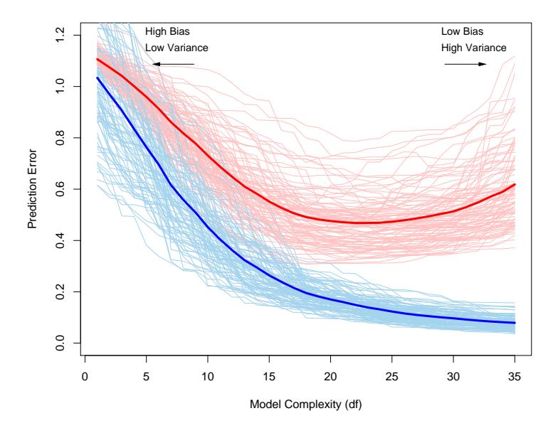

FIGURE 7.1. Behavior of test sample and training sample error as the model complexity is varied. The light blue curves show the training error err, while the light red curves show the conditional test error Err$^{T}$ for 100 training sets of size 50 each, as the model complexity is increased. The solid curves show the expected test error Err and the expected training error E[err].

Test error, also referred to as generalization error, is the prediction error over an independent test sample

$$\operatorname{Err}_{\mathcal{T}} = \operatorname{E}[L(Y, \hat{f}(X))|\mathcal{T}]$$
 (7.2)

where both X and Y are drawn randomly from their joint distribution (population). Here the training set T is fixed, and test error refers to the error for this specific training set. A related quantity is the expected prediction error (or expected test error)

$$\operatorname{Err} = \operatorname{E}[L(Y, \hat{f}(X))] = \operatorname{E}[\operatorname{Err}_{\mathcal{T}}]. \tag{7.3}$$

Note that this expectation averages over everything that is random, including the randomness in the training set that produced ˆf.

Figure 7.1 shows the prediction error (light red curves) Err$^{T}$ for 100 simulated training sets each of size 50. The lasso (Section 3.4.2) was used to produce the sequence of fits. The solid red curve is the average, and hence an estimate of Err.

Estimation of Err$^{T}$ will be our goal, although we will see that Err is more amenable to statistical analysis, and most methods effectively estimate the expected error. It does not seem possible to estimate conditional error effectively, given only the information in the same training set. Some discussion of this point is given in Section 7.12.

Training error is the average loss over the training sample

$$\overline{\text{err}} = \frac{1}{N} \sum_{i=1}^{N} L(y_i, \hat{f}(x_i)).$$
 (7.4)

We would like to know the expected test error of our estimated model  $\hat{f}$ . As the model becomes more and more complex, it uses the training data more and is able to adapt to more complicated underlying structures. Hence there is a decrease in bias but an increase in variance. There is some intermediate model complexity that gives minimum expected test error.

Unfortunately training error is not a good estimate of the test error, as seen in Figure 7.1. Training error consistently decreases with model complexity, typically dropping to zero if we increase the model complexity enough. However, a model with zero training error is overfit to the training data and will typically generalize poorly.

The story is similar for a qualitative or categorical response G taking one of K values in a set  $\mathcal{G}$ , labeled for convenience as  $1, 2, \ldots, K$ . Typically we model the probabilities  $p_k(X) = \Pr(G = k|X)$  (or some monotone transformations  $f_k(X)$ ), and then  $\hat{G}(X) = \arg \max_k \hat{p}_k(X)$ . In some cases, such as 1-nearest neighbor classification (Chapters 2 and 13) we produce  $\hat{G}(X)$  directly. Typical loss functions are

$$L(G, \hat{G}(X)) = I(G \neq \hat{G}(X)) \quad (0-1 \text{ loss}),$$

$$L(G, \hat{p}(X)) = -2 \sum_{k=1}^{K} I(G = k) \log \hat{p}_{k}(X)$$

$$= -2 \log \hat{p}_{G}(X) \quad (-2 \times \text{log-likelihood}).$$
 (7.6)

The quantity  $-2 \times$  the log-likelihood is sometimes referred to as the deviance.

Again, test error here is  $\operatorname{Err}_{\mathcal{T}} = \operatorname{E}[L(G, G(X))|\mathcal{T}]$ , the population misclassification error of the classifier trained on  $\mathcal{T}$ , and Err is the expected misclassification error.

Training error is the sample analogue, for example,

$$\overline{\operatorname{err}} = -\frac{2}{N} \sum_{i=1}^{N} \log \hat{p}_{g_i}(x_i), \tag{7.7}$$

the sample log-likelihood for the model.

The log-likelihood can be used as a loss-function for general response densities, such as the Poisson, gamma, exponential, log-normal and others. If  $\Pr_{\theta(X)}(Y)$  is the density of Y, indexed by a parameter  $\theta(X)$  that depends on the predictor X, then

$$L(Y, \theta(X)) = -2 \cdot \log \Pr_{\theta(X)}(Y). \tag{7.8}$$

The "−2" in the definition makes the log-likelihood loss for the Gaussian distribution match squared-error loss.

For ease of exposition, for the remainder of this chapter we will use Y and f(X) to represent all of the above situations, since we focus mainly on the quantitative response (squared-error loss) setting. For the other situations, the appropriate translations are obvious.

In this chapter we describe a number of methods for estimating the expected test error for a model. Typically our model will have a tuning parameter or parameters $\alpha$ and so we can write our predictions as ˆf$\alpha$(x). The tuning parameter varies the complexity of our model, and we wish to find the value of $\alpha$ that minimizes error, that is, produces the minimum of the average test error curve in Figure 7.1. Having said this, for brevity we will often suppress the dependence of ˆf(x) on $\alpha$.

It is important to note that there are in fact two separate goals that we might have in mind:

Model selection: estimating the performance of different models in order to choose the best one.

Model assessment: having chosen a final model, estimating its prediction error (generalization error) on new data.

If we are in a data-rich situation, the best approach for both problems is to randomly divide the dataset into three parts: a training set, a validation set, and a test set. The training set is used to fit the models; the validation set is used to estimate prediction error for model selection; the test set is used for assessment of the generalization error of the final chosen model. Ideally, the test set should be kept in a "vault," and be brought out only at the end of the data analysis. Suppose instead that we use the test-set repeatedly, choosing the model with smallest test-set error. Then the test set error of the final chosen model will underestimate the true test error, sometimes substantially.

It is difficult to give a general rule on how to choose the number of observations in each of the three parts, as this depends on the signal-tonoise ratio in the data and the training sample size. A typical split might be 50% for training, and 25% each for validation and testing:

The methods in this chapter are designed for situations where there is insufficient data to split it into three parts. Again it is too difficult to give a general rule on how much training data is enough; among other things, this depends on the signal-to-noise ratio of the underlying function, and the complexity of the models being fit to the data.

The methods of this chapter approximate the validation step either analytically (AIC, BIC, MDL, SRM) or by efficient sample re-use (cross-validation and the bootstrap). Besides their use in model selection, we also examine to what extent each method provides a reliable estimate of test error of the final chosen model.

Before jumping into these topics, we first explore in more detail the nature of test error and the bias—variance tradeoff.

# 7.3 The Bias-Variance Decomposition

As in Chapter 2, if we assume that  $Y = f(X) + \varepsilon$  where  $E(\varepsilon) = 0$  and  $Var(\varepsilon) = \sigma_{\varepsilon}^2$ , we can derive an expression for the expected prediction error of a regression fit  $\hat{f}(X)$  at an input point  $X = x_0$ , using squared-error loss:

$$\operatorname{Err}(x_0) = E[(Y - \hat{f}(x_0))^2 | X = x_0]$$

$$= \sigma_{\varepsilon}^2 + [\operatorname{E}\hat{f}(x_0) - f(x_0)]^2 + E[\hat{f}(x_0) - \operatorname{E}\hat{f}(x_0)]^2$$

$$= \sigma_{\varepsilon}^2 + \operatorname{Bias}^2(\hat{f}(x_0)) + \operatorname{Var}(\hat{f}(x_0))$$

$$= \operatorname{Irreducible} \operatorname{Error} + \operatorname{Bias}^2 + \operatorname{Variance}. \tag{7.9}$$

The first term is the variance of the target around its true mean  $f(x_0)$ , and cannot be avoided no matter how well we estimate  $f(x_0)$ , unless  $\sigma_{\varepsilon}^2 = 0$ . The second term is the squared bias, the amount by which the average of our estimate differs from the true mean; the last term is the variance; the expected squared deviation of  $\hat{f}(x_0)$  around its mean. Typically the more complex we make the model  $\hat{f}$ , the lower the (squared) bias but the higher the variance.

For the k-nearest-neighbor regression fit, these expressions have the simple form

$$\operatorname{Err}(x_0) = E[(Y - \hat{f}_k(x_0))^2 | X = x_0]$$

$$= \sigma_{\varepsilon}^2 + \left[ f(x_0) - \frac{1}{k} \sum_{\ell=1}^k f(x_{(\ell)}) \right]^2 + \frac{\sigma_{\varepsilon}^2}{k}.$$
 (7.10)

Here we assume for simplicity that training inputs  $x_i$  are fixed, and the randomness arises from the  $y_i$ . The number of neighbors k is inversely related to the model complexity. For small k, the estimate  $\hat{f}_k(x)$  can potentially adapt itself better to the underlying f(x). As we increase k, the bias—the squared difference between  $f(x_0)$  and the average of f(x) at the k-nearest neighbors—will typically increase, while the variance decreases.

For a linear model fit  $\hat{f}_p(x) = x^T \hat{\beta}$ , where the parameter vector  $\beta$  with p components is fit by least squares, we have

$$Err(x_0) = E[(Y - \hat{f}_p(x_0))^2 | X = x_0]$$

$$= \sigma_{\varepsilon}^{2} + [f(x_{0}) - \mathrm{E}\hat{f}_{p}(x_{0})]^{2} + ||\mathbf{h}(x_{0})||^{2}\sigma_{\varepsilon}^{2}.$$
 (7.11)

Here  $\mathbf{h}(x_0) = \mathbf{X}(\mathbf{X}^T\mathbf{X})^{-1}x_0$ , the N-vector of linear weights that produce the fit  $\hat{f}_p(x_0) = x_0^T(\mathbf{X}^T\mathbf{X})^{-1}\mathbf{X}^T\mathbf{y}$ , and hence  $\operatorname{Var}[\hat{f}_p(x_0)] = ||\mathbf{h}(x_0)||^2\sigma_{\varepsilon}^2$ . While this variance changes with  $x_0$ , its average (with  $x_0$  taken to be each of the sample values  $x_i$ ) is  $(p/N)\sigma_{\varepsilon}^2$ , and hence

$$\frac{1}{N} \sum_{i=1}^{N} \operatorname{Err}(x_i) = \sigma_{\varepsilon}^2 + \frac{1}{N} \sum_{i=1}^{N} [f(x_i) - \operatorname{E}\hat{f}(x_i)]^2 + \frac{p}{N} \sigma_{\varepsilon}^2, \tag{7.12}$$

the in-sample error. Here model complexity is directly related to the number of parameters p.

The test error  $\operatorname{Err}(x_0)$  for a ridge regression fit  $\hat{f}_{\alpha}(x_0)$  is identical in form to (7.11), except the linear weights in the variance term are different:  $\mathbf{h}(x_0) = \mathbf{X}(\mathbf{X}^T\mathbf{X} + \alpha\mathbf{I})^{-1}x_0$ . The bias term will also be different.

For a linear model family such as ridge regression, we can break down the bias more finely. Let  $\beta_*$  denote the parameters of the best-fitting linear approximation to f:

$$\beta_* = \arg\min_{\beta} E\left(f(X) - X^T \beta\right)^2. \tag{7.13}$$

Here the expectation is taken with respect to the distribution of the input variables X. Then we can write the average squared bias as

$$\mathbf{E}_{x_0} \left[ f(x_0) - \mathbf{E} \hat{f}_{\alpha}(x_0) \right]^2 = \mathbf{E}_{x_0} \left[ f(x_0) - x_0^T \beta_* \right]^2 + \mathbf{E}_{x_0} \left[ x_0^T \beta_* - \mathbf{E} x_0^T \hat{\beta}_{\alpha} \right]^2 \\
= \mathbf{Ave} [\text{Model Bias}]^2 + \mathbf{Ave} [\text{Estimation Bias}]^2 \tag{7.14}$$

The first term on the right-hand side is the average squared *model bias*, the error between the best-fitting linear approximation and the true function. The second term is the average squared *estimation bias*, the error between the average estimate  $E(x_0^T \hat{\beta})$  and the best-fitting linear approximation.

For linear models fit by ordinary least squares, the estimation bias is zero. For restricted fits, such as ridge regression, it is positive, and we trade it off with the benefits of a reduced variance. The model bias can only be reduced by enlarging the class of linear models to a richer collection of models, by including interactions and transformations of the variables in the model.

Figure 7.2 shows the bias–variance tradeoff schematically. In the case of linear models, the model space is the set of all linear predictions from p inputs and the black dot labeled "closest fit" is  $x^T\beta_*$ . The blue-shaded region indicates the error  $\sigma_\varepsilon$  with which we see the truth in the training sample.

Also shown is the variance of the least squares fit, indicated by the large yellow circle centered at the black dot labeled "closest fit in population,"

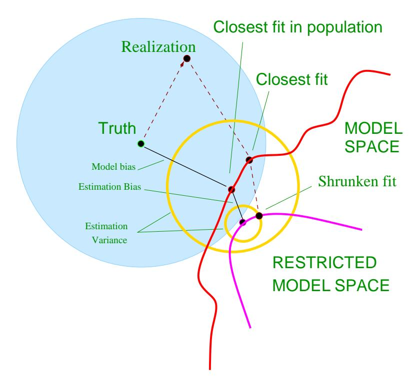
 
FIGURE 7.2. Schematic of the behavior of bias and variance. The model space is the set of all possible predictions from the model, with the "closest fit" labeled with a black dot. The model bias from the truth is shown, along with the variance, indicated by the large yellow circle centered at the black dot labeled "closest fit in population." A shrunken or regularized fit is also shown, having additional estimation bias, but smaller prediction error due to its decreased variance.

Now if we were to fit a model with fewer predictors, or regularize the coefficients by shrinking them toward zero (say), we would get the "shrunken fit" shown in the figure. This fit has an additional estimation bias, due to the fact that it is not the closest fit in the model space. On the other hand, it has smaller variance. If the decrease in variance exceeds the increase in (squared) bias, then this is worthwhile.

#### 7.3.1 Example: Bias-Variance Tradeoff

Figure 7.3 shows the bias-variance tradeoff for two simulated examples. There are 80 observations and 20 predictors, uniformly distributed in the hypercube  $[0,1]^{20}$ . The situations are as follows:

Left panels: Y is 0 if  $X_1 \le 1/2$  and 1 if  $X_1 > 1/2$ , and we apply k-nearest neighbors.

*Right panels:* Y is 1 if  $\sum_{j=1}^{10} X_j$  is greater than 5 and 0 otherwise, and we use best subset linear regression of size p.

The top row is regression with squared error loss; the bottom row is classification with 0–1 loss. The figures show the prediction error (red), squared bias (green) and variance (blue), all computed for a large test sample.

In the regression problems, bias and variance add to produce the prediction error curves, with minima at about k=5 for k-nearest neighbors, and  $p\geq 10$  for the linear model. For classification loss (bottom figures), some interesting phenomena can be seen. The bias and variance curves are the same as in the top figures, and prediction error now refers to misclassification rate. We see that prediction error is no longer the sum of squared bias and variance. For the k-nearest neighbor classifier, prediction error decreases or stays the same as the number of neighbors is increased to 20, despite the fact that the squared bias is rising. For the linear model classifier the minimum occurs for  $p\geq 10$  as in regression, but the improvement over the p=1 model is more dramatic. We see that bias and variance seem to interact in determining prediction error.

Why does this happen? There is a simple explanation for the first phenomenon. Suppose at a given input point, the true probability of class 1 is 0.9 while the expected value of our estimate is 0.6. Then the squared bias— $(0.6-0.9)^2$ —is considerable, but the prediction error is zero since we make the correct decision. In other words, estimation errors that leave us on the right side of the decision boundary don't hurt. Exercise 7.2 demonstrates this phenomenon analytically, and also shows the interaction effect between bias and variance.

The overall point is that the bias-variance tradeoff behaves differently for 0–1 loss than it does for squared error loss. This in turn means that the best choices of tuning parameters may differ substantially in the two

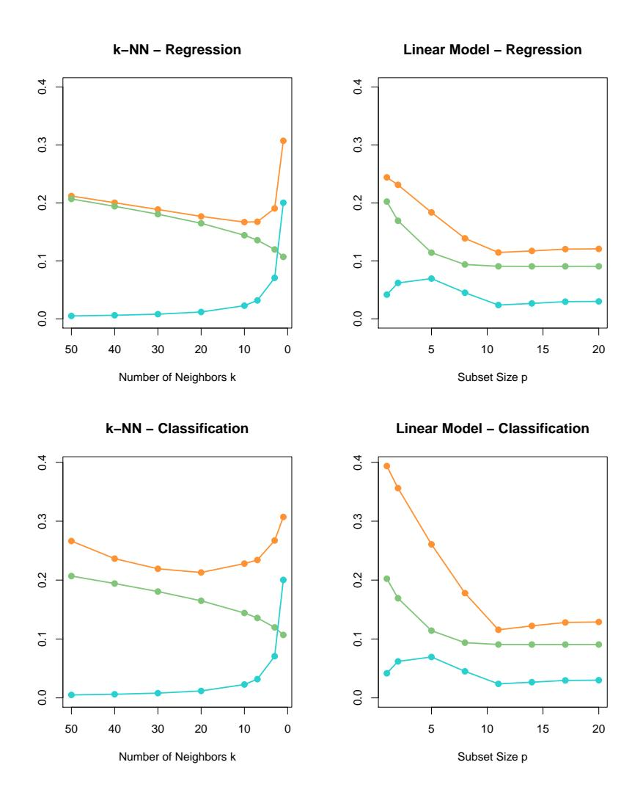
 
FIGURE 7.3. Expected prediction error (orange), squared bias (green) and variance (blue) for a simulated example. The top row is regression with squared error loss; the bottom row is classification with 0–1 loss. The models are k-nearest neighbors (left) and best subset regression of size p (right). The variance and bias curves are the same in regression and classification, but the prediction error curve is different.

settings. One should base the choice of tuning parameter on an estimate of prediction error, as described in the following sections.

# 7.4 Optimism of the Training Error Rate

Discussions of error rate estimation can be confusing, because we have to make clear which quantities are fixed and which are random$^{1}$ . Before we continue, we need a few definitions, elaborating on the material of Section 7.2. Given a training set T = {(x1, y1),(x2, y2), . . .(x$^{N}$ , y$^{N}$ )} the generalization error of a model ˆf is

$$\operatorname{Err}_{\mathcal{T}} = \operatorname{E}_{X^{0}, Y^{0}}[L(Y^{0}, \hat{f}(X^{0}))|\mathcal{T}];$$
 (7.15)

Note that the training set $^{T}$ is fixed in expression (7.15). The point (X$^{0}$ , Y $^{0}$ ) is a new test data point, drawn from F, the joint distribution of the data. Averaging over training sets T yields the expected error

$$Err = E_{\mathcal{T}} E_{X^0, Y^0} [L(Y^0, \hat{f}(X^0)) | \mathcal{T}], \tag{7.16}$$

which is more amenable to statistical analysis. As mentioned earlier, it turns out that most methods effectively estimate the expected error rather than E$^{T}$ ; see Section 7.12 for more on this point.

Now typically, the training error

$$\overline{\text{err}} = \frac{1}{N} \sum_{i=1}^{N} L(y_i, \hat{f}(x_i))$$
 (7.17)

will be less than the true error Err$^{T}$ , because the same data is being used to fit the method and assess its error (see Exercise 2.9). A fitting method typically adapts to the training data, and hence the apparent or training error err will be an overly optimistic estimate of the generalization error Err$^{T}$ .

Part of the discrepancy is due to where the evaluation points occur. The quantity Err$^{T}$ can be thought of as extra-sample error, since the test input vectors don't need to coincide with the training input vectors. The nature of the optimism in err is easiest to understand when we focus instead on the in-sample error

$$\operatorname{Err}_{\text{in}} = \frac{1}{N} \sum_{i=1}^{N} \operatorname{E}_{Y^{0}} [L(Y_{i}^{0}, \hat{f}(x_{i})) | \mathcal{T}]$$
 (7.18)

The Y $^{0}$ notation indicates that we observe N new response values at each of the training points x$^{i}$ , i = 1, 2, . . . , N. We define the optimism as

$^{1}$ Indeed, in the first edition of our book, this section wasn't sufficiently clear.

the difference between Errin and the training error err:

$$op \equiv Err_{in} - \overline{err}. \tag{7.19}$$

This is typically positive since  $\overline{\text{err}}$  is usually biased downward as an estimate of prediction error. Finally, the average optimism is the expectation of the optimism over training sets

$$\omega \equiv \mathbf{E}_{\mathbf{v}}(\mathrm{op}). \tag{7.20}$$

Here the predictors in the training set are fixed, and the expectation is over the training set outcome values; hence we have used the notation  $E_{\mathbf{y}}$  instead of  $E_{\mathcal{T}}$ . We can usually estimate only the expected error  $\omega$  rather than op, in the same way that we can estimate the expected error Err rather than the conditional error  $\operatorname{Err}_{\mathcal{T}}$ .

For squared error, 0–1, and other loss functions, one can show quite generally that

$$\omega = \frac{2}{N} \sum_{i=1}^{N} \operatorname{Cov}(\hat{y}_i, y_i), \tag{7.21}$$

where Cov indicates covariance. Thus the amount by which  $\overline{\text{err}}$  underestimates the true error depends on how strongly  $y_i$  affects its own prediction. The harder we fit the data, the greater  $\text{Cov}(\hat{y}_i, y_i)$  will be, thereby increasing the optimism. Exercise 7.4 proves this result for squared error loss where  $\hat{y}_i$  is the fitted value from the regression. For 0–1 loss,  $\hat{y}_i \in \{0,1\}$  is the classification at  $x_i$ , and for entropy loss,  $\hat{y}_i \in [0,1]$  is the fitted probability of class 1 at  $x_i$ .

In summary, we have the important relation

$$E_{\mathbf{y}}(Err_{in}) = E_{\mathbf{y}}(\overline{err}) + \frac{2}{N} \sum_{i=1}^{N} Cov(\hat{y}_i, y_i).$$
 (7.22)

This expression simplifies if  $\hat{y}_i$  is obtained by a linear fit with d inputs or basis functions. For example,

$$\sum_{i=1}^{N} \operatorname{Cov}(\hat{y}_i, y_i) = d\sigma_{\varepsilon}^2$$
(7.23)

for the additive error model  $Y = f(X) + \varepsilon$ , and so

$$E_{\mathbf{y}}(Err_{in}) = E_{\mathbf{y}}(\overline{err}) + 2 \cdot \frac{d}{N}\sigma_{\varepsilon}^{2}.$$
 (7.24)

Expression (7.23) is the basis for the definition of the *effective number of* parameters discussed in Section 7.6 The optimism increases linearly with

the number d of inputs or basis functions we use, but decreases as the training sample size increases. Versions of (7.24) hold approximately for other error models, such as binary data and entropy loss.

An obvious way to estimate prediction error is to estimate the optimism and then add it to the training error err. The methods described in the next section—Cp, AIC, BIC and others—work in this way, for a special class of estimates that are linear in their parameters.

In contrast, cross-validation and bootstrap methods, described later in the chapter, are direct estimates of the extra-sample error Err. These general tools can be used with any loss function, and with nonlinear, adaptive fitting techniques.

In-sample error is not usually of direct interest since future values of the features are not likely to coincide with their training set values. But for comparison between models, in-sample error is convenient and often leads to effective model selection. The reason is that the relative (rather than absolute) size of the error is what matters.

# 7.5 Estimates of In-Sample Prediction Error

The general form of the in-sample estimates is

$$\widehat{\operatorname{Err}}_{\mathrm{in}} = \overline{\operatorname{err}} + \hat{\omega}, \tag{7.25}$$

where ˆ$\omega$ is an estimate of the average optimism.

Using expression (7.24), applicable when d parameters are fit under squared error loss, leads to a version of the so-called C$^{p}$ statistic,

$$C_p = \overline{\text{err}} + 2 \cdot \frac{d}{N} \hat{\sigma_{\varepsilon}}^2. \tag{7.26}$$

Here ˆ$\sigma$$^{\epsilon}$ 2 is an estimate of the noise variance, obtained from the meansquared error of a low-bias model. Using this criterion we adjust the training error by a factor proportional to the number of basis functions used.

The Akaike information criterion is a similar but more generally applicable estimate of Errin when a log-likelihood loss function is used. It relies on a relationship similar to (7.24) that holds asymptotically as N $\to$ $\infty$:

$$-2 \cdot \mathrm{E}[\log \mathrm{Pr}_{\hat{\theta}}(Y)] \approx -\frac{2}{N} \cdot \mathrm{E}[\mathrm{loglik}] + 2 \cdot \frac{d}{N}. \tag{7.27}$$

Here Pr$\theta$(Y ) is a family of densities for Y (containing the "true" density), ˆ$\theta$ is the maximum-likelihood estimate of $\theta$, and "loglik" is the maximized log-likelihood:

$$loglik = \sum_{i=1}^{N} log \Pr_{\hat{\theta}}(y_i). \tag{7.28}$$

For example, for the logistic regression model, using the binomial loglikelihood, we have

$$AIC = -\frac{2}{N} \cdot loglik + 2 \cdot \frac{d}{N}. \tag{7.29}$$

For the Gaussian model (with variance  $\sigma_{\varepsilon}^2 = \hat{\sigma_{\varepsilon}}^2$  assumed known), the AIC statistic is equivalent to  $C_p$ , and so we refer to them collectively as AIC.

To use AIC for model selection, we simply choose the model giving smallest AIC over the set of models considered. For nonlinear and other complex models, we need to replace d by some measure of model complexity. We discuss this in Section 7.6.

Given a set of models  $f_{\alpha}(x)$  indexed by a tuning parameter  $\alpha$ , denote by  $\overline{\operatorname{err}}(\alpha)$  and  $d(\alpha)$  the training error and number of parameters for each model. Then for this set of models we define

$$AIC(\alpha) = \overline{err}(\alpha) + 2 \cdot \frac{d(\alpha)}{N} \hat{\sigma_{\varepsilon}}^{2}. \tag{7.30}$$

The function  $AIC(\alpha)$  provides an estimate of the test error curve, and we find the tuning parameter  $\hat{\alpha}$  that minimizes it. Our final chosen model is  $f_{\hat{\alpha}}(x)$ . Note that if the basis functions are chosen adaptively, (7.23) no longer holds. For example, if we have a total of p inputs, and we choose the best-fitting linear model with d < p inputs, the optimism will exceed  $(2d/N)\sigma_{\varepsilon}^2$ . Put another way, by choosing the best-fitting model with d inputs, the effective number of parameters fit is more than d.

Figure 7.4 shows AIC in action for the phoneme recognition example of Section 5.2.3 on page 148. The input vector is the log-periodogram of the spoken vowel, quantized to 256 uniformly spaced frequencies. A linear logistic regression model is used to predict the phoneme class, with coefficient function  $\beta(f) = \sum_{m=1}^{M} h_m(f)\theta_m$ , an expansion in M spline basis functions. For any given M, a basis of natural cubic splines is used for the  $h_m$ , with knots chosen uniformly over the range of frequencies (so  $d(\alpha) = d(M) = M$ ). Using AIC to select the number of basis functions will approximately minimize Err(M) for both entropy and 0–1 loss.

The simple formula

$$(2/N)\sum_{i=1}^{N} \operatorname{Cov}(\hat{y}_i, y_i) = (2d/N)\sigma_{\varepsilon}^2$$

holds exactly for linear models with additive errors and squared error loss, and approximately for linear models and log-likelihoods. In particular, the formula does not hold in general for 0–1 loss (Efron, 1986), although many authors nevertheless use it in that context (right panel of Figure 7.4).

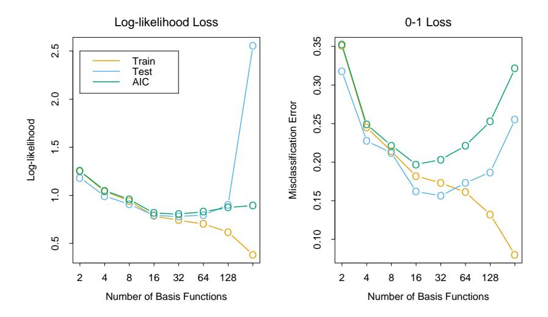
 
**FIGURE 7.4.** AIC used for model selection for the phoneme recognition example of Section 5.2.3. The logistic regression coefficient function  $\beta(f) = \sum_{m=1}^{M} h_m(f)\theta_m$  is modeled as an expansion in M spline basis functions. In the left panel we see the AIC statistic used to estimate  $\text{Err}_{\text{in}}$  using log-likelihood loss. Included is an estimate of Err based on an independent test sample. It does well except for the extremely over-parametrized case (M=256 parameters for N=1000 observations). In the right panel the same is done for 0–1 loss. Although the AIC formula does not strictly apply here, it does a reasonable job in this case.

#### 7.6 The Effective Number of Parameters

The concept of "number of parameters" can be generalized, especially to models where regularization is used in the fitting. Suppose we stack the outcomes  $y_1, y_2, \ldots, y_N$  into a vector  $\mathbf{y}$ , and similarly for the predictions  $\hat{\mathbf{y}}$ . Then a linear fitting method is one for which we can write

$$\hat{\mathbf{y}} = \mathbf{S}\mathbf{y},\tag{7.31}$$

where **S** is an  $N \times N$  matrix depending on the input vectors  $x_i$  but not on the  $y_i$ . Linear fitting methods include linear regression on the original features or on a derived basis set, and smoothing methods that use quadratic shrinkage, such as ridge regression and cubic smoothing splines. Then the effective number of parameters is defined as

$$df(\mathbf{S}) = trace(\mathbf{S}), \tag{7.32}$$

the sum of the diagonal elements of S (also known as the *effective degrees-of-freedom*). Note that if S is an orthogonal-projection matrix onto a basis

set spanned by M features, then  $\operatorname{trace}(\mathbf{S}) = M$ . It turns out that  $\operatorname{trace}(\mathbf{S})$  is exactly the correct quantity to replace d as the number of parameters in the  $C_p$  statistic (7.26). If  $\mathbf{y}$  arises from an additive-error model  $Y = f(X) + \varepsilon$  with  $\operatorname{Var}(\varepsilon) = \sigma_{\varepsilon}^2$ , then one can show that  $\sum_{i=1}^N \operatorname{Cov}(\hat{y}_i, y_i) = \operatorname{trace}(\mathbf{S})\sigma_{\varepsilon}^2$ , which motivates the more general definition

$$df(\hat{\mathbf{y}}) = \frac{\sum_{i=1}^{N} Cov(\hat{y}_i, y_i)}{\sigma_z^2}$$
(7.33)

(Exercises 7.4 and 7.5). Section 5.4.1 on page 153 gives some more intuition for the definition df = trace(S) in the context of smoothing splines.

For models like neural networks, in which we minimize an error function R(w) with weight decay penalty (regularization)  $\alpha \sum_{m} w_{m}^{2}$ , the effective number of parameters has the form

$$df(\alpha) = \sum_{m=1}^{M} \frac{\theta_m}{\theta_m + \alpha},$$
(7.34)

where the  $\theta_m$  are the eigenvalues of the Hessian matrix  $\partial^2 R(w)/\partial w \partial w^T$ . Expression (7.34) follows from (7.32) if we make a quadratic approximation to the error function at the solution (Bishop, 1995).

# 7.7 The Bayesian Approach and BIC

The Bayesian information criterion (BIC), like AIC, is applicable in settings where the fitting is carried out by maximization of a log-likelihood. The generic form of BIC is

$$BIC = -2 \cdot \log lik + (\log N) \cdot d. \tag{7.35}$$

The BIC statistic (times 1/2) is also known as the Schwarz criterion (Schwarz, 1978).

Under the Gaussian model, assuming the variance  $\sigma_{\varepsilon}^2$  is known,  $-2 \cdot \text{loglik}$  equals (up to a constant)  $\sum_i (y_i - \hat{f}(x_i))^2 / \sigma_{\varepsilon}^2$ , which is  $N \cdot \overline{\text{err}} / \sigma_{\varepsilon}^2$  for squared error loss. Hence we can write

$$BIC = \frac{N}{\sigma_{\varepsilon}^{2}} \left[ \overline{err} + (\log N) \cdot \frac{d}{N} \sigma_{\varepsilon}^{2} \right]. \tag{7.36}$$

Therefore BIC is proportional to AIC  $(C_p)$ , with the factor 2 replaced by  $\log N$ . Assuming  $N > e^2 \approx 7.4$ , BIC tends to penalize complex models more heavily, giving preference to simpler models in selection. As with AIC,  $\sigma_{\varepsilon}^2$  is typically estimated by the mean squared error of a low-bias model. For classification problems, use of the multinomial log-likelihood leads to a similar relationship with the AIC, using cross-entropy as the error measure.

Note however that the misclassification error measure does not arise in the BIC context, since it does not correspond to the log-likelihood of the data under any probability model.

Despite its similarity with AIC, BIC is motivated in quite a different way. It arises in the Bayesian approach to model selection, which we now describe.

Suppose we have a set of candidate models  $\mathcal{M}_m$ , m = 1, ..., M and corresponding model parameters  $\theta_m$ , and we wish to choose a best model from among them. Assuming we have a prior distribution  $\Pr(\theta_m|\mathcal{M}_m)$  for the parameters of each model  $\mathcal{M}_m$ , the posterior probability of a given model is

$$\Pr(\mathcal{M}_{m}|\mathbf{Z}) \propto \Pr(\mathcal{M}_{m}) \cdot \Pr(\mathbf{Z}|\mathcal{M}_{m})$$

$$\propto \Pr(\mathcal{M}_{m}) \cdot \int \Pr(\mathbf{Z}|\theta_{m}, \mathcal{M}_{m}) \Pr(\theta_{m}|\mathcal{M}_{m}) d\theta_{m},$$
(7.37)

where **Z** represents the training data  $\{x_i, y_i\}_1^N$ . To compare two models  $\mathcal{M}_m$  and  $\mathcal{M}_\ell$ , we form the posterior odds

$$\frac{\Pr(\mathcal{M}_m|\mathbf{Z})}{\Pr(\mathcal{M}_\ell|\mathbf{Z})} = \frac{\Pr(\mathcal{M}_m)}{\Pr(\mathcal{M}_\ell)} \cdot \frac{\Pr(\mathbf{Z}|\mathcal{M}_m)}{\Pr(\mathbf{Z}|\mathcal{M}_\ell)}.$$
 (7.38)

If the odds are greater than one we choose model m, otherwise we choose model  $\ell$ . The rightmost quantity

$$BF(\mathbf{Z}) = \frac{\Pr(\mathbf{Z}|\mathcal{M}_m)}{\Pr(\mathbf{Z}|\mathcal{M}_{\ell})}$$
(7.39)

is called the *Bayes factor*, the contribution of the data toward the posterior odds.

Typically we assume that the prior over models is uniform, so that  $\Pr(\mathcal{M}_m)$  is constant. We need some way of approximating  $\Pr(\mathbf{Z}|\mathcal{M}_m)$ . A so-called Laplace approximation to the integral followed by some other simplifications (Ripley, 1996, page 64) to (7.37) gives

$$\log \Pr(\mathbf{Z}|\mathcal{M}_m) = \log \Pr(\mathbf{Z}|\hat{\theta}_m, \mathcal{M}_m) - \frac{d_m}{2} \cdot \log N + O(1).$$
 (7.40)

Here  $\hat{\theta}_m$  is a maximum likelihood estimate and  $d_m$  is the number of free parameters in model  $\mathcal{M}_m$ . If we define our loss function to be

$$-2 \log \Pr(\mathbf{Z}|\hat{\theta}_m, \mathcal{M}_m),$$

this is equivalent to the BIC criterion of equation (7.35).

Therefore, choosing the model with minimum BIC is equivalent to choosing the model with largest (approximate) posterior probability. But this framework gives us more. If we compute the BIC criterion for a set of M,

models, giving  $\mathrm{BIC}_m$ ,  $m=1,2,\ldots,M$ , then we can estimate the posterior probability of each model  $\mathcal{M}_m$  as

$$\frac{e^{-\frac{1}{2} \cdot \text{BIC}_m}}{\sum_{\ell=1}^{M} e^{-\frac{1}{2} \cdot \text{BIC}_{\ell}}}.$$
(7.41)

Thus we can estimate not only the best model, but also assess the relative merits of the models considered.

For model selection purposes, there is no clear choice between AIC and BIC. BIC is asymptotically consistent as a selection criterion. What this means is that given a family of models, including the true model, the probability that BIC will select the correct model approaches one as the sample size  $N \to \infty$ . This is not the case for AIC, which tends to choose models which are too complex as  $N \to \infty$ . On the other hand, for finite samples, BIC often chooses models that are too simple, because of its heavy penalty on complexity.

# 7.8 Minimum Description Length

The minimum description length (MDL) approach gives a selection criterion formally identical to the BIC approach, but is motivated from an optimal coding viewpoint. We first review the theory of coding for data compression, and then apply it to model selection.

We think of our datum z as a message that we want to encode and send to someone else (the "receiver"). We think of our model as a way of encoding the datum, and will choose the most parsimonious model, that is the shortest code, for the transmission.

Suppose first that the possible messages we might want to transmit are  $z_1, z_2, \ldots, z_m$ . Our code uses a finite alphabet of length A: for example, we might use a binary code  $\{0,1\}$  of length A=2. Here is an example with four possible messages and a binary coding:

$$\begin{array}{c|ccccccccccccccccccccccccccccccccccc$$

This code is known as an instantaneous prefix code: no code is the prefix of any other, and the receiver (who knows all of the possible codes), knows exactly when the message has been completely sent. We restrict our discussion to such instantaneous prefix codes.

One could use the coding in (7.42) or we could permute the codes, for example use codes 110, 10, 111, 0 for  $z_1, z_2, z_3, z_4$ . How do we decide which to use? It depends on how often we will be sending each of the messages. If, for example, we will be sending  $z_1$  most often, it makes sense to use the shortest code 0 for  $z_1$ . Using this kind of strategy—shorter codes for more frequent messages—the average message length will be shorter.

In general, if messages are sent with probabilities  $\Pr(z_i)$ ,  $i=1,2,\ldots,4$ , a famous theorem due to Shannon says we should use code lengths  $l_i = -\log_2\Pr(z_i)$  and the average message length satisfies

$$E(length) \ge -\sum Pr(z_i) \log_2 (Pr(z_i)). \tag{7.43}$$

The right-hand side above is also called the entropy of the distribution  $Pr(z_i)$ . The inequality is an equality when the probabilities satisfy  $p_i = A^{-l_i}$ . In our example, if  $Pr(z_i) = 1/2, 1/4, 1/8, 1/8$ , respectively, then the coding shown in (7.42) is optimal and achieves the entropy lower bound.

In general the lower bound cannot be achieved, but procedures like the Huffman coding scheme can get close to the bound. Note that with an infinite set of messages, the entropy is replaced by  $-\int \Pr(z) \log_2 \Pr(z) dz$ .

From this result we glean the following:

To transmit a random variable z having probability density function Pr(z), we require about  $-\log_2 Pr(z)$  bits of information.

We henceforth change notation from  $\log_2\Pr(z)$  to  $\log\Pr(z) = \log_e\Pr(z)$ ; this is for convenience, and just introduces an unimportant multiplicative constant.

Now we apply this result to the problem of model selection. We have a model M with parameters  $\theta$ , and data  $\mathbf{Z} = (\mathbf{X}, \mathbf{y})$  consisting of both inputs and outputs. Let the (conditional) probability of the outputs under the model be  $\Pr(\mathbf{y}|\theta, M, \mathbf{X})$ , assume the receiver knows all of the inputs, and we wish to transmit the outputs. Then the message length required to transmit the outputs is

$$length = -\log \Pr(\mathbf{y}|\theta, M, \mathbf{X}) - \log \Pr(\theta|M), \tag{7.44}$$

the log-probability of the target values given the inputs. The second term is the average code length for transmitting the model parameters  $\theta$ , while the first term is the average code length for transmitting the discrepancy between the model and actual target values. For example suppose we have a single target y with  $y \sim N(\theta, \sigma^2)$ , parameter  $\theta \sim N(0, 1)$  and no input (for simplicity). Then the message length is

length = constant + log 
$$\sigma$$
 +  $\frac{(y-\theta)^2}{2\sigma^2}$  +  $\frac{\theta^2}{2}$ . (7.45)

Note that the smaller  $\sigma$  is, the shorter on average is the message length, since y is more concentrated around  $\theta$ .

The MDL principle says that we should choose the model that minimizes (7.44). We recognize (7.44) as the (negative) log-posterior distribution, and hence minimizing description length is equivalent to maximizing posterior probability. Hence the BIC criterion, derived as approximation to log-posterior probability, can also be viewed as a device for (approximate) model choice by minimum description length.

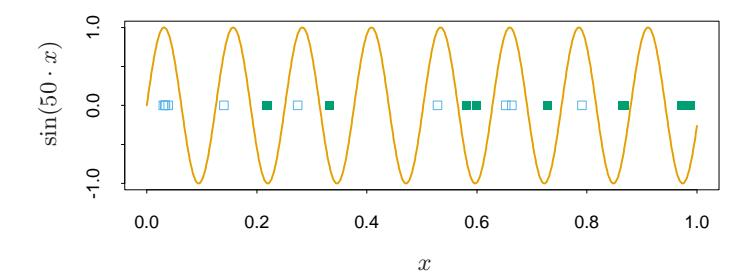
 
**FIGURE 7.5.** The solid curve is the function  $\sin(50x)$  for  $x \in [0,1]$ . The green (solid) and blue (hollow) points illustrate how the associated indicator function  $I(\sin(\alpha x) > 0)$  can shatter (separate) an arbitrarily large number of points by choosing an appropriately high frequency  $\alpha$ .

Note that we have ignored the precision with which a random variable z is coded. With a finite code length we cannot code a continuous variable exactly. However, if we code z within a tolerance  $\delta z$ , the message length needed is the log of the probability in the interval  $[z,z+\delta z]$  which is well approximated by  $\delta z \Pr(z)$  if  $\delta z$  is small. Since  $\log \delta z \Pr(z) = \log \delta z + \log \Pr(z)$ , this means we can just ignore the constant  $\log \delta z$  and use  $\log \Pr(z)$  as our measure of message length, as we did above.

The preceding view of MDL for model selection says that we should choose the model with highest posterior probability. However, many Bayesians would instead do inference by sampling from the posterior distribution.

# 7.9 Vapnik–Chervonenkis Dimension

A difficulty in using estimates of in-sample error is the need to specify the number of parameters (or the complexity) d used in the fit. Although the effective number of parameters introduced in Section 7.6 is useful for some nonlinear models, it is not fully general. The Vapnik–Chervonenkis (VC) theory provides such a general measure of complexity, and gives associated bounds on the optimism. Here we give a brief review of this theory.

Suppose we have a class of functions  $\{f(x,\alpha)\}$  indexed by a parameter vector  $\alpha$ , with  $x \in \mathbb{R}^p$ . Assume for now that f is an indicator function, that is, takes the values 0 or 1. If  $\alpha = (\alpha_0, \alpha_1)$  and f is the linear indicator function  $I(\alpha_0 + \alpha_1^T x > 0)$ , then it seems reasonable to say that the complexity of the class f is the number of parameters p + 1. But what about  $f(x,\alpha) = I(\sin \alpha \cdot x)$  where  $\alpha$  is any real number and  $x \in \mathbb{R}$ ? The function  $\sin(50 \cdot x)$  is shown in Figure 7.5. This is a very wiggly function that gets even rougher as the frequency  $\alpha$  increases, but it has only one parameter: despite this, it doesn't seem reasonable to conclude that it has less complexity than the linear indicator function  $I(\alpha_0 + \alpha_1 x)$  in p = 1 dimension.

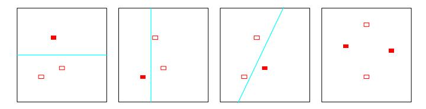
 
**FIGURE 7.6.** The first three panels show that the class of lines in the plane can shatter three points. The last panel shows that this class cannot shatter four points, as no line will put the hollow points on one side and the solid points on the other. Hence the VC dimension of the class of straight lines in the plane is three. Note that a class of nonlinear curves could shatter four points, and hence has VC dimension greater than three.

The Vapnik–Chervonenkis dimension is a way of measuring the complexity of a class of functions by assessing how wiggly its members can be.

The VC dimension of the class  $\{f(x,\alpha)\}$  is defined to be the largest number of points (in some configuration) that can be shattered by members of  $\{f(x,\alpha)\}$ .

A set of points is said to be shattered by a class of functions if, no matter how we assign a binary label to each point, a member of the class can perfectly separate them.

Figure 7.6 shows that the VC dimension of linear indicator functions in the plane is 3 but not 4, since no four points can be shattered by a set of lines. In general, a linear indicator function in p dimensions has VC dimension p+1, which is also the number of free parameters. On the other hand, it can be shown that the family  $\sin(\alpha x)$  has infinite VC dimension, as Figure 7.5 suggests. By appropriate choice of  $\alpha$ , any set of points can be shattered by this class (Exercise 7.8).

So far we have discussed the VC dimension only of indicator functions, but this can be extended to real-valued functions. The VC dimension of a class of real-valued functions  $\{g(x,\alpha)\}$  is defined to be the VC dimension of the indicator class  $\{I(g(x,\alpha)-\beta>0)\}$ , where  $\beta$  takes values over the range of q.

One can use the VC dimension in constructing an estimate of (extrasample) prediction error; different types of results are available. Using the concept of VC dimension, one can prove results about the optimism of the training error when using a class of functions. An example of such a result is the following. If we fit N training points using a class of functions  $\{f(x,\alpha)\}$ having VC dimension h, then with probability at least  $1-\eta$  over training sets:

$$\operatorname{Err}_{\mathcal{T}} \leq \overline{\operatorname{err}} + \frac{\epsilon}{2} \left( 1 + \sqrt{1 + \frac{4 \cdot \overline{\operatorname{err}}}{\epsilon}} \right) \text{ (binary classification)}$$

$$\operatorname{Err}_{\mathcal{T}} \leq \frac{\overline{\operatorname{err}}}{(1 - c\sqrt{\epsilon})_{+}} \text{ (regression)}$$

$$\text{where } \epsilon = a_{1} \frac{h[\log(a_{2}N/h) + 1] - \log(\eta/4)}{N},$$

$$\text{and } 0 < a_{1} \leq 4, \ 0 < a_{2} \leq 2$$

These bounds hold simultaneously for all members f(x, $\alpha$), and are taken from Cherkassky and Mulier (2007, pages 116–118). They recommend the value c = 1. For regression they suggest a$^{1}$ = a$^{2}$ = 1, and for classification they make no recommendation, with a$^{1}$ = 4 and a$^{2}$ = 2 corresponding to worst-case scenarios. They also give an alternative practical bound for regression

$$\operatorname{Err}_{\mathcal{T}} \le \overline{\operatorname{err}} \left( 1 - \sqrt{\rho - \rho \log \rho + \frac{\log N}{2N}} \right)_{+}^{-1}$$
 (7.47)

with $\rho$ = h N , which is free of tuning constants. The bounds suggest that the optimism increases with h and decreases with N in qualitative agreement with the AIC correction d/N given in (7.24). However, the results in (7.46) are stronger: rather than giving the expected optimism for each fixed function f(x, $\alpha$), they give probabilistic upper bounds for all functions f(x, $\alpha$), and hence allow for searching over the class.

Vapnik's structural risk minimization (SRM) approach fits a nested sequence of models of increasing VC dimensions h$^{1}$ < h$^{2}$ < $\cdot$ $\cdot$ $\cdot$ , and then chooses the model with the smallest value of the upper bound.

We note that upper bounds like the ones in (7.46) are often very loose, but that doesn't rule them out as good criteria for model selection, where the relative (not absolute) size of the test error is important. The main drawback of this approach is the difficulty in calculating the VC dimension of a class of functions. Often only a crude upper bound for VC dimension is obtainable, and this may not be adequate. An example in which the structural risk minimization program can be successfully carried out is the support vector classifier, discussed in Section 12.2.

# 7.9.1 Example (Continued)

Figure 7.7 shows the results when AIC, BIC and SRM are used to select the model size for the examples of Figure 7.3. For the examples labeled KNN, the model index $\alpha$ refers to neighborhood size, while for those labeled REG $\alpha$ refers to subset size. Using each selection method (e.g., AIC) we estimated the best model ˆ$\alpha$ and found its true prediction error Err$^{T}$ (ˆ$\alpha$) on a test set. For the same training set we computed the prediction error of the best

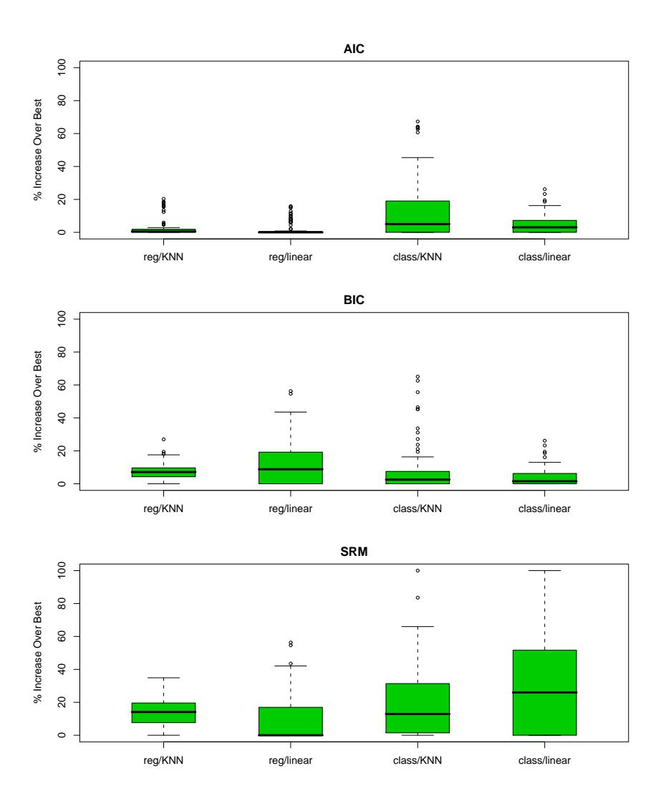
 
FIGURE 7.7. Boxplots show the distribution of the relative error 100 $\times$ [Err$^{T}$ (ˆ$\alpha$) − min$^{\alpha}$ Err$^{T}$ ($\alpha$)]/[max$^{\alpha}$ Err$^{T}$ ($\alpha$) − min$^{\alpha}$ Err$^{T}$ ($\alpha$)] over the four scenarios of Figure 7.3. This is the error in using the chosen model relative to the best model. There are 100 training sets each of size 80 represented in each boxplot, with the errors computed on test sets of size 10, 000.

and worst possible model choices:  $\min_{\alpha} \operatorname{Err}_{\mathcal{T}}(\alpha)$  and  $\max_{\alpha} \operatorname{Err}_{\mathcal{T}}(\alpha)$ . The boxplots show the distribution of the quantity

$$100 \times \frac{\operatorname{Err}_{\mathcal{T}}(\hat{\alpha}) - \min_{\alpha} \operatorname{Err}_{\mathcal{T}}(\alpha)}{\max_{\alpha} \operatorname{Err}_{\mathcal{T}}(\alpha) - \min_{\alpha} \operatorname{Err}_{\mathcal{T}}(\alpha)},$$

which represents the error in using the chosen model relative to the best model. For linear regression the model complexity was measured by the number of features; as mentioned in Section 7.5, this underestimates the df, since it does not *charge* for the search for the best model of that size. This was also used for the VC dimension of the linear classifier. For knearest neighbors, we used the quantity N/k. Under an additive-error regression model, this can be justified as the exact effective degrees of freedom (Exercise 7.6); we do not know if it corresponds to the VC dimension. We used  $a_1 = a_2 = 1$  for the constants in (7.46); the results for SRM changed with different constants, and this choice gave the most favorable results. We repeated the SRM selection using the alternative practical bound (7.47), and got almost identical results. For misclassification error we used  $\hat{\sigma_{\varepsilon}}^2 = [N/(N-d)] \cdot \overline{\text{err}}(\alpha)$  for the least restrictive model (k=5 for KNN,since k = 1 results in zero training error). The AIC criterion seems to work well in all four scenarios, despite the lack of theoretical support with 0-1 loss. BIC does nearly as well, while the performance of SRM is mixed.

#### 7.10 Cross-Validation

Probably the simplest and most widely used method for estimating prediction error is cross-validation. This method directly estimates the expected extra-sample error  $\operatorname{Err} = \operatorname{E}[L(Y,\hat{f}(X))]$ , the average generalization error when the method  $\hat{f}(X)$  is applied to an independent test sample from the joint distribution of X and Y. As mentioned earlier, we might hope that cross-validation estimates the conditional error, with the training set  $\mathcal{T}$  held fixed. But as we will see in Section 7.12, cross-validation typically estimates well only the expected prediction error.

#### 7.10.1 K-Fold Cross-Validation

Ideally, if we had enough data, we would set aside a validation set and use it to assess the performance of our prediction model. Since data are often scarce, this is usually not possible. To finesse the problem, K-fold cross-validation uses part of the available data to fit the model, and a different part to test it. We split the data into K roughly equal-sized parts; for example, when K=5, the scenario looks like this:

| 1     | 2     | 3          | 4     | 5     |
|-------|-------|------------|-------|-------|
| Train | Train | Validation | Train | Train |

For the kth part (third above), we fit the model to the other K-1 parts of the data, and calculate the prediction error of the fitted model when predicting the kth part of the data. We do this for  $k=1,2,\ldots,K$  and combine the K estimates of prediction error.

Here are more details. Let  $\kappa:\{1,\ldots,N\}\mapsto\{1,\ldots,K\}$  be an indexing function that indicates the partition to which observation i is allocated by the randomization. Denote by  $\hat{f}^{-k}(x)$  the fitted function, computed with the kth part of the data removed. Then the cross-validation estimate of prediction error is

$$CV(\hat{f}) = \frac{1}{N} \sum_{i=1}^{N} L(y_i, \hat{f}^{-\kappa(i)}(x_i)).$$
 (7.48)

Typical choices of K are 5 or 10 (see below). The case K = N is known as *leave-one-out* cross-validation. In this case  $\kappa(i) = i$ , and for the ith observation the fit is computed using all the data except the ith.

Given a set of models  $f(x,\alpha)$  indexed by a tuning parameter  $\alpha$ , denote by  $\hat{f}^{-k}(x,\alpha)$  the  $\alpha$ th model fit with the kth part of the data removed. Then for this set of models we define

$$CV(\hat{f}, \alpha) = \frac{1}{N} \sum_{i=1}^{N} L(y_i, \hat{f}^{-\kappa(i)}(x_i, \alpha)).$$
 (7.49)

The function  $\text{CV}(\hat{f}, \alpha)$  provides an estimate of the test error curve, and we find the tuning parameter  $\hat{\alpha}$  that minimizes it. Our final chosen model is  $f(x, \hat{\alpha})$ , which we then fit to all the data.

It is interesting to wonder about what quantity K-fold cross-validation estimates. With K=5 or 10, we might guess that it estimates the expected error Err, since the training sets in each fold are quite different from the original training set. On the other hand, if K=N we might guess that cross-validation estimates the conditional error  $\text{Err}_{\mathcal{T}}$ . It turns out that cross-validation only estimates effectively the average error Err, as discussed in Section 7.12.

What value should we choose for K? With K = N, the cross-validation estimator is approximately unbiased for the true (expected) prediction error, but can have high variance because the N "training sets" are so similar to one another. The computational burden is also considerable, requiring N applications of the learning method. In certain special problems, this computation can be done quickly—see Exercises 7.3 and 5.13.

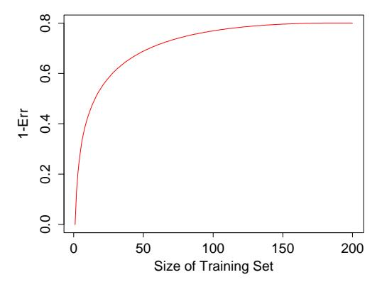
 
FIGURE 7.8. Hypothetical learning curve for a classifier on a given task: a plot of 1 − Err versus the size of the training set N. With a dataset of 200 observations, 5-fold cross-validation would use training sets of size 160, which would behave much like the full set. However, with a dataset of 50 observations fivefold cross-validation would use training sets of size 40, and this would result in a considerable overestimate of prediction error.

On the other hand, with K = 5 say, cross-validation has lower variance. But bias could be a problem, depending on how the performance of the learning method varies with the size of the training set. Figure 7.8 shows a hypothetical "learning curve" for a classifier on a given task, a plot of 1 − Err versus the size of the training set N. The performance of the classifier improves as the training set size increases to 100 observations; increasing the number further to 200 brings only a small benefit. If our training set had 200 observations, fivefold cross-validation would estimate the performance of our classifier over training sets of size 160, which from Figure 7.8 is virtually the same as the performance for training set size 200. Thus cross-validation would not suffer from much bias. However if the training set had 50 observations, fivefold cross-validation would estimate the performance of our classifier over training sets of size 40, and from the figure that would be an underestimate of 1 − Err. Hence as an estimate of Err, cross-validation would be biased upward.

To summarize, if the learning curve has a considerable slope at the given training set size, five- or tenfold cross-validation will overestimate the true prediction error. Whether this bias is a drawback in practice depends on the objective. On the other hand, leave-one-out cross-validation has low bias but can have high variance. Overall, five- or tenfold cross-validation are recommended as a good compromise: see Breiman and Spector (1992) and Kohavi (1995).

Figure 7.9 shows the prediction error and tenfold cross-validation curve estimated from a single training set, from the scenario in the bottom right panel of Figure 7.3. This is a two-class classification problem, using a lin-

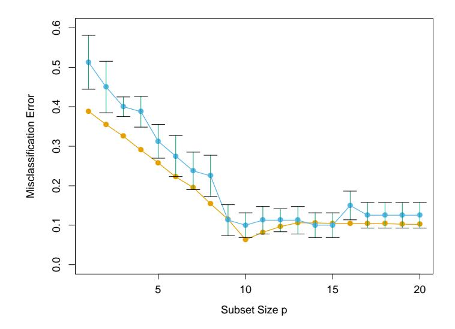
 
**FIGURE 7.9.** Prediction error (orange) and tenfold cross-validation curve (blue) estimated from a single training set, from the scenario in the bottom right panel of Figure 7.3.

ear model with best subsets regression of subset size p. Standard error bars are shown, which are the standard errors of the individual misclassification error rates for each of the ten parts. Both curves have minima at p=10, although the CV curve is rather flat beyond 10. Often a "one-standard error" rule is used with cross-validation, in which we choose the most parsimonious model whose error is no more than one standard error above the error of the best model. Here it looks like a model with about p=9 predictors would be chosen, while the true model uses p=10.

Generalized cross-validation provides a convenient approximation to leaveone out cross-validation, for linear fitting under squared-error loss. As defined in Section 7.6, a linear fitting method is one for which we can write

$$\hat{\mathbf{y}} = \mathbf{S}\mathbf{y}.\tag{7.50}$$

Now for many linear fitting methods,

$$\frac{1}{N} \sum_{i=1}^{N} [y_i - \hat{f}^{-i}(x_i)]^2 = \frac{1}{N} \sum_{i=1}^{N} \left[ \frac{y_i - \hat{f}(x_i)}{1 - S_{ii}} \right]^2, \tag{7.51}$$

where  $S_{ii}$  is the *i*th diagonal element of **S** (see Exercise 7.3). The GCV approximation is

$$GCV(\hat{f}) = \frac{1}{N} \sum_{i=1}^{N} \left[ \frac{y_i - \hat{f}(x_i)}{1 - \operatorname{trace}(\mathbf{S})/N} \right]^2.$$
 (7.52)

The quantity trace(S) is the effective number of parameters, as defined in Section 7.6.

GCV can have a computational advantage in some settings, where the trace of S can be computed more easily than the individual elements Sii. In smoothing problems, GCV can also alleviate the tendency of crossvalidation to undersmooth. The similarity between GCV and AIC can be seen from the approximation 1/(1 − x) $^{2}$ $^{\approx}$ 1 + 2$^{x}$ (Exercise 7.7).

# 7.10.2 The Wrong and Right Way to Do Cross-validation

Consider a classification problem with a large number of predictors, as may arise, for example, in genomic or proteomic applications. A typical strategy for analysis might be as follows:

- 1. Screen the predictors: find a subset of "good" predictors that show fairly strong (univariate) correlation with the class labels
- 2. Using just this subset of predictors, build a multivariate classifier.
- 3. Use cross-validation to estimate the unknown tuning parameters and to estimate the prediction error of the final model.

Is this a correct application of cross-validation? Consider a scenario with N = 50 samples in two equal-sized classes, and p = 5000 quantitative predictors (standard Gaussian) that are independent of the class labels. The true (test) error rate of any classifier is 50%. We carried out the above recipe, choosing in step (1) the 100 predictors having highest correlation with the class labels, and then using a 1-nearest neighbor classifier, based on just these 100 predictors, in step (2). Over 50 simulations from this setting, the average CV error rate was 3%. This is far lower than the true error rate of 50%.

What has happened? The problem is that the predictors have an unfair advantage, as they were chosen in step (1) on the basis of all of the samples. Leaving samples out after the variables have been selected does not correctly mimic the application of the classifier to a completely independent test set, since these predictors "have already seen" the left out samples.

Figure 7.10 (top panel) illustrates the problem. We selected the 100 predictors having largest correlation with the class labels over all 50 samples. Then we chose a random set of 10 samples, as we would do in five-fold crossvalidation, and computed the correlations of the pre-selected 100 predictors with the class labels over just these 10 samples (top panel). We see that the correlations average about 0.28, rather than 0, as one might expect.

Here is the correct way to carry out cross-validation in this example:

- 1. Divide the samples into K cross-validation folds (groups) at random.
- 2. For each fold k = 1, 2, . . . , K

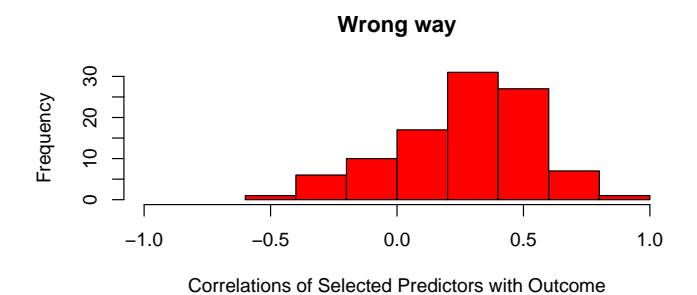
 
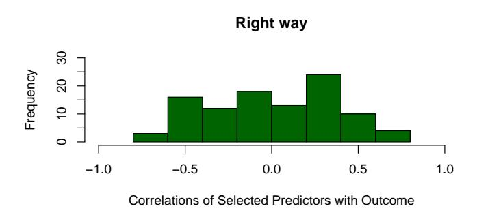
 
FIGURE 7.10. Cross-validation the wrong and right way: histograms shows the correlation of class labels, in 10 randomly chosen samples, with the 100 predictors chosen using the incorrect (upper red) and correct (lower green) versions of cross-validation.

- (a) Find a subset of "good" predictors that show fairly strong (univariate) correlation with the class labels, using all of the samples except those in fold k.
- (b) Using just this subset of predictors, build a multivariate classifier, using all of the samples except those in fold k.
- (c) Use the classifier to predict the class labels for the samples in fold k.

The error estimates from step 2(c) are then accumulated over all K folds, to produce the cross-validation estimate of prediction error. The lower panel of Figure 7.10 shows the correlations of class labels with the 100 predictors chosen in step 2(a) of the correct procedure, over the samples in a typical fold k. We see that they average about zero, as they should.

In general, with a multistep modeling procedure, cross-validation must be applied to the entire sequence of modeling steps. In particular, samples must be "left out" before any selection or filtering steps are applied. There is one qualification: initial unsupervised screening steps can be done before samples are left out. For example, we could select the 1000 predictors with highest variance across all 50 samples, before starting cross-validation. Since this filtering does not involve the class labels, it does not give the predictors an unfair advantage.

While this point may seem obvious to the reader, we have seen this blunder committed many times in published papers in top rank journals. With the large numbers of predictors that are so common in genomic and other areas, the potential consequences of this error have also increased dramatically; see Ambroise and McLachlan (2002) for a detailed discussion of this issue.

#### 7.10.3 Does Cross-Validation Really Work?

We once again examine the behavior of cross-validation in a high-dimensional classification problem. Consider a scenario with N = 20 samples in two equal-sized classes, and p = 500 quantitative predictors that are independent of the class labels. Once again, the true error rate of any classifier is 50%. Consider a simple univariate classifier: a single split that minimizes the misclassification error (a "stump"). Stumps are trees with a single split, and are used in boosting methods (Chapter 10). A simple argument suggests that cross-validation will not work properly in this setting$^{2}$ :

Fitting to the entire training set, we will find a predictor that splits the data very well. If we do 5-fold cross-validation, this same predictor should split any 4/5ths and 1/5th of the data well too, and hence its cross-validation error will be small (much less than 50%.) Thus CV does not give an accurate estimate of error.

To investigate whether this argument is correct, Figure 7.11 shows the result of a simulation from this setting. There are 500 predictors and 20 samples, in each of two equal-sized classes, with all predictors having a standard Gaussian distribution. The panel in the top left shows the number of training errors for each of the 500 stumps fit to the training data. We have marked in color the six predictors yielding the fewest errors. In the top right panel, the training errors are shown for stumps fit to a random 4/5ths partition of the data (16 samples), and tested on the remaining 1/5th (four samples). The colored points indicate the same predictors marked in the top left panel. We see that the stump for the blue predictor (whose stump was the best in the top left panel), makes two out of four test errors (50%), and is no better than random.

What has happened? The preceding argument has ignored the fact that in cross-validation, the model must be completely retrained for each fold

$^{2}$This argument was made to us by a scientist at a proteomics lab meeting, and led to material in this section.

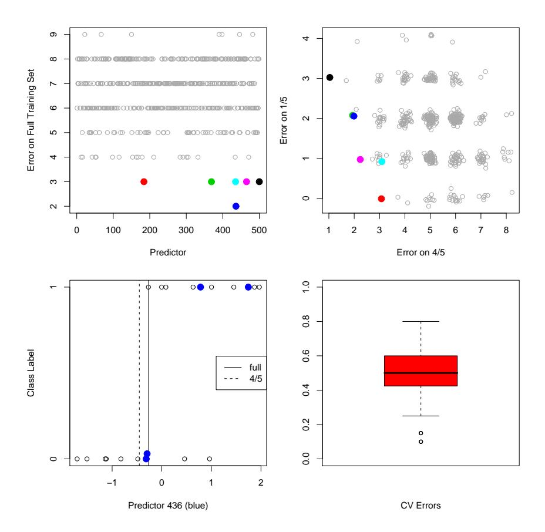
 
FIGURE 7.11. Simulation study to investigate the performance of cross validation in a high-dimensional problem where the predictors are independent of the class labels. The top-left panel shows the number of errors made by individual stump classifiers on the full training set (20 observations). The top right panel shows the errors made by individual stumps trained on a random split of the dataset into 4/5ths (16 observations) and tested on the remaining 1/5th (4 observations). The best performers are depicted by colored dots in each panel. The bottom left panel shows the effect of re-estimating the split point in each fold: the colored points correspond to the four samples in the 1/5th validation set. The split point derived from the full dataset classifies all four samples correctly, but when the split point is re-estimated on the 4/5ths data (as it should be), it commits two errors on the four validation samples. In the bottom right we see the overall result of five-fold cross-validation applied to 50 simulated datasets. The average error rate is about 50%, as it should be.

of the process. In the present example, this means that the best predictor and corresponding split point are found from 4/5ths of the data. The effect of predictor choice is seen in the top right panel. Since the class labels are independent of the predictors, the performance of a stump on the 4/5ths training data contains no information about its performance in the remaining 1/5th. The effect of the choice of split point is shown in the bottom left panel. Here we see the data for predictor 436, corresponding to the blue dot in the top left plot. The colored points indicate the 1/5th data, while the remaining points belong to the 4/5ths. The optimal split points for this predictor based on both the full training set and 4/5ths data are indicated. The split based on the full data makes no errors on the 1/5ths data. But cross-validation must base its split on the 4/5ths data, and this incurs two errors out of four samples.

The results of applying five-fold cross-validation to each of 50 simulated datasets is shown in the bottom right panel. As we would hope, the average cross-validation error is around 50%, which is the true expected prediction error for this classifier. Hence cross-validation has behaved as it should. On the other hand, there is considerable variability in the error, underscoring the importance of reporting the estimated standard error of the CV estimate. See Exercise 7.10 for another variation of this problem.

# 7.11 Bootstrap Methods

The bootstrap is a general tool for assessing statistical accuracy. First we describe the bootstrap in general, and then show how it can be used to estimate extra-sample prediction error. As with cross-validation, the bootstrap seeks to estimate the conditional error Err$^{T}$ , but typically estimates well only the expected prediction error Err.

Suppose we have a model fit to a set of training data. We denote the training set by Z = (z1, z2, . . . , z$^{N}$ ) where z$^{i}$ = (x$^{i}$ , yi). The basic idea is to randomly draw datasets with replacement from the training data, each sample the same size as the original training set. This is done B times (B = 100 say), producing B bootstrap datasets, as shown in Figure 7.12. Then we refit the model to each of the bootstrap datasets, and examine the behavior of the fits over the B replications.

In the figure, S(Z) is any quantity computed from the data Z, for example, the prediction at some input point. From the bootstrap sampling we can estimate any aspect of the distribution of S(Z), for example, its variance,

$$\widehat{\text{Var}}[S(\mathbf{Z})] = \frac{1}{B-1} \sum_{b=1}^{B} (S(\mathbf{Z}^{*b}) - \bar{S}^{*})^{2},$$
 (7.53)

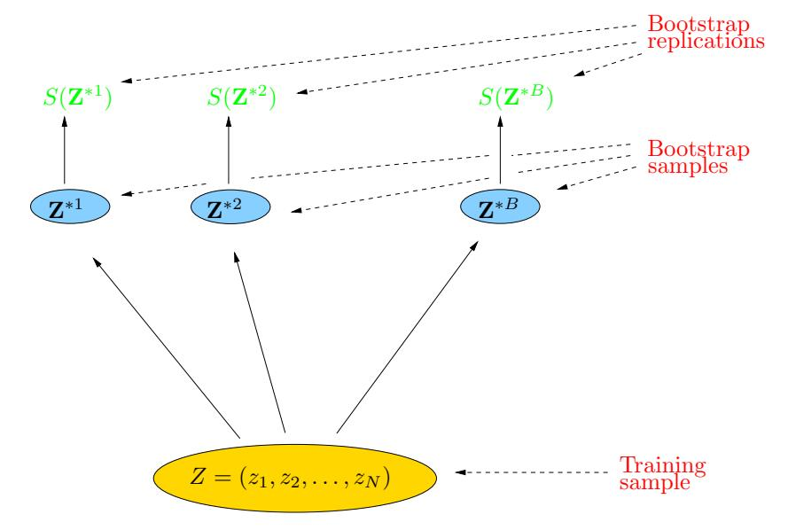
 
**FIGURE 7.12.** Schematic of the bootstrap process. We wish to assess the statistical accuracy of a quantity  $S(\mathbf{Z})$  computed from our dataset. B training sets  $\mathbf{Z}^{*b}$ ,  $b=1,\ldots,B$  each of size N are drawn with replacement from the original dataset. The quantity of interest  $S(\mathbf{Z})$  is computed from each bootstrap training set, and the values  $S(\mathbf{Z}^{*1}),\ldots,S(\mathbf{Z}^{*B})$  are used to assess the statistical accuracy of  $S(\mathbf{Z})$ .

where  $\bar{S}^* = \sum_b S(\mathbf{Z}^{*b})/B$ . Note that  $\widehat{\text{Var}}[S(\mathbf{Z})]$  can be thought of as a Monte-Carlo estimate of the variance of  $S(\mathbf{Z})$  under sampling from the empirical distribution function  $\hat{F}$  for the data  $(z_1, z_2, \dots, z_N)$ .

How can we apply the bootstrap to estimate prediction error? One approach would be to fit the model in question on a set of bootstrap samples, and then keep track of how well it predicts the original training set. If  $\hat{f}^{*b}(x_i)$  is the predicted value at  $x_i$ , from the model fitted to the bth bootstrap dataset, our estimate is

$$\widehat{\text{Err}}_{\text{boot}} = \frac{1}{B} \frac{1}{N} \sum_{b=1}^{B} \sum_{i=1}^{N} L(y_i, \hat{f}^{*b}(x_i)).$$
 (7.54)

However, it is easy to see that Err$_{boot}$ does not provide a good estimate in general. The reason is that the bootstrap datasets are acting as the training samples, while the original training set is acting as the test sample, and these two samples have observations in common. This overlap can make overfit predictions look unrealistically good, and is the reason that cross-validation explicitly uses non-overlapping data for the training and test samples. Consider for example a 1-nearest neighbor classifier applied to a two-class classification problem with the same number of observations in

each class, in which the predictors and class labels are in fact independent. Then the true error rate is 0.5. But the contributions to the bootstrap estimate  $\widehat{\text{Err}}_{\text{boot}}$  will be zero unless the observation i does not appear in the bootstrap sample b. In this latter case it will have the correct expectation 0.5. Now

Pr{observation 
$$i \in \text{bootstrap sample } b$$
} =  $1 - \left(1 - \frac{1}{N}\right)^N$   
  $\approx 1 - e^{-1}$   
$$
= 0.632. (7.55)
$$

Hence the expectation of  $\widehat{\text{Err}}_{\text{boot}}$  is about  $0.5 \times 0.368 = 0.184$ , far below the correct error rate 0.5.

By mimicking cross-validation, a better bootstrap estimate can be obtained. For each observation, we only keep track of predictions from bootstrap samples not containing that observation. The leave-one-out bootstrap estimate of prediction error is defined by

$$\widehat{\text{Err}}^{(1)} = \frac{1}{N} \sum_{i=1}^{N} \frac{1}{|C^{-i}|} \sum_{b \in C^{-i}} L(y_i, \hat{f}^{*b}(x_i)).$$
 (7.56)

Here  $C^{-i}$  is the set of indices of the bootstrap samples b that do not contain observation i, and  $|C^{-i}|$  is the number of such samples. In computing  $\widehat{\operatorname{Err}}^{(1)}$ , we either have to choose B large enough to ensure that all of the  $|C^{-i}|$  are greater than zero, or we can just leave out the terms in (7.56) corresponding to  $|C^{-i}|$ 's that are zero.

The leave-one out bootstrap solves the overfitting problem suffered by  $\widehat{\operatorname{Err}}_{\operatorname{boot}}$ , but has the training-set-size bias mentioned in the discussion of cross-validation. The average number of distinct observations in each bootstrap sample is about  $0.632 \cdot N$ , so its bias will roughly behave like that of twofold cross-validation. Thus if the learning curve has considerable slope at sample size N/2, the leave-one out bootstrap will be biased upward as an estimate of the true error.

The ".632 estimator" is designed to alleviate this bias. It is defined by

$$\widehat{\operatorname{Err}}^{(.632)} = .368 \cdot \overline{\operatorname{err}} + .632 \cdot \widehat{\operatorname{Err}}^{(1)}. \tag{7.57}$$

The derivation of the .632 estimator is complex; intuitively it pulls the leave-one out bootstrap estimate down toward the training error rate, and hence reduces its upward bias. The use of the constant .632 relates to (7.55).

The .632 estimator works well in "light fitting" situations, but can break down in overfit ones. Here is an example due to Breiman et al. (1984). Suppose we have two equal-size classes, with the targets independent of the class labels, and we apply a one-nearest neighbor rule. Then  $\overline{\text{err}} = 0$ ,

 $\widehat{\mathrm Err}^{(1)}=0.5$  and so  $\widehat{\mathrm Err}^{(.632)}=.632\times0.5=.316.$  However, the true error rate is 0.5.

One can improve the .632 estimator by taking into account the amount of overfitting. First we define  $\gamma$  to be the *no-information error rate*: this is the error rate of our prediction rule if the inputs and class labels were independent. An estimate of  $\gamma$  is obtained by evaluating the prediction rule on all possible combinations of targets  $y_i$  and predictors  $x_{i'}$ 

$$\hat{\gamma} = \frac{1}{N^2} \sum_{i=1}^{N} \sum_{i'=1}^{N} L(y_i, \hat{f}(x_{i'})). \tag{7.58}$$

For example, consider the dichotomous classification problem: let  $\hat{p}_1$  be the observed proportion of responses  $y_i$  equaling 1, and let  $\hat{q}_1$  be the observed proportion of predictions  $\hat{f}(x_{i'})$  equaling 1. Then

$$\hat{\gamma} = \hat{p}_1(1 - \hat{q}_1) + (1 - \hat{p}_1)\hat{q}_1. \tag{7.59}$$

With a rule like 1-nearest neighbors for which  $\hat{q}_1 = \hat{p}_1$  the value of  $\hat{\gamma}$  is  $2\hat{p}_1(1-\hat{p}_1)$ . The multi-category generalization of (7.59) is  $\hat{\gamma} = \sum_{\ell} \hat{p}_{\ell}(1-\hat{q}_{\ell})$ . Using this, the relative overfitting rate is defined to be

$$\hat{R} = \frac{\widehat{\text{Err}}^{(1)} - \overline{\text{err}}}{\hat{\gamma} - \overline{\text{err}}},\tag{7.60}$$

a quantity that ranges from 0 if there is no overfitting  $(\widehat{\operatorname{Err}}^{(1)} = \overline{\operatorname{err}})$  to 1 if the overfitting equals the no-information value  $\hat{\gamma} - \overline{\operatorname{err}}$ . Finally, we define the ".632+" estimator by

$$\widehat{\operatorname{Err}}^{(.632+)} = (1-\hat{w}) \cdot \overline{\operatorname{err}} + \hat{w} \cdot \widehat{\operatorname{Err}}^{(1)}$$
with  $\hat{w} = \frac{.632}{1 - .368\hat{R}}$ . (7.61)

The weight w ranges from .632 if  $\hat{R}=0$  to 1 if  $\hat{R}=1$ , so  $\widehat{\text{Err}}^{(.632+)}$  ranges from  $\widehat{\text{Err}}^{(.632)}$  to  $\widehat{\text{Err}}^{(1)}$ . Again, the derivation of (7.61) is complicated: roughly speaking, it produces a compromise between the leave-one-out bootstrap and the training error rate that depends on the amount of overfitting. For the 1-nearest-neighbor problem with class labels independent of the inputs,  $\hat{w}=\hat{R}=1$ , so  $\widehat{\text{Err}}^{(.632+)}=\widehat{\text{Err}}^{(1)}$ , which has the correct expectation of 0.5. In other problems with less overfitting,  $\widehat{\text{Err}}^{(.632+)}$  will lie somewhere between  $\overline{\text{err}}$  and  $\widehat{\text{Err}}^{(1)}$ .

#### 7.11.1 Example (Continued)

Figure 7.13 shows the results of tenfold cross-validation and the .632+ bootstrap estimate in the same four problems of Figures 7.7. As in that figure,

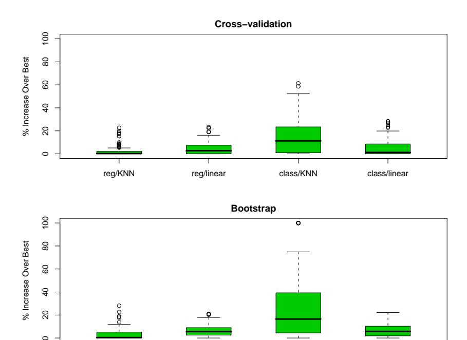
 
FIGURE 7.13. Boxplots show the distribution of the relative error 100 $\cdot$ [Err$^{\alpha}$$^{ˆ}$ − min$^{\alpha}$ Err($\alpha$)]/[max$^{\alpha}$ Err($\alpha$) − min$^{\alpha}$ Err($\alpha$)] over the four scenarios of Figure 7.3. This is the error in using the chosen model relative to the best model. There are 100 training sets represented in each boxplot.

reg/KNN reg/linear class/KNN class/linear

Figure 7.13 shows boxplots of 100 $\cdot$ [Err$\alpha$$^{ˆ}$ − min$^{\alpha}$ Err($\alpha$)]/[max$^{\alpha}$ Err($\alpha$) − min$^{\alpha}$ Err($\alpha$)], the error in using the chosen model relative to the best model. There are 100 different training sets represented in each boxplot. Both measures perform well overall, perhaps the same or slightly worse than the AIC in Figure 7.7.

Our conclusion is that for these particular problems and fitting methods, minimization of either AIC, cross-validation or bootstrap yields a model fairly close to the best available. Note that for the purpose of model selection, any of the measures could be biased and it wouldn't affect things, as long as the bias did not change the relative performance of the methods. For example, the addition of a constant to any of the measures would not change the resulting chosen model. However, for many adaptive, nonlinear techniques (like trees), estimation of the effective number of parameters is very difficult. This makes methods like AIC impractical and leaves us with cross-validation or bootstrap as the methods of choice.

A different question is: how well does each method estimate test error? On the average the AIC criterion overestimated prediction error of its chosen model by 38%, 37%, 51%, and 30%, respectively, over the four scenarios, with BIC performing similarly. In contrast, cross-validation overestimated the error by 1%, 4%, 0%, and 4%, with the bootstrap doing about the same. Hence the extra work involved in computing a cross-validation or bootstrap measure is worthwhile, if an accurate estimate of test error is required. With other fitting methods like trees, cross-validation and bootstrap can underestimate the true error by 10%, because the search for best tree is strongly affected by the validation set. In these situations only a separate test set will provide an unbiased estimate of test error.

# 7.12 Conditional or Expected Test Error?

Figures 7.14 and 7.15 examine the question of whether cross-validation does a good job in estimating Err$^{T}$ , the error conditional on a given training set T (expression (7.15) on page 228), as opposed to the expected test error. For each of 100 training sets generated from the "reg/linear" setting in the top-right panel of Figure 7.3, Figure 7.14 shows the conditional error curves Err$^{T}$ as a function of subset size (top left). The next two panels show 10-fold and N-fold cross-validation, the latter also known as leave-one-out (LOO). The thick red curve in each plot is the expected error Err, while the thick black curves are the expected cross-validation curves. The lower right panel shows how well cross-validation approximates the conditional and expected error.

One might have expected N-fold CV to approximate Err$^{T}$ well, since it almost uses the full training sample to fit a new test point. 10-fold CV, on the other hand, might be expected to estimate Err well, since it averages over somewhat different training sets. From the figure it appears 10-fold does a better job than N-fold in estimating Err$^{T}$ , and estimates Err even better. Indeed, the similarity of the two black curves with the red curve suggests both CV curves are approximately unbiased for Err, with 10-fold having less variance. Similar trends were reported by Efron (1983).

Figure 7.15 shows scatterplots of both 10-fold and N-fold cross-validation error estimates versus the true conditional error for the 100 simulations. Although the scatterplots do not indicate much correlation, the lower right panel shows that for the most part the correlations are negative, a curious phenomenon that has been observed before. This negative correlation explains why neither form of CV estimates Err$^{T}$ well. The broken lines in each plot are drawn at Err(p), the expected error for the best subset of size p. We see again that both forms of CV are approximately unbiased for expected error, but the variation in test error for different training sets is quite substantial.

Among the four experimental conditions in 7.3, this "reg/linear" scenario showed the highest correlation between actual and predicted test error. This

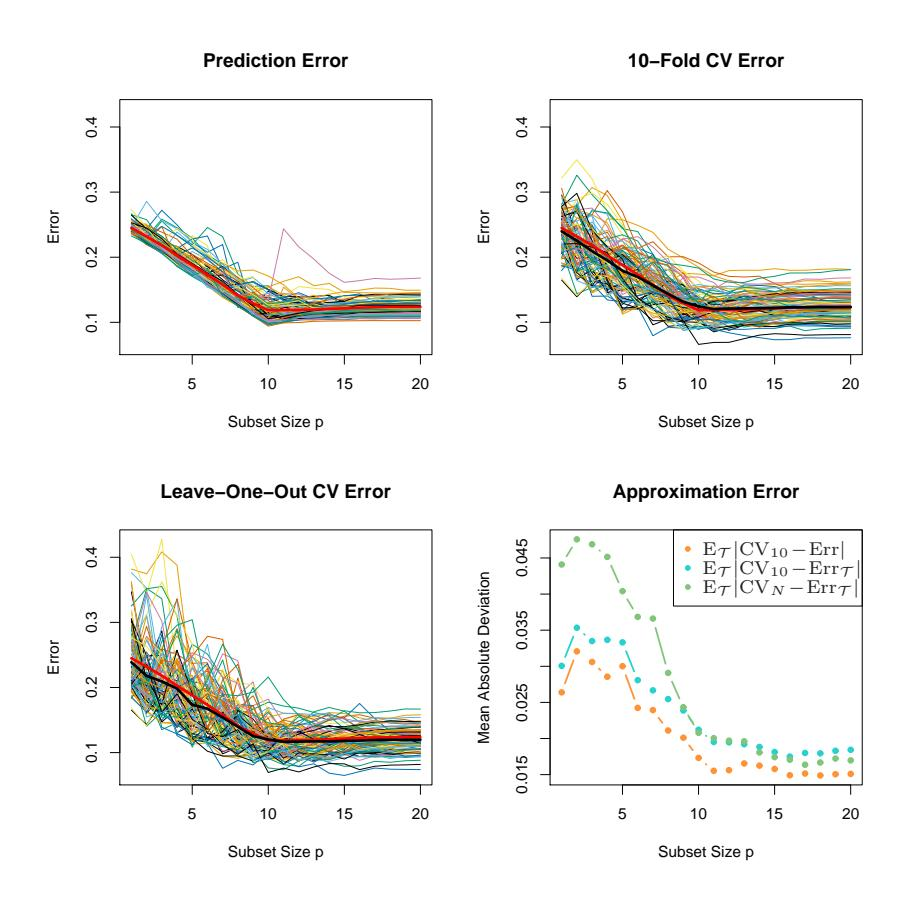
 
**FIGURE 7.14.** Conditional prediction-error  $\operatorname{Err}_{\mathcal{T}}$ , 10-fold cross-validation, and leave-one-out cross-validation curves for a 100 simulations from the top-right panel in Figure 7.3. The thick red curve is the expected prediction error  $\operatorname{Err}_{\mathcal{T}}$  while the thick black curves are the expected  $\operatorname{CV}$  curves  $\operatorname{E}_{\mathcal{T}}\operatorname{CV}_{10}$  and  $\operatorname{E}_{\mathcal{T}}\operatorname{CV}_N$ . The lower-right panel shows the mean absolute deviation of the  $\operatorname{CV}$  curves from the conditional error,  $\operatorname{E}_{\mathcal{T}}|\operatorname{CV}_K - \operatorname{Err}_{\mathcal{T}}|$  for K=10 (blue) and K=N (green), as well as from the expected error  $\operatorname{E}_{\mathcal{T}}|\operatorname{CV}_{10} - \operatorname{Err}|$  (orange).

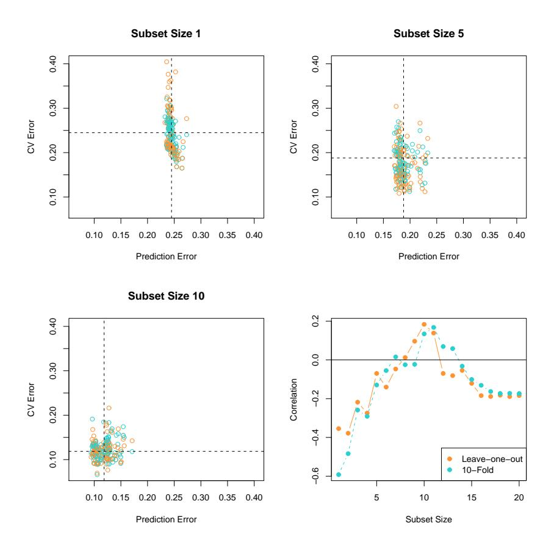
 
FIGURE 7.15. Plots of the CV estimates of error versus the true conditional error for each of the 100 training sets, for the simulation setup in the top right panel Figure 7.3. Both 10-fold and leave-one-out CV are depicted in different colors. The first three panels correspond to different subset sizes p, and vertical and horizontal lines are drawn at Err(p). Although there appears to be little correlation in these plots, we see in the lower right panel that for the most part the correlation is negative.

phenomenon also occurs for bootstrap estimates of error, and we would guess, for any other estimate of conditional prediction error.

We conclude that estimation of test error for a particular training set is not easy in general, given just the data from that same training set. Instead, cross-validation and related methods may provide reasonable estimates of the expected error Err.

# Bibliographic Notes

Key references for cross-validation are Stone (1974), Stone (1977) and Allen (1974). The AIC was proposed by Akaike (1973), while the BIC was introduced by Schwarz (1978). Madigan and Raftery (1994) give an overview of Bayesian model selection. The MDL criterion is due to Rissanen (1983). Cover and Thomas (1991) contains a good description of coding theory and complexity. VC dimension is described in Vapnik (1996). Stone (1977) showed that the AIC and leave-one out cross-validation are asymptotically equivalent. Generalized cross-validation is described by Golub et al. (1979) and Wahba (1980); a further discussion of the topic may be found in the monograph by Wahba (1990). See also Hastie and Tibshirani (1990), Chapter 3. The bootstrap is due to Efron (1979); see Efron and Tibshirani (1993) for an overview. Efron (1983) proposes a number of bootstrap estimates of prediction error, including the optimism and .632 estimates. Efron (1986) compares CV, GCV and bootstrap estimates of error rates. The use of cross-validation and the bootstrap for model selection is studied by Breiman and Spector (1992), Breiman (1992), Shao (1996), Zhang (1993) and Kohavi (1995). The .632+ estimator was proposed by Efron and Tibshirani (1997).

Cherkassky and Ma (2003) published a study on the performance of SRM for model selection in regression, in response to our study of section 7.9.1. They complained that we had been unfair to SRM because had not applied it properly. Our response can be found in the same issue of the journal (Hastie et al. (2003)).

# Exercises

Ex. 7.1 Derive the estimate of in-sample error (7.24).

Ex. 7.2 For 0–1 loss with Y $\in$ {0, 1} and Pr(Y = 1|x0) = f(x0), show that

$$\operatorname{Err}(x_0) = \operatorname{Pr}(Y \neq \hat{G}(x_0)|X = x_0)$$

$$= \operatorname{Err}_{\mathbf{B}}(x_0) + |2f(x_0) - 1|\operatorname{Pr}(\hat{G}(x_0) \neq G(x_0)|X = x_0),$$
(7.62)

where  $\hat{G}(x) = I(\hat{f}(x) > \frac{1}{2})$ ,  $G(x) = I(f(x) > \frac{1}{2})$  is the Bayes classifier, and  $\text{Err}_{\mathbf{B}}(x_0) = \Pr(Y \neq G(x_0) | X = x_0)$ , the irreducible *Bayes error* at  $x_0$ . Using the approximation  $\hat{f}(x_0) \sim N(\mathbf{E}\hat{f}(x_0), \text{Var}(\hat{f}(x_0)))$ , show that

$$\Pr(\hat{G}(x_0) \neq G(x_0) | X = x_0) \approx \Phi\left(\frac{\operatorname{sign}(\frac{1}{2} - f(x_0))(\operatorname{E}\hat{f}(x_0) - \frac{1}{2})}{\sqrt{\operatorname{Var}(\hat{f}(x_0))}}\right). (7.63)$$

In the above,

$$\Phi(t) = \frac{1}{\sqrt{2\pi}} \int_{-\infty}^{t} \exp(-t^2/2) dt,$$

the cumulative Gaussian distribution function. This is an increasing function, with value 0 at  $t=-\infty$  and value 1 at  $t=+\infty$ .

We can think of  $\operatorname{sign}(\frac{1}{2} - f(x_0))(\operatorname{E}\hat{f}(x_0) - \frac{1}{2})$  as a kind of boundary-bias term, as it depends on the true  $f(x_0)$  only through which side of the boundary  $(\frac{1}{2})$  that it lies. Notice also that the bias and variance combine in a multiplicative rather than additive fashion. If  $\operatorname{E}\hat{f}(x_0)$  is on the same side of  $\frac{1}{2}$  as  $f(x_0)$ , then the bias is negative, and decreasing the variance will decrease the misclassification error. On the other hand, if  $\operatorname{E}\hat{f}(x_0)$  is on the opposite side of  $\frac{1}{2}$  to  $f(x_0)$ , then the bias is positive and it pays to increase the variance! Such an increase will improve the chance that  $\hat{f}(x_0)$  falls on the correct side of  $\frac{1}{2}$  (Friedman, 1997).

#### Ex. 7.3 Let $\hat{\mathbf{f}} = \mathbf{S}\mathbf{y}$ be a linear smoothing of $\mathbf{y}$ .

(a) If  $S_{ii}$  is the *i*th diagonal element of **S**, show that for **S** arising from least squares projections and cubic smoothing splines, the cross-validated residual can be written as

$$y_i - \hat{f}^{-i}(x_i) = \frac{y_i - \hat{f}(x_i)}{1 - S_{ii}}. (7.64)$$

- (b) Use this result to show that  $|y_i \hat{f}^{-i}(x_i)| \ge |y_i \hat{f}(x_i)|$ .
- (c) Find general conditions on any smoother S to make result (7.64) hold.

Ex. 7.4 Consider the in-sample prediction error (7.18) and the training error  $\overline{\text{err}}$  in the case of squared-error loss:

$$\operatorname{Err}_{\text{in}} = \frac{1}{N} \sum_{i=1}^{N} \operatorname{E}_{Y^{0}} (Y_{i}^{0} - \hat{f}(x_{i}))^{2}$$

$$\overline{\operatorname{err}} = \frac{1}{N} \sum_{i=1}^{N} (y_{i} - \hat{f}(x_{i}))^{2}.$$

Add and subtract  $f(x_i)$  and  $E\hat{f}(x_i)$  in each expression and expand. Hence establish that the average optimism in the training error is

$$\frac{2}{N} \sum_{i=1}^{N} \operatorname{Cov}(\hat{y}_i, y_i),$$

as given in (7.21).

Ex. 7.5 For a linear smoother  $\hat{\mathbf{y}} = \mathbf{S}\mathbf{y}$ , show that

$$\sum_{i=1}^{N} \operatorname{Cov}(\hat{y}_i, y_i) = \operatorname{trace}(\mathbf{S}) \sigma_{\varepsilon}^2, \tag{7.65}$$

which justifies its use as the effective number of parameters.

Ex. 7.6 Show that for an additive-error model, the effective degrees-of-freedom for the k-nearest-neighbors regression fit is N/k.

Ex. 7.7 Use the approximation  $1/(1-x)^2 \approx 1+2x$  to expose the relationship between  $C_p/\text{AIC}$  (7.26) and GCV (7.52), the main difference being the model used to estimate the noise variance  $\sigma_{\varepsilon}^2$ .

Ex. 7.8 Show that the set of functions  $\{I(\sin(\alpha x) > 0)\}\$  can shatter the following points on the line:

$$z^1 = 10^{-1}, \dots, z^{\ell} = 10^{-\ell},$$
 (7.66)

for any  $\ell$ . Hence the VC dimension of the class  $\{I(\sin(\alpha x) > 0)\}$  is infinite.

Ex. 7.9 For the prostate data of Chapter 3, carry out a best-subset linear regression analysis, as in Table 3.3 (third column from left). Compute the AIC, BIC, five- and tenfold cross-validation, and bootstrap .632 estimates of prediction error. Discuss the results.

Ex. 7.10 Referring to the example in Section 7.10.3, suppose instead that all of the p predictors are binary, and hence there is no need to estimate split points. The predictors are independent of the class labels as before. Then if p is very large, we can probably find a predictor that splits the entire training data perfectly, and hence would split the validation data (one-fifth of data) perfectly as well. This predictor would therefore have zero cross-validation error. Does this mean that cross-validation does not provide a good estimate of test error in this situation? [This question was suggested by Li Ma.]