# Model Inference and Averaging

# 8.1 Introduction

For most of this book, the fitting (learning) of models has been achieved by minimizing a sum of squares for regression, or by minimizing cross-entropy for classification. In fact, both of these minimizations are instances of the maximum likelihood approach to fitting.

In this chapter we provide a general exposition of the maximum likelihood approach, as well as the Bayesian method for inference. The bootstrap, introduced in Chapter 7, is discussed in this context, and its relation to maximum likelihood and Bayes is described. Finally, we present some related techniques for model averaging and improvement, including committee methods, bagging, stacking and bumping.

# 8.2 The Bootstrap and Maximum Likelihood Methods

#### 8.2.1 A Smoothing Example

The bootstrap method provides a direct computational way of assessing uncertainty, by sampling from the training data. Here we illustrate the bootstrap in a simple one-dimensional smoothing problem, and show its connection to maximum likelihood.

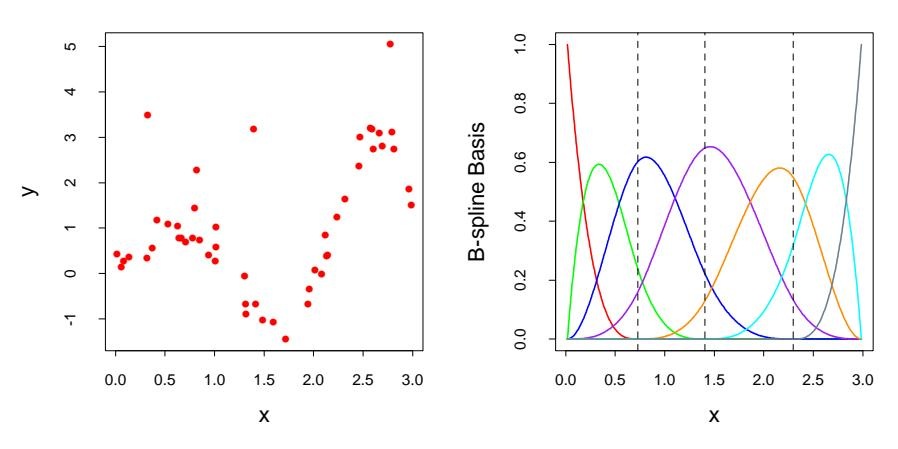

**FIGURE 8.1.** (Left panel): Data for smoothing example. (Right panel:) Set of seven B-spline basis functions. The broken vertical lines indicate the placement of the three knots.

Denote the training data by  $\mathbf{Z} = \{z_1, z_2, \dots, z_N\}$ , with  $z_i = (x_i, y_i)$ ,  $i = 1, 2, \dots, N$ . Here  $x_i$  is a one-dimensional input, and  $y_i$  the outcome, either continuous or categorical. As an example, consider the N = 50 data points shown in the left panel of Figure 8.1.

Suppose we decide to fit a cubic spline to the data, with three knots placed at the quartiles of the X values. This is a seven-dimensional linear space of functions, and can be represented, for example, by a linear expansion of B-spline basis functions (see Section 5.9.2):

$$\mu(x) = \sum_{j=1}^{7} \beta_j h_j(x).$$
 (8.1)

Here the  $h_j(x)$ , j = 1, 2, ..., 7 are the seven functions shown in the right panel of Figure 8.1. We can think of  $\mu(x)$  as representing the conditional mean E(Y|X=x).

Let **H** be the  $N \times 7$  matrix with ijth element  $h_j(x_i)$ . The usual estimate of  $\beta$ , obtained by minimizing the squared error over the training set, is given by

$$\hat{\beta} = (\mathbf{H}^T \mathbf{H})^{-1} \mathbf{H}^T \mathbf{y}. \tag{8.2}$$

The corresponding fit  $\hat{\mu}(x) = \sum_{j=1}^{7} \hat{\beta}_j h_j(x)$  is shown in the top left panel of Figure 8.2.

The estimated covariance matrix of  $\hat{\beta}$  is

$$\widehat{\operatorname{Var}}(\hat{\beta}) = (\mathbf{H}^T \mathbf{H})^{-1} \hat{\sigma}^2, \tag{8.3}$$

where we have estimated the noise variance by  $\hat{\sigma}^2 = \sum_{i=1}^N (y_i - \hat{\mu}(x_i))^2 / N$ . Letting  $h(x)^T = (h_1(x), h_2(x), \dots, h_7(x))$ , the standard error of a predic-

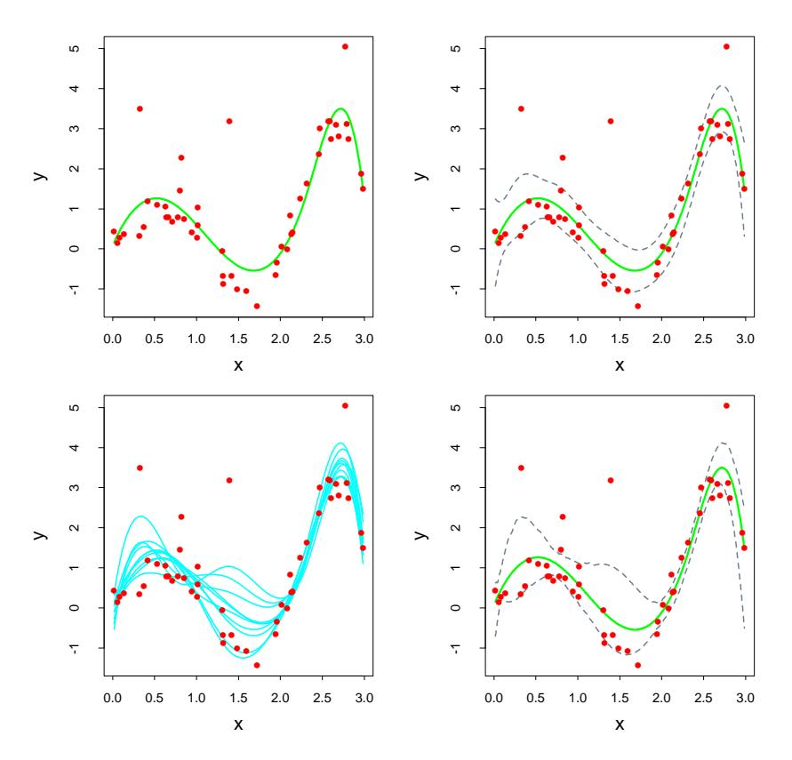

**FIGURE 8.2.** (Top left:) B-spline smooth of data. (Top right:) B-spline smooth plus and minus 1.96× standard error bands. (Bottom left:) Ten bootstrap replicates of the B-spline smooth. (Bottom right:) B-spline smooth with 95% standard error bands computed from the bootstrap distribution.

tion  $\hat{\mu}(x) = h(x)^T \hat{\beta}$  is

$$\widehat{\operatorname{se}}[\hat{\mu}(x)] = [h(x)^T (\mathbf{H}^T \mathbf{H})^{-1} h(x)]^{\frac{1}{2}} \hat{\sigma}.$$
(8.4)

In the top right panel of Figure 8.2 we have plotted  $\hat{\mu}(x) \pm 1.96 \cdot \hat{\text{se}}[\hat{\mu}(x)]$ . Since 1.96 is the 97.5% point of the standard normal distribution, these represent approximate  $100 - 2 \times 2.5\% = 95\%$  pointwise confidence bands for  $\mu(x)$ .

Here is how we could apply the bootstrap in this example. We draw B datasets each of size N=50 with replacement from our training data, the sampling unit being the pair  $z_i=(x_i,y_i)$ . To each bootstrap dataset  $\mathbf{Z}^*$  we fit a cubic spline  $\hat{\mu}^*(x)$ ; the fits from ten such samples are shown in the bottom left panel of Figure 8.2. Using B=200 bootstrap samples, we can form a 95% pointwise confidence band from the percentiles at each x: we find the  $2.5\% \times 200 =$  fifth largest and smallest values at each x. These are plotted in the bottom right panel of Figure 8.2. The bands look similar to those in the top right, being a little wider at the endpoints.

There is actually a close connection between the least squares estimates (8.2) and (8.3), the bootstrap, and maximum likelihood. Suppose we further assume that the model errors are Gaussian,

$$Y = \mu(X) + \varepsilon; \quad \varepsilon \sim N(0, \sigma^2),$$
  

$$\mu(x) = \sum_{j=1}^{7} \beta_j h_j(x).$$
(8.5)

The bootstrap method described above, in which we sample with replacement from the training data, is called the *nonparametric bootstrap*. This really means that the method is "model-free," since it uses the raw data, not a specific parametric model, to generate new datasets. Consider a variation of the bootstrap, called the *parametric bootstrap*, in which we simulate new responses by adding Gaussian noise to the predicted values:

$$y_i^* = \hat{\mu}(x_i) + \varepsilon_i^*; \quad \varepsilon_i^* \sim N(0, \hat{\sigma}^2); \quad i = 1, 2, \dots, N.$$
 (8.6)

This process is repeated B times, where B=200 say. The resulting bootstrap datasets have the form  $(x_1,y_1^*),\ldots,(x_N,y_N^*)$  and we recompute the B-spline smooth on each. The confidence bands from this method will exactly equal the least squares bands in the top right panel, as the number of bootstrap samples goes to infinity. A function estimated from a bootstrap sample  $\mathbf{y}^*$  is given by  $\hat{\mu}^*(x) = h(x)^T (\mathbf{H}^T \mathbf{H})^{-1} \mathbf{H}^T \mathbf{y}^*$ , and has distribution

$$\hat{\mu}^*(x) \sim N(\hat{\mu}(x), h(x)^T (\mathbf{H}^T \mathbf{H})^{-1} h(x) \hat{\sigma}^2).$$
 (8.7)

Notice that the mean of this distribution is the least squares estimate, and the standard deviation is the same as the approximate formula (8.4).

#### 8.2.2 Maximum Likelihood Inference

It turns out that the parametric bootstrap agrees with least squares in the previous example because the model (8.5) has additive Gaussian errors. In general, the parametric bootstrap agrees not with least squares but with maximum likelihood, which we now review.

We begin by specifying a probability density or probability mass function for our observations

$$z_i \sim g_{\theta}(z).$$
 (8.8)

In this expression  $\theta$  represents one or more unknown parameters that govern the distribution of Z. This is called a *parametric model* for Z. As an example, if Z has a normal distribution with mean  $\mu$  and variance  $\sigma^2$ , then

$$\theta = (\mu, \sigma^2), \tag{8.9}$$

and

$$g_{\theta}(z) = \frac{1}{\sqrt{2\pi}\sigma} e^{-\frac{1}{2}(z-\mu)^2/\sigma^2}.$$
 (8.10)

Maximum likelihood is based on the *likelihood function*, given by

$$L(\theta; \mathbf{Z}) = \prod_{i=1}^{N} g_{\theta}(z_i), \tag{8.11}$$

the probability of the observed data under the model  $g_{\theta}$ . The likelihood is defined only up to a positive multiplier, which we have taken to be one. We think of  $L(\theta; \mathbf{Z})$  as a function of  $\theta$ , with our data  $\mathbf{Z}$  fixed.

Denote the logarithm of  $L(\theta; \mathbf{Z})$  by

$$\ell(\theta; \mathbf{Z}) = \sum_{i=1}^{N} \ell(\theta; z_i)$$

$$= \sum_{i=1}^{N} \log g_{\theta}(z_i), \qquad (8.12)$$

which we will sometimes abbreviate as  $\ell(\theta)$ . This expression is called the log-likelihood, and each value  $\ell(\theta; z_i) = \log g_{\theta}(z_i)$  is called a log-likelihood component. The method of maximum likelihood chooses the value  $\theta = \hat{\theta}$  to maximize  $\ell(\theta; \mathbf{Z})$ .

The likelihood function can be used to assess the precision of  $\hat{\theta}$ . We need a few more definitions. The *score function* is defined by

$$\dot{\ell}(\theta; \mathbf{Z}) = \sum_{i=1}^{N} \dot{\ell}(\theta; z_i), \tag{8.13}$$

where  $\dot{\ell}(\theta; z_i) = \partial \ell(\theta; z_i)/\partial \theta$ . Assuming that the likelihood takes its maximum in the interior of the parameter space,  $\dot{\ell}(\hat{\theta}; \mathbf{Z}) = 0$ . The *information matrix* is

$$\mathbf{I}(\theta) = -\sum_{i=1}^{N} \frac{\partial^{2} \ell(\theta; z_{i})}{\partial \theta \partial \theta^{T}}.$$
(8.14)

When  $\mathbf{I}(\theta)$  is evaluated at  $\theta = \hat{\theta}$ , it is often called the *observed information*. The *Fisher information* (or expected information) is

$$\mathbf{i}(\theta) = \mathbf{E}_{\theta}[\mathbf{I}(\theta)]. \tag{8.15}$$

Finally, let  $\theta_0$  denote the true value of  $\theta$ .

A standard result says that the sampling distribution of the maximum likelihood estimator has a limiting normal distribution

$$\hat{\theta} \to N(\theta_0, \mathbf{i}(\theta_0)^{-1}),$$
 (8.16)

as  $N \to \infty$ . Here we are independently sampling from  $g_{\theta_0}(z)$ . This suggests that the sampling distribution of  $\hat{\theta}$  may be approximated by

$$N(\hat{\theta}, \mathbf{i}(\hat{\theta})^{-1}) \text{ or } N(\hat{\theta}, \mathbf{I}(\hat{\theta})^{-1}),$$
 (8.17)

where  $\hat{\theta}$  represents the maximum likelihood estimate from the observed data.

The corresponding estimates for the standard errors of  $\hat{\theta}_j$  are obtained from

$$\sqrt{\mathbf{i}(\hat{\theta})_{jj}^{-1}}$$
 and  $\sqrt{\mathbf{I}(\hat{\theta})_{jj}^{-1}}$ . (8.18)

Confidence points for  $\theta_j$  can be constructed from either approximation in (8.17). Such a confidence point has the form

$$\hat{\theta}_j - z^{(1-\alpha)} \cdot \sqrt{\mathbf{i}(\hat{\theta})_{jj}^{-1}}$$
 or  $\hat{\theta}_j - z^{(1-\alpha)} \cdot \sqrt{\mathbf{I}(\hat{\theta})_{jj}^{-1}}$ ,

respectively, where  $z^{(1-\alpha)}$  is the  $1-\alpha$  percentile of the standard normal distribution. More accurate confidence intervals can be derived from the likelihood function, by using the chi-squared approximation

$$2[\ell(\hat{\theta}) - \ell(\theta_0)] \sim \chi_p^2, \tag{8.19}$$

where p is the number of components in  $\theta$ . The resulting  $1-2\alpha$  confidence interval is the set of all  $\theta_0$  such that  $2[\ell(\hat{\theta})-\ell(\theta_0)] \leq \chi_p^{2(1-2\alpha)}$ , where  $\chi_p^{2(1-2\alpha)}$  is the  $1-2\alpha$  percentile of the chi-squared distribution with p degrees of freedom.

Let's return to our smoothing example to see what maximum likelihood yields. The parameters are θ = (β, σ2 ). The log-likelihood is

$$\ell(\theta) = -\frac{N}{2}\log\sigma^2 2\pi - \frac{1}{2\sigma^2} \sum_{i=1}^{N} (y_i - h(x_i)^T \beta)^2.$$
 (8.20)

The maximum likelihood estimate is obtained by setting ∂ℓ/∂β = 0 and ∂ℓ/∂σ2 = 0, giving

$$\hat{\beta} = (\mathbf{H}^T \mathbf{H})^{-1} \mathbf{H}^T \mathbf{y},$$

$$\hat{\sigma}^2 = \frac{1}{N} \sum (y_i - \hat{\mu}(x_i))^2,$$
(8.21)

which are the same as the usual estimates given in (8.2) and below (8.3).

The information matrix for θ = (β, σ2 ) is block-diagonal, and the block corresponding to β is

$$\mathbf{I}(\beta) = (\mathbf{H}^T \mathbf{H}) / \sigma^2, \tag{8.22}$$

so that the estimated variance (HT H) −1σˆ 2 agrees with the least squares estimate (8.3).

## 8.2.3 Bootstrap versus Maximum Likelihood

In essence the bootstrap is a computer implementation of nonparametric or parametric maximum likelihood. The advantage of the bootstrap over the maximum likelihood formula is that it allows us to compute maximum likelihood estimates of standard errors and other quantities in settings where no formulas are available.

In our example, suppose that we adaptively choose by cross-validation the number and position of the knots that define the B-splines, rather than fix them in advance. Denote by λ the collection of knots and their positions. Then the standard errors and confidence bands should account for the adaptive choice of λ, but there is no way to do this analytically. With the bootstrap, we compute the B-spline smooth with an adaptive choice of knots for each bootstrap sample. The percentiles of the resulting curves capture the variability from both the noise in the targets as well as that from λˆ. In this particular example the confidence bands (not shown) don't look much different than the fixed λ bands. But in other problems, where more adaptation is used, this can be an important effect to capture.

# 8.3 Bayesian Methods

In the Bayesian approach to inference, we specify a sampling model Pr(Z|θ) (density or probability mass function) for our data given the parameters, and a prior distribution for the parameters  $\Pr(\theta)$  reflecting our knowledge about  $\theta$  before we see the data. We then compute the posterior distribution

$$\Pr(\theta|\mathbf{Z}) = \frac{\Pr(\mathbf{Z}|\theta) \cdot \Pr(\theta)}{\int \Pr(\mathbf{Z}|\theta) \cdot \Pr(\theta) d\theta},$$
(8.23)

which represents our updated knowledge about  $\theta$  after we see the data. To understand this posterior distribution, one might draw samples from it or summarize by computing its mean or mode. The Bayesian approach differs from the standard ("frequentist") method for inference in its use of a prior distribution to express the uncertainty present before seeing the data, and to allow the uncertainty remaining after seeing the data to be expressed in the form of a posterior distribution.

The posterior distribution also provides the basis for predicting the values of a future observation  $z^{\text{new}}$ , via the *predictive distribution*:

$$\Pr(z^{\text{new}}|\mathbf{Z}) = \int \Pr(z^{\text{new}}|\theta) \cdot \Pr(\theta|\mathbf{Z}) d\theta.$$
 (8.24)

In contrast, the maximum likelihood approach would use  $\Pr(z^{\text{new}}|\hat{\theta})$ , the data density evaluated at the maximum likelihood estimate, to predict future data. Unlike the predictive distribution (8.24), this does not account for the uncertainty in estimating  $\theta$ .

Let's walk through the Bayesian approach in our smoothing example. We start with the parametric model given by equation (8.5), and assume for the moment that  $\sigma^2$  is known. We assume that the observed feature values  $x_1, x_2, \ldots, x_N$  are fixed, so that the randomness in the data comes solely from y varying around its mean  $\mu(x)$ .

The second ingredient we need is a prior distribution. Distributions on functions are fairly complex entities: one approach is to use a Gaussian process prior in which we specify the prior covariance between any two function values  $\mu(x)$  and  $\mu(x')$  (Wahba, 1990; Neal, 1996).

Here we take a simpler route: by considering a finite B-spline basis for  $\mu(x)$ , we can instead provide a prior for the coefficients  $\beta$ , and this implicitly defines a prior for  $\mu(x)$ . We choose a Gaussian prior centered at zero

$$\beta \sim N(0, \tau \Sigma) \tag{8.25}$$

with the choices of the prior correlation matrix  $\Sigma$  and variance  $\tau$  to be discussed below. The implicit process prior for  $\mu(x)$  is hence Gaussian, with covariance kernel

$$K(x, x') = \operatorname{cov}[\mu(x), \mu(x')]$$
  
=  $\tau \cdot h(x)^T \Sigma h(x')$ . (8.26)

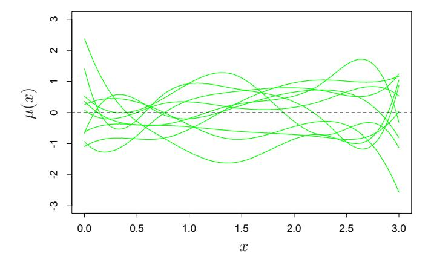

**FIGURE 8.3.** Smoothing example: Ten draws from the Gaussian prior distribution for the function  $\mu(x)$ .

The posterior distribution for  $\beta$  is also Gaussian, with mean and covariance

$$E(\beta|\mathbf{Z}) = \left(\mathbf{H}^T \mathbf{H} + \frac{\sigma^2}{\tau} \mathbf{\Sigma}^{-1}\right)^{-1} \mathbf{H}^T \mathbf{y},$$

$$cov(\beta|\mathbf{Z}) = \left(\mathbf{H}^T \mathbf{H} + \frac{\sigma^2}{\tau} \mathbf{\Sigma}^{-1}\right)^{-1} \sigma^2,$$
(8.27)

with the corresponding posterior values for  $\mu(x)$ ,

$$E(\mu(x)|\mathbf{Z}) = h(x)^{T} \left(\mathbf{H}^{T}\mathbf{H} + \frac{\sigma^{2}}{\tau} \mathbf{\Sigma}^{-1}\right)^{-1} \mathbf{H}^{T}\mathbf{y},$$

$$cov[\mu(x), \mu(x')|\mathbf{Z}] = h(x)^{T} \left(\mathbf{H}^{T}\mathbf{H} + \frac{\sigma^{2}}{\tau} \mathbf{\Sigma}^{-1}\right)^{-1} h(x')\sigma^{2}.$$
(8.28)

How do we choose the prior correlation matrix  $\Sigma$ ? In some settings the prior can be chosen from subject matter knowledge about the parameters. Here we are willing to say the function  $\mu(x)$  should be smooth, and have guaranteed this by expressing  $\mu$  in a smooth low-dimensional basis of B-splines. Hence we can take the prior correlation matrix to be the identity  $\Sigma = I$ . When the number of basis functions is large, this might not be sufficient, and additional smoothness can be enforced by imposing restrictions on  $\Sigma$ ; this is exactly the case with smoothing splines (Section 5.8.1).

Figure 8.3 shows ten draws from the corresponding prior for  $\mu(x)$ . To generate posterior values of the function  $\mu(x)$ , we generate values  $\beta'$  from its posterior (8.27), giving corresponding posterior value  $\mu'(x) = \sum_{1}^{7} \beta'_{j} h_{j}(x)$ . Ten such posterior curves are shown in Figure 8.4. Two different values were used for the prior variance  $\tau$ , 1 and 1000. Notice how similar the right panel looks to the bootstrap distribution in the bottom left panel

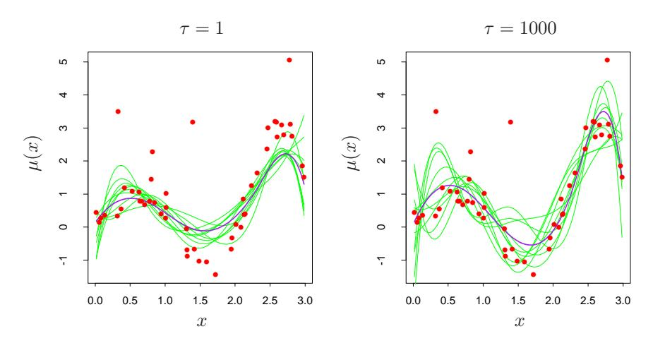

**FIGURE 8.4.** Smoothing example: Ten draws from the posterior distribution for the function  $\mu(x)$ , for two different values of the prior variance  $\tau$ . The purple curves are the posterior means.

of Figure 8.2 on page 263. This similarity is no accident. As  $\tau \to \infty$ , the posterior distribution (8.27) and the bootstrap distribution (8.7) coincide. On the other hand, for  $\tau = 1$ , the posterior curves  $\mu(x)$  in the left panel of Figure 8.4 are smoother than the bootstrap curves, because we have imposed more prior weight on smoothness.

The distribution (8.25) with  $\tau \to \infty$  is called a noninformative prior for  $\theta$ . In Gaussian models, maximum likelihood and parametric bootstrap analyses tend to agree with Bayesian analyses that use a noninformative prior for the free parameters. These tend to agree, because with a constant prior, the posterior distribution is proportional to the likelihood. This correspondence also extends to the nonparametric case, where the nonparametric bootstrap approximates a noninformative Bayes analysis; Section 8.4 has the details.

We have, however, done some things that are not proper from a Bayesian point of view. We have used a noninformative (constant) prior for  $\sigma^2$  and replaced it with the maximum likelihood estimate  $\hat{\sigma}^2$  in the posterior. A more standard Bayesian analysis would also put a prior on  $\sigma$  (typically  $g(\sigma) \propto 1/\sigma$ ), calculate a joint posterior for  $\mu(x)$  and  $\sigma$ , and then integrate out  $\sigma$ , rather than just extract the maximum of the posterior distribution ("MAP" estimate).

# 8.4 Relationship Between the Bootstrap and Bayesian Inference

Consider first a very simple example, in which we observe a single observation z from a normal distribution

$$z \sim N(\theta, 1). \tag{8.29}$$

To carry out a Bayesian analysis for  $\theta$ , we need to specify a prior. The most convenient and common choice would be  $\theta \sim N(0, \tau)$  giving posterior distribution

$$\theta|z \sim N\left(\frac{z}{1+1/\tau}, \frac{1}{1+1/\tau}\right).$$
 (8.30)

Now the larger we take  $\tau$ , the more concentrated the posterior becomes around the maximum likelihood estimate  $\hat{\theta} = z$ . In the limit as  $\tau \to \infty$  we obtain a noninformative (constant) prior, and the posterior distribution is

$$\theta|z \sim N(z, 1). \tag{8.31}$$

This is the same as a parametric bootstrap distribution in which we generate bootstrap values  $z^*$  from the maximum likelihood estimate of the sampling density N(z, 1).

There are three ingredients that make this correspondence work:

- 1. The choice of noninformative prior for  $\theta$ .
- 2. The dependence of the log-likelihood  $\ell(\theta; \mathbf{Z})$  on the data  $\mathbf{Z}$  only through the maximum likelihood estimate  $\hat{\theta}$ . Hence we can write the log-likelihood as  $\ell(\theta; \hat{\theta})$ .
- 3. The symmetry of the log-likelihood in  $\theta$  and  $\hat{\theta}$ , that is,  $\ell(\theta; \hat{\theta}) = \ell(\hat{\theta}; \theta) + \text{constant}$ .

Properties (2) and (3) essentially only hold for the Gaussian distribution. However, they also hold approximately for the multinomial distribution, leading to a correspondence between the nonparametric bootstrap and Bayes inference, which we outline next.

Assume that we have a discrete sample space with L categories. Let  $w_j$  be the probability that a sample point falls in category j, and  $\hat{w}_j$  the observed proportion in category j. Let  $w = (w_1, w_2, \ldots, w_L), \hat{w} = (\hat{w}_1, \hat{w}_2, \ldots, \hat{w}_L)$ . Denote our estimator by  $S(\hat{w})$ ; take as a prior distribution for w a symmetric Dirichlet distribution with parameter a:

$$w \sim \text{Di}_L(a1), \tag{8.32}$$

that is, the prior probability mass function is proportional to  $\prod_{\ell=1}^L w_\ell^{a-1}$ . Then the posterior density of w is

$$w \sim \text{Di}_L(a1 + N\hat{w}),\tag{8.33}$$

where N is the sample size. Letting  $a \to 0$  to obtain a noninformative prior gives

$$w \sim \text{Di}_L(N\hat{w}).$$
 (8.34)

Now the bootstrap distribution, obtained by sampling with replacement from the data, can be expressed as sampling the category proportions from a multinomial distribution. Specifically,

$$N\hat{w}^* \sim \text{Mult}(N, \hat{w}),$$
 (8.35)

where  $\operatorname{Mult}(N, \hat{w})$  denotes a multinomial distribution, having probability mass function  $\binom{N \hat{w}_1^N, \dots, N \hat{w}_L^*}{N \hat{w}_\ell^*}$ . This distribution is similar to the posterior distribution above, having the same support, same mean, and nearly the same covariance matrix. Hence the bootstrap distribution of  $S(\hat{w}^*)$  will closely approximate the posterior distribution of S(w).

In this sense, the bootstrap distribution represents an (approximate) nonparametric, noninformative posterior distribution for our parameter. But this bootstrap distribution is obtained painlessly—without having to formally specify a prior and without having to sample from the posterior distribution. Hence we might think of the bootstrap distribution as a "poor man's" Bayes posterior. By perturbing the data, the bootstrap approximates the Bayesian effect of perturbing the parameters, and is typically much simpler to carry out.

## 8.5 The EM Algorithm

The EM algorithm is a popular tool for simplifying difficult maximum likelihood problems. We first describe it in the context of a simple mixture model.

## 8.5.1 Two-Component Mixture Model

In this section we describe a simple mixture model for density estimation, and the associated EM algorithm for carrying out maximum likelihood estimation. This has a natural connection to Gibbs sampling methods for Bayesian inference. Mixture models are discussed and demonstrated in several other parts of the book, in particular Sections 6.8, 12.7 and 13.2.3.

The left panel of Figure 8.5 shows a histogram of the 20 fictitious data points in Table 8.1.

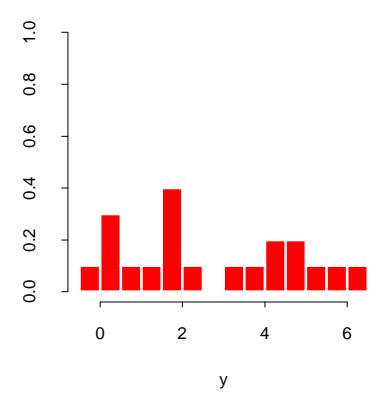

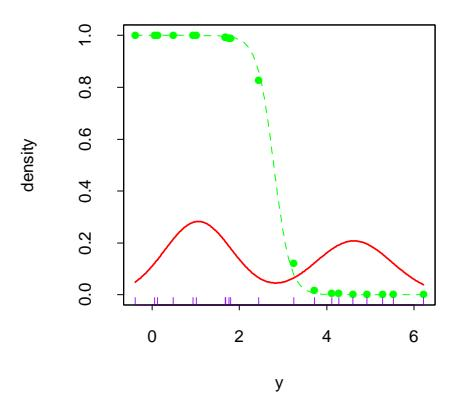

**FIGURE 8.5.** Mixture example. (Left panel:) Histogram of data. (Right panel:) Maximum likelihood fit of Gaussian densities (solid red) and responsibility (dotted green) of the left component density for observation y, as a function of y.

**TABLE 8.1.** Twenty fictitious data points used in the two-component mixture example in Figure 8.5.

| -0.39 | 0.12 | 0.94 | 1.67 | 1.76 | 2.44 | 3.72 | 4.28 | 4.92 | 5.53 |
|-------|------|------|------|------|------|------|------|------|------|
| 0.06  | 0.48 | 1.01 | 1.68 | 1.80 | 3.25 | 4.12 | 4.60 | 5.28 | 6.22 |

We would like to model the density of the data points, and due to the apparent bi-modality, a Gaussian distribution would not be appropriate. There seems to be two separate underlying regimes, so instead we model Y as a mixture of two normal distributions:

$$Y_1 \sim N(\mu_1, \sigma_1^2),$$
  
 $Y_2 \sim N(\mu_2, \sigma_2^2),$  (8.36)  
 $Y = (1 - \Delta) \cdot Y_1 + \Delta \cdot Y_2,$ 

where  $\Delta \in \{0,1\}$  with  $\Pr(\Delta = 1) = \pi$ . This generative representation is explicit: generate a  $\Delta \in \{0,1\}$  with probability  $\pi$ , and then depending on the outcome, deliver either  $Y_1$  or  $Y_2$ . Let  $\phi_{\theta}(x)$  denote the normal density with parameters  $\theta = (\mu, \sigma^2)$ . Then the density of Y is

$$g_Y(y) = (1 - \pi)\phi_{\theta_1}(y) + \pi\phi_{\theta_2}(y). \tag{8.37}$$

Now suppose we wish to fit this model to the data in Figure 8.5 by maximum likelihood. The parameters are

$$\theta = (\pi, \theta_1, \theta_2) = (\pi, \mu_1, \sigma_1^2, \mu_2, \sigma_2^2). \tag{8.38}$$

The log-likelihood based on the N training cases is

$$\ell(\theta; \mathbf{Z}) = \sum_{i=1}^{N} \log[(1-\pi)\phi_{\theta_1}(y_i) + \pi\phi_{\theta_2}(y_i)].$$
 (8.39)

Direct maximization of  $\ell(\theta; \mathbf{Z})$  is quite difficult numerically, because of the sum of terms inside the logarithm. There is, however, a simpler approach. We consider unobserved latent variables  $\Delta_i$  taking values 0 or 1 as in (8.36): if  $\Delta_i = 1$  then  $Y_i$  comes from model 2, otherwise it comes from model 1. Suppose we knew the values of the  $\Delta_i$ 's. Then the log-likelihood would be

$$\ell_0(\theta; \mathbf{Z}, \Delta) = \sum_{i=1}^{N} [(1 - \Delta_i) \log \phi_{\theta_1}(y_i) + \Delta_i \log \phi_{\theta_2}(y_i)] + \sum_{i=1}^{N} [(1 - \Delta_i) \log (1 - \pi) + \Delta_i \log \pi], \quad (8.40)$$

and the maximum likelihood estimates of  $\mu_1$  and  $\sigma_1^2$  would be the sample mean and variance for those data with  $\Delta_i = 0$ , and similarly those for  $\mu_2$  and  $\sigma_2^2$  would be the sample mean and variance of the data with  $\Delta_i = 1$ . The estimate of  $\pi$  would be the proportion of  $\Delta_i = 1$ .

Since the values of the  $\Delta_i$ 's are actually unknown, we proceed in an iterative fashion, substituting for each  $\Delta_i$  in (8.40) its expected value

$$\gamma_i(\theta) = \mathcal{E}(\Delta_i | \theta, \mathbf{Z}) = \Pr(\Delta_i = 1 | \theta, \mathbf{Z}),$$
 (8.41)

also called the responsibility of model 2 for observation i. We use a procedure called the EM algorithm, given in Algorithm 8.1 for the special case of Gaussian mixtures. In the expectation step, we do a soft assignment of each observation to each model: the current estimates of the parameters are used to assign responsibilities according to the relative density of the training points under each model. In the maximization step, these responsibilities are used in weighted maximum-likelihood fits to update the estimates of the parameters.

A good way to construct initial guesses for  $\hat{\mu}_1$  and  $\hat{\mu}_2$  is simply to choose two of the  $y_i$  at random. Both  $\hat{\sigma}_1^2$  and  $\hat{\sigma}_2^2$  can be set equal to the overall sample variance  $\sum_{i=1}^N (y_i - \bar{y})^2 / N$ . The mixing proportion  $\hat{\pi}$  can be started at the value 0.5.

Note that the actual maximizer of the likelihood occurs when we put a spike of infinite height at any one data point, that is,  $\hat{\mu}_1=y_i$  for some i and  $\hat{\sigma}_1^2=0$ . This gives infinite likelihood, but is not a useful solution. Hence we are actually looking for a good local maximum of the likelihood, one for which  $\hat{\sigma}_1^2, \hat{\sigma}_2^2>0$ . To further complicate matters, there can be more than one local maximum having  $\hat{\sigma}_1^2, \hat{\sigma}_2^2>0$ . In our example, we ran the EM algorithm with a number of different initial guesses for the parameters, all having  $\hat{\sigma}_k^2>0.5$ , and chose the run that gave us the highest maximized likelihood. Figure 8.6 shows the progress of the EM algorithm in maximizing the log-likelihood. Table 8.2 shows  $\hat{\pi}=\sum_i \hat{\gamma}_i/N$ , the maximum likelihood estimate of the proportion of observations in class 2, at selected iterations of the EM procedure.

#### Algorithm 8.1 EM Algorithm for Two-component Gaussian Mixture.

- 1. Take initial guesses for the parameters  $\hat{\mu}_1, \hat{\sigma}_1^2, \hat{\mu}_2, \hat{\sigma}_2^2, \hat{\pi}$  (see text).
- 2. Expectation Step: compute the responsibilities

$$\hat{\gamma}_i = \frac{\hat{\pi}\phi_{\hat{\theta}_2}(y_i)}{(1-\hat{\pi})\phi_{\hat{\theta}_1}(y_i) + \hat{\pi}\phi_{\hat{\theta}_2}(y_i)}, \ i = 1, 2, \dots, N.$$
 (8.42)

3. Maximization Step: compute the weighted means and variances:

$$\hat{\mu}_{1} = \frac{\sum_{i=1}^{N} (1 - \hat{\gamma}_{i}) y_{i}}{\sum_{i=1}^{N} (1 - \hat{\gamma}_{i})}, \qquad \hat{\sigma}_{1}^{2} = \frac{\sum_{i=1}^{N} (1 - \hat{\gamma}_{i}) (y_{i} - \hat{\mu}_{1})^{2}}{\sum_{i=1}^{N} (1 - \hat{\gamma}_{i})},$$

$$\hat{\mu}_{2} = \frac{\sum_{i=1}^{N} \hat{\gamma}_{i} y_{i}}{\sum_{i=1}^{N} \hat{\gamma}_{i}}, \qquad \hat{\sigma}_{2}^{2} = \frac{\sum_{i=1}^{N} \hat{\gamma}_{i} (y_{i} - \hat{\mu}_{2})^{2}}{\sum_{i=1}^{N} \hat{\gamma}_{i}},$$

and the mixing probability  $\hat{\pi} = \sum_{i=1}^{N} \hat{\gamma}_i / N$ .

4. Iterate steps 2 and 3 until convergence.

**TABLE 8.2.** Selected iterations of the EM algorithm for mixture example.

| Iteration | $\hat{\pi}$ |
|-----------|-------------|
| 1         | 0.485       |
| 5         | 0.493       |
| 10        | 0.523       |
| 15        | 0.544       |
| 20        | 0.546       |

The final maximum likelihood estimates are

$$\begin{split} \hat{\mu}_1 &= 4.62, & \hat{\sigma}_1^2 &= 0.87, \\ \hat{\mu}_2 &= 1.06, & \hat{\sigma}_2^2 &= 0.77, \\ & \hat{\pi} &= 0.546. \end{split}$$

The right panel of Figure 8.5 shows the estimated Gaussian mixture density from this procedure (solid red curve), along with the responsibilities (dotted green curve). Note that mixtures are also useful for supervised learning; in Section 6.7 we show how the Gaussian mixture model leads to a version of radial basis functions.

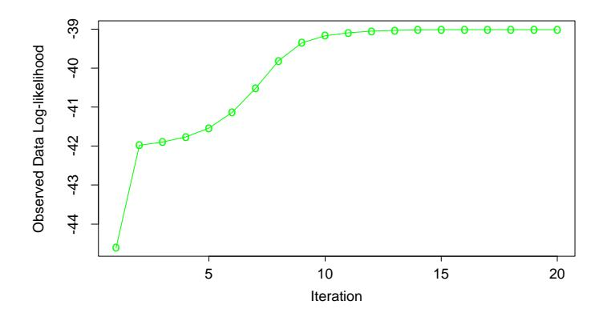

**FIGURE 8.6.** EM algorithm: observed data log-likelihood as a function of the iteration number.

#### 8.5.2 The EM Algorithm in General

The above procedure is an example of the EM (or Baum–Welch) algorithm for maximizing likelihoods in certain classes of problems. These problems are ones for which maximization of the likelihood is difficult, but made easier by enlarging the sample with latent (unobserved) data. This is called data augmentation. Here the latent data are the model memberships  $\Delta_i$ . In other problems, the latent data are actual data that should have been observed but are missing.

Algorithm 8.2 gives the general formulation of the EM algorithm. Our observed data is  $\mathbf{Z}$ , having log-likelihood  $\ell(\theta; \mathbf{Z})$  depending on parameters  $\theta$ . The latent or missing data is  $\mathbf{Z}^m$ , so that the complete data is  $\mathbf{T} = (\mathbf{Z}, \mathbf{Z}^m)$  with log-likelihood  $\ell_0(\theta; \mathbf{T})$ ,  $\ell_0$  based on the complete density. In the mixture problem  $(\mathbf{Z}, \mathbf{Z}^m) = (\mathbf{y}, \Delta)$ , and  $\ell_0(\theta; \mathbf{T})$  is given in (8.40).

In our mixture example,  $E(\ell_0(\theta'; \mathbf{T})|\mathbf{Z}, \hat{\theta}^{(j)})$  is simply (8.40) with the  $\Delta_i$  replaced by the responsibilities  $\hat{\gamma}_i(\hat{\theta})$ , and the maximizers in step 3 are just weighted means and variances.

We now give an explanation of why the EM algorithm works in general. Since

$$\Pr(\mathbf{Z}^m|\mathbf{Z}, \theta') = \frac{\Pr(\mathbf{Z}^m, \mathbf{Z}|\theta')}{\Pr(\mathbf{Z}|\theta')},$$
(8.44)

we can write

$$\Pr(\mathbf{Z}|\theta') = \frac{\Pr(\mathbf{T}|\theta')}{\Pr(\mathbf{Z}^m|\mathbf{Z},\theta')}.$$
(8.45)

In terms of log-likelihoods, we have  $\ell(\theta'; \mathbf{Z}) = \ell_0(\theta'; \mathbf{T}) - \ell_1(\theta'; \mathbf{Z}^m | \mathbf{Z})$ , where  $\ell_1$  is based on the conditional density  $\Pr(\mathbf{Z}^m | \mathbf{Z}, \theta')$ . Taking conditional expectations with respect to the distribution of  $\mathbf{T} | \mathbf{Z}$  governed by parameter  $\theta$  gives

$$\ell(\theta'; \mathbf{Z}) = \mathrm{E}[\ell_0(\theta'; \mathbf{T}) | \mathbf{Z}, \theta] - \mathrm{E}[\ell_1(\theta'; \mathbf{Z}^m | \mathbf{Z}) | \mathbf{Z}, \theta]$$

#### Algorithm 8.2 The EM Algorithm.

- 1. Start with initial guesses for the parameters  $\hat{\theta}^{(0)}$ .
- 2. Expectation Step: at the jth step, compute

$$Q(\theta', \hat{\theta}^{(j)}) = \mathcal{E}(\ell_0(\theta'; \mathbf{T}) | \mathbf{Z}, \hat{\theta}^{(j)})$$
(8.43)

as a function of the dummy argument  $\theta'$ .

- 3. Maximization Step: determine the new estimate  $\hat{\theta}^{(j+1)}$  as the maximizer of  $Q(\theta', \hat{\theta}^{(j)})$  over  $\theta'$ .
- 4. Iterate steps 2 and 3 until convergence.

$$\equiv Q(\theta', \theta) - R(\theta', \theta). \tag{8.46}$$

In the M step, the EM algorithm maximizes  $Q(\theta', \theta)$  over  $\theta'$ , rather than the actual objective function  $\ell(\theta'; \mathbf{Z})$ . Why does it succeed in maximizing  $\ell(\theta'; \mathbf{Z})$ ? Note that  $R(\theta^*, \theta)$  is the expectation of a log-likelihood of a density (indexed by  $\theta^*$ ), with respect to the same density indexed by  $\theta$ , and hence (by Jensen's inequality) is maximized as a function of  $\theta^*$ , when  $\theta^* = \theta$  (see Exercise 8.1). So if  $\theta'$  maximizes  $Q(\theta', \theta)$ , we see that

$$\ell(\theta'; \mathbf{Z}) - \ell(\theta; \mathbf{Z}) = [Q(\theta', \theta) - Q(\theta, \theta)] - [R(\theta', \theta) - R(\theta, \theta)]$$

$$\geq 0. \tag{8.47}$$

Hence the EM iteration never decreases the log-likelihood.

This argument also makes it clear that a full maximization in the M step is not necessary: we need only to find a value  $\hat{\theta}^{(j+1)}$  so that  $Q(\theta', \hat{\theta}^{(j)})$  increases as a function of the first argument, that is,  $Q(\hat{\theta}^{(j+1)}, \hat{\theta}^{(j)}) > Q(\hat{\theta}^{(j)}, \hat{\theta}^{(j)})$ . Such procedures are called GEM (generalized EM) algorithms. The EM algorithm can also be viewed as a minorization procedure: see Exercise 8.7.

#### 8.5.3 EM as a Maximization–Maximization Procedure

Here is a different view of the EM procedure, as a joint maximization algorithm. Consider the function

$$F(\theta', \tilde{P}) = \mathcal{E}_{\tilde{P}}[\ell_0(\theta'; \mathbf{T})] - \mathcal{E}_{\tilde{P}}[\log \tilde{P}(\mathbf{Z}^m)]. \tag{8.48}$$

Here  $\tilde{P}(\mathbf{Z}^m)$  is any distribution over the latent data  $\mathbf{Z}^m$ . In the mixture example,  $\tilde{P}(\mathbf{Z}^m)$  comprises the set of probabilities  $\gamma_i = \Pr(\Delta_i = 1 | \theta, \mathbf{Z})$ . Note that F evaluated at  $\tilde{P}(\mathbf{Z}^m) = \Pr(\mathbf{Z}^m | \mathbf{Z}, \theta')$ , is the log-likelihood of

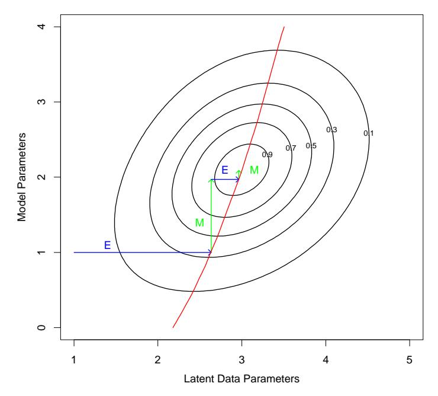

**FIGURE 8.7.** Maximization–maximization view of the EM algorithm. Shown are the contours of the (augmented) observed data log-likelihood  $F(\theta', \tilde{P})$ . The E step is equivalent to maximizing the log-likelihood over the parameters of the latent data distribution. The M step maximizes it over the parameters of the log-likelihood. The red curve corresponds to the observed data log-likelihood, a profile obtained by maximizing  $F(\theta', \tilde{P})$  for each value of  $\theta'$ .

the observed data, from  $(8.46)^1$ . The function F expands the domain of the log-likelihood, to facilitate its maximization.

The EM algorithm can be viewed as a joint maximization method for F over  $\theta'$  and  $\tilde{P}(\mathbf{Z}^m)$ , by fixing one argument and maximizing over the other. The maximizer over  $\tilde{P}(\mathbf{Z}^m)$  for fixed  $\theta'$  can be shown to be

$$\tilde{P}(\mathbf{Z}^m) = \Pr(\mathbf{Z}^m | \mathbf{Z}, \theta') \tag{8.49}$$

(Exercise 8.2). This is the distribution computed by the E step, for example, (8.42) in the mixture example. In the M step, we maximize  $F(\theta', \tilde{P})$  over  $\theta'$  with  $\tilde{P}$  fixed: this is the same as maximizing the first term  $E_{\tilde{P}}[\ell_0(\theta'; \mathbf{T}) | \mathbf{Z}, \theta]$  since the second term does not involve  $\theta'$ .

Finally, since  $F(\theta', \vec{P})$  and the observed data log-likelihood agree when  $\tilde{P}(\mathbf{Z}^m) = \Pr(\mathbf{Z}^m | \mathbf{Z}, \theta')$ , maximization of the former accomplishes maximization of the latter. Figure 8.7 shows a schematic view of this process. This view of the EM algorithm leads to alternative maximization proce-

&lt;sup>1 (8.46) holds for all  $\theta$ , including  $\theta = \theta'$ .

#### Algorithm 8.3 Gibbs Sampler.

- 1. Take some initial values  $U_k^{(0)}, k = 1, 2, \dots, K$ .
- 2. Repeat for t = 1, 2, ..., :

For 
$$k = 1, 2, ..., K$$
 generate  $U_k^{(t)}$  from  $\Pr(U_k^{(t)} | U_1^{(t)}, ..., U_{k-1}^{(t)}, U_{k+1}^{(t-1)}, ..., U_K^{(t-1)})$ .

3. Continue step 2 until the joint distribution of  $(U_1^{(t)}, U_2^{(t)}, \dots, U_K^{(t)})$  does not change.

dures. For example, one does not need to maximize with respect to all of the latent data parameters at once, but could instead maximize over one of them at a time, alternating with the M step.

# 8.6 MCMC for Sampling from the Posterior

Having defined a Bayesian model, one would like to draw samples from the resulting posterior distribution, in order to make inferences about the parameters. Except for simple models, this is often a difficult computational problem. In this section we discuss the *Markov chain Monte Carlo* (MCMC) approach to posterior sampling. We will see that Gibbs sampling, an MCMC procedure, is closely related to the EM algorithm: the main difference is that it samples from the conditional distributions rather than maximizing over them.

Consider first the following abstract problem. We have random variables  $U_1, U_2, \ldots, U_K$  and we wish to draw a sample from their joint distribution. Suppose this is difficult to do, but it is easy to simulate from the conditional distributions  $\Pr(U_j|U_1, U_2, \ldots, U_{j-1}, U_{j+1}, \ldots, U_K), \ j=1,2,\ldots,K$ . The Gibbs sampling procedure alternatively simulates from each of these distributions and when the process stabilizes, provides a sample from the desired joint distribution. The procedure is defined in Algorithm 8.3.

Under regularity conditions it can be shown that this procedure eventually stabilizes, and the resulting random variables are indeed a sample from the joint distribution of  $U_1, U_2, \ldots, U_K$ . This occurs despite the fact that the samples  $(U_1^{(t)}, U_2^{(t)}, \ldots, U_K^{(t)})$  are clearly not independent for different t. More formally, Gibbs sampling produces a Markov chain whose stationary distribution is the true joint distribution, and hence the term "Markov chain Monte Carlo." It is not surprising that the true joint distribution is stationary under this process, as the successive steps leave the marginal distributions of the  $U_k$ 's unchanged.

Note that we don't need to know the explicit form of the conditional densities, but just need to be able to sample from them. After the procedure reaches stationarity, the marginal density of any subset of the variables can be approximated by a density estimate applied to the sample values. However if the explicit form of the conditional density  $\Pr(U_k, | U_\ell, \ell \neq k)$  is available, a better estimate of say the marginal density of  $U_k$  can be obtained from (Exercise 8.3):

$$\widehat{\Pr}_{U_k}(u) = \frac{1}{(M-m+1)} \sum_{t=m}^{M} \Pr(u|U_{\ell}^{(t)}, \ell \neq k).$$
 (8.50)

Here we have averaged over the last M-m+1 members of the sequence, to allow for an initial "burn-in" period before stationarity is reached.

Now getting back to Bayesian inference, our goal is to draw a sample from the joint posterior of the parameters given the data **Z**. Gibbs sampling will be helpful if it is easy to sample from the conditional distribution of each parameter given the other parameters and **Z**. An example—the Gaussian mixture problem—is detailed next.

There is a close connection between Gibbs sampling from a posterior and the EM algorithm in exponential family models. The key is to consider the latent data  $\mathbf{Z}^m$  from the EM procedure to be another parameter for the Gibbs sampler. To make this explicit for the Gaussian mixture problem, we take our parameters to be  $(\theta, \mathbf{Z}^m)$ . For simplicity we fix the variances  $\sigma_1^2, \sigma_2^2$  and mixing proportion  $\pi$  at their maximum likelihood values so that the only unknown parameters in  $\theta$  are the means  $\mu_1$  and  $\mu_2$ . The Gibbs sampler for the mixture problem is given in Algorithm 8.4. We see that steps 2(a) and 2(b) are the same as the E and M steps of the EM procedure, except that we sample rather than maximize. In step 2(a), rather than compute the maximum likelihood responsibilities  $\gamma_i = \mathrm{E}(\Delta_i | \theta, \mathbf{Z})$ , the Gibbs sampling procedure simulates the latent data  $\Delta_i$  from the distributions  $\mathrm{Pr}(\Delta_i | \theta, \mathbf{Z})$ . In step 2(b), rather than compute the maximizers of the posterior  $\mathrm{Pr}(\mu_1, \mu_2, \Delta | \mathbf{Z})$  we simulate from the conditional distribution  $\mathrm{Pr}(\mu_1, \mu_2 | \Delta, \mathbf{Z})$ .

Figure 8.8 shows 200 iterations of Gibbs sampling, with the mean parameters  $\mu_1$  (lower) and  $\mu_2$  (upper) shown in the left panel, and the proportion of class 2 observations  $\sum_i \Delta_i/N$  on the right. Horizontal broken lines have been drawn at the maximum likelihood estimate values  $\hat{\mu}_1, \hat{\mu}_2$  and  $\sum_i \hat{\gamma}_i/N$  in each case. The values seem to stabilize quite quickly, and are distributed evenly around the maximum likelihood values.

The above mixture model was simplified, in order to make the clear connection between Gibbs sampling and the EM algorithm. More realistically, one would put a prior distribution on the variances  $\sigma_1^2$ ,  $\sigma_2^2$  and mixing proportion  $\pi$ , and include separate Gibbs sampling steps in which we sample from their posterior distributions, conditional on the other parameters. One can also incorporate proper (informative) priors for the mean parameters.

#### Algorithm 8.4 Gibbs sampling for mixtures.

- 1. Take some initial values  $\theta^{(0)}=(\mu_1^{(0)},\mu_2^{(0)}).$
- 2. Repeat for t = 1, 2, ..., ...
  - (a) For  $i=1,2,\ldots,N$  generate  $\Delta_i^{(t)}\in\{0,1\}$  with  $\Pr(\Delta_i^{(t)}=1)=\hat{\gamma}_i(\theta^{(t)})$ , from equation (8.42).
  - (b) Set

$$\hat{\mu}_{1} = \frac{\sum_{i=1}^{N} (1 - \Delta_{i}^{(t)}) \cdot y_{i}}{\sum_{i=1}^{N} (1 - \Delta_{i}^{(t)})},$$

$$\hat{\mu}_{2} = \frac{\sum_{i=1}^{N} \Delta_{i}^{(t)} \cdot y_{i}}{\sum_{i=1}^{N} \Delta_{i}^{(t)}},$$

and generate  $\mu_1^{(t)} \sim N(\hat{\mu}_1, \hat{\sigma}_1^2)$  and  $\mu_2^{(t)} \sim N(\hat{\mu}_2, \hat{\sigma}_2^2)$ .

3. Continue step 2 until the joint distribution of  $(\Delta^{(t)}, \mu_1^{(t)}, \mu_2^{(t)})$  doesn't change

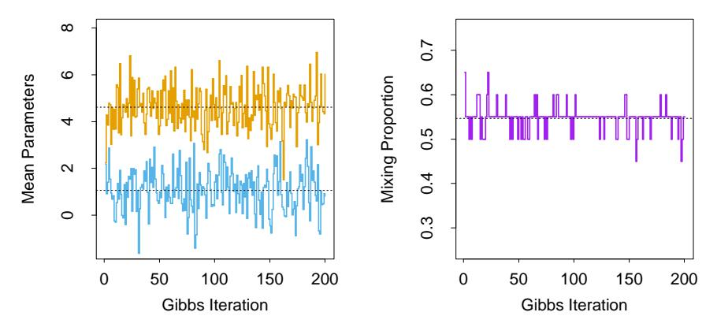

**FIGURE 8.8.** Mixture example. (Left panel:) 200 values of the two mean parameters from Gibbs sampling; horizontal lines are drawn at the maximum likelihood estimates  $\hat{\mu}_1$ ,  $\hat{\mu}_2$ . (Right panel:) Proportion of values with  $\Delta_i = 1$ , for each of the 200 Gibbs sampling iterations; a horizontal line is drawn at  $\sum_i \hat{\gamma}_i / N$ .

eters. These priors must not be improper as this will lead to a degenerate posterior, with all the mixing weight on one component.

Gibbs sampling is just one of a number of recently developed procedures for sampling from posterior distributions. It uses conditional sampling of each parameter given the rest, and is useful when the structure of the problem makes this sampling easy to carry out. Other methods do not require such structure, for example the *Metropolis–Hastings* algorithm. These and other computational Bayesian methods have been applied to sophisticated learning algorithms such as Gaussian process models and neural networks. Details may be found in the references given in the Bibliographic Notes at the end of this chapter.

# 8.7 Bagging

Earlier we introduced the bootstrap as a way of assessing the accuracy of a parameter estimate or a prediction. Here we show how to use the bootstrap to improve the estimate or prediction itself. In Section 8.4 we investigated the relationship between the bootstrap and Bayes approaches, and found that the bootstrap mean is approximately a posterior average. Bagging further exploits this connection.

Consider first the regression problem. Suppose we fit a model to our training data  $\mathbf{Z} = \{(x_1, y_1), (x_2, y_2), \dots, (x_N, y_N)\}$ , obtaining the prediction  $\hat{f}(x)$  at input x. Bootstrap aggregation or bagging averages this prediction over a collection of bootstrap samples, thereby reducing its variance. For each bootstrap sample  $\mathbf{Z}^{*b}$ ,  $b = 1, 2, \dots, B$ , we fit our model, giving prediction  $\hat{f}^{*b}(x)$ . The bagging estimate is defined by

$$\hat{f}_{\text{bag}}(x) = \frac{1}{B} \sum_{b=1}^{B} \hat{f}^{*b}(x).$$
 (8.51)

Denote by  $\hat{\mathcal{P}}$  the empirical distribution putting equal probability 1/N on each of the data points  $(x_i,y_i)$ . In fact the "true" bagging estimate is defined by  $\mathbf{E}_{\hat{\mathcal{P}}}\hat{f}^*(x)$ , where  $\mathbf{Z}^* = \{(x_1^*,y_1^*),(x_2^*,y_2^*),\dots,(x_N^*,y_N^*)\}$  and each  $(x_i^*,y_i^*) \sim \hat{\mathcal{P}}$ . Expression (8.51) is a Monte Carlo estimate of the true bagging estimate, approaching it as  $B \to \infty$ .

The bagged estimate (8.51) will differ from the original estimate  $\hat{f}(x)$  only when the latter is a nonlinear or adaptive function of the data. For example, to bag the B-spline smooth of Section 8.2.1, we average the curves in the bottom left panel of Figure 8.2 at each value of x. The B-spline smoother is linear in the data if we fix the inputs; hence if we sample using the parametric bootstrap in equation (8.6), then  $\hat{f}_{\text{bag}}(x) \to \hat{f}(x)$  as  $B \to \infty$  (Exercise 8.4). Hence bagging just reproduces the original smooth in the

top left panel of Figure 8.2. The same is approximately true if we were to bag using the nonparametric bootstrap.

A more interesting example is a regression tree, where  $\hat{f}(x)$  denotes the tree's prediction at input vector x (regression trees are described in Chapter 9). Each bootstrap tree will typically involve different features than the original, and might have a different number of terminal nodes. The bagged estimate is the average prediction at x from these B trees.

Now suppose our tree produces a classifier G(x) for a K-class response. Here it is useful to consider an underlying indicator-vector function  $\hat{f}(x)$ , with value a single one and K-1 zeroes, such that  $\hat{G}(x) = \arg\max_k \hat{f}(x)$ . Then the bagged estimate  $\hat{f}_{\text{bag}}(x)$  (8.51) is a K-vector  $[p_1(x), p_2(x), \ldots, p_K(x)]$ , with  $p_k(x)$  equal to the proportion of trees predicting class k at x. The bagged classifier selects the class with the most "votes" from the B trees,  $\hat{G}_{\text{bag}}(x) = \arg\max_k \hat{f}_{\text{bag}}(x)$ .

Often we require the class-probability estimates at x, rather than the classifications themselves. It is tempting to treat the voting proportions  $p_k(x)$  as estimates of these probabilities. A simple two-class example shows that they fail in this regard. Suppose the true probability of class 1 at x is 0.75, and each of the bagged classifiers accurately predict a 1. Then  $p_1(x) = 1$ , which is incorrect. For many classifiers  $\hat{G}(x)$ , however, there is already an underlying function  $\hat{f}(x)$  that estimates the class probabilities at x (for trees, the class proportions in the terminal node). An alternative bagging strategy is to average these instead, rather than the vote indicator vectors. Not only does this produce improved estimates of the class probabilities, but it also tends to produce bagged classifiers with lower variance, especially for small B (see Figure 8.10 in the next example).

#### 8.7.1 Example: Trees with Simulated Data

We generated a sample of size N=30, with two classes and p=5 features, each having a standard Gaussian distribution with pairwise correlation 0.95. The response Y was generated according to  $\Pr(Y=1|x_1 \leq 0.5)=0.2$ ,  $\Pr(Y=1|x_1>0.5)=0.8$ . The Bayes error is 0.2. A test sample of size 2000 was also generated from the same population. We fit classification trees to the training sample and to each of 200 bootstrap samples (classification trees are described in Chapter 9). No pruning was used. Figure 8.9 shows the original tree and eleven bootstrap trees. Notice how the trees are all different, with different splitting features and cutpoints. The test error for the original tree and the bagged tree is shown in Figure 8.10. In this example the trees have high variance due to the correlation in the predictors. Bagging succeeds in smoothing out this variance and hence reducing the test error.

Bagging can dramatically reduce the variance of unstable procedures like trees, leading to improved prediction. A simple argument shows why

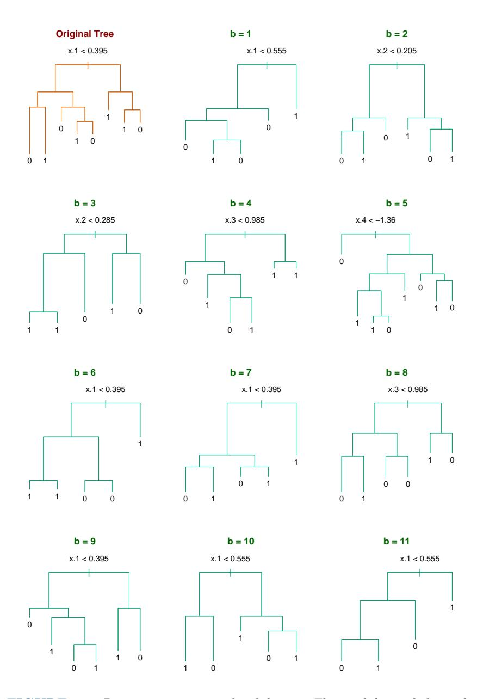

FIGURE 8.9. Bagging trees on simulated dataset. The top left panel shows the original tree. Eleven trees grown on bootstrap samples are shown. For each tree, the top split is annotated.

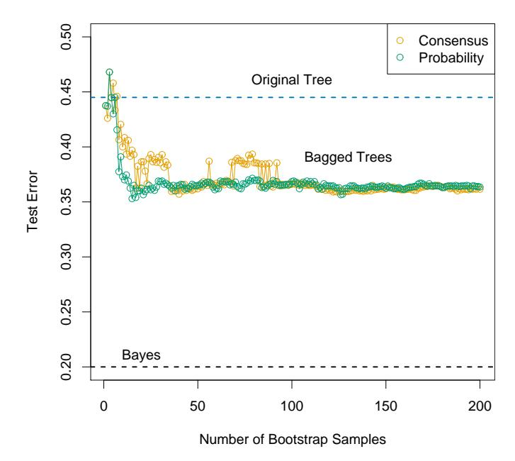

**FIGURE 8.10.** Error curves for the bagging example of Figure 8.9. Shown is the test error of the original tree and bagged trees as a function of the number of bootstrap samples. The orange points correspond to the consensus vote, while the green points average the probabilities.

bagging helps under squared-error loss, in short because averaging reduces variance and leaves bias unchanged.

Assume our training observations  $(x_i, y_i)$ , i = 1, ..., N are independently drawn from a distribution  $\mathcal{P}$ , and consider the ideal aggregate estimator  $f_{ag}(x) = \mathbb{E}_{\mathcal{P}} \hat{f}^*(x)$ . Here x is fixed and the bootstrap dataset  $\mathbf{Z}^*$  consists of observations  $x_i^*, y_i^*, i = 1, 2, ..., N$  sampled from  $\mathcal{P}$ . Note that  $f_{ag}(x)$  is a bagging estimate, drawing bootstrap samples from the actual population  $\mathcal{P}$  rather than the data. It is not an estimate that we can use in practice, but is convenient for analysis. We can write

$$E_{\mathcal{P}}[Y - \hat{f}^{*}(x)]^{2} = E_{\mathcal{P}}[Y - f_{ag}(x) + f_{ag}(x) - \hat{f}^{*}(x)]^{2}$$

$$= E_{\mathcal{P}}[Y - f_{ag}(x)]^{2} + E_{\mathcal{P}}[\hat{f}^{*}(x) - f_{ag}(x)]^{2}$$

$$\geq E_{\mathcal{P}}[Y - f_{ag}(x)]^{2}. \tag{8.52}$$

The extra error on the right-hand side comes from the variance of  $f^*(x)$  around its mean  $f_{\rm ag}(x)$ . Therefore true population aggregation never increases mean squared error. This suggests that bagging—drawing samples from the training data— will often decrease mean-squared error.

The above argument does not hold for classification under 0-1 loss, because of the nonadditivity of bias and variance. In that setting, bagging a

good classifier can make it better, but bagging a bad classifier can make it worse. Here is a simple example, using a randomized rule. Suppose Y=1 for all x, and the classifier  $\hat{G}(x)$  predicts Y=1 (for all x) with probability 0.4 and predicts Y=0 (for all x) with probability 0.6. Then the misclassification error of  $\hat{G}(x)$  is 0.6 but that of the bagged classifier is 1.0.

For classification we can understand the bagging effect in terms of a consensus of independent weak learners (Dietterich, 2000a). Let the Bayes optimal decision at x be G(x)=1 in a two-class example. Suppose each of the weak learners  $G_b^*$  have an error-rate  $e_b=e<0.5$ , and let  $S_1(x)=\sum_{b=1}^B I(G_b^*(x)=1)$  be the consensus vote for class 1. Since the weak learners are assumed to be independent,  $S_1(x)\sim \text{Bin}(B,1-e)$ , and  $\Pr(S_1>B/2)\to 1$  as B gets large. This concept has been popularized outside of statistics as the "Wisdom of Crowds" (Surowiecki, 2004) — the collective knowledge of a diverse and independent body of people typically exceeds the knowledge of any single individual, and can be harnessed by voting. Of course, the main caveat here is "independent," and bagged trees are not. Figure 8.11 illustrates the power of a consensus vote in a simulated example, where only 30% of the voters have some knowledge.

In Chapter 15 we see how random forests improve on bagging by reducing the correlation between the sampled trees.

Note that when we bag a model, any simple structure in the model is lost. As an example, a bagged tree is no longer a tree. For interpretation of the model this is clearly a drawback. More stable procedures like nearest neighbors are typically not affected much by bagging. Unfortunately, the unstable models most helped by bagging are unstable because of the emphasis on interpretability, and this is lost in the bagging process.

Figure 8.12 shows an example where bagging doesn't help. The 100 data points shown have two features and two classes, separated by the gray linear boundary  $x_1 + x_2 = 1$ . We choose as our classifier  $\hat{G}(x)$  a single axis-oriented split, choosing the split along either  $x_1$  or  $x_2$  that produces the largest decrease in training misclassification error.

The decision boundary obtained from bagging the 0-1 decision rule over B=50 bootstrap samples is shown by the blue curve in the left panel. It does a poor job of capturing the true boundary. The single split rule, derived from the training data, splits near 0 (the middle of the range of  $x_1$  or  $x_2$ ), and hence has little contribution away from the center. Averaging the probabilities rather than the classifications does not help here. Bagging estimates the expected class probabilities from the single split rule, that is, averaged over many replications. Note that the expected class probabilities computed by bagging cannot be realized on any single replication, in the same way that a woman cannot have 2.4 children. In this sense, bagging increases somewhat the space of models of the individual base classifier. However, it doesn't help in this and many other examples where a greater enlargement of the model class is needed. "Boosting" is a way of doing this

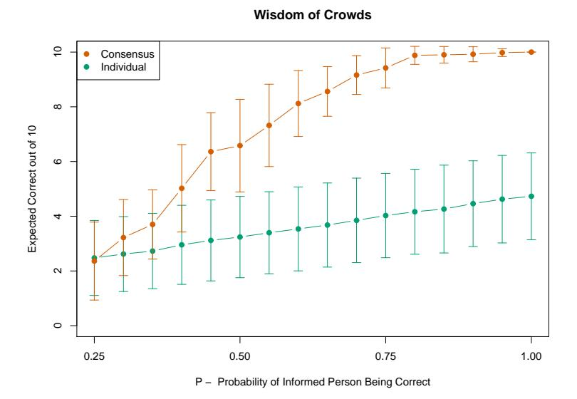

FIGURE 8.11. Simulated academy awards voting. 50 members vote in 10 categories, each with 4 nominations. For any category, only 15 voters have some knowledge, represented by their probability of selecting the "correct" candidate in that category (so P = 0.25 means they have no knowledge). For each category, the 15 experts are chosen at random from the 50. Results show the expected correct (based on 50 simulations) for the consensus, as well as for the individuals. The error bars indicate one standard deviation. We see, for example, that if the 15 informed for a category have a 50% chance of selecting the correct candidate, the consensus doubles the expected performance of an individual.

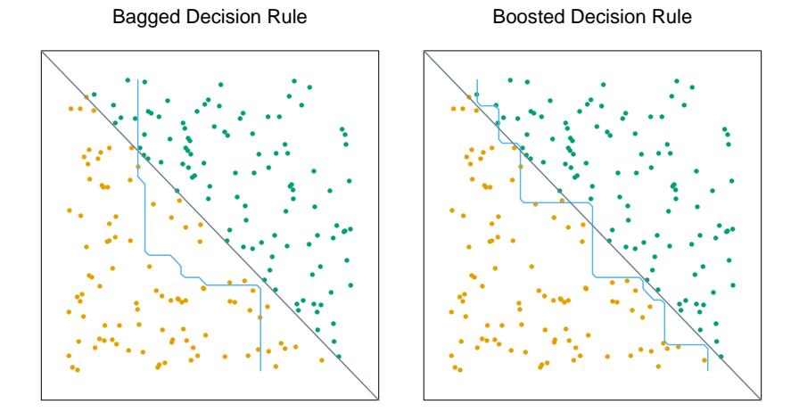

**FIGURE 8.12.** Data with two features and two classes, separated by a linear boundary. (Left panel:) Decision boundary estimated from bagging the decision rule from a single split, axis-oriented classifier. (Right panel:) Decision boundary from boosting the decision rule of the same classifier. The test error rates are 0.166, and 0.065, respectively. Boosting is described in Chapter 10.

and is described in Chapter 10. The decision boundary in the right panel is the result of the boosting procedure, and it roughly captures the diagonal boundary.

# 8.8 Model Averaging and Stacking

In Section 8.4 we viewed bootstrap values of an estimator as approximate posterior values of a corresponding parameter, from a kind of nonparametric Bayesian analysis. Viewed in this way, the bagged estimate (8.51) is an approximate posterior Bayesian mean. In contrast, the training sample estimate  $\hat{f}(x)$  corresponds to the mode of the posterior. Since the posterior mean (not mode) minimizes squared-error loss, it is not surprising that bagging can often reduce mean squared-error.

Here we discuss Bayesian model averaging more generally. We have a set of candidate models  $\mathcal{M}_m$ , m = 1, ..., M for our training set **Z**. These models may be of the same type with different parameter values (e.g., subsets in linear regression), or different models for the same task (e.g., neural networks and regression trees).

Suppose  $\zeta$  is some quantity of interest, for example, a prediction f(x) at some fixed feature value x. The posterior distribution of  $\zeta$  is

$$\Pr(\zeta|\mathbf{Z}) = \sum_{m=1}^{M} \Pr(\zeta|\mathcal{M}_m, \mathbf{Z}) \Pr(\mathcal{M}_m|\mathbf{Z}), \tag{8.53}$$

with posterior mean

$$E(\zeta|\mathbf{Z}) = \sum_{m=1}^{M} E(\zeta|\mathcal{M}_m, \mathbf{Z}) \Pr(\mathcal{M}_m|\mathbf{Z}).$$
(8.54)

This Bayesian prediction is a weighted average of the individual predictions, with weights proportional to the posterior probability of each model.

This formulation leads to a number of different model-averaging strategies. Committee methods take a simple unweighted average of the predictions from each model, essentially giving equal probability to each model. More ambitiously, the development in Section 7.7 shows the BIC criterion can be used to estimate posterior model probabilities. This is applicable in cases where the different models arise from the same parametric model, with different parameter values. The BIC gives weight to each model depending on how well it fits and how many parameters it uses. One can also carry out the Bayesian recipe in full. If each model  $\mathcal{M}_m$  has parameters  $\theta_m$ , we write

$$\Pr(\mathcal{M}_{m}|\mathbf{Z}) \propto \Pr(\mathcal{M}_{m}) \cdot \Pr(\mathbf{Z}|\mathcal{M}_{m})$$

$$\propto \Pr(\mathcal{M}_{m}) \cdot \int \Pr(\mathbf{Z}|\theta_{m}, \mathcal{M}_{m}) \Pr(\theta_{m}|\mathcal{M}_{m}) d\theta_{m}.$$
(8.55)

In principle one can specify priors  $\Pr(\theta_m|\mathcal{M}_m)$  and numerically compute the posterior probabilities from (8.55), to be used as model-averaging weights. However, we have seen no real evidence that this is worth all of the effort, relative to the much simpler BIC approximation.

How can we approach model averaging from a frequentist viewpoint? Given predictions  $\hat{f}_1(x), \hat{f}_2(x), \dots, \hat{f}_M(x)$ , under squared-error loss, we can seek the weights  $w = (w_1, w_2, \dots, w_M)$  such that

$$\hat{w} = \underset{w}{\operatorname{argmin}} \, \mathcal{E}_{\mathcal{P}} \left[ Y - \sum_{m=1}^{M} w_m \hat{f}_m(x) \right]^2. \tag{8.56}$$

Here the input value x is fixed and the N observations in the dataset  $\mathbf{Z}$  (and the target Y) are distributed according to  $\mathcal{P}$ . The solution is the population linear regression of Y on  $\hat{F}(x)^T \equiv [\hat{f}_1(x), \hat{f}_2(x), \dots, \hat{f}_M(x)]$ :

$$\hat{w} = E_{\mathcal{P}}[\hat{F}(x)\hat{F}(x)^T]^{-1}E_{\mathcal{P}}[\hat{F}(x)Y].$$
 (8.57)

Now the full regression has smaller error than any single model

$$E_{\mathcal{P}}\left[Y - \sum_{m=1}^{M} \hat{w}_m \hat{f}_m(x)\right]^2 \le E_{\mathcal{P}}\left[Y - \hat{f}_m(x)\right]^2 \,\forall m \tag{8.58}$$

so combining models never makes things worse, at the population level.

Of course the population linear regression (8.57) is not available, and it is natural to replace it with the linear regression over the training set. But there are simple examples where this does not work well. For example, if  $\hat{f}_m(x)$ ,  $m=1,2,\ldots,M$  represent the prediction from the best subset of inputs of size m among M total inputs, then linear regression would put all of the weight on the largest model, that is,  $\hat{w}_M=1$ ,  $\hat{w}_m=0$ , m< M. The problem is that we have not put each of the models on the same footing by taking into account their complexity (the number of inputs m in this example).

Stacked generalization, or stacking, is a way of doing this. Let  $\hat{f}_m^{-i}(x)$  be the prediction at x, using model m, applied to the dataset with the ith training observation removed. The stacking estimate of the weights is obtained from the least squares linear regression of  $y_i$  on  $\hat{f}_m^{-i}(x_i)$ ,  $m = 1, 2, \ldots, M$ . In detail the stacking weights are given by

$$\hat{w}^{\text{st}} = \underset{w}{\operatorname{argmin}} \sum_{i=1}^{N} \left[ y_i - \sum_{m=1}^{M} w_m \hat{f}_m^{-i}(x_i) \right]^2.$$
 (8.59)

The final prediction is  $\sum_{m} \hat{w}_{m}^{\text{st}} \hat{f}_{m}(x)$ . By using the cross-validated predictions  $\hat{f}_{m}^{-i}(x)$ , stacking avoids giving unfairly high weight to models with higher complexity. Better results can be obtained by restricting the weights to be nonnegative, and to sum to 1. This seems like a reasonable restriction if we interpret the weights as posterior model probabilities as in equation (8.54), and it leads to a tractable quadratic programming problem.

There is a close connection between stacking and model selection via leave-one-out cross-validation (Section 7.10). If we restrict the minimization in (8.59) to weight vectors w that have one unit weight and the rest zero, this leads to a model choice  $\hat{m}$  with smallest leave-one-out cross-validation error. Rather than choose a single model, stacking combines them with estimated optimal weights. This will often lead to better prediction, but less interpretability than the choice of only one of the M models.

The stacking idea is actually more general than described above. One can use any learning method, not just linear regression, to combine the models as in (8.59); the weights could also depend on the input location x. In this way, learning methods are "stacked" on top of one another, to improve prediction performance.

# 8.9 Stochastic Search: Bumping

The final method described in this chapter does not involve averaging or combining models, but rather is a technique for finding a better single model. *Bumping* uses bootstrap sampling to move randomly through model space. For problems where fitting method finds many local minima, bumping can help the method to avoid getting stuck in poor solutions.

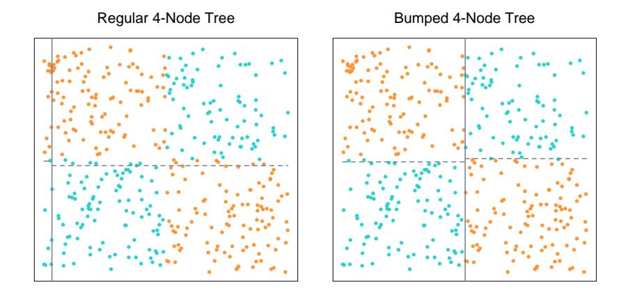

FIGURE 8.13. Data with two features and two classes (blue and orange), displaying a pure interaction. The left panel shows the partition found by three splits of a standard, greedy, tree-growing algorithm. The vertical grey line near the left edge is the first split, and the broken lines are the two subsequent splits. The algorithm has no idea where to make a good initial split, and makes a poor choice. The right panel shows the near-optimal splits found by bumping the tree-growing algorithm 20 times.

As in bagging, we draw bootstrap samples and fit a model to each. But rather than average the predictions, we choose the model estimated from a bootstrap sample that best fits the training data. In detail, we draw bootstrap samples  $\mathbf{Z}^{*1}, \dots, \mathbf{Z}^{*B}$  and fit our model to each, giving predictions  $\hat{f}^{*b}(x)$ ,  $b=1,2,\dots,B$  at input point x. We then choose the model that produces the smallest prediction error, averaged over the *original training set*. For squared error, for example, we choose the model obtained from bootstrap sample  $\hat{b}$ , where

$$\hat{b} = \arg\min_{b} \sum_{i=1}^{N} [y_i - \hat{f}^{*b}(x_i)]^2.$$
 (8.60)

The corresponding model predictions are  $\hat{f}^{*\hat{b}}(x)$ . By convention we also include the original training sample in the set of bootstrap samples, so that the method is free to pick the original model if it has the lowest training error.

By perturbing the data, bumping tries to move the fitting procedure around to good areas of model space. For example, if a few data points are causing the procedure to find a poor solution, any bootstrap sample that omits those data points should procedure a better solution.

For another example, consider the classification data in Figure 8.13, the notorious *exclusive or* (XOR) problem. There are two classes (blue and orange) and two input features, with the features exhibiting a pure inter-

action. By splitting the data at x1 = 0 and then splitting each resulting strata at x2 = 0, (or vice versa) a tree-based classifier could achieve perfect discrimination. However, the greedy, short-sighted CART algorithm (Section 9.2) tries to find the best split on either feature, and then splits the resulting strata. Because of the balanced nature of the data, all initial splits on x1 or x2 appear to be useless, and the procedure essentially generates a random split at the top level. The actual split found for these data is shown in the left panel of Figure 8.13. By bootstrap sampling from the data, bumping breaks the balance in the classes, and with a reasonable number of bootstrap samples (here 20), it will by chance produce at least one tree with initial split near either x1 = 0 or x2 = 0. Using just 20 bootstrap samples, bumping found the near optimal splits shown in the right panel of Figure 8.13. This shortcoming of the greedy tree-growing algorithm is exacerbated if we add a number of noise features that are independent of the class label. Then the tree-growing algorithm cannot distinguish x1 or x2 from the others, and gets seriously lost.

Since bumping compares different models on the training data, one must ensure that the models have roughly the same complexity. In the case of trees, this would mean growing trees with the same number of terminal nodes on each bootstrap sample. Bumping can also help in problems where it is difficult to optimize the fitting criterion, perhaps because of a lack of smoothness. The trick is to optimize a different, more convenient criterion over the bootstrap samples, and then choose the model producing the best results for the desired criterion on the training sample.

# Bibliographic Notes

There are many books on classical statistical inference: Cox and Hinkley (1974) and Silvey (1975) give nontechnical accounts. The bootstrap is due to Efron (1979) and is described more fully in Efron and Tibshirani (1993) and Hall (1992). A good modern book on Bayesian inference is Gelman et al. (1995). A lucid account of the application of Bayesian methods to neural networks is given in Neal (1996). The statistical application of Gibbs sampling is due to Geman and Geman (1984), and Gelfand and Smith (1990), with related work by Tanner and Wong (1987). Markov chain Monte Carlo methods, including Gibbs sampling and the Metropolis– Hastings algorithm, are discussed in Spiegelhalter et al. (1996). The EM algorithm is due to Dempster et al. (1977); as the discussants in that paper make clear, there was much related, earlier work. The view of EM as a joint maximization scheme for a penalized complete-data log-likelihood was elucidated by Neal and Hinton (1998); they credit Csiszar and Tusn´ady (1984) and Hathaway (1986) as having noticed this connection earlier. Bagging was proposed by Breiman (1996a). Stacking is due to Wolpert (1992); Breiman (1996b) contains an accessible discussion for statisticians. Leblanc and Tibshirani (1996) describe variations on stacking based on the bootstrap. Model averaging in the Bayesian framework has been recently advocated by Madigan and Raftery (1994). Bumping was proposed by Tibshirani and Knight (1999).

#### Exercises

Ex. 8.1 Let r(y) and q(y) be probability density functions. Jensen's inequality states that for a random variable X and a convex function  $\phi(x)$ ,  $\mathrm{E}[\phi(X)] \geq \phi[\mathrm{E}(X)]$ . Use Jensen's inequality to show that

$$E_q \log[r(Y)/q(Y)] \tag{8.61}$$

is maximized as a function of r(y) when r(y) = q(y). Hence show that  $R(\theta, \theta) \ge R(\theta', \theta)$  as stated below equation (8.46).

Ex. 8.2 Consider the maximization of the log-likelihood (8.48), over distributions  $\tilde{P}(\mathbf{Z}^m)$  such that  $\tilde{P}(\mathbf{Z}^m) \geq 0$  and  $\sum_{\mathbf{Z}^m} \tilde{P}(\mathbf{Z}^m) = 1$ . Use Lagrange multipliers to show that the solution is the conditional distribution  $\tilde{P}(\mathbf{Z}^m) = \Pr(\mathbf{Z}^m | \mathbf{Z}, \theta')$ , as in (8.49).

Ex. 8.3 Justify the estimate (8.50), using the relationship

$$\Pr(A) = \int \Pr(A|B)d(\Pr(B)).$$

Ex. 8.4 Consider the bagging method of Section 8.7. Let our estimate  $\hat{f}(x)$  be the B-spline smoother  $\hat{\mu}(x)$  of Section 8.2.1. Consider the parametric bootstrap of equation (8.6), applied to this estimator. Show that if we bag  $\hat{f}(x)$ , using the parametric bootstrap to generate the bootstrap samples, the bagging estimate  $\hat{f}_{\text{bag}}(x)$  converges to the original estimate  $\hat{f}(x)$  as  $B \to \infty$ .

Ex. 8.5 Suggest generalizations of each of the loss functions in Figure 10.4 to more than two classes, and design an appropriate plot to compare them.

Ex. 8.6 Consider the bone mineral density data of Figure 5.6.

- (a) Fit a cubic smooth spline to the relative change in spinal BMD, as a function of age. Use cross-validation to estimate the optimal amount of smoothing. Construct pointwise 90% confidence bands for the underlying function.
- (b) Compute the posterior mean and covariance for the true function via (8.28), and compare the posterior bands to those obtained in (a).

(c) Compute 100 bootstrap replicates of the fitted curves, as in the bottom left panel of Figure 8.2. Compare the results to those obtained in (a) and (b).

Ex. 8.7 EM as a minorization algorithm(Hunter and Lange, 2004; Wu and Lange, 2007). A function g(x, y) to said to minorize a function f(x) if

$$g(x,y) \le f(x), \ g(x,x) = f(x)$$
 (8.62)

for all x, y in the domain. This is useful for maximizing f(x) since it is easy to show that f(x) is non-decreasing under the update

$$x^{s+1} = \operatorname{argmax}_{x} g(x, x^{s}) \tag{8.63}$$

There are analogous definitions for majorization, for minimizing a function f(x). The resulting algorithms are known as MM algorithms, for "Minorize-Maximize" or "Majorize-Minimize."

Show that the EM algorithm (Section 8.5.2) is an example of an MM algorithm, using Q(θ ′ , θ)+log Pr(Z|θ)−Q(θ, θ) to minorize the observed data log-likelihood ℓ(θ ′ ; Z). (Note that only the first term involves the relevant parameter θ ′ ).