# Additive Models, Trees, and Related Methods

In this chapter we begin our discussion of some specific methods for supervised learning. These techniques each assume a (different) structured form for the unknown regression function, and by doing so they finesse the curse of dimensionality. Of course, they pay the possible price of misspecifying the model, and so in each case there is a tradeoff that has to be made. They take off where Chapters 3–6 left off. We describe five related techniques: generalized additive models, trees, multivariate adaptive regression splines, the patient rule induction method, and hierarchical mixtures of experts.

# 9.1 Generalized Additive Models

Regression models play an important role in many data analyses, providing prediction and classification rules, and data analytic tools for understanding the importance of different inputs.

Although attractively simple, the traditional linear model often fails in these situations: in real life, effects are often not linear. In earlier chapters we described techniques that used predefined basis functions to achieve nonlinearities. This section describes more automatic flexible statistical methods that may be used to identify and characterize nonlinear regression effects. These methods are called "generalized additive models."

In the regression setting, a generalized additive model has the form

$$E(Y|X_1, X_2, \dots, X_p) = \alpha + f_1(X_1) + f_2(X_2) + \dots + f_p(X_p).$$
 (9.1)

As usual X1, X2, . . . , Xp represent predictors and Y is the outcome; the fj 's are unspecified smooth ("nonparametric") functions. If we were to model each function using an expansion of basis functions (as in Chapter 5), the resulting model could then be fit by simple least squares. Our approach here is different: we fit each function using a scatterplot smoother (e.g., a cubic smoothing spline or kernel smoother), and provide an algorithm for simultaneously estimating all p functions (Section 9.1.1).

For two-class classification, recall the logistic regression model for binary data discussed in Section 4.4. We relate the mean of the binary response µ(X) = Pr(Y = 1|X) to the predictors via a linear regression model and the logit link function:

$$\log\left(\frac{\mu(X)}{1-\mu(X)}\right) = \alpha + \beta_1 X_1 + \dots + \beta_p X_p. \tag{9.2}$$

The additive logistic regression model replaces each linear term by a more general functional form

$$\log\left(\frac{\mu(X)}{1-\mu(X)}\right) = \alpha + f_1(X_1) + \dots + f_p(X_p), \tag{9.3}$$

where again each fj is an unspecified smooth function. While the nonparametric form for the functions fj makes the model more flexible, the additivity is retained and allows us to interpret the model in much the same way as before. The additive logistic regression model is an example of a generalized additive model. In general, the conditional mean µ(X) of a response Y is related to an additive function of the predictors via a link function g:

$$g[\mu(X)] = \alpha + f_1(X_1) + \dots + f_p(X_p).$$
 (9.4)

Examples of classical link functions are the following:

- g(µ) = µ is the identity link, used for linear and additive models for Gaussian response data.
- g(µ) = logit(µ) as above, or g(µ) = probit(µ), the probit link function, for modeling binomial probabilities. The probit function is the inverse Gaussian cumulative distribution function: probit(µ) = Φ−1 (µ).
- g(µ) = log(µ) for log-linear or log-additive models for Poisson count data.

All three of these arise from exponential family sampling models, which in addition include the gamma and negative-binomial distributions. These families generate the well-known class of generalized linear models, which are all extended in the same way to generalized additive models.

The functions fj are estimated in a flexible manner, using an algorithm whose basic building block is a scatterplot smoother. The estimated function ˆfj can then reveal possible nonlinearities in the effect of Xj . Not all of the functions  $f_j$  need to be nonlinear. We can easily mix in linear and other parametric forms with the nonlinear terms, a necessity when some of the inputs are qualitative variables (factors). The nonlinear terms are not restricted to main effects either; we can have nonlinear components in two or more variables, or separate curves in  $X_j$  for each level of the factor  $X_k$ . Thus each of the following would qualify:

- $g(\mu) = X^T \beta + \alpha_k + f(Z)$ —a semiparametric model, where X is a vector of predictors to be modeled linearly,  $\alpha_k$  the effect for the kth level of a qualitative input V, and the effect of predictor Z is modeled nonparametrically.
- $g(\mu) = f(X) + g_k(Z)$ —again k indexes the levels of a qualitative input V, and thus creates an interaction term  $g(V,Z) = g_k(Z)$  for the effect of V and Z.
- $g(\mu) = f(X) + g(Z, W)$  where g is a nonparametric function in two features.

Additive models can replace linear models in a wide variety of settings, for example an additive decomposition of time series,

$$Y_t = S_t + T_t + \varepsilon_t, \tag{9.5}$$

where  $S_t$  is a seasonal component,  $T_t$  is a trend and  $\varepsilon$  is an error term.

#### 9.1.1 Fitting Additive Models

In this section we describe a modular algorithm for fitting additive models and their generalizations. The building block is the scatterplot smoother for fitting nonlinear effects in a flexible way. For concreteness we use as our scatterplot smoother the cubic smoothing spline described in Chapter 5.

The additive model has the form

$$Y = \alpha + \sum_{j=1}^{p} f_j(X_j) + \varepsilon, \tag{9.6}$$

where the error term  $\varepsilon$  has mean zero. Given observations  $x_i, y_i$ , a criterion like the penalized sum of squares (5.9) of Section 5.4 can be specified for this problem,

$$PRSS(\alpha, f_1, f_2, \dots, f_p) = \sum_{i=1}^{N} \left( y_i - \alpha - \sum_{j=1}^{p} f_j(x_{ij}) \right)^2 + \sum_{j=1}^{p} \lambda_j \int f_j''(t_j)^2 dt_j,$$
(9.7)

where the  $\lambda_j \geq 0$  are tuning parameters. It can be shown that the minimizer of (9.7) is an additive cubic spline model; each of the functions  $f_j$  is a

#### **Algorithm 9.1** The Backfitting Algorithm for Additive Models.

- 1. Initialize:  $\hat{\alpha} = \frac{1}{N} \sum_{1}^{N} y_i$ ,  $\hat{f}_j \equiv 0, \forall i, j$ .
- 2. Cycle:  $j = 1, 2, \dots, p, \dots, 1, 2, \dots, p, \dots$

$$\hat{f}_j \leftarrow \mathcal{S}_j \left[ \{ y_i - \hat{\alpha} - \sum_{k \neq j} \hat{f}_k(x_{ik}) \}_1^N \right],$$

$$\hat{f}_j \leftarrow \hat{f}_j - \frac{1}{N} \sum_{i=1}^N \hat{f}_j(x_{ij}).$$

until the functions  $\hat{f}_i$  change less than a prespecified threshold.

cubic spline in the component  $X_j$ , with knots at each of the unique values of  $x_{ij}$ ,  $i=1,\ldots,N$ . However, without further restrictions on the model, the solution is not unique. The constant  $\alpha$  is not identifiable, since we can add or subtract any constants to each of the functions  $f_j$ , and adjust  $\alpha$  accordingly. The standard convention is to assume that  $\sum_{1}^{N} f_j(x_{ij}) = 0 \ \forall j$ —the functions average zero over the data. It is easily seen that  $\hat{\alpha} = \text{ave}(y_i)$  in this case. If in addition to this restriction, the matrix of input values (having ijth entry  $x_{ij}$ ) has full column rank, then (9.7) is a strictly convex criterion and the minimizer is unique. If the matrix is singular, then the linear part of the components  $f_j$  cannot be uniquely determined (while the nonlinear parts can!)(Buja et al., 1989).

Furthermore, a simple iterative procedure exists for finding the solution. We set  $\hat{\alpha} = \operatorname{ave}(y_i)$ , and it never changes. We apply a cubic smoothing spline  $S_j$  to the targets  $\{y_i - \hat{\alpha} - \sum_{k \neq j} \hat{f}_k(x_{ik})\}_1^N$ , as a function of  $x_{ij}$ , to obtain a new estimate  $\hat{f}_j$ . This is done for each predictor in turn, using the current estimates of the other functions  $\hat{f}_k$  when computing  $y_i - \hat{\alpha} - \sum_{k \neq j} \hat{f}_k(x_{ik})$ . The process is continued until the estimates  $\hat{f}_j$  stabilize. This procedure, given in detail in Algorithm 9.1, is known as "backfitting" and the resulting fit is analogous to a multiple regression for linear models.

In principle, the second step in (2) of Algorithm 9.1 is not needed, since the smoothing spline fit to a mean-zero response has mean zero (Exercise 9.1). In practice, machine rounding can cause slippage, and the adjustment is advised.

This same algorithm can accommodate other fitting methods in exactly the same way, by specifying appropriate smoothing operators  $S_i$ :

other univariate regression smoothers such as local polynomial regression and kernel methods;

- linear regression operators yielding polynomial fits, piecewise constant fits, parametric spline fits, series and Fourier fits;
- more complicated operators such as surface smoothers for second or higher-order interactions or periodic smoothers for seasonal effects.

If we consider the operation of smoother  $S_j$  only at the training points, it can be represented by an  $N \times N$  operator matrix  $\mathbf{S}_j$  (see Section 5.4.1). Then the degrees of freedom for the jth term are (approximately) computed as  $\mathrm{df}_j = \mathrm{trace}[\mathbf{S}_j] - 1$ , by analogy with degrees of freedom for smoothers discussed in Chapters 5 and 6.

For a large class of linear smoothers  $S_j$ , backfitting is equivalent to a Gauss–Seidel algorithm for solving a certain linear system of equations. Details are given in Exercise 9.2.

For the logistic regression model and other generalized additive models, the appropriate criterion is a penalized log-likelihood. To maximize it, the backfitting procedure is used in conjunction with a likelihood maximizer. The usual Newton–Raphson routine for maximizing log-likelihoods in generalized linear models can be recast as an IRLS (iteratively reweighted least squares) algorithm. This involves repeatedly fitting a weighted linear regression of a working response variable on the covariates; each regression yields a new value of the parameter estimates, which in turn give new working responses and weights, and the process is iterated (see Section 4.4.1). In the generalized additive model, the weighted linear regression is simply replaced by a weighted backfitting algorithm. We describe the algorithm in more detail for logistic regression below, and more generally in Chapter 6 of Hastie and Tibshirani (1990).

#### 9.1.2 Example: Additive Logistic Regression

Probably the most widely used model in medical research is the logistic model for binary data. In this model the outcome Y can be coded as 0 or 1, with 1 indicating an event (like death or relapse of a disease) and 0 indicating no event. We wish to model  $\Pr(Y=1|X)$ , the probability of an event given values of the prognostic factors  $X^T=(X_1,\ldots,X_p)$ . The goal is usually to understand the roles of the prognostic factors, rather than to classify new individuals. Logistic models are also used in applications where one is interested in estimating the class probabilities, for use in risk screening. Apart from medical applications, credit risk screening is a popular application.

The generalized additive logistic model has the form

$$\log \frac{\Pr(Y=1|X)}{\Pr(Y=0|X)} = \alpha + f_1(X_1) + \dots + f_p(X_p).$$
 (9.8)

The functions  $f_1, f_2, \ldots, f_p$  are estimated by a backfitting algorithm within a Newton-Raphson procedure, shown in Algorithm 9.2.

Algorithm 9.2 Local Scoring Algorithm for the Additive Logistic Regression Model.

- 1. Compute starting values: ˆα = log[¯y/(1 − y¯)], where ¯y = ave(yi), the sample proportion of ones, and set ˆfj ≡ 0 ∀j.
- 2. Define ˆηi = ˆα + P j ˆfj (xij ) and ˆpi = 1/[1 + exp(−ηˆi)]. Iterate:
  - (a) Construct the working target variable

$$z_i = \hat{\eta}_i + \frac{(y_i - \hat{p}_i)}{\hat{p}_i(1 - \hat{p}_i)}.$$

- (b) Construct weights wi = ˆpi(1 − pˆi)
- (c) Fit an additive model to the targets zi with weights wi , using a weighted backfitting algorithm. This gives new estimates α, ˆ ˆfj , ∀j
- 3. Continue step 2. until the change in the functions falls below a prespecified threshold.

The additive model fitting in step (2) of Algorithm 9.2 requires a weighted scatterplot smoother. Most smoothing procedures can accept observation weights (Exercise 5.12); see Chapter 3 of Hastie and Tibshirani (1990) for further details.

The additive logistic regression model can be generalized further to handle more than two classes, using the multilogit formulation as outlined in Section 4.4. While the formulation is a straightforward extension of (9.8), the algorithms for fitting such models are more complex. See Yee and Wild (1996) for details, and the VGAM software currently available from:

http://www.stat.auckland.ac.nz/∼yee.

#### Example: Predicting Email Spam

We apply a generalized additive model to the spam data introduced in Chapter 1. The data consists of information from 4601 email messages, in a study to screen email for "spam" (i.e., junk email). The data is publicly available at ftp.ics.uci.edu, and was donated by George Forman from Hewlett-Packard laboratories, Palo Alto, California.

The response variable is binary, with values email or spam, and there are 57 predictors as described below:

• 48 quantitative predictors—the percentage of words in the email that match a given word. Examples include business, address, internet,

|              | Predicted Class |             |  |  |
|--------------|-----------------|-------------|--|--|
| True Class   | email (0)    | spam (1) |  |  |
| email (0) | 58.3%           | 2.5%        |  |  |
| spam (1)  | 3.0%            | 36.3%       |  |  |

TABLE 9.1. Test data confusion matrix for the additive logistic regression model fit to the spam training data. The overall test error rate is 5.5%.

free, and george. The idea was that these could be customized for individual users.

- 6 quantitative predictors—the percentage of characters in the email that match a given character. The characters are ch;, ch(, ch[, ch!, ch\$, and ch#.
- The average length of uninterrupted sequences of capital letters: CAPAVE.
- The length of the longest uninterrupted sequence of capital letters: CAPMAX.
- The sum of the length of uninterrupted sequences of capital letters: CAPTOT.

We coded spam as 1 and email as zero. A test set of size 1536 was randomly chosen, leaving 3065 observations in the training set. A generalized additive model was fit, using a cubic smoothing spline with a nominal four degrees of freedom for each predictor. What this means is that for each predictor Xj , the smoothing-spline parameter λj was chosen so that trace[Sj (λj )]−1 = 4, where Sj (λ) is the smoothing spline operator matrix constructed using the observed values xij , i = 1, . . . , N. This is a convenient way of specifying the amount of smoothing in such a complex model.

Most of the spam predictors have a very long-tailed distribution. Before fitting the GAM model, we log-transformed each variable (actually log(x+ 0.1)), but the plots in Figure 9.1 are shown as a function of the original variables.

The test error rates are shown in Table 9.1; the overall error rate is 5.3%. By comparison, a linear logistic regression has a test error rate of 7.6%. Table 9.2 shows the predictors that are highly significant in the additive model.

For ease of interpretation, in Table 9.2 the contribution for each variable is decomposed into a linear component and the remaining nonlinear component. The top block of predictors are positively correlated with spam, while the bottom block is negatively correlated. The linear component is a weighted least squares linear fit of the fitted curve on the predictor, while the nonlinear part is the residual. The linear component of an estimated

| <b>TABLE 9.2.</b> Significant predictors from the additive model fit to the spam train-         |
|-------------------------------------------------------------------------------------------------|
| ing data. The coefficients represent the linear part of $\hat{f}_j$ , along with their standard |
| errors and Z-score. The nonlinear P-value is for a test of nonlinearity of $\hat{f}_j$ .        |

| Name     | Num. | df  | Coefficient | Std. Error | Z Score | Nonlinear P-value |
|----------|------|-----|-------------|------------|---------|-------------------|
|          |      |     | Positive e  | effects    |         |                   |
| our      | 5    | 3.9 | 0.566       | 0.114      | 4.970   | 0.052             |
| over     | 6    | 3.9 | 0.244       | 0.195      | 1.249   | 0.004             |
| remove   | 7    | 4.0 | 0.949       | 0.183      | 5.201   | 0.093             |
| internet | 8    | 4.0 | 0.524       | 0.176      | 2.974   | 0.028             |
| free     | 16   | 3.9 | 0.507       | 0.127      | 4.010   | 0.065             |
| business | 17   | 3.8 | 0.779       | 0.186      | 4.179   | 0.194             |
| hpl      | 26   | 3.8 | 0.045       | 0.250      | 0.181   | 0.002             |
| ch!      | 52   | 4.0 | 0.674       | 0.128      | 5.283   | 0.164             |
| ch\$     | 53   | 3.9 | 1.419       | 0.280      | 5.062   | 0.354             |
| CAPMAX   | 56   | 3.8 | 0.247       | 0.228      | 1.080   | 0.000             |
| CAPTOT   | 57   | 4.0 | 0.755       | 0.165      | 4.566   | 0.063             |
|          | •    | •   | Negative of | effects    |         |                   |
| hp       | 25   | 3.9 | -1.404      | 0.224      | -6.262  | 0.140             |
| george   | 27   | 3.7 | -5.003      | 0.744      | -6.722  | 0.045             |
| 1999     | 37   | 3.8 | -0.672      | 0.191      | -3.512  | 0.011             |
| re       | 45   | 3.9 | -0.620      | 0.133      | -4.649  | 0.597             |
| edu      | 46   | 4.0 | -1.183      | 0.209      | -5.647  | 0.000             |

function is summarized by the coefficient, standard error and Z-score; the latter is the coefficient divided by its standard error, and is considered significant if it exceeds the appropriate quantile of a standard normal distribution. The column labeled  $nonlinear\ P$ -value is a test of nonlinearity of the estimated function. Note, however, that the effect of each predictor is fully adjusted for the entire effects of the other predictors, not just for their linear parts. The predictors shown in the table were judged significant by at least one of the tests (linear or nonlinear) at the p=0.01 level (two-sided).

Figure 9.1 shows the estimated functions for the significant predictors appearing in Table 9.2. Many of the nonlinear effects appear to account for a strong discontinuity at zero. For example, the probability of spam drops significantly as the frequency of george increases from zero, but then does not change much after that. This suggests that one might replace each of the frequency predictors by an indicator variable for a zero count, and resort to a linear logistic model. This gave a test error rate of 7.4%; including the linear effects of the frequencies as well dropped the test error to 6.6%. It appears that the nonlinearities in the additive model have an additional predictive power.

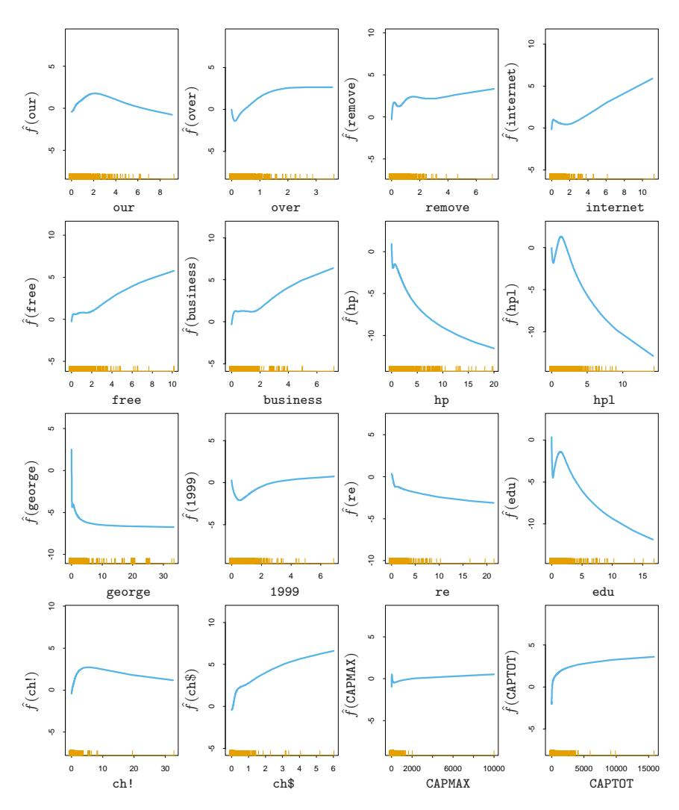

FIGURE 9.1. Spam analysis: estimated functions for significant predictors. The rug plot along the bottom of each frame indicates the observed values of the corresponding predictor. For many of the predictors the nonlinearity picks up the discontinuity at zero.

It is more serious to classify a genuine email message as spam, since then a good email would be filtered out and would not reach the user. We can alter the balance between the class error rates by changing the losses (see Section 2.4). If we assign a loss L01 for predicting a true class 0 as class 1, and L10 for predicting a true class 1 as class 0, then the estimated Bayes rule predicts class 1 if its probability is greater than L01/(L01 + L10). For example, if we take L01 = 10, L10 = 1 then the (true) class 0 and class 1 error rates change to 0.8% and 8.7%.

More ambitiously, we can encourage the model to fit better data in the class 0 by using weights L01 for the class 0 observations and L10 for the class 1 observations. As above, we then use the estimated Bayes rule to predict. This gave error rates of 1.2% and 8.0% in (true) class 0 and class 1, respectively. We discuss below the issue of unequal losses further, in the context of tree-based models.

After fitting an additive model, one should check whether the inclusion of some interactions can significantly improve the fit. This can be done "manually," by inserting products of some or all of the significant inputs, or automatically via the MARS procedure (Section 9.4).

This example uses the additive model in an automatic fashion. As a data analysis tool, additive models are often used in a more interactive fashion, adding and dropping terms to determine their effect. By calibrating the amount of smoothing in terms of dfj , one can move seamlessly between linear models (dfj = 1) and partially linear models, where some terms are modeled more flexibly. See Hastie and Tibshirani (1990) for more details.

# 9.1.3 Summary

Additive models provide a useful extension of linear models, making them more flexible while still retaining much of their interpretability. The familiar tools for modeling and inference in linear models are also available for additive models, seen for example in Table 9.2. The backfitting procedure for fitting these models is simple and modular, allowing one to choose a fitting method appropriate for each input variable. As a result they have become widely used in the statistical community.

However additive models can have limitations for large data-mining applications. The backfitting algorithm fits all predictors, which is not feasible or desirable when a large number are available. The BRUTO procedure (Hastie and Tibshirani, 1990, Chapter 9) combines backfitting with selection of inputs, but is not designed for large data-mining problems. There has also been recent work using lasso-type penalties to estimate sparse additive models, for example the COSSO procedure of Lin and Zhang (2006) and the SpAM proposal of Ravikumar et al. (2008). For large problems a forward stagewise approach such as boosting (Chapter 10) is more effective, and also allows for interactions to be included in the model.

# 9.2 Tree-Based Methods

#### 9.2.1 Background

Tree-based methods partition the feature space into a set of rectangles, and then fit a simple model (like a constant) in each one. They are conceptually simple yet powerful. We first describe a popular method for tree-based regression and classification called CART, and later contrast it with C4.5, a major competitor.

Let's consider a regression problem with continuous response Y and inputs X1 and X2, each taking values in the unit interval. The top left panel of Figure 9.2 shows a partition of the feature space by lines that are parallel to the coordinate axes. In each partition element we can model Y with a different constant. However, there is a problem: although each partitioning line has a simple description like X1 = c, some of the resulting regions are complicated to describe.

To simplify matters, we restrict attention to recursive binary partitions like that in the top right panel of Figure 9.2. We first split the space into two regions, and model the response by the mean of Y in each region. We choose the variable and split-point to achieve the best fit. Then one or both of these regions are split into two more regions, and this process is continued, until some stopping rule is applied. For example, in the top right panel of Figure 9.2, we first split at X1 = t1. Then the region X1 ≤ t1 is split at X2 = t2 and the region X1 > t1 is split at X1 = t3. Finally, the region X1 > t3 is split at X2 = t4. The result of this process is a partition into the five regions R1, R2, . . . , R5 shown in the figure. The corresponding regression model predicts Y with a constant cm in region Rm, that is,

$$\hat{f}(X) = \sum_{m=1}^{5} c_m I\{(X_1, X_2) \in R_m\}.$$
(9.9)

This same model can be represented by the binary tree in the bottom left panel of Figure 9.2. The full dataset sits at the top of the tree. Observations satisfying the condition at each junction are assigned to the left branch, and the others to the right branch. The terminal nodes or leaves of the tree correspond to the regions R1, R2, . . . , R5. The bottom right panel of Figure 9.2 is a perspective plot of the regression surface from this model. For illustration, we chose the node means c1 = −5, c2 = −7, c3 = 0, c4 = 2, c5 = 4 to make this plot.

A key advantage of the recursive binary tree is its interpretability. The feature space partition is fully described by a single tree. With more than two inputs, partitions like that in the top right panel of Figure 9.2 are difficult to draw, but the binary tree representation works in the same way. This representation is also popular among medical scientists, perhaps because it mimics the way that a doctor thinks. The tree stratifies the

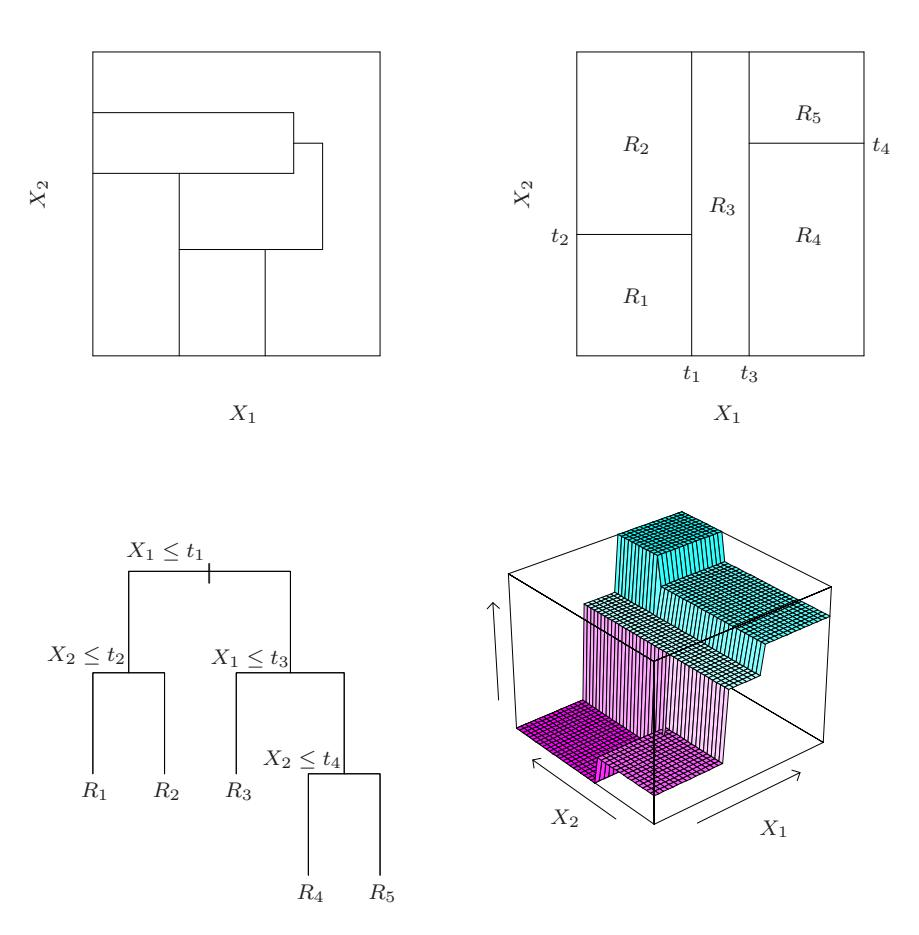

FIGURE 9.2. Partitions and CART. Top right panel shows a partition of a two-dimensional feature space by recursive binary splitting, as used in CART, applied to some fake data. Top left panel shows a general partition that cannot be obtained from recursive binary splitting. Bottom left panel shows the tree corresponding to the partition in the top right panel, and a perspective plot of the prediction surface appears in the bottom right panel.

population into strata of high and low outcome, on the basis of patient characteristics.

#### 9.2.2 Regression Trees

We now turn to the question of how to grow a regression tree. Our data consists of p inputs and a response, for each of N observations: that is, (xi , yi) for i = 1, 2, . . . , N, with xi = (xi1, xi2, . . . , xip). The algorithm needs to automatically decide on the splitting variables and split points, and also what topology (shape) the tree should have. Suppose first that we have a partition into M regions R1, R2, . . . , RM, and we model the response as a constant cm in each region:

$$f(x) = \sum_{m=1}^{M} c_m I(x \in R_m).$$
 (9.10)

If we adopt as our criterion minimization of the sum of squares P(yi − f(xi))2 , it is easy to see that the best ˆcm is just the average of yi in region Rm:

$$\hat{c}_m = \text{ave}(y_i | x_i \in R_m). \tag{9.11}$$

Now finding the best binary partition in terms of minimum sum of squares is generally computationally infeasible. Hence we proceed with a greedy algorithm. Starting with all of the data, consider a splitting variable j and split point s, and define the pair of half-planes

$$R_1(j,s) = \{X | X_j \le s\} \text{ and } R_2(j,s) = \{X | X_j > s\}.$$
 (9.12)

Then we seek the splitting variable j and split point s that solve

$$\min_{j, s} \left[ \min_{c_1} \sum_{x_i \in R_1(j, s)} (y_i - c_1)^2 + \min_{c_2} \sum_{x_i \in R_2(j, s)} (y_i - c_2)^2 \right].$$
 (9.13)

For any choice j and s, the inner minimization is solved by

$$\hat{c}_1 = \text{ave}(y_i | x_i \in R_1(j, s)) \text{ and } \hat{c}_2 = \text{ave}(y_i | x_i \in R_2(j, s)).$$
 (9.14)

For each splitting variable, the determination of the split point s can be done very quickly and hence by scanning through all of the inputs, determination of the best pair (j, s) is feasible.

Having found the best split, we partition the data into the two resulting regions and repeat the splitting process on each of the two regions. Then this process is repeated on all of the resulting regions.

How large should we grow the tree? Clearly a very large tree might overfit the data, while a small tree might not capture the important structure. Tree size is a tuning parameter governing the model's complexity, and the optimal tree size should be adaptively chosen from the data. One approach would be to split tree nodes only if the decrease in sum-of-squares due to the split exceeds some threshold. This strategy is too short-sighted, however, since a seemingly worthless split might lead to a very good split below it.

The preferred strategy is to grow a large tree  $T_0$ , stopping the splitting process only when some minimum node size (say 5) is reached. Then this large tree is pruned using *cost-complexity pruning*, which we now describe.

We define a subtree  $T \subset T_0$  to be any tree that can be obtained by pruning  $T_0$ , that is, collapsing any number of its internal (non-terminal) nodes. We index terminal nodes by m, with node m representing region  $R_m$ . Let |T| denote the number of terminal nodes in T. Letting

$$N_{m} = \#\{x_{i} \in R_{m}\},$$

$$\hat{c}_{m} = \frac{1}{N_{m}} \sum_{x_{i} \in R_{m}} y_{i},$$

$$Q_{m}(T) = \frac{1}{N_{m}} \sum_{x_{i} \in R_{m}} (y_{i} - \hat{c}_{m})^{2},$$
(9.15)

we define the cost complexity criterion

$$C_{\alpha}(T) = \sum_{m=1}^{|T|} N_m Q_m(T) + \alpha |T|. \tag{9.16}$$

The idea is to find, for each  $\alpha$ , the subtree  $T_{\alpha} \subseteq T_0$  to minimize  $C_{\alpha}(T)$ . The tuning parameter  $\alpha \geq 0$  governs the tradeoff between tree size and its goodness of fit to the data. Large values of  $\alpha$  result in smaller trees  $T_{\alpha}$ , and conversely for smaller values of  $\alpha$ . As the notation suggests, with  $\alpha = 0$  the solution is the full tree  $T_0$ . We discuss how to adaptively choose  $\alpha$  below.

For each  $\alpha$  one can show that there is a unique smallest subtree  $T_{\alpha}$  that minimizes  $C_{\alpha}(T)$ . To find  $T_{\alpha}$  we use weakest link pruning: we successively collapse the internal node that produces the smallest per-node increase in  $\sum_{m} N_{m}Q_{m}(T)$ , and continue until we produce the single-node (root) tree. This gives a (finite) sequence of subtrees, and one can show this sequence must contain  $T_{\alpha}$ . See Breiman et al. (1984) or Ripley (1996) for details. Estimation of  $\alpha$  is achieved by five- or tenfold cross-validation: we choose the value  $\hat{\alpha}$  to minimize the cross-validated sum of squares. Our final tree is  $T_{\hat{\alpha}}$ .

#### 9.2.3 Classification Trees

If the target is a classification outcome taking values 1, 2, ..., K, the only changes needed in the tree algorithm pertain to the criteria for splitting nodes and pruning the tree. For regression we used the squared-error node

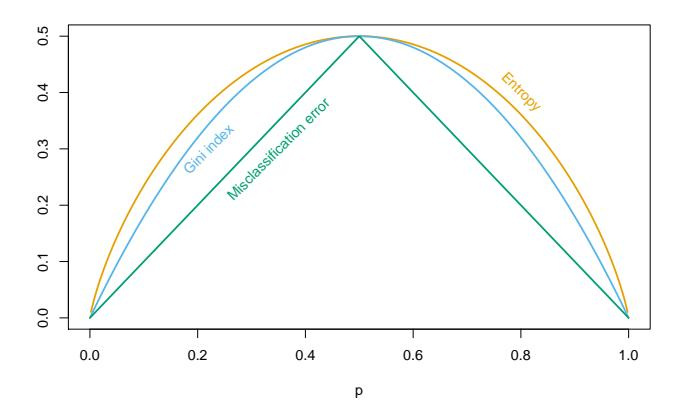

FIGURE 9.3. Node impurity measures for two-class classification, as a function of the proportion p in class 2. Cross-entropy has been scaled to pass through (0.5, 0.5).

impurity measure Qm(T) defined in (9.15), but this is not suitable for classification. In a node m, representing a region Rm with Nm observations, let

$$\hat{p}_{mk} = \frac{1}{N_m} \sum_{x_i \in R_m} I(y_i = k),$$

the proportion of class k observations in node m. We classify the observations in node m to class k(m) = arg maxk pˆmk, the majority class in node m. Different measures Qm(T) of node impurity include the following:

Misclassification error: 1 Nm P i∈Rm I(yi 6= k(m)) = 1 − pˆmk(m) . Gini index: P k6=k′ pˆmkpˆmk′ = PK k=1 pˆmk(1 − pˆmk). Cross-entropy or deviance: − PK k=1 pˆmk log ˆpmk. (9.17)

For two classes, if p is the proportion in the second class, these three measures are 1 − max(p, 1 − p), 2p(1 − p) and −p log p − (1 − p) log (1 − p), respectively. They are shown in Figure 9.3. All three are similar, but crossentropy and the Gini index are differentiable, and hence more amenable to numerical optimization. Comparing (9.13) and (9.15), we see that we need to weight the node impurity measures by the number NmL and NmR of observations in the two child nodes created by splitting node m.

In addition, cross-entropy and the Gini index are more sensitive to changes in the node probabilities than the misclassification rate. For example, in a two-class problem with 400 observations in each class (denote this by (400, 400)), suppose one split created nodes (300, 100) and (100, 300), while

the other created nodes (200, 400) and (200, 0). Both splits produce a misclassification rate of 0.25, but the second split produces a pure node and is probably preferable. Both the Gini index and cross-entropy are lower for the second split. For this reason, either the Gini index or cross-entropy should be used when growing the tree. To guide cost-complexity pruning, any of the three measures can be used, but typically it is the misclassification rate.

The Gini index can be interpreted in two interesting ways. Rather than classify observations to the majority class in the node, we could classify them to class k with probability  $\hat{p}_{mk}$ . Then the expected training error rate of this rule in the node is  $\sum_{k \neq k'} \hat{p}_{mk} \hat{p}_{mk'}$ —the Gini index. Similarly, if we code each observation as 1 for class k and zero otherwise, the variance over the node of this 0-1 response is  $\hat{p}_{mk}(1-\hat{p}_{mk})$ . Summing over classes k again gives the Gini index.

#### 9.2.4 Other Issues

#### Categorical Predictors

When splitting a predictor having q possible unordered values, there are  $2^{q-1}-1$  possible partitions of the q values into two groups, and the computations become prohibitive for large q. However, with a 0-1 outcome, this computation simplifies. We order the predictor classes according to the proportion falling in outcome class 1. Then we split this predictor as if it were an ordered predictor. One can show this gives the optimal split, in terms of cross-entropy or Gini index, among all possible  $2^{q-1}-1$  splits. This result also holds for a quantitative outcome and square error loss—the categories are ordered by increasing mean of the outcome. Although intuitive, the proofs of these assertions are not trivial. The proof for binary outcomes is given in Breiman et al. (1984) and Ripley (1996); the proof for quantitative outcomes can be found in Fisher (1958). For multicategory outcomes, no such simplifications are possible, although various approximations have been proposed (Loh and Vanichsetakul, 1988).

The partitioning algorithm tends to favor categorical predictors with many levels q; the number of partitions grows exponentially in q, and the more choices we have, the more likely we can find a good one for the data at hand. This can lead to severe overfitting if q is large, and such variables should be avoided.

#### The Loss Matrix

In classification problems, the consequences of misclassifying observations are more serious in some classes than others. For example, it is probably worse to predict that a person will not have a heart attack when he/she actually will, than vice versa. To account for this, we define a  $K \times K$  loss matrix  $\mathbf{L}$ , with  $L_{kk'}$  being the loss incurred for classifying a class k observation as class k'. Typically no loss is incurred for correct classifications,

that is,  $L_{kk} = 0 \ \forall k$ . To incorporate the losses into the modeling process, we could modify the Gini index to  $\sum_{k \neq k'} L_{kk'} \hat{p}_{mk} \hat{p}_{mk'}$ ; this would be the expected loss incurred by the randomized rule. This works for the multiclass case, but in the two-class case has no effect, since the coefficient of  $\hat{p}_{mk}\hat{p}_{mk'}$  is  $L_{kk'} + L_{k'k}$ . For two classes a better approach is to weight the observations in class k by  $L_{kk'}$ . This can be used in the multiclass case only if, as a function of k,  $L_{kk'}$  doesn't depend on k'. Observation weighting can be used with the deviance as well. The effect of observation weighting is to alter the prior probability on the classes. In a terminal node, the empirical Bayes rule implies that we classify to class  $k(m) = \arg\min_k \sum_{\ell} L_{\ell k} \hat{p}_{m\ell}$ .

#### Missing Predictor Values

Suppose our data has some missing predictor values in some or all of the variables. We might discard any observation with some missing values, but this could lead to serious depletion of the training set. Alternatively we might try to fill in (impute) the missing values, with say the mean of that predictor over the nonmissing observations. For tree-based models, there are two better approaches. The first is applicable to categorical predictors: we simply make a new category for "missing." From this we might discover that observations with missing values for some measurement behave differently than those with nonmissing values. The second more general approach is the construction of surrogate variables. When considering a predictor for a split, we use only the observations for which that predictor is not missing. Having chosen the best (primary) predictor and split point, we form a list of surrogate predictors and split points. The first surrogate is the predictor and corresponding split point that best mimics the split of the training data achieved by the primary split. The second surrogate is the predictor and corresponding split point that does second best, and so on. When sending observations down the tree either in the training phase or during prediction, we use the surrogate splits in order, if the primary splitting predictor is missing. Surrogate splits exploit correlations between predictors to try and alleviate the effect of missing data. The higher the correlation between the missing predictor and the other predictors, the smaller the loss of information due to the missing value. The general problem of missing data is discussed in Section 9.6.

#### Why Binary Splits?

Rather than splitting each node into just two groups at each stage (as above), we might consider multiway splits into more than two groups. While this can sometimes be useful, it is not a good general strategy. The problem is that multiway splits fragment the data too quickly, leaving insufficient data at the next level down. Hence we would want to use such splits only when needed. Since multiway splits can be achieved by a series of binary splits, the latter are preferred.

#### Other Tree-Building Procedures

The discussion above focuses on the CART (classification and regression tree) implementation of trees. The other popular methodology is ID3 and its later versions, C4.5 and C5.0 (Quinlan, 1993). Early versions of the program were limited to categorical predictors, and used a top-down rule with no pruning. With more recent developments, C5.0 has become quite similar to CART. The most significant feature unique to C5.0 is a scheme for deriving rule sets. After a tree is grown, the splitting rules that define the terminal nodes can sometimes be simplified: that is, one or more condition can be dropped without changing the subset of observations that fall in the node. We end up with a simplified set of rules defining each terminal node; these no longer follow a tree structure, but their simplicity might make them more attractive to the user.

#### Linear Combination Splits

Rather than restricting splits to be of the form  $X_j \leq s$ , one can allow splits along linear combinations of the form  $\sum a_j X_j \leq s$ . The weights  $a_j$  and split point s are optimized to minimize the relevant criterion (such as the Gini index). While this can improve the predictive power of the tree, it can hurt interpretability. Computationally, the discreteness of the split point search precludes the use of a smooth optimization for the weights. A better way to incorporate linear combination splits is in the hierarchical mixtures of experts (HME) model, the topic of Section 9.5.

#### Instability of Trees

One major problem with trees is their high variance. Often a small change in the data can result in a very different series of splits, making interpretation somewhat precarious. The major reason for this instability is the hierarchical nature of the process: the effect of an error in the top split is propagated down to all of the splits below it. One can alleviate this to some degree by trying to use a more stable split criterion, but the inherent instability is not removed. It is the price to be paid for estimating a simple, tree-based structure from the data. *Bagging* (Section 8.7) averages many trees to reduce this variance.

#### Lack of Smoothness

Another limitation of trees is the lack of smoothness of the prediction surface, as can be seen in the bottom right panel of Figure 9.2. In classification with 0/1 loss, this doesn't hurt much, since bias in estimation of the class probabilities has a limited effect. However, this can degrade performance in the regression setting, where we would normally expect the underlying function to be smooth. The MARS procedure, described in Section 9.4,

TABLE 9.3. Spam data: confusion rates for the 17-node tree (chosen by cross– validation) on the test data. Overall error rate is 9.3%.

|       | Predicted |       |  |  |
|-------|-----------|-------|--|--|
| True  | email     | spam  |  |  |
| email | 57.3%     | 4.0%  |  |  |
| spam  | 5.3%      | 33.4% |  |  |

can be viewed as a modification of CART designed to alleviate this lack of smoothness.

#### Difficulty in Capturing Additive Structure

Another problem with trees is their difficulty in modeling additive structure. In regression, suppose, for example, that Y = c1I(X1 < t1)+c2I(X2 < t2) + ε where ε is zero-mean noise. Then a binary tree might make its first split on X1 near t1. At the next level down it would have to split both nodes on X2 at t2 in order to capture the additive structure. This might happen with sufficient data, but the model is given no special encouragement to find such structure. If there were ten rather than two additive effects, it would take many fortuitous splits to recreate the structure, and the data analyst would be hard pressed to recognize it in the estimated tree. The "blame" here can again be attributed to the binary tree structure, which has both advantages and drawbacks. Again the MARS method (Section 9.4) gives up this tree structure in order to capture additive structure.

# 9.2.5 Spam Example (Continued)

We applied the classification tree methodology to the spam example introduced earlier. We used the deviance measure to grow the tree and misclassification rate to prune it. Figure 9.4 shows the 10-fold cross-validation error rate as a function of the size of the pruned tree, along with ±2 standard errors of the mean, from the ten replications. The test error curve is shown in orange. Note that the cross-validation error rates are indexed by a sequence of values of α and not tree size; for trees grown in different folds, a value of α might imply different sizes. The sizes shown at the base of the plot refer to |Tα|, the sizes of the pruned original tree.

The error flattens out at around 17 terminal nodes, giving the pruned tree in Figure 9.5. Of the 13 distinct features chosen by the tree, 11 overlap with the 16 significant features in the additive model (Table 9.2). The overall error rate shown in Table 9.3 is about 50% higher than for the additive model in Table 9.1.

Consider the rightmost branches of the tree. We branch to the right with a spam warning if more than 5.5% of the characters are the \$ sign.

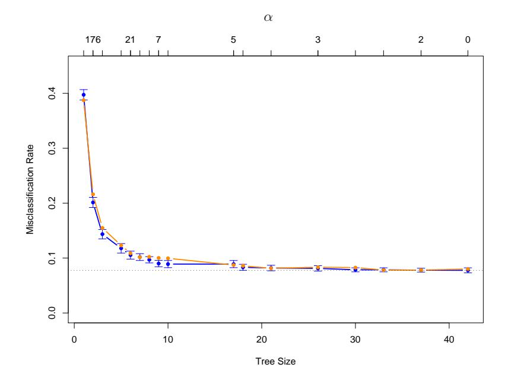

FIGURE 9.4. Results for spam example. The blue curve is the 10-fold cross-validation estimate of misclassification rate as a function of tree size, with standard error bars. The minimum occurs at a tree size with about 17 terminal nodes (using the "one-standard-error" rule). The orange curve is the test error, which tracks the CV error quite closely. The cross-validation is indexed by values of α, shown above. The tree sizes shown below refer to |Tα|, the size of the original tree indexed by α.

However, if in addition the phrase hp occurs frequently, then this is likely to be company business and we classify as email. All of the 22 cases in the test set satisfying these criteria were correctly classified. If the second condition is not met, and in addition the average length of repeated capital letters CAPAVE is larger than 2.9, then we classify as spam. Of the 227 test cases, only seven were misclassified.

In medical classification problems, the terms sensitivity and specificity are used to characterize a rule. They are defined as follows:

Sensitivity: probability of predicting disease given true state is disease.

Specificity: probability of predicting non-disease given true state is nondisease.

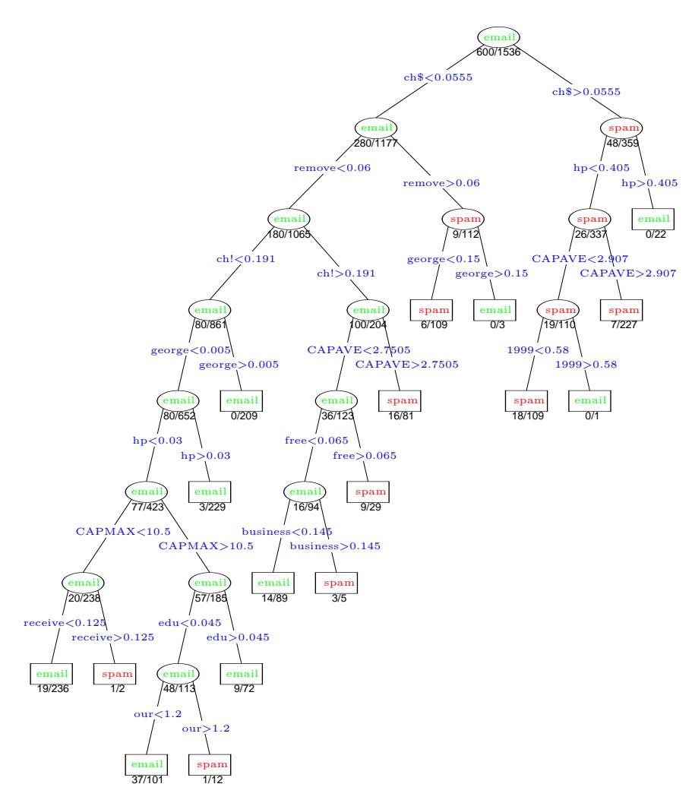

FIGURE 9.5. The pruned tree for the spam example. The split variables are shown in blue on the branches, and the classification is shown in every node.The numbers under the terminal nodes indicate misclassification rates on the test data.

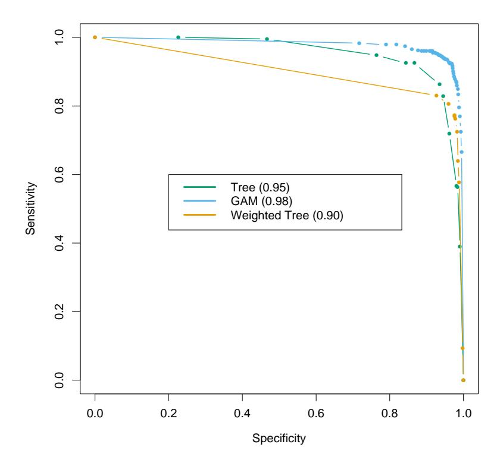

FIGURE 9.6. ROC curves for the classification rules fit to the spam data. Curves that are closer to the northeast corner represent better classifiers. In this case the GAM classifier dominates the trees. The weighted tree achieves better sensitivity for higher specificity than the unweighted tree. The numbers in the legend represent the area under the curve.

If we think of spam and email as the presence and absence of disease, respectively, then from Table 9.3 we have

$$\begin{array}{lcl} \textit{Sensitivity} & = & 100 \times \frac{33.4}{33.4 + 5.3} = 86.3\%, \\ \textit{Specificity} & = & 100 \times \frac{57.3}{57.3 + 4.0} = 93.4\%. \end{array}$$

In this analysis we have used equal losses. As before let  $L_{kk'}$  be the loss associated with predicting a class k object as class k'. By varying the relative sizes of the losses  $L_{01}$  and  $L_{10}$ , we increase the sensitivity and decrease the specificity of the rule, or vice versa. In this example, we want to avoid marking good email as spam, and thus we want the specificity to be very high. We can achieve this by setting  $L_{01} > 1$  say, with  $L_{10} = 1$ . The Bayes' rule in each terminal node classifies to class 1 (spam) if the proportion of spam is  $\geq L_{01}/(L_{10} + L_{01})$ , and class zero otherwise. The

receiver operating characteristic curve (ROC) is a commonly used summary for assessing the tradeoff between sensitivity and specificity. It is a plot of the sensitivity versus specificity as we vary the parameters of a classification rule. Varying the loss L01 between 0.1 and 10, and applying Bayes' rule to the 17-node tree selected in Figure 9.4, produced the ROC curve shown in Figure 9.6. The standard error of each curve near 0.9 is app p roximately 0.9(1 − 0.9)/1536 = 0.008, and hence the standard error of the difference is about 0.01. We see that in order to achieve a specificity of close to 100%, the sensitivity has to drop to about 50%. The area under the curve is a commonly used quantitative summary; extending the curve linearly in each direction so that it is defined over [0, 100], the area is approximately 0.95. For comparison, we have included the ROC curve for the GAM model fit to these data in Section 9.2; it gives a better classification rule for any loss, with an area of 0.98.

Rather than just modifying the Bayes rule in the nodes, it is better to take full account of the unequal losses in growing the tree, as was done in Section 9.2. With just two classes 0 and 1, losses may be incorporated into the tree-growing process by using weight Lk,1−k for an observation in class k. Here we chose L01 = 5, L10 = 1 and fit the same size tree as before (|Tα| = 17). This tree has higher sensitivity at high values of the specificity than the original tree, but does more poorly at the other extreme. Its top few splits are the same as the original tree, and then it departs from it. For this application the tree grown using L01 = 5 is clearly better than the original tree.

The area under the ROC curve, used above, is sometimes called the cstatistic. Interestingly, it can be shown that the area under the ROC curve is equivalent to the Mann-Whitney U statistic (or Wilcoxon rank-sum test), for the median difference between the prediction scores in the two groups (Hanley and McNeil, 1982). For evaluating the contribution of an additional predictor when added to a standard model, the c-statistic may not be an informative measure. The new predictor can be very significant in terms of the change in model deviance, but show only a small increase in the cstatistic. For example, removal of the highly significant term george from the model of Table 9.2 results in a decrease in the c-statistic of less than 0.01. Instead, it is useful to examine how the additional predictor changes the classification on an individual sample basis. A good discussion of this point appears in Cook (2007).

# 9.3 PRIM: Bump Hunting

Tree-based methods (for regression) partition the feature space into boxshaped regions, to try to make the response averages in each box as different as possible. The splitting rules defining the boxes are related to each through a binary tree, facilitating their interpretation.

The patient rule induction method (PRIM) also finds boxes in the feature space, but seeks boxes in which the response average is high. Hence it looks for maxima in the target function, an exercise known as bump hunting. (If minima rather than maxima are desired, one simply works with the negative response values.)

PRIM also differs from tree-based partitioning methods in that the box definitions are not described by a binary tree. This makes interpretation of the collection of rules more difficult; however, by removing the binary tree constraint, the individual rules are often simpler.

The main box construction method in PRIM works from the top down, starting with a box containing all of the data. The box is compressed along one face by a small amount, and the observations then falling outside the box are peeled off. The face chosen for compression is the one resulting in the largest box mean, after the compression is performed. Then the process is repeated, stopping when the current box contains some minimum number of data points.

This process is illustrated in Figure 9.7. There are 200 data points uniformly distributed over the unit square. The color-coded plot indicates the response Y taking the value 1 (red) when 0.5 < X1 < 0.8 and 0.4 < X2 < 0.6. and zero (blue) otherwise. The panels shows the successive boxes found by the top-down peeling procedure, peeling off a proportion α = 0.1 of the remaining data points at each stage.

Figure 9.8 shows the mean of the response values in the box, as the box is compressed.

After the top-down sequence is computed, PRIM reverses the process, expanding along any edge, if such an expansion increases the box mean. This is called pasting. Since the top-down procedure is greedy at each step, such an expansion is often possible.

The result of these steps is a sequence of boxes, with different numbers of observation in each box. Cross-validation, combined with the judgment of the data analyst, is used to choose the optimal box size.

Denote by B1 the indices of the observations in the box found in step 1. The PRIM procedure then removes the observations in B1 from the training set, and the two-step process—top down peeling, followed by bottom-up pasting—is repeated on the remaining dataset. This entire process is repeated several times, producing a sequence of boxes B1, B2, . . . , Bk. Each box is defined by a set of rules involving a subset of predictors like

$$(a_1 \le X_1 \le b_1)$$
 and  $(b_1 \le X_3 \le b_2)$ .

A summary of the PRIM procedure is given Algorithm 9.3.

PRIM can handle a categorical predictor by considering all partitions of the predictor, as in CART. Missing values are also handled in a manner similar to CART. PRIM is designed for regression (quantitative response

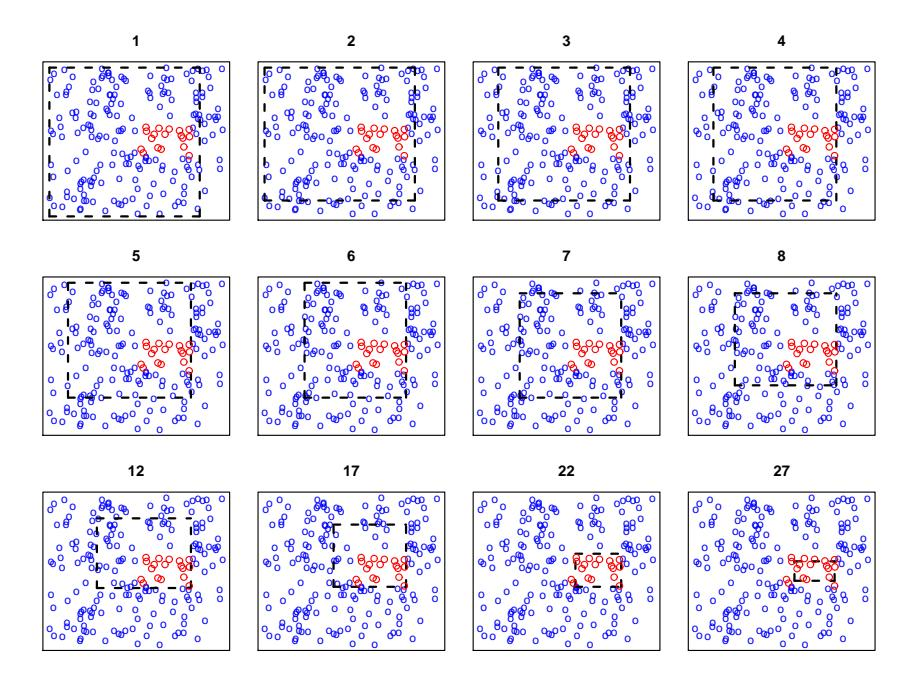

FIGURE 9.7. Illustration of PRIM algorithm. There are two classes, indicated by the blue (class 0) and red (class 1) points. The procedure starts with a rectangle (broken black lines) surrounding all of the data, and then peels away points along one edge by a prespecified amount in order to maximize the mean of the points remaining in the box. Starting at the top left panel, the sequence of peelings is shown, until a pure red region is isolated in the bottom right panel. The iteration number is indicated at the top of each panel.

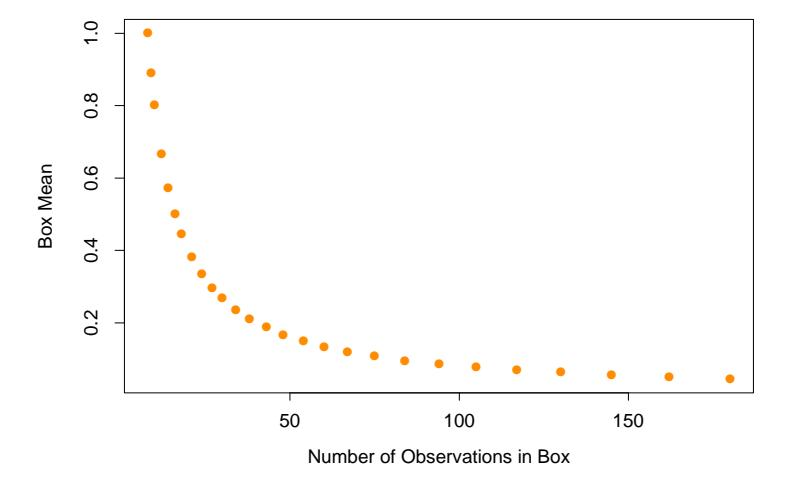

FIGURE 9.8. Box mean as a function of number of observations in the box.

#### Algorithm 9.3 Patient Rule Induction Method.

- 1. Start with all of the training data, and a maximal box containing all of the data.
- 2. Consider shrinking the box by compressing one face, so as to peel off the proportion α of observations having either the highest values of a predictor Xj , or the lowest. Choose the peeling that produces the highest response mean in the remaining box. (Typically α = 0.05 or 0.10.)
- 3. Repeat step 2 until some minimal number of observations (say 10) remain in the box.
- 4. Expand the box along any face, as long as the resulting box mean increases.
- 5. Steps 1–4 give a sequence of boxes, with different numbers of observations in each box. Use cross-validation to choose a member of the sequence. Call the box B1.
- 6. Remove the data in box B1 from the dataset and repeat steps 2–5 to obtain a second box, and continue to get as many boxes as desired.

variable); a two-class outcome can be handled simply by coding it as 0 and 1. There is no simple way to deal with k > 2 classes simultaneously: one approach is to run PRIM separately for each class versus a baseline class.

An advantage of PRIM over CART is its patience. Because of its binary splits, CART fragments the data quite quickly. Assuming splits of equal size, with N observations it can only make log2 (N) − 1 splits before running out of data. If PRIM peels off a proportion α of training points at each stage, it can perform approximately − log(N)/ log(1 − α) peeling steps before running out of data. For example, if N = 128 and α = 0.10, then log2 (N)−1 = 6 while − log(N)/ log(1−α) ≈ 46. Taking into account that there must be an integer number of observations at each stage, PRIM in fact can peel only 29 times. In any case, the ability of PRIM to be more patient should help the top-down greedy algorithm find a better solution.

# 9.3.1 Spam Example (Continued)

We applied PRIM to the spam data, with the response coded as 1 for spam and 0 for email.

The first two boxes found by PRIM are summarized below:

| Rule 1   | Global Mean | Box Mean | Box Support |
|----------|-------------|----------|-------------|
| Training | 0.3931      | 0.9607   | 0.1413      |
| Test     | 0.3958      | 1.0000   | 0.1536      |

$$\mathrm{Rule} \ 1 \left\{ \begin{array}{ll} \mathtt{ch!} &> 0.029 \\ \mathtt{CAPAVE} &> 2.331 \\ \mathtt{your} &> 0.705 \\ \mathtt{1999} &< 0.040 \\ \mathtt{CAPTOT} &> 79.50 \\ \mathtt{edu} &< 0.070 \\ \mathtt{re} &< 0.535 \\ \mathtt{ch;} &< 0.030 \end{array} \right.$$

| Rule 2   | Remain Mean | Box Mean | Box Support |
|----------|-------------|----------|-------------|
| Training | 0.2998      | 0.9560   | 0.1043      |
| Test     | 0.2862      | 0.9264   | 0.1061      |

$$Rule 2 \begin{cases} \text{remove} > 0.010 \\ \text{george} < 0.110 \end{cases}$$

The box support is the proportion of observations falling in the box. The first box is purely spam, and contains about 15% of the test data. The second box contains 10.6% of the test observations, 92.6% of which are spam. Together the two boxes contain 26% of the data and are about 97% spam. The next few boxes (not shown) are quite small, containing only about 3% of the data.

The predictors are listed in order of importance. Interestingly the top splitting variables in the CART tree (Figure 9.5) do not appear in PRIM's first box.

# 9.4 MARS: Multivariate Adaptive Regression Splines

MARS is an adaptive procedure for regression, and is well suited for highdimensional problems (i.e., a large number of inputs). It can be viewed as a generalization of stepwise linear regression or a modification of the CART method to improve the latter's performance in the regression setting. We introduce MARS from the first point of view, and later make the connection to CART.

MARS uses expansions in piecewise linear basis functions of the form (x − t)+ and (t − x)+. The "+" means positive part, so

$$(x-t)_+ = \begin{cases} x-t, & \text{if } x > t, \\ 0, & \text{otherwise,} \end{cases}$$
 and  $(t-x)_+ = \begin{cases} t-x, & \text{if } x < t, \\ 0, & \text{otherwise.} \end{cases}$ 

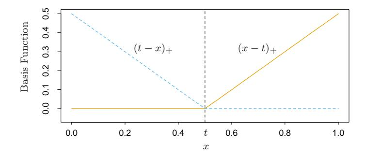

**FIGURE 9.9.** The basis functions  $(x-t)_+$  (solid orange) and  $(t-x)_+$  (broken blue) used by MARS.

As an example, the functions  $(x - 0.5)_+$  and  $(0.5 - x)_+$  are shown in Figure 9.9.

Each function is piecewise linear, with a knot at the value t. In the terminology of Chapter 5, these are linear splines. We call the two functions a reflected pair in the discussion below. The idea is to form reflected pairs for each input  $X_j$  with knots at each observed value  $x_{ij}$  of that input. Therefore, the collection of basis functions is

$$C = \{ (X_j - t)_+, (t - X_j)_+ \} \underset{j = 1, 2, \dots, p}{t \in \{x_{1j}, x_{2j}, \dots, x_{Nj}\}}$$

$$(9.18)$$

If all of the input values are distinct, there are 2Np basis functions altogether. Note that although each basis function depends only on a single  $X_j$ , for example,  $h(X) = (X_j - t)_+$ , it is considered as a function over the entire input space  $\mathbb{R}^p$ .

The model-building strategy is like a forward stepwise linear regression, but instead of using the original inputs, we are allowed to use functions from the set  $\mathcal{C}$  and their products. Thus the model has the form

$$f(X) = \beta_0 + \sum_{m=1}^{M} \beta_m h_m(X), \tag{9.19}$$

where each  $h_m(X)$  is a function in C, or a product of two or more such functions.

Given a choice for the  $h_m$ , the coefficients  $\beta_m$  are estimated by minimizing the residual sum-of-squares, that is, by standard linear regression. The real art, however, is in the construction of the functions  $h_m(x)$ . We start with only the constant function  $h_0(X) = 1$  in our model, and all functions in the set  $\mathcal{C}$  are candidate functions. This is depicted in Figure 9.10.

At each stage we consider as a new basis function pair all products of a function  $h_m$  in the model set  $\mathcal{M}$  with one of the reflected pairs in  $\mathcal{C}$ . We add to the model  $\mathcal{M}$  the term of the form

$$\hat{\beta}_{M+1}h_{\ell}(X)\cdot(X_j-t)_+ + \hat{\beta}_{M+2}h_{\ell}(X)\cdot(t-X_j)_+, \ h_{\ell}\in\mathcal{M},$$

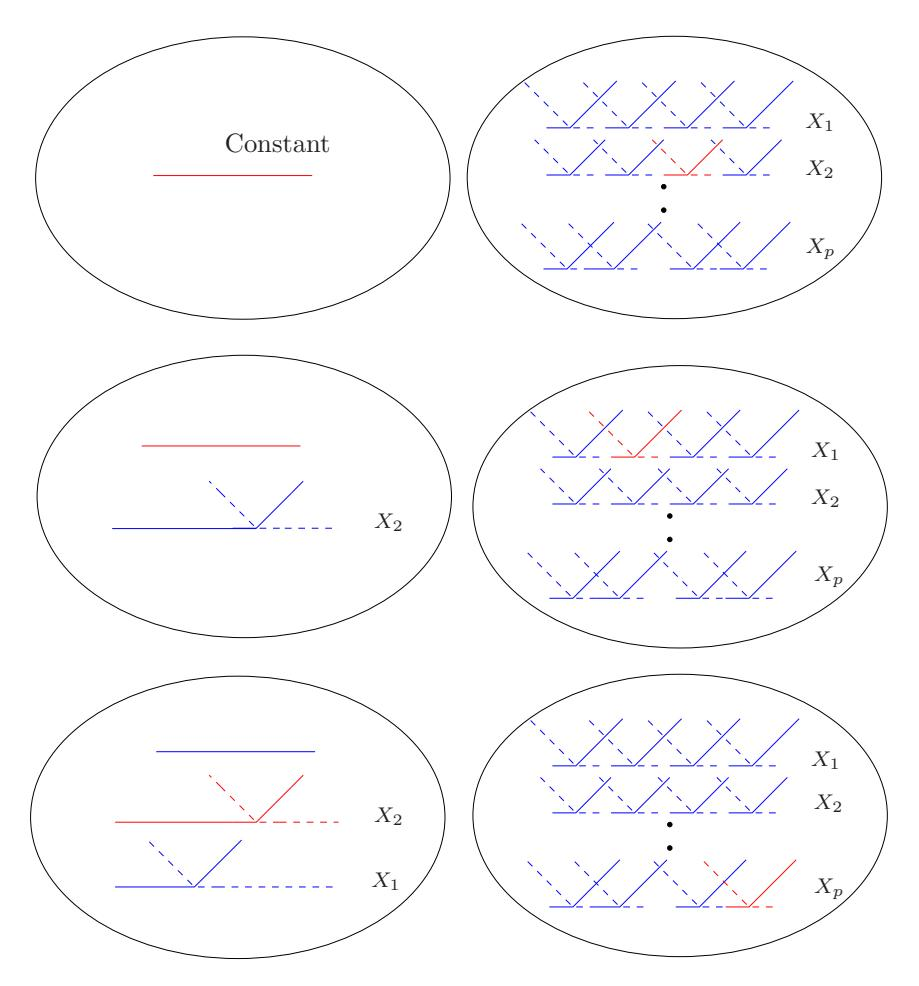

FIGURE 9.10. Schematic of the MARS forward model-building procedure. On the left are the basis functions currently in the model: initially, this is the constant function h(X) = 1. On the right are all candidate basis functions to be considered in building the model. These are pairs of piecewise linear basis functions as in Figure 9.9, with knots t at all unique observed values xij of each predictor Xj . At each stage we consider all products of a candidate pair with a basis function in the model. The product that decreases the residual error the most is added into the current model. Above we illustrate the first three steps of the procedure, with the selected functions shown in red.

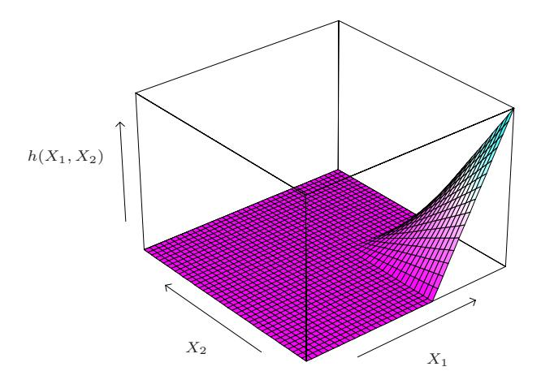

**FIGURE 9.11.** The function  $h(X_1, X_2) = (X_1 - x_{51})_+ \cdot (x_{72} - X_2)_+$ , resulting from multiplication of two piecewise linear MARS basis functions.

that produces the largest decrease in training error. Here  $\hat{\beta}_{M+1}$  and  $\hat{\beta}_{M+2}$  are coefficients estimated by least squares, along with all the other M+1 coefficients in the model. Then the winning products are added to the model and the process is continued until the model set  $\mathcal{M}$  contains some preset maximum number of terms.

For example, at the first stage we consider adding to the model a function of the form  $\beta_1(X_j-t)_++\beta_2(t-X_j)_+$ ;  $t\in\{x_{ij}\}$ , since multiplication by the constant function just produces the function itself. Suppose the best choice is  $\hat{\beta}_1(X_2-x_{72})_++\hat{\beta}_2(x_{72}-X_2)_+$ . Then this pair of basis functions is added to the set  $\mathcal{M}$ , and at the next stage we consider including a pair of products the form

$$h_m(X) \cdot (X_j - t)_+$$
 and  $h_m(X) \cdot (t - X_j)_+, t \in \{x_{ij}\},\$ 

where for  $h_m$  we have the choices

$$h_0(X) = 1,$$
  
 $h_1(X) = (X_2 - x_{72})_+, \text{ or }$   
 $h_2(X) = (x_{72} - X_2)_+.$ 

The third choice produces functions such as  $(X_1 - x_{51})_+ \cdot (x_{72} - X_2)_+$ , depicted in Figure 9.11.

At the end of this process we have a large model of the form (9.19). This model typically overfits the data, and so a backward deletion procedure is applied. The term whose removal causes the smallest increase in residual squared error is deleted from the model at each stage, producing an estimated best model  $\hat{f}_{\lambda}$  of each size (number of terms)  $\lambda$ . One could use cross-validation to estimate the optimal value of  $\lambda$ , but for computational

savings the MARS procedure instead uses generalized cross-validation. This criterion is defined as

$$GCV(\lambda) = \frac{\sum_{i=1}^{N} (y_i - \hat{f}_{\lambda}(x_i))^2}{(1 - M(\lambda)/N)^2}.$$
 (9.20)

The value M(λ) is the effective number of parameters in the model: this accounts both for the number of terms in the models, plus the number of parameters used in selecting the optimal positions of the knots. Some mathematical and simulation results suggest that one should pay a price of three parameters for selecting a knot in a piecewise linear regression.

Thus if there are r linearly independent basis functions in the model, and K knots were selected in the forward process, the formula is M(λ) = r+cK, where c = 3. (When the model is restricted to be additive—details below a penalty of c = 2 is used). Using this, we choose the model along the backward sequence that minimizes GCV(λ).

Why these piecewise linear basis functions, and why this particular model strategy? A key property of the functions of Figure 9.9 is their ability to operate locally; they are zero over part of their range. When they are multiplied together, as in Figure 9.11, the result is nonzero only over the small part of the feature space where both component functions are nonzero. As a result, the regression surface is built up parsimoniously, using nonzero components locally—only where they are needed. This is important, since one should "spend" parameters carefully in high dimensions, as they can run out quickly. The use of other basis functions such as polynomials, would produce a nonzero product everywhere, and would not work as well.

The second important advantage of the piecewise linear basis function concerns computation. Consider the product of a function in M with each of the N reflected pairs for an input Xj . This appears to require the fitting of N single-input linear regression models, each of which uses O(N) operations, making a total of O(N2 ) operations. However, we can exploit the simple form of the piecewise linear function. We first fit the reflected pair with rightmost knot. As the knot is moved successively one position at a time to the left, the basis functions differ by zero over the left part of the domain, and by a constant over the right part. Hence after each such move we can update the fit in O(1) operations. This allows us to try every knot in only O(N) operations.

The forward modeling strategy in MARS is hierarchical, in the sense that multiway products are built up from products involving terms already in the model. For example, a four-way product can only be added to the model if one of its three-way components is already in the model. The philosophy here is that a high-order interaction will likely only exist if some of its lowerorder "footprints" exist as well. This need not be true, but is a reasonable working assumption and avoids the search over an exponentially growing space of alternatives.

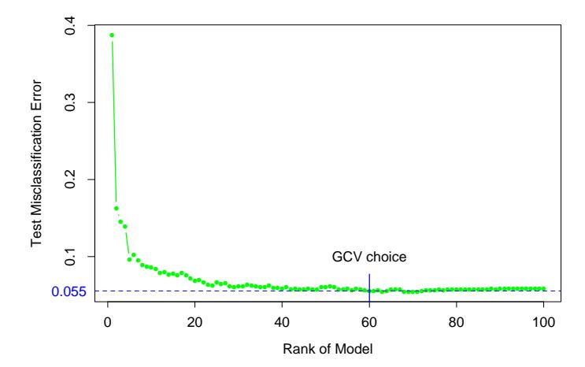

**FIGURE 9.12.** Spam data: test error misclassification rate for the MARS procedure, as a function of the rank (number of independent basis functions) in the model.

There is one restriction put on the formation of model terms: each input can appear at most once in a product. This prevents the formation of higher-order powers of an input, which increase or decrease too sharply near the boundaries of the feature space. Such powers can be approximated in a more stable way with piecewise linear functions.

A useful option in the MARS procedure is to set an upper limit on the order of interaction. For example, one can set a limit of two, allowing pairwise products of piecewise linear functions, but not three- or higherway products. This can aid in the interpretation of the final model. An upper limit of one results in an additive model.

## 9.4.1 Spam Example (Continued)

We applied MARS to the "spam" data analyzed earlier in this chapter. To enhance interpretability, we restricted MARS to second-degree interactions. Although the target is a two-class variable, we used the squared-error loss function nonetheless (see Section 9.4.3). Figure 9.12 shows the test error misclassification rate as a function of the rank (number of independent basis functions) in the model. The error rate levels off at about 5.5%, which is slightly higher than that of the generalized additive model (5.3%) discussed earlier. GCV chose a model size of 60, which is roughly the smallest model giving optimal performance. The leading interactions found by MARS involved inputs (ch\$, remove), (ch\$, free) and (hp, CAPTOT). However, these interactions give no improvement in performance over the generalized additive model.

#### 9.4.2 Example (Simulated Data)

Here we examine the performance of MARS in three contrasting scenarios. There are N=100 observations, and the predictors  $X_1, X_2, \ldots, X_p$  and errors  $\varepsilon$  have independent standard normal distributions.

Scenario 1: The data generation model is

$$Y = (X_1 - 1)_+ + (X_1 - 1)_+ \cdot (X_2 - .8)_+ + 0.12 \cdot \varepsilon. \tag{9.21}$$

The noise standard deviation 0.12 was chosen so that the signal-tonoise ratio was about 5. We call this the tensor-product scenario; the product term gives a surface that looks like that of Figure 9.11.

Scenario 2: This is the same as scenario 1, but with p = 20 total predictors; that is, there are 18 inputs that are independent of the response.

Scenario 3: This has the structure of a neural network:

$$\ell_1 = X_1 + X_2 + X_3 + X_4 + X_5, 
\ell_2 = X_6 - X_7 + X_8 - X_9 + X_{10}, 
\sigma(t) = 1/(1 + e^{-t}), 
Y = \sigma(\ell_1) + \sigma(\ell_2) + 0.12 \cdot \varepsilon.$$
(9.22)

Scenarios 1 and 2 are ideally suited for MARS, while scenario 3 contains high-order interactions and may be difficult for MARS to approximate. We ran five simulations from each model, and recorded the results.

In scenario 1, MARS typically uncovered the correct model almost perfectly. In scenario 2, it found the correct structure but also found a few extraneous terms involving other predictors.

Let  $\mu(x)$  be the true mean of Y, and let

$$MSE_0 = ave_{x \in Test}(\bar{y} - \mu(x))^2,$$
  

$$MSE = ave_{x \in Test}(\hat{f}(x) - \mu(x))^2.$$
(9.23)

These represent the mean-square error of the constant model and the fitted MARS model, estimated by averaging at the 1000 test values of x. Table 9.4 shows the proportional decrease in model error or  $\mathbb{R}^2$  for each scenario:

$$R^2 = \frac{\text{MSE}_0 - \text{MSE}}{\text{MSE}_0}.$$
 (9.24)

The values shown are means and standard error over the five simulations. The performance of MARS is degraded only slightly by the inclusion of the useless inputs in scenario 2; it performs substantially worse in scenario 3.

| Scenario                       | Mean (S.E.) |
|--------------------------------|-------------|
| 1: Tensor product p = 2  | 0.97 (0.01) |
| 2: Tensor product p = 20 | 0.96 (0.01) |
| 3: Neural network              | 0.79 (0.01) |

TABLE 9.4. Proportional decrease in model error (R 2 ) when MARS is applied to three different scenarios.

## 9.4.3 Other Issues

#### MARS for Classification

The MARS method and algorithm can be extended to handle classification problems. Several strategies have been suggested.

For two classes, one can code the output as 0/1 and treat the problem as a regression; we did this for the spam example. For more than two classes, one can use the indicator response approach described in Section 4.2. One codes the K response classes via 0/1 indicator variables, and then performs a multi-response MARS regression. For the latter we use a common set of basis functions for all response variables. Classification is made to the class with the largest predicted response value. There are, however, potential masking problems with this approach, as described in Section 4.2. A generally superior approach is the "optimal scoring" method discussed in Section 12.5.

Stone et al. (1997) developed a hybrid of MARS called PolyMARS specifically designed to handle classification problems. It uses the multiple logistic framework described in Section 4.4. It grows the model in a forward stagewise fashion like MARS, but at each stage uses a quadratic approximation to the multinomial log-likelihood to search for the next basis-function pair. Once found, the enlarged model is fit by maximum likelihood, and the process is repeated.

#### Relationship of MARS to CART

Although they might seem quite different, the MARS and CART strategies actually have strong similarities. Suppose we take the MARS procedure and make the following changes:

- Replace the piecewise linear basis functions by step functions I(x−t > 0) and I(x − t ≤ 0).
- When a model term is involved in a multiplication by a candidate term, it gets replaced by the interaction, and hence is not available for further interactions.

With these changes, the MARS forward procedure is the same as the CART tree-growing algorithm. Multiplying a step function by a pair of reflected step functions is equivalent to splitting a node at the step. The second restriction implies that a node may not be split more than once, and leads to the attractive binary-tree representation of the CART model. On the other hand, it is this restriction that makes it difficult for CART to model additive structures. MARS forgoes the tree structure and gains the ability to capture additive effects.

#### Mixed Inputs

Mars can handle "mixed" predictors—quantitative and qualitative—in a natural way, much like CART does. MARS considers all possible binary partitions of the categories for a qualitative predictor into two groups. Each such partition generates a pair of piecewise constant basis functions indicator functions for the two sets of categories. This basis pair is now treated as any other, and is used in forming tensor products with other basis functions already in the model.

# 9.5 Hierarchical Mixtures of Experts

The hierarchical mixtures of experts (HME) procedure can be viewed as a variant of tree-based methods. The main difference is that the tree splits are not hard decisions but rather soft probabilistic ones. At each node an observation goes left or right with probabilities depending on its input values. This has some computational advantages since the resulting parameter optimization problem is smooth, unlike the discrete split point search in the tree-based approach. The soft splits might also help in prediction accuracy and provide a useful alternative description of the data.

There are other differences between HMEs and the CART implementation of trees. In an HME, a linear (or logistic regression) model is fit in each terminal node, instead of a constant as in CART. The splits can be multiway, not just binary, and the splits are probabilistic functions of a linear combination of inputs, rather than a single input as in the standard use of CART. However, the relative merits of these choices are not clear, and most were discussed at the end of Section 9.2.

A simple two-level HME model in shown in Figure 9.13. It can be thought of as a tree with soft splits at each non-terminal node. However, the inventors of this methodology use a different terminology. The terminal nodes are called experts, and the non-terminal nodes are called gating networks. The idea is that each expert provides an opinion (prediction) about the response, and these are combined together by the gating networks. As we will see, the model is formally a mixture model, and the two-level model in the figure can be extend to multiple levels, hence the name hierarchical mixtures of experts.

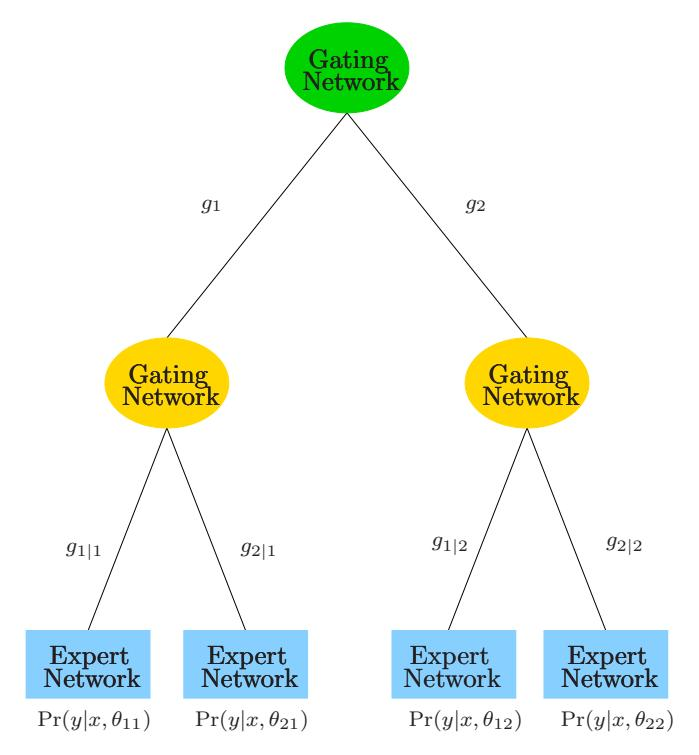

FIGURE 9.13. A two-level hierarchical mixture of experts (HME) model.

Consider the regression or classification problem, as described earlier in the chapter. The data is  $(x_i, y_i)$ , i = 1, 2, ..., N, with  $y_i$  either a continuous or binary-valued response, and  $x_i$  a vector-valued input. For ease of notation we assume that the first element of  $x_i$  is one, to account for intercepts.

Here is how an HME is defined. The top gating network has the output

$$g_j(x, \gamma_j) = \frac{e^{\gamma_j^T x}}{\sum_{k=1}^K e^{\gamma_k^T x}}, \ j = 1, 2, \dots, K,$$
 (9.25)

where each  $\gamma_j$  is a vector of unknown parameters. This represents a soft K-way split (K=2 in Figure 9.13.) Each  $g_j(x,\gamma_j)$  is the probability of assigning an observation with feature vector x to the jth branch. Notice that with K=2 groups, if we take the coefficient of one of the elements of x to be  $+\infty$ , then we get a logistic curve with infinite slope. In this case, the gating probabilities are either 0 or 1, corresponding to a hard split on that input.

At the second level, the gating networks have a similar form:

$$g_{\ell|j}(x,\gamma_{j\ell}) = \frac{e^{\gamma_{j\ell}^T x}}{\sum_{k=1}^K e^{\gamma_{jk}^T x}}, \ \ell = 1, 2, \dots, K.$$
 (9.26)

This is the probability of assignment to the  $\ell$ th branch, given assignment to the jth branch at the level above.

At each expert (terminal node), we have a model for the response variable of the form

$$Y \sim \Pr(y|x, \theta_{j\ell}).$$
 (9.27)

This differs according to the problem.

Regression: The Gaussian linear regression model is used, with  $\theta_{j\ell} = (\beta_{j\ell}, \sigma_{j\ell}^2)$ :

$$Y = \beta_{j\ell}^T x + \varepsilon \text{ and } \varepsilon \sim N(0, \sigma_{j\ell}^2).$$
 (9.28)

Classification: The linear logistic regression model is used:

$$\Pr(Y = 1|x, \theta_{j\ell}) = \frac{1}{1 + e^{-\theta_{j\ell}^T x}}.$$
(9.29)

Denoting the collection of all parameters by  $\Psi = \{\gamma_j, \gamma_{j\ell}, \theta_{j\ell}\}$ , the total probability that Y = y is

$$\Pr(y|x,\Psi) = \sum_{i=1}^{K} g_j(x,\gamma_j) \sum_{\ell=1}^{K} g_{\ell|j}(x,\gamma_{j\ell}) \Pr(y|x,\theta_{j\ell}). \tag{9.30}$$

This is a mixture model, with the mixture probabilities determined by the gating network models.

To estimate the parameters, we maximize the log-likelihood of the data,  $\sum_i \log \Pr(y_i|x_i, \Psi)$ , over the parameters in  $\Psi$ . The most convenient method for doing this is the EM algorithm, which we describe for mixtures in Section 8.5. We define latent variables  $\Delta_j$ , all of which are zero except for a single one. We interpret these as the branching decisions made by the top level gating network. Similarly we define latent variables  $\Delta_{\ell|j}$  to describe the gating decisions at the second level.

In the E-step, the EM algorithm computes the expectations of the  $\Delta_j$  and  $\Delta_{\ell|j}$  given the current values of the parameters. These expectations are then used as observation weights in the M-step of the procedure, to estimate the parameters in the expert networks. The parameters in the internal nodes are estimated by a version of multiple logistic regression. The expectations of the  $\Delta_j$  or  $\Delta_{\ell|j}$  are probability profiles, and these are used as the response vectors for these logistic regressions.

The hierarchical mixtures of experts approach is a promising competitor to CART trees. By using *soft splits* rather than hard decision rules it can capture situations where the transition from low to high response is gradual. The log-likelihood is a smooth function of the unknown weights and hence is amenable to numerical optimization. The model is similar to CART with linear combination splits, but the latter is more difficult to optimize. On

the other hand, to our knowledge there are no methods for finding a good tree topology for the HME model, as there are in CART. Typically one uses a fixed tree of some depth, possibly the output of the CART procedure. The emphasis in the research on HMEs has been on prediction rather than interpretation of the final model. A close cousin of the HME is the latent class model (Lin et al., 2000), which typically has only one layer; here the nodes or latent classes are interpreted as groups of subjects that show similar response behavior.

# 9.6 Missing Data

It is quite common to have observations with missing values for one or more input features. The usual approach is to impute (fill-in) the missing values in some way.

However, the first issue in dealing with the problem is determining whether the missing data mechanism has distorted the observed data. Roughly speaking, data are missing at random if the mechanism resulting in its omission is independent of its (unobserved) value. A more precise definition is given in Little and Rubin (2002). Suppose y is the response vector and X is the N × p matrix of inputs (some of which are missing). Denote by Xobs the observed entries in X and let Z = (y, X), Zobs = (y, Xobs). Finally, if R is an indicator matrix with ijth entry 1 if xij is missing and zero otherwise, then the data is said to be missing at random (MAR) if the distribution of R depends on the data Z only through Zobs:

$$Pr(\mathbf{R}|\mathbf{Z},\theta) = Pr(\mathbf{R}|\mathbf{Z}_{obs},\theta). \tag{9.31}$$

Here θ are any parameters in the distribution of R. Data are said to be missing completely at random (MCAR) if the distribution of R doesn't depend on the observed or missing data:

$$\Pr(\mathbf{R}|\mathbf{Z},\theta) = \Pr(\mathbf{R}|\theta). \tag{9.32}$$

MCAR is a stronger assumption than MAR: most imputation methods rely on MCAR for their validity.

For example, if a patient's measurement was not taken because the doctor felt he was too sick, that observation would not be MAR or MCAR. In this case the missing data mechanism causes our observed training data to give a distorted picture of the true population, and data imputation is dangerous in this instance. Often the determination of whether features are MCAR must be made from information about the data collection process. For categorical features, one way to diagnose this problem is to code "missing" as an additional class. Then we fit our model to the training data and see if class "missing" is predictive of the response.

Assuming the features are missing completely at random, there are a number of ways of proceeding:

- 1. Discard observations with any missing values.
- 2. Rely on the learning algorithm to deal with missing values in its training phase.
- 3. Impute all missing values before training.

Approach (1) can be used if the relative amount of missing data is small, but otherwise should be avoided. Regarding (2), CART is one learning algorithm that deals effectively with missing values, through surrogate splits (Section 9.2.4). MARS and PRIM use similar approaches. In generalized additive modeling, all observations missing for a given input feature are omitted when the partial residuals are smoothed against that feature in the backfitting algorithm, and their fitted values are set to zero. Since the fitted curves have mean zero (when the model includes an intercept), this amounts to assigning the average fitted value to the missing observations.

For most learning methods, the imputation approach (3) is necessary. The simplest tactic is to impute the missing value with the mean or median of the nonmissing values for that feature. (Note that the above procedure for generalized additive models is analogous to this.)

If the features have at least some moderate degree of dependence, one can do better by estimating a predictive model for each feature given the other features and then imputing each missing value by its prediction from the model. In choosing the learning method for imputation of the features, one must remember that this choice is distinct from the method used for predicting y from X. Thus a flexible, adaptive method will often be preferred, even for the eventual purpose of carrying out a linear regression of y on X. In addition, if there are many missing feature values in the training set, the learning method must itself be able to deal with missing feature values. CART therefore is an ideal choice for this imputation "engine."

After imputation, missing values are typically treated as if they were actually observed. This ignores the uncertainty due to the imputation, which will itself introduce additional uncertainty into estimates and predictions from the response model. One can measure this additional uncertainty by doing multiple imputations and hence creating many different training sets. The predictive model for y can be fit to each training set, and the variation across training sets can be assessed. If CART was used for the imputation engine, the multiple imputations could be done by sampling from the values in the corresponding terminal nodes.

# 9.7 Computational Considerations

With N observations and p predictors, additive model fitting requires some number mp of applications of a one-dimensional smoother or regression method. The required number of cycles m of the backfitting algorithm is usually less than 20 and often less than 10, and depends on the amount of correlation in the inputs. With cubic smoothing splines, for example, N log N operations are needed for an initial sort and N operations for the spline fit. Hence the total operations for an additive model fit is pN log N + mpN.

Trees require pN log N operations for an initial sort for each predictor, and typically another pN log N operations for the split computations. If the splits occurred near the edges of the predictor ranges, this number could increase to N2p.

MARS requires Nm2 + pmN operations to add a basis function to a model with m terms already present, from a pool of p predictors. Hence to build an M-term model requires NM3 + pM2N computations, which can be quite prohibitive if M is a reasonable fraction of N.

Each of the components of an HME are typically inexpensive to fit at each M-step: N p2 for the regressions, and N p2K2 for a K-class logistic regression. The EM algorithm, however, can take a long time to converge, and so sizable HME models are considered costly to fit.

# Bibliographic Notes

The most comprehensive source for generalized additive models is the text of that name by Hastie and Tibshirani (1990). Different applications of this work in medical problems are discussed in Hastie et al. (1989) and Hastie and Herman (1990), and the software implementation in Splus is described in Chambers and Hastie (1991). Green and Silverman (1994) discuss penalization and spline models in a variety of settings. Efron and Tibshirani (1991) give an exposition of modern developments in statistics (including generalized additive models), for a nonmathematical audience. Classification and regression trees date back at least as far as Morgan and Sonquist (1963). We have followed the modern approaches of Breiman et al. (1984) and Quinlan (1993). The PRIM method is due to Friedman and Fisher (1999), while MARS is introduced in Friedman (1991), with an additive precursor in Friedman and Silverman (1989). Hierarchical mixtures of experts were proposed in Jordan and Jacobs (1994); see also Jacobs et al. (1991).

#### Exercises

- Ex. 9.1 Show that a smoothing spline fit of  $y_i$  to  $x_i$  preserves the *linear* part of the fit. In other words, if  $y_i = \hat{y}_i + r_i$ , where  $\hat{y}_i$  represents the linear regression fits, and **S** is the smoothing matrix, then  $\mathbf{S}\mathbf{y} = \hat{\mathbf{y}} + \mathbf{S}\mathbf{r}$ . Show that the same is true for local linear regression (Section 6.1.1). Hence argue that the adjustment step in the second line of (2) in Algorithm 9.1 is unnecessary.
- Ex. 9.2 Let **A** be a known  $k \times k$  matrix, **b** be a known k-vector, and **z** be an unknown k-vector. A Gauss–Seidel algorithm for solving the linear system of equations  $\mathbf{Az} = \mathbf{b}$  works by successively solving for element  $z_j$  in the jth equation, fixing all other  $z_j$ 's at their current guesses. This process is repeated for  $j = 1, 2, \ldots, k, 1, 2, \ldots, k, \ldots$ , until convergence (Golub and Van Loan, 1983).
  - (a) Consider an additive model with N observations and p terms, with the jth term to be fit by a linear smoother  $\mathbf{S}_{j}$ . Consider the following system of equations:

$$\begin{pmatrix}
\mathbf{I} & \mathbf{S}_{1} & \mathbf{S}_{1} & \cdots & \mathbf{S}_{1} \\
\mathbf{S}_{2} & \mathbf{I} & \mathbf{S}_{2} & \cdots & \mathbf{S}_{2} \\
\vdots & \vdots & \vdots & \ddots & \vdots \\
\mathbf{S}_{p} & \mathbf{S}_{p} & \mathbf{S}_{p} & \cdots & \mathbf{I}
\end{pmatrix}
\begin{pmatrix}
\mathbf{f}_{1} \\
\mathbf{f}_{2} \\
\vdots \\
\mathbf{f}_{p}
\end{pmatrix} =
\begin{pmatrix}
\mathbf{S}_{1}\mathbf{y} \\
\mathbf{S}_{2}\mathbf{y} \\
\vdots \\
\mathbf{S}_{p}\mathbf{y}
\end{pmatrix}.$$
(9.33)

Here each  $\mathbf{f}_j$  is an N-vector of evaluations of the jth function at the data points, and  $\mathbf{y}$  is an N-vector of the response values. Show that backfitting is a blockwise Gauss–Seidel algorithm for solving this system of equations.

- (b) Let  $S_1$  and  $S_2$  be symmetric smoothing operators (matrices) with eigenvalues in [0,1). Consider a backfitting algorithm with response vector  $\mathbf{y}$  and smoothers  $S_1, S_2$ . Show that with any starting values, the algorithm converges and give a formula for the final iterates.
- Ex. 9.3 Backfitting equations. Consider a backfitting procedure with orthogonal projections, and let  $\mathbf{D}$  be the overall regression matrix whose columns span  $V = \mathcal{L}_{\text{col}}(\mathbf{S}_1) \oplus \mathcal{L}_{\text{col}}(\mathbf{S}_2) \oplus \cdots \oplus \mathcal{L}_{\text{col}}(\mathbf{S}_p)$ , where  $\mathcal{L}_{\text{col}}(\mathbf{S})$  denotes the column space of a matrix S. Show that the estimating equations

$$\begin{pmatrix} \mathbf{I} & \mathbf{S}_1 & \mathbf{S}_1 & \cdots & \mathbf{S}_1 \\ \mathbf{S}_2 & \mathbf{I} & \mathbf{S}_2 & \cdots & \mathbf{S}_2 \\ \vdots & \vdots & \vdots & \ddots & \vdots \\ \mathbf{S}_p & \mathbf{S}_p & \mathbf{S}_p & \cdots & \mathbf{I} \end{pmatrix} \begin{pmatrix} \mathbf{f}_1 \\ \mathbf{f}_2 \\ \vdots \\ \mathbf{f}_p \end{pmatrix} = \begin{pmatrix} \mathbf{S}_1 \mathbf{y} \\ \mathbf{S}_2 \mathbf{y} \\ \vdots \\ \mathbf{S}_p \mathbf{y} \end{pmatrix}$$

are equivalent to the least squares normal equations  $\mathbf{D}^T \mathbf{D} \beta = \mathbf{D}^T \mathbf{y}$  where  $\beta$  is the vector of coefficients.

Ex. 9.4 Suppose the same smoother S is used to estimate both terms in a two-term additive model (i.e., both variables are identical). Assume that S is symmetric with eigenvalues in [0,1). Show that the backfitting residual converges to  $(I + S)^{-1}(I - S)y$ , and that the residual sum of squares converges upward. Can the residual sum of squares converge upward in less structured situations? How does this fit compare to the fit with a single term fit by S? [Hint: Use the eigen-decomposition of S to help with this comparison.]

Ex. 9.5 Degrees of freedom of a tree. Given data  $y_i$  with mean  $f(x_i)$  and variance  $\sigma^2$ , and a fitting operation  $\mathbf{y} \to \hat{\mathbf{y}}$ , let's define the degrees of freedom of a fit by  $\sum_i \text{cov}(y_i, \hat{y}_i)/\sigma^2$ .

Consider a fit  $\hat{\mathbf{y}}$  estimated by a regression tree, fit to a set of predictors  $X_1, X_2, \dots, X_p$ .

- (a) In terms of the number of terminal nodes m, give a rough formula for the degrees of freedom of the fit.
- (b) Generate 100 observations with predictors  $X_1, X_2, ..., X_{10}$  as independent standard Gaussian variates and fix these values.
- (c) Generate response values also as standard Gaussian ( $\sigma^2 = 1$ ), independent of the predictors. Fit regression trees to the data of fixed size 1,5 and 10 terminal nodes and hence estimate the degrees of freedom of each fit. [Do ten simulations of the response and average the results, to get a good estimate of degrees of freedom.]
- (d) Compare your estimates of degrees of freedom in (a) and (c) and discuss.
- (e) If the regression tree fit were a linear operation, we could write  $\hat{\mathbf{y}} = \mathbf{S}\mathbf{y}$  for some matrix  $\mathbf{S}$ . Then the degrees of freedom would be  $\mathrm{tr}(\mathbf{S})$ . Suggest a way to compute an approximate  $\mathbf{S}$  matrix for a regression tree, compute it and compare the resulting degrees of freedom to those in (a) and (c).

Ex. 9.6 Consider the ozone data of Figure 6.9.

- (a) Fit an additive model to the cube root of ozone concentration. as a function of temperature, wind speed, and radiation. Compare your results to those obtained via the trellis display in Figure 6.9.
- (b) Fit trees, MARS, and PRIM to the same data, and compare the results to those found in (a) and in Figure 6.9.