# Boosting and Additive Trees

# 10.1 Boosting Methods

Boosting is one of the most powerful learning ideas introduced in the last twenty years. It was originally designed for classification problems, but as will be seen in this chapter, it can profitably be extended to regression as well. The motivation for boosting was a procedure that combines the outputs of many "weak" classifiers to produce a powerful "committee." From this perspective boosting bears a resemblance to bagging and other committee-based approaches (Section 8.8). However we shall see that the connection is at best superficial and that boosting is fundamentally different.

We begin by describing the most popular boosting algorithm due to Freund and Schapire (1997) called "AdaBoost.M1." Consider a two-class problem, with the output variable coded as Y $\in$ {−1, 1}. Given a vector of predictor variables X, a classifier G(X) produces a prediction taking one of the two values {−1, 1}. The error rate on the training sample is

$$\overline{\text{err}} = \frac{1}{N} \sum_{i=1}^{N} I(y_i \neq G(x_i)),$$

and the expected error rate on future predictions is EXY I(Y 6= G(X)).

A weak classifier is one whose error rate is only slightly better than random guessing. The purpose of boosting is to sequentially apply the weak classification algorithm to repeatedly modified versions of the data, thereby producing a sequence of weak classifiers Gm(x), m = 1, 2, . . . , M.

#### Final Classifier

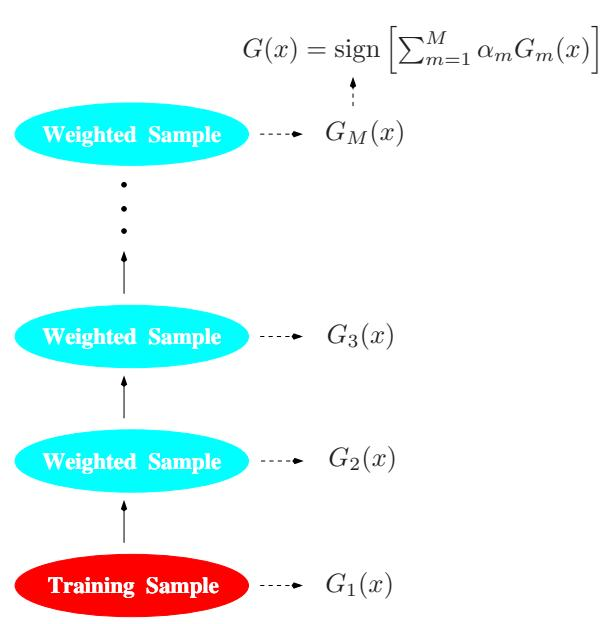

FIGURE 10.1. Schematic of AdaBoost. Classifiers are trained on weighted versions of the dataset, and then combined to produce a final prediction.

The predictions from all of them are then combined through a weighted majority vote to produce the final prediction:

$$G(x) = \operatorname{sign}\left(\sum_{m=1}^{M} \alpha_m G_m(x)\right). \tag{10.1}$$

Here $\alpha$1, $\alpha$2, . . . , $\alpha$$^{M}$ are computed by the boosting algorithm, and weight the contribution of each respective Gm(x). Their effect is to give higher influence to the more accurate classifiers in the sequence. Figure 10.1 shows a schematic of the AdaBoost procedure.

The data modifications at each boosting step consist of applying weights w1, w2, . . . , w$^{N}$ to each of the training observations (x$^{i}$ , yi), i = 1, 2, . . . , N. Initially all of the weights are set to w$^{i}$ = 1/N, so that the first step simply trains the classifier on the data in the usual manner. For each successive iteration m = 2, 3, . . . , M the observation weights are individually modified and the classification algorithm is reapplied to the weighted observations. At step m, those observations that were misclassified by the classifier Gm−1(x) induced at the previous step have their weights increased, whereas the weights are decreased for those that were classified correctly. Thus as iterations proceed, observations that are difficult to classify correctly receive ever-increasing influence. Each successive classifier is thereby forced

#### Algorithm 10.1 AdaBoost.M1.

- 1. Initialize the observation weights  $w_i = 1/N$ , i = 1, 2, ..., N.
- 2. For m=1 to M:
  - (a) Fit a classifier  $G_m(x)$  to the training data using weights  $w_i$ .
  - (b) Compute

$$err_m = \frac{\sum_{i=1}^{N} w_i I(y_i \neq G_m(x_i))}{\sum_{i=1}^{N} w_i}.$$

- (c) Compute  $\alpha_m = \log((1 \operatorname{err}_m)/\operatorname{err}_m)$ .
- (d) Set  $w_i \leftarrow w_i \cdot \exp[\alpha_m \cdot I(y_i \neq G_m(x_i))], i = 1, 2, \dots, N$ .
- 3. Output  $G(x) = \text{sign} \left[ \sum_{m=1}^{M} \alpha_m G_m(x) \right]$ .

to concentrate on those training observations that are missed by previous ones in the sequence.

Algorithm 10.1 shows the details of the AdaBoost.M1 algorithm. The current classifier  $G_m(x)$  is induced on the weighted observations at line 2a. The resulting weighted error rate is computed at line 2b. Line 2c calculates the weight  $\alpha_m$  given to  $G_m(x)$  in producing the final classifier G(x) (line 3). The individual weights of each of the observations are updated for the next iteration at line 2d. Observations misclassified by  $G_m(x)$  have their weights scaled by a factor  $\exp(\alpha_m)$ , increasing their relative influence for inducing the next classifier  $G_{m+1}(x)$  in the sequence.

The AdaBoost.M1 algorithm is known as "Discrete AdaBoost" in Friedman et al. (2000), because the base classifier  $G_m(x)$  returns a discrete class label. If the base classifier instead returns a real-valued prediction (e.g., a probability mapped to the interval [-1,1]), AdaBoost can be modified appropriately (see "Real AdaBoost" in Friedman et al. (2000)).

The power of AdaBoost to dramatically increase the performance of even a very weak classifier is illustrated in Figure 10.2. The features  $X_1, \ldots, X_{10}$  are standard independent Gaussian, and the deterministic target Y is defined by

$$Y = \begin{cases} 1 & \text{if } \sum_{j=1}^{10} X_j^2 > \chi_{10}^2(0.5), \\ -1 & \text{otherwise.} \end{cases}$$
 (10.2)

Here  $\chi^2_{10}(0.5) = 9.34$  is the median of a chi-squared random variable with 10 degrees of freedom (sum of squares of 10 standard Gaussians). There are 2000 training cases, with approximately 1000 cases in each class, and 10,000 test observations. Here the weak classifier is just a "stump": a two terminal-node classification tree. Applying this classifier alone to the training data set yields a very poor test set error rate of 45.8%, compared to 50% for

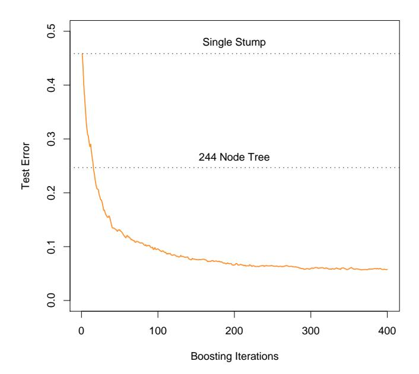

FIGURE 10.2. Simulated data (10.2): test error rate for boosting with stumps, as a function of the number of iterations. Also shown are the test error rate for a single stump, and a 244-node classification tree.

random guessing. However, as boosting iterations proceed the error rate steadily decreases, reaching 5.8% after 400 iterations. Thus, boosting this simple very weak classifier reduces its prediction error rate by almost a factor of four. It also outperforms a single large classification tree (error rate 24.7%). Since its introduction, much has been written to explain the success of AdaBoost in producing accurate classifiers. Most of this work has centered on using classification trees as the "base learner" G(x), where improvements are often most dramatic. In fact, Breiman (NIPS Workshop, 1996) referred to AdaBoost with trees as the "best off-the-shelf classifier in the world" (see also Breiman (1998)). This is especially the case for datamining applications, as discussed more fully in Section 10.7 later in this chapter.

# 10.1.1 Outline of This Chapter

Here is an outline of the developments in this chapter:

• We show that AdaBoost fits an additive model in a base learner, optimizing a novel exponential loss function. This loss function is very similar to the (negative) binomial log-likelihood (Sections 10.2-10.4).

- The population minimizer of the exponential loss function is shown to be the log-odds of the class probabilities (Section 10.5).
- We describe loss functions for regression and classification that are more robust than squared error or exponential loss (Section 10.6).
- It is argued that decision trees are an ideal base learner for data mining applications of boosting (Sections 10.7 and 10.9).
- We develop a class of gradient boosted models (GBMs), for boosting trees with any loss function (Section 10.10).
- The importance of "slow learning" is emphasized, and implemented by shrinkage of each new term that enters the model (Section 10.12), as well as randomization (Section 10.12.2).
- Tools for interpretation of the fitted model are described (Section 10.13).

# 10.2 Boosting Fits an Additive Model

The success of boosting is really not very mysterious. The key lies in expression (10.1). Boosting is a way of fitting an additive expansion in a set of elementary "basis" functions. Here the basis functions are the individual classifiers  $G_m(x) \in \{-1,1\}$ . More generally, basis function expansions take the form

$$f(x) = \sum_{m=1}^{M} \beta_m b(x; \gamma_m), \qquad (10.3)$$

where  $\beta_m, m = 1, 2, ..., M$  are the expansion coefficients, and  $b(x; \gamma) \in \mathbb{R}$  are usually simple functions of the multivariate argument x, characterized by a set of parameters  $\gamma$ . We discuss basis expansions in some detail in Chapter 5.

Additive expansions like this are at the heart of many of the learning techniques covered in this book:

- In single-hidden-layer neural networks (Chapter 11),  $b(x; \gamma) = \sigma(\gamma_0 + \gamma_1^T x)$ , where  $\sigma(t) = 1/(1+e^{-t})$  is the sigmoid function, and  $\gamma$  parameterizes a linear combination of the input variables.
- In signal processing, wavelets (Section 5.9.1) are a popular choice with  $\gamma$  parameterizing the location and scale shifts of a "mother" wavelet.
- Multivariate adaptive regression splines (Section 9.4) uses truncated-power spline basis functions where  $\gamma$  parameterizes the variables and values for the knots.

#### Algorithm 10.2 Forward Stagewise Additive Modeling.

- 1. Initialize f0(x) = 0.
- 2. For m = 1 to M:
  - (a) Compute

$$(\beta_m, \gamma_m) = \arg\min_{\beta, \gamma} \sum_{i=1}^N L(y_i, f_{m-1}(x_i) + \beta b(x_i; \gamma)).$$

- (b) Set fm(x) = fm−1(x) + $\beta$mb(x; γm).
- For trees, γ parameterizes the split variables and split points at the internal nodes, and the predictions at the terminal nodes.

Typically these models are fit by minimizing a loss function averaged over the training data, such as the squared-error or a likelihood-based loss function,

$$\min_{\{\beta_m, \gamma_m\}_1^M} \sum_{i=1}^N L\left(y_i, \sum_{m=1}^M \beta_m b(x_i; \gamma_m)\right).$$
 (10.4)

For many loss functions L(y, f(x)) and/or basis functions b(x; γ), this requires computationally intensive numerical optimization techniques. However, a simple alternative often can be found when it is feasible to rapidly solve the subproblem of fitting just a single basis function,

$$\min_{\beta,\gamma} \sum_{i=1}^{N} L(y_i, \beta b(x_i; \gamma)). \tag{10.5}$$

# 10.3 Forward Stagewise Additive Modeling

Forward stagewise modeling approximates the solution to (10.4) by sequentially adding new basis functions to the expansion without adjusting the parameters and coefficients of those that have already been added. This is outlined in Algorithm 10.2. At each iteration m, one solves for the optimal basis function b(x; γm) and corresponding coefficient $\beta$$^{m}$ to add to the current expansion fm−1(x). This produces fm(x), and the process is repeated. Previously added terms are not modified.

For squared-error loss

$$L(y, f(x)) = (y - f(x))^{2},$$
 (10.6)

one has

$$L(y_i, f_{m-1}(x_i) + \beta b(x_i; \gamma)) = (y_i - f_{m-1}(x_i) - \beta b(x_i; \gamma))^2$$
  
=  $(r_{im} - \beta b(x_i; \gamma))^2$ , (10.7)

where  $r_{im} = y_i - f_{m-1}(x_i)$  is simply the residual of the current model on the *i*th observation. Thus, for squared-error loss, the term  $\beta_m b(x; \gamma_m)$  that best fits the current residuals is added to the expansion at each step. This idea is the basis for "least squares" regression boosting discussed in Section 10.10.2. However, as we show near the end of the next section, squared-error loss is generally not a good choice for classification; hence the need to consider other loss criteria.

# 10.4 Exponential Loss and AdaBoost

We now show that AdaBoost.M1 (Algorithm 10.1) is equivalent to forward stagewise additive modeling (Algorithm 10.2) using the loss function

$$L(y, f(x)) = \exp(-y f(x)).$$
 (10.8)

The appropriateness of this criterion is addressed in the next section.

For AdaBoost the basis functions are the individual classifiers  $G_m(x) \in \{-1,1\}$ . Using the exponential loss function, one must solve

$$(\beta_m, G_m) = \arg\min_{\beta, G} \sum_{i=1}^{N} \exp[-y_i(f_{m-1}(x_i) + \beta G(x_i))]$$

for the classifier  $G_m$  and corresponding coefficient  $\beta_m$  to be added at each step. This can be expressed as

$$(\beta_m, G_m) = \arg\min_{\beta, G} \sum_{i=1}^N w_i^{(m)} \exp(-\beta y_i G(x_i))$$
 (10.9)

with  $w_i^{(m)} = \exp(-y_i f_{m-1}(x_i))$ . Since each  $w_i^{(m)}$  depends neither on  $\beta$  nor G(x), it can be regarded as a weight that is applied to each observation. This weight depends on  $f_{m-1}(x_i)$ , and so the individual weight values change with each iteration m.

The solution to (10.9) can be obtained in two steps. First, for any value of  $\beta > 0$ , the solution to (10.9) for  $G_m(x)$  is

$$G_m = \arg\min_{G} \sum_{i=1}^{N} w_i^{(m)} I(y_i \neq G(x_i)),$$
 (10.10)

which is the classifier that minimizes the weighted error rate in predicting y. This can be easily seen by expressing the criterion in (10.9) as

$$e^{-\beta} \cdot \sum_{y_i = G(x_i)} w_i^{(m)} + e^{\beta} \cdot \sum_{y_i \neq G(x_i)} w_i^{(m)},$$

which in turn can be written as

$$(e^{\beta} - e^{-\beta}) \cdot \sum_{i=1}^{N} w_i^{(m)} I(y_i \neq G(x_i)) + e^{-\beta} \cdot \sum_{i=1}^{N} w_i^{(m)}.$$
 (10.11)

Plugging this G$^{m}$ into (10.9) and solving for $\beta$ one obtains

$$\beta_m = \frac{1}{2} \log \frac{1 - \operatorname{err}_m}{\operatorname{err}_m},\tag{10.12}$$

where err$^{m}$ is the minimized weighted error rate

$$\operatorname{err}_{m} = \frac{\sum_{i=1}^{N} w_{i}^{(m)} I(y_{i} \neq G_{m}(x_{i}))}{\sum_{i=1}^{N} w_{i}^{(m)}}.$$
 (10.13)

The approximation is then updated

$$f_m(x) = f_{m-1}(x) + \beta_m G_m(x),$$

which causes the weights for the next iteration to be

$$w_i^{(m+1)} = w_i^{(m)} \cdot e^{-\beta_m y_i G_m(x_i)}.$$
 (10.14)

Using the fact that −yiGm(xi) = 2 $\cdot$ I(y$^{i}$ 6= Gm(xi)) − 1, (10.14) becomes

$$w_i^{(m+1)} = w_i^{(m)} \cdot e^{\alpha_m I(y_i \neq G_m(x_i))} \cdot e^{-\beta_m}, \qquad (10.15)$$

where $\alpha$$^{m}$ = 2$\beta$$^{m}$ is the quantity defined at line 2(c) of AdaBoost.M1 (Algorithm 10.1). The factor e $^{−}$$\beta$$^{m}$ in (10.15) multiplies all weights by the same value, so it has no effect. Thus (10.15) is equivalent to line 2(d) of Algorithm 10.1.

One can view line 2(a) of the Adaboost.M1 algorithm as a method for approximately solving the minimization in (10.11) and hence (10.10). Hence we conclude that AdaBoost.M1 minimizes the exponential loss criterion (10.8) via a forward-stagewise additive modeling approach.

Figure 10.3 shows the training-set misclassification error rate and average exponential loss for the simulated data problem (10.2) of Figure 10.2. The training-set misclassification error decreases to zero at around 250 iterations (and remains there), but the exponential loss keeps decreasing. Notice also in Figure 10.2 that the test-set misclassification error continues to improve after iteration 250. Clearly Adaboost is not optimizing trainingset misclassification error; the exponential loss is more sensitive to changes in the estimated class probabilities.

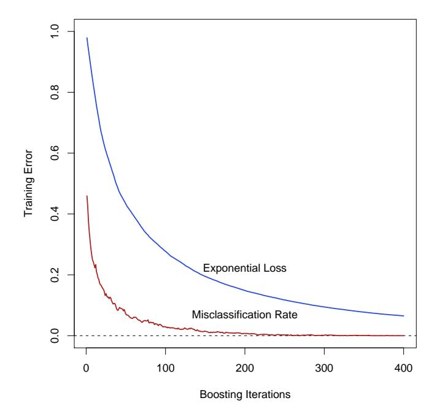

**FIGURE 10.3.** Simulated data, boosting with stumps: misclassification error rate on the training set, and average exponential loss:  $(1/N) \sum_{i=1}^{N} \exp(-y_i f(x_i))$ . After about 250 iterations, the misclassification error is zero, while the exponential loss continues to decrease.

# 10.5 Why Exponential Loss?

The AdaBoost.M1 algorithm was originally motivated from a very different perspective than presented in the previous section. Its equivalence to forward stagewise additive modeling based on exponential loss was only discovered five years after its inception. By studying the properties of the exponential loss criterion, one can gain insight into the procedure and discover ways it might be improved.

The principal attraction of exponential loss in the context of additive modeling is computational; it leads to the simple modular reweighting AdaBoost algorithm. However, it is of interest to inquire about its statistical properties. What does it estimate and how well is it being estimated? The first question is answered by seeking its population minimizer.

It is easy to show (Friedman et al., 2000) that

$$f^*(x) = \arg\min_{f(x)} \mathcal{E}_{Y|x}(e^{-Yf(x)}) = \frac{1}{2} \log \frac{\Pr(Y=1|x)}{\Pr(Y=-1|x)},$$
 (10.16)

or equivalently

$$\Pr(Y = 1|x) = \frac{1}{1 + e^{-2f^*(x)}}.$$

Thus, the additive expansion produced by AdaBoost is estimating one-half the log-odds of P(Y = 1|x). This justifies using its sign as the classification rule in (10.1).

Another loss criterion with the same population minimizer is the binomial negative log-likelihood or deviance (also known as cross-entropy), interpreting f as the logit transform. Let

$$p(x) = \Pr(Y = 1 \mid x) = \frac{e^{f(x)}}{e^{-f(x)} + e^{f(x)}} = \frac{1}{1 + e^{-2f(x)}}$$
(10.17)

and define  $Y' = (Y+1)/2 \in \{0,1\}$ . Then the binomial log-likelihood loss function is

$$l(Y, p(x)) = Y' \log p(x) + (1 - Y') \log(1 - p(x)),$$

or equivalently the deviance is

$$-l(Y, f(x)) = \log\left(1 + e^{-2Yf(x)}\right). \tag{10.18}$$

Since the population maximizer of log-likelihood is at the true probabilities  $p(x) = \Pr(Y = 1 \mid x)$ , we see from (10.17) that the population minimizers of the deviance  $\mathrm{E}_{Y|x}[-l(Y,f(x))]$  and  $\mathrm{E}_{Y|x}[e^{-Yf(x)}]$  are the same. Thus, using either criterion leads to the same solution at the population level. Note that  $e^{-Yf}$  itself is not a proper log-likelihood, since it is not the logarithm of any probability mass function for a binary random variable  $Y \in \{-1,1\}$ .

#### 10.6 Loss Functions and Robustness

In this section we examine the different loss functions for classification and regression more closely, and characterize them in terms of their robustness to extreme data.

#### Robust Loss Functions for Classification

Although both the exponential (10.8) and binomial deviance (10.18) yield the same solution when applied to the population joint distribution, the same is not true for finite data sets. Both criteria are monotone decreasing functions of the "margin" yf(x). In classification (with a -1/1 response) the margin plays a role analogous to the residuals y-f(x) in regression. The classification rule G(x) = sign[f(x)] implies that observations with positive margin  $y_i f(x_i) > 0$  are classified correctly whereas those with negative margin  $y_i f(x_i) < 0$  are misclassified. The decision boundary is defined by

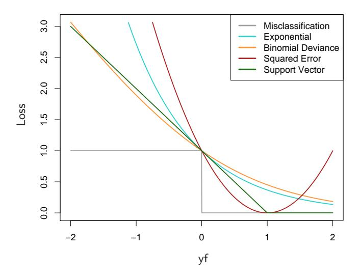

**FIGURE 10.4.** Loss functions for two-class classification. The response is  $y = \pm 1$ ; the prediction is f, with class prediction  $\operatorname{sign}(f)$ . The losses are misclassification:  $I(\operatorname{sign}(f) \neq y)$ ; exponential:  $\exp(-yf)$ ; binomial deviance:  $\log(1 + \exp(-2yf))$ ; squared error:  $(y - f)^2$ ; and support vector:  $(1 - yf)_+$  (see Section 12.3). Each function has been scaled so that it passes through the point (0,1).

f(x) = 0. The goal of the classification algorithm is to produce positive margins as frequently as possible. Any loss criterion used for classification should penalize negative margins more heavily than positive ones since positive margin observations are already correctly classified.

Figure 10.4 shows both the exponential (10.8) and binomial deviance criteria as a function of the margin yf(x). Also shown is misclassification loss L(y, f(x)) = I(yf(x) < 0), which gives unit penalty for negative margin values, and no penalty at all for positive ones. Both the exponential and deviance loss can be viewed as monotone continuous approximations to misclassification loss. They continuously penalize increasingly negative margin values more heavily than they reward increasingly positive ones. The difference between them is in degree. The penalty associated with binomial deviance increases linearly for large increasingly negative margin, whereas the exponential criterion increases the influence of such observations exponentially.

At any point in the training process the exponential criterion concentrates much more influence on observations with large negative margins. Binomial deviance concentrates relatively less influence on such observa-

tions, more evenly spreading the influence among all of the data. It is therefore far more robust in noisy settings where the Bayes error rate is not close to zero, and especially in situations where there is misspecification of the class labels in the training data. The performance of AdaBoost has been empirically observed to dramatically degrade in such situations.

Also shown in the figure is squared-error loss. The minimizer of the corresponding risk on the population is

$$f^*(x) = \arg\min_{f(x)} E_{Y|x} (Y - f(x))^2 = E(Y \mid x) = 2 \cdot \Pr(Y = 1 \mid x) - 1. (10.19)$$

As before the classification rule is G(x) = sign[f(x)]. Squared-error loss is not a good surrogate for misclassification error. As seen in Figure 10.4, it is not a monotone decreasing function of increasing margin yf(x). For margin values  $y_i f(x_i) > 1$  it increases quadratically, thereby placing increasing influence (error) on observations that are correctly classified with increasing certainty, thereby reducing the relative influence of those incorrectly classified  $y_i f(x_i) < 0$ . Thus, if class assignment is the goal, a monotone decreasing criterion serves as a better surrogate loss function. Figure 12.4 on page 426 in Chapter 12 includes a modification of quadratic loss, the "Huberized" square hinge loss (Rosset et al., 2004b), which enjoys the favorable properties of the binomial deviance, quadratic loss and the SVM hinge loss. It has the same population minimizer as the quadratic (10.19), is zero for yf(x) > 1, and becomes linear for yf(x) < -1. Since quadratic functions are easier to compute with than exponentials, our experience suggests this to be a useful alternative to the binomial deviance.

With K-class classification, the response Y takes values in the unordered set  $\mathcal{G} = \{\mathcal{G}_1, \dots, \mathcal{G}_k\}$  (see Sections 2.4 and 4.4). We now seek a classifier G(x) taking values in  $\mathcal{G}$ . It is sufficient to know the class conditional probabilities  $p_k(x) = \Pr(Y = \mathcal{G}_k | x), k = 1, 2, \dots, K$ , for then the Bayes classifier is

$$G(x) = \mathcal{G}_k$$
 where  $k = \arg \max_{\ell} p_{\ell}(x)$ . (10.20)

In principal, though, we need not learn the  $p_k(x)$ , but simply which one is largest. However, in data mining applications the interest is often more in the class probabilities  $p_{\ell}(x)$ ,  $\ell=1,\ldots,K$  themselves, rather than in performing a class assignment. As in Section 4.4, the logistic model generalizes naturally to K classes,

$$p_k(x) = \frac{e^{f_k(x)}}{\sum_{l=1}^K e^{f_l(x)}},$$
(10.21)

which ensures that  $0 \le p_k(x) \le 1$  and that they sum to one. Note that here we have K different functions, one per class. There is a redundancy in the functions  $f_k(x)$ , since adding an arbitrary h(x) to each leaves the model unchanged. Traditionally one of them is set to zero: for example,

 $f_K(x) = 0$ , as in (4.17). Here we prefer to retain the symmetry, and impose the constraint  $\sum_{k=1}^K f_k(x) = 0$ . The binomial deviance extends naturally to the K-class multinomial deviance loss function:

$$L(y, p(x)) = -\sum_{k=1}^{K} I(y = \mathcal{G}_k) \log p_k(x)$$

$$= -\sum_{k=1}^{K} I(y = \mathcal{G}_k) f_k(x) + \log \left( \sum_{\ell=1}^{K} e^{f_{\ell}(x)} \right). \quad (10.22)$$

As in the two-class case, the criterion (10.22) penalizes incorrect predictions only linearly in their degree of incorrectness.

Zhu et al. (2005) generalize the exponential loss for K-class problems. See Exercise 10.5 for details.

#### Robust Loss Functions for Regression

In the regression setting, analogous to the relationship between exponential loss and binomial log-likelihood is the relationship between squared-error loss  $L(y, f(x)) = (y - f(x))^2$  and absolute loss L(y, f(x)) = |y - f(x)|. The population solutions are f(x) = E(Y|x) for squared-error loss, and f(x) =median(Y|x) for absolute loss; for symmetric error distributions these are the same. However, on finite samples squared-error loss places much more emphasis on observations with large absolute residuals  $|y_i - f(x_i)|$  during the fitting process. It is thus far less robust, and its performance severely degrades for long-tailed error distributions and especially for grossly mismeasured y-values ("outliers"). Other more robust criteria, such as absolute loss, perform much better in these situations. In the statistical robustness literature, a variety of regression loss criteria have been proposed that provide strong resistance (if not absolute immunity) to gross outliers while being nearly as efficient as least squares for Gaussian errors. They are often better than either for error distributions with moderately heavy tails. One such criterion is the Huber loss criterion used for M-regression (Huber, 1964)

$$L(y, f(x)) = \begin{cases} [y - f(x)]^2 & \text{for } |y - f(x)| \le \delta, \\ 2\delta |y - f(x)| - \delta^2 & \text{otherwise.} \end{cases}$$
(10.23)

Figure 10.5 compares these three loss functions.

These considerations suggest that when robustness is a concern, as is especially the case in data mining applications (see Section 10.7), squared-error loss for regression and exponential loss for classification are not the best criteria from a statistical perspective. However, they both lead to the elegant modular boosting algorithms in the context of forward stagewise additive modeling. For squared-error loss one simply fits the base learner to the residuals from the current model  $y_i - f_{m-1}(x_i)$  at each step. For

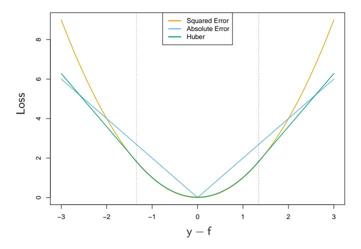

FIGURE 10.5. A comparison of three loss functions for regression, plotted as a function of the margin y−f. The Huber loss function combines the good properties of squared-error loss near zero and absolute error loss when |y − f| is large.

exponential loss one performs a weighted fit of the base learner to the output values y$^{i}$ , with weights w$^{i}$ = exp(−yifm−1(xi)). Using other more robust criteria directly in their place does not give rise to such simple feasible boosting algorithms. However, in Section 10.10.2 we show how one can derive simple elegant boosting algorithms based on any differentiable loss criterion, thereby producing highly robust boosting procedures for data mining.

# 10.7 "Off-the-Shelf" Procedures for Data Mining

Predictive learning is an important aspect of data mining. As can be seen from this book, a wide variety of methods have been developed for predictive learning from data. For each particular method there are situations for which it is particularly well suited, and others where it performs badly compared to the best that can be done with that data. We have attempted to characterize appropriate situations in our discussions of each of the respective methods. However, it is seldom known in advance which procedure will perform best or even well for any given problem. Table 10.1 summarizes some of the characteristics of a number of learning methods.

Industrial and commercial data mining applications tend to be especially challenging in terms of the requirements placed on learning procedures. Data sets are often very large in terms of number of observations and number of variables measured on each of them. Thus, computational con-

| Characteristic                                                 | Neural | SVM | Trees | MARS | k-NN,   |
|----------------------------------------------------------------|--------|-----|-------|------|---------|
|                                                                | Nets   |     |       |      | Kernels |
| Natural handling of data of "mixed" type           | ▼      | ▼   | ▲     | ▲    | ▼       |
| Handling of missing values                                     | ▼      | ▼   | ▲     | ▲    | ▲       |
| Robustness to outliers in input space              | ▼      | ▼   | ▲     | ▼    | ▲       |
| Insensitive to monotone transformations of inputs     | ▼      | ▼   | ▲     | ▼    | ▼       |
| Computational scalability (large N)                      | ▼      | ▼   | ▲     | ▲    | ▼       |
| Ability to deal with irrel evant inputs                     | ▼      | ▼   | ▲     | ▲    | ▼       |
| Ability to extract linear combinations of features | ▲      | ▲   | ▼     | ▼    | ◆       |
| Interpretability                                               | ▼      | ▼   | ◆     | ▲    | ▼       |
| Predictive power                                               | ▲      | ▲   | ▼     | ◆    | ▲       |

TABLE 10.1. Some characteristics of different learning methods. Key: ▲= good, ◆=fair, and ▼=poor.

siderations play an important role. Also, the data are usually messy: the inputs tend to be mixtures of quantitative, binary, and categorical variables, the latter often with many levels. There are generally many missing values, complete observations being rare. Distributions of numeric predictor and response variables are often long-tailed and highly skewed. This is the case for the spam data (Section 9.1.2); when fitting a generalized additive model, we first log-transformed each of the predictors in order to get a reasonable fit. In addition they usually contain a substantial fraction of gross mis-measurements (outliers). The predictor variables are generally measured on very different scales.

In data mining applications, usually only a small fraction of the large number of predictor variables that have been included in the analysis are actually relevant to prediction. Also, unlike many applications such as pattern recognition, there is seldom reliable domain knowledge to help create especially relevant features and/or filter out the irrelevant ones, the inclusion of which dramatically degrades the performance of many methods.

In addition, data mining applications generally require interpretable models. It is not enough to simply produce predictions. It is also desirable to have information providing qualitative understanding of the relationship

between joint values of the input variables and the resulting predicted response value. Thus, black box methods such as neural networks, which can be quite useful in purely predictive settings such as pattern recognition, are far less useful for data mining.

These requirements of speed, interpretability and the messy nature of the data sharply limit the usefulness of most learning procedures as offthe-shelf methods for data mining. An "off-the-shelf" method is one that can be directly applied to the data without requiring a great deal of timeconsuming data preprocessing or careful tuning of the learning procedure.

Of all the well-known learning methods, decision trees come closest to meeting the requirements for serving as an off-the-shelf procedure for data mining. They are relatively fast to construct and they produce interpretable models (if the trees are small). As discussed in Section 9.2, they naturally incorporate mixtures of numeric and categorical predictor variables and missing values. They are invariant under (strictly monotone) transformations of the individual predictors. As a result, scaling and/or more general transformations are not an issue, and they are immune to the effects of predictor outliers. They perform internal feature selection as an integral part of the procedure. They are thereby resistant, if not completely immune, to the inclusion of many irrelevant predictor variables. These properties of decision trees are largely the reason that they have emerged as the most popular learning method for data mining.

Trees have one aspect that prevents them from being the ideal tool for predictive learning, namely inaccuracy. They seldom provide predictive accuracy comparable to the best that can be achieved with the data at hand. As seen in Section 10.1, boosting decision trees improves their accuracy, often dramatically. At the same time it maintains most of their desirable properties for data mining. Some advantages of trees that are sacrificed by boosting are speed, interpretability, and, for AdaBoost, robustness against overlapping class distributions and especially mislabeling of the training data. A gradient boosted model (GBM) is a generalization of tree boosting that attempts to mitigate these problems, so as to produce an accurate and effective off-the-shelf procedure for data mining.

# 10.8 Example: Spam Data

Before we go into the details of gradient boosting, we demonstrate its abilities on a two-class classification problem. The spam data are introduced in Chapter 1, and used as an example for many of the procedures in Chapter 9 (Sections 9.1.2, 9.2.5, 9.3.1 and 9.4.1).

Applying gradient boosting to these data resulted in a test error rate of 4.5%, using the same test set as was used in Section 9.1.2. By comparison, an additive logistic regression achieved 5.5%, a CART tree fully grown and pruned by cross-validation 8.7%, and MARS 5.5%. The standard error of these estimates is around 0.6%, although gradient boosting is significantly better than all of them using the McNemar test (Exercise 10.6).

In Section 10.13 below we develop a relative importance measure for each predictor, as well as a partial dependence plot describing a predictor's contribution to the fitted model. We now illustrate these for the spam data.

Figure 10.6 displays the relative importance spectrum for all 57 predictor variables. Clearly some predictors are more important than others in separating spam from email. The frequencies of the character strings !, \$, hp, and remove are estimated to be the four most relevant predictor variables. At the other end of the spectrum, the character strings 857, 415, table, and 3d have virtually no relevance.

The quantity being modeled here is the log-odds of spam versus email

$$f(x) = \log \frac{\Pr(\text{spam}|x)}{\Pr(\text{email}|x)}$$
 (10.24)

(see Section 10.13 below). Figure 10.7 shows the partial dependence of the log-odds on selected important predictors, two positively associated with spam (! and remove), and two negatively associated (edu and hp). These particular dependencies are seen to be essentially monotonic. There is a general agreement with the corresponding functions found by the additive logistic regression model; see Figure 9.1 on page 303.

Running a gradient boosted model on these data with J = 2 terminalnode trees produces a purely additive (main effects) model for the logodds, with a corresponding error rate of 4.7%, as compared to 4.5% for the full gradient boosted model (with J = 5 terminal-node trees). Although not significant, this slightly higher error rate suggests that there may be interactions among some of the important predictor variables. This can be diagnosed through two-variable partial dependence plots. Figure 10.8 shows one of the several such plots displaying strong interaction effects.

One sees that for very low frequencies of hp, the log-odds of spam are greatly increased. For high frequencies of hp, the log-odds of spam tend to be much lower and roughly constant as a function of !. As the frequency of hp decreases, the functional relationship with ! strengthens.

# 10.9 Boosting Trees

Regression and classification trees are discussed in detail in Section 9.2. They partition the space of all joint predictor variable values into disjoint regions R$^{j}$ , j = 1, 2, . . . , J, as represented by the terminal nodes of the tree. A constant γ$^{j}$ is assigned to each such region and the predictive rule is

$$x \in R_j \Rightarrow f(x) = \gamma_j.$$

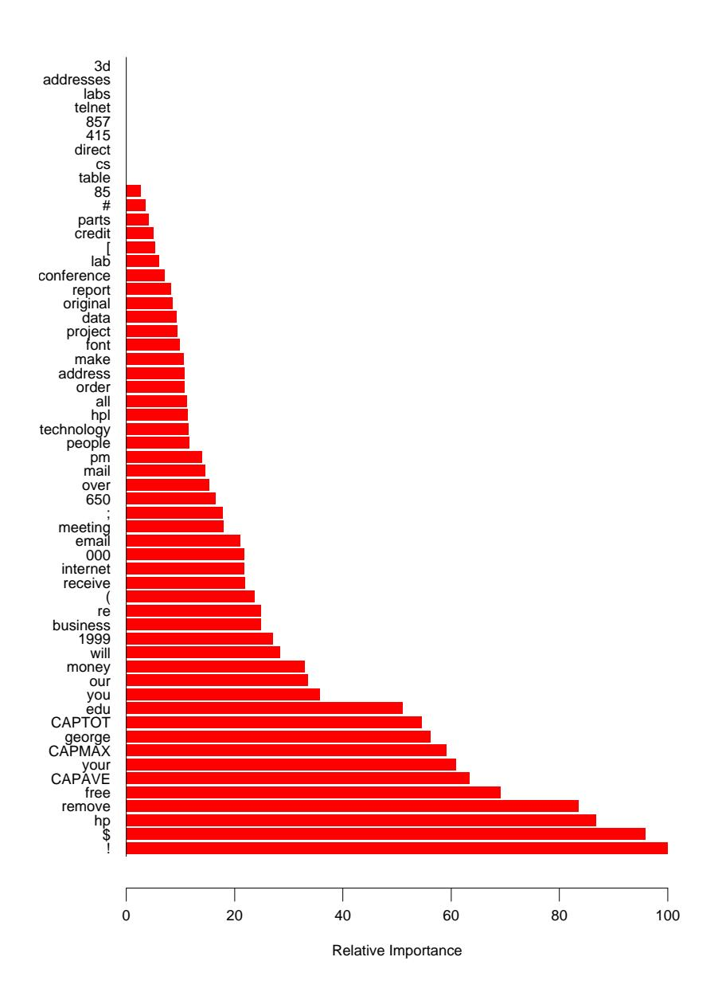

FIGURE 10.6. Predictor variable importance spectrum for the spam data. The variable names are written on the vertical axis.

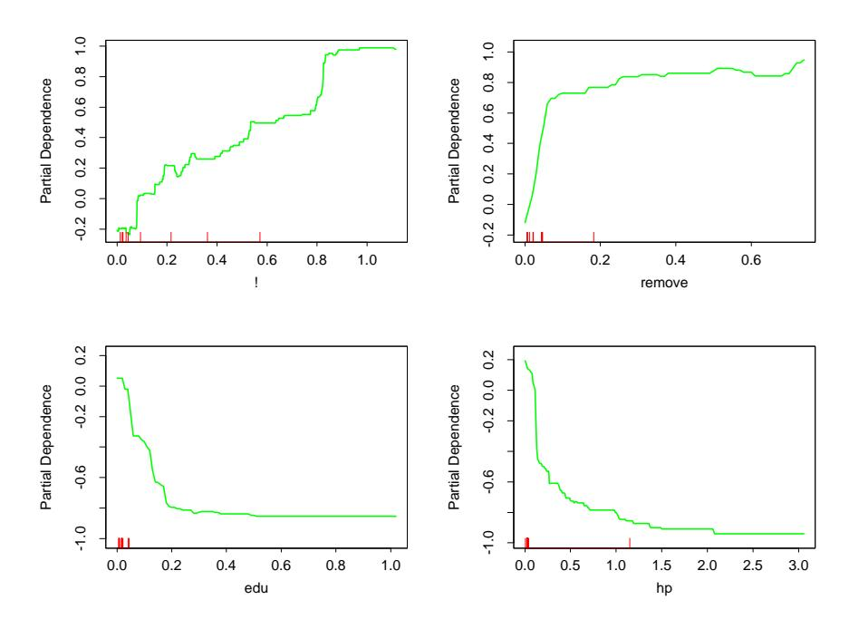

FIGURE 10.7. Partial dependence of log-odds of spam on four important predictors. The red ticks at the base of the plots are deciles of the input variable.

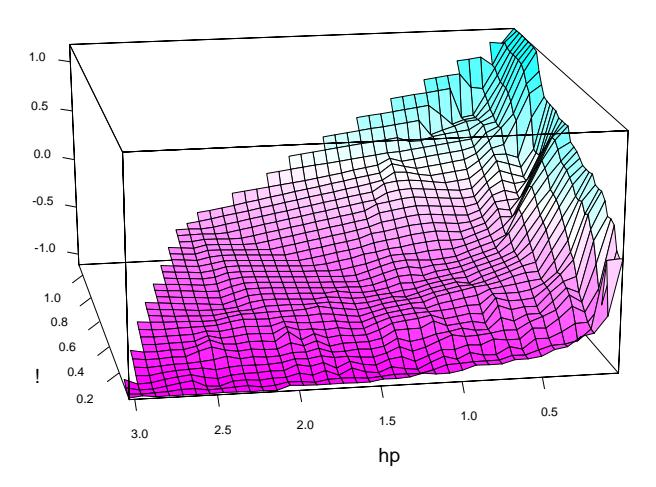

FIGURE 10.8. Partial dependence of the log-odds of spam vs. email as a function of joint frequencies of hp and the character!

Thus a tree can be formally expressed as

$$T(x;\Theta) = \sum_{j=1}^{J} \gamma_j I(x \in R_j), \qquad (10.25)$$

with parameters Θ = {R$^{j}$ , γj} J 1 . J is usually treated as a meta-parameter. The parameters are found by minimizing the empirical risk

$$\hat{\Theta} = \arg\min_{\Theta} \sum_{j=1}^{J} \sum_{x_i \in R_j} L(y_i, \gamma_j). \tag{10.26}$$

This is a formidable combinatorial optimization problem, and we usually settle for approximate suboptimal solutions. It is useful to divide the optimization problem into two parts:

Finding γ$^{j}$ given R$^{j}$ : Given the R$^{j}$ , estimating the γ$^{j}$ is typically trivial, and often ˆγ$^{j}$ = ¯y$^{j}$ , the mean of the y$^{i}$ falling in region R$^{j}$ . For misclassification loss, ˆγ$^{j}$ is the modal class of the observations falling in region R$^{j}$ .

Finding R$^{j}$ : This is the difficult part, for which approximate solutions are found. Note also that finding the R$^{j}$ entails estimating the γ$^{j}$ as well. A typical strategy is to use a greedy, top-down recursive partitioning algorithm to find the R$^{j}$ . In addition, it is sometimes necessary to approximate (10.26) by a smoother and more convenient criterion for optimizing the R$^{j}$ :

$$\tilde{\Theta} = \arg\min_{\Theta} \sum_{i=1}^{N} \tilde{L}(y_i, T(x_i, \Theta)). \tag{10.27}$$

Then given the Rˆ $^{j}$ = R˜ $^{j}$ , the γ$^{j}$ can be estimated more precisely using the original criterion.

In Section 9.2 we described such a strategy for classification trees. The Gini index replaced misclassification loss in the growing of the tree (identifying the R$^{j}$ ).

The boosted tree model is a sum of such trees,

$$f_M(x) = \sum_{m=1}^{M} T(x; \Theta_m),$$
 (10.28)

induced in a forward stagewise manner (Algorithm 10.2). At each step in the forward stagewise procedure one must solve

$$\hat{\Theta}_{m} = \arg\min_{\Theta_{m}} \sum_{i=1}^{N} L(y_{i}, f_{m-1}(x_{i}) + T(x_{i}; \Theta_{m}))$$
 (10.29)

for the region set and constants  $\Theta_m = \{R_{jm}, \gamma_{jm}\}_1^{J_m}$  of the next tree, given the current model  $f_{m-1}(x)$ .

Given the regions  $R_{jm}$ , finding the optimal constants  $\gamma_{jm}$  in each region is typically straightforward:

$$\hat{\gamma}_{jm} = \arg\min_{\gamma_{jm}} \sum_{x_i \in R_{jm}} L(y_i, f_{m-1}(x_i) + \gamma_{jm}).$$
 (10.30)

Finding the regions is difficult, and even more difficult than for a single tree. For a few special cases, the problem simplifies.

For squared-error loss, the solution to (10.29) is no harder than for a single tree. It is simply the regression tree that best predicts the current residuals  $y_i - f_{m-1}(x_i)$ , and  $\hat{\gamma}_{jm}$  is the mean of these residuals in each corresponding region.

For two-class classification and exponential loss, this stagewise approach gives rise to the AdaBoost method for boosting classification trees (Algorithm 10.1). In particular, if the trees  $T(x;\Theta_m)$  are restricted to be scaled classification trees, then we showed in Section 10.4 that the solution to (10.29) is the tree that minimizes the weighted error rate  $\sum_{i=1}^{N} w_i^{(m)} I(y_i \neq T(x_i;\Theta_m))$  with weights  $w_i^{(m)} = e^{-y_i f_{m-1}(x_i)}$ . By a scaled classification tree, we mean  $\beta_m T(x;\Theta_m)$ , with the restriction that  $\gamma_{im} \in \{-1,1\}$ ).

Without this restriction, (10.29) still simplifies for exponential loss to a weighted exponential criterion for the new tree:

$$\hat{\Theta}_m = \arg\min_{\Theta_m} \sum_{i=1}^{N} w_i^{(m)} \exp[-y_i T(x_i; \Theta_m)].$$
 (10.31)

It is straightforward to implement a greedy recursive-partitioning algorithm using this weighted exponential loss as a splitting criterion. Given the  $R_{jm}$ , one can show (Exercise 10.7) that the solution to (10.30) is the weighted log-odds in each corresponding region

$$\hat{\gamma}_{jm} = \frac{1}{2} \log \frac{\sum_{x_i \in R_{jm}} w_i^{(m)} I(y_i = 1)}{\sum_{x_i \in R_{im}} w_i^{(m)} I(y_i = -1)}.$$
(10.32)

This requires a specialized tree-growing algorithm; in practice, we prefer the approximation presented below that uses a weighted least squares regression tree.

Using loss criteria such as the absolute error or the Huber loss (10.23) in place of squared-error loss for regression, and the deviance (10.22) in place of exponential loss for classification, will serve to robustify boosting trees. Unfortunately, unlike their nonrobust counterparts, these robust criteria do not give rise to simple fast boosting algorithms.

For more general loss criteria the solution to (10.30), given the  $R_{jm}$ , is typically straightforward since it is a simple "location" estimate. For

absolute loss it is just the median of the residuals in each respective region. For the other criteria fast iterative algorithms exist for solving (10.30), and usually their faster "single-step" approximations are adequate. The problem is tree induction. Simple fast algorithms do not exist for solving (10.29) for these more general loss criteria, and approximations like (10.27) become essential.

# 10.10 Numerical Optimization via Gradient Boosting

Fast approximate algorithms for solving (10.29) with any differentiable loss criterion can be derived by analogy to numerical optimization. The loss in using f(x) to predict y on the training data is

$$L(f) = \sum_{i=1}^{N} L(y_i, f(x_i)).$$
 (10.33)

The goal is to minimize L(f) with respect to f, where here f(x) is constrained to be a sum of trees (10.28). Ignoring this constraint, minimizing (10.33) can be viewed as a numerical optimization

$$\hat{\mathbf{f}} = \arg\min_{\mathbf{f}} L(\mathbf{f}),\tag{10.34}$$

where the "parameters"  $\mathbf{f} \in \mathbb{R}^N$  are the values of the approximating function  $f(x_i)$  at each of the N data points  $x_i$ :

$$\mathbf{f} = \{f(x_1), f(x_2), \dots, f(x_N)\}^T.$$

Numerical optimization procedures solve (10.34) as a sum of component vectors

$$\mathbf{f}_{M} = \sum_{m=0}^{M} \mathbf{h}_{m}, \quad \mathbf{h}_{m} \in \mathbb{R}^{N},$$

where  $\mathbf{f}_0 = \mathbf{h}_0$  is an initial guess, and each successive  $\mathbf{f}_m$  is induced based on the current parameter vector  $\mathbf{f}_{m-1}$ , which is the sum of the previously induced updates. Numerical optimization methods differ in their prescriptions for computing each increment vector  $\mathbf{h}_m$  ("step").

#### 10.10.1 Steepest Descent

Steepest descent chooses  $\mathbf{h}_m = -\rho_m \mathbf{g}_m$  where  $\rho_m$  is a scalar and  $\mathbf{g}_m \in \mathbb{R}^N$  is the gradient of  $L(\mathbf{f})$  evaluated at  $\mathbf{f} = \mathbf{f}_{m-1}$ . The components of the gradient  $\mathbf{g}_m$  are

$$g_{im} = \left[\frac{\partial L(y_i, f(x_i))}{\partial f(x_i)}\right]_{f(x_i) = f_{m-1}(x_i)}$$

$$(10.35)$$

The step length  $\rho_m$  is the solution to

$$\rho_m = \arg\min_{\rho} L(\mathbf{f}_{m-1} - \rho \mathbf{g}_m). \tag{10.36}$$

The current solution is then updated

$$\mathbf{f}_m = \mathbf{f}_{m-1} - \rho_m \mathbf{g}_m$$

and the process repeated at the next iteration. Steepest descent can be viewed as a very greedy strategy, since  $-\mathbf{g}_m$  is the local direction in  $\mathbb{R}^N$  for which  $L(\mathbf{f})$  is most rapidly decreasing at  $\mathbf{f} = \mathbf{f}_{m-1}$ .

#### 10.10.2 Gradient Boosting

Forward stagewise boosting (Algorithm 10.2) is also a very greedy strategy. At each step the solution tree is the one that maximally reduces (10.29), given the current model  $f_{m-1}$  and its fits  $f_{m-1}(x_i)$ . Thus, the tree predictions  $T(x_i; \Theta_m)$  are analogous to the components of the negative gradient (10.35). The principal difference between them is that the tree components  $\mathbf{t}_m = \{T(x_1; \Theta_m), \dots, T(x_N; \Theta_m)\}^T$  are not independent. They are constrained to be the predictions of a  $J_m$ -terminal node decision tree, whereas the negative gradient is the unconstrained maximal descent direction.

The solution to (10.30) in the stagewise approach is analogous to the line search (10.36) in steepest descent. The difference is that (10.30) performs a separate line search for those components of  $\mathbf{t}_m$  that correspond to each separate terminal region  $\{T(x_i; \Theta_m)\}_{x_i \in R_{jm}}$ .

If minimizing loss on the training data (10.33) were the only goal, steepest descent would be the preferred strategy. The gradient (10.35) is trivial to calculate for any differentiable loss function L(y, f(x)), whereas solving (10.29) is difficult for the robust criteria discussed in Section 10.6. Unfortunately the gradient (10.35) is defined only at the training data points  $x_i$ , whereas the ultimate goal is to generalize  $f_M(x)$  to new data not represented in the training set.

A possible resolution to this dilemma is to induce a tree  $T(x; \Theta_m)$  at the mth iteration whose predictions  $\mathbf{t}_m$  are as close as possible to the negative gradient. Using squared error to measure closeness, this leads us to

$$\tilde{\Theta}_m = \arg\min_{\Theta} \sum_{i=1}^{N} \left( -g_{im} - T(x_i; \Theta) \right)^2. \tag{10.37}$$

That is, one fits the tree T to the negative gradient values (10.35) by least squares. As noted in Section 10.9 fast algorithms exist for least squares decision tree induction. Although the solution regions  $\tilde{R}_{jm}$  to (10.37) will not be identical to the regions  $R_{jm}$  that solve (10.29), it is generally similar enough to serve the same purpose. In any case, the forward stagewise

| Setting        | Loss Function              | −\partialL(yi , f(xi))/\partialf(xi)                                                                                                                                 |
|----------------|----------------------------|-----------------------------------------------------------------------------------------------------------------------------------------------------------|
| Regression     | 1 − f(xi)]2 [yi 2 | yi − f(xi)                                                                                                                                             |
| Regression     | yi − f(xi)              | sign[yi − f(xi)]                                                                                                                                       |
| Regression     | Huber                      | yi − f(xi) for  yi − f(xi)  \le \deltam \deltamsign[yi − f(xi)] for  yi − f(xi)  > \deltam where \deltam = \alphath-quantile{ yi − f(xi) } |
| Classification | Deviance                   | kth component: I(yi = Gk) − pk(xi)                                                                                                            |

TABLE 10.2. Gradients for commonly used loss functions.

boosting procedure, and top-down decision tree induction, are themselves approximation procedures. After constructing the tree (10.37), the corresponding constants in each region are given by (10.30).

Table 10.2 summarizes the gradients for commonly used loss functions. For squared error loss, the negative gradient is just the ordinary residual −gim = y$^{i}$ − fm−1(xi), so that (10.37) on its own is equivalent to standard least-squares boosting. With absolute error loss, the negative gradient is the sign of the residual, so at each iteration (10.37) fits the tree to the sign of the current residuals by least squares. For Huber M-regression, the negative gradient is a compromise between these two (see the table).

For classification the loss function is the multinomial deviance (10.22), and K least squares trees are constructed at each iteration. Each tree Tkm is fit to its respective negative gradient vector gkm,

$$-g_{ikm} = \left[\frac{\partial L(y_i, f_1(x_i), \dots, f_K(x_i))}{\partial f_k(x_i)}\right]_{\mathbf{f}(x_i) = \mathbf{f}_{m-1}(x_i)}$$
$$= I(y_i = \mathcal{G}_k) - p_k(x_i), \tag{10.38}$$

with pk(x) given by (10.21). Although K separate trees are built at each iteration, they are related through (10.21). For binary classification (K = 2), only one tree is needed (exercise 10.10).

# 10.10.3 Implementations of Gradient Boosting

Algorithm 10.3 presents the generic gradient tree-boosting algorithm for regression. Specific algorithms are obtained by inserting different loss criteria L(y, f(x)). The first line of the algorithm initializes to the optimal constant model, which is just a single terminal node tree. The components of the negative gradient computed at line 2(a) are referred to as generalized or pseudo residuals, r. Gradients for commonly used loss functions are summarized in Table 10.2.

#### Algorithm 10.3 Gradient Tree Boosting Algorithm.

- 1. Initialize f0(x) = arg min$^{γ}$ P$^{N}$ $^{i}$=1 L(y$^{i}$ , γ).
- 2. For m = 1 to M:
  - (a) For i = 1, 2, . . . , N compute

$$r_{im} = -\left[\frac{\partial L(y_i, f(x_i))}{\partial f(x_i)}\right]_{f=f_{m-1}}.$$

- (b) Fit a regression tree to the targets rim giving terminal regions Rjm, j = 1, 2, . . . , Jm.
- (c) For j = 1, 2, . . . , J$^{m}$ compute

$$\gamma_{jm} = \arg\min_{\gamma} \sum_{x_i \in R_{jm}} L(y_i, f_{m-1}(x_i) + \gamma).$$

- (d) Update fm(x) = fm−1(x) + P$^{J}$$^{m}$ $^{j}$=1 γjmI(x \in Rjm).
- 3. Output ˆf(x) = fM(x).

The algorithm for classification is similar. Lines 2(a)–(d) are repeated K times at each iteration m, once for each class using (10.38). The result at line 3 is K different (coupled) tree expansions fkM(x), k = 1, 2, . . . , K. These produce probabilities via (10.21) or do classification as in (10.20). Details are given in Exercise 10.9. Two basic tuning parameters are the number of iterations M and the sizes of each of the constituent trees Jm, m = 1, 2, . . . , M.

The original implementation of this algorithm was called MART for "multiple additive regression trees," and was referred to in the first edition of this book. Many of the figures in this chapter were produced by MART. Gradient boosting as described here is implemented in the R gbm package (Ridgeway, 1999, "Gradient Boosted Models"), and is freely available. The gbm package is used in Section 10.14.2, and extensively in Chapters 16 and 15. Another R implementation of boosting is mboost (Hothorn and B¨uhlmann, 2006). A commercial implementation of gradient boosting/MART called TreeNet is available from Salford Systems, Inc.

# 10.11 Right-Sized Trees for Boosting

Historically, boosting was considered to be a technique for combining models, here trees. As such, the tree building algorithm was regarded as a primitive that produced models to be combined by the boosting procedure. In this scenario, the optimal size of each tree is estimated separately in the usual manner when it is built (Section 9.2). A very large (oversized) tree is first induced, and then a bottom-up procedure is employed to prune it to the estimated optimal number of terminal nodes. This approach assumes implicitly that each tree is the last one in the expansion (10.28). Except perhaps for the very last tree, this is clearly a very poor assumption. The result is that trees tend to be much too large, especially during the early iterations. This substantially degrades performance and increases computation.

The simplest strategy for avoiding this problem is to restrict all trees to be the same size, J$^{m}$ = J ∀m. At each iteration a J-terminal node regression tree is induced. Thus J becomes a meta-parameter of the entire boosting procedure, to be adjusted to maximize estimated performance for the data at hand.

One can get an idea of useful values for J by considering the properties of the "target" function

$$\eta = \arg\min_{f} \mathcal{E}_{XY} L(Y, f(X)). \tag{10.39}$$

Here the expected value is over the population joint distribution of (X, Y ). The target function \eta(x) is the one with minimum prediction risk on future data. This is the function we are trying to approximate.

One relevant property of \eta(X) is the degree to which the coordinate variables X$^{T}$ = (X1, X2, . . . , Xp) interact with one another. This is captured by its ANOVA (analysis of variance) expansion

$$\eta(X) = \sum_{j} \eta_{j}(X_{j}) + \sum_{jk} \eta_{jk}(X_{j}, X_{k}) + \sum_{jkl} \eta_{jkl}(X_{j}, X_{k}, X_{l}) + \cdots (10.40)$$

The first sum in (10.40) is over functions of only a single predictor variable X$^{j}$ . The particular functions \eta$^{j}$ (X$^{j}$ ) are those that jointly best approximate \eta(X) under the loss criterion being used. Each such \eta$^{j}$ (X$^{j}$ ) is called the "main effect" of X$^{j}$ . The second sum is over those two-variable functions that when added to the main effects best fit \eta(X). These are called the second-order interactions of each respective variable pair (X$^{j}$ , Xk). The third sum represents third-order interactions, and so on. For many problems encountered in practice, low-order interaction effects tend to dominate. When this is the case, models that produce strong higher-order interaction effects, such as large decision trees, suffer in accuracy.

The interaction level of tree-based approximations is limited by the tree size J. Namely, no interaction effects of level greater than J − 1 are possible. Since boosted models are additive in the trees (10.28), this limit extends to them as well. Setting J = 2 (single split "decision stump") produces boosted models with only main effects; no interactions are permitted. With J = 3, two-variable interaction effects are also allowed, and

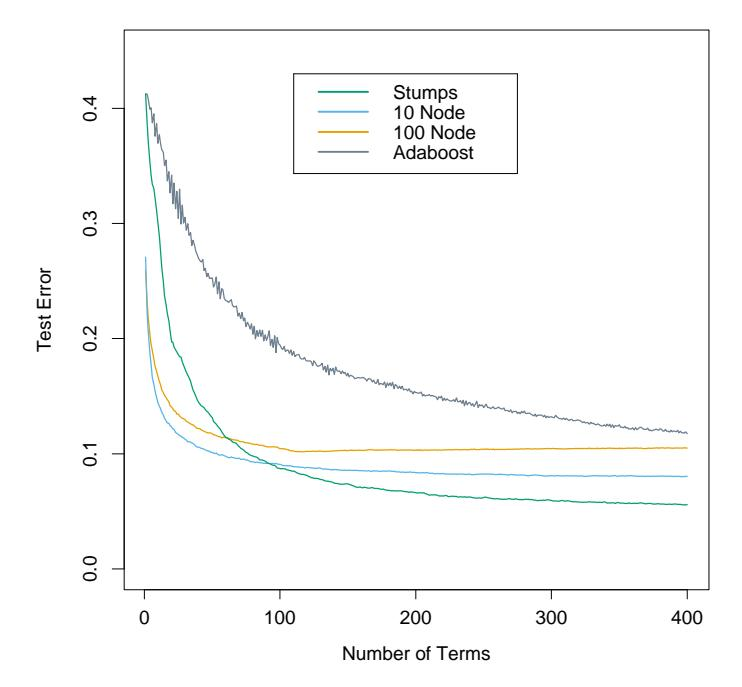

FIGURE 10.9. Boosting with different sized trees, applied to the example (10.2) used in Figure 10.2. Since the generative model is additive, stumps perform the best. The boosting algorithm used the binomial deviance loss in Algorithm 10.3; shown for comparison is the AdaBoost Algorithm 10.1.

so on. This suggests that the value chosen for J should reflect the level of dominant interactions of \eta(x). This is of course generally unknown, but in most situations it will tend to be low. Figure 10.9 illustrates the effect of interaction order (choice of J) on the simulation example (10.2). The generative function is additive (sum of quadratic monomials), so boosting models with J > 2 incurs unnecessary variance and hence the higher test error. Figure 10.10 compares the coordinate functions found by boosted stumps with the true functions.

Although in many applications J = 2 will be insufficient, it is unlikely that J > 10 will be required. Experience so far indicates that 4 \le J \le 8 works well in the context of boosting, with results being fairly insensitive to particular choices in this range. One can fine-tune the value for J by trying several different values and choosing the one that produces the lowest risk on a validation sample. However, this seldom provides significant improvement over using J ≃ 6.

# f1(x1) f2(x2) f3(x3) f4(x4) f5(x5) f6(x6) f7(x7) f8(x8) f9(x9) f10(x10)

#### Coordinate Functions for Additive Logistic Trees

FIGURE 10.10. Coordinate functions estimated by boosting stumps for the simulated example used in Figure 10.9. The true quadratic functions are shown for comparison.

# 10.12 Regularization

Besides the size of the constituent trees, J, the other meta-parameter of gradient boosting is the number of boosting iterations M. Each iteration usually reduces the training risk L(fM), so that for M large enough this risk can be made arbitrarily small. However, fitting the training data too well can lead to overfitting, which degrades the risk on future predictions. Thus, there is an optimal number M$^{∗}$ minimizing future risk that is application dependent. A convenient way to estimate M$^{∗}$ is to monitor prediction risk as a function of M on a validation sample. The value of M that minimizes this risk is taken to be an estimate of M$^{∗}$ . This is analogous to the early stopping strategy often used with neural networks (Section 11.4).

# 10.12.1 Shrinkage

Controlling the value of M is not the only possible regularization strategy. As with ridge regression and neural networks, shrinkage techniques can be employed as well (see Sections 3.4.1 and 11.5). The simplest implementation of shrinkage in the context of boosting is to scale the contribution of each tree by a factor 0 < ν < 1 when it is added to the current approximation. That is, line 2(d) of Algorithm 10.3 is replaced by

$$f_m(x) = f_{m-1}(x) + \nu \cdot \sum_{j=1}^{J} \gamma_{jm} I(x \in R_{jm}).$$
 (10.41)

The parameter ν can be regarded as controlling the learning rate of the boosting procedure. Smaller values of ν (more shrinkage) result in larger training risk for the same number of iterations M. Thus, both ν and M control prediction risk on the training data. However, these parameters do not operate independently. Smaller values of  $\nu$  lead to larger values of M for the same training risk, so that there is a tradeoff between them.

Empirically it has been found (Friedman, 2001) that smaller values of  $\nu$  favor better test error, and require correspondingly larger values of M. In fact, the best strategy appears to be to set  $\nu$  to be very small ( $\nu < 0.1$ ) and then choose M by early stopping. This yields dramatic improvements (over no shrinkage  $\nu = 1$ ) for regression and for probability estimation. The corresponding improvements in misclassification risk via (10.20) are less, but still substantial. The price paid for these improvements is computational: smaller values of  $\nu$  give rise to larger values of M, and computation is proportional to the latter. However, as seen below, many iterations are generally computationally feasible even on very large data sets. This is partly due to the fact that small trees are induced at each step with no pruning.

Figure 10.11 shows test error curves for the simulated example (10.2) of Figure 10.2. A gradient boosted model (MART) was trained using binomial deviance, using either stumps or six terminal-node trees, and with or without shrinkage. The benefits of shrinkage are evident, especially when the binomial deviance is tracked. With shrinkage, each test error curve reaches a lower value, and stays there for many iterations.

Section 16.2.1 draws a connection between forward stagewise shrinkage in boosting and the use of an  $L_1$  penalty for regularizing model parameters (the "lasso"). We argue that  $L_1$  penalties may be superior to the  $L_2$  penalties used by methods such as the support vector machine.

#### 10.12.2 Subsampling

We saw in Section 8.7 that bootstrap averaging (bagging) improves the performance of a noisy classifier through averaging. Chapter 15 discusses in some detail the variance-reduction mechanism of this sampling followed by averaging. We can exploit the same device in gradient boosting, both to improve performance and computational efficiency.

With stochastic gradient boosting (Friedman, 1999), at each iteration we sample a fraction  $\eta$  of the training observations (without replacement), and grow the next tree using that subsample. The rest of the algorithm is identical. A typical value for  $\eta$  can be  $\frac{1}{2}$ , although for large N,  $\eta$  can be substantially smaller than  $\frac{1}{2}$ .

Not only does the sampling reduce the computing time by the same fraction  $\eta$ , but in many cases it actually produces a more accurate model.

Figure 10.12 illustrates the effect of subsampling using the simulated example (10.2), both as a classification and as a regression example. We see in both cases that sampling along with shrinkage slightly outperformed the rest. It appears here that subsampling without shrinkage does poorly.

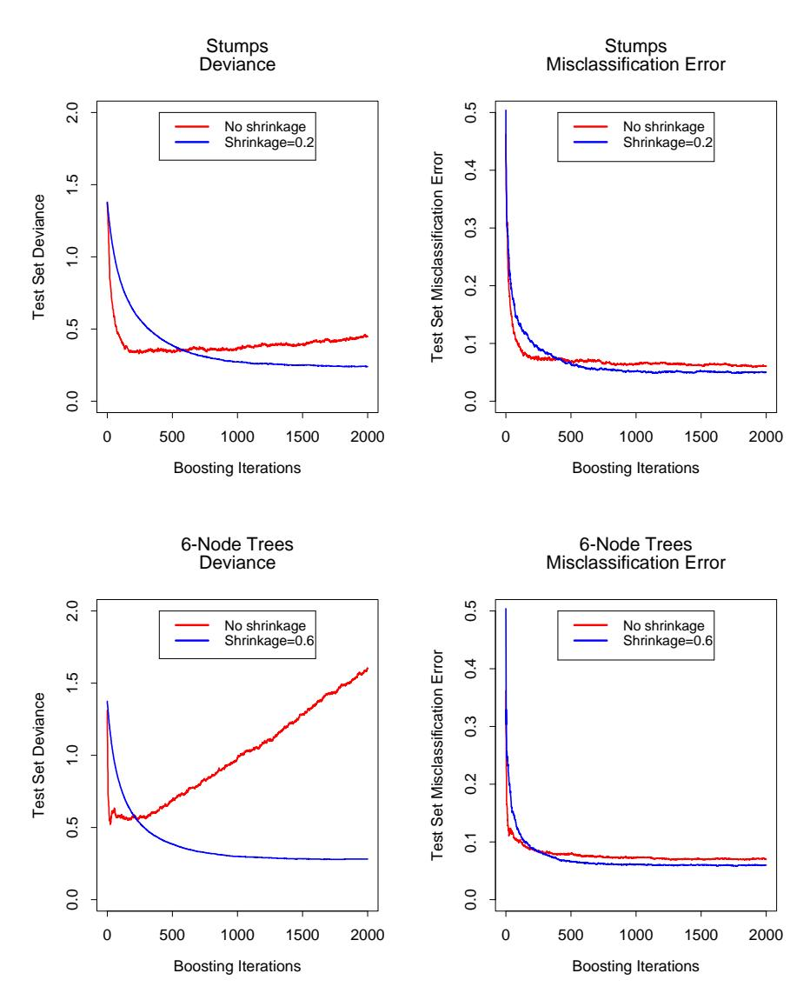

FIGURE 10.11. Test error curves for simulated example (10.2) of Figure 10.9, using gradient boosting (MART). The models were trained using binomial deviance, either stumps or six terminal-node trees, and with or without shrinkage. The left panels report test deviance, while the right panels show misclassification error. The beneficial effect of shrinkage can be seen in all cases, especially for deviance in the left panels.

#### 4−Node Trees

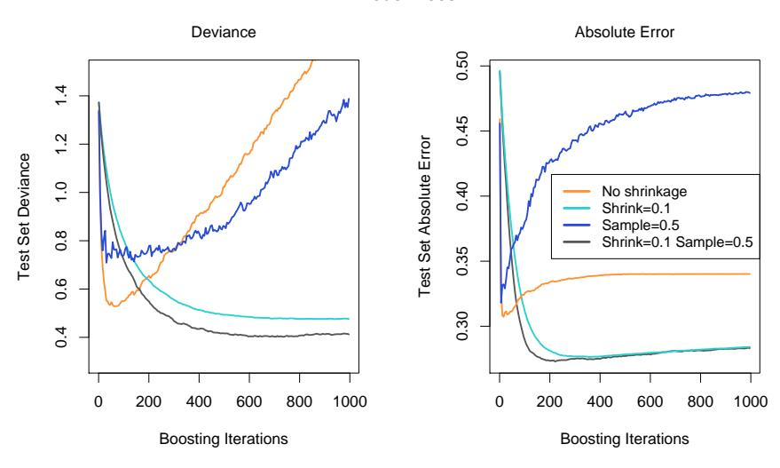

FIGURE 10.12. Test-error curves for the simulated example (10.2), showing the effect of stochasticity. For the curves labeled "Sample= 0.5", a different 50% subsample of the training data was used each time a tree was grown. In the left panel the models were fit by gbm using a binomial deviance loss function; in the right-hand panel using square-error loss.

The downside is that we now have four parameters to set: J, M, ν and \eta. Typically some early explorations determine suitable values for J, ν and \eta, leaving M as the primary parameter.

# 10.13 Interpretation

Single decision trees are highly interpretable. The entire model can be completely represented by a simple two-dimensional graphic (binary tree) that is easily visualized. Linear combinations of trees (10.28) lose this important feature, and must therefore be interpreted in a different way.

# 10.13.1 Relative Importance of Predictor Variables

In data mining applications the input predictor variables are seldom equally relevant. Often only a few of them have substantial influence on the response; the vast majority are irrelevant and could just as well have not been included. It is often useful to learn the relative importance or contribution of each input variable in predicting the response.

For a single decision tree T, Breiman et al. (1984) proposed

$$\mathcal{I}_{\ell}^{2}(T) = \sum_{t=1}^{J-1} \hat{i}_{t}^{2} I(v(t) = \ell)$$
 (10.42)

as a measure of relevance for each predictor variable  $X_{\ell}$ . The sum is over the J-1 internal nodes of the tree. At each such node t, one of the input variables  $X_{v(t)}$  is used to partition the region associated with that node into two subregions; within each a separate constant is fit to the response values. The particular variable chosen is the one that gives maximal estimated improvement  $\hat{\imath}_t^2$  in squared error risk over that for a constant fit over the entire region. The squared relative importance of variable  $X_{\ell}$  is the sum of such squared improvements over all internal nodes for which it was chosen as the splitting variable.

This importance measure is easily generalized to additive tree expansions (10.28); it is simply averaged over the trees

$$\mathcal{I}_{\ell}^{2} = \frac{1}{M} \sum_{m=1}^{M} \mathcal{I}_{\ell}^{2}(T_{m}). \tag{10.43}$$

Due to the stabilizing effect of averaging, this measure turns out to be more reliable than is its counterpart (10.42) for a single tree. Also, because of shrinkage (Section 10.12.1) the masking of important variables by others with which they are highly correlated is much less of a problem. Note that (10.42) and (10.43) refer to squared relevance; the actual relevances are their respective square roots. Since these measures are relative, it is customary to assign the largest a value of 100 and then scale the others accordingly. Figure 10.6 shows the relevant importance of the 57 inputs in predicting spam versus email.

For K-class classification, K separate models  $f_k(x), k = 1, 2, ..., K$  are induced, each consisting of a sum of trees

$$f_k(x) = \sum_{m=1}^{M} T_{km}(x). \tag{10.44}$$

In this case (10.43) generalizes to

$$\mathcal{I}_{\ell k}^2 = \frac{1}{M} \sum_{m=1}^{M} \mathcal{I}_{\ell}^2(T_{km}). \tag{10.45}$$

Here  $\mathcal{I}_{\ell k}$  is the relevance of  $X_{\ell}$  in separating the class k observations from the other classes. The overall relevance of  $X_{\ell}$  is obtained by averaging over all of the classes

$$\mathcal{I}_{\ell}^{2} = \frac{1}{K} \sum_{k=1}^{K} \mathcal{I}_{\ell k}^{2}.$$
 (10.46)

Figures 10.23 and 10.24 illustrate the use of these averaged and separate relative importances.

#### 10.13.2 Partial Dependence Plots

After the most relevant variables have been identified, the next step is to attempt to understand the nature of the dependence of the approximation f(X) on their joint values. Graphical renderings of the f(X) as a function of its arguments provides a comprehensive summary of its dependence on the joint values of the input variables.

Unfortunately, such visualization is limited to low-dimensional views. We can easily display functions of one or two arguments, either continuous or discrete (or mixed), in a variety of different ways; this book is filled with such displays. Functions of slightly higher dimensions can be plotted by conditioning on particular sets of values of all but one or two of the arguments, producing a *trellis* of plots (Becker et al., 1996).$^{1}$

For more than two or three variables, viewing functions of the corresponding higher-dimensional arguments is more difficult. A useful alternative can sometimes be to view a collection of plots, each one of which shows the partial dependence of the approximation f(X) on a selected small subset of the input variables. Although such a collection can seldom provide a comprehensive depiction of the approximation, it can often produce helpful clues, especially when f(x) is dominated by low-order interactions (10.40).

Consider the subvector  $X_{\mathcal{S}}$  of  $\ell < p$  of the input predictor variables  $X^T = (X_1, X_2, \dots, X_p)$ , indexed by  $\mathcal{S} \subset \{1, 2, \dots, p\}$ . Let  $\mathcal{C}$  be the complement set, with  $\mathcal{S} \cup \mathcal{C} = \{1, 2, \dots, p\}$ . A general function f(X) will in principle depend on all of the input variables:  $f(X) = f(X_{\mathcal{S}}, X_{\mathcal{C}})$ . One way to define the average or partial dependence of f(X) on  $X_{\mathcal{S}}$  is

$$f_{\mathcal{S}}(X_{\mathcal{S}}) = \mathcal{E}_{X_{\mathcal{C}}} f(X_{\mathcal{S}}, X_{\mathcal{C}}). \tag{10.47}$$

This is a marginal average of f, and can serve as a useful description of the effect of the chosen subset on f(X) when, for example, the variables in  $X_{\mathcal{S}}$  do not have strong interactions with those in  $X_{\mathcal{C}}$ .

Partial dependence functions can be used to interpret the results of any "black box" learning method. They can be estimated by

$$\bar{f}_{\mathcal{S}}(X_{\mathcal{S}}) = \frac{1}{N} \sum_{i=1}^{N} f(X_{\mathcal{S}}, x_{i\mathcal{C}}),$$
 (10.48)

where  $\{x_{1C}, x_{2C}, \dots, x_{NC}\}$  are the values of  $X_C$  occurring in the training data. This requires a pass over the data for each set of joint values of  $X_S$  for which  $\bar{f}_S(X_S)$  is to be evaluated. This can be computationally intensive,

$ ^{1} $lattice in R.

even for moderately sized data sets. Fortunately with decision trees, ¯f$^{S}$ (X$^{S}$ ) (10.48) can be rapidly computed from the tree itself without reference to the data (Exercise 10.11).

It is important to note that partial dependence functions defined in (10.47) represent the effect of X$^{S}$ on f(X) after accounting for the (average) effects of the other variables X$^{C}$ on f(X). They are not the effect of X$^{S}$ on f(X) ignoring the effects of XC. The latter is given by the conditional expectation

$$\tilde{f}_{\mathcal{S}}(X_{\mathcal{S}}) = \mathbb{E}(f(X_{\mathcal{S}}, X_{\mathcal{C}})|X_{\mathcal{S}}),$$
(10.49)

and is the best least squares approximation to f(X) by a function of X$^{S}$ alone. The quantities ˜f$^{S}$ (X$^{S}$ ) and ¯f$^{S}$ (X$^{S}$ ) will be the same only in the unlikely event that X$^{S}$ and X$^{C}$ are independent. For example, if the effect of the chosen variable subset happens to be purely additive,

$$f(X) = h_1(X_S) + h_2(X_C).$$
 (10.50)

Then (10.47) produces the h1(X$^{S}$ ) up to an additive constant. If the effect is purely multiplicative,

$$f(X) = h_1(X_S) \cdot h_2(X_C),$$
 (10.51)

then (10.47) produces h1(X$^{S}$ ) up to a multiplicative constant factor. On the other hand, (10.49) will not produce h1(X$^{S}$ ) in either case. In fact, (10.49) can produce strong effects on variable subsets for which f(X) has no dependence at all.

Viewing plots of the partial dependence of the boosted-tree approximation (10.28) on selected variables subsets can help to provide a qualitative description of its properties. Illustrations are shown in Sections 10.8 and 10.14. Owing to the limitations of computer graphics, and human perception, the size of the subsets X$^{S}$ must be small (l \approx 1, 2, 3). There are of course a large number of such subsets, but only those chosen from among the usually much smaller set of highly relevant predictors are likely to be informative. Also, those subsets whose effect on f(X) is approximately additive (10.50) or multiplicative (10.51) will be most revealing.

For K-class classification, there are K separate models (10.44), one for each class. Each one is related to the respective probabilities (10.21) through

$$f_k(X) = \log p_k(X) - \frac{1}{K} \sum_{l=1}^K \log p_l(X).$$
 (10.52)

Thus each fk(X) is a monotone increasing function of its respective probability on a logarithmic scale. Partial dependence plots of each respective fk(X) (10.44) on its most relevant predictors (10.45) can help reveal how the log-odds of realizing that class depend on the respective input variables.

# 10.14 Illustrations

In this section we illustrate gradient boosting on a number of larger datasets, using different loss functions as appropriate.

#### 10.14.1 California Housing

This data set (Pace and Barry, 1997) is available from the Carnegie-Mellon StatLib repository$^{2}$ . It consists of aggregated data from each of 20,460 neighborhoods (1990 census block groups) in California. The response variable Y is the median house value in each neighborhood measured in units of \$100,000. The predictor variables are demographics such as median income MedInc, housing density as reflected by the number of houses House, and the average occupancy in each house AveOccup. Also included as predictors are the location of each neighborhood (longitude and latitude), and several quantities reflecting the properties of the houses in the neighborhood: average number of rooms AveRooms and bedrooms AveBedrms. There are thus a total of eight predictors, all numeric.

We fit a gradient boosting model using the MART procedure, with J = 6 terminal nodes, a learning rate (10.41) of ν = 0.1, and the Huber loss criterion for predicting the numeric response. We randomly divided the dataset into a training set (80%) and a test set (20%).

Figure 10.13 shows the average absolute error

$$AAE = E |y - \hat{f}_M(x)| \qquad (10.53)$$

as a function for number of iterations M on both the training data and test data. The test error is seen to decrease monotonically with increasing M, more rapidly during the early stages and then leveling off to being nearly constant as iterations increase. Thus, the choice of a particular value of M is not critical, as long as it is not too small. This tends to be the case in many applications. The shrinkage strategy (10.41) tends to eliminate the problem of overfitting, especially for larger data sets.

The value of AAE after 800 iterations is 0.31. This can be compared to that of the optimal constant predictor median{yi} which is 0.89. In terms of more familiar quantities, the squared multiple correlation coefficient of this model is R$^{2}$ = 0.84. Pace and Barry (1997) use a sophisticated spatial autoregression procedure, where prediction for each neighborhood is based on median house values in nearby neighborhoods, using the other predictors as covariates. Experimenting with transformations they achieved R$^{2}$ = 0.85, predicting log Y . Using log Y as the response the corresponding value for gradient boosting was R$^{2}$ = 0.86.

$^{2}$http://lib.stat.cmu.edu.

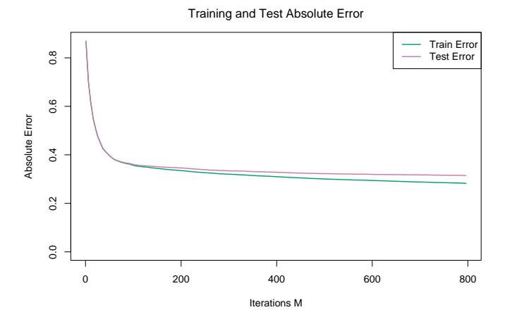

FIGURE 10.13. Average-absolute error as a function of number of iterations for the California housing data.

Figure 10.14 displays the relative variable importances for each of the eight predictor variables. Not surprisingly, median income in the neighborhood is the most relevant predictor. Longitude, latitude, and average occupancy all have roughly half the relevance of income, whereas the others are somewhat less influential.

Figure 10.15 shows single-variable partial dependence plots on the most relevant nonlocation predictors. Note that the plots are not strictly smooth. This is a consequence of using tree-based models. Decision trees produce discontinuous piecewise constant models (10.25). This carries over to sums of trees (10.28), with of course many more pieces. Unlike most of the methods discussed in this book, there is no smoothness constraint imposed on the result. Arbitrarily sharp discontinuities can be modeled. The fact that these curves generally exhibit a smooth trend is because that is what is estimated to best predict the response for this problem. This is often the case.

The hash marks at the base of each plot delineate the deciles of the data distribution of the corresponding variables. Note that here the data density is lower near the edges, especially for larger values. This causes the curves to be somewhat less well determined in those regions. The vertical scales of the plots are the same, and give a visual comparison of the relative importance of the different variables.

The partial dependence of median house value on median income is monotonic increasing, being nearly linear over the main body of data. House value is generally monotonic decreasing with increasing average occupancy, except perhaps for average occupancy rates less than one. Median house

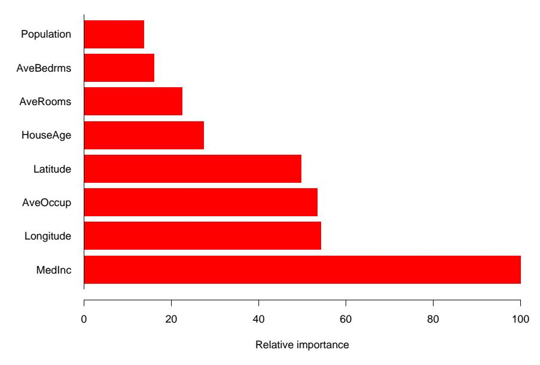

FIGURE 10.14. Relative importance of the predictors for the California housing data.

value has a nonmonotonic partial dependence on average number of rooms. It has a minimum at approximately three rooms and is increasing both for smaller and larger values.

Median house value is seen to have a very weak partial dependence on house age that is inconsistent with its importance ranking (Figure 10.14). This suggests that this weak main effect may be masking stronger interaction effects with other variables. Figure 10.16 shows the two-variable partial dependence of housing value on joint values of median age and average occupancy. An interaction between these two variables is apparent. For values of average occupancy greater than two, house value is nearly independent of median age, whereas for values less than two there is a strong dependence on age.

Figure 10.17 shows the two-variable partial dependence of the fitted model on joint values of longitude and latitude, displayed as a shaded contour plot. There is clearly a very strong dependence of median house value on the neighborhood location in California. Note that Figure 10.17 is not a plot of house value versus location ignoring the effects of the other predictors (10.49). Like all partial dependence plots, it represents the effect of location after accounting for the effects of the other neighborhood and house attributes (10.47). It can be viewed as representing an extra premium one pays for location. This premium is seen to be relatively large near the Pacific coast especially in the Bay Area and Los Angeles–San Diego re-

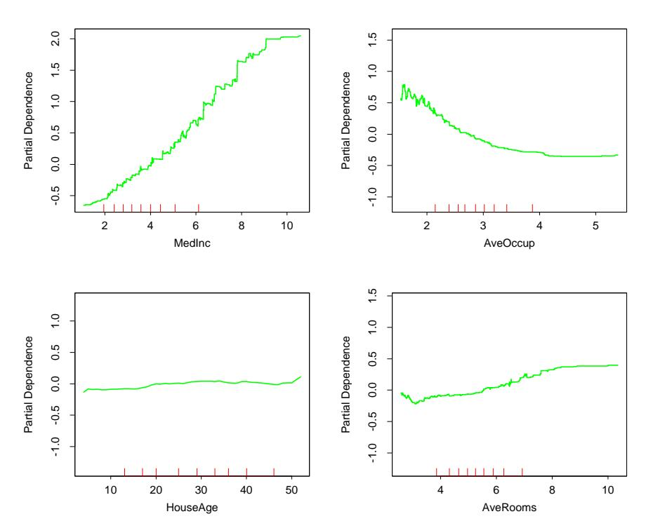

FIGURE 10.15. Partial dependence of housing value on the nonlocation variables for the California housing data. The red ticks at the base of the plot are deciles of the input variables.

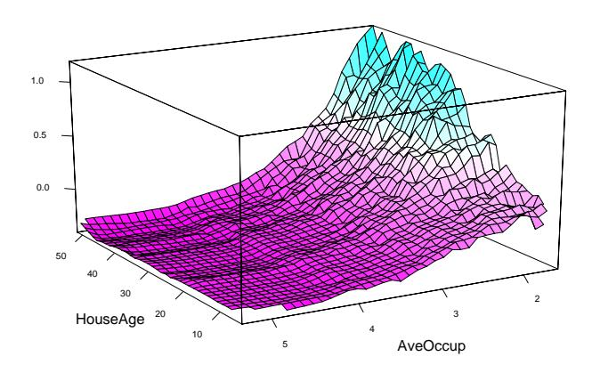

FIGURE 10.16. Partial dependence of house value on median age and average occupancy. There appears to be a strong interaction effect between these two variables.

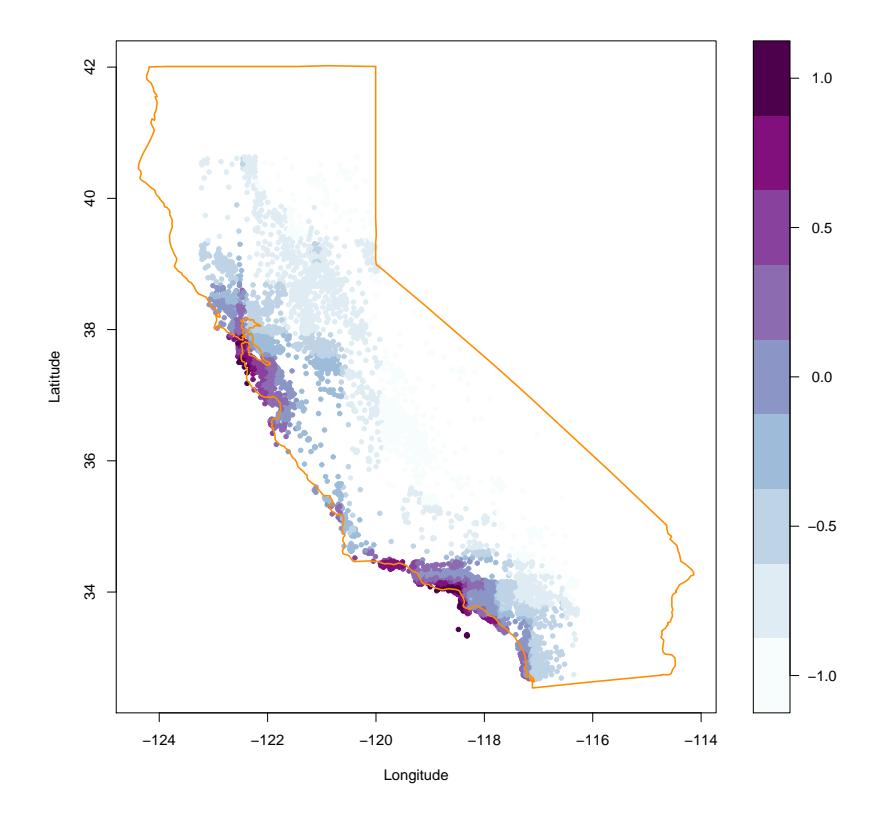

FIGURE 10.17. Partial dependence of median house value on location in California. One unit is \$100, 000, at 1990 prices, and the values plotted are relative to the overall median of \$180, 000.

gions. In the northern, central valley, and southeastern desert regions of California, location costs considerably less.

# 10.14.2 New Zealand Fish

Plant and animal ecologists use regression models to predict species presence, abundance and richness as a function of environmental variables. Although for many years simple linear and parametric models were popular, recent literature shows increasing interest in more sophisticated models such as generalized additive models (Section 9.1, GAM), multivariate adaptive regression splines (Section 9.4, MARS) and boosted regression trees (Leathwick et al., 2005; Leathwick et al., 2006). Here we model the presence and abundance of the Black Oreo Dory, a marine fish found in the oceanic waters around New Zealand.$^{3}$

Figure 10.18 shows the locations of 17,000 trawls (deep-water net fishing, with a maximum depth of 2km), and the red points indicate those 2353 trawls for which the Black Oreo was present, one of over a hundred species regularly recorded. The catch size in kg for each species was recorded for each trawl. Along with the species catch, a number of environmental measurements are available for each trawl. These include the average depth of the trawl (AvgDepth), and the temperature and salinity of the water. Since the latter two are strongly correlated with depth, Leathwick et al. (2006) derived instead TempResid and SalResid, the residuals obtained when these two measures are adjusted for depth (via separate non-parametric regressions). SSTGrad is a measure of the gradient of the sea surface temperature, and Chla is a broad indicator of ecosytem productivity via satellite-image measurements. SusPartMatter provides a measure of suspended particulate matter, particularly in coastal waters, and is also satellite derived.

The goal of this analysis is to estimate the probability of finding Black Oreo in a trawl, as well as the expected catch size, standardized to take into account the effects of variation in trawl speed and distance, as well as the mesh size of the trawl net. The authors used logistic regression for estimating the probability. For the catch size, it might seem natural to assume a Poisson distribution and model the log of the mean count, but this is often not appropriate because of the excessive number of zeros. Although specialized approaches have been developed, such as the zeroinflated Poisson (Lambert, 1992), they chose a simpler approach. If Y is the (non-negative) catch size,

$$E(Y|X) = E(Y|Y > 0, X) \cdot Pr(Y > 0|X).$$
 (10.54)

The second term is estimated by the logistic regression, and the first term can be estimated using only the 2353 trawls with a positive catch.

For the logistic regression the authors used a gradient boosted model (GBM)$^{4}$ with binomial deviance loss function, depth-10 trees, and a shrinkage factor ν = 0.025. For the positive-catch regression, they modeled log(Y ) using a GBM with squared-error loss (also depth-10 trees, but ν = 0.01), and un-logged the predictions. In both cases they used 10-fold cross-validation for selecting the number of terms, as well as the shrinkage factor.

$^{3}$The models, data, and maps shown here were kindly provided by Dr John Leathwick of the National Institute of Water and Atmospheric Research in New Zealand, and Dr Jane Elith, School of Botany, University of Melbourne. The collection of the research trawl data took place from 1979–2005, and was funded by the New Zealand Ministry of Fisheries.

$^{4}$Version 1.5-7 of package gbm in R, ver. 2.2.0.

FIGURE 10.18. Map of New Zealand and its surrounding exclusive economic zone, showing the locations of 17,000 trawls (small blue dots) taken between 1979 and 2005. The red points indicate trawls for which the species Black Oreo Dory were present.

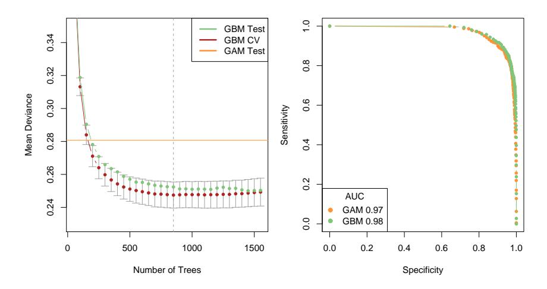

FIGURE 10.19. The left panel shows the mean deviance as a function of the number of trees for the GBM logistic regression model fit to the presence/absence data. Shown are 10-fold cross-validation on the training data (and 1 \times s.e. bars), and test deviance on the test data. Also shown for comparison is the test deviance using a GAM model with 8 df for each term. The right panel shows ROC curves on the test data for the chosen GBM model (vertical line in left plot) and the GAM model.

Figure 10.19 (left panel) shows the mean binomial deviance for the sequence of GBM models, both for 10-fold CV and test data. There is a modest improvement over the performance of a GAM model, fit using smoothing splines with 8 degrees-of-freedom (df) per term. The right panel shows the ROC curves (see Section 9.2.5) for both models, which measures predictive performance. From this point of view, the performance looks very similar, with GBM perhaps having a slight edge as summarized by the AUC (area under the curve). At the point of equal sensitivity/specificity, GBM achieves 91%, and GAM 90%.

Figure 10.20 summarizes the contributions of the variables in the logistic GBM fit. We see that there is a well-defined depth range over which Black Oreo are caught, with much more frequent capture in colder waters. We do not give details of the quantitative catch model; the important variables were much the same.

All the predictors used in these models are available on a fine geographical grid; in fact they were derived from environmental atlases, satellite images and the like—see Leathwick et al. (2006) for details. This also means that predictions can be made on this grid, and imported into GIS mapping systems. Figure 10.21 shows prediction maps for both presence and catch size, with both standardized to a common set of trawl conditions; since the predictors vary in a continuous fashion with geographical location, so do the predictions.

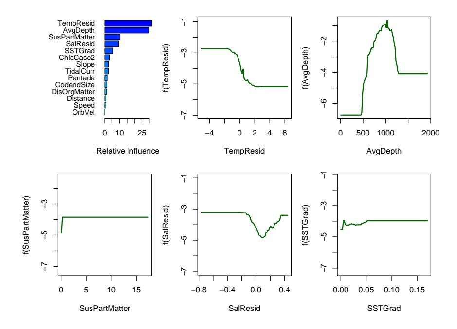

**FIGURE 10.20.** The top-left panel shows the relative influence computed from the GBM logistic regression model. The remaining panels show the partial dependence plots for the leading five variables, all plotted on the same scale for comparison.

Because of their ability to model interactions and automatically select variables, as well as robustness to outliers and missing data, GBM models are rapidly gaining popularity in this data-rich and enthusiastic community.

#### 10.14.3 Demographics Data

In this section we illustrate gradient boosting on a multiclass classification problem, using MART. The data come from 9243 questionnaires filled out by shopping mall customers in the San Francisco Bay Area (Impact Resources, Inc., Columbus, OH). Among the questions are 14 concerning demographics. For this illustration the goal is to predict occupation using the other 13 variables as predictors, and hence identify demographic variables that discriminate between different occupational categories. We randomly divided the data into a training set (80%) and test set (20%), and used J=6 node trees with a learning rate  $\nu=0.1$ .

Figure 10.22 shows the K=9 occupation class values along with their corresponding error rates. The overall error rate is 42.5%, which can be compared to the null rate of 69% obtained by predicting the most numerous

FIGURE 10.21. Geological prediction maps of the presence probability (left map) and catch size (right map) obtained from the gradient boosted models.

class Prof/Man (Professional/Managerial). The four best predicted classes are seen to be Retired, Student, Prof/Man, and Homemaker.

Figure 10.23 shows the relative predictor variable importances as averaged over all classes (10.46). Figure 10.24 displays the individual relative importance distributions (10.45) for each of the four best predicted classes. One sees that the most relevant predictors are generally different for each respective class. An exception is age which is among the three most relevant for predicting Retired, Student, and Prof/Man.

Figure 10.25 shows the partial dependence of the log-odds (10.52) on age for these three classes. The abscissa values are ordered codes for respective equally spaced age intervals. One sees that after accounting for the contributions of the other variables, the odds of being retired are higher for older people, whereas the opposite is the case for being a student. The odds of being professional/managerial are highest for middle-aged people. These results are of course not surprising. They illustrate that inspecting partial dependences separately for each class can lead to sensible results.

# Bibliographic Notes

Schapire (1990) developed the first simple boosting procedure in the PAC learning framework (Valiant, 1984; Kearns and Vazirani, 1994). Schapire

#### Overall Error Rate = 0.425

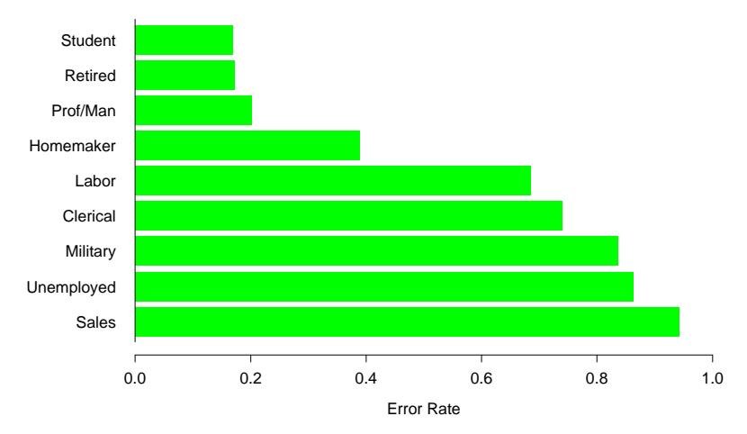

FIGURE 10.22. Error rate for each occupation in the demographics data.

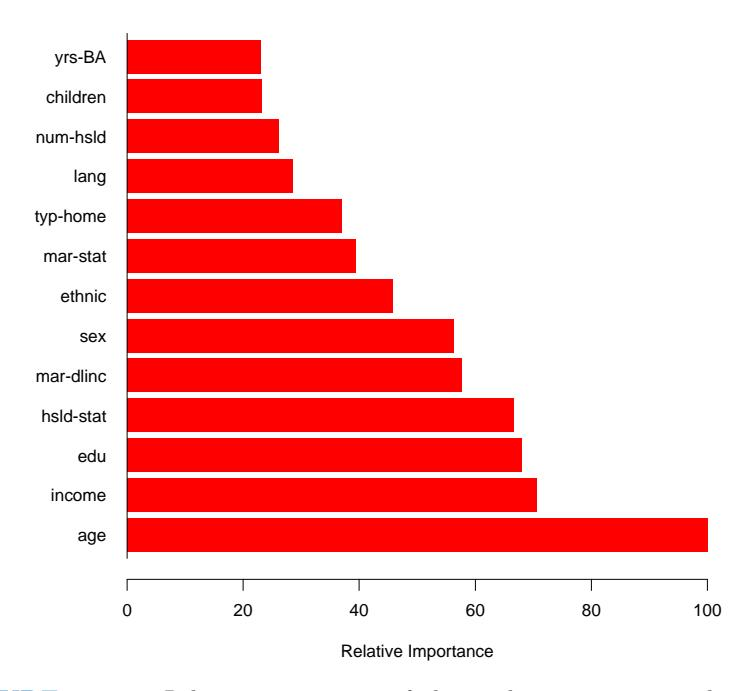

FIGURE 10.23. Relative importance of the predictors as averaged over all classes for the demographics data.

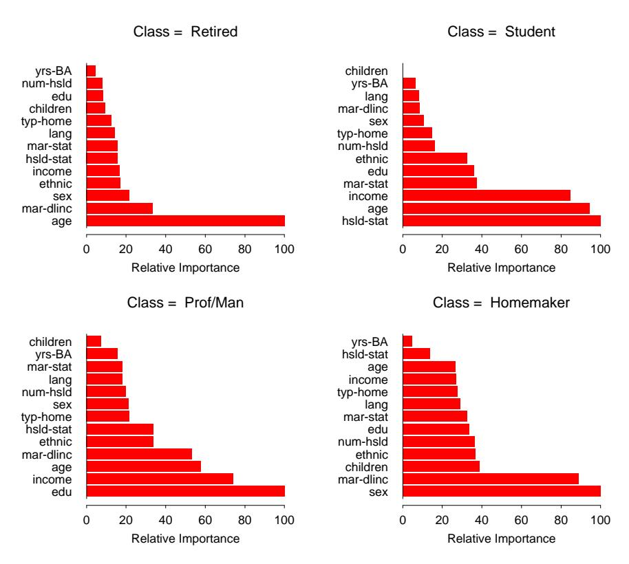

FIGURE 10.24. Predictor variable importances separately for each of the four classes with lowest error rate for the demographics data.

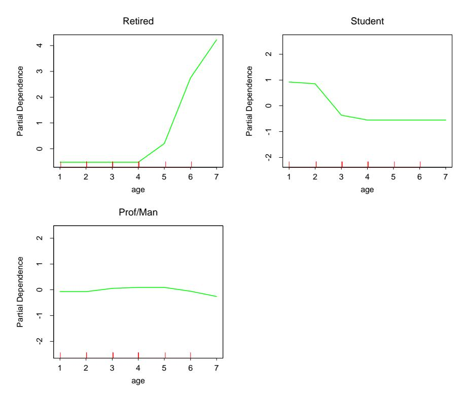

FIGURE 10.25. Partial dependence of the odds of three different occupations on age, for the demographics data.

showed that a weak learner could always improve its performance by training two additional classifiers on filtered versions of the input data stream. A weak learner is an algorithm for producing a two-class classifier with performance guaranteed (with high probability) to be significantly better than a coin-flip. After learning an initial classifier G$^{1}$ on the first N training points,

- G$^{2}$ is learned on a new sample of N points, half of which are misclassified by G1;
- G$^{3}$ is learned on N points for which G$^{1}$ and G$^{2}$ disagree;
- the boosted classifier is G$^{B}$ = majority vote(G1, G2, G3).

Schapire's "Strength of Weak Learnability" theorem proves that G$^{B}$ has improved performance over G1.

Freund (1995) proposed a "boost by majority" variation which combined many weak learners simultaneously and improved the performance of the simple boosting algorithm of Schapire. The theory supporting both of these algorithms requires the weak learner to produce a classifier with a fixed error rate. This led to the more adaptive and realistic AdaBoost (Freund and Schapire, 1996a) and its offspring, where this assumption was dropped.

Freund and Schapire (1996a) and Schapire and Singer (1999) provide some theory to support their algorithms, in the form of upper bounds on generalization error. This theory has evolved in the computational learning community, initially based on the concepts of PAC learning. Other theories attempting to explain boosting come from game theory (Freund and Schapire, 1996b; Breiman, 1999; Breiman, 1998), and VC theory (Schapire et al., 1998). The bounds and the theory associated with the AdaBoost algorithms are interesting, but tend to be too loose to be of practical importance. In practice, boosting achieves results far more impressive than the bounds would imply. Schapire (2002) and Meir and R¨atsch (2003) give useful overviews more recent than the first edition of this book.

Friedman et al. (2000) and Friedman (2001) form the basis for our exposition in this chapter. Friedman et al. (2000) analyze AdaBoost statistically, derive the exponential criterion, and show that it estimates the log-odds of the class probability. They propose additive tree models, the right-sized trees and ANOVA representation of Section 10.11, and the multiclass logit formulation. Friedman (2001) developed gradient boosting and shrinkage for classification and regression, while Friedman (1999) explored stochastic variants of boosting. Mason et al. (2000) also embraced a gradient approach to boosting. As the published discussions of Friedman et al. (2000) shows, there is some controversy about how and why boosting works.

Since the publication of the first edition of this book, these debates have continued, and spread into the statistical community with a series of papers on consistency of boosting (Jiang, 2004; Lugosi and Vayatis, 2004; Zhang and Yu, 2005; Bartlett and Traskin, 2007). Mease and Wyner (2008), through a series of simulation examples, challenge some of our interpretations of boosting; our response (Friedman et al., 2008a) puts most of these objections to rest. A recent survey by B¨uhlmann and Hothorn (2007) supports our approach to boosting.

# Exercises

Ex. 10.1 Derive expression (10.12) for the update parameter in AdaBoost.

Ex. 10.2 Prove result (10.16), that is, the minimizer of the population version of the AdaBoost criterion, is one-half of the log odds.

Ex. 10.3 Show that the marginal average (10.47) recovers additive and multiplicative functions (10.50) and (10.51), while the conditional expectation (10.49) does not.

#### Ex. 10.4

- (a) Write a program implementing AdaBoost with trees.
- (b) Redo the computations for the example of Figure 10.2. Plot the training error as well as test error, and discuss its behavior.
- (c) Investigate the number of iterations needed to make the test error finally start to rise.
- (d) Change the setup of this example as follows: define two classes, with the features in Class 1 being  $X_1, X_2, \ldots, X_{10}$ , standard independent Gaussian variates. In Class 2, the features  $X_1, X_2, \ldots, X_{10}$  are also standard independent Gaussian, but conditioned on the event  $\sum_j X_j^2 > 12$ . Now the classes have significant overlap in feature space. Repeat the AdaBoost experiments as in Figure 10.2 and discuss the results.

Ex. 10.5 Multiclass exponential loss (Zhu et al., 2005). For a K-class classification problem, consider the coding  $Y = (Y_1, \dots, Y_K)^T$  with

$$Y_k = \begin{cases} 1, & \text{if } G = \mathcal{G}_k \\ -\frac{1}{K-1}, & \text{otherwise.} \end{cases}$$
 (10.55)

Let  $f = (f_1, \dots, f_K)^T$  with  $\sum_{k=1}^K f_k = 0$ , and define

$$L(Y, f) = \exp\left(-\frac{1}{K}Y^T f\right). \tag{10.56}$$

- (a) Using Lagrange multipliers, derive the population minimizer  $f^*$  of L(Y, f), subject to the zero-sum constraint, and relate these to the class probabilities.
- (b) Show that a multiclass boosting using this loss function leads to a reweighting algorithm similar to Adaboost, as in Section 10.4.

Ex. 10.6 McNemar test (Agresti, 1996). We report the test error rates on the spam data to be 5.5% for a generalized additive model (GAM), and 4.5% for gradient boosting (GBM), with a test sample of size 1536.

(a) Show that the standard error of these estimates is about 0.6%.

Since the same test data are used for both methods, the error rates are correlated, and we cannot perform a two-sample t-test. We can compare the methods directly on each test observation, leading to the summary

|         | GBM     |       |  |  |
|---------|---------|-------|--|--|
| GAM     | Correct | Error |  |  |
| Correct | 1434    | 18    |  |  |
| Error   | 33      | 51    |  |  |

The McNemar test focuses on the discordant errors, 33 vs. 18.

(b) Conduct a test to show that GAM makes significantly more errors than gradient boosting, with a two-sided p-value of 0.036.

Ex. 10.7 Derive expression (10.32).

Ex. 10.8 Consider a K-class problem where the targets  $y_{ik}$  are coded as 1 if observation i is in class k and zero otherwise. Suppose we have a current model  $f_k(x)$ , k = 1, ..., K, with  $\sum_{k=1}^K f_k(x) = 0$  (see (10.21) in Section 10.6). We wish to update the model for observations in a region R in predictor space, by adding constants  $f_k(x) + \gamma_k$ , with  $\gamma_K = 0$ .

- (a) Write down the multinomial log-likelihood for this problem, and its first and second derivatives.
- (b) Using only the diagonal of the Hessian matrix in (1), and starting from  $\gamma_k = 0 \ \forall k$ , show that a one-step approximate Newton update for  $\gamma_k$  is

$$\gamma_k^1 = \frac{\sum_{x_i \in R} (y_{ik} - p_{ik})}{\sum_{x_i \in R} p_{ik} (1 - p_{ik})}, \ k = 1, \dots, K - 1,$$
(10.57)

where  $p_{ik} = \exp(f_k(x_i)) / \exp(\sum_{\ell=1}^{K} f_{\ell}(x_i))$ .

(c) We prefer our update to sum to zero, as the current model does. Using symmetry arguments, show that

$$\hat{\gamma}_k = \frac{K - 1}{K} (\gamma_k^1 - \frac{1}{K} \sum_{\ell=1}^K \gamma_\ell^1), \ k = 1, \dots, K$$
 (10.58)

is an appropriate update, where  $\gamma_k^1$  is defined as in (10.57) for all  $k=1,\ldots,K$ .

Ex. 10.9 Consider a K-class problem where the targets  $y_{ik}$  are coded as 1 if observation i is in class k and zero otherwise. Using the multinomial deviance loss function (10.22) and the symmetric logistic transform, use the arguments leading to the gradient boosting Algorithm 10.3 to derive Algorithm 10.4. *Hint*: See exercise 10.8 for step 2(b)iii.

Ex. 10.10 Show that for K = 2 class classification, only one tree needs to be grown at each gradient-boosting iteration.

Ex. 10.11 Show how to compute the partial dependence function  $f_{\mathcal{S}}(X_{\mathcal{S}})$  in (10.47) efficiently.

Ex. 10.12 Referring to (10.49), let  $S = \{1\}$  and  $C = \{2\}$ , with  $f(X_1, X_2) = X_1$ . Assume  $X_1$  and  $X_2$  are bivariate Gaussian, each with mean zero, variance one, and  $E(X_1X_2) = \rho$ . Show that  $E(f(X_1, X_2)|X_2) = \rho X_2$ , even though f is not a function of  $X_2$ .

#### **Algorithm 10.4** Gradient Boosting for K-class Classification.

- 1. Initialize  $f_{k0}(x) = 0, k = 1, 2, \dots, K$ .
- 2. For m=1 to M:
  - (a) Set

$$p_k(x) = \frac{e^{f_k(x)}}{\sum_{\ell=1}^K e^{f_\ell(x)}}, \ k = 1, 2, \dots, K.$$

- (b) For k = 1 to K:
  - i. Compute  $r_{ikm} = y_{ik} p_k(x_i), i = 1, 2, ..., N$ .
  - ii. Fit a regression tree to the targets  $r_{ikm}$ ,  $i=1,2,\ldots,N$ , giving terminal regions  $R_{jkm}$ ,  $j=1,2,\ldots,J_m$ .
  - iii. Compute

$$\gamma_{jkm} = \frac{K-1}{K} \frac{\sum_{x_i \in R_{jkm}} r_{ikm}}{\sum_{x_i \in R_{jkm}} |r_{ikm}| (1 - |r_{ikm}|)}, \ j = 1, 2, \dots, J_m.$$

iv. Update 
$$f_{km}(x) = f_{k,m-1}(x) + \sum_{j=1}^{J_m} \gamma_{jkm} I(x \in R_{jkm})$$
.

3. Output  $\hat{f}_k(x) = f_{kM}(x), k = 1, 2, ..., K$ .