# Neural Networks

# 11.1 Introduction

In this chapter we describe a class of learning methods that was developed separately in different fields—statistics and artificial intelligence—based on essentially identical models. The central idea is to extract linear combinations of the inputs as derived features, and then model the target as a nonlinear function of these features. The result is a powerful learning method, with widespread applications in many fields. We first discuss the projection pursuit model, which evolved in the domain of semiparametric statistics and smoothing. The rest of the chapter is devoted to neural network models.

# 11.2 Projection Pursuit Regression

As in our generic supervised learning problem, assume we have an input vector X with p components, and a target Y . Let ωm, m = 1, 2, . . . , M, be unit p-vectors of unknown parameters. The projection pursuit regression (PPR) model has the form

$$f(X) = \sum_{m=1}^{M} g_m(\omega_m^T X).$$
 (11.1)

This is an additive model, but in the derived features Vm = ω T mX rather than the inputs themselves. The functions gm are unspecified and are esti-

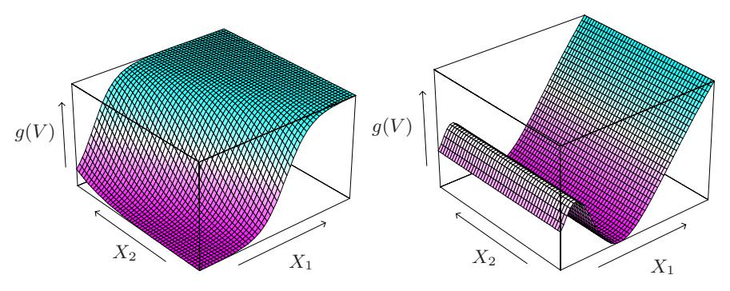

**FIGURE 11.1.** Perspective plots of two ridge functions. (Left:)  $g(V) = 1/[1 + \exp(-5(V - 0.5))]$ , where  $V = (X_1 + X_2)/\sqrt{2}$ . (Right:)  $g(V) = (V + 0.1)\sin(1/(V/3 + 0.1))$ , where  $V = X_1$ .

mated along with the directions  $\omega_m$  using some flexible smoothing method (see below).

The function  $g_m(\omega_m^T X)$  is called a ridge function in  $\mathbb{R}^p$ . It varies only in the direction defined by the vector  $\omega_m$ . The scalar variable  $V_m = \omega_m^T X$  is the projection of X onto the unit vector  $\omega_m$ , and we seek  $\omega_m$  so that the model fits well, hence the name "projection pursuit." Figure 11.1 shows some examples of ridge functions. In the example on the left  $\omega = (1/\sqrt{2})(1,1)^T$ , so that the function only varies in the direction  $X_1 + X_2$ . In the example on the right,  $\omega = (1,0)$ .

The PPR model (11.1) is very general, since the operation of forming nonlinear functions of linear combinations generates a surprisingly large class of models. For example, the product  $X_1 \cdot X_2$  can be written as  $[(X_1 + X_2)^2 - (X_1 - X_2)^2]/4$ , and higher-order products can be represented similarly.

In fact, if M is taken arbitrarily large, for appropriate choice of  $g_m$  the PPR model can approximate any continuous function in  $\mathbb{R}^p$  arbitrarily well. Such a class of models is called a universal approximator. However this generality comes at a price. Interpretation of the fitted model is usually difficult, because each input enters into the model in a complex and multifaceted way. As a result, the PPR model is most useful for prediction, and not very useful for producing an understandable model for the data. The M=1 model, known as the single index model in econometrics, is an exception. It is slightly more general than the linear regression model, and offers a similar interpretation.

How do we fit a PPR model, given training data  $(x_i, y_i)$ , i = 1, 2, ..., N? We seek the approximate minimizers of the error function

$$\sum_{i=1}^{N} \left[ y_i - \sum_{m=1}^{M} g_m(\omega_m^T x_i) \right]^2$$
 (11.2)

over functions  $g_m$  and direction vectors  $\omega_m$ , m = 1, 2, ..., M. As in other smoothing problems, we need either explicitly or implicitly to impose complexity constraints on the  $g_m$ , to avoid overfit solutions.

Consider just one term (M = 1, and drop the subscript). Given the direction vector  $\omega$ , we form the derived variables  $v_i = \omega^T x_i$ . Then we have a one-dimensional smoothing problem, and we can apply any scatterplot smoother, such as a smoothing spline, to obtain an estimate of g.

On the other hand, given g, we want to minimize (11.2) over  $\omega$ . A Gauss–Newton search is convenient for this task. This is a quasi-Newton method, in which the part of the Hessian involving the second derivative of g is discarded. It can be simply derived as follows. Let  $\omega_{\rm old}$  be the current estimate for  $\omega$ . We write

$$g(\omega^T x_i) \approx g(\omega_{\text{old}}^T x_i) + g'(\omega_{\text{old}}^T x_i)(\omega - \omega_{\text{old}})^T x_i$$
 (11.3)

to give

$$\sum_{i=1}^{N} \left[ y_i - g(\omega^T x_i) \right]^2 \approx \sum_{i=1}^{N} g'(\omega_{\text{old}}^T x_i)^2 \left[ \left( \omega_{\text{old}}^T x_i + \frac{y_i - g(\omega_{\text{old}}^T x_i)}{g'(\omega_{\text{old}}^T x_i)} \right) - \omega^T x_i \right]^2.$$
(11.4)

To minimize the right-hand side, we carry out a least squares regression with target  $\omega_{\rm old}^T x_i + (y_i - g(\omega_{\rm old}^T x_i))/g'(\omega_{\rm old}^T x_i)$  on the input  $x_i$ , with weights  $g'(\omega_{\rm old}^T x_i)^2$  and no intercept (bias) term. This produces the updated coefficient vector  $\omega_{\rm new}$ .

These two steps, estimation of g and  $\omega$ , are iterated until convergence. With more than one term in the PPR model, the model is built in a forward stage-wise manner, adding a pair  $(\omega_m, g_m)$  at each stage.

There are a number of implementation details.

- Although any smoothing method can in principle be used, it is convenient if the method provides derivatives. Local regression and smoothing splines are convenient.
- After each step the  $g_m$ 's from previous steps can be readjusted using the backfitting procedure described in Chapter 9. While this may lead ultimately to fewer terms, it is not clear whether it improves prediction performance.
- Usually the  $\omega_m$  are not readjusted (partly to avoid excessive computation), although in principle they could be as well.
- The number of terms M is usually estimated as part of the forward stage-wise strategy. The model building stops when the next term does not appreciably improve the fit of the model. Cross-validation can also be used to determine M.

There are many other applications, such as density estimation (Friedman et al., 1984; Friedman, 1987), where the projection pursuit idea can be used. In particular, see the discussion of ICA in Section 14.7 and its relationship with exploratory projection pursuit. However the projection pursuit regression model has not been widely used in the field of statistics, perhaps because at the time of its introduction (1981), its computational demands exceeded the capabilities of most readily available computers. But it does represent an important intellectual advance, one that has blossomed in its reincarnation in the field of neural networks, the topic of the rest of this chapter.

# 11.3 Neural Networks

The term neural network has evolved to encompass a large class of models and learning methods. Here we describe the most widely used "vanilla" neural net, sometimes called the single hidden layer back-propagation network, or single layer perceptron. There has been a great deal of hype surrounding neural networks, making them seem magical and mysterious. As we make clear in this section, they are just nonlinear statistical models, much like the projection pursuit regression model discussed above.

A neural network is a two-stage regression or classification model, typically represented by a network diagram as in Figure 11.2. This network applies both to regression or classification. For regression, typically K = 1 and there is only one output unit Y1 at the top. However, these networks can handle multiple quantitative responses in a seamless fashion, so we will deal with the general case.

For K-class classification, there are K units at the top, with the kth unit modeling the probability of class k. There are K target measurements Yk, k = 1, . . . , K, each being coded as a 0 − 1 variable for the kth class.

Derived features Zm are created from linear combinations of the inputs, and then the target Yk is modeled as a function of linear combinations of the Zm,

$$Z_{m} = \sigma(\alpha_{0m} + \alpha_{m}^{T}X), \ m = 1, \dots, M,$$

$$T_{k} = \beta_{0k} + \beta_{k}^{T}Z, \ k = 1, \dots, K,$$

$$f_{k}(X) = g_{k}(T), \ k = 1, \dots, K,$$
(11.5)

where Z = (Z1, Z2, . . . , ZM), and T = (T1, T2, . . . , TK).

The activation function σ(v) is usually chosen to be the sigmoid σ(v) = 1/(1 + e −v ); see Figure 11.3 for a plot of 1/(1 + e −v ). Sometimes Gaussian radial basis functions (Chapter 6) are used for the σ(v), producing what is known as a radial basis function network.

Neural network diagrams like Figure 11.2 are sometimes drawn with an additional bias unit feeding into every unit in the hidden and output layers.

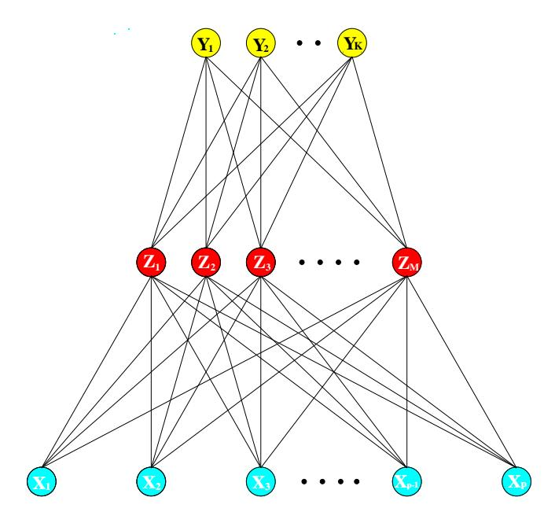

FIGURE 11.2. Schematic of a single hidden layer, feed-forward neural network.

Thinking of the constant "1" as an additional input feature, this bias unit captures the intercepts  $\alpha_{0m}$  and  $\beta_{0k}$  in model (11.5).

The output function  $g_k(T)$  allows a final transformation of the vector of outputs T. For regression we typically choose the identity function  $g_k(T) = T_k$ . Early work in K-class classification also used the identity function, but this was later abandoned in favor of the *softmax* function

$$g_k(T) = \frac{e^{T_k}}{\sum_{\ell=1}^K e^{T_\ell}}.$$
 (11.6)

This is of course exactly the transformation used in the multilogit model (Section 4.4), and produces positive estimates that sum to one. In Section 4.2 we discuss other problems with linear activation functions, in particular potentially severe masking effects.

The units in the middle of the network, computing the derived features  $Z_m$ , are called *hidden units* because the values  $Z_m$  are not directly observed. In general there can be more than one hidden layer, as illustrated in the example at the end of this chapter. We can think of the  $Z_m$  as a basis expansion of the original inputs X; the neural network is then a standard linear model, or linear multilogit model, using these transformations as inputs. There is, however, an important enhancement over the basis-expansion techniques discussed in Chapter 5; here the parameters of the basis functions are learned from the data.

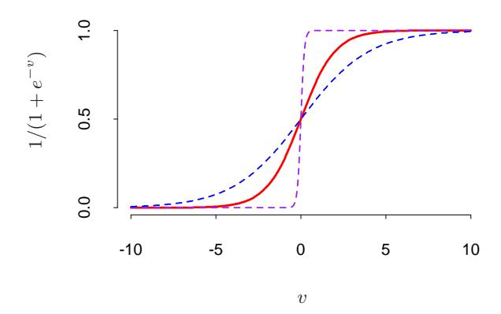

FIGURE 11.3. Plot of the sigmoid function σ(v) = 1/(1+exp(−v)) (red curve), commonly used in the hidden layer of a neural network. Included are σ(sv) for s = 1 2 (blue curve) and s = 10 (purple curve). The scale parameter s controls the activation rate, and we can see that large s amounts to a hard activation at v = 0. Note that σ(s(v − v0)) shifts the activation threshold from 0 to v0.

Notice that if σ is the identity function, then the entire model collapses to a linear model in the inputs. Hence a neural network can be thought of as a nonlinear generalization of the linear model, both for regression and classification. By introducing the nonlinear transformation σ, it greatly enlarges the class of linear models. In Figure 11.3 we see that the rate of activation of the sigmoid depends on the norm of αm, and if kαmk is very small, the unit will indeed be operating in the linear part of its activation function.

Notice also that the neural network model with one hidden layer has exactly the same form as the projection pursuit model described above. The difference is that the PPR model uses nonparametric functions gm(v), while the neural network uses a far simpler function based on σ(v), with three free parameters in its argument. In detail, viewing the neural network model as a PPR model, we identify

$$g_m(\omega_m^T X) = \beta_m \sigma(\alpha_{0m} + \alpha_m^T X)$$
  
=  $\beta_m \sigma(\alpha_{0m} + ||\alpha_m||(\omega_m^T X)),$  (11.7)

where ωm = αm/kαmk is the mth unit-vector. Since σβ,α0,s(v) = βσ(α0 + sv) has lower complexity than a more general nonparametric g(v), it is not surprising that a neural network might use 20 or 100 such functions, while the PPR model typically uses fewer terms (M = 5 or 10, for example).

Finally, we note that the name "neural networks" derives from the fact that they were first developed as models for the human brain. Each unit represents a neuron, and the connections (links in Figure 11.2) represent synapses. In early models, the neurons fired when the total signal passed to that unit exceeded a certain threshold. In the model above, this corresponds to use of a step function for σ(Z) and gm(T). Later the neural network was recognized as a useful tool for nonlinear statistical modeling, and for this purpose the step function is not smooth enough for optimization. Hence the step function was replaced by a smoother threshold function, the sigmoid in Figure 11.3.

# 11.4 Fitting Neural Networks

The neural network model has unknown parameters, often called weights, and we seek values for them that make the model fit the training data well. We denote the complete set of weights by θ, which consists of

$$\{\alpha_{0m}, \alpha_m; \ m = 1, 2, \dots, M\} \ M(p+1) \text{ weights},$$
  
 $\{\beta_{0k}, \beta_k; \ k = 1, 2, \dots, K\} \ K(M+1) \text{ weights}.$  (11.8)

For regression, we use sum-of-squared errors as our measure of fit (error function)

$$R(\theta) = \sum_{k=1}^{K} \sum_{i=1}^{N} (y_{ik} - f_k(x_i))^2.$$
 (11.9)

For classification we use either squared error or cross-entropy (deviance):

$$R(\theta) = -\sum_{i=1}^{N} \sum_{k=1}^{K} y_{ik} \log f_k(x_i), \qquad (11.10)$$

and the corresponding classifier is G(x) = argmaxk fk(x). With the softmax activation function and the cross-entropy error function, the neural network model is exactly a linear logistic regression model in the hidden units, and all the parameters are estimated by maximum likelihood.

Typically we don't want the global minimizer of R(θ), as this is likely to be an overfit solution. Instead some regularization is needed: this is achieved directly through a penalty term, or indirectly by early stopping. Details are given in the next section.

The generic approach to minimizing R(θ) is by gradient descent, called back-propagation in this setting. Because of the compositional form of the model, the gradient can be easily derived using the chain rule for differentiation. This can be computed by a forward and backward sweep over the network, keeping track only of quantities local to each unit.

Here is back-propagation in detail for squared error loss. Let  $z_{mi} = \sigma(\alpha_{0m} + \alpha_m^T x_i)$ , from (11.5) and let  $z_i = (z_{1i}, z_{2i}, \dots, z_{Mi})$ . Then we have

$$R(\theta) \equiv \sum_{i=1}^{N} R_{i}$$

$$= \sum_{i=1}^{N} \sum_{k=1}^{K} (y_{ik} - f_{k}(x_{i}))^{2}, \qquad (11.11)$$

with derivatives

$$\frac{\partial R_i}{\partial \beta_{km}} = -2(y_{ik} - f_k(x_i))g_k'(\beta_k^T z_i)z_{mi},$$

$$\frac{\partial R_i}{\partial \alpha_{m\ell}} = -\sum_{k=1}^K 2(y_{ik} - f_k(x_i))g_k'(\beta_k^T z_i)\beta_{km}\sigma'(\alpha_m^T x_i)x_{i\ell}.$$
(11.12)

Given these derivatives, a gradient descent update at the (r+1)st iteration has the form

$$\beta_{km}^{(r+1)} = \beta_{km}^{(r)} - \gamma_r \sum_{i=1}^{N} \frac{\partial R_i}{\partial \beta_{km}^{(r)}},$$

$$\alpha_{m\ell}^{(r+1)} = \alpha_{m\ell}^{(r)} - \gamma_r \sum_{i=1}^{N} \frac{\partial R_i}{\partial \alpha_{m\ell}^{(r)}},$$
(11.13)

where  $\gamma_r$  is the *learning rate*, discussed below.

Now write (11.12) as

$$\frac{\partial R_i}{\partial \beta_{km}} = \delta_{ki} z_{mi}, 
\frac{\partial R_i}{\partial \alpha_{m\ell}} = s_{mi} x_{i\ell}.$$
(11.14)

The quantities  $\delta_{ki}$  and  $s_{mi}$  are "errors" from the current model at the output and hidden layer units, respectively. From their definitions, these errors satisfy

$$s_{mi} = \sigma'(\alpha_m^T x_i) \sum_{k=1}^K \beta_{km} \delta_{ki}, \qquad (11.15)$$

known as the back-propagation equations. Using this, the updates in (11.13) can be implemented with a two-pass algorithm. In the forward pass, the current weights are fixed and the predicted values  $\hat{f}_k(x_i)$  are computed from formula (11.5). In the backward pass, the errors  $\delta_{ki}$  are computed, and then back-propagated via (11.15) to give the errors  $s_{mi}$ . Both sets of errors are then used to compute the gradients for the updates in (11.13), via (11.14).

This two-pass procedure is what is known as back-propagation. It has also been called the *delta rule* (Widrow and Hoff, 1960). The computational components for cross-entropy have the same form as those for the sum of squares error function, and are derived in Exercise 11.3.

The advantages of back-propagation are its simple, local nature. In the back propagation algorithm, each hidden unit passes and receives information only to and from units that share a connection. Hence it can be implemented efficiently on a parallel architecture computer.

The updates in (11.13) are a kind of batch learning, with the parameter updates being a sum over all of the training cases. Learning can also be carried out online—processing each observation one at a time, updating the gradient after each training case, and cycling through the training cases many times. In this case, the sums in equations (11.13) are replaced by a single summand. A training epoch refers to one sweep through the entire training set. Online training allows the network to handle very large training sets, and also to update the weights as new observations come in.

The learning rate  $\gamma_r$  for batch learning is usually taken to be a constant, and can also be optimized by a line search that minimizes the error function at each update. With online learning  $\gamma_r$  should decrease to zero as the iteration  $r \to \infty$ . This learning is a form of stochastic approximation (Robbins and Munro, 1951); results in this field ensure convergence if  $\gamma_r \to 0$ ,  $\sum_r \gamma_r = \infty$ , and  $\sum_r \gamma_r^2 < \infty$  (satisfied, for example, by  $\gamma_r = 1/r$ ). Back-propagation can be very slow, and for that reason is usually not

Back-propagation can be very slow, and for that reason is usually not the method of choice. Second-order techniques such as Newton's method are not attractive here, because the second derivative matrix of R (the Hessian) can be very large. Better approaches to fitting include conjugate gradients and variable metric methods. These avoid explicit computation of the second derivative matrix while still providing faster convergence.

# 11.5 Some Issues in Training Neural Networks

There is quite an art in training neural networks. The model is generally overparametrized, and the optimization problem is nonconvex and unstable unless certain guidelines are followed. In this section we summarize some of the important issues.

#### 11.5.1 Starting Values

Note that if the weights are near zero, then the operative part of the sigmoid (Figure 11.3) is roughly linear, and hence the neural network collapses into an approximately linear model (Exercise 11.2). Usually starting values for weights are chosen to be random values near zero. Hence the model starts out nearly linear, and becomes nonlinear as the weights increase. Individual

units localize to directions and introduce nonlinearities where needed. Use of exact zero weights leads to zero derivatives and perfect symmetry, and the algorithm never moves. Starting instead with large weights often leads to poor solutions.

#### 11.5.2 Overfitting

Often neural networks have too many weights and will overfit the data at the global minimum of R. In early developments of neural networks, either by design or by accident, an early stopping rule was used to avoid overfitting. Here we train the model only for a while, and stop well before we approach the global minimum. Since the weights start at a highly regularized (linear) solution, this has the effect of shrinking the final model toward a linear model. A validation dataset is useful for determining when to stop, since we expect the validation error to start increasing.

A more explicit method for regularization is weight decay, which is analogous to ridge regression used for linear models (Section 3.4.1). We add a penalty to the error function R(θ) + λJ(θ), where

$$J(\theta) = \sum_{k,m} \beta_{km}^2 + \sum_{m,\ell} \alpha_{m\ell}^2$$
 (11.16)

and λ ≥ 0 is a tuning parameter. Larger values of λ will tend to shrink the weights toward zero: typically cross-validation is used to estimate λ. The effect of the penalty is to simply add terms 2βkm and 2αmℓ to the respective gradient expressions (11.13). Other forms for the penalty have been proposed, for example,

$$J(\theta) = \sum_{k,m} \frac{\beta_{km}^2}{1 + \beta_{km}^2} + \sum_{m,\ell} \frac{\alpha_{m\ell}^2}{1 + \alpha_{m\ell}^2},$$
 (11.17)

known as the weight elimination penalty. This has the effect of shrinking smaller weights more than (11.16) does.

Figure 11.4 shows the result of training a neural network with ten hidden units, without weight decay (upper panel) and with weight decay (lower panel), to the mixture example of Chapter 2. Weight decay has clearly improved the prediction. Figure 11.5 shows heat maps of the estimated weights from the training (grayscale versions of these are called Hinton diagrams.) We see that weight decay has dampened the weights in both layers: the resulting weights are spread fairly evenly over the ten hidden units.

# 11.5.3 Scaling of the Inputs

Since the scaling of the inputs determines the effective scaling of the weights in the bottom layer, it can have a large effect on the quality of the final

#### Neural Network - 10 Units, No Weight Decay

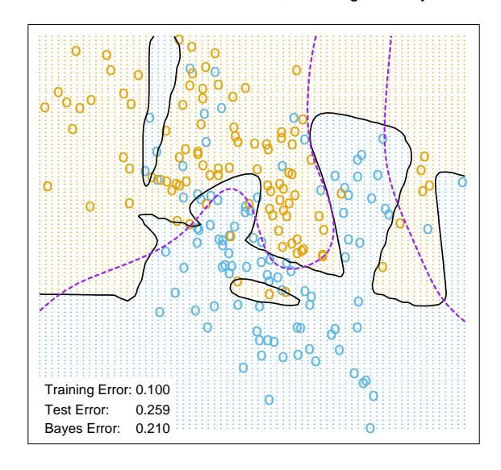

#### Neural Network - 10 Units, Weight Decay=0.02

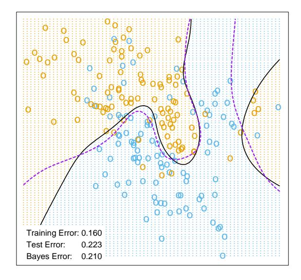

**FIGURE 11.4.** A neural network on the mixture example of Chapter 2. The upper panel uses no weight decay, and overfits the training data. The lower panel uses weight decay, and achieves close to the Bayes error rate (broken purple boundary). Both use the softmax activation function and cross-entropy error.

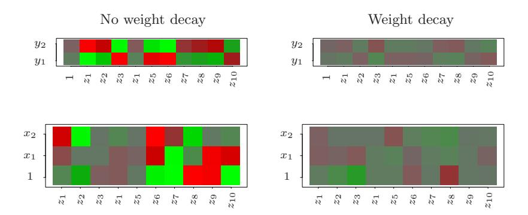

FIGURE 11.5. Heat maps of the estimated weights from the training of neural networks from Figure 11.4. The display ranges from bright green (negative) to bright red (positive).

solution. At the outset it is best to standardize all inputs to have mean zero and standard deviation one. This ensures all inputs are treated equally in the regularization process, and allows one to choose a meaningful range for the random starting weights. With standardized inputs, it is typical to take random uniform weights over the range [−0.7, +0.7].

#### 11.5.4 Number of Hidden Units and Layers

Generally speaking it is better to have too many hidden units than too few. With too few hidden units, the model might not have enough flexibility to capture the nonlinearities in the data; with too many hidden units, the extra weights can be shrunk toward zero if appropriate regularization is used. Typically the number of hidden units is somewhere in the range of 5 to 100, with the number increasing with the number of inputs and number of training cases. It is most common to put down a reasonably large number of units and train them with regularization. Some researchers use cross-validation to estimate the optimal number, but this seems unnecessary if cross-validation is used to estimate the regularization parameter. Choice of the number of hidden layers is guided by background knowledge and experimentation. Each layer extracts features of the input for regression or classification. Use of multiple hidden layers allows construction of hierarchical features at different levels of resolution. An example of the effective use of multiple layers is given in Section 11.6.

# 11.5.5 Multiple Minima

The error function R(θ) is nonconvex, possessing many local minima. As a result, the final solution obtained is quite dependent on the choice of starting weights. One must at least try a number of random starting configurations, and choose the solution giving lowest (penalized) error. Probably a better approach is to use the average predictions over the collection of networks as the final prediction (Ripley, 1996). This is preferable to averaging the weights, since the nonlinearity of the model implies that this averaged solution could be quite poor. Another approach is via *bagging*, which averages the predictions of networks training from randomly perturbed versions of the training data. This is described in Section 8.7.

# 11.6 Example: Simulated Data

We generated data from two additive error models  $Y = f(X) + \varepsilon$ :

Sum of sigmoids: 
$$Y = \sigma(a_1^T X) + \sigma(a_2^T X) + \varepsilon_1;$$
  
Radial:  $Y = \prod_{m=1}^{10} \phi(X_m) + \varepsilon_2.$ 

Here  $X^T = (X_1, X_2, \dots, X_p)$ , each  $X_j$  being a standard Gaussian variate, with p = 2 in the first model, and p = 10 in the second.

For the sigmoid model,  $a_1=(3,3)$ ,  $a_2=(3,-3)$ ; for the radial model,  $\phi(t)=(1/2\pi)^{1/2}\exp(-t^2/2)$ . Both  $\varepsilon_1$  and  $\varepsilon_2$  are Gaussian errors, with variance chosen so that the signal-to-noise ratio

$$\frac{\operatorname{Var}(\operatorname{E}(Y|X))}{\operatorname{Var}(Y - \operatorname{E}(Y|X))} = \frac{\operatorname{Var}(f(X))}{\operatorname{Var}(\varepsilon)}$$
(11.18)

is 4 in both models. We took a training sample of size 100 and a test sample of size 10,000. We fit neural networks with weight decay and various numbers of hidden units, and recorded the average test error  $E_{\text{Test}}(Y - f(X))^2$ for each of 10 random starting weights. Only one training set was generated, but the results are typical for an "average" training set. The test errors are shown in Figure 11.6. Note that the zero hidden unit model refers to linear least squares regression. The neural network is perfectly suited to the sum of sigmoids model, and the two-unit model does perform the best, achieving an error close to the Bayes rate. (Recall that the Bayes rate for regression with squared error is the error variance; in the figures, we report test error relative to the Bayes error). Notice, however, that with more hidden units, overfitting quickly creeps in, and with some starting weights the model does worse than the linear model (zero hidden unit) model. Even with two hidden units, two of the ten starting weight configurations produced results no better than the linear model, confirming the importance of multiple starting values.

A radial function is in a sense the most difficult for the neural net, as it is spherically symmetric and with no preferred directions. We see in the right

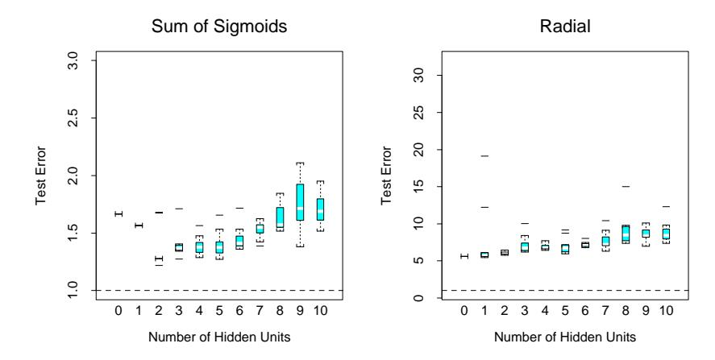

FIGURE 11.6. Boxplots of test error, for simulated data example, relative to the Bayes error (broken horizontal line). True function is a sum of two sigmoids on the left, and a radial function is on the right. The test error is displayed for 10 different starting weights, for a single hidden layer neural network with the number of units as indicated.

panel of Figure 11.6 that it does poorly in this case, with the test error staying well above the Bayes error (note the different vertical scale from the left panel). In fact, since a constant fit (such as the sample average) achieves a relative error of 5 (when the SNR is 4), we see that the neural networks perform increasingly worse than the mean.

In this example we used a fixed weight decay parameter of 0.0005, representing a mild amount of regularization. The results in the left panel of Figure 11.6 suggest that more regularization is needed with greater numbers of hidden units.

In Figure 11.7 we repeated the experiment for the sum of sigmoids model, with no weight decay in the left panel, and stronger weight decay (λ = 0.1) in the right panel. With no weight decay, overfitting becomes even more severe for larger numbers of hidden units. The weight decay value λ = 0.1 produces good results for all numbers of hidden units, and there does not appear to be overfitting as the number of units increase. Finally, Figure 11.8 shows the test error for a ten hidden unit network, varying the weight decay parameter over a wide range. The value 0.1 is approximately optimal.

In summary, there are two free parameters to select: the weight decay λ and number of hidden units M. As a learning strategy, one could fix either parameter at the value corresponding to the least constrained model, to ensure that the model is rich enough, and use cross-validation to choose the other parameter. Here the least constrained values are zero weight decay and ten hidden units. Comparing the left panel of Figure 11.7 to Figure 11.8, we see that the test error is less sensitive to the value of the weight

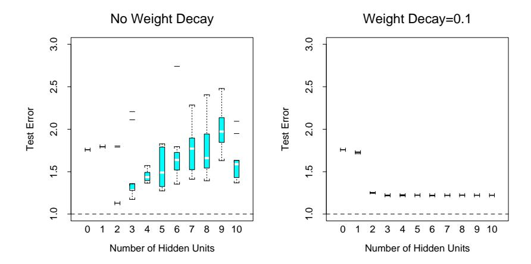

FIGURE 11.7. Boxplots of test error, for simulated data example, relative to the Bayes error. True function is a sum of two sigmoids. The test error is displayed for ten different starting weights, for a single hidden layer neural network with the number units as indicated. The two panels represent no weight decay (left) and strong weight decay λ = 0.1 (right).

#### Sum of Sigmoids, 10 Hidden Unit Model

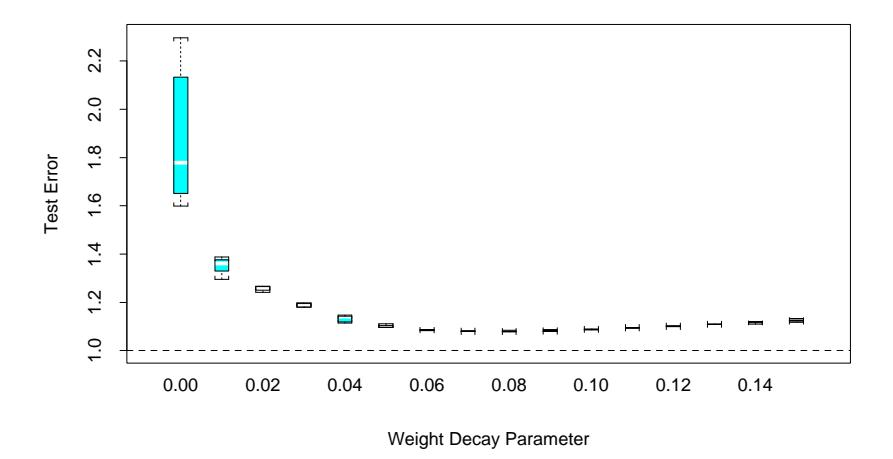

FIGURE 11.8. Boxplots of test error, for simulated data example. True function is a sum of two sigmoids. The test error is displayed for ten different starting weights, for a single hidden layer neural network with ten hidden units and weight decay parameter value as indicated.

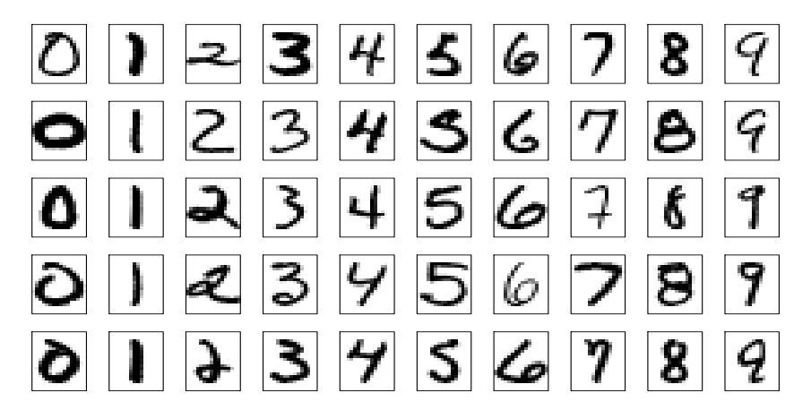

FIGURE 11.9. Examples of training cases from ZIP code data. Each image is a 16 × 16 8-bit grayscale representation of a handwritten digit.

decay parameter, and hence cross-validation of this parameter would be preferred.

# 11.7 Example: ZIP Code Data

This example is a character recognition task: classification of handwritten numerals. This problem captured the attention of the machine learning and neural network community for many years, and has remained a benchmark problem in the field. Figure 11.9 shows some examples of normalized handwritten digits, automatically scanned from envelopes by the U.S. Postal Service. The original scanned digits are binary and of different sizes and orientations; the images shown here have been deslanted and size normalized, resulting in 16 × 16 grayscale images (Le Cun et al., 1990). These 256 pixel values are used as inputs to the neural network classifier.

A black box neural network is not ideally suited to this pattern recognition task, partly because the pixel representation of the images lack certain invariances (such as small rotations of the image). Consequently early attempts with neural networks yielded misclassification rates around 4.5% on various examples of the problem. In this section we show some of the pioneering efforts to handcraft the neural network to overcome some these deficiencies (Le Cun, 1989), which ultimately led to the state of the art in neural network performance(Le Cun et al., 1998)1 .

Although current digit datasets have tens of thousands of training and test examples, the sample size here is deliberately modest in order to em-

1The figures and tables in this example were recreated from Le Cun (1989).

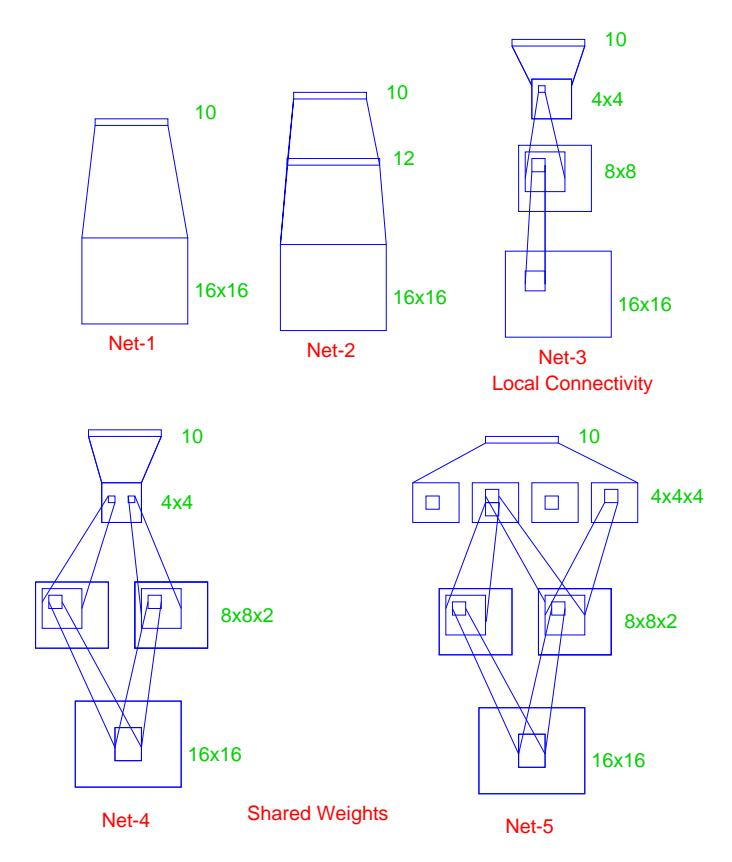

FIGURE 11.10. Architecture of the five networks used in the ZIP code example.

phasize the effects. The examples were obtained by scanning some actual hand-drawn digits, and then generating additional images by random horizontal shifts. Details may be found in Le Cun (1989). There are 320 digits in the training set, and 160 in the test set.

Five different networks were fit to the data:

Net-1: No hidden layer, equivalent to multinomial logistic regression.

Net-2: One hidden layer, 12 hidden units fully connected.

Net-3: Two hidden layers locally connected.

Net-4: Two hidden layers, locally connected with weight sharing.

Net-5: Two hidden layers, locally connected, two levels of weight sharing.

These are depicted in Figure 11.10. Net-1 for example has 256 inputs, one each for the 16×16 input pixels, and ten output units for each of the digits 0–9. The predicted value ˆfk(x) represents the estimated probability that an image x has digit class k, for k = 0, 1, 2, . . . , 9.

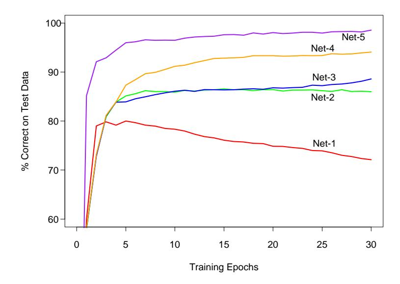

FIGURE 11.11. Test performance curves, as a function of the number of training epochs, for the five networks of Table 11.1 applied to the ZIP code data. (Le Cun, 1989)

The networks all have sigmoidal output units, and were all fit with the sum-of-squares error function. The first network has no hidden layer, and hence is nearly equivalent to a linear multinomial regression model (Exercise 11.4). Net-2 is a single hidden layer network with 12 hidden units, of the kind described above.

The training set error for all of the networks was 0%, since in all cases there are more parameters than training observations. The evolution of the test error during the training epochs is shown in Figure 11.11. The linear network (Net-1) starts to overfit fairly quickly, while test performance of the others level off at successively superior values.

The other three networks have additional features which demonstrate the power and flexibility of the neural network paradigm. They introduce constraints on the network, natural for the problem at hand, which allow for more complex connectivity but fewer parameters.

Net-3 uses local connectivity: this means that each hidden unit is connected to only a small patch of units in the layer below. In the first hidden layer (an 8×8 array), each unit takes inputs from a 3×3 patch of the input layer; for units in the first hidden layer that are one unit apart, their receptive fields overlap by one row or column, and hence are two pixels apart. In the second hidden layer, inputs are from a 5 × 5 patch, and again units that are one unit apart have receptive fields that are two units apart. The weights for all other connections are set to zero. Local connectivity makes each unit responsible for extracting local features from the layer below, and

|        | Network Architecture  | Links | Weights | % Correct |
|--------|-----------------------|-------|---------|-----------|
| Net-1: | Single layer network  | 2570  | 2570    | 80.0%     |
| Net-2: | Two layer network     | 3214  | 3214    | 87.0%     |
| Net-3: | Locally connected     | 1226  | 1226    | 88.5%     |
| Net-4: | Constrained network 1 | 2266  | 1132    | 94.0%     |
| Net-5: | Constrained network 2 | 5194  | 1060    | 98.4%     |

**TABLE 11.1.** Test set performance of five different neural networks on a handwritten digit classification example (Le Cun, 1989).

reduces considerably the total number of weights. With many more hidden units than Net-2, Net-3 has fewer links and hence weights (1226 vs. 3214), and achieves similar performance.

Net-4 and Net-5 have local connectivity with shared weights. All units in a local feature map perform the same operation on different parts of the image, achieved by sharing the same weights. The first hidden layer of Net-4 has two  $8\times 8$  arrays, and each unit takes input from a  $3\times 3$  patch just like in Net-3. However, each of the units in a single  $8\times 8$  feature map share the same set of nine weights (but have their own bias parameter). This forces the extracted features in different parts of the image to be computed by the same linear functional, and consequently these networks are sometimes known as convolutional networks. The second hidden layer of Net-4 has no weight sharing, and is the same as in Net-3. The gradient of the error function R with respect to a shared weight is the sum of the gradients of R with respect to each connection controlled by the weights in question.

Table 11.1 gives the number of links, the number of weights and the optimal test performance for each of the networks. We see that Net-4 has more links but fewer weights than Net-3, and superior test performance. Net-5 has four  $4\times 4$  feature maps in the second hidden layer, each unit connected to a  $5\times 5$  local patch in the layer below. Weights are shared in each of these feature maps. We see that Net-5 does the best, having errors of only 1.6%, compared to 13% for the "vanilla" network Net-2. The clever design of network Net-5, motivated by the fact that features of handwriting style should appear in more than one part of a digit, was the result of many person years of experimentation. This and similar networks gave better performance on ZIP code problems than any other learning method at that time (early 1990s). This example also shows that neural networks are not a fully automatic tool, as they are sometimes advertised. As with all statistical models, subject matter knowledge can and should be used to improve their performance.

This network was later outperformed by the tangent distance approach (Simard et al., 1993) described in Section 13.3.3, which explicitly incorporates natural affine invariances. At this point the digit recognition datasets become test beds for every new learning procedure, and researchers worked

hard to drive down the error rates. As of this writing, the best error rates on a large database (60, 000 training, 10, 000 test observations), derived from standard NIST2 databases, were reported to be the following: (Le Cun et al., 1998):

- 1.1% for tangent distance with a 1-nearest neighbor classifier (Section 13.3.3);
- 0.8% for a degree-9 polynomial SVM (Section 12.3);
- 0.8% for LeNet-5, a more complex version of the convolutional network described here;
- 0.7% for boosted LeNet-4. Boosting is described in Chapter 8. LeNet-4 is a predecessor of LeNet-5.

Le Cun et al. (1998) report a much larger table of performance results, and it is evident that many groups have been working very hard to bring these test error rates down. They report a standard error of 0.1% on the error estimates, which is based on a binomial average with N = 10, 000 and p ≈ 0.01. This implies that error rates within 0.1—0.2% of one another are statistically equivalent. Realistically the standard error is even higher, since the test data has been implicitly used in the tuning of the various procedures.

# 11.8 Discussion

Both projection pursuit regression and neural networks take nonlinear functions of linear combinations ("derived features") of the inputs. This is a powerful and very general approach for regression and classification, and has been shown to compete well with the best learning methods on many problems.

These tools are especially effective in problems with a high signal-to-noise ratio and settings where prediction without interpretation is the goal. They are less effective for problems where the goal is to describe the physical process that generated the data and the roles of individual inputs. Each input enters into the model in many places, in a nonlinear fashion. Some authors (Hinton, 1989) plot a diagram of the estimated weights into each hidden unit, to try to understand the feature that each unit is extracting. This is limited however by the lack of identifiability of the parameter vectors αm, m = 1, . . . , M. Often there are solutions with αm spanning the same linear space as the ones found during training, giving predicted values that

2The National Institute of Standards and Technology maintain large databases, including handwritten character databases; http://www.nist.gov/srd/.

are roughly the same. Some authors suggest carrying out a principal component analysis of these weights, to try to find an interpretable solution. In general, the difficulty of interpreting these models has limited their use in fields like medicine, where interpretation of the model is very important.

There has been a great deal of research on the training of neural networks. Unlike methods like CART and MARS, neural networks are smooth functions of real-valued parameters. This facilitates the development of Bayesian inference for these models. The next sections discusses a successful Bayesian implementation of neural networks.

# 11.9 Bayesian Neural Nets and the NIPS 2003 Challenge

A classification competition was held in 2003, in which five labeled training datasets were provided to participants. It was organized for a Neural Information Processing Systems (NIPS) workshop. Each of the data sets constituted a two-class classification problems, with different sizes and from a variety of domains (see Table 11.2). Feature measurements for a validation dataset were also available.

Participants developed and applied statistical learning procedures to make predictions on the datasets, and could submit predictions to a website on the validation set for a period of 12 weeks. With this feedback, participants were then asked to submit predictions for a separate test set and they received their results. Finally, the class labels for the validation set were released and participants had one week to train their algorithms on the combined training and validation sets, and submit their final predictions to the competition website. A total of 75 groups participated, with 20 and 16 eventually making submissions on the validation and test sets, respectively.

There was an emphasis on feature extraction in the competition. Artificial "probes" were added to the data: these are noise features with distributions resembling the real features but independent of the class labels. The percentage of probes that were added to each dataset, relative to the total set of features, is shown on Table 11.2. Thus each learning algorithm had to figure out a way of identifying the probes and downweighting or eliminating them.

A number of metrics were used to evaluate the entries, including the percentage correct on the test set, the area under the ROC curve, and a combined score that compared each pair of classifiers head-to-head. The results of the competition are very interesting and are detailed in Guyon et al. (2006). The most notable result: the entries of Neal and Zhang (2006) were the clear overall winners. In the final competition they finished first

Artificial

Madelon

Dataset Domain Feature  $N_{tr}$  $N_{val}$ Percent  $N_{te}$ р Туре Probes Arcene Mass spectrometry Dense 10,000 30 100 100 700 2000 Text classification Sparse 20,000 50 300 300 Dexter Sparse 100,000 800 350 800 Dorothea Drug discovery 50 Gisette Digit recognition Dense 5000 30 6000 1000 6500

Dense

**TABLE 11.2.** NIPS 2003 challenge data sets. The column labeled p is the number of features. For the Dorothea dataset the features are binary.  $N_{tr}$ ,  $N_{val}$  and  $N_{te}$  are the number of training, validation and test cases, respectively

in three of the five datasets, and were 5th and 7th on the remaining two datasets.

500

96

2000

600

1800

In their winning entries, Neal and Zhang (2006) used a series of preprocessing feature-selection steps, followed by Bayesian neural networks, Dirichlet diffusion trees, and combinations of these methods. Here we focus only on the Bayesian neural network approach, and try to discern which aspects of their approach were important for its success. We rerun their programs and compare the results to boosted neural networks and boosted trees, and other related methods.

#### 11.9.1 Bayes, Boosting and Bagging

Let us first review briefly the Bayesian approach to inference and its application to neural networks. Given training data  $\mathbf{X}_{\mathrm{tr}}, \mathbf{y}_{\mathrm{tr}}$ , we assume a sampling model with parameters  $\theta$ ; Neal and Zhang (2006) use a two-hidden-layer neural network, with output nodes the class probabilities  $\Pr(Y|X,\theta)$  for the binary outcomes. Given a prior distribution  $\Pr(\theta)$ , the posterior distribution for the parameters is

$$Pr(\theta|\mathbf{X}_{tr}, \mathbf{y}_{tr}) = \frac{Pr(\theta)Pr(\mathbf{y}_{tr}|\mathbf{X}_{tr}, \theta)}{\int Pr(\theta)Pr(\mathbf{y}_{tr}|\mathbf{X}_{tr}, \theta)d\theta}$$
(11.19)

For a test case with features  $X_{\text{new}}$ , the predictive distribution for the label  $Y_{\text{new}}$  is

$$\Pr(Y_{\text{new}}|X_{\text{new}}, \mathbf{X}_{\text{tr}}, \mathbf{y}_{\text{tr}}) = \int \Pr(Y_{\text{new}}|X_{\text{new}}, \theta) \Pr(\theta|\mathbf{X}_{\text{tr}}, \mathbf{y}_{\text{tr}}) d\theta \quad (11.20)$$

(c.f. equation 8.24). Since the integral in (11.20) is intractable, sophisticated Markov Chain Monte Carlo (MCMC) methods are used to sample from the posterior distribution  $\Pr(Y_{\text{new}}|X_{\text{new}},\mathbf{X}_{\text{tr}},\mathbf{y}_{\text{tr}})$ . A few hundred values  $\theta$  are generated and then a simple average of these values estimates the integral. Neal and Zhang (2006) use diffuse Gaussian priors for all of the parameters. The particular MCMC approach that was used is called *hybrid Monte Carlo*, and may be important for the success of the method. It includes an auxiliary momentum vector and implements Hamiltonian dynamics in which the potential function is the target density. This is done to avoid

random walk behavior; the successive candidates move across the sample space in larger steps. They tend to be less correlated and hence converge to the target distribution more rapidly.

Neal and Zhang (2006) also tried different forms of pre-processing of the features:

- 1. univariate screening using t-tests, and
- 2. automatic relevance determination.

In the latter method (ARD), the weights (coefficients) for the jth feature to each of the first hidden layer units all share a common prior variance σ 2 j , and prior mean zero. The posterior distributions for each variance σ 2 j are computed, and the features whose posterior variance concentrates on small values are discarded.

There are thus three main features of this approach that could be important for its success:

- (a) the feature selection and pre-processing,
- (b) the neural network model, and
- (c) the Bayesian inference for the model using MCMC.

According to Neal and Zhang (2006), feature screening in (a) is carried out purely for computational efficiency; the MCMC procedure is slow with a large number of features. There is no need to use feature selection to avoid overfitting. The posterior average (11.20) takes care of this automatically.

We would like to understand the reasons for the success of the Bayesian method. In our view, power of modern Bayesian methods does not lie in their use as a formal inference procedure; most people would not believe that the priors in a high-dimensional, complex neural network model are actually correct. Rather the Bayesian/MCMC approach gives an efficient way of sampling the relevant parts of model space, and then averaging the predictions for the high-probability models.

Bagging and boosting are non-Bayesian procedures that have some similarity to MCMC in a Bayesian model. The Bayesian approach fixes the data and perturbs the parameters, according to current estimate of the posterior distribution. Bagging perturbs the data in an i.i.d fashion and then re-estimates the model to give a new set of model parameters. At the end, a simple average of the model predictions from different bagged samples is computed. Boosting is similar to bagging, but fits a model that is additive in the models of each individual base learner, which are learned using non i.i.d. samples. We can write all of these models in the form

$$\hat{f}(\mathbf{x}_{\text{new}}) = \sum_{\ell=1}^{L} w_{\ell} E(Y_{\text{new}} | \mathbf{x}_{\text{new}}, \hat{\theta}_{\ell})$$
 (11.21)

In all cases the ˆθℓ are a large collection of model parameters. For the Bayesian model the wℓ = 1/L, and the average estimates the posterior mean (11.21) by sampling θℓ from the posterior distribution. For bagging, wℓ = 1/L as well, and the ˆθℓ are the parameters refit to bootstrap resamples of the training data. For boosting, the weights are all equal to 1, but the ˆθℓ are typically chosen in a nonrandom sequential fashion to constantly improve the fit.

#### 11.9.2 Performance Comparisons

Based on the similarities above, we decided to compare Bayesian neural networks to boosted trees, boosted neural networks, random forests and bagged neural networks on the five datasets in Table 11.2. Bagging and boosting of neural networks are not methods that we have previously used in our work. We decided to try them here, because of the success of Bayesian neural networks in this competition, and the good performance of bagging and boosting with trees. We also felt that by bagging and boosting neural nets, we could assess both the choice of model as well as the model search strategy.

Here are the details of the learning methods that were compared:

- Bayesian neural nets. The results here are taken from Neal and Zhang (2006), using their Bayesian approach to fitting neural networks. The models had two hidden layers of 20 and 8 units. We re-ran some networks for timing purposes only.
- Boosted trees. We used the gbm package (version 1.5-7) in the R language. Tree depth and shrinkage factors varied from dataset to dataset. We consistently bagged 80% of the data at each boosting iteration (the default is 50%). Shrinkage was between 0.001 and 0.1. Tree depth was between 2 and 9.
- Boosted neural networks. Since boosting is typically most effective with "weak" learners, we boosted a single hidden layer neural network with two or four units, fit with the nnet package (version 7.2-36) in R.
- Random forests. We used the R package randomForest (version 4.5-16) with default settings for the parameters.
- Bagged neural networks. We used the same architecture as in the Bayesian neural network above (two hidden layers of 20 and 8 units), fit using both Neal's C language package "Flexible Bayesian Modeling" (2004- 11-10 release), and Matlab neural-net toolbox (version 5.1).

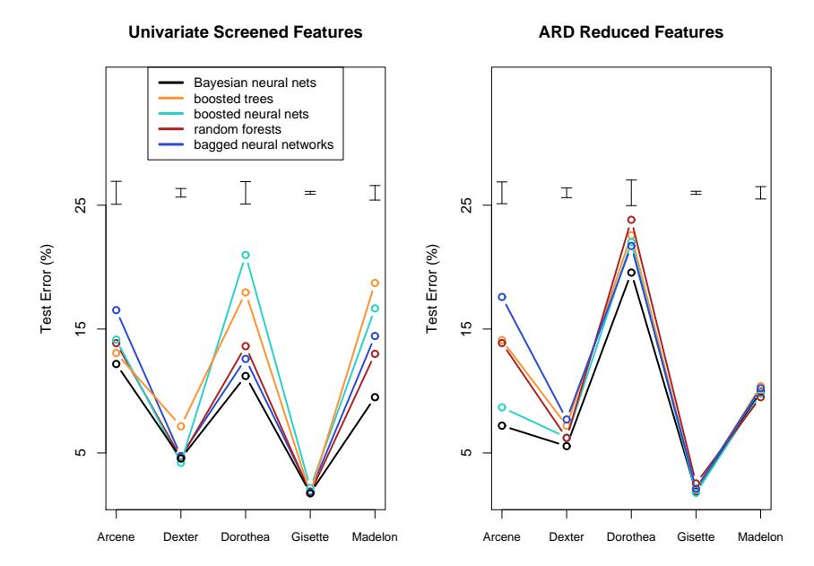

FIGURE 11.12. Performance of different learning methods on five problems, using both univariate screening of features (top panel) and a reduced feature set from automatic relevance determination. The error bars at the top of each plot have width equal to one standard error of the difference between two error rates. On most of the problems several competitors are within this error bound.

This analysis was carried out by Nicholas Johnson, and full details may be found in Johnson (2008)3 . The results are shown in Figure 11.12 and Table 11.3.

The figure and table show Bayesian, boosted and bagged neural networks, boosted trees, and random forests, using both the screened and reduced features sets. The error bars at the top of each plot indicate one standard error of the difference between two error rates. Bayesian neural networks again emerge as the winner, although for some datasets the differences between the test error rates is not statistically significant. Random forests performs the best among the competitors using the selected feature set, while the boosted neural networks perform best with the reduced feature set, and nearly match the Bayesian neural net.

The superiority of boosted neural networks over boosted trees suggest that the neural network model is better suited to these particular problems. Specifically, individual features might not be good predictors here

3We also thank Isabelle Guyon for help in preparing the results of this section.

|                          |         | Screened Features | ARD Reduced Features |            |  |  |  |
|--------------------------|---------|-------------------|----------------------|------------|--|--|--|
| Method                   | Average | Average           | Average              | Average    |  |  |  |
|                          | Rank    | Time              | Rank                 | Time       |  |  |  |
| Bayesian neural networks | 1.5     | 384(138)          | 1.6                  | 600(186)   |  |  |  |
| Boosted trees            | 3.4     | 3.03(2.5)         | 4.0                  | 34.1(32.4) |  |  |  |
| Boosted neural networks  | 3.8     | 9.4(8.6)          | 2.2                  | 35.6(33.5) |  |  |  |
| Random forests           | 2.7     | 1.9(1.7)          | 3.2                  | 11.2(9.3)  |  |  |  |
| Bagged neural networks   | 3.6     | 3.5(1.1)          | 4.0                  | 6.4(4.4)   |  |  |  |

TABLE 11.3. Performance of different methods. Values are average rank of test error across the five problems (low is good), and mean computation time and standard error of the mean, in minutes.

and linear combinations of features work better. However the impressive performance of random forests is at odds with this explanation, and came as a surprise to us.

Since the reduced feature sets come from the Bayesian neural network approach, only the methods that use the screened features are legitimate, self-contained procedures. However, this does suggest that better methods for internal feature selection might help the overall performance of boosted neural networks.

The table also shows the approximate training time required for each method. Here the non-Bayesian methods show a clear advantage.

Overall, the superior performance of Bayesian neural networks here may be due to the fact that

- (a) the neural network model is well suited to these five problems, and
- (b) the MCMC approach provides an efficient way of exploring the important part of the parameter space, and then averaging the resulting models according to their quality.

The Bayesian approach works well for smoothly parametrized models like neural nets; it is not yet clear that it works as well for non-smooth models like trees.

# 11.10 Computational Considerations

With N observations, p predictors, M hidden units and L training epochs, a neural network fit typically requires O(N pML) operations. There are many packages available for fitting neural networks, probably many more than exist for mainstream statistical methods. Because the available software varies widely in quality, and the learning problem for neural networks is sensitive to issues such as input scaling, such software should be carefully chosen and tested.

# Bibliographic Notes

Projection pursuit was proposed by Friedman and Tukey (1974), and specialized to regression by Friedman and Stuetzle (1981). Huber (1985) gives a scholarly overview, and Roosen and Hastie (1994) present a formulation using smoothing splines. The motivation for neural networks dates back to McCulloch and Pitts (1943), Widrow and Hoff (1960) (reprinted in Anderson and Rosenfeld (1988)) and Rosenblatt (1962). Hebb (1949) heavily influenced the development of learning algorithms. The resurgence of neural networks in the mid 1980s was due to Werbos (1974), Parker (1985) and Rumelhart et al. (1986), who proposed the back-propagation algorithm. Today there are many books written on the topic, for a broad range of audiences. For readers of this book, Hertz et al. (1991), Bishop (1995) and Ripley (1996) may be the most informative. Bayesian learning for neural networks is described in Neal (1996). The ZIP code example was taken from Le Cun (1989); see also Le Cun et al. (1990) and Le Cun et al. (1998).

We do not discuss theoretical topics such as approximation properties of neural networks, such as the work of Barron (1993), Girosi et al. (1995) and Jones (1992). Some of these results are summarized by Ripley (1996).

# Exercises

Ex. 11.1 Establish the exact correspondence between the projection pursuit regression model (11.1) and the neural network (11.5). In particular, show that the single-layer regression network is equivalent to a PPR model with gm(ω T mx) = βmσ(α0m + sm(ω T mx)), where ωm is the mth unit vector. Establish a similar equivalence for a classification network.

Ex. 11.2 Consider a neural network for a quantitative outcome as in (11.5), using squared-error loss and identity output function gk(t) = t. Suppose that the weights αm from the input to hidden layer are nearly zero. Show that the resulting model is nearly linear in the inputs.

Ex. 11.3 Derive the forward and backward propagation equations for the cross-entropy loss function.

Ex. 11.4 Consider a neural network for a K class outcome that uses crossentropy loss. If the network has no hidden layer, show that the model is equivalent to the multinomial logistic model described in Chapter 4.

#### Ex. 11.5

(a) Write a program to fit a single hidden layer neural network (ten hidden units) via back-propagation and weight decay.

(b) Apply it to 100 observations from the model

$$Y = \sigma(a_1^T X) + (a_2^T X)^2 + 0.30 \cdot Z,$$

where σ is the sigmoid function, Z is standard normal, XT = (X1, X2), each Xj being independent standard normal, and a1 = (3, 3), a2 = (3, −3). Generate a test sample of size 1000, and plot the training and test error curves as a function of the number of training epochs, for different values of the weight decay parameter. Discuss the overfitting behavior in each case.

(c) Vary the number of hidden units in the network, from 1 up to 10, and determine the minimum number needed to perform well for this task.

Ex. 11.6 Write a program to carry out projection pursuit regression, using cubic smoothing splines with fixed degrees of freedom. Fit it to the data from the previous exercise, for various values of the smoothing parameter and number of model terms. Find the minimum number of model terms necessary for the model to perform well and compare this to the number of hidden units from the previous exercise.

Ex. 11.7 Fit a neural network to the spam data of Section 9.1.2, and compare the results to those for the additive model given in that chapter. Compare both the classification performance and interpretability of the final model.