# Support Vector Machines and Flexible Discriminants

# 12.1 Introduction

In this chapter we describe generalizations of linear decision boundaries for classification. Optimal separating hyperplanes are introduced in Chapter 4 for the case when two classes are linearly separable. Here we cover extensions to the nonseparable case, where the classes overlap. These techniques are then generalized to what is known as the support vector machine, which produces nonlinear boundaries by constructing a linear boundary in a large, transformed version of the feature space. The second set of methods generalize Fisher's linear discriminant analysis (LDA). The generalizations include flexible discriminant analysis which facilitates construction of nonlinear boundaries in a manner very similar to the support vector machines, penalized discriminant analysis for problems such as signal and image classification where the large number of features are highly correlated, and mixture discriminant analysis for irregularly shaped classes.

# 12.2 The Support Vector Classifier

In Chapter 4 we discussed a technique for constructing an optimal separating hyperplane between two perfectly separated classes. We review this and generalize to the nonseparable case, where the classes may not be separable by a linear boundary.

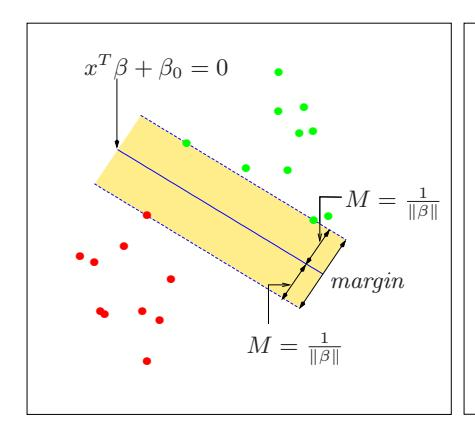

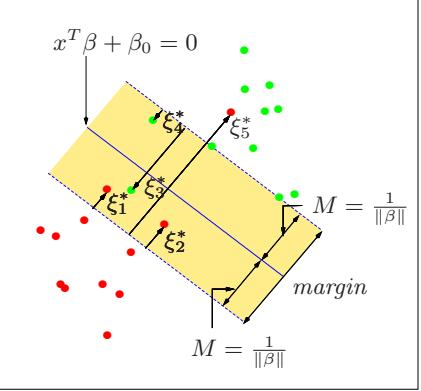

**FIGURE 12.1.** Support vector classifiers. The left panel shows the separable case. The decision boundary is the solid line, while broken lines bound the shaded maximal margin of width  $2M = 2/\|\beta\|$ . The right panel shows the nonseparable (overlap) case. The points labeled  $\xi_j^*$  are on the wrong side of their margin by an amount  $\xi_j^* = M\xi_j$ ; points on the correct side have  $\xi_j^* = 0$ . The margin is maximized subject to a total budget  $\sum \xi_i \leq \text{constant}$ . Hence  $\sum \xi_j^*$  is the total distance of points on the wrong side of their margin.

Our training data consists of N pairs  $(x_1, y_1), (x_2, y_2), \dots, (x_N, y_N)$ , with  $x_i \in \mathbb{R}^p$  and  $y_i \in \{-1, 1\}$ . Define a hyperplane by

$${x: f(x) = x^T \beta + \beta_0 = 0},$$
 (12.1)

where  $\beta$  is a unit vector:  $\|\beta\| = 1$ . A classification rule induced by f(x) is

$$G(x) = \operatorname{sign}[x^T \beta + \beta_0]. \tag{12.2}$$

The geometry of hyperplanes is reviewed in Section 4.5, where we show that f(x) in (12.1) gives the signed distance from a point x to the hyperplane  $f(x) = x^T \beta + \beta_0 = 0$ . Since the classes are separable, we can find a function  $f(x) = x^T \beta + \beta_0$  with  $y_i f(x_i) > 0$   $\forall i$ . Hence we are able to find the hyperplane that creates the biggest margin between the training points for class 1 and -1 (see Figure 12.1). The optimization problem

$$\max_{\beta,\beta_0,\|\beta\|=1} M$$
subject to  $y_i(x_i^T \beta + \beta_0) > M, i = 1, \dots, N,$ 

$$(12.3)$$

captures this concept. The band in the figure is M units away from the hyperplane on either side, and hence 2M units wide. It is called the *margin*.

We showed that this problem can be more conveniently rephrased as

$$\min_{\beta,\beta_0} \|\beta\|$$
subject to  $y_i(x_i^T \beta + \beta_0) \ge 1, \ i = 1, \dots, N,$  (12.4)

where we have dropped the norm constraint on  $\beta$ . Note that  $M = 1/\|\beta\|$ . Expression (12.4) is the usual way of writing the support vector criterion for separated data. This is a convex optimization problem (quadratic criterion, linear inequality constraints), and the solution is characterized in Section 4.5.2.

Suppose now that the classes overlap in feature space. One way to deal with the overlap is to still maximize M, but allow for some points to be on the wrong side of the margin. Define the slack variables  $\xi = (\xi_1, \xi_2, \dots, \xi_N)$ . There are two natural ways to modify the constraint in (12.3):

$$y_i(x_i^T \beta + \beta_0) \geq M - \xi_i,$$
or
$$y_i(x_i^T \beta + \beta_0) \geq M(1 - \xi_i),$$

$$(12.5)$$

$$y_i(x_i^T \beta + \beta_0) \ge M(1 - \xi_i), \tag{12.6}$$

 $\forall i, \ \xi_i \geq 0, \ \sum_{i=1}^N \xi_i \leq \text{constant.}$  The two choices lead to different solutions. The first choice seems more natural, since it measures overlap in actual distance from the margin; the second choice measures the overlap in relative distance, which changes with the width of the margin M. However, the first choice results in a nonconvex optimization problem, while the second is convex; thus (12.6) leads to the "standard" support vector classifier, which we use from here on.

Here is the idea of the formulation. The value  $\xi_i$  in the constraint  $y_i(x_i^T\beta +$  $\beta_0$ )  $\geq M(1-\xi_i)$  is the proportional amount by which the prediction  $f(x_i) = x_i^T \beta + \beta_0$  is on the wrong side of its margin. Hence by bounding the sum  $\sum \xi_i$ , we bound the total proportional amount by which predictions fall on the wrong side of their margin. Misclassifications occur when  $\xi_i > 1$ , so bounding  $\sum \xi_i$  at a value K say, bounds the total number of training misclassifications at K.

As in (4.48) in Section 4.5.2, we can drop the norm constraint on  $\beta$ , define  $M = 1/\|\beta\|$ , and write (12.4) in the equivalent form

$$\min \|\beta\| \quad \text{subject to} \begin{cases} y_i(x_i^T \beta + \beta_0) \ge 1 - \xi_i \,\forall i, \\ \xi_i \ge 0, \, \sum \xi_i \le \text{constant.} \end{cases}$$
 (12.7)

This is the usual way the support vector classifier is defined for the nonseparable case. However we find confusing the presence of the fixed scale "1" in the constraint  $y_i(x_i^T\beta + \beta_0) \ge 1 - \xi_i$ , and prefer to start with (12.6). The right panel of Figure 12.1 illustrates this overlapping case.

By the nature of the criterion (12.7), we see that points well inside their class boundary do not play a big role in shaping the boundary. This seems like an attractive property, and one that differentiates it from linear discriminant analysis (Section 4.3). In LDA, the decision boundary is determined by the covariance of the class distributions and the positions of the class centroids. We will see in Section 12.3.3 that logistic regression is more similar to the support vector classifier in this regard.

# 12.2.1 Computing the Support Vector Classifier

The problem (12.7) is quadratic with linear inequality constraints, hence it is a convex optimization problem. We describe a quadratic programming solution using Lagrange multipliers. Computationally it is convenient to re-express (12.7) in the equivalent form

$$\min_{\beta,\beta_0} \frac{1}{2} \|\beta\|^2 + C \sum_{i=1}^{N} \xi_i 
\text{subject to } \xi_i > 0, \ y_i(x_i^T \beta + \beta_0) > 1 - \xi_i \ \forall i,$$
(12.8)

where the "cost" parameter C replaces the constant in (12.7); the separable case corresponds to  $C = \infty$ .

The Lagrange (primal) function is

$$L_P = \frac{1}{2} \|\beta\|^2 + C \sum_{i=1}^{N} \xi_i - \sum_{i=1}^{N} \alpha_i [y_i(x_i^T \beta + \beta_0) - (1 - \xi_i)] - \sum_{i=1}^{N} \mu_i \xi_i, \quad (12.9)$$

which we minimize w.r.t  $\beta$ ,  $\beta_0$  and  $\xi_i$ . Setting the respective derivatives to zero, we get

$$\beta = \sum_{i=1}^{N} \alpha_i y_i x_i, \qquad (12.10)$$

$$0 = \sum_{i=1}^{N} \alpha_i y_i, \tag{12.11}$$

$$\alpha_i = C - \mu_i, \ \forall i, \tag{12.12}$$

as well as the positivity constraints  $\alpha_i$ ,  $\mu_i$ ,  $\xi_i \geq 0 \ \forall i$ . By substituting (12.10)–(12.12) into (12.9), we obtain the Lagrangian (Wolfe) dual objective function

$$L_D = \sum_{i=1}^{N} \alpha_i - \frac{1}{2} \sum_{i=1}^{N} \sum_{i'=1}^{N} \alpha_i \alpha_{i'} y_i y_{i'} x_i^T x_{i'}, \qquad (12.13)$$

which gives a lower bound on the objective function (12.8) for any feasible point. We maximize  $L_D$  subject to  $0 \le \alpha_i \le C$  and  $\sum_{i=1}^N \alpha_i y_i = 0$ . In addition to (12.10)–(12.12), the Karush–Kuhn–Tucker conditions include the constraints

$$\alpha_i[y_i(x_i^T\beta + \beta_0) - (1 - \xi_i)] = 0,$$
 (12.14)

$$\mu_i \xi_i = 0, \qquad (12.15)$$

$$y_i(x_i^T \beta + \beta_0) - (1 - \xi_i) \ge 0,$$
 (12.16)

for i = 1, ..., N. Together these equations (12.10)–(12.16) uniquely characterize the solution to the primal and dual problem.

From (12.10) we see that the solution for  $\beta$  has the form

$$\hat{\beta} = \sum_{i=1}^{N} \hat{\alpha}_i y_i x_i, \tag{12.17}$$

with nonzero coefficients  $\hat{\alpha}_i$  only for those observations i for which the constraints in (12.16) are exactly met (due to (12.14)). These observations are called the *support vectors*, since  $\hat{\beta}$  is represented in terms of them alone. Among these support points, some will lie on the edge of the margin  $(\hat{\xi}_i = 0)$ , and hence from (12.15) and (12.12) will be characterized by  $0 < \hat{\alpha}_i < C$ ; the remainder  $(\hat{\xi}_i > 0)$  have  $\hat{\alpha}_i = C$ . From (12.14) we can see that any of these margin points  $(0 < \hat{\alpha}_i, \hat{\xi}_i = 0)$  can be used to solve for  $\beta_0$ , and we typically use an average of all the solutions for numerical stability.

Maximizing the dual (12.13) is a simpler convex quadratic programming problem than the primal (12.9), and can be solved with standard techniques (Murray et al., 1981, for example).

Given the solutions  $\hat{\beta}_0$  and  $\hat{\beta}$ , the decision function can be written as

$$\hat{G}(x) = \operatorname{sign}[\hat{f}(x)] 
= \operatorname{sign}[x^T \hat{\beta} + \hat{\beta}_0].$$
(12.18)

The tuning parameter of this procedure is the cost parameter C.

#### 12.2.2 Mixture Example (Continued)

Figure 12.2 shows the support vector boundary for the mixture example of Figure 2.5 on page 21, with two overlapping classes, for two different values of the cost parameter C. The classifiers are rather similar in their performance. Points on the wrong side of the boundary are support vectors. In addition, points on the correct side of the boundary but close to it (in the margin), are also support vectors. The margin is larger for C=0.01 than it is for C=10,000. Hence larger values of C focus attention more on (correctly classified) points near the decision boundary, while smaller values involve data further away. Either way, misclassified points are given weight, no matter how far away. In this example the procedure is not very sensitive to choices of C, because of the rigidity of a linear boundary.

The optimal value for C can be estimated by cross-validation, as discussed in Chapter 7. Interestingly, the leave-one-out cross-validation error can be bounded above by the proportion of support points in the data. The reason is that leaving out an observation that is not a support vector will not change the solution. Hence these observations, being classified correctly by the original boundary, will be classified correctly in the cross-validation process. However this bound tends to be too high, and not generally useful for choosing C (62% and 85%, respectively, in our examples).

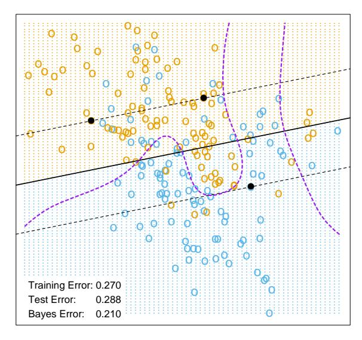

C = 10000

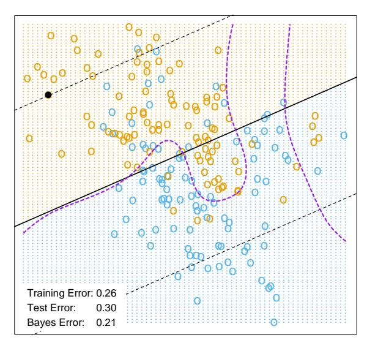

C = 0.01

**FIGURE 12.2.** The linear support vector boundary for the mixture data example with two overlapping classes, for two different values of C. The broken lines indicate the margins, where  $f(x) = \pm 1$ . The support points  $(\alpha_i > 0)$  are all the points on the wrong side of their margin. The black solid dots are those support points falling exactly on the margin  $(\xi_i = 0, \alpha_i > 0)$ . In the upper panel 62% of the observations are support points, while in the lower panel 85% are. The broken purple curve in the background is the Bayes decision boundary.

# 12.3 Support Vector Machines and Kernels

The support vector classifier described so far finds linear boundaries in the input feature space. As with other linear methods, we can make the procedure more flexible by enlarging the feature space using basis expansions such as polynomials or splines (Chapter 5). Generally linear boundaries in the enlarged space achieve better training-class separation, and translate to nonlinear boundaries in the original space. Once the basis functions  $h_m(x)$ , m = 1, ..., M are selected, the procedure is the same as before. We fit the SV classifier using input features  $h(x_i) = (h_1(x_i), h_2(x_i), ..., h_M(x_i))$ , i = 1, ..., N, and produce the (nonlinear) function  $\hat{f}(x) = h(x)^T \hat{\beta} + \hat{\beta}_0$ . The classifier is  $\hat{G}(x) = \text{sign}(\hat{f}(x))$  as before.

The support vector machine classifier is an extension of this idea, where the dimension of the enlarged space is allowed to get very large, infinite in some cases. It might seem that the computations would become prohibitive. It would also seem that with sufficient basis functions, the data would be separable, and overfitting would occur. We first show how the SVM technology deals with these issues. We then see that in fact the SVM classifier is solving a function-fitting problem using a particular criterion and form of regularization, and is part of a much bigger class of problems that includes the smoothing splines of Chapter 5. The reader may wish to consult Section 5.8, which provides background material and overlaps somewhat with the next two sections.

#### 12.3.1 Computing the SVM for Classification

We can represent the optimization problem (12.9) and its solution in a special way that only involves the input features via inner products. We do this directly for the transformed feature vectors  $h(x_i)$ . We then see that for particular choices of h, these inner products can be computed very cheaply.

The Lagrange dual function (12.13) has the form

$$L_D = \sum_{i=1}^{N} \alpha_i - \frac{1}{2} \sum_{i=1}^{N} \sum_{i'=1}^{N} \alpha_i \alpha_{i'} y_i y_{i'} \langle h(x_i), h(x_{i'}) \rangle.$$
 (12.19)

From (12.10) we see that the solution function f(x) can be written

$$f(x) = h(x)^T \beta + \beta_0$$
  
= 
$$\sum_{i=1}^{N} \alpha_i y_i \langle h(x), h(x_i) \rangle + \beta_0.$$
 (12.20)

As before, given  $\alpha_i$ ,  $\beta_0$  can be determined by solving  $y_i f(x_i) = 1$  in (12.20) for any (or all)  $x_i$  for which  $0 < \alpha_i < C$ .

So both (12.19) and (12.20) involve h(x) only through inner products. In fact, we need not specify the transformation h(x) at all, but require only knowledge of the kernel function

$$K(x, x') = \langle h(x), h(x') \rangle \tag{12.21}$$

that computes inner products in the transformed space. K should be a symmetric positive (semi-) definite function; see Section 5.8.1.

Three popular choices for K in the SVM literature are

dth-Degree polynomial: 
$$K(x, x') = (1 + \langle x, x' \rangle)^d$$
,  
Radial basis:  $K(x, x') = \exp(-\gamma ||x - x'||^2)$ , (12.22)  
Neural network:  $K(x, x') = \tanh(\kappa_1 \langle x, x' \rangle + \kappa_2)$ .

Consider for example a feature space with two inputs  $X_1$  and  $X_2$ , and a polynomial kernel of degree 2. Then

$$K(X, X') = (1 + \langle X, X' \rangle)^{2}$$

$$= (1 + X_{1}X'_{1} + X_{2}X'_{2})^{2}$$

$$= 1 + 2X_{1}X'_{1} + 2X_{2}X'_{2} + (X_{1}X'_{1})^{2} + (X_{2}X'_{2})^{2} + 2X_{1}X'_{1}X_{2}X'_{2}.$$
(12.23)

Then M = 6, and if we choose  $h_1(X) = 1$ ,  $h_2(X) = \sqrt{2}X_1$ ,  $h_3(X) = \sqrt{2}X_2$ ,  $h_4(X) = X_1^2$ ,  $h_5(X) = X_2^2$ , and  $h_6(X) = \sqrt{2}X_1X_2$ , then  $K(X, X') = \langle h(X), h(X') \rangle$ . From (12.20) we see that the solution can be written

$$\hat{f}(x) = \sum_{i=1}^{N} \hat{\alpha}_i y_i K(x, x_i) + \hat{\beta}_0.$$
 (12.24)

The role of the parameter C is clearer in an enlarged feature space, since perfect separation is often achievable there. A large value of C will discourage any positive  $\xi_i$ , and lead to an overfit wiggly boundary in the original feature space; a small value of C will encourage a small value of  $\|\beta\|$ , which in turn causes f(x) and hence the boundary to be smoother. Figure 12.3 show two nonlinear support vector machines applied to the mixture example of Chapter 2. The regularization parameter was chosen in both cases to achieve good test error. The radial basis kernel produces a boundary quite similar to the Bayes optimal boundary for this example; compare Figure 2.5.

In the early literature on support vectors, there were claims that the kernel property of the support vector machine is unique to it and allows one to finesse the curse of dimensionality. Neither of these claims is true, and we go into both of these issues in the next three subsections.

#### SVM - Degree-4 Polynomial in Feature Space

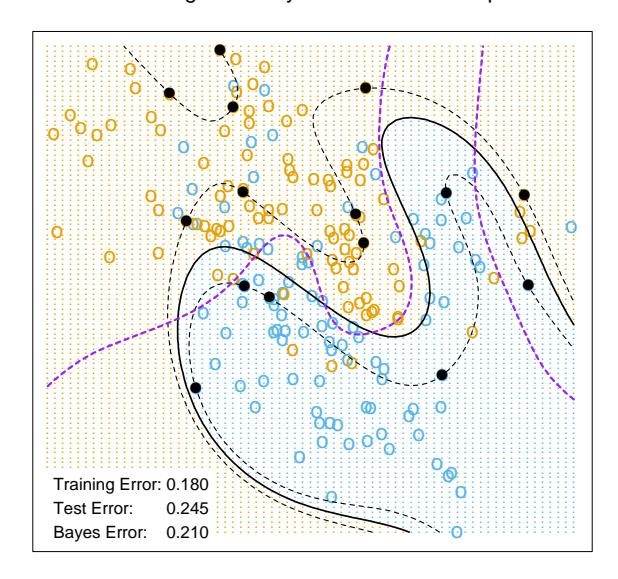

SVM - Radial Kernel in Feature Space

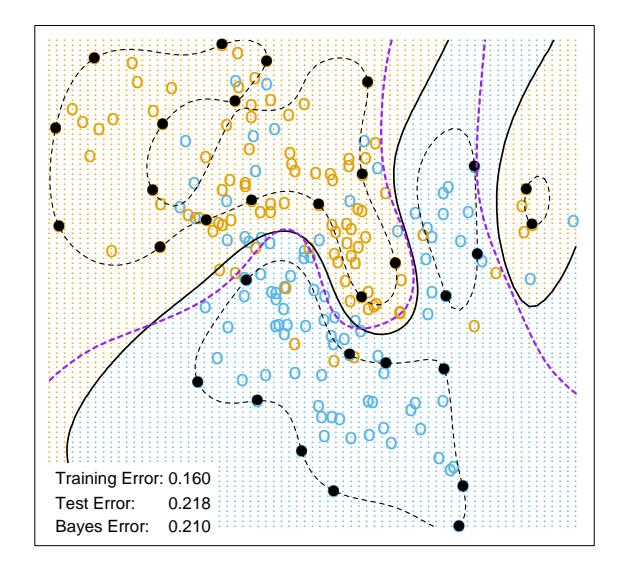

**FIGURE 12.3.** Two nonlinear SVMs for the mixture data. The upper plot uses a 4th degree polynomial kernel, the lower a radial basis kernel (with  $\gamma=1$ ). In each case C was tuned to approximately achieve the best test error performance, and C=1 worked well in both cases. The radial basis kernel performs the best (close to Bayes optimal), as might be expected given the data arise from mixtures of Gaussians. The broken purple curve in the background is the Bayes decision boundary.

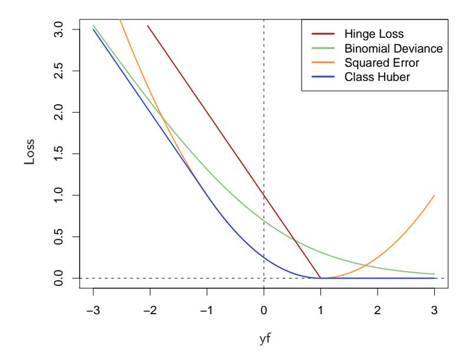

FIGURE 12.4. The support vector loss function (hinge loss), compared to the negative log-likelihood loss (binomial deviance) for logistic regression, squared-error loss, and a "Huberized" version of the squared hinge loss. All are shown as a function of yf rather than f, because of the symmetry between the y = +1 and y = −1 case. The deviance and Huber have the same asymptotes as the SVM loss, but are rounded in the interior. All are scaled to have the limiting left-tail slope of −1.

#### 12.3.2 The SVM as a Penalization Method

With f(x) = h(x) $^{T}$ $\beta$ + $\beta$0, consider the optimization problem

$$\min_{\beta_0, \beta} \sum_{i=1}^{N} [1 - y_i f(x_i)]_+ + \frac{\lambda}{2} \|\beta\|^2$$
 (12.25)

where the subscript "+" indicates positive part. This has the form loss + penalty, which is a familiar paradigm in function estimation. It is easy to show (Exercise 12.1) that the solution to (12.25), with $\lambda$ = 1/C, is the same as that for (12.8).

Examination of the "hinge" loss function L(y, f) = [1 − yf]$^{+}$ shows that it is reasonable for two-class classification, when compared to other more traditional loss functions. Figure 12.4 compares it to the log-likelihood loss for logistic regression, as well as squared-error loss and a variant thereof. The (negative) log-likelihood or binomial deviance has similar tails as the SVM loss, giving zero penalty to points well inside their margin, and a

TABLE 12.1. The population minimizers for the different loss functions in Figure 12.4. Logistic regression uses the binomial log-likelihood or deviance. Linear discriminant analysis (Exercise 4.2) uses squared-error loss. The SVM hinge loss estimates the mode of the posterior class probabilities, whereas the others estimate a linear transformation of these probabilities.

| Loss Function                       | L[y, f(x)]                                                        | Minimizing Function                              |
|-------------------------------------|-------------------------------------------------------------------|--------------------------------------------------|
| Binomial Deviance                | −yf(x) log[1 + e ]                                       | Pr(Y = +1 x) f(x) = log Pr(Y = -1 x) |
| SVM Hinge Loss                | [1 − yf(x)]+                                                   | 1 f(x) = sign[Pr(Y = +1 x) ] − 2  |
| Squared Error                    | − f(x)]2 = [1 − yf(x)]2 [y                                  | f(x) = 2Pr(Y = +1 x) − 1                   |
| "Huberised" Square Hinge Loss | −4yf(x), yf(x) < -1 − yf(x)]2 [1 otherwise + | f(x) = 2Pr(Y = +1 x) − 1                   |

linear penalty to points on the wrong side and far away. Squared-error, on the other hand gives a quadratic penalty, and points well inside their own margin have a strong influence on the model as well. The squared hinge loss L(y, f) = [1 − yf] 2 $^{+}$ is like the quadratic, except it is zero for points inside their margin. It still rises quadratically in the left tail, and will be less robust than hinge or deviance to misclassified observations. Recently Rosset and Zhu (2007) proposed a "Huberized" version of the squared hinge loss, which converts smoothly to a linear loss at yf = −1.

We can characterize these loss functions in terms of what they are estimating at the population level. We consider minimizing EL(Y, f(X)). Table 12.1 summarizes the results. Whereas the hinge loss estimates the classifier G(x) itself, all the others estimate a transformation of the class posterior probabilities. The "Huberized" square hinge loss shares attractive properties of logistic regression (smooth loss function, estimates probabilities), as well as the SVM hinge loss (support points).

Formulation (12.25) casts the SVM as a regularized function estimation problem, where the coefficients of the linear expansion f(x) = $\beta$$^{0}$ +h(x) $^{T}$ $\beta$ are shrunk toward zero (excluding the constant). If h(x) represents a hierarchical basis having some ordered structure (such as ordered in roughness), then the uniform shrinkage makes more sense if the rougher elements  $h_j$  in the vector h have smaller norm.

All the loss-functions in Table 12.1 except squared-error are so called "margin maximizing loss-functions" (Rosset et al., 2004b). This means that if the data are separable, then the limit of  $\hat{\beta}_{\lambda}$  in (12.25) as  $\lambda \to 0$  defines the optimal separating hyperplane$^{1}$.

# 12.3.3 Function Estimation and Reproducing Kernels

Here we describe SVMs in terms of function estimation in reproducing kernel Hilbert spaces, where the kernel property abounds. This material is discussed in some detail in Section 5.8. This provides another view of the support vector classifier, and helps to clarify how it works.

Suppose the basis h arises from the (possibly finite) eigen-expansion of a positive definite kernel K,

$$K(x,x') = \sum_{m=1}^{\infty} \phi_m(x)\phi_m(x')\delta_m$$
 (12.26)

and  $h_m(x) = \sqrt{\delta_m}\phi_m(x)$ . Then with  $\theta_m = \sqrt{\delta_m}\beta_m$ , we can write (12.25) as

$$\min_{\beta_0, \ \theta} \sum_{i=1}^{N} \left[ 1 - y_i (\beta_0 + \sum_{m=1}^{\infty} \theta_m \phi_m(x_i)) \right]_{+} + \frac{\lambda}{2} \sum_{m=1}^{\infty} \frac{\theta_m^2}{\delta_m}.$$
 (12.27)

Now (12.27) is identical in form to (5.49) on page 169 in Section 5.8, and the theory of reproducing kernel Hilbert spaces described there guarantees a finite-dimensional solution of the form

$$f(x) = \beta_0 + \sum_{i=1}^{N} \alpha_i K(x, x_i).$$
 (12.28)

In particular we see there an equivalent version of the optimization criterion (12.19) [Equation (5.67) in Section 5.8.2; see also Wahba et al. (2000)],

$$\min_{\beta_0,\alpha} \sum_{i=1}^{N} (1 - y_i f(x_i))_+ + \frac{\lambda}{2} \alpha^T \mathbf{K} \alpha, \qquad (12.29)$$

where **K** is the  $N \times N$  matrix of kernel evaluations for all pairs of training features (Exercise 12.2).

These models are quite general, and include, for example, the entire family of smoothing splines, additive and interaction spline models discussed

$ ^{1} $For logistic regression with separable data,  $\hat{\beta}_{\lambda}$  diverges, but  $\hat{\beta}_{\lambda}/\|\hat{\beta}_{\lambda}\|$  converges to the optimal separating direction.

in Chapters 5 and 9, and in more detail in Wahba (1990) and Hastie and Tibshirani (1990). They can be expressed more generally as

$$\min_{f \in \mathcal{H}} \sum_{i=1}^{N} [1 - y_i f(x_i)]_+ + \lambda J(f), \tag{12.30}$$

where  $\mathcal{H}$  is the structured space of functions, and J(f) an appropriate regularizer on that space. For example, suppose  $\mathcal{H}$  is the space of additive functions  $f(x) = \sum_{j=1}^p f_j(x_j)$ , and  $J(f) = \sum_j \int \{f''_j(x_j)\}^2 dx_j$ . Then the solution to (12.30) is an additive cubic spline, and has a kernel representation (12.28) with  $K(x,x') = \sum_{j=1}^p K_j(x_j,x'_j)$ . Each of the  $K_j$  is the kernel appropriate for the univariate smoothing spline in  $x_j$  (Wahba, 1990).

Conversely this discussion also shows that, for example, any of the kernels described in (12.22) above can be used with any convex loss function, and will also lead to a finite-dimensional representation of the form (12.28). Figure 12.5 uses the same kernel functions as in Figure 12.3, except using the binomial log-likelihood as a loss function$^{2}$. The fitted function is hence an estimate of the log-odds,

$$\hat{f}(x) = \log \frac{\hat{\Pr}(Y = +1|x)}{\hat{\Pr}(Y = -1|x)} 
= \hat{\beta}_0 + \sum_{i=1}^{N} \hat{\alpha}_i K(x, x_i),$$
(12.31)

or conversely we get an estimate of the class probabilities

$$\hat{\Pr}(Y = +1|x) = \frac{1}{1 + e^{-\hat{\beta}_0 - \sum_{i=1}^{N} \hat{\alpha}_i K(x, x_i)}}.$$
 (12.32)

The fitted models are quite similar in shape and performance. Examples and more details are given in Section 5.8.

It does happen that for SVMs, a sizable fraction of the N values of  $\alpha_i$  can be zero (the nonsupport points). In the two examples in Figure 12.3, these fractions are 42% and 45%, respectively. This is a consequence of the piecewise linear nature of the first part of the criterion (12.25). The lower the class overlap (on the training data), the greater this fraction will be. Reducing  $\lambda$  will generally reduce the overlap (allowing a more flexible f). A small number of support points means that  $\hat{f}(x)$  can be evaluated more quickly, which is important at lookup time. Of course, reducing the overlap too much can lead to poor generalization.

$ ^{2} $ Ji Zhu assisted in the preparation of these examples.

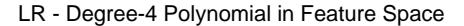

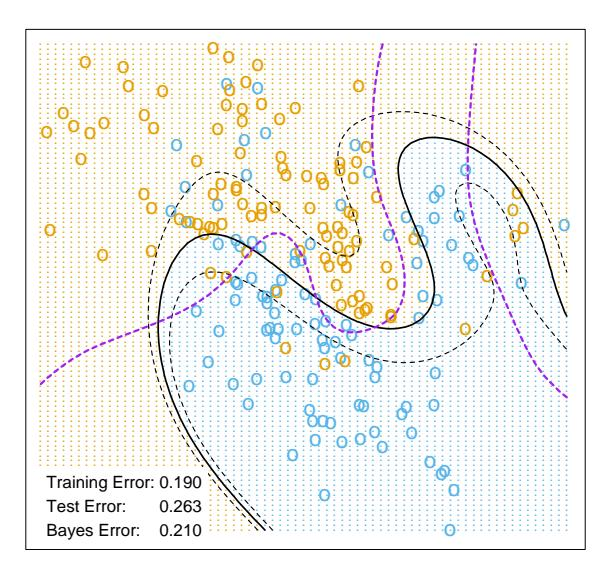

LR - Radial Kernel in Feature Space

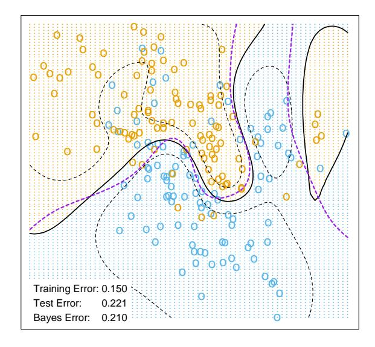

**FIGURE 12.5.** The logistic regression versions of the SVM models in Figure 12.3, using the identical kernels and hence penalties, but the log-likelihood loss instead of the SVM loss function. The two broken contours correspond to posterior probabilities of 0.75 and 0.25 for the +1 class (or vice versa). The broken purple curve in the background is the Bayes decision boundary.

|   |               | Test Er           | ror (SE)           |
|---|---------------|-------------------|--------------------|
|   | Method        | No Noise Features | Six Noise Features |
| 1 | SV Classifier | 0.450 (0.003)     | 0.472 (0.003)      |
| 2 | SVM/poly 2    | $0.078 \ (0.003)$ | 0.152 (0.004)      |
| 3 | SVM/poly 5    | 0.180 (0.004)     | 0.370 (0.004)      |
| 4 | SVM/poly 10   | $0.230 \ (0.003)$ | 0.434 (0.002)      |
| 5 | BRUTO         | 0.084 (0.003)     | $0.090\ (0.003)$   |
| 6 | MARS          | $0.156 \ (0.004)$ | $0.173\ (0.005)$   |
|   | Baves         | 0.029             | 0.029              |

**TABLE 12.2.** Skin of the orange: Shown are mean (standard error of the mean) of the test error over 50 simulations. BRUTO fits an additive spline model adaptively, while MARS fits a low-order interaction model adaptively.

#### 12.3.4 SVMs and the Curse of Dimensionality

In this section, we address the question of whether SVMs have some edge on the curse of dimensionality. Notice that in expression (12.23) we are not allowed a fully general inner product in the space of powers and products. For example, all terms of the form  $2X_jX_j'$  are given equal weight, and the kernel cannot adapt itself to concentrate on subspaces. If the number of features p were large, but the class separation occurred only in the linear subspace spanned by say  $X_1$  and  $X_2$ , this kernel would not easily find the structure and would suffer from having many dimensions to search over. One would have to build knowledge about the subspace into the kernel; that is, tell it to ignore all but the first two inputs. If such knowledge were available a priori, much of statistical learning would be made much easier. A major goal of adaptive methods is to discover such structure.

We support these statements with an illustrative example. We generated 100 observations in each of two classes. The first class has four standard normal independent features  $X_1, X_2, X_3, X_4$ . The second class also has four standard normal independent features, but conditioned on  $9 \le \sum X_j^2 \le 16$ . This is a relatively easy problem. As a second harder problem, we augmented the features with an additional six standard Gaussian noise features. Hence the second class almost completely surrounds the first, like the skin surrounding the orange, in a four-dimensional subspace. The Bayes error rate for this problem is 0.029 (irrespective of dimension). We generated 1000 test observations to compare different procedures. The average test errors over 50 simulations, with and without noise features, are shown in Table 12.2.

Line 1 uses the support vector classifier in the original feature space. Lines 2-4 refer to the support vector machine with a 2-, 5- and 10-dimensional polynomial kernel. For all support vector procedures, we chose the cost parameter C to minimize the test error, to be as fair as possible to the

# 1e−01 1e+01 1e+03 0.20 0.25 0.30 0.35 1e−01 1e+01 1e+03 1e−01 1e+01 1e+03 1e−01 1e+01 1e+03 Test Error Test Error Curves − SVM with Radial Kernel γ = 5 γ = 1 γ = 0.5 γ = 0.1

FIGURE 12.6. Test-error curves as a function of the cost parameter C for the radial-kernel SVM classifier on the mixture data. At the top of each plot is the scale parameter $^{γ}$ for the radial kernel: $^{K}$γ(x, y) = exp (−γ||$^{x}$ $^{−}$ $^{y}$||$^{2}$ ). The optimal value for C depends quite strongly on the scale of the kernel. The Bayes error rate is indicated by the broken horizontal lines.

C

method. Line 5 fits an additive spline model to the (−1, +1) response by least squares, using the BRUTO algorithm for additive models, described in Hastie and Tibshirani (1990). Line 6 uses MARS (multivariate adaptive regression splines) allowing interaction of all orders, as described in Chapter 9; as such it is comparable with the SVM/poly 10. Both BRUTO and MARS have the ability to ignore redundant variables. Test error was not used to choose the smoothing parameters in either of lines 5 or 6.

In the original feature space, a hyperplane cannot separate the classes, and the support vector classifier (line 1) does poorly. The polynomial support vector machine makes a substantial improvement in test error rate, but is adversely affected by the six noise features. It is also very sensitive to the choice of kernel: the second degree polynomial kernel (line 2) does best, since the true decision boundary is a second-degree polynomial. However, higher-degree polynomial kernels (lines 3 and 4) do much worse. BRUTO performs well, since the boundary is additive. BRUTO and MARS adapt well: their performance does not deteriorate much in the presence of noise.

# 12.3.5 A Path Algorithm for the SVM Classifier

The regularization parameter for the SVM classifier is the cost parameter C, or its inverse $\lambda$ in (12.25). Common usage is to set C high, leading often to somewhat overfit classifiers.

Figure 12.6 shows the test error on the mixture data as a function of C, using different radial-kernel parameters γ. When γ = 5 (narrow peaked kernels), the heaviest regularization (small C) is called for. With γ = 1

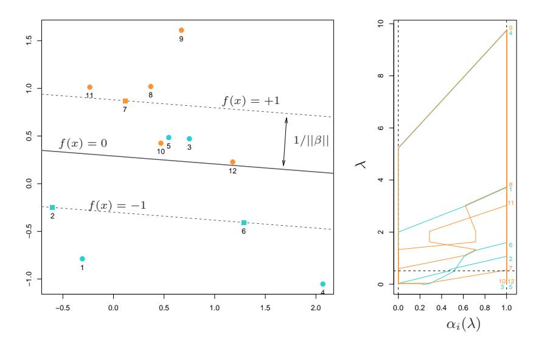

**FIGURE 12.7.** A simple example illustrates the SVM path algorithm. (left panel:) This plot illustrates the state of the model at  $\lambda = 1/2$ . The "+1" points are orange, the "-1" blue. The width of the soft margin is  $2/||\beta|| = 2 \times 0.587$ . Two blue points  $\{3,5\}$  are misclassified, while the two orange points  $\{10,12\}$  are correctly classified, but on the wrong side of their margin f(x) = +1; each of these has  $y_i f(x_i) < 1$ . The three square shaped points  $\{2,6,7\}$  are exactly on their margins. (right panel:) This plot shows the piecewise linear profiles  $\alpha_i(\lambda)$ . The horizontal broken line at  $\lambda = 1/2$  indicates the state of the  $\alpha_i$  for the model in the left plot.

(the value used in Figure 12.3), an intermediate value of C is required. Clearly in situations such as these, we need to determine a good choice for C, perhaps by cross-validation. Here we describe a path algorithm (in the spirit of Section 3.8) for efficiently fitting the entire sequence of SVM models obtained by varying C.

It is convenient to use the loss+penalty formulation (12.25), along with Figure 12.4. This leads to a solution for  $\beta$  at a given value of  $\lambda$ :

$$\beta_{\lambda} = \frac{1}{\lambda} \sum_{i=1}^{N} \alpha_i y_i x_i. \tag{12.33}$$

The  $\alpha_i$  are again Lagrange multipliers, but in this case they all lie in [0, 1]. Figure 12.7 illustrates the setup. It can be shown that the KKT optimality conditions imply that the labeled points  $(x_i, y_i)$  fall into three distinct groups:

- Observations correctly classified and outside their margins. They have  $y_i f(x_i) > 1$ , and Lagrange multipliers  $\alpha_i = 0$ . Examples are the orange points 8, 9 and 11, and the blue points 1 and 4.
- Observations sitting on their margins with  $y_i f(x_i) = 1$ , with Lagrange multipliers  $\alpha_i \in [0, 1]$ . Examples are the orange 7 and the blue 2 and 6.
- Observations inside their margins have  $y_i f(x_i) < 1$ , with  $\alpha_i = 1$ . Examples are the blue 3 and 5, and the orange 10 and 12.

The idea for the path algorithm is as follows. Initially  $\lambda$  is large, the margin  $1/||\beta_{\lambda}||$  is wide, and all points are inside their margin and have  $\alpha_i = 1$ . As  $\lambda$  decreases,  $1/||\beta_{\lambda}||$  decreases, and the margin gets narrower. Some points will move from inside their margins to outside their margins, and their  $\alpha_i$  will change from 1 to 0. By continuity of the  $\alpha_i(\lambda)$ , these points will linger on the margin during this transition. From (12.33) we see that the points with  $\alpha_i = 1$  make fixed contributions to  $\beta(\lambda)$ , and those with  $\alpha_i = 0$  make no contribution. So all that changes as  $\lambda$  decreases are the  $\alpha_i \in [0,1]$  of those (small number) of points on the margin. Since all these points have  $y_i f(x_i) = 1$ , this results in a small set of linear equations that prescribe how  $\alpha_i(\lambda)$  and hence  $\beta_{\lambda}$  changes during these transitions. This results in piecewise linear paths for each of the  $\alpha_i(\lambda)$ . The breaks occur when points cross the margin. Figure 12.7 (right panel) shows the  $\alpha_i(\lambda)$  profiles for the small example in the left panel.

Although we have described this for linear SVMs, exactly the same idea works for nonlinear models, in which (12.33) is replaced by

$$f_{\lambda}(x) = \frac{1}{\lambda} \sum_{i=1}^{N} \alpha_i y_i K(x, x_i). \tag{12.34}$$

Details can be found in Hastie et al. (2004). An R package sympath is available on CRAN for fitting these models.

#### 12.3.6 Support Vector Machines for Regression

In this section we show how SVMs can be adapted for regression with a quantitative response, in ways that inherit some of the properties of the SVM classifier. We first discuss the linear regression model

$$f(x) = x^T \beta + \beta_0, \tag{12.35}$$

and then handle nonlinear generalizations. To estimate  $\beta$ , we consider minimization of

$$H(\beta, \beta_0) = \sum_{i=1}^{N} V(y_i - f(x_i)) + \frac{\lambda}{2} ||\beta||^2,$$
 (12.36)

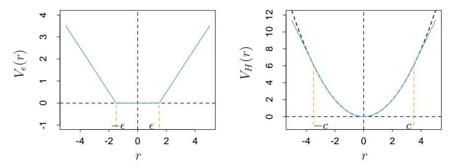

**FIGURE 12.8.** The left panel shows the  $\epsilon$ -insensitive error function used by the support vector regression machine. The right panel shows the error function used in Huber's robust regression (blue curve). Beyond |c|, the function changes from quadratic to linear.

where

$$V_{\epsilon}(r) = \begin{cases} 0 & \text{if } |r| < \epsilon, \\ |r| - \epsilon, & \text{otherwise.} \end{cases}$$
 (12.37)

This is an " $\epsilon$ -insensitive" error measure, ignoring errors of size less than  $\epsilon$  (left panel of Figure 12.8). There is a rough analogy with the support vector classification setup, where points on the correct side of the decision boundary and far away from it, are ignored in the optimization. In regression, these "low error" points are the ones with small residuals.

It is interesting to contrast this with error measures used in robust regression in statistics. The most popular, due to Huber (1964), has the form

$$V_H(r) = \begin{cases} r^2/2 & \text{if } |r| \le c, \\ c|r| - c^2/2, & |r| > c, \end{cases}$$
 (12.38)

shown in the right panel of Figure 12.8. This function reduces from quadratic to linear the contributions of observations with absolute residual greater than a prechosen constant c. This makes the fitting less sensitive to outliers. The support vector error measure (12.37) also has linear tails (beyond  $\epsilon$ ), but in addition it flattens the contributions of those cases with small residuals.

If  $\hat{\beta}$ ,  $\hat{\beta}_0$  are the minimizers of H, the solution function can be shown to have the form

$$\hat{\beta} = \sum_{i=1}^{N} (\hat{\alpha}_i^* - \hat{\alpha}_i) x_i, \qquad (12.39)$$

$$\hat{f}(x) = \sum_{i=1}^{N} (\hat{\alpha}_i^* - \hat{\alpha}_i) \langle x, x_i \rangle + \beta_0, \qquad (12.40)$$

where  $\hat{\alpha}_i, \hat{\alpha}_i^*$  are positive and solve the quadratic programming problem

$$\min_{\alpha_i,\alpha_i^*} \epsilon \sum_{i=1}^N (\alpha_i^* + \alpha_i) - \sum_{i=1}^N y_i (\alpha_i^* - \alpha_i) + \frac{1}{2} \sum_{i,i'=1}^N (\alpha_i^* - \alpha_i) (\alpha_{i'}^* - \alpha_{i'}) \langle x_i, x_{i'} \rangle$$

subject to the constraints

$$0 \le \alpha_i, \ \alpha_i^* \le 1/\lambda,$$

$$\sum_{i=1}^{N} (\alpha_i^* - \alpha_i) = 0,$$

$$\alpha_i \alpha_i^* = 0.$$
(12.41)

Due to the nature of these constraints, typically only a subset of the solution values  $(\hat{\alpha}_i^* - \hat{\alpha}_i)$  are nonzero, and the associated data values are called the support vectors. As was the case in the classification setting, the solution depends on the input values only through the inner products  $\langle x_i, x_{i'} \rangle$ . Thus we can generalize the methods to richer spaces by defining an appropriate inner product, for example, one of those defined in (12.22).

Note that there are parameters,  $\epsilon$  and  $\lambda$ , associated with the criterion (12.36). These seem to play different roles.  $\epsilon$  is a parameter of the loss function  $V_{\epsilon}$ , just like c is for  $V_H$ . Note that both  $V_{\epsilon}$  and  $V_H$  depend on the scale of y and hence r. If we scale our response (and hence use  $V_H(r/\sigma)$  and  $V_{\epsilon}(r/\sigma)$  instead), then we might consider using preset values for c and  $\epsilon$  (the value c=1.345 achieves 95% efficiency for the Gaussian). The quantity  $\lambda$  is a more traditional regularization parameter, and can be estimated for example by cross-validation.

#### 12.3.7 Regression and Kernels

As discussed in Section 12.3.3, this kernel property is not unique to support vector machines. Suppose we consider approximation of the regression function in terms of a set of basis functions  $\{h_m(x)\}, m = 1, 2, ..., M$ :

$$f(x) = \sum_{m=1}^{M} \beta_m h_m(x) + \beta_0.$$
 (12.42)

To estimate  $\beta$  and  $\beta_0$  we minimize

$$H(\beta, \beta_0) = \sum_{i=1}^{N} V(y_i - f(x_i)) + \frac{\lambda}{2} \sum_{i=1}^{N} \beta_m^2$$
 (12.43)

for some general error measure V(r). For any choice of V(r), the solution  $\hat{f}(x) = \sum \hat{\beta}_m h_m(x) + \hat{\beta}_0$  has the form

$$\hat{f}(x) = \sum_{i=1}^{N} \hat{a}_i K(x, x_i)$$
(12.44)

with  $K(x,y) = \sum_{m=1}^{M} h_m(x)h_m(y)$ . Notice that this has the same form as both the radial basis function expansion and a regularization estimate, discussed in Chapters 5 and 6.

For concreteness, let's work out the case  $V(r) = r^2$ . Let **H** be the  $N \times M$  basis matrix with imth element  $h_m(x_i)$ , and suppose that M > N is large. For simplicity we assume that  $\beta_0 = 0$ , or that the constant is absorbed in h; see Exercise 12.3 for an alternative.

We estimate  $\beta$  by minimizing the penalized least squares criterion

$$H(\beta) = (\mathbf{y} - \mathbf{H}\beta)^T (\mathbf{y} - \mathbf{H}\beta) + \lambda \|\beta\|^2.$$
 (12.45)

The solution is

$$\hat{\mathbf{y}} = \mathbf{H}\hat{\beta} \tag{12.46}$$

with  $\hat{\beta}$  determined by

$$-\mathbf{H}^{T}(\mathbf{y} - \mathbf{H}\hat{\beta}) + \lambda \hat{\beta} = 0. \tag{12.47}$$

From this it appears that we need to evaluate the  $M \times M$  matrix of inner products in the transformed space. However, we can premultiply by  $\mathbf{H}$  to give

$$\mathbf{H}\hat{\beta} = (\mathbf{H}\mathbf{H}^T + \lambda \mathbf{I})^{-1}\mathbf{H}\mathbf{H}^T\mathbf{y}.$$
 (12.48)

The  $N \times N$  matrix  $\mathbf{H}\mathbf{H}^T$  consists of inner products between pairs of observations i, i'; that is, the evaluation of an inner product kernel  $\{\mathbf{H}\mathbf{H}^T\}_{i,i'} = K(x_i, x_{i'})$ . It is easy to show (12.44) directly in this case, that the predicted values at an arbitrary x satisfy

$$\hat{f}(x) = h(x)^T \hat{\beta}$$

$$= \sum_{i=1}^N \hat{\alpha}_i K(x, x_i), \qquad (12.49)$$

where  $\hat{\alpha} = (\mathbf{H}\mathbf{H}^T + \lambda \mathbf{I})^{-1}\mathbf{y}$ . As in the support vector machine, we need not specify or evaluate the large set of functions  $h_1(x), h_2(x), \dots, h_M(x)$ . Only the inner product kernel  $K(x_i, x_{i'})$  need be evaluated, at the N training points for each i, i' and at points x for predictions there. Careful choice of  $h_m$  (such as the eigenfunctions of particular, easy-to-evaluate kernels K) means, for example, that  $\mathbf{H}\mathbf{H}^T$  can be computed at a cost of  $N^2/2$  evaluations of K, rather than the direct cost  $N^2M$ .

Note, however, that this property depends on the choice of squared norm  $\|\beta\|^2$  in the penalty. It does not hold, for example, for the  $L_1$  norm  $|\beta|$ , which may lead to a superior model.

## 12.3.8 Discussion

The support vector machine can be extended to multiclass problems, essentially by solving many two-class problems. A classifier is built for each pair of classes, and the final classifier is the one that dominates the most (Kressel, 1999; Friedman, 1996; Hastie and Tibshirani, 1998). Alternatively, one could use the multinomial loss function along with a suitable kernel, as in Section 12.3.3. SVMs have applications in many other supervised and unsupervised learning problems. At the time of this writing, empirical evidence suggests that it performs well in many real learning problems.

Finally, we mention the connection of the support vector machine and structural risk minimization (7.9). Suppose the training points (or their basis expansion) are contained in a sphere of radius R, and let G(x) = sign[f(x)] = sign[$\beta$ $^{T}$ x + $\beta$0] as in (12.2). Then one can show that the class of functions {G(x), k$\beta$k $\le$ A} has VC-dimension h satisfying

$$h \le R^2 A^2. \tag{12.50}$$

If f(x) separates the training data, optimally for k$\beta$k $\le$ A, then with probability at least 1 − $\eta$ over training sets (Vapnik, 1996, page 139):

Error $_{Test}$ 
$$\leq 4 \frac{h[\log(2N/h) + 1] - \log(\eta/4)}{N}$$
. (12.51)

The support vector classifier was one of the first practical learning procedures for which useful bounds on the VC dimension could be obtained, and hence the SRM program could be carried out. However in the derivation, balls are put around the data points—a process that depends on the observed values of the features. Hence in a strict sense, the VC complexity of the class is not fixed a priori, before seeing the features.

The regularization parameter C controls an upper bound on the VC dimension of the classifier. Following the SRM paradigm, we could choose C by minimizing the upper bound on the test error, given in (12.51). However, it is not clear that this has any advantage over the use of cross-validation for choice of C.

# 12.4 Generalizing Linear Discriminant Analysis

In Section 4.3 we discussed linear discriminant analysis (LDA), a fundamental tool for classification. For the remainder of this chapter we discuss a class of techniques that produce better classifiers than LDA by directly generalizing LDA.

Some of the virtues of LDA are as follows:

• It is a simple prototype classifier. A new observation is classified to the class with closest centroid. A slight twist is that distance is measured in the Mahalanobis metric, using a pooled covariance estimate.

- LDA is the estimated Bayes classifier if the observations are multivariate Gaussian in each class, with a common covariance matrix. Since this assumption is unlikely to be true, this might not seem to be much of a virtue.
- The decision boundaries created by LDA are linear, leading to decision rules that are simple to describe and implement.
- LDA provides natural low-dimensional views of the data. For example, Figure 12.12 is an informative two-dimensional view of data in 256 dimensions with ten classes.
- Often LDA produces the best classification results, because of its simplicity and low variance. LDA was among the top three classifiers for 7 of the 22 datasets studied in the STATLOG project (Michie et al., 1994)$^{3}$ .

Unfortunately the simplicity of LDA causes it to fail in a number of situations as well:

- Often linear decision boundaries do not adequately separate the classes. When N is large, it is possible to estimate more complex decision boundaries. Quadratic discriminant analysis (QDA) is often useful here, and allows for quadratic decision boundaries. More generally we would like to be able to model irregular decision boundaries.
- The aforementioned shortcoming of LDA can often be paraphrased by saying that a single prototype per class is insufficient. LDA uses a single prototype (class centroid) plus a common covariance matrix to describe the spread of the data in each class. In many situations, several prototypes are more appropriate.
- At the other end of the spectrum, we may have way too many (correlated) predictors, for example, in the case of digitized analogue signals and images. In this case LDA uses too many parameters, which are estimated with high variance, and its performance suffers. In cases such as this we need to restrict or regularize LDA even further.

In the remainder of this chapter we describe a class of techniques that attend to all these issues by generalizing the LDA model. This is achieved largely by three different ideas.

The first idea is to recast the LDA problem as a linear regression problem. Many techniques exist for generalizing linear regression to more flexible, nonparametric forms of regression. This in turn leads to more flexible forms of discriminant analysis, which we call FDA. In most cases of interest, the

$^{3}$This study predated the emergence of SVMs.

regression procedures can be seen to identify an enlarged set of predictors via basis expansions. FDA amounts to LDA in this enlarged space, the same paradigm used in SVMs.

In the case of too many predictors, such as the pixels of a digitized image, we do not want to expand the set: it is already too large. The second idea is to fit an LDA model, but penalize its coefficients to be smooth or otherwise coherent in the spatial domain, that is, as an image. We call this procedure penalized discriminant analysis or PDA. With FDA itself, the expanded basis set is often so large that regularization is also required (again as in SVMs). Both of these can be achieved via a suitably regularized regression in the context of the FDA model.

The third idea is to model each class by a mixture of two or more Gaussians with different centroids, but with every component Gaussian, both within and between classes, sharing the same covariance matrix. This allows for more complex decision boundaries, and allows for subspace reduction as in LDA. We call this extension *mixture discriminant analysis* or MDA.

All three of these generalizations use a common framework by exploiting their connection with LDA.

## 12.5 Flexible Discriminant Analysis

In this section we describe a method for performing LDA using linear regression on derived responses. This in turn leads to nonparametric and flexible alternatives to LDA. As in Chapter 4, we assume we have observations with a quantitative response G falling into one of K classes  $\mathcal{G} = \{1, \ldots, K\}$ , each having measured features X. Suppose  $\theta: \mathcal{G} \mapsto \mathbb{R}^1$  is a function that assigns scores to the classes, such that the transformed class labels are optimally predicted by linear regression on X: If our training sample has the form  $(g_i, x_i)$ ,  $i = 1, 2, \ldots, N$ , then we solve

$$\min_{\beta,\theta} \sum_{i=1}^{N} \left( \theta(g_i) - x_i^T \beta \right)^2, \tag{12.52}$$

with restrictions on  $\theta$  to avoid a trivial solution (mean zero and unit variance over the training data). This produces a one-dimensional separation between the classes.

More generally, we can find up to  $L \leq K-1$  sets of independent scorings for the class labels,  $\theta_1, \theta_2, \ldots, \theta_L$ , and L corresponding linear maps  $\eta_\ell(X) = X^T \beta_\ell$ ,  $\ell = 1, \ldots, L$ , chosen to be optimal for multiple regression in  $\mathbb{R}^p$ . The scores  $\theta_\ell(g)$  and the maps  $\beta_\ell$  are chosen to minimize the average squared residual,

$$ASR = \frac{1}{N} \sum_{\ell=1}^{L} \left[ \sum_{i=1}^{N} \left( \theta_{\ell}(g_i) - x_i^T \beta_{\ell} \right)^2 \right].$$
 (12.53)

The set of scores are assumed to be mutually orthogonal and normalized with respect to an appropriate inner product to prevent trivial zero solutions.

Why are we going down this road? It can be shown that the sequence of discriminant (canonical) vectors  $\nu_{\ell}$  derived in Section 4.3.3 are identical to the sequence  $\beta_{\ell}$  up to a constant (Mardia et al., 1979; Hastie et al., 1995). Moreover, the Mahalanobis distance of a test point x to the kth class centroid  $\hat{\mu}_k$  is given by

$$\delta_J(x, \hat{\mu}_k) = \sum_{\ell=1}^{K-1} w_\ell (\hat{\eta}_\ell(x) - \bar{\eta}_\ell^k)^2 + D(x), \qquad (12.54)$$

where  $\bar{\eta}_{\ell}^{k}$  is the mean of the  $\hat{\eta}_{\ell}(x_{i})$  in the kth class, and D(x) does not depend on k. Here  $w_{\ell}$  are coordinate weights that are defined in terms of the mean squared residual  $r_{\ell}^{2}$  of the  $\ell$ th optimally scored fit

$$w_{\ell} = \frac{1}{r_{\ell}^2 (1 - r_{\ell}^2)}. (12.55)$$

In Section 4.3.2 we saw that these canonical distances are all that is needed for classification in the Gaussian setup, with equal covariances in each class. To summarize:

LDA can be performed by a sequence of linear regressions, followed by classification to the closest class centroid in the space of fits. The analogy applies both to the reduced rank version, or the full rank case when L = K - 1.

The real power of this result is in the generalizations that it invites. We can replace the linear regression fits  $\eta_\ell(x) = x^T \beta_\ell$  by far more flexible, nonparametric fits, and by analogy achieve a more flexible classifier than LDA. We have in mind generalized additive fits, spline functions, MARS models and the like. In this more general form the regression problems are defined via the criterion

$$ASR(\{\theta_{\ell}, \eta_{\ell}\}_{\ell=1}^{L}) = \frac{1}{N} \sum_{\ell=1}^{L} \left[ \sum_{i=1}^{N} (\theta_{\ell}(g_{i}) - \eta_{\ell}(x_{i}))^{2} + \lambda J(\eta_{\ell}) \right], \quad (12.56)$$

where J is a regularizer appropriate for some forms of nonparametric regression, such as smoothing splines, additive splines and lower-order ANOVA spline models. Also included are the classes of functions and associated penalties generated by kernels, as in Section 12.3.3.

Before we describe the computations involved in this generalization, let us consider a very simple example. Suppose we use degree-2 polynomial regression for each  $\eta_{\ell}$ . The decision boundaries implied by the (12.54) will be quadratic surfaces, since each of the fitted functions is quadratic, and as

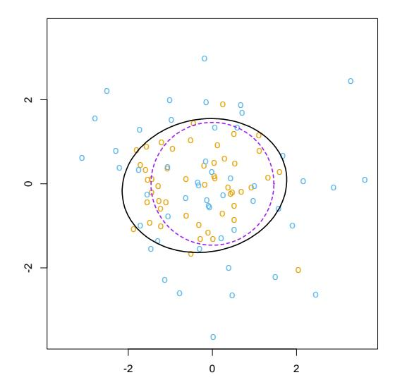

**FIGURE 12.9.** The data consist of 50 points generated from each of N(0, I) and  $N(0, \frac{9}{4}I)$ . The solid black ellipse is the decision boundary found by FDA using degree-two polynomial regression. The dashed purple circle is the Bayes decision boundary.

in LDA their squares cancel out when comparing distances. We could have achieved *identical* quadratic boundaries in a more conventional way, by augmenting our original predictors with their squares and cross-products. In the enlarged space one performs an LDA, and the linear boundaries in the enlarged space map down to quadratic boundaries in the original space. A classic example is a pair of multivariate Gaussians centered at the origin, one having covariance matrix I, and the other cI for c>1; Figure 12.9 illustrates. The Bayes decision boundary is the sphere  $\|x\| = \frac{pc \log c}{2(c-1)}$ , which is a linear boundary in the enlarged space.

Many nonparametric regression procedures operate by generating a basis expansion of derived variables, and then performing a linear regression in the enlarged space. The MARS procedure (Chapter 9) is exactly of this form. Smoothing splines and additive spline models generate an extremely large basis set  $(N \times p)$  basis functions for additive splines), but then perform a penalized regression fit in the enlarged space. SVMs do as well; see also the kernel-based regression example in Section 12.3.7. FDA in this case can be shown to perform a penalized linear discriminant analysis in the enlarged space. We elaborate in Section 12.6. Linear boundaries in the enlarged space map down to nonlinear boundaries in the reduced space. This is exactly the same paradigm that is used with support vector machines (Section 12.3).

We illustrate FDA on the speech recognition example used in Chapter 4, with K=11 classes and p=10 predictors. The classes correspond to

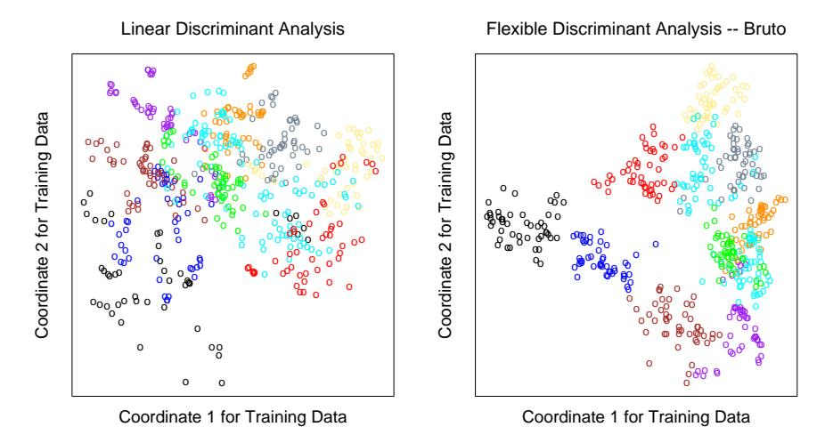

**FIGURE 12.10.** The left plot shows the first two LDA canonical variates for the vowel training data. The right plot shows the corresponding projection when FDA/BRUTO is used to fit the model; plotted are the fitted regression functions  $\hat{\eta}_1(x_i)$  and  $\hat{\eta}_2(x_i)$ . Notice the improved separation. The colors represent the eleven different vowel sounds.

11 vowel sounds, each contained in 11 different words. Here are the words, preceded by the symbols that represent them:

| Vowel        | Word | Vowel | Word  | Vowel | Word | Vowel | Word  |
|--------------|------|-------|-------|-------|------|-------|-------|
| i:           | heed | 0     | hod   | Ι     | hid  | C:    | hoard |
| $\mathbf{E}$ | head | U     | hood  | A     | had  | u:    | who'd |
| a:           | hard | 3:    | heard | Y     | hud  |       |       |

Each of eight speakers spoke each word six times in the training set, and likewise seven speakers in the test set. The ten predictors are derived from the digitized speech in a rather complicated way, but standard in the speech recognition world. There are thus 528 training observations, and 462 test observations. Figure 12.10 shows two-dimensional projections produced by LDA and FDA. The FDA model used adaptive additive-spline regression functions to model the  $\eta_{\ell}(x)$ , and the points plotted in the right plot have coordinates  $\hat{\eta}_1(x_i)$  and  $\hat{\eta}_2(x_i)$ . The routine used in S-PLUS is called bruto, hence the heading on the plot and in Table 12.3. We see that flexible modeling has helped to separate the classes in this case. Table 12.3 shows training and test error rates for a number of classification techniques. FDA/MARS refers to Friedman's multivariate adaptive regression splines; degree = 2 means pairwise products are permitted. Notice that for FDA/MARS, the best classification results are obtained in a reduced-rank subspace.

TABLE 12.3. Vowel recognition data performance results. The results for neural networks are the best among a much larger set, taken from a neural network archive. The notation FDA/BRUTO refers to the regression method used with FDA.

|      | Technique                                | Error Rates |      |
|------|------------------------------------------|-------------|------|
|      |                                          | Training    | Test |
| (1)  | LDA                                      | 0.32        | 0.56 |
|      | Softmax                                  | 0.48        | 0.67 |
| (2)  | QDA                                      | 0.01        | 0.53 |
| (3)  | CART                                     | 0.05        | 0.56 |
| (4)  | CART (linear combination splits)         | 0.05        | 0.54 |
| (5)  | Single-layer perceptron                  |             | 0.67 |
| (6)  | Multi-layer perceptron (88 hidden units) |             | 0.49 |
| (7)  | Gaussian node network (528 hidden units) |             | 0.45 |
| (8)  | Nearest neighbor                         |             | 0.44 |
| (9)  | FDA/BRUTO                                | 0.06        | 0.44 |
|      | Softmax                                  | 0.11        | 0.50 |
| (10) | FDA/MARS (degree = 1)                    | 0.09        | 0.45 |
|      | Best reduced dimension (=2)              | 0.18        | 0.42 |
|      | Softmax                                  | 0.14        | 0.48 |
| (11) | FDA/MARS (degree = 2)                    | 0.02        | 0.42 |
|      | Best reduced dimension (=6)              | 0.13        | 0.39 |
|      | Softmax                                  | 0.10        | 0.50 |

# 12.5.1 Computing the FDA Estimates

The computations for the FDA coordinates can be simplified in many important cases, in particular when the nonparametric regression procedure can be represented as a linear operator. We will denote this operator by S$\lambda$; that is, yˆ = S$\lambda$y, where y is the vector of responses and yˆ the vector of fits. Additive splines have this property, if the smoothing parameters are fixed, as does MARS once the basis functions are selected. The subscript $\lambda$ denotes the entire set of smoothing parameters. In this case optimal scoring is equivalent to a canonical correlation problem, and the solution can be computed by a single eigen-decomposition. This is pursued in Exercise 12.6, and the resulting algorithm is presented here.

We create an N $\times$ K indicator response matrix Y from the responses g$^{i}$ , such that yik = 1 if g$^{i}$ = k, otherwise yik = 0. For a five-class problem Y might look like the following:

$$\begin{array}{cccccccccccccccccccccccccccccccccccc$$

Here are the computational steps:

- 1. Multivariate nonparametric regression. Fit a multiresponse, adaptive nonparametric regression of  $\mathbf{Y}$  on  $\mathbf{X}$ , giving fitted values  $\hat{\mathbf{Y}}$ . Let  $\mathbf{S}_{\lambda}$  be the linear operator that fits the final chosen model, and  $\eta^*(x)$  be the vector of fitted regression functions.
- 2. Optimal scores. Compute the eigen-decomposition of  $\mathbf{Y}^T \hat{\mathbf{Y}} = \mathbf{Y}^T \mathbf{S}_{\lambda} \mathbf{Y}$ , where the eigenvectors  $\boldsymbol{\Theta}$  are normalized:  $\boldsymbol{\Theta}^T \mathbf{D}_{\pi} \boldsymbol{\Theta} = \mathbf{I}$ . Here  $\mathbf{D}_{\pi} = \mathbf{Y}^T \mathbf{Y}/N$  is a diagonal matrix of the estimated class prior probabilities.
- 3. Update the model from step 1 using the optimal scores:  $\eta(x) = \mathbf{\Theta}^T \eta^*(x)$ .

The first of the K functions in  $\eta(x)$  is the constant function— a trivial solution; the remaining K-1 functions are the discriminant functions. The constant function, along with the normalization, causes all the remaining functions to be centered.

Again  $S_{\lambda}$  can correspond to any regression method. When  $S_{\lambda} = H_X$ , the linear regression projection operator, then FDA is linear discriminant analysis. The software that we reference in the *Computational Considerations* section on page 455 makes good use of this modularity; the fda function has a method= argument that allows one to supply any regression function, as long as it follows some natural conventions. The regression functions we provide allow for polynomial regression, adaptive additive models and MARS. They all efficiently handle multiple responses, so step (1) is a single call to a regression routine. The eigen-decomposition in step (2) simultaneously computes all the optimal scoring functions.

In Section 4.2 we discussed the pitfalls of using linear regression on an indicator response matrix as a method for classification. In particular, severe masking can occur with three or more classes. FDA uses the fits from such a regression in step (1), but then transforms them further to produce useful discriminant functions that are devoid of these pitfalls. Exercise 12.9 takes another view of this phenomenon.

# 12.6 Penalized Discriminant Analysis

Although FDA is motivated by generalizing optimal scoring, it can also be viewed directly as a form of regularized discriminant analysis. Suppose the regression procedure used in FDA amounts to a linear regression onto a basis expansion h(X), with a quadratic penalty on the coefficients:

$$ASR(\{\theta_{\ell}, \beta_{\ell}\}_{\ell=1}^{L}) = \frac{1}{N} \sum_{\ell=1}^{L} \left[ \sum_{i=1}^{N} (\theta_{\ell}(g_{i}) - h^{T}(x_{i})\beta_{\ell})^{2} + \lambda \beta_{\ell}^{T} \mathbf{\Omega} \beta_{\ell} \right].$$
 (12.57)

The choice of  $\Omega$  depends on the problem. If  $\eta_{\ell}(x) = h(x)\beta_{\ell}$  is an expansion on spline basis functions,  $\Omega$  might constrain  $\eta_{\ell}$  to be smooth over  $\mathbb{R}^p$ . In the case of additive splines, there are N spline basis functions for each coordinate, resulting in a total of Np basis functions in h(x);  $\Omega$  in this case is  $Np \times Np$  and block diagonal.

The steps in FDA can then be viewed as a generalized form of LDA, which we call *penalized discriminant analysis*, or PDA:

- Enlarge the set of predictors X via a basis expansion h(X).
- Use (penalized) LDA in the enlarged space, where the penalized Mahalanobis distance is given by

$$D(x,\mu) = (h(x) - h(\mu))^{T} (\Sigma_{W} + \lambda \Omega)^{-1} (h(x) - h(\mu)), \quad (12.58)$$

where  $\Sigma_W$  is the within-class covariance matrix of the derived variables  $h(x_i)$ .

• Decompose the classification subspace using a penalized metric:

$$\max u^T \mathbf{\Sigma}_{\text{Bet}} u \text{ subject to } u^T (\mathbf{\Sigma}_W + \lambda \mathbf{\Omega}) u = 1.$$

Loosely speaking, the penalized Mahalanobis distance tends to give less weight to "rough" coordinates, and more weight to "smooth" ones; since the penalty is not diagonal, the same applies to linear combinations that are rough or smooth.

For some classes of problems, the first step, involving the basis expansion, is not needed; we already have far too many (correlated) predictors. A leading example is when the objects to be classified are digitized analog signals:

- the log-periodogram of a fragment of spoken speech, sampled at a set of 256 frequencies; see Figure 5.5 on page 149.
- the grayscale pixel values in a digitized image of a handwritten digit.

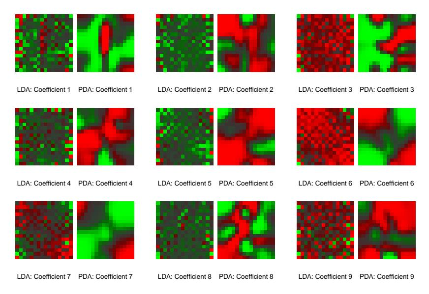

**FIGURE 12.11.** The images appear in pairs, and represent the nine discriminant coefficient functions for the digit recognition problem. The left member of each pair is the LDA coefficient, while the right member is the PDA coefficient, regularized to enforce spatial smoothness.

It is also intuitively clear in these cases why regularization is needed. Take the digitized image as an example. Neighboring pixel values will tend to be correlated, being often almost the same. This implies that the pair of corresponding LDA coefficients for these pixels can be wildly different and opposite in sign, and thus cancel when applied to similar pixel values. Positively correlated predictors lead to noisy, negatively correlated coefficient estimates, and this noise results in unwanted sampling variance. A reasonable strategy is to regularize the *coefficients* to be smooth over the spatial domain, as with images. This is what PDA does. The computations proceed just as for FDA, except that an appropriate penalized regression method is used. Here  $h^T(X)\beta_\ell = X\beta_\ell$ , and  $\Omega$  is chosen so that  $\beta_\ell^T \Omega \beta_\ell$ penalizes roughness in  $\beta_{\ell}$  when viewed as an image. Figure 1.2 on page 4 shows some examples of handwritten digits. Figure 12.11 shows the discriminant variates using LDA and PDA. Those produced by LDA appear as salt-and-pepper images, while those produced by PDA are smooth images. The first smooth image can be seen as the coefficients of a linear contrast functional for separating images with a dark central vertical strip (ones, possibly sevens) from images that are hollow in the middle (zeros, some fours). Figure 12.12 supports this interpretation, and with more difficulty allows an interpretation of the second coordinate. This and other

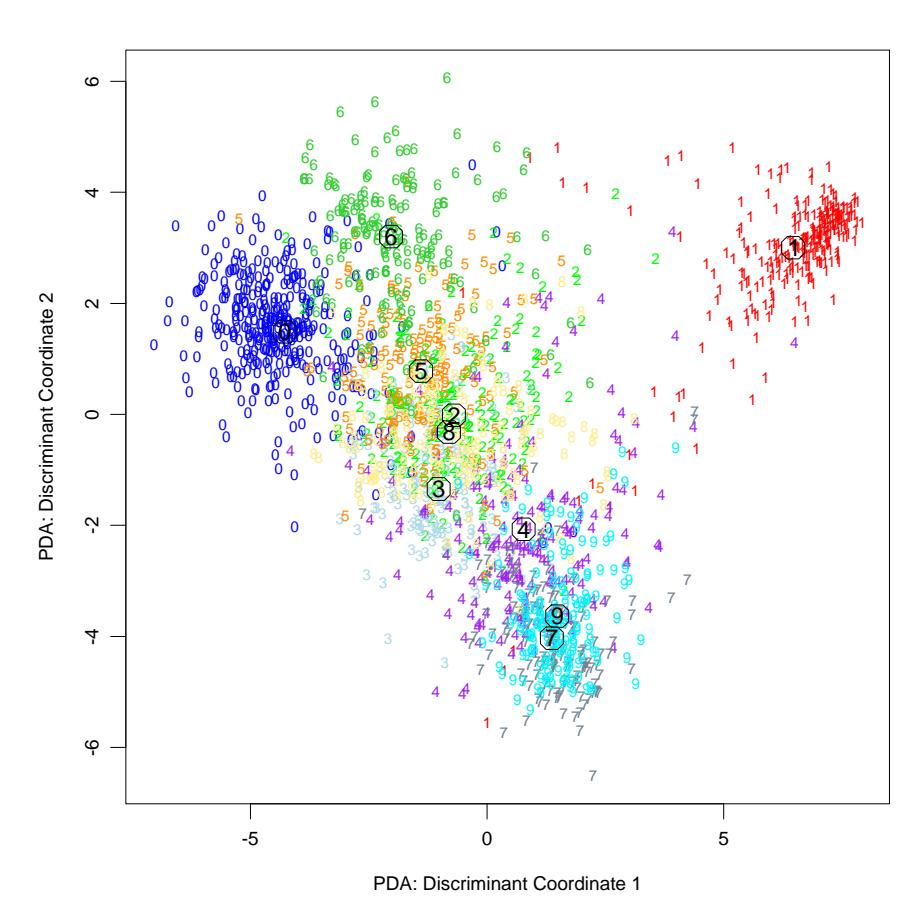

**FIGURE 12.12.** The first two penalized canonical variates, evaluated for the test data. The circles indicate the class centroids. The first coordinate contrasts mainly 0's and 1's, while the second contrasts 6's and 7/9's.

examples are discussed in more detail in Hastie et al. (1995), who also show that the regularization improves the classification performance of LDA on independent test data by a factor of around 25% in the cases they tried.

# 12.7 Mixture Discriminant Analysis

Linear discriminant analysis can be viewed as a prototype classifier. Each class is represented by its centroid, and we classify to the closest using an appropriate metric. In many situations a single prototype is not sufficient to represent inhomogeneous classes, and mixture models are more appropriate. In this section we review Gaussian mixture models and show how they can be generalized via the FDA and PDA methods discussed earlier. A Gaussian mixture model for the kth class has density

$$P(X|G=k) = \sum_{r=1}^{R_k} \pi_{kr} \phi(X; \mu_{kr}, \Sigma),$$
 (12.59)

where the mixing proportions $\pi$kr sum to one. This has R$^{k}$ prototypes for the kth class, and in our specification, the same covariance matrix $\Sigma$ is used as the metric throughout. Given such a model for each class, the class posterior probabilities are given by

$$P(G = k|X = x) = \frac{\sum_{r=1}^{R_k} \pi_{kr} \phi(X; \mu_{kr}, \mathbf{\Sigma}) \Pi_k}{\sum_{\ell=1}^K \sum_{r=1}^{R_\ell} \pi_{\ell r} \phi(X; \mu_{\ell r}, \mathbf{\Sigma}) \Pi_\ell},$$
 (12.60)

where Π$^{k}$ represent the class prior probabilities.

We saw these calculations for the special case of two components in Chapter 8. As in LDA, we estimate the parameters by maximum likelihood, using the joint log-likelihood based on P(G, X):

$$\sum_{k=1}^{K} \sum_{g_i=k} \log \left[ \sum_{r=1}^{R_k} \pi_{kr} \phi(x_i; \mu_{kr}, \boldsymbol{\Sigma}) \Pi_k \right].$$
 (12.61)

The sum within the log makes this a rather messy optimization problem if tackled directly. The classical and natural method for computing the maximum-likelihood estimates (MLEs) for mixture distributions is the EM algorithm (Dempster et al., 1977), which is known to possess good convergence properties. EM alternates between the two steps:

E-step: Given the current parameters, compute the responsibility of subclass  $c_{kr}$  within class k for each of the class-k observations  $(g_i = k)$ :

$$W(c_{kr}|x_i, g_i) = \frac{\pi_{kr}\phi(x_i; \mu_{kr}, \Sigma)}{\sum_{\ell=1}^{R_k} \pi_{k\ell}\phi(x_i; \mu_{k\ell}, \Sigma)}.$$
 (12.62)

M-step: Compute the weighted MLEs for the parameters of each of the component Gaussians within each of the classes, using the weights from the E-step.

In the E-step, the algorithm apportions the unit weight of an observation in class k to the various subclasses assigned to that class. If it is close to the centroid of a particular subclass, and far from the others, it will receive a mass close to one for that subclass. On the other hand, observations halfway between two subclasses will get approximately equal weight for both.

In the M-step, an observation in class k is used  $R_k$  times, to estimate the parameters in each of the  $R_k$  component densities, with a different weight for each. The EM algorithm is studied in detail in Chapter 8. The algorithm requires initialization, which can have an impact, since mixture likelihoods are generally multimodal. Our software (referenced in the Computational Considerations on page 455) allows several strategies; here we describe the default. The user supplies the number  $R_k$  of subclasses per class. Within class k, a k-means clustering model, with multiple random starts, is fitted to the data. This partitions the observations into  $R_k$  disjoint groups, from which an initial weight matrix, consisting of zeros and ones, is created.

Our assumption of an equal component covariance matrix  $\Sigma$  throughout buys an additional simplicity; we can incorporate rank restrictions in the mixture formulation just like in LDA. To understand this, we review a little-known fact about LDA. The rank-L LDA fit (Section 4.3.3) is equivalent to the maximum-likelihood fit of a Gaussian model, where the different mean vectors in each class are confined to a rank-L subspace of  $\mathbb{R}^p$  (Exercise 4.8). We can inherit this property for the mixture model, and maximize the log-likelihood (12.61) subject to rank constraints on all the  $\sum_k R_k$  centroids: rank{ $\mu_{k\ell}$ } = L.

Again the EM algorithm is available, and the M-step turns out to be a weighted version of LDA, with  $R = \sum_{k=1}^K R_k$  "classes." Furthermore, we can use optimal scoring as before to solve the weighted LDA problem, which allows us to use a weighted version of FDA or PDA at this stage. One would expect, in addition to an increase in the number of "classes," a similar increase in the number of "observations" in the kth class by a factor of  $R_k$ . It turns out that this is not the case if linear operators are used for the optimal scoring regression. The enlarged indicator  $\mathbf{Y}$  matrix collapses in this case to a blurred response matrix  $\mathbf{Z}$ , which is intuitively pleasing. For example, suppose there are K=3 classes, and  $R_k=3$  subclasses per class. Then  $\mathbf{Z}$  might be

$$\begin{array}{cccccccccccccccccccccccccccccccccccc$$

where the entries in a class-k row correspond to  $W(c_{kr}|x,g_i)$ . The remaining steps are the same:

$$\left. \begin{array}{l} \hat{\mathbf{Z}} = \mathbf{S}\mathbf{Z} \\ \mathbf{Z}^T \hat{\mathbf{Z}} = \boldsymbol{\Theta}\mathbf{D}\boldsymbol{\Theta}^T \\ \text{Update $\pi$s and $\Pi$s} \end{array} \right\} \text{ M-step of MDA}.$$

These simple modifications add considerable flexibility to the mixture model:

- The dimension reduction step in LDA, FDA or PDA is limited by the number of classes; in particular, for K=2 classes no reduction is possible. MDA substitutes subclasses for classes, and then allows us to look at low-dimensional views of the subspace spanned by these subclass centroids. This subspace will often be an important one for discrimination.
- By using FDA or PDA in the M-step, we can adapt even more to particular situations. For example, we can fit MDA models to digitized analog signals and images, with smoothness constraints built in.

Figure 12.13 compares FDA and MDA on the mixture example.

#### 12.7.1 Example: Waveform Data

We now illustrate some of these ideas on a popular simulated example, taken from Breiman et al. (1984, pages 49–55), and used in Hastie and Tibshirani (1996b) and elsewhere. It is a three-class problem with 21 variables, and is considered to be a difficult pattern recognition problem. The predictors are defined by

$$X_{j} = Uh_{1}(j) + (1 - U)h_{2}(j) + \epsilon_{j}$$
 Class 1,  
 $X_{j} = Uh_{1}(j) + (1 - U)h_{3}(j) + \epsilon_{j}$  Class 2, (12.64)  
 $X_{i} = Uh_{2}(j) + (1 - U)h_{3}(j) + \epsilon_{i}$  Class 3,

where j = 1, 2, ..., 21, U is uniform on (0, 1),  $\epsilon_j$  are standard normal variates, and the  $h_\ell$  are the shifted triangular waveforms:  $h_1(j) = \max(6 - 1)$ 

#### FDA / MARS - Degree 2

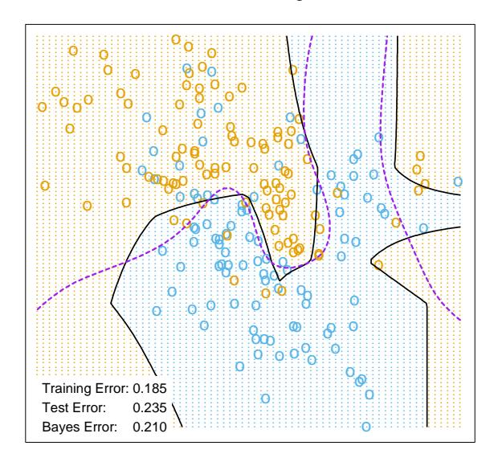

MDA - 5 Subclasses per Class

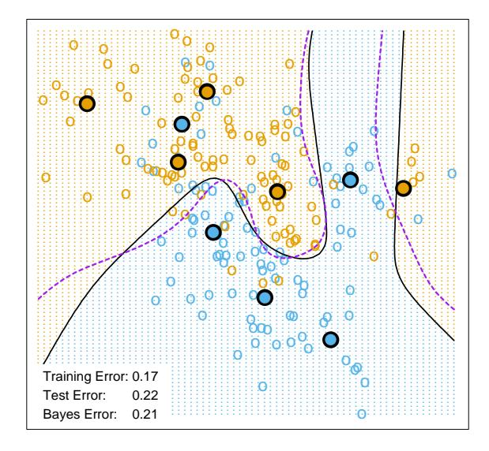

FIGURE 12.13. FDA and MDA on the mixture data. The upper plot uses FDA with MARS as the regression procedure. The lower plot uses MDA with five mixture centers per class (indicated). The MDA solution is close to Bayes optimal, as might be expected given the data arise from mixtures of Gaussians. The broken purple curve in the background is the Bayes decision boundary.

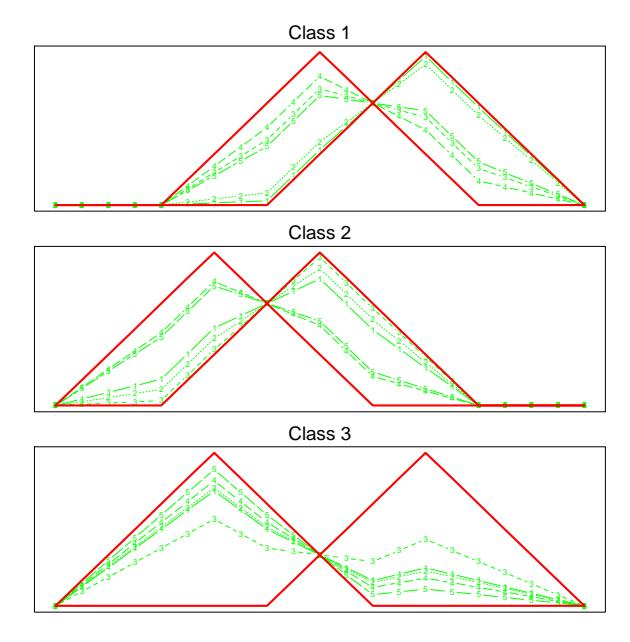

FIGURE 12.14. Some examples of the waveforms generated from model (12.64) before the Gaussian noise is added.

|j-11|,0),  $h_2(j)=h_1(j-4)$  and  $h_3(j)=h_1(j+4)$ . Figure 12.14 shows some example waveforms from each class.

Table 12.4 shows the results of MDA applied to the waveform data, as well as several other methods from this and other chapters. Each training sample has 300 observations, and equal priors were used, so there are roughly 100 observations in each class. We used test samples of size 500. The two MDA models are described in the caption.

Figure 12.15 shows the leading canonical variates for the penalized MDA model, evaluated at the test data. As we might have guessed, the classes appear to lie on the edges of a triangle. This is because the  $h_j(i)$  are represented by three points in 21-space, thereby forming vertices of a triangle, and each class is represented as a convex combination of a pair of vertices, and hence lie on an edge. Also it is clear visually that all the information lies in the first two dimensions; the percentage of variance explained by the first two coordinates is 99.8%, and we would lose nothing by truncating the solution there. The Bayes risk for this problem has been estimated to be about 0.14 (Breiman et al., 1984). MDA comes close to the optimal rate, which is not surprising since the structure of the MDA model is similar to the generating model.

TABLE 12.4. Results for waveform data. The values are averages over ten simulations, with the standard error of the average in parentheses. The five entries above the line are taken from Hastie et al. (1994). The first model below the line is MDA with three subclasses per class. The next line is the same, except that the discriminant coefficients are penalized via a roughness penalty to effectively 4df. The third is the corresponding penalized LDA or PDA model.

| Technique                          | Error Rates  |              |  |  |  |
|------------------------------------|--------------|--------------|--|--|--|
|                                    | Training     | Test         |  |  |  |
| LDA                                | 0.121(0.006) | 0.191(0.006) |  |  |  |
| QDA                                | 0.039(0.004) | 0.205(0.006) |  |  |  |
| CART                               | 0.072(0.003) | 0.289(0.004) |  |  |  |
| FDA/MARS (degree = 1)              | 0.100(0.006) | 0.191(0.006) |  |  |  |
| FDA/MARS (degree = 2)              | 0.068(0.004) | 0.215(0.002) |  |  |  |
| MDA (3 subclasses)                 | 0.087(0.005) | 0.169(0.006) |  |  |  |
| MDA (3 subclasses, penalized 4 df) | 0.137(0.006) | 0.157(0.005) |  |  |  |
| PDA (penalized 4 df)               | 0.150(0.005) | 0.171(0.005) |  |  |  |
| Bayes                              |              | 0.140        |  |  |  |

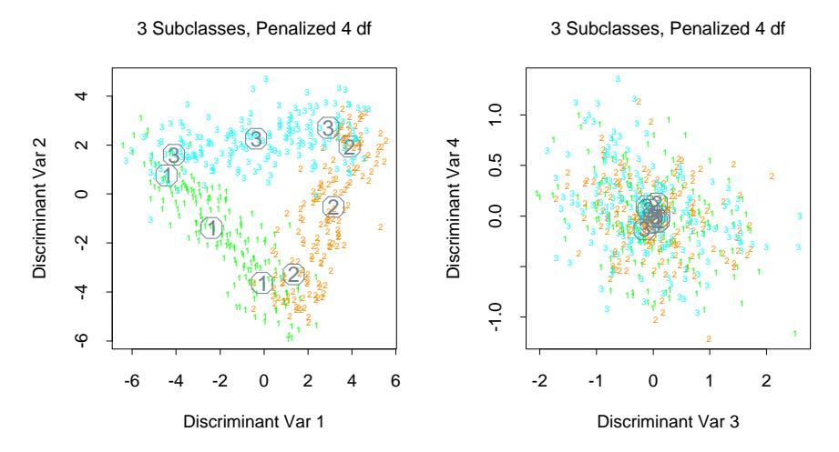

**FIGURE 12.15.** Some two-dimensional views of the MDA model fitted to a sample of the waveform model. The points are independent test data, projected on to the leading two canonical coordinates (left panel), and the third and fourth (right panel). The subclass centers are indicated.

#### Computational Considerations

With N training cases, p predictors, and m support vectors, the support vector machine requires $^{m}$$^{3}$ $^{+}$ mN $^{+}$ mpN operations, assuming $^{m}$ $^{\approx}$ $^{N}$. They do not scale well with N, although computational shortcuts are available (Platt, 1999). Since these are evolving rapidly, the reader is urged to search the web for the latest technology.

LDA requires N p$^{2}$ + p $^{3}$ operations, as does PDA. The complexity of FDA depends on the regression method used. Many techniques are linear in N, such as additive models and MARS. General splines and kernel-based regression methods will typically require N$^{3}$ operations.

Software is available for fitting FDA, PDA and MDA models in the R package mda, which is also available in S-PLUS.

# Bibliographic Notes

The theory behind support vector machines is due to Vapnik and is described in Vapnik (1996). There is a burgeoning literature on SVMs; an online bibliography, created and maintained by Alex Smola and Bernhard Sch¨olkopf, can be found at:

http://www.kernel-machines.org.

Our treatment is based on Wahba et al. (2000) and Evgeniou et al. (2000), and the tutorial by Burges (Burges, 1998).

Linear discriminant analysis is due to Fisher (1936) and Rao (1973). The connection with optimal scoring dates back at least to Breiman and Ihaka (1984), and in a simple form to Fisher (1936). There are strong connections with correspondence analysis (Greenacre, 1984). The description of flexible, penalized and mixture discriminant analysis is taken from Hastie et al. (1994), Hastie et al. (1995) and Hastie and Tibshirani (1996b), and all three are summarized in Hastie et al. (2000); see also Ripley (1996).

# Exercises

Ex. 12.1 Show that the criteria (12.25) and (12.8) are equivalent.

Ex. 12.2 Show that the solution to (12.29) is the same as the solution to (12.25) for a particular kernel.

Ex. 12.3 Consider a modification to (12.43) where you do not penalize the constant. Formulate the problem, and characterize its solution.

Ex. 12.4 Suppose you perform a reduced-subspace linear discriminant analysis for a K-group problem. You compute the canonical variables of dimension $^{L}$ $^{\le}$ $^{K}$ $^{−}$ 1 given by $^{z}$ $^{=}$ $^{U}$$^{T}$ $^{x}$, where $^{U}$ is the $^{p}$ $^{\times}$ $^{L}$ matrix of discriminant coefficients, and p > K is the dimension of x.

(a) If L = K − 1 show that

$$||z - \bar{z}_k||^2 - ||z - \bar{z}_{k'}||^2 = ||x - \bar{x}_k||_W^2 - ||x - \bar{x}_{k'}||_W^2$$

where k$\cdot$k$^{W}$ denotes Mahalanobis distance with respect to the covariance W.

(b) If L < K − 1, show that the same expression on the left measures the difference in Mahalanobis squared distances for the distributions projected onto the subspace spanned by U.

Ex. 12.5 The data in phoneme.subset, available from this book's website

#### http://www-stat.stanford.edu/ElemStatLearn

consists of digitized log-periodograms for phonemes uttered by 60 speakers, each speaker having produced phonemes from each of five classes. It is appropriate to plot each vector of 256 "features" against the frequencies 0–255.

- (a) Produce a separate plot of all the phoneme curves against frequency for each class.
- (b) You plan to use a nearest prototype classification scheme to classify the curves into phoneme classes. In particular, you will use a K-means clustering algorithm in each class (kmeans() in R), and then classify observations to the class of the closest cluster center. The curves are high-dimensional and you have a rather small sample-size-to-variables ratio. You decide to restrict all the prototypes to be smooth functions of frequency. In particular, you decide to represent each prototype m as m = B$\theta$ where B is a 256 $\times$ J matrix of natural spline basis functions with J knots uniformly chosen in (0, 255) and boundary knots at 0 and 255. Describe how to proceed analytically, and in particular, how to avoid costly high-dimensional fitting procedures. (Hint: It may help to restrict B to be orthogonal.)
- (c) Implement your procedure on the phoneme data, and try it out. Divide the data into a training set and a test set (50-50), making sure that speakers are not split across sets (why?). Use K = 1, 3, 5, 7 centers per class, and for each use J = 5, 10, 15 knots (taking care to start the K-means procedure at the same starting values for each value of J), and compare the results.

Ex. 12.6 Suppose that the regression procedure used in FDA (Section 12.5.1) is a linear expansion of basis functions hm(x), m = 1, . . . , M. Let D$^{\pi}$ = Y$^{T}$ Y/N be the diagonal matrix of class proportions.

(a) Show that the optimal scoring problem (12.52) can be written in vector notation as

$$\min_{\theta,\beta} \|\mathbf{Y}\theta - \mathbf{H}\beta\|^2, \qquad (12.65)$$

where  $\theta$  is a vector of K real numbers, and  $\mathbf{H}$  is the  $N \times M$  matrix of evaluations  $h_j(x_i)$ .

- (b) Suppose that the normalization on  $\theta$  is  $\theta^T \mathbf{D}_{\pi} 1 = 0$  and  $\theta^T \mathbf{D}_{\pi} \theta = 1$ . Interpret these normalizations in terms of the original scored  $\theta(g_i)$ .
- (c) Show that, with this normalization, (12.65) can be partially optimized w.r.t.  $\beta$ , and leads to

$$\max_{\theta} \theta^T \mathbf{Y}^T \mathbf{S} \mathbf{Y} \theta, \tag{12.66}$$

subject to the normalization constraints, where S is the projection operator corresponding to the basis matrix H.

- (d) Suppose that the  $h_j$  include the constant function. Show that the largest eigenvalue of **S** is 1.
- (e) Let  $\Theta$  be a  $K \times K$  matrix of scores (in columns), and suppose the normalization is  $\Theta^T \mathbf{D}_{\pi} \Theta = \mathbf{I}$ . Show that the solution to (12.53) is given by the complete set of eigenvectors of  $\mathbf{S}$ ; the first eigenvector is trivial, and takes care of the centering of the scores. The remainder characterize the optimal scoring solution.

Ex. 12.7 Derive the solution to the penalized optimal scoring problem (12.57).

Ex. 12.8 Show that coefficients  $\beta_{\ell}$  found by optimal scoring are proportional to the discriminant directions  $\nu_{\ell}$  found by linear discriminant analysis.

Ex. 12.9 Let  $\hat{\mathbf{Y}} = \mathbf{X}\hat{\mathbf{B}}$  be the fitted  $N \times K$  indicator response matrix after linear regression on the  $N \times p$  matrix  $\mathbf{X}$ , where p > K. Consider the reduced features  $x_i^* = \hat{\mathbf{B}}^T x_i$ . Show that LDA using  $x_i^*$  is equivalent to LDA in the original space.

Ex. 12.10 Kernels and linear discriminant analysis. Suppose you wish to carry out a linear discriminant analysis (two classes) using a vector of transformations of the input variables h(x). Since h(x) is high-dimensional, you will use a regularized within-class covariance matrix  $\mathbf{W}_h + \gamma \mathbf{I}$ . Show that the model can be estimated using only the inner products  $K(x_i, x_{i'}) = \langle h(x_i), h(x_{i'}) \rangle$ . Hence the kernel property of support vector machines is also shared by regularized linear discriminant analysis.

Ex. 12.11 The MDA procedure models each class as a mixture of Gaussians. Hence each mixture center belongs to one and only one class. A more general model allows each mixture center to be shared by all classes. We take the joint density of labels and features to be

$$P(G,X) = \sum_{r=1}^{R} \pi_r P_r(G,X), \qquad (12.67)$$

a mixture of joint densities. Furthermore we assume

$$P_r(G, X) = P_r(G)\phi(X; \mu_r, \Sigma). \tag{12.68}$$

This model consists of regions centered at  $\mu_r$ , and for each there is a class profile  $P_r(G)$ . The posterior class distribution is given by

$$P(G = k|X = x) = \frac{\sum_{r=1}^{R} \pi_r P_r(G = k) \phi(x; \mu_r, \Sigma)}{\sum_{r=1}^{R} \pi_r \phi(x; \mu_r, \Sigma)},$$
 (12.69)

where the denominator is the marginal distribution P(X).

(a) Show that this model (called MDA2) can be viewed as a generalization of MDA since

$$P(X|G=k) = \frac{\sum_{r=1}^{R} \pi_r P_r(G=k)\phi(x; \mu_r, \Sigma)}{\sum_{r=1}^{R} \pi_r P_r(G=k)},$$
 (12.70)

where  $\pi_{rk} = \pi_r P_r(G = k) / \sum_{r=1}^R \pi_r P_r(G = k)$  corresponds to the mixing proportions for the kth class.

- (b) Derive the EM algorithm for MDA2.
- (c) Show that if the initial weight matrix is constructed as in MDA, involving separate k-means clustering in each class, then the algorithm for MDA2 is identical to the original MDA procedure.