# Prototype Methods and Nearest-Neighbors

# 13.1 Introduction

In this chapter we discuss some simple and essentially model-free methods for classification and pattern recognition. Because they are highly unstructured, they typically are not useful for understanding the nature of the relationship between the features and class outcome. However, as black box prediction engines, they can be very effective, and are often among the best performers in real data problems. The nearest-neighbor technique can also be used in regression; this was touched on in Chapter 2 and works reasonably well for low-dimensional problems. However, with high-dimensional features, the bias–variance tradeoff does not work as favorably for nearestneighbor regression as it does for classification.

# 13.2 Prototype Methods

Throughout this chapter, our training data consists of the N pairs (x1, g1), . . . , (xn, gN ) where gi is a class label taking values in {1, 2, . . . , K}. Prototype methods represent the training data by a set of points in feature space. These prototypes are typically not examples from the training sample, except in the case of 1-nearest-neighbor classification discussed later.

Each prototype has an associated class label, and classification of a query point x is made to the class of the closest prototype. "Closest" is usually defined by Euclidean distance in the feature space, after each feature has been standardized to have overall mean 0 and variance 1 in the training sample. Euclidean distance is appropriate for quantitative features. We discuss distance measures between qualitative and other kinds of feature values in Chapter 14.

These methods can be very effective if the prototypes are well positioned to capture the distribution of each class. Irregular class boundaries can be represented, with enough prototypes in the right places in feature space. The main challenge is to figure out how many prototypes to use and where to put them. Methods differ according to the number and way in which prototypes are selected.

#### 13.2.1 K-means Clustering

K-means clustering is a method for finding clusters and cluster centers in a set of unlabeled data. One chooses the desired number of cluster centers, say R, and the K-means procedure iteratively moves the centers to minimize the total within cluster variance.1 Given an initial set of centers, the Kmeans algorithm alternates the two steps:

- for each center we identify the subset of training points (its cluster) that is closer to it than any other center;
- the means of each feature for the data points in each cluster are computed, and this mean vector becomes the new center for that cluster.

These two steps are iterated until convergence. Typically the initial centers are R randomly chosen observations from the training data. Details of the K-means procedure, as well as generalizations allowing for different variable types and more general distance measures, are given in Chapter 14.

To use K-means clustering for classification of labeled data, the steps are:

- apply K-means clustering to the training data in each class separately, using R prototypes per class;
- assign a class label to each of the K × R prototypes;
- classify a new feature x to the class of the closest prototype.

Figure 13.1 (upper panel) shows a simulated example with three classes and two features. We used R = 5 prototypes per class, and show the classification regions and the decision boundary. Notice that a number of the

1The "K" in K-means refers to the number of cluster centers. Since we have already reserved K to denote the number of classes, we denote the number of clusters by R.

K-means - 5 Prototypes per Class

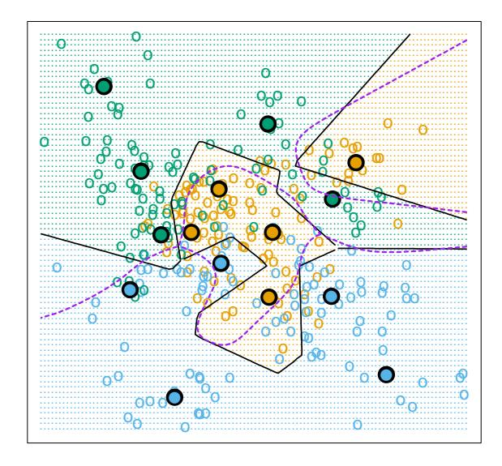

LVQ - 5 Prototypes per Class

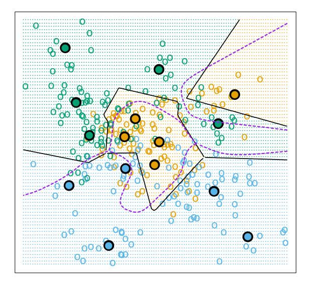

FIGURE 13.1. Simulated example with three classes and five prototypes per class. The data in each class are generated from a mixture of Gaussians. In the upper panel, the prototypes were found by applying the K-means clustering algorithm separately in each class. In the lower panel, the LVQ algorithm (starting from the K-means solution) moves the prototypes away from the decision boundary. The broken purple curve in the background is the Bayes decision boundary.

#### Algorithm 13.1 Learning Vector Quantization—LVQ.

- 1. Choose R initial prototypes for each class: m1(k), m2(k), . . . , mR(k), k = 1, 2, . . . , K, for example, by sampling R training points at random from each class.
- 2. Sample a training point xi randomly (with replacement), and let (j, k) index the closest prototype mj (k) to xi .
  - (a) If gi = k (i.e., they are in the same class), move the prototype towards the training point:

$$m_j(k) \leftarrow m_j(k) + \epsilon(x_i - m_j(k)),$$

where ǫ is the learning rate.

(b) If gi 6= k (i.e., they are in different classes), move the prototype away from the training point:

$$m_j(k) \leftarrow m_j(k) - \epsilon(x_i - m_j(k)).$$

3. Repeat step 2, decreasing the learning rate ǫ with each iteration towards zero.

prototypes are near the class boundaries, leading to potential misclassification errors for points near these boundaries. This results from an obvious shortcoming with this method: for each class, the other classes do not have a say in the positioning of the prototypes for that class. A better approach, discussed next, uses all of the data to position all prototypes.

# 13.2.2 Learning Vector Quantization

In this technique due to Kohonen (1989), prototypes are placed strategically with respect to the decision boundaries in an ad-hoc way. LVQ is an online algorithm—observations are processed one at a time.

The idea is that the training points attract prototypes of the correct class, and repel other prototypes. When the iterations settle down, prototypes should be close to the training points in their class. The learning rate ǫ is decreased to zero with each iteration, following the guidelines for stochastic approximation learning rates (Section 11.4.)

Figure 13.1 (lower panel) shows the result of LVQ, using the K-means solution as starting values. The prototypes have tended to move away from the decision boundaries, and away from prototypes of competing classes.

The procedure just described is actually called LVQ1. Modifications (LVQ2, LVQ3, etc.) have been proposed, that can sometimes improve performance. A drawback of learning vector quantization methods is the fact that they are defined by algorithms, rather than optimization of some fixed criteria; this makes it difficult to understand their properties.

#### 13.2.3 Gaussian Mixtures

The Gaussian mixture model can also be thought of as a prototype method, similar in spirit to K-means and LVQ. We discuss Gaussian mixtures in some detail in Sections 6.8, 8.5 and 12.7. Each cluster is described in terms of a Gaussian density, which has a centroid (as in K-means), and a covariance matrix. The comparison becomes crisper if we restrict the component Gaussians to have a scalar covariance matrix (Exercise 13.1). The two steps of the alternating EM algorithm are very similar to the two steps in K-means:

- In the E-step, each observation is assigned a responsibility or weight for each cluster, based on the likelihood of each of the corresponding Gaussians. Observations close to the center of a cluster will most likely get weight 1 for that cluster, and weight 0 for every other cluster. Observations half-way between two clusters divide their weight accordingly.
- In the M-step, each observation contributes to the weighted means (and covariances) for *every* cluster.

As a consequence, the Gaussian mixture model is often referred to as a soft clustering method, while K-means is hard.

Similarly, when Gaussian mixture models are used to represent the feature density in each class, it produces smooth posterior probabilities  $\hat{p}(x) = \{\hat{p}_1(x), \dots, \hat{p}_K(x)\}$  for classifying x (see (12.60) on page 449.) Often this is interpreted as a soft classification, while in fact the classification rule is  $\hat{G}(x) = \arg\max_k \hat{p}_k(x)$ . Figure 13.2 compares the results of K-means and Gaussian mixtures on the simulated mixture problem of Chapter 2. We see that although the decision boundaries are roughly similar, those for the mixture model are smoother (although the prototypes are in approximately the same positions.) We also see that while both procedures devote a blue prototype (incorrectly) to a region in the northwest, the Gaussian mixture classifier can ultimately ignore this region, while K-means cannot. LVQ gave very similar results to K-means on this example, and is not shown.

## 13.3 k-Nearest-Neighbor Classifiers

These classifiers are *memory-based*, and require no model to be fit. Given a query point  $x_0$ , we find the k training points  $x_{(r)}, r = 1, \ldots, k$  closest in distance to  $x_0$ , and then classify using majority vote among the k neighbors.

K-means - 5 Prototypes per Class

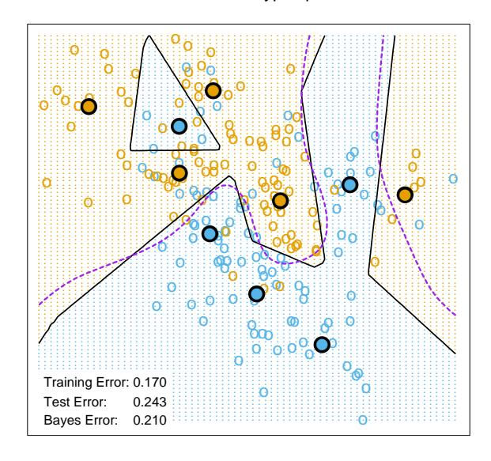

#### Gaussian Mixtures - 5 Subclasses per Class

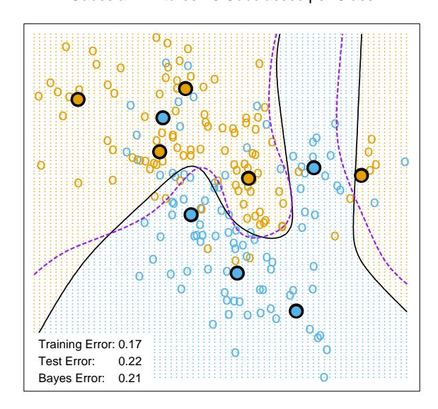

**FIGURE 13.2.** The upper panel shows the K-means classifier applied to the mixture data example. The decision boundary is piecewise linear. The lower panel shows a Gaussian mixture model with a common covariance for all component Gaussians. The EM algorithm for the mixture model was started at the K-means solution. The broken purple curve in the background is the Bayes decision boundary.

Ties are broken at random. For simplicity we will assume that the features are real-valued, and we use Euclidean distance in feature space:

$$d_{(i)} = ||x_{(i)} - x_0||. (13.1)$$

Typically we first standardize each of the features to have mean zero and variance 1, since it is possible that they are measured in different units. In Chapter 14 we discuss distance measures appropriate for qualitative and ordinal features, and how to combine them for mixed data. Adaptively chosen distance metrics are discussed later in this chapter.

Despite its simplicity, k-nearest-neighbors has been successful in a large number of classification problems, including handwritten digits, satellite image scenes and EKG patterns. It is often successful where each class has many possible prototypes, and the decision boundary is very irregular. Figure 13.3 (upper panel) shows the decision boundary of a 15-nearestneighbor classifier applied to the three-class simulated data. The decision boundary is fairly smooth compared to the lower panel, where a 1-nearestneighbor classifier was used. There is a close relationship between nearestneighbor and prototype methods: in 1-nearest-neighbor classification, each training point is a prototype.

Figure 13.4 shows the training, test and tenfold cross-validation errors as a function of the neighborhood size, for the two-class mixture problem. Since the tenfold CV errors are averages of ten numbers, we can estimate a standard error.

Because it uses only the training point closest to the query point, the bias of the 1-nearest-neighbor estimate is often low, but the variance is high. A famous result of Cover and Hart (1967) shows that asymptotically the error rate of the 1-nearest-neighbor classifier is never more than twice the Bayes rate. The rough idea of the proof is as follows (using squared-error loss). We assume that the query point coincides with one of the training points, so that the bias is zero. This is true asymptotically if the dimension of the feature space is fixed and the training data fills up the space in a dense fashion. Then the error of the Bayes rule is just the variance of a Bernoulli random variate (the target at the query point), while the error of 1-nearest-neighbor rule is twice the variance of a Bernoulli random variate, one contribution each for the training and query targets.

We now give more detail for misclassification loss. At x let k ∗ be the dominant class, and pk(x) the true conditional probability for class k. Then

Bayes error = 
$$1 - p_{k^*}(x)$$
, (13.2)

1-nearest-neighbor error 
$$=\sum_{k=1}^{K} p_k(x)(1-p_k(x)),$$
 (13.3)

$$\geq 1 - p_{k^*}(x).$$
 (13.4)

The asymptotic 1-nearest-neighbor error rate is that of a random rule; we pick both the classification and the test point at random with probabili-

#### 15-Nearest Neighbors

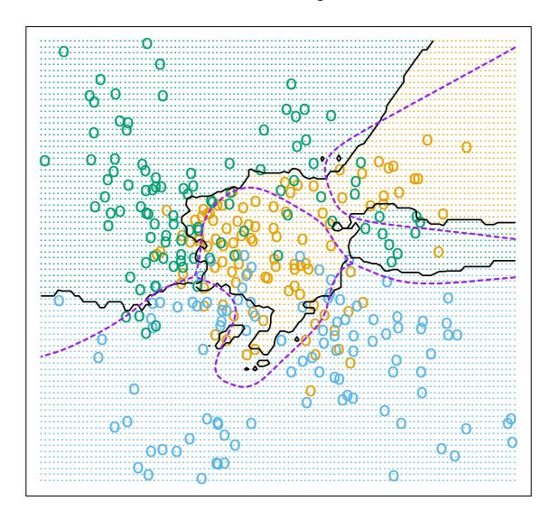

#### 1-Nearest Neighbor

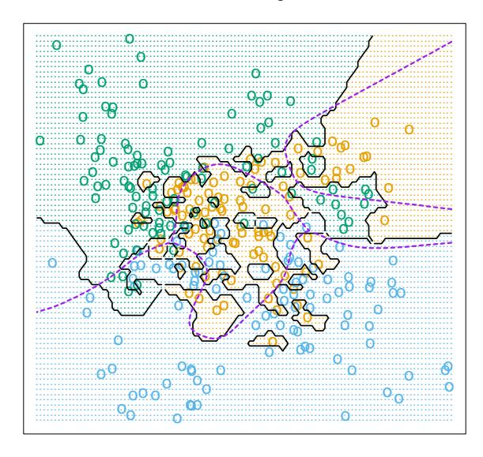

**FIGURE 13.3.** k-nearest-neighbor classifiers applied to the simulation data of Figure 13.1. The broken purple curve in the background is the Bayes decision boundary.

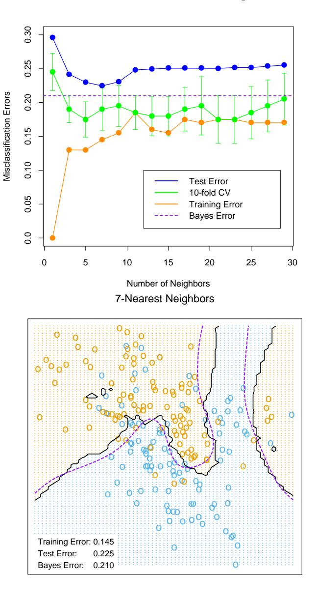

FIGURE 13.4. k-nearest-neighbors on the two-class mixture data. The upper panel shows the misclassification errors as a function of neighborhood size. Standard error bars are included for 10-fold cross validation. The lower panel shows the decision boundary for 7-nearest-neighbors, which appears to be optimal for minimizing test error. The broken purple curve in the background is the Bayes decision boundary.

ties pk(x), k = 1, . . . , K. For K = 2 the 1-nearest-neighbor error rate is 2pk∗ (x)(1 − pk∗ (x)) ≤ 2(1 − pk∗ (x)) (twice the Bayes error rate). More generally, one can show (Exercise 13.3)

$$\sum_{k=1}^{K} p_k(x)(1 - p_k(x)) \le 2(1 - p_{k^*}(x)) - \frac{K}{K - 1}(1 - p_{k^*}(x))^2.$$
 (13.5)

Many additional results of this kind have been derived; Ripley (1996) summarizes a number of them.

This result can provide a rough idea about the best performance that is possible in a given problem. For example, if the 1-nearest-neighbor rule has a 10% error rate, then asymptotically the Bayes error rate is at least 5%. The kicker here is the asymptotic part, which assumes the bias of the nearest-neighbor rule is zero. In real problems the bias can be substantial. The adaptive nearest-neighbor rules, described later in this chapter, are an attempt to alleviate this bias. For simple nearest-neighbors, the bias and variance characteristics can dictate the optimal number of near neighbors for a given problem. This is illustrated in the next example.

#### 13.3.1 Example: A Comparative Study

We tested the nearest-neighbors, K-means and LVQ classifiers on two simulated problems. There are 10 independent features Xj , each uniformly distributed on [0, 1]. The two-class 0-1 target variable is defined as follows:

$$Y = I\left(X_1 > \frac{1}{2}\right);$$
 problem 1: "easy",  
 $Y = I\left(\operatorname{sign}\left\{\prod_{j=1}^{3}\left(X_j - \frac{1}{2}\right)\right\} > 0\right);$  problem 2: "difficult." (13.6)

Hence in the first problem the two classes are separated by the hyperplane X1 = 1/2; in the second problem, the two classes form a checkerboard pattern in the hypercube defined by the first three features. The Bayes error rate is zero in both problems. There were 100 training and 1000 test observations.

Figure 13.5 shows the mean and standard error of the misclassification error for nearest-neighbors, K-means and LVQ over ten realizations, as the tuning parameters are varied. We see that K-means and LVQ give nearly identical results. For the best choices of their tuning parameters, K-means and LVQ outperform nearest-neighbors for the first problem, and they perform similarly for the second problem. Notice that the best value of each tuning parameter is clearly situation dependent. For example 25 nearest-neighbors outperforms 1-nearest-neighbor by a factor of 70% in the

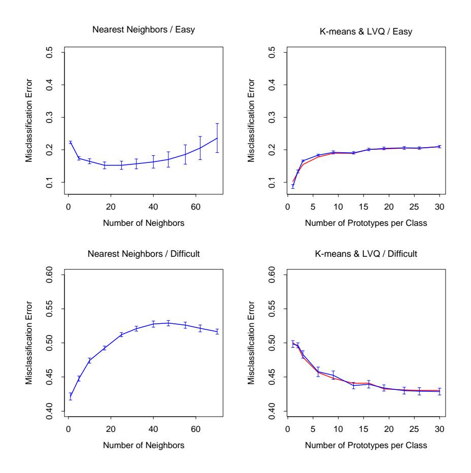

FIGURE 13.5. Mean ± one standard error of misclassification error for nearest-neighbors, K-means (blue) and LVQ (red) over ten realizations for two simulated problems: "easy" and "difficult," described in the text.

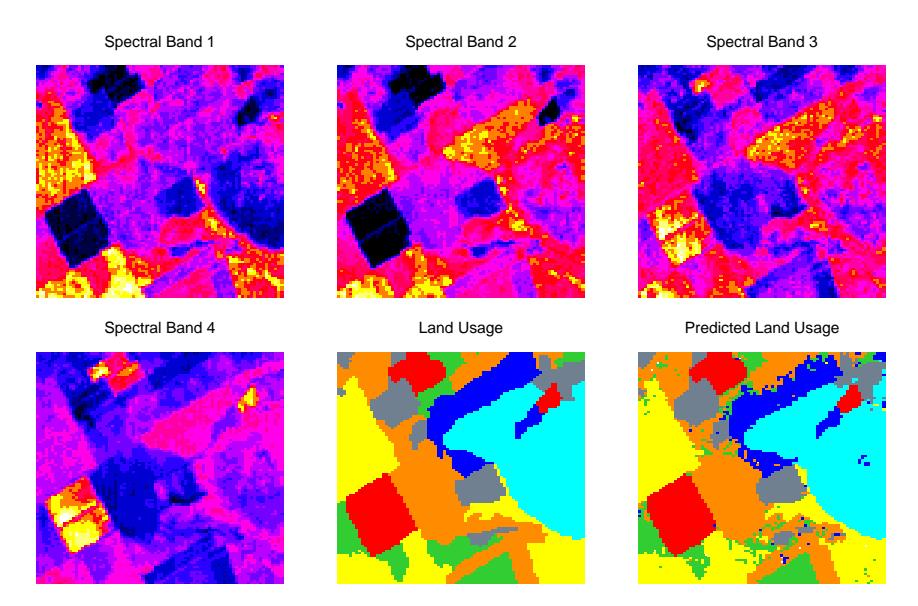

**FIGURE 13.6.** The first four panels are LANDSAT images for an agricultural area in four spectral bands, depicted by heatmap shading. The remaining two panels give the actual land usage (color coded) and the predicted land usage using a five-nearest-neighbor rule described in the text.

first problem, while 1-nearest-neighbor is best in the second problem by a factor of 18%. These results underline the importance of using an objective, data-based method like cross-validation to estimate the best value of a tuning parameter (see Figure 13.4 and Chapter 7).

# 13.3.2 Example: k-Nearest-Neighbors and Image Scene Classification

The STATLOG project (Michie et al., 1994) used part of a LANDSAT image as a benchmark for classification (82 × 100 pixels). Figure 13.6 shows four heat-map images, two in the visible spectrum and two in the infrared, for an area of agricultural land in Australia. Each pixel has a class label from the 7-element set  $\mathcal{G} = \{red\ soil,\ cotton,\ vegetation\ stubble,\ mixture,\ gray\ soil,\ damp\ gray\ soil,\ very\ damp\ gray\ soil\}$ , determined manually by research assistants surveying the area. The lower middle panel shows the actual land usage, shaded by different colors to indicate the classes. The objective is to classify the land usage at a pixel, based on the information in the four spectral bands.

Five-nearest-neighbors produced the predicted map shown in the bottom right panel, and was computed as follows. For each pixel we extracted an 8-neighbor feature map—the pixel itself and its 8 immediate neighbors

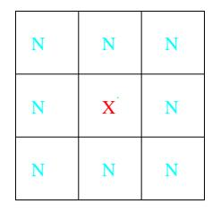

FIGURE 13.7. A pixel and its 8-neighbor feature map.

(see Figure 13.7). This is done separately in the four spectral bands, giving  $(1+8)\times 4=36$  input features per pixel. Then five-nearest-neighbors classification was carried out in this 36-dimensional feature space. The resulting test error rate was about 9.5% (see Figure 13.8). Of all the methods used in the STATLOG project, including LVQ, CART, neural networks, linear discriminant analysis and many others, k-nearest-neighbors performed best on this task. Hence it is likely that the decision boundaries in  $\mathbb{R}^{36}$  are quite irregular.

#### 13.3.3 Invariant Metrics and Tangent Distance

In some problems, the training features are invariant under certain natural transformations. The nearest-neighbor classifier can exploit such invariances by incorporating them into the metric used to measure the distances between objects. Here we give an example where this idea was used with great success, and the resulting classifier outperformed all others at the time of its development (Simard et al., 1993).

The problem is handwritten digit recognition, as discussed is Chapter 1 and Section 11.7. The inputs are grayscale images with  $16 \times 16 = 256$  pixels; some examples are shown in Figure 13.9. At the top of Figure 13.10, a "3" is shown, in its actual orientation (middle) and rotated 7.5° and 15° in either direction. Such rotations can often occur in real handwriting, and it is obvious to our eye that this "3" is still a "3" after small rotations. Hence we want our nearest-neighbor classifier to consider these two "3"s to be close together (similar). However the 256 grayscale pixel values for a rotated "3" will look quite different from those in the original image, and hence the two objects can be far apart in Euclidean distance in  $\mathbb{R}^{256}$ .

We wish to remove the effect of rotation in measuring distances between two digits of the same class. Consider the set of pixel values consisting of the original "3" and its rotated versions. This is a one-dimensional curve in  $\mathbb{R}^{256}$ , depicted by the green curve passing through the "3" in Figure 13.10. Figure 13.11 shows a stylized version of  $\mathbb{R}^{256}$ , with two images indicated by  $x_i$  and  $x_{i'}$ . These might be two different "3"s, for example. Through each image we have drawn the curve of rotated versions of that image, called

#### STATLOG results

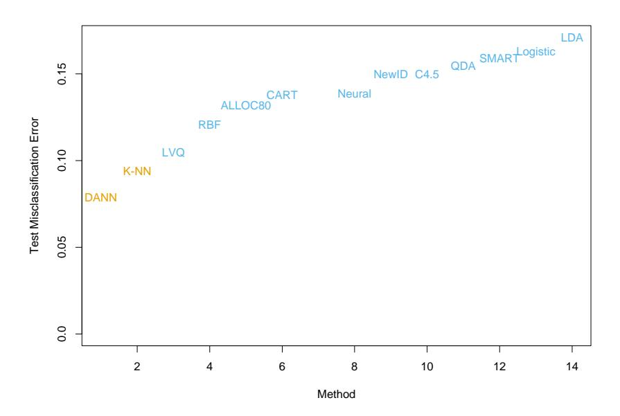

FIGURE 13.8. Test-error performance for a number of classifiers, as reported by the STATLOG project. The entry DANN is a variant of k-nearest neighbors, using an adaptive metric (Section 13.4.2).

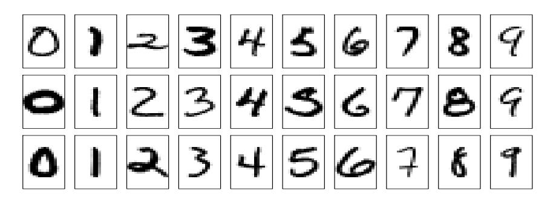

FIGURE 13.9. Examples of grayscale images of handwritten digits.

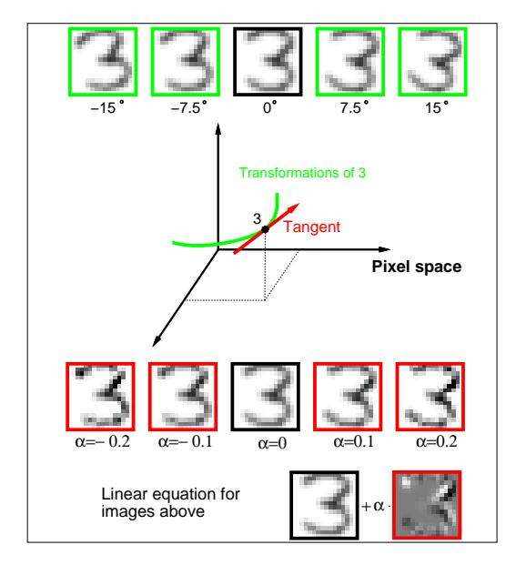

FIGURE 13.10. The top row shows a " 3" in its original orientation (middle) and rotated versions of it. The green curve in the middle of the figure depicts this set of rotated " 3" in 256-dimensional space. The red line is the tangent line to the curve at the original image, with some " 3"s on this tangent line, and its equation shown at the bottom of the figure.

invariance manifolds in this context. Now, rather than using the usual Euclidean distance between the two images, we use the shortest distance between the two curves. In other words, the distance between the two images is taken to be the shortest Euclidean distance between any rotated version of first image, and any rotated version of the second image. This distance is called an invariant metric.

In principle one could carry out 1-nearest-neighbor classification using this invariant metric. However there are two problems with it. First, it is very difficult to calculate for real images. Second, it allows large transformations that can lead to poor performance. For example a "6" would be considered close to a "9" after a rotation of 180◦ . We need to restrict attention to small rotations.

The use of tangent distance solves both of these problems. As shown in Figure 13.10, we can approximate the invariance manifold of the image "3" by its tangent at the original image. This tangent can be computed by estimating the direction vector from small rotations of the image, or by more sophisticated spatial smoothing methods (Exercise 13.4.) For large rotations, the tangent image no longer looks like a "3," so the problem with large transformations is alleviated.

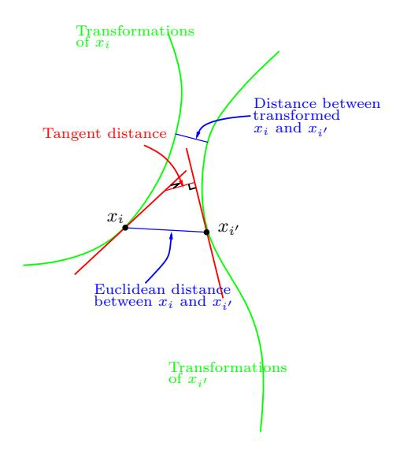

**FIGURE 13.11.** Tangent distance computation for two images  $x_i$  and  $x_{i'}$ . Rather than using the Euclidean distance between  $x_i$  and  $x_{i'}$ , or the shortest distance between the two curves, we use the shortest distance between the two tangent lines.

The idea then is to compute the invariant tangent line for each training image. For a query image to be classified, we compute its invariant tangent line, and find the closest line to it among the lines in the training set. The class (digit) corresponding to this closest line is our predicted class for the query image. In Figure 13.11 the two tangent lines intersect, but this is only because we have been forced to draw a two-dimensional representation of the actual 256-dimensional situation. In  $\mathbb{R}^{256}$  the probability of two such lines intersecting is effectively zero.

Now a simpler way to achieve this invariance would be to add into the training set a number of rotated versions of each training image, and then just use a standard nearest-neighbor classifier. This idea is called "hints" in Abu-Mostafa (1995), and works well when the space of invariances is small. So far we have presented a simplified version of the problem. In addition to rotation, there are six other types of transformations under which we would like our classifier to be invariant. There are translation (two directions), scaling (two directions), sheer, and character thickness. Hence the curves and tangent lines in Figures 13.10 and 13.11 are actually 7-dimensional manifolds and hyperplanes. It is infeasible to add transformed versions of each training image to capture all of these possibilities. The tangent manifolds provide an elegant way of capturing the invariances.

Table 13.1 shows the test misclassification error for a problem with 7291 training images and 2007 test digits (the U.S. Postal Services database), for a carefully constructed neural network, and simple 1-nearest-neighbor and

| Method                                | Error rate |
|---------------------------------------|------------|
| Neural-net                            | 0.049      |
| 1-nearest-neighbor/Euclidean distance | 0.055      |
| 1-nearest-neighbor/tangent distance   | 0.026      |

**TABLE 13.1.** Test error rates for the handwritten ZIP code problem.

tangent distance 1-nearest-neighbor rules. The tangent distance nearest-neighbor classifier works remarkably well, with test error rates near those for the human eye (this is a notoriously difficult test set). In practice, it turned out that nearest-neighbors are too slow for online classification in this application (see Section 13.5), and neural network classifiers were subsequently developed to mimic it.

# 13.4 Adaptive Nearest-Neighbor Methods

When nearest-neighbor classification is carried out in a high-dimensional feature space, the nearest neighbors of a point can be very far away, causing bias and degrading the performance of the rule.

To quantify this, consider N data points uniformly distributed in the unit cube  $[-\frac{1}{2}, \frac{1}{2}]^p$ . Let R be the radius of a 1-nearest-neighborhood centered at the origin. Then

$$\operatorname{median}(R) = v_p^{-1/p} \left( 1 - \frac{1}{2}^{1/N} \right)^{1/p}, \tag{13.7}$$

where  $v_p r^p$  is the volume of the sphere of radius r in p dimensions. Figure 13.12 shows the median radius for various training sample sizes and dimensions. We see that median radius quickly approaches 0.5, the distance to the edge of the cube.

What can be done about this problem? Consider the two-class situation in Figure 13.13. There are two features, and a nearest-neighborhood at a query point is depicted by the circular region. Implicit in near-neighbor classification is the assumption that the class probabilities are roughly constant in the neighborhood, and hence simple averages give good estimates. However, in this example the class probabilities vary only in the horizontal direction. If we knew this, we would stretch the neighborhood in the vertical direction, as shown by the tall rectangular region. This will reduce the bias of our estimate and leave the variance the same.

In general, this calls for adapting the metric used in nearest-neighbor classification, so that the resulting neighborhoods stretch out in directions for which the class probabilities don't change much. In high-dimensional feature space, the class probabilities might change only a low-dimensional subspace and hence there can be considerable advantage to adapting the metric.

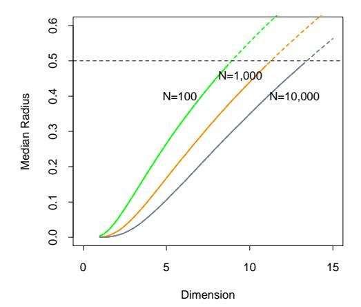

FIGURE 13.12. Median radius of a 1-nearest-neighborhood, for uniform data with N observations in p dimensions.

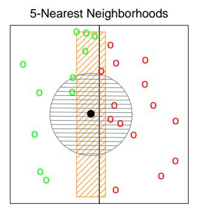

FIGURE 13.13. The points are uniform in the cube, with the vertical line separating class red and green. The vertical strip denotes the 5-nearest-neighbor region using only the horizontal coordinate to find the nearest-neighbors for the target point (solid dot). The sphere shows the 5-nearest-neighbor region using both coordinates, and we see in this case it has extended into the class-red region (and is dominated by the wrong class in this instance).

Friedman (1994a) proposed a method in which rectangular neighborhoods are found adaptively by successively carving away edges of a box containing the training data. Here we describe the *discriminant adaptive nearest-neighbor* (DANN) rule of Hastie and Tibshirani (1996a). Earlier, related proposals appear in Short and Fukunaga (1981) and Myles and Hand (1990).

At each query point a neighborhood of say 50 points is formed, and the class distribution among the points is used to decide how to deform the neighborhood—that is, to adapt the metric. The adapted metric is then used in a nearest-neighbor rule at the query point. Thus at each query point a potentially different metric is used.

In Figure 13.13 it is clear that the neighborhood should be stretched in the direction orthogonal to line joining the class centroids. This direction also coincides with the linear discriminant boundary, and is the direction in which the class probabilities change the least. In general this direction of maximum change will not be orthogonal to the line joining the class centroids (see Figure 4.9 on page 116.) Assuming a local discriminant model, the information contained in the local within- and between-class covariance matrices is all that is needed to determine the optimal shape of the neighborhood.

The discriminant adaptive nearest-neighbor (DANN) metric at a query point  $x_0$  is defined by

$$D(x, x_0) = (x - x_0)^T \Sigma (x - x_0), \tag{13.8}$$

where

$$\Sigma = \mathbf{W}^{-1/2} [\mathbf{W}^{-1/2} \mathbf{B} \mathbf{W}^{-1/2} + \epsilon \mathbf{I}] \mathbf{W}^{-1/2}$$
$$= \mathbf{W}^{-1/2} [\mathbf{B}^* + \epsilon \mathbf{I}] \mathbf{W}^{-1/2}. \tag{13.9}$$

Here **W** is the pooled within-class covariance matrix  $\sum_{k=1}^{K} \pi_k \mathbf{W}_k$  and **B** is the between class covariance matrix  $\sum_{k=1}^{K} \pi_k (\bar{x}_k - \bar{x}) (\bar{x}_k - \bar{x})^T$ , with **W** and **B** computed using only the 50 nearest neighbors around  $x_0$ . After computation of the metric, it is used in a nearest-neighbor rule at  $x_0$ .

This complicated formula is actually quite simple in its operation. It first spheres the data with respect to  $\mathbf{W}$ , and then stretches the neighborhood in the zero-eigenvalue directions of  $\mathbf{B}^*$  (the between-matrix for the sphered data ). This makes sense, since locally the observed class means do not differ in these directions. The  $\epsilon$  parameter rounds the neighborhood, from an infinite strip to an ellipsoid, to avoid using points far away from the query point. The value of  $\epsilon=1$  seems to work well in general. Figure 13.14 shows the resulting neighborhoods for a problem where the classes form two concentric circles. Notice how the neighborhoods stretch out orthogonally to the decision boundaries when both classes are present in the neighborhood. In the pure regions with only one class, the neighborhoods remain circular;

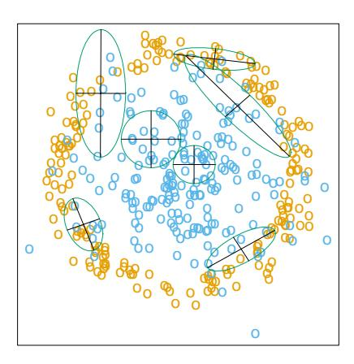

**FIGURE 13.14.** Neighborhoods found by the DANN procedure, at various query points (centers of the crosses). There are two classes in the data, with one class surrounding the other. 50 nearest-neighbors were used to estimate the local metrics. Shown are the resulting metrics used to form 15-nearest-neighborhoods.

in these cases the between matrix  $\mathbf{B} = 0$ , and the  $\Sigma$  in (13.8) is the identity matrix.

#### 13.4.1 Example

Here we generate two-class data in ten dimensions, analogous to the twodimensional example of Figure 13.14. All ten predictors in class 1 are independent standard normal, conditioned on the squared radius being greater than 22.4 and less than 40, while the predictors in class 2 are independent standard normal without the restriction. There are 250 observations in each class. Hence the first class almost completely surrounds the second class in the full ten-dimensional space.

In this example there are no pure noise variables, the kind that a nearestneighbor subset selection rule might be able to weed out. At any given point in the feature space, the class discrimination occurs along only one direction. However, this direction changes as we move across the feature space and all variables are important somewhere in the space.

Figure 13.15 shows boxplots of the test error rates over ten realizations, for standard 5-nearest-neighbors, LVQ, and discriminant adaptive 5-nearest-neighbors. We used 50 prototypes per class for LVQ, to make it comparable to 5 nearest-neighbors (since 250/5 = 50). The adaptive metric significantly reduces the error rate, compared to LVQ or standard nearest-neighbors.

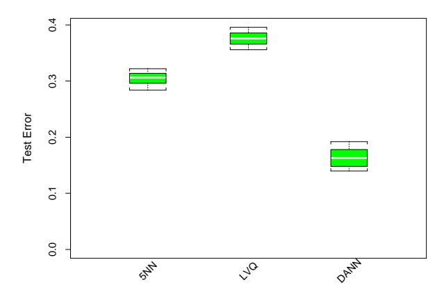

FIGURE 13.15. Ten-dimensional simulated example: boxplots of the test error rates over ten realizations, for standard 5-nearest-neighbors, LVQ with 50 centers, and discriminant-adaptive 5-nearest-neighbors

#### 13.4.2 Global Dimension Reduction for Nearest-Neighbors

The discriminant-adaptive nearest-neighbor method carries out local dimension reduction—that is, dimension reduction separately at each query point. In many problems we can also benefit from global dimension reduction, that is, apply a nearest-neighbor rule in some optimally chosen subspace of the original feature space. For example, suppose that the two classes form two nested spheres in four dimensions of feature space, and there are an additional six noise features whose distribution is independent of class. Then we would like to discover the important four-dimensional subspace, and carry out nearest-neighbor classification in that reduced subspace. Hastie and Tibshirani (1996a) discuss a variation of the discriminant-adaptive nearest-neighbor method for this purpose. At each training point  $x_i$ , the between-centroids sum of squares matrix  $\mathbf{B}_i$  is computed, and then these matrices are averaged over all training points:

$$\bar{\mathbf{B}} = \frac{1}{N} \sum_{i=1}^{N} \mathbf{B}_{i}.$$
 (13.10)

Let  $e_1, e_2, \ldots, e_p$  be the eigenvectors of the matrix  $\bar{\mathbf{B}}$ , ordered from largest to smallest eigenvalue  $\theta_k$ . Then these eigenvectors span the optimal subspaces for global subspace reduction. The derivation is based on the fact that the best rank-L approximation to  $\bar{\mathbf{B}}$ ,  $\bar{\mathbf{B}}_{[L]} = \sum_{\ell=1}^{L} \theta_{\ell} e_{\ell} e_{\ell}^{T}$ , solves the least squares problem

$$\min_{\text{rank}(\mathbf{M})=L} \sum_{i=1}^{N} \text{trace}[(\mathbf{B}_i - \mathbf{M})^2].$$
 (13.11)

Since each  $\mathbf{B}_i$  contains information on (a) the local discriminant subspace, and (b) the strength of discrimination in that subspace, (13.11) can be seen

as a way of finding the best approximating subspace of dimension L to a series of N subspaces by weighted least squares (Exercise 13.5.)

In the four-dimensional sphere example mentioned above and examined in Hastie and Tibshirani (1996a), four of the eigenvalues θℓ turn out to be large (having eigenvectors nearly spanning the interesting subspace), and the remaining six are near zero. Operationally, we project the data into the leading four-dimensional subspace, and then carry out nearest neighbor classification. In the satellite image classification example in Section 13.3.2, the technique labeled DANN in Figure 13.8 used 5-nearest-neighbors in a globally reduced subspace. There are also connections of this technique with the sliced inverse regression proposal of Duan and Li (1991). These authors use similar ideas in the regression setting, but do global rather than local computations. They assume and exploit spherical symmetry of the feature distribution to estimate interesting subspaces.

# 13.5 Computational Considerations

One drawback of nearest-neighbor rules in general is the computational load, both in finding the neighbors and storing the entire training set. With N observations and p predictors, nearest-neighbor classification requires N p operations to find the neighbors per query point. There are fast algorithms for finding nearest-neighbors (Friedman et al., 1975; Friedman et al., 1977) which can reduce this load somewhat. Hastie and Simard (1998) reduce the computations for tangent distance by developing analogs of K-means clustering in the context of this invariant metric.

Reducing the storage requirements is more difficult, and various editing and condensing procedures have been proposed. The idea is to isolate a subset of the training set that suffices for nearest-neighbor predictions, and throw away the remaining training data. Intuitively, it seems important to keep the training points that are near the decision boundaries and on the correct side of those boundaries, while some points far from the boundaries could be discarded.

The multi-edit algorithm of Devijver and Kittler (1982) divides the data cyclically into training and test sets, computing a nearest neighbor rule on the training set and deleting test points that are misclassified. The idea is to keep homogeneous clusters of training observations.

The condensing procedure of Hart (1968) goes further, trying to keep only important exterior points of these clusters. Starting with a single randomly chosen observation as the training set, each additional data item is processed one at a time, adding it to the training set only if it is misclassified by a nearest-neighbor rule computed on the current training set.

These procedures are surveyed in Dasarathy (1991) and Ripley (1996). They can also be applied to other learning procedures besides nearestneighbors. While such methods are sometimes useful, we have not had much practical experience with them, nor have we found any systematic comparison of their performance in the literature.

# Bibliographic Notes

The nearest-neighbor method goes back at least to Fix and Hodges (1951). The extensive literature on the topic is reviewed by Dasarathy (1991); Chapter 6 of Ripley (1996) contains a good summary. K-means clustering is due to Lloyd (1957) and MacQueen (1967). Kohonen (1989) introduced learning vector quantization. The tangent distance method is due to Simard et al. (1993). Hastie and Tibshirani (1996a) proposed the discriminant adaptive nearest-neighbor technique.

# Exercises

Ex. 13.1 Consider a Gaussian mixture model where the covariance matrices are assumed to be scalar: Σr = σI ∀r = 1, . . . , R, and σ is a fixed parameter. Discuss the analogy between the K-means clustering algorithm and the EM algorithm for fitting this mixture model in detail. Show that in the limit σ → 0 the two methods coincide.

Ex. 13.2 Derive formula (13.7) for the median radius of the 1-nearestneighborhood.

Ex. 13.3 Let E∗ be the error rate of the Bayes rule in a K-class problem, where the true class probabilities are given by pk(x), k = 1, . . . , K. Assuming the test point and training point have identical features x, prove (13.5)

$$\sum_{k=1}^{K} p_k(x)(1 - p_k(x)) \le 2(1 - p_{k^*}(x)) - \frac{K}{K - 1}(1 - p_{k^*}(x))^2.$$

where k ∗ = arg maxk pk(x). Hence argue that the error rate of the 1 nearest-neighbor rule converges in L1, as the size of the training set increases, to a value E1, bounded above by

$$E^* \left( 2 - E^* \frac{K}{K - 1} \right). \tag{13.12}$$

[This statement of the theorem of Cover and Hart (1967) is taken from Chapter 6 of Ripley (1996), where a short proof is also given].

Ex. 13.4 Consider an image to be a function  $F(x): \mathbb{R}^2 \to \mathbb{R}^1$  over the twodimensional spatial domain (paper coordinates). Then  $F(c+x_0+\mathbf{A}(x-x_0))$  represents an affine transformation of the image F, where  $\mathbf{A}$  is a  $2 \times 2$  matrix.

- 1. Decompose A (via Q-R) in such a way that parameters identifying the four affine transformations (two scale, shear and rotation) are clearly identified.
- 2. Using the chain rule, show that the derivative of  $F(c+x_0+\mathbf{A}(x-x_0))$  w.r.t. each of these parameters can be represented in terms of the two spatial derivatives of F.
- 3. Using a two-dimensional kernel smoother (Chapter 6), describe how to implement this procedure when the images are quantized to  $16 \times 16$  pixels.

Ex. 13.5 Let  $\mathbf{B}_i, i = 1, 2, ..., N$  be square  $p \times p$  positive semi-definite matrices and let  $\bar{\mathbf{B}} = (1/N) \sum \mathbf{B}_i$ . Write the eigen-decomposition of  $\bar{\mathbf{B}}$  as  $\sum_{\ell=1}^p \theta_\ell e_\ell e_\ell^T$  with  $\theta_\ell \geq \theta_{\ell-1} \geq ... \geq \theta_1$ . Show that the best rank-L approximation for the  $\mathbf{B}_i$ ,

$$\min_{\text{rank}(\mathbf{M})=L} \sum_{i=1}^{N} \text{trace}[(\mathbf{B}_i - \mathbf{M})^2],$$

is given by  $\bar{\mathbf{B}}_{[L]} = \sum_{\ell=1}^L \theta_\ell e_\ell e_\ell^T$ . (*Hint:* Write  $\sum_{i=1}^N \operatorname{trace}[(\mathbf{B}_i - \mathbf{M})^2]$  as

$$\sum_{i=1}^{N} \operatorname{trace}[(\mathbf{B}_{i} - \bar{\mathbf{B}})^{2}] + \sum_{i=1}^{N} \operatorname{trace}[(\mathbf{M} - \bar{\mathbf{B}})^{2}]).$$

Ex. 13.6 Here we consider the problem of shape averaging. In particular,  $\mathbf{L}_i$ ,  $i=1,\ldots,M$  are each  $N\times 2$  matrices of points in  $\mathbb{R}^2$ , each sampled from corresponding positions of handwritten (cursive) letters. We seek an affine invariant average  $\mathbf{V}$ , also  $N\times 2$ ,  $\mathbf{V}^T\mathbf{V}=I$ , of the M letters  $\mathbf{L}_i$  with the following property:  $\mathbf{V}$  minimizes

$$\sum_{j=1}^{M} \min_{\mathbf{A}_j} \|\mathbf{L}_j - \mathbf{V}\mathbf{A}_j\|^2.$$

Characterize the solution.

This solution can suffer if some of the letters are *big* and dominate the average. An alternative approach is to minimize instead:

$$\sum_{j=1}^{M} \min_{\mathbf{A}_j} \left\| \mathbf{L}_j \mathbf{A}_j^* - \mathbf{V} \right\|^2.$$

Derive the solution to this problem. How do the criteria differ? Use the SVD of the  $\mathbf{L}_{j}$  to simplify the comparison of the two approaches.

Ex. 13.7 Consider the application of nearest-neighbors to the "easy" and "hard" problems in the left panel of Figure 13.5.

- 1. Replicate the results in the left panel of Figure 13.5.
- 2. Estimate the misclassification errors using fivefold cross-validation, and compare the error rate curves to those in 1.
- 3. Consider an "AIC-like" penalization of the training set misclassification error. Specifically, add 2t/N to the training set misclassification error, where t is the approximate number of parameters N/r, r being the number of nearest-neighbors. Compare plots of the resulting penalized misclassification error to those in 1 and 2. Which method gives a better estimate of the optimal number of nearest-neighbors: cross-validation or AIC?

Ex. 13.8 Generate data in two classes, with two features. These features are all independent Gaussian variates with standard deviation 1. Their mean vectors are (−1, −1) in class 1 and (1, 1) in class 2. To each feature vector apply a random rotation of angle θ, θ chosen uniformly from 0 to 2π. Generate 50 observations from each class to form the training set, and 500 in each class as the test set. Apply four different classifiers:

- 1. Nearest-neighbors.
- 2. Nearest-neighbors with hints: ten randomly rotated versions of each data point are added to the training set before applying nearestneighbors.
- 3. Invariant metric nearest-neighbors, using Euclidean distance invariant to rotations about the origin.
- 4. Tangent distance nearest-neighbors.

In each case choose the number of neighbors by tenfold cross-validation. Compare the results.