# Unsupervised Learning

#### 14.1 Introduction

The previous chapters have been concerned with predicting the values of one or more outputs or response variables  $Y=(Y_1,\ldots,Y_m)$  for a given set of input or predictor variables  $X^T=(X_1,\ldots,X_p)$ . Denote by  $x_i^T=(x_{i1},\ldots,x_{ip})$  the inputs for the ith training case, and let  $y_i$  be a response measurement. The predictions are based on the training sample  $(x_1,y_1),\ldots,(x_N,y_N)$  of previously solved cases, where the joint values of all of the variables are known. This is called supervised learning or "learning with a teacher." Under this metaphor the "student" presents an answer  $\hat{y}_i$  for each  $x_i$  in the training sample, and the supervisor or "teacher" provides either the correct answer and/or an error associated with the student's answer. This is usually characterized by some loss function  $L(y,\hat{y})$ , for example,  $L(y,\hat{y}) = (y-\hat{y})^2$ .

If one supposes that (X,Y) are random variables represented by some joint probability density  $\Pr(X,Y)$ , then supervised learning can be formally characterized as a density estimation problem where one is concerned with determining properties of the conditional density  $\Pr(Y|X)$ . Usually the properties of interest are the "location" parameters  $\mu$  that minimize the expected error at each x,

$$\mu(x) = \operatorname*{argmin}_{\theta} E_{Y|X} L(Y, \theta). \tag{14.1}$$

Conditioning one has

$$\Pr(X, Y) = \Pr(Y|X) \cdot \Pr(X),$$

where Pr(X) is the joint marginal density of the X values alone. In supervised learning Pr(X) is typically of no direct concern. One is interested mainly in the properties of the conditional density Pr(Y |X). Since Y is often of low dimension (usually one), and only its location µ(x) is of interest, the problem is greatly simplified. As discussed in the previous chapters, there are many approaches for successfully addressing supervised learning in a variety of contexts.

In this chapter we address unsupervised learning or "learning without a teacher." In this case one has a set of N observations (x1, x2, . . . , x<sup>N</sup> ) of a random p-vector X having joint density Pr(X). The goal is to directly infer the properties of this probability density without the help of a supervisor or teacher providing correct answers or degree-of-error for each observation. The dimension of X is sometimes much higher than in supervised learning, and the properties of interest are often more complicated than simple location estimates. These factors are somewhat mitigated by the fact that X represents all of the variables under consideration; one is not required to infer how the properties of Pr(X) change, conditioned on the changing values of another set of variables.

In low-dimensional problems (say p ≤ 3), there are a variety of effective nonparametric methods for directly estimating the density Pr(X) itself at all X-values, and representing it graphically (Silverman, 1986, e.g.). Owing to the curse of dimensionality, these methods fail in high dimensions. One must settle for estimating rather crude global models, such as Gaussian mixtures or various simple descriptive statistics that characterize Pr(X).

Generally, these descriptive statistics attempt to characterize X-values, or collections of such values, where Pr(X) is relatively large. Principal components, multidimensional scaling, self-organizing maps, and principal curves, for example, attempt to identify low-dimensional manifolds within the X-space that represent high data density. This provides information about the associations among the variables and whether or not they can be considered as functions of a smaller set of "latent" variables. Cluster analysis attempts to find multiple convex regions of the X-space that contain modes of Pr(X). This can tell whether or not Pr(X) can be represented by a mixture of simpler densities representing distinct types or classes of observations. Mixture modeling has a similar goal. Association rules attempt to construct simple descriptions (conjunctive rules) that describe regions of high density in the special case of very high dimensional binary-valued data.

With supervised learning there is a clear measure of success, or lack thereof, that can be used to judge adequacy in particular situations and to compare the effectiveness of different methods over various situations. Lack of success is directly measured by expected loss over the joint distribution Pr(X, Y ). This can be estimated in a variety of ways including cross-validation. In the context of unsupervised learning, there is no such direct measure of success. It is difficult to ascertain the validity of inferences drawn from the output of most unsupervised learning algorithms. One must resort to heuristic arguments not only for motivating the algorithms, as is often the case in supervised learning as well, but also for judgments as to the quality of the results. This uncomfortable situation has led to heavy proliferation of proposed methods, since effectiveness is a matter of opinion and cannot be verified directly.

In this chapter we present those unsupervised learning techniques that are among the most commonly used in practice, and additionally, a few others that are favored by the authors.

# 14.2 Association Rules

Association rule analysis has emerged as a popular tool for mining commercial data bases. The goal is to find joint values of the variables X = (X1, X2, . . . , Xp) that appear most frequently in the data base. It is most often applied to binary-valued data X<sup>j</sup> ∈ {0, 1}, where it is referred to as "market basket" analysis. In this context the observations are sales transactions, such as those occurring at the checkout counter of a store. The variables represent all of the items sold in the store. For observation i, each variable X<sup>j</sup> is assigned one of two values; xij = 1 if the jth item is purchased as part of the transaction, whereas xij = 0 if it was not purchased. Those variables that frequently have joint values of one represent items that are frequently purchased together. This information can be quite useful for stocking shelves, cross-marketing in sales promotions, catalog design, and consumer segmentation based on buying patterns.

More generally, the basic goal of association rule analysis is to find a collection of prototype X-values v1, . . . , v<sup>L</sup> for the feature vector X, such that the probability density Pr(vl) evaluated at each of those values is relatively large. In this general framework, the problem can be viewed as "mode finding" or "bump hunting." As formulated, this problem is impossibly difficult. A natural estimator for each Pr(vl) is the fraction of observations for which X = v<sup>l</sup> . For problems that involve more than a small number of variables, each of which can assume more than a small number of values, the number of observations for which X = v<sup>l</sup> will nearly always be too small for reliable estimation. In order to have a tractable problem, both the goals of the analysis and the generality of the data to which it is applied must be greatly simplified.

The first simplification modifies the goal. Instead of seeking values x where Pr(x) is large, one seeks regions of the X-space with high probability content relative to their size or support. Let  $S_j$  represent the set of all possible values of the jth variable (its support), and let  $s_j \subseteq S_j$  be a subset of these values. The modified goal can be stated as attempting to find subsets of variable values  $s_1, \ldots, s_p$  such that the probability of each of the variables simultaneously assuming a value within its respective subset,

$$\Pr\left[\bigcap_{j=1}^{p} (X_j \in s_j)\right],\tag{14.2}$$

is relatively large. The intersection of subsets  $\bigcap_{j=1}^{p} (X_j \in s_j)$  is called a *conjunctive rule*. For quantitative variables the subsets  $s_j$  are contiguous intervals; for categorical variables the subsets are delineated explicitly. Note that if the subset  $s_j$  is in fact the entire set of values  $s_j = \mathcal{S}_j$ , as is often the case, the variable  $X_j$  is said *not* to appear in the rule (14.2).

#### 14.2.1 Market Basket Analysis

General approaches to solving (14.2) are discussed in Section 14.2.5. These can be quite useful in many applications. However, they are not feasible for the very large ( $p \approx 10^4$ ,  $N \approx 10^8$ ) commercial data bases to which market basket analysis is often applied. Several further simplifications of (14.2) are required. First, only two types of subsets are considered; either  $s_j$  consists of a single value of  $X_j$ ,  $s_j = v_{0j}$ , or it consists of the entire set of values that  $X_j$  can assume,  $s_j = \mathcal{S}_j$ . This simplifies the problem (14.2) to finding subsets of the integers  $\mathcal{J} \subset \{1, \ldots, p\}$ , and corresponding values  $v_{0j}$ ,  $j \in \mathcal{J}$ , such that

$$\Pr\left[\bigcap_{j\in\mathcal{J}}(X_j=v_{0j})\right] \tag{14.3}$$

is large. Figure 14.1 illustrates this assumption.

One can apply the technique of dummy variables to turn (14.3) into a problem involving only binary-valued variables. Here we assume that the support  $S_j$  is finite for each variable  $X_j$ . Specifically, a new set of variables  $Z_1, \ldots, Z_K$  is created, one such variable for each of the values  $v_{lj}$  attainable by each of the original variables  $X_1, \ldots, X_p$ . The number of dummy variables K is

$$K = \sum_{j=1}^{p} |\mathcal{S}_j|,$$

where  $|S_j|$  is the number of distinct values attainable by  $X_j$ . Each dummy variable is assigned the value  $Z_k = 1$  if the variable with which it is associated takes on the corresponding value to which  $Z_k$  is assigned, and  $Z_k = 0$  otherwise. This transforms (14.3) to finding a subset of the integers  $\mathcal{K} \subset \{1, \ldots, K\}$  such that

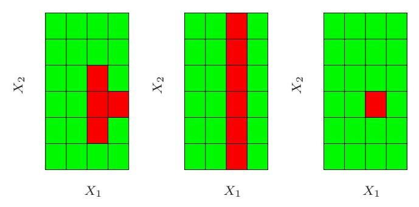

**FIGURE 14.1.** Simplifications for association rules. Here there are two inputs  $X_1$  and  $X_2$ , taking four and six distinct values, respectively. The red squares indicate areas of high density. To simplify the computations, we assume that the derived subset corresponds to either a single value of an input or all values. With this assumption we could find either the middle or right pattern, but not the left one.

$$\Pr\left[\bigcap_{k\in\mathcal{K}}(Z_k=1)\right] = \Pr\left[\prod_{k\in\mathcal{K}}Z_k=1\right]$$
 (14.4)

is large. This is the standard formulation of the market basket problem. The set  $\mathcal{K}$  is called an "item set." The number of variables  $Z_k$  in the item set is called its "size" (note that the size is no bigger than p). The estimated value of (14.4) is taken to be the fraction of observations in the data base for which the conjunction in (14.4) is true:

$$\widehat{\Pr}\left[\prod_{k\in\mathcal{K}}(Z_k=1)\right] = \frac{1}{N}\sum_{i=1}^N \prod_{k\in\mathcal{K}} z_{ik}.$$
(14.5)

Here  $z_{ik}$  is the value of  $Z_k$  for this *i*th case. This is called the "support" or "prevalence"  $T(\mathcal{K})$  of the item set  $\mathcal{K}$ . An observation *i* for which  $\prod_{k \in \mathcal{K}} z_{ik} = 1$  is said to "contain" the item set  $\mathcal{K}$ .

In association rule mining a lower support bound t is specified, and one seeks *all* item sets  $\mathcal{K}_l$  that can be formed from the variables  $Z_1, \ldots, Z_K$  with support in the data base greater than this lower bound t

$$\{\mathcal{K}_l | T(\mathcal{K}_l) > t\}. \tag{14.6}$$

#### 14.2.2 The Apriori Algorithm

The solution to this problem (14.6) can be obtained with feasible computation for very large data bases provided the threshold t is adjusted so that (14.6) consists of only a small fraction of all  $2^K$  possible item sets. The "Apriori" algorithm (Agrawal et al., 1995) exploits several aspects of the

curse of dimensionality to solve (14.6) with a small number of passes over the data. Specifically, for a given support threshold t:

- The cardinality  $|\{\mathcal{K}| T(\mathcal{K}) > t\}|$  is relatively small.
- Any item set  $\mathcal{L}$  consisting of a subset of the items in  $\mathcal{K}$  must have support greater than or equal to that of  $\mathcal{K}$ ,  $\mathcal{L} \subseteq \mathcal{K} \Rightarrow T(\mathcal{L}) \geq T(\mathcal{K})$ .

The first pass over the data computes the support of all single-item sets. Those whose support is less than the threshold are discarded. The second pass computes the support of all item sets of size two that can be formed from pairs of the single items surviving the first pass. In other words, to generate all frequent itemsets with  $|\mathcal{K}| = m$ , we need to consider only candidates such that all of their m ancestral item sets of size m-1 are frequent. Those size-two item sets with support less than the threshold are discarded. Each successive pass over the data considers only those item sets that can be formed by combining those that survived the previous pass with those retained from the first pass. Passes over the data continue until all candidate rules from the previous pass have support less than the specified threshold. The Apriori algorithm requires only one pass over the data for each value of  $|\mathcal{K}|$ , which is crucial since we assume the data cannot be fitted into a computer's main memory. If the data are sufficiently sparse (or if the threshold t is high enough), then the process will terminate in reasonable time even for huge data sets.

There are many additional tricks that can be used as part of this strategy to increase speed and convergence (Agrawal et al., 1995). The Apriori algorithm represents one of the major advances in data mining technology.

Each high support item set K (14.6) returned by the Apriori algorithm is cast into a set of "association rules." The items  $Z_k$ ,  $k \in K$ , are partitioned into two disjoint subsets,  $A \cup B = K$ , and written

$$A \Rightarrow B.$$
 (14.7)

The first item subset A is called the "antecedent" and the second B the "consequent." Association rules are defined to have several properties based on the prevalence of the antecedent and consequent item sets in the data base. The "support" of the rule  $T(A\Rightarrow B)$  is the fraction of observations in the union of the antecedent and consequent, which is just the support of the item set  $\mathcal K$  from which they were derived. It can be viewed as an estimate (14.5) of the probability of simultaneously observing both item sets  $\Pr(A \text{ and } B)$  in a randomly selected market basket. The "confidence" or "predictability"  $C(A\Rightarrow B)$  of the rule is its support divided by the support of the antecedent

$$C(A \Rightarrow B) = \frac{T(A \Rightarrow B)}{T(A)},$$
 (14.8)

which can be viewed as an estimate of Pr(B | A). The notation Pr(A), the probability of an item set A occurring in a basket, is an abbreviation for

 $\Pr(\prod_{k\in A} Z_k = 1)$ . The "expected confidence" is defined as the support of the consequent T(B), which is an estimate of the unconditional probability  $\Pr(B)$ . Finally, the "lift" of the rule is defined as the confidence divided by the expected confidence

$$L(A \Rightarrow B) = \frac{C(A \Rightarrow B)}{T(B)}.$$

This is an estimate of the association measure Pr(A and B)/Pr(A)Pr(B).

As an example, suppose the item set  $\mathcal{K} = \{\text{peanut butter, jelly}, \text{bread}\}$  and consider the rule  $\{\text{peanut butter, jelly}\} \Rightarrow \{\text{bread}\}$ . A support value of 0.03 for this rule means that peanut butter, jelly, and bread appeared together in 3% of the market baskets. A confidence of 0.82 for this rule implies that when peanut butter and jelly were purchased, 82% of the time bread was also purchased. If bread appeared in 43% of all market baskets then the rule  $\{\text{peanut butter, jelly}\} \Rightarrow \{\text{bread}\}$  would have a lift of 1.95.

The goal of this analysis is to produce association rules (14.7) with both high values of support and confidence (14.8). The Apriori algorithm returns all item sets with high support as defined by the support threshold t (14.6). A confidence threshold c is set, and all rules that can be formed from those item sets (14.6) with confidence greater than this value

$$\{A \Rightarrow B \mid C(A \Rightarrow B) > c\} \tag{14.9}$$

are reported. For each item set  $\mathcal{K}$  of size  $|\mathcal{K}|$  there are  $2^{|\mathcal{K}|-1}-1$  rules of the form  $A \Rightarrow (\mathcal{K} - A)$ ,  $A \subset \mathcal{K}$ . Agrawal et al. (1995) present a variant of the Apriori algorithm that can rapidly determine which rules survive the confidence threshold (14.9) from all possible rules that can be formed from the solution item sets (14.6).

The output of the entire analysis is a collection of association rules (14.7) that satisfy the constraints

$$T(A \Rightarrow B) > t$$
 and  $C(A \Rightarrow B) > c$ .

These are generally stored in a data base that can be queried by the user. Typical requests might be to display the rules in sorted order of confidence, lift or support. More specifically, one might request such a list conditioned on particular items in the antecedent or especially the consequent. For example, a request might be the following:

Display all transactions in which ice skates are the consequent that have confidence over 80% and support of more than 2%.

This could provide information on those items (antecedent) that predicate sales of ice skates. Focusing on a particular consequent casts the problem into the framework of supervised learning.

Association rules have become a popular tool for analyzing very large commercial data bases in settings where market basket is relevant. That is when the data can be cast in the form of a multidimensional contingency table. The output is in the form of conjunctive rules (14.4) that are easily understood and interpreted. The Apriori algorithm allows this analysis to be applied to huge data bases, much larger that are amenable to other types of analyses. Association rules are among data mining's biggest successes.

Besides the restrictive form of the data to which they can be applied, association rules have other limitations. Critical to computational feasibility is the support threshold (14.6). The number of solution item sets, their size, and the number of passes required over the data can grow exponentially with decreasing size of this lower bound. Thus, rules with high confidence or lift, but low support, will not be discovered. For example, a high confidence rule such as vodka ⇒ caviar will not be uncovered owing to the low sales volume of the consequent caviar.

## 14.2.3 Example: Market Basket Analysis

We illustrate the use of Apriori on a moderately sized demographics data base. This data set consists of N = 9409 questionnaires filled out by shopping mall customers in the San Francisco Bay Area (Impact Resources, Inc., Columbus OH, 1987). Here we use answers to the first 14 questions, relating to demographics, for illustration. These questions are listed in Table 14.1. The data are seen to consist of a mixture of ordinal and (unordered) categorical variables, many of the latter having more than a few values. There are many missing values.

We used a freeware implementation of the Apriori algorithm due to Christian Borgelt<sup>1</sup> . After removing observations with missing values, each ordinal predictor was cut at its median and coded by two dummy variables; each categorical predictor with k categories was coded by k dummy variables. This resulted in a 6876 × 50 matrix of 6876 observations on 50 dummy variables.

The algorithm found a total of 6288 association rules, involving ≤ 5 predictors, with support of at least 10%. Understanding this large set of rules is itself a challenging data analysis task. We will not attempt this here, but only illustrate in Figure 14.2 the relative frequency of each dummy variable in the data (top) and the association rules (bottom). Prevalent categories tend to appear more often in the rules, for example, the first category in language (English). However, others such as occupation are under-represented, with the exception of the first and fifth level.

Here are three examples of association rules found by the Apriori algorithm:

Association rule 1: Support 25%, confidence 99.7% and lift 1.03.

<sup>1</sup>See http://fuzzy.cs.uni-magdeburg.de/∼borgelt.

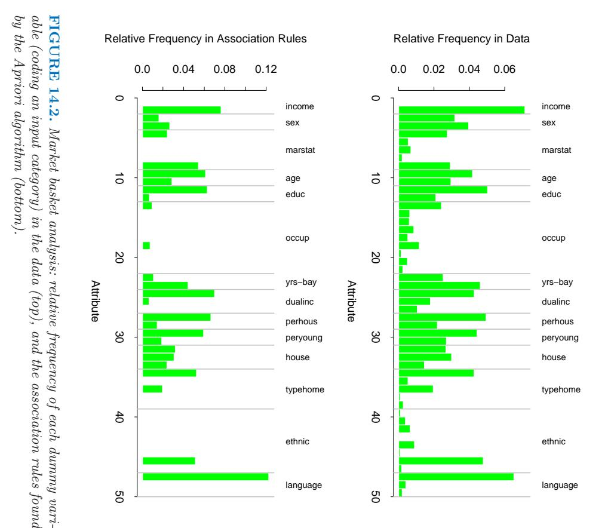

| Feature | Demographic           | # Values | Type        |
|---------|-----------------------|----------|-------------|
|         |                       |          |             |
| 1       | Sex                   | 2        | Categorical |
| 2       | Marital status        | 5        | Categorical |
| 3       | Age                   | 7        | Ordinal     |
| 4       | Education             | 6        | Ordinal     |
| 5       | Occupation            | 9        | Categorical |
| 6       | Income                | 9        | Ordinal     |
| 7       | Years in Bay Area     | 5        | Ordinal     |
| 8       | Dual incomes          | 3        | Categorical |
| 9       | Number in household   | 9        | Ordinal     |
| 10      | Number of children    | 9        | Ordinal     |
| 11      | Householder status    | 3        | Categorical |
| 12      | Type of home          | 5        | Categorical |
| 13      | Ethnic classification | 8        | Categorical |
| 14      | Language in home      | 3        | Categorical |

TABLE 14.1. Inputs for the demographic data.

$$\begin{bmatrix} \text{ number in household } = 1 \\ \text{ number of children } = 0 \end{bmatrix}$$

$$\downarrow \downarrow$$

$$\text{language in home } = English$$

Association rule 2: Support 13.4%, confidence 80.8%, and lift 2.13.

```
\begin{bmatrix} \text{language in home} &=& English \\ \text{householder status} &=& own \\ \text{occupation} &=& \{professional/managerial\} \end{bmatrix}
\downarrow \downarrow
\text{income} \geq \$40,000
```

Association rule 3: Support 26.5%, confidence 82.8% and lift 2.15.

```
 \begin{bmatrix} \text{language in home} &=& \textit{English} \\ \text{income} &<& \$40,000 \\ \text{marital status} &=& \textit{not married} \\ \text{number of children} &=& 0 \\ & & & & & \\ \end{bmatrix}
```

education  $\notin \{college\ graduate,\ graduate\ study\}$ 

We chose the first and third rules based on their high support. The second rule is an association rule with a high-income consequent, and could be used to try to target high-income individuals.

As stated above, we created dummy variables for each category of the input predictors, for example, Z<sup>1</sup> = I(income < \$40, 000) and Z<sup>2</sup> = I(income ≥ \$40, 000) for below and above the median income. If we were interested only in finding associations with the high-income category, we would include Z<sup>2</sup> but not Z1. This is often the case in actual market basket problems, where we are interested in finding associations with the presence of a relatively rare item, but not associations with its absence.

# 14.2.4 Unsupervised as Supervised Learning

Here we discuss a technique for transforming the density estimation problem into one of supervised function approximation. This forms the basis for the generalized association rules described in the next section.

Let g(x) be the unknown data probability density to be estimated, and g0(x) be a specified probability density function used for reference. For example, g0(x) might be the uniform density over the range of the variables. Other possibilities are discussed below. The data set x1, x2, . . . , x<sup>N</sup> is presumed to be an i.i.d. random sample drawn from g(x). A sample of size N<sup>0</sup> can be drawn from g0(x) using Monte Carlo methods. Pooling these two data sets, and assigning mass w = N0/(N + N0) to those drawn from g(x), and w<sup>0</sup> = N/(N + N0) to those drawn from g0(x), results in a random sample drawn from the mixture density (g(x) + g0(x)) /2. If one assigns the value Y = 1 to each sample point drawn from g(x) and Y = 0 those drawn from g0(x), then

$$\mu(x) = E(Y \mid x) = \frac{g(x)}{g(x) + g_0(x)}$$

$$= \frac{g(x)/g_0(x)}{1 + g(x)/g_0(x)}$$
(14.10)

can be estimated by supervised learning using the combined sample

$$(y_1, x_1), (y_2, x_2), \dots, (y_{N+N_0}, x_{N+N_0})$$
 (14.11)

as training data. The resulting estimate ˆµ(x) can be inverted to provide an estimate for g(x)

$$\hat{g}(x) = g_0(x) \frac{\hat{\mu}(x)}{1 - \hat{\mu}(x)}.$$
(14.12)

Generalized versions of logistic regression (Section 4.4) are especially well suited for this application since the log-odds,

$$f(x) = \log \frac{g(x)}{g_0(x)},$$
 (14.13)

are estimated directly. In this case one has

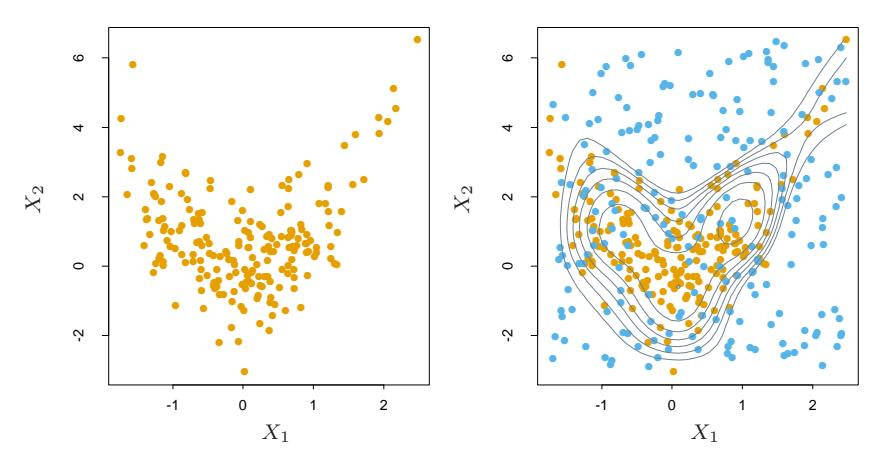

**FIGURE 14.3.** Density estimation via classification. (Left panel:) Training set of 200 data points. (Right panel:) Training set plus 200 reference data points, generated uniformly over the rectangle containing the training data. The training sample was labeled as class 1, and the reference sample class 0, and a semiparametric logistic regression model was fit to the data. Some contours for  $\hat{g}(x)$  are shown.

$$\hat{g}(x) = g_0(x) e^{\hat{f}(x)}. \tag{14.14}$$

An example is shown in Figure 14.3. We generated a training set of size 200 shown in the left panel. The right panel shows the reference data (blue) generated uniformly over the rectangle containing the training data. The training sample was labeled as class 1, and the reference sample class 0, and a logistic regression model, using a tensor product of natural splines (Section 5.2.1), was fit to the data. Some probability contours of  $\hat{\mu}(x)$  are shown in the right panel; these are also the contours of the density estimate  $\hat{g}(x)$ , since  $\hat{g}(x) = \hat{\mu}(x)/(1-\hat{\mu}(x))$ , is a monotone function. The contours roughly capture the data density.

In principle any reference density can be used for  $g_0(x)$  in (14.14). In practice the accuracy of the estimate  $\hat{g}(x)$  can depend greatly on particular choices. Good choices will depend on the data density g(x) and the procedure used to estimate (14.10) or (14.13). If accuracy is the goal,  $g_0(x)$  should be chosen so that the resulting functions  $\mu(x)$  or f(x) are approximated easily by the method being used. However, accuracy is not always the primary goal. Both  $\mu(x)$  and f(x) are monotonic functions of the density ratio  $g(x)/g_0(x)$ . They can thus be viewed as "contrast" statistics that provide information concerning departures of the data density g(x) from the chosen reference density  $g_0(x)$ . Therefore, in data analytic settings, a choice for  $g_0(x)$  is dictated by types of departures that are deemed most interesting in the context of the specific problem at hand. For example, if departures from uniformity are of interest,  $g_0(x)$  might be the a uniform density over the range of the variables. If departures from joint normality

are of interest, a good choice for  $g_0(x)$  would be a Gaussian distribution with the same mean vector and covariance matrix as the data. Departures from independence could be investigated by using

$$g_0(x) = \prod_{j=1}^p g_j(x_j), \tag{14.15}$$

where  $g_j(x_j)$  is the marginal data density of  $X_j$ , the jth coordinate of X. A sample from this independent density (14.15) is easily generated from the data itself by applying a different random permutation to the data values of each of the variables.

As discussed above, unsupervised learning is concerned with revealing properties of the data density q(x). Each technique focuses on a particular property or set of properties. Although this approach of transforming the problem to one of supervised learning (14.10)–(14.14) seems to have been part of the statistics folklore for some time, it does not appear to have had much impact despite its potential to bring well-developed supervised learning methodology to bear on unsupervised learning problems. One reason may be that the problem must be enlarged with a simulated data set generated by Monte Carlo techniques. Since the size of this data set should be at least as large as the data sample  $N_0 \geq N$ , the computation and memory requirements of the estimation procedure are at least doubled. Also, substantial computation may be required to generate the Monte Carlo sample itself. Although perhaps a deterrent in the past, these increased computational requirements are becoming much less of a burden as increased resources become routinely available. We illustrate the use of supervised learning methods for unsupervised learning in the next section.

## 14.2.5 Generalized Association Rules

The more general problem (14.2) of finding high-density regions in the data space can be addressed using the supervised learning approach described above. Although not applicable to the huge data bases for which market basket analysis is feasible, useful information can be obtained from moderately sized data sets. The problem (14.2) can be formulated as finding subsets of the integers  $\mathcal{J} \subset \{1, 2, \ldots, p\}$  and corresponding value subsets  $s_j$ ,  $j \in \mathcal{J}$  for the corresponding variables  $X_j$ , such that

$$\widehat{\Pr}\left(\bigcap_{j\in\mathcal{J}}(X_j\in s_j)\right) = \frac{1}{N}\sum_{i=1}^N I\left(\bigcap_{j\in\mathcal{J}}(x_{ij}\in s_j)\right)$$
(14.16)

is large. Following the nomenclature of association rule analysis,  $\{(X_j \in s_j)\}_{j \in \mathcal{J}}$  will be called a "generalized" item set. The subsets  $s_j$  corresponding to quantitative variables are taken to be contiguous intervals within

their range of values, and subsets for categorical variables can involve more than a single value. The ambitious nature of this formulation precludes a thorough search for all generalized item sets with support (14.16) greater than a specified minimum threshold, as was possible in the more restrictive setting of market basket analysis. Heuristic search methods must be employed, and the most one can hope for is to find a useful collection of such generalized item sets.

Both market basket analysis (14.5) and the generalized formulation (14.16) implicitly reference the uniform probability distribution. One seeks item sets that are more frequent than would be expected if all joint data values (x1, x2, . . . , x<sup>N</sup> ) were uniformly distributed. This favors the discovery of item sets whose marginal constituents (X<sup>j</sup> ∈ s<sup>j</sup> ) are individually frequent, that is, the quantity

$$\frac{1}{N} \sum_{i=1}^{N} I(x_{ij} \in s_j) \tag{14.17}$$

is large. Conjunctions of frequent subsets (14.17) will tend to appear more often among item sets of high support (14.16) than conjunctions of marginally less frequent subsets. This is why the rule vodka ⇒ caviar is not likely to be discovered in spite of a high association (lift); neither item has high marginal support, so that their joint support is especially small. Reference to the uniform distribution can cause highly frequent item sets with low associations among their constituents to dominate the collection of highest support item sets.

Highly frequent subsets s<sup>j</sup> are formed as disjunctions of the most frequent X<sup>j</sup> -values. Using the product of the variable marginal data densities (14.15) as a reference distribution removes the preference for highly frequent values of the individual variables in the discovered item sets. This is because the density ratio g(x)/g0(x) is uniform if there are no associations among the variables (complete independence), regardless of the frequency distribution of the individual variable values. Rules like vodka ⇒ caviar would have a chance to emerge. It is not clear however, how to incorporate reference distributions other than the uniform into the Apriori algorithm. As explained in Section 14.2.4, it is straightforward to generate a sample from the product density (14.15), given the original data set.

After choosing a reference distribution, and drawing a sample from it as in (14.11), one has a supervised learning problem with a binary-valued output variable Y ∈ {0, 1}. The goal is to use this training data to find regions

$$R = \bigcap_{j \in \mathcal{J}} (X_j \in s_j) \tag{14.18}$$

for which the target function µ(x) = E(Y | x) is relatively large. In addition, one might wish to require that the data support of these regions

$$T(R) = \int_{x \in R} g(x) dx \qquad (14.19)$$

not be too small.

## 14.2.6 Choice of Supervised Learning Method

The regions (14.18) are defined by conjunctive rules. Hence supervised methods that learn such rules would be most appropriate in this context. The terminal nodes of a CART decision tree are defined by rules precisely of the form (14.18). Applying CART to the pooled data (14.11) will produce a decision tree that attempts to model the target (14.10) over the entire data space by a disjoint set of regions (terminal nodes). Each region is defined by a rule of the form (14.18). Those terminal nodes t with high average y-values

$$\bar{y}_t = \operatorname{ave}(y_i \,|\, x_i \in t)$$

are candidates for high-support generalized item sets (14.16). The actual (data) support is given by

$$T(R) = \bar{y}_t \cdot \frac{N_t}{N + N_0},$$

where N<sup>t</sup> is the number of (pooled) observations within the region represented by the terminal node. By examining the resulting decision tree, one might discover interesting generalized item sets of relatively high-support. These can then be partitioned into antecedents and consequents in a search for generalized association rules of high confidence and/or lift.

Another natural learning method for this purpose is the patient rule induction method PRIM described in Section 9.3. PRIM also produces rules precisely of the form (14.18), but it is especially designed for finding high-support regions that maximize the average target (14.10) value within them, rather than trying to model the target function over the entire data space. It also provides more control over the support/average-target-value tradeoff.

Exercise 14.3 addresses an issue that arises with either of these methods when we generate random data from the product of the marginal distributions.

# 14.2.7 Example: Market Basket Analysis (Continued)

We illustrate the use of PRIM on the demographics data of Table 14.1.

Three of the high-support generalized item sets emerging from the PRIM analysis were the following:

Item set 1: Support= 24%.

```
 \begin{bmatrix} & \text{marital status} & = & married \\ & \text{householder status} & = & own \\ & & \text{type of home} & \neq & apartment \end{bmatrix}
```

Item set 2: Support= 24%.

```
\begin{array}{rcl} \text{age} & \leq & 24 \\ \text{marital status} & \in & \{ living \ together\text{-}not \ married, \ single \} \\ \text{occupation} & \notin & \{ professional, \ homemaker, \ retired \} \\ \text{householder status} & \in & \{ rent, \ live \ with \ family \} \end{array}
```

Item set 3: Support= 15%.

Generalized association rules derived from these item sets with confidence (14.8) greater than 95% are the following:

Association rule 1: Support 25%, confidence 99.7% and lift 1.35.

```
\begin{bmatrix} \text{marital status} &= & married \\ \text{householder status} &= & own \end{bmatrix}
\downarrow \downarrow
\text{type of home} \neq apartment
```

**Association rule 2:** Support 25%, confidence 98.7% and lift 1.97.

**Association rule 3:** Support 25%, confidence 95.9% and lift 2.61.

```
\begin{bmatrix} \text{householder status} &= & own \\ \text{type of home} &\neq & apartment \end{bmatrix}
\downarrow \downarrow
\text{marital status} = married
```

Association rule 4: Support 15%, confidence 95.4% and lift 1.50.

```
householder status = rent

type of home \neq house

number in household \leq 2

occupation \notin {homemaker, student, unemployed}
\nincome \in [$20,000, $150,000]

\downarrow \downarrow

number of children = 0
```

There are no great surprises among these particular rules. For the most part they verify intuition. In other contexts where there is less prior information available, unexpected results have a greater chance to emerge. These results do illustrate the type of information generalized association rules can provide, and that the supervised learning approach, coupled with a ruled induction method such as CART or PRIM, can uncover item sets exhibiting high associations among their constituents.

How do these generalized association rules compare to those found earlier by the Apriori algorithm? Since the Apriori procedure gives thousands of rules, it is difficult to compare them. However some general points can be made. The Apriori algorithm is exhaustive—it finds *all* rules with support greater than a specified amount. In contrast, PRIM is a greedy algorithm and is not guaranteed to give an "optimal" set of rules. On the other hand, the Apriori algorithm can deal only with dummy variables and hence could not find some of the above rules. For example, since type of home is a categorical input, with a dummy variable for each level, Apriori could not find a rule involving the set

```
type of home \neq apartment.
```

To find this set, we would have to code a dummy variable for *apartment* versus the other categories of type of home. It will not generally be feasible to precode all such potentially interesting comparisons.

### 14.3 Cluster Analysis

Cluster analysis, also called data segmentation, has a variety of goals. All relate to grouping or segmenting a collection of objects into subsets or "clusters," such that those within each cluster are more closely related to one another than objects assigned to different clusters. An object can be described by a set of measurements, or by its relation to other objects. In addition, the goal is sometimes to arrange the clusters into a natural hierarchy. This involves successively grouping the clusters themselves so

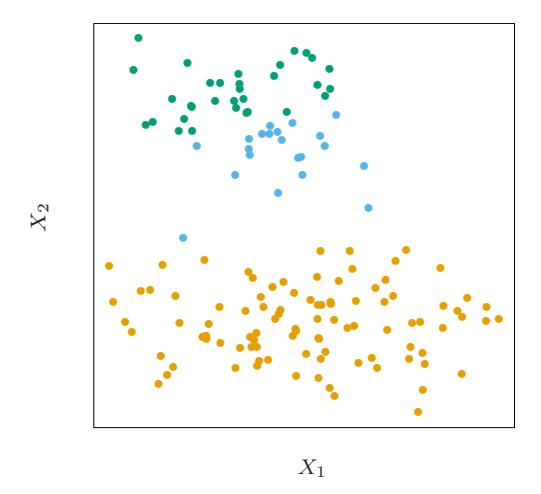

FIGURE 14.4. Simulated data in the plane, clustered into three classes (represented by orange, blue and green) by the K-means clustering algorithm

that at each level of the hierarchy, clusters within the same group are more similar to each other than those in different groups.

Cluster analysis is also used to form descriptive statistics to ascertain whether or not the data consists of a set distinct subgroups, each group representing objects with substantially different properties. This latter goal requires an assessment of the degree of difference between the objects assigned to the respective clusters.

Central to all of the goals of cluster analysis is the notion of the degree of similarity (or dissimilarity) between the individual objects being clustered. A clustering method attempts to group the objects based on the definition of similarity supplied to it. This can only come from subject matter considerations. The situation is somewhat similar to the specification of a loss or cost function in prediction problems (supervised learning). There the cost associated with an inaccurate prediction depends on considerations outside the data.

Figure 14.4 shows some simulated data clustered into three groups via the popular K-means algorithm. In this case two of the clusters are not well separated, so that "segmentation" more accurately describes the part of this process than "clustering." K-means clustering starts with guesses for the three cluster centers. Then it alternates the following steps until convergence:

• for each data point, the closest cluster center (in Euclidean distance) is identified;

• each cluster center is replaced by the coordinate-wise average of all data points that are closest to it.

We describe K-means clustering in more detail later, including the problem of how to choose the number of clusters (three in this example). Kmeans clustering is a top-down procedure, while other cluster approaches that we discuss are bottom-up. Fundamental to all clustering techniques is the choice of distance or dissimilarity measure between two objects. We first discuss distance measures before describing a variety of algorithms for clustering.

#### 14.3.1 Proximity Matrices

Sometimes the data is represented directly in terms of the proximity (alikeness or affinity) between pairs of objects. These can be either *similarities* or *dissimilarities* (difference or lack of affinity). For example, in social science experiments, participants are asked to judge by how much certain objects differ from one another. Dissimilarities can then be computed by averaging over the collection of such judgments. This type of data can be represented by an  $N \times N$  matrix  $\mathbf{D}$ , where N is the number of objects, and each element  $d_{ii'}$  records the proximity between the ith and i'th objects. This matrix is then provided as input to the clustering algorithm.

Most algorithms presume a matrix of dissimilarities with nonnegative entries and zero diagonal elements:  $d_{ii} = 0$ , i = 1, 2, ..., N. If the original data were collected as similarities, a suitable monotone-decreasing function can be used to convert them to dissimilarities. Also, most algorithms assume symmetric dissimilarity matrices, so if the original matrix  $\mathbf{D}$  is not symmetric it must be replaced by  $(\mathbf{D} + \mathbf{D}^T)/2$ . Subjectively judged dissimilarities are seldom distances in the strict sense, since the triangle inequality  $d_{ii'} \leq d_{ik} + d_{i'k}$ , for all  $k \in \{1, ..., N\}$  does not hold. Thus, some algorithms that assume distances cannot be used with such data.

#### 14.3.2 Dissimilarities Based on Attributes

Most often we have measurements  $x_{ij}$  for  $i=1,2,\ldots,N$ , on variables  $j=1,2,\ldots,p$  (also called *attributes*). Since most of the popular clustering algorithms take a dissimilarity matrix as their input, we must first construct pairwise dissimilarities between the observations. In the most common case, we define a dissimilarity  $d_j(x_{ij}, x_{i'j})$  between values of the jth attribute, and then define

$$D(x_i, x_{i'}) = \sum_{i=1}^{p} d_j(x_{ij}, x_{i'j})$$
(14.20)

as the dissimilarity between objects i and i'. By far the most common choice is squared distance

$$d_i(x_{ij}, x_{i'j}) = (x_{ij} - x_{i'j})^2. (14.21)$$

However, other choices are possible, and can lead to potentially different results. For nonquantitative attributes (e.g., categorical data), squared distance may not be appropriate. In addition, it is sometimes desirable to weigh attributes differently rather than giving them equal weight as in (14.20).

We first discuss alternatives in terms of the attribute type:

Quantitative variables. Measurements of this type of variable or attribute are represented by continuous real-valued numbers. It is natural to define the "error" between them as a monotone-increasing function of their absolute difference

$$d(x_i, x_{i'}) = l(|x_i - x_{i'}|).$$

Besides squared-error loss  $(x_i - x_{i'})^2$ , a common choice is the identity (absolute error). The former places more emphasis on larger differences than smaller ones. Alternatively, clustering can be based on the correlation

$$\rho(x_i, x_{i'}) = \frac{\sum_j (x_{ij} - \bar{x}_i)(x_{i'j} - \bar{x}_{i'})}{\sqrt{\sum_j (x_{ij} - \bar{x}_i)^2 \sum_j (x_{i'j} - \bar{x}_{i'})^2}},$$
(14.22)

with  $\bar{x}_i = \sum_j x_{ij}/p$ . Note that this is averaged over *variables*, not observations. If the *observations* are first standardized, then  $\sum_j (x_{ij} - x_{i'j})^2 \propto 2(1 - \rho(x_i, x_{i'}))$ . Hence clustering based on correlation (similarity) is equivalent to that based on squared distance (dissimilarity).

Ordinal variables. The values of this type of variable are often represented as contiguous integers, and the realizable values are considered to be an ordered set. Examples are academic grades (A, B, C, D, F), degree of preference (can't stand, dislike, OK, like, terrific). Rank data are a special kind of ordinal data. Error measures for ordinal variables are generally defined by replacing their M original values with

$$\frac{i-1/2}{M}, \ i=1,\dots,M$$
 (14.23)

in the prescribed order of their original values. They are then treated as quantitative variables on this scale.

Categorical variables. With unordered categorical (also called nominal) variables, the degree-of-difference between pairs of values must be delineated explicitly. If the variable assumes M distinct values, these can be arranged in a symmetric  $M \times M$  matrix with elements  $L_{rr'} = L_{r'r}, L_{rr} = 0, L_{rr'} \geq 0$ . The most common choice is  $L_{rr'} = 1$  for all  $r \neq r'$ , while unequal losses can be used to emphasize some errors more than others.

#### 14.3.3 Object Dissimilarity

Next we define a procedure for combining the p-individual attribute dissimilarities  $d_j(x_{ij}, x_{i'j}), j = 1, 2, ..., p$  into a single overall measure of dissimilarity  $D(x_i, x_{i'})$  between two objects or observations  $(x_i, x_{i'})$  possessing the respective attribute values. This is nearly always done by means of a weighted average (convex combination)

$$D(x_i, x_{i'}) = \sum_{j=1}^{p} w_j \cdot d_j(x_{ij}, x_{i'j}); \quad \sum_{j=1}^{p} w_j = 1.$$
 (14.24)

Here  $w_j$  is a weight assigned to the jth attribute regulating the relative influence of that variable in determining the overall dissimilarity between objects. This choice should be based on subject matter considerations.

It is important to realize that setting the weight  $w_j$  to the same value for each variable (say,  $w_j = 1 \,\forall j$ ) does not necessarily give all attributes equal influence. The influence of the jth attribute  $X_j$  on object dissimilarity  $D(x_i, x_{i'})$  (14.24) depends upon its relative contribution to the average object dissimilarity measure over all pairs of observations in the data set

$$\bar{D} = \frac{1}{N^2} \sum_{i=1}^{N} \sum_{i'=1}^{N} D(x_i, x_{i'}) = \sum_{j=1}^{p} w_j \cdot \bar{d}_j,$$

with

$$\bar{d}_j = \frac{1}{N^2} \sum_{i=1}^N \sum_{i'=1}^N d_j(x_{ij}, x_{i'j})$$
(14.25)

being the average dissimilarity on the jth attribute. Thus, the relative influence of the jth variable is  $w_j \cdot \bar{d}_j$ , and setting  $w_j \sim 1/\bar{d}_j$  would give all attributes equal influence in characterizing overall dissimilarity between objects. For example, with p quantitative variables and squared-error distance used for each coordinate, then (14.24) becomes the (weighted) squared Euclidean distance

$$D_I(x_i, x_{i'}) = \sum_{j=1}^p w_j \cdot (x_{ij} - x_{i'j})^2$$
 (14.26)

between pairs of points in an  $\mathbb{R}^p$ , with the quantitative variables as axes. In this case (14.25) becomes

$$\bar{d}_j = \frac{1}{N^2} \sum_{i=1}^N \sum_{i'=1}^N (x_{ij} - x_{i'j})^2 = 2 \cdot \text{var}_j,$$
 (14.27)

where  $\operatorname{var}_j$  is the sample estimate of  $\operatorname{Var}(X_j)$ . Thus, the relative importance of each such variable is proportional to its variance over the data

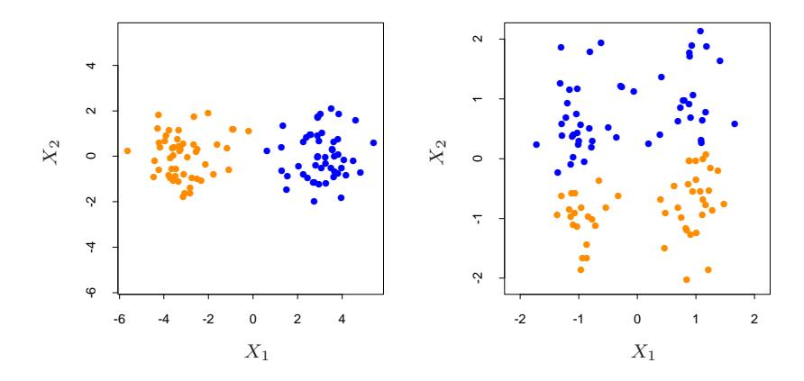

**FIGURE 14.5.** Simulated data: on the left, K-means clustering (with K=2) has been applied to the raw data. The two colors indicate the cluster memberships. On the right, the features were first standardized before clustering. This is equivalent to using feature weights  $1/[2 \cdot var(X_j)]$ . The standardization has obscured the two well-separated groups. Note that each plot uses the same units in the horizontal and vertical axes.

set. In general, setting  $w_j = 1/\bar{d}_j$  for all attributes, irrespective of type, will cause each one of them to equally influence the overall dissimilarity between pairs of objects  $(x_i, x_{i'})$ . Although this may seem reasonable, and is often recommended, it can be highly counterproductive. If the goal is to segment the data into groups of similar objects, all attributes may not contribute equally to the (problem-dependent) notion of dissimilarity between objects. Some attribute value differences may reflect greater actual object dissimilarity in the context of the problem domain.

If the goal is to discover natural groupings in the data, some attributes may exhibit more of a grouping tendency than others. Variables that are more relevant in separating the groups should be assigned a higher influence in defining object dissimilarity. Giving all attributes equal influence in this case will tend to obscure the groups to the point where a clustering algorithm cannot uncover them. Figure 14.5 shows an example.

Although simple generic prescriptions for choosing the individual attribute dissimilarities  $d_j(x_{ij}, x_{i'j})$  and their weights  $w_j$  can be comforting, there is no substitute for careful thought in the context of each individual problem. Specifying an appropriate dissimilarity measure is far more important in obtaining success with clustering than choice of clustering algorithm. This aspect of the problem is emphasized less in the clustering literature than the algorithms themselves, since it depends on domain knowledge specifics and is less amenable to general research.

Finally, often observations have missing values in one or more of the attributes. The most common method of incorporating missing values in dissimilarity calculations (14.24) is to omit each observation pair xij , x<sup>i</sup> ′j having at least one value missing, when computing the dissimilarity between observations x<sup>i</sup> and x ′ i . This method can fail in the circumstance when both observations have no measured values in common. In this case both observations could be deleted from the analysis. Alternatively, the missing values could be imputed using the mean or median of each attribute over the nonmissing data. For categorical variables, one could consider the value "missing" as just another categorical value, if it were reasonable to consider two objects as being similar if they both have missing values on the same variables.

#### 14.3.4 Clustering Algorithms

The goal of cluster analysis is to partition the observations into groups ("clusters") so that the pairwise dissimilarities between those assigned to the same cluster tend to be smaller than those in different clusters. Clustering algorithms fall into three distinct types: combinatorial algorithms, mixture modeling, and mode seeking.

Combinatorial algorithms work directly on the observed data with no direct reference to an underlying probability model. Mixture modeling supposes that the data is an i.i.d sample from some population described by a probability density function. This density function is characterized by a parameterized model taken to be a mixture of component density functions; each component density describes one of the clusters. This model is then fit to the data by maximum likelihood or corresponding Bayesian approaches. Mode seekers ("bump hunters") take a nonparametric perspective, attempting to directly estimate distinct modes of the probability density function. Observations "closest" to each respective mode then define the individual clusters.

Mixture modeling is described in Section 6.8. The PRIM algorithm, discussed in Sections 9.3 and 14.2.5, is an example of mode seeking or "bump hunting." We discuss combinatorial algorithms next.

## 14.3.5 Combinatorial Algorithms

The most popular clustering algorithms directly assign each observation to a group or cluster without regard to a probability model describing the data. Each observation is uniquely labeled by an integer i ∈ {1, · · ·, N}. A prespecified number of clusters K < N is postulated, and each one is labeled by an integer k ∈ {1, . . . , K}. Each observation is assigned to one and only one cluster. These assignments can be characterized by a manyto-one mapping, or encoder k = C(i), that assigns the ith observation to the kth cluster. One seeks the particular encoder C ∗ (i) that achieves the required goal (details below), based on the dissimilarities d(x<sup>i</sup> , x<sup>i</sup> ′ ) between every pair of observations. These are specified by the user as described above. Generally, the encoder C(i) is explicitly delineated by giving its value (cluster assignment) for each observation i. Thus, the "parameters" of the procedure are the individual cluster assignments for each of the N observations. These are adjusted so as to minimize a "loss" function that characterizes the degree to which the clustering goal is not met.

One approach is to directly specify a mathematical loss function and attempt to minimize it through some combinatorial optimization algorithm. Since the goal is to assign close points to the same cluster, a natural loss (or "energy") function would be

$$W(C) = \frac{1}{2} \sum_{k=1}^{K} \sum_{C(i)=k} \sum_{C(i')=k} d(x_i, x_{i'}).$$
 (14.28)

This criterion characterizes the extent to which observations assigned to the same cluster tend to be close to one another. It is sometimes referred to as the "within cluster" point scatter since

$$T = \frac{1}{2} \sum_{i=1}^{N} \sum_{i'=1}^{N} d_{ii'} = \frac{1}{2} \sum_{k=1}^{K} \sum_{C(i)=k} \left( \sum_{C(i')=k} d_{ii'} + \sum_{C(i')\neq k} d_{ii'} \right),$$

or

$$T = W(C) + B(C),$$

where dii′ = d(x<sup>i</sup> , x<sup>i</sup> ′ ). Here T is the total point scatter, which is a constant given the data, independent of cluster assignment. The quantity

$$B(C) = \frac{1}{2} \sum_{k=1}^{K} \sum_{C(i)=k} \sum_{C(i')\neq k} d_{ii'}$$
 (14.29)

is the between-cluster point scatter. This will tend to be large when observations assigned to different clusters are far apart. Thus one has

$$W(C) = T - B(C)$$

and minimizing W(C) is equivalent to maximizing B(C).

Cluster analysis by combinatorial optimization is straightforward in principle. One simply minimizes W or equivalently maximizes B over all possible assignments of the N data points to K clusters. Unfortunately, such optimization by complete enumeration is feasible only for very small data sets. The number of distinct assignments is (Jain and Dubes, 1988)

$$S(N,K) = \frac{1}{K!} \sum_{k=1}^{K} (-1)^{K-k} {K \choose k} k^{N}.$$
 (14.30)

For example, S(10, 4) = 34, 105 which is quite feasible. But, S(N, K) grows very rapidly with increasing values of its arguments. Already S(19, 4) ≃  $10^{10}$ , and most clustering problems involve much larger data sets than N=19. For this reason, practical clustering algorithms are able to examine only a very small fraction of all possible encoders k=C(i). The goal is to identify a small subset that is likely to contain the optimal one, or at least a good suboptimal partition.

Such feasible strategies are based on iterative greedy descent. An initial partition is specified. At each iterative step, the cluster assignments are changed in such a way that the value of the criterion is improved from its previous value. Clustering algorithms of this type differ in their prescriptions for modifying the cluster assignments at each iteration. When the prescription is unable to provide an improvement, the algorithm terminates with the current assignments as its solution. Since the assignment of observations to clusters at any iteration is a perturbation of that for the previous iteration, only a very small fraction of all possible assignments (14.30) are examined. However, these algorithms converge to local optima which may be highly suboptimal when compared to the global optimum.

#### 14.3.6 K-means

The K-means algorithm is one of the most popular iterative descent clustering methods. It is intended for situations in which all variables are of the quantitative type, and squared Euclidean distance

$$d(x_i, x_{i'}) = \sum_{j=1}^{p} (x_{ij} - x_{i'j})^2 = ||x_i - x_{i'}||^2$$

is chosen as the dissimilarity measure. Note that weighted Euclidean distance can be used by redefining the  $x_{ij}$  values (Exercise 14.1).

The within-point scatter (14.28) can be written as

$$W(C) = \frac{1}{2} \sum_{k=1}^{K} \sum_{C(i)=k} \sum_{C(i')=k} ||x_i - x_{i'}||^2$$

$$= \sum_{k=1}^{K} N_k \sum_{C(i)=k} ||x_i - \bar{x}_k||^2, \qquad (14.31)$$

where  $\bar{x}_k = (\bar{x}_{1k}, \dots, \bar{x}_{pk})$  is the mean vector associated with the kth cluster, and  $N_k = \sum_{i=1}^N I(C(i) = k)$ . Thus, the criterion is minimized by assigning the N observations to the K clusters in such a way that within each cluster the average dissimilarity of the observations from the cluster mean, as defined by the points in that cluster, is minimized.

An iterative descent algorithm for solving

#### Algorithm 14.1 K-means Clustering.

- 1. For a given cluster assignment C, the total cluster variance (14.33) is minimized with respect to  $\{m_1, \ldots, m_K\}$  yielding the means of the currently assigned clusters (14.32).
- 2. Given a current set of means  $\{m_1, \ldots, m_K\}$ , (14.33) is minimized by assigning each observation to the closest (current) cluster mean. That is,

$$C(i) = \underset{1 \le k \le K}{\operatorname{argmin}} ||x_i - m_k||^2.$$
 (14.34)

3. Steps 1 and 2 are iterated until the assignments do not change.

$$C^* = \min_{C} \sum_{k=1}^{K} N_k \sum_{C(i)=k} ||x_i - \bar{x}_k||^2$$

can be obtained by noting that for any set of observations S

$$\bar{x}_S = \underset{m}{\operatorname{argmin}} \sum_{i \in S} ||x_i - m||^2.$$
 (14.32)

Hence we can obtain  $C^*$  by solving the enlarged optimization problem

$$\min_{C,\{m_k\}_1^K} \sum_{k=1}^K N_k \sum_{C(i)=k} ||x_i - m_k||^2.$$
 (14.33)

This can be minimized by an alternating optimization procedure given in Algorithm 14.1.

Each of steps 1 and 2 reduces the value of the criterion (14.33), so that convergence is assured. However, the result may represent a suboptimal local minimum. The algorithm of Hartigan and Wong (1979) goes further, and ensures that there is no single switch of an observation from one group to another group that will decrease the objective. In addition, one should start the algorithm with many different random choices for the starting means, and choose the solution having smallest value of the objective function.

Figure 14.6 shows some of the K-means iterations for the simulated data of Figure 14.4. The centroids are depicted by "O"s. The straight lines show the partitioning of points, each sector being the set of points closest to each centroid. This partitioning is called the *Voronoi tessellation*. After 20 iterations the procedure has converged.

#### 14.3.7 Gaussian Mixtures as Soft K-means Clustering

The K-means clustering procedure is closely related to the EM algorithm for estimating a certain Gaussian mixture model. (Sections 6.8 and 8.5.1).

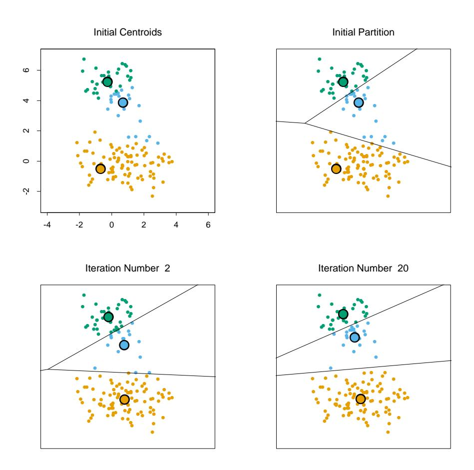

**FIGURE 14.6.** Successive iterations of the K-means clustering algorithm for the simulated data of Figure 14.4.

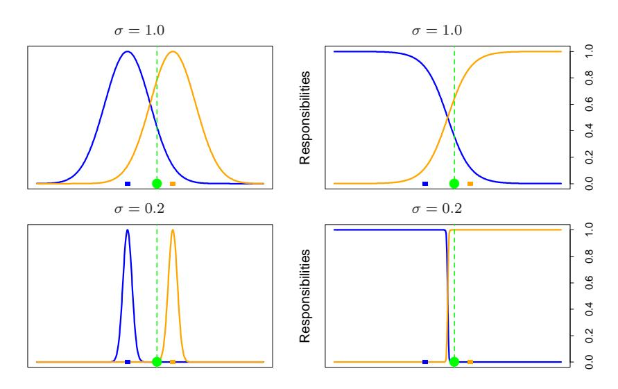

**FIGURE 14.7.** (Left panels:) two Gaussian densities  $g_0(x)$  and  $g_1(x)$  (blue and orange) on the real line, and a single data point (green dot) at x=0.5. The colored squares are plotted at x=-1.0 and x=1.0, the means of each density. (Right panels:) the relative densities  $g_0(x)/(g_0(x)+g_1(x))$  and  $g_1(x)/(g_0(x)+g_1(x))$ , called the "responsibilities" of each cluster, for this data point. In the top panels, the Gaussian standard deviation  $\sigma=1.0$ ; in the bottom panels  $\sigma=0.2$ . The EM algorithm uses these responsibilities to make a "soft" assignment of each data point to each of the two clusters. When  $\sigma$  is fairly large, the responsibilities can be near 0.5 (they are 0.36 and 0.64 in the top right panel). As  $\sigma \to 0$ , the responsibilities  $\to 1$ , for the cluster center closest to the target point, and 0 for all other clusters. This "hard" assignment is seen in the bottom right panel.

The E-step of the EM algorithm assigns "responsibilities" for each data point based in its relative density under each mixture component, while the M-step recomputes the component density parameters based on the current responsibilities. Suppose we specify K mixture components, each with a Gaussian density having scalar covariance matrix  $\sigma^2\mathbf{I}$ . Then the relative density under each mixture component is a monotone function of the Euclidean distance between the data point and the mixture center. Hence in this setup EM is a "soft" version of K-means clustering, making probabilistic (rather than deterministic) assignments of points to cluster centers. As the variance  $\sigma^2 \to 0$ , these probabilities become 0 and 1, and the two methods coincide. Details are given in Exercise 14.2. Figure 14.7 illustrates this result for two clusters on the real line.

#### 14.3.8 Example: Human Tumor Microarray Data

We apply K-means clustering to the human tumor microarray data described in Chapter 1. This is an example of high-dimensional clustering.

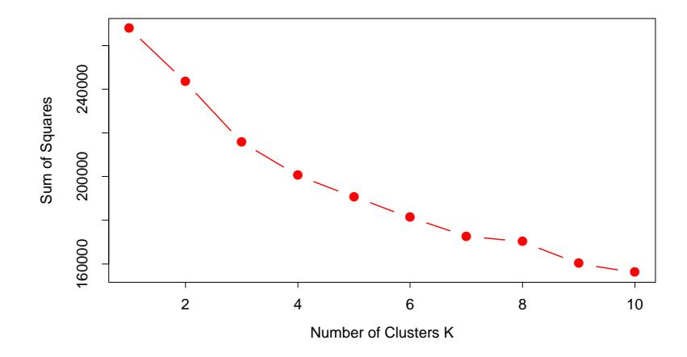

FIGURE 14.8. Total within-cluster sum of squares for K-means clustering applied to the human tumor microarray data.

TABLE 14.2. Human tumor data: number of cancer cases of each type, in each of the three clusters from K-means clustering.

| Cluster | Breast   | CNS   | Colon   | K562     | Leukemia | MCF7    |
|---------|----------|-------|---------|----------|----------|---------|
| 1       | 3        | 5     | 0       | 0        | 0        | 0       |
| 2       | 2        | 0     | 0       | 2        | 6        | 2       |
| 3       | 2        | 0     | 7       | 0        | 0        | 0       |
| Cluster | Melanoma | NSCLC | Ovarian | Prostate | Renal    | Unknown |
|         |          |       |         |          |          |         |
| 1       | 1        | 7     | 6       | 2        | 9        | 1       |
| 2       | 7        | 2     | 0       | 0        | 0        | 0       |

The data are a 6830 × 64 matrix of real numbers, each representing an expression measurement for a gene (row) and sample (column). Here we cluster the samples, each of which is a vector of length 6830, corresponding to expression values for the 6830 genes. Each sample has a label such as breast (for breast cancer), melanoma, and so on; we don't use these labels in the clustering, but will examine posthoc which labels fall into which clusters.

We applied K-means clustering with K running from 1 to 10, and computed the total within-sum of squares for each clustering, shown in Figure 14.8. Typically one looks for a kink in the sum of squares curve (or its logarithm) to locate the optimal number of clusters (see Section 14.3.11). Here there is no clear indication: for illustration we chose K = 3 giving the three clusters shown in Table 14.2.


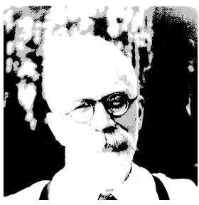

**FIGURE 14.9.** Sir Ronald A. Fisher (1890 – 1962) was one of the founders of modern day statistics, to whom we owe maximum-likelihood, sufficiency, and many other fundamental concepts. The image on the left is a  $1024 \times 1024$  grayscale image at 8 bits per pixel. The center image is the result of  $2 \times 2$  block VQ, using 200 code vectors, with a compression rate of 1.9 bits/pixel. The right image uses only four code vectors, with a compression rate of 0.50 bits/pixel

We see that the procedure is successful at grouping together samples of the same cancer. In fact, the two breast cancers in the second cluster were later found to be misdiagnosed and were melanomas that had metastasized. However, K-means clustering has shortcomings in this application. For one, it does not give a linear ordering of objects within a cluster: we have simply listed them in alphabetic order above. Secondly, as the number of clusters K is changed, the cluster memberships can change in arbitrary ways. That is, with say four clusters, the clusters need not be nested within the three clusters above. For these reasons, hierarchical clustering (described later), is probably preferable for this application.

#### 14.3.9 Vector Quantization

The K-means clustering algorithm represents a key tool in the apparently unrelated area of image and signal compression, particularly in  $vector\ quantization$  or VQ (Gersho and Gray, 1992). The left image in Figure 14.9<sup>2</sup> is a digitized photograph of a famous statistician, Sir Ronald Fisher. It consists of  $1024 \times 1024$  pixels, where each pixel is a grayscale value ranging from 0 to 255, and hence requires 8 bits of storage per pixel. The entire image occupies 1 megabyte of storage. The center image is a VQ-compressed version of the left panel, and requires 0.239 of the storage (at some loss in quality). The right image is compressed even more, and requires only 0.0625 of the storage (at a considerable loss in quality).

The version of VQ implemented here first breaks the image into small blocks, in this case  $2 \times 2$  blocks of pixels. Each of the  $512 \times 512$  blocks of four

<sup>&</sup>lt;sup>2</sup>This example was prepared by Maya Gupta.

numbers is regarded as a vector in  $\mathbbm{R}^4$ . A K-means clustering algorithm (also known as Lloyd's algorithm in this context) is run in this space. The center image uses K=200, while the right image K=4. Each of the  $512\times512$  pixel blocks (or points) is approximated by its closest cluster centroid, known as a codeword. The clustering process is called the *encoding* step, and the collection of centroids is called the *codebook*.

To represent the approximated image, we need to supply for each block the identity of the codebook entry that approximates it. This will require  $\log_2(K)$  bits per block. We also need to supply the codebook itself, which is  $K \times 4$  real numbers (typically negligible). Overall, the storage for the compressed image amounts to  $\log_2(K)/(4\cdot 8)$  of the original (0.239 for  $K=200,\ 0.063$  for K=4). This is typically expressed as a rate in bits per pixel:  $\log_2(K)/4$ , which are 1.91 and 0.50, respectively. The process of constructing the approximate image from the centroids is called the decoding step.

Why do we expect VQ to work at all? The reason is that for typical everyday images like photographs, many of the blocks look the same. In this case there are many almost pure white blocks, and similarly pure gray blocks of various shades. These require only one block each to represent them, and then multiple pointers to that block.

What we have described is known as lossy compression, since our images are degraded versions of the original. The degradation or distortion is usually measured in terms of mean squared error. In this case D=0.89 for K=200 and D=16.95 for K=4. More generally a rate/distortion curve would be used to assess the tradeoff. One can also perform lossless compression using block clustering, and still capitalize on the repeated patterns. If you took the original image and losslessly compressed it, the best you would do is 4.48 bits per pixel.

We claimed above that  $\log_2(K)$  bits were needed to identify each of the K codewords in the codebook. This uses a fixed-length code, and is inefficient if some codewords occur many more times than others in the image. Using Shannon coding theory, we know that in general a variable length code will do better, and the rate then becomes  $-\sum_{\ell=1}^K p_\ell \log_2(p_\ell)/4$ . The term in the numerator is the entropy of the distribution  $p_\ell$  of the codewords in the image. Using variable length coding our rates come down to 1.42 and 0.39, respectively. Finally, there are many generalizations of VQ that have been developed: for example, tree-structured VQ finds the centroids with a top-down, 2-means style algorithm, as alluded to in Section 14.3.12. This allows successive refinement of the compression. Further details may be found in Gersho and Gray (1992).

#### 14.3.10 K-medoids

As discussed above, the K-means algorithm is appropriate when the dissimilarity measure is taken to be squared Euclidean distance  $D(x_i, x_{i'})$ 

#### Algorithm 14.2 K-medoids Clustering.

1. For a given cluster assignment C find the observation in the cluster minimizing total distance to other points in that cluster:

$$i_k^* = \underset{\{i:C(i)=k\}}{\operatorname{argmin}} \sum_{C(i')=k} D(x_i, x_{i'}).$$
 (14.35)

Then  $m_k = x_{i_k^*}$ , k = 1, 2, ..., K are the current estimates of the cluster centers.

2. Given a current set of cluster centers  $\{m_1, \ldots, m_K\}$ , minimize the total error by assigning each observation to the closest (current) cluster center:

$$C(i) = \operatorname*{argmin}_{1 \le k \le K} D(x_i, m_k). \tag{14.36}$$

3. Iterate steps 1 and 2 until the assignments do not change.

(14.112). This requires all of the variables to be of the quantitative type. In addition, using *squared* Euclidean distance places the highest influence on the largest distances. This causes the procedure to lack robustness against outliers that produce very large distances. These restrictions can be removed at the expense of computation.

The only part of the K-means algorithm that assumes squared Euclidean distance is the minimization step (14.32); the cluster representatives  $\{m_1, \ldots, m_K\}$  in (14.33) are taken to be the means of the currently assigned clusters. The algorithm can be generalized for use with arbitrarily defined dissimilarities  $D(x_i, x_{i'})$  by replacing this step by an explicit optimization with respect to  $\{m_1, \ldots, m_K\}$  in (14.33). In the most common form, centers for each cluster are restricted to be one of the observations assigned to the cluster, as summarized in Algorithm 14.2. This algorithm assumes attribute data, but the approach can also be applied to data described only by proximity matrices (Section 14.3.1). There is no need to explicitly compute cluster centers; rather we just keep track of the indices  $i_k^*$ .

Solving (14.32) for each provisional cluster k requires an amount of computation proportional to the number of observations assigned to it, whereas for solving (14.35) the computation increases to  $O(N_k^2)$ . Given a set of cluster "centers,"  $\{i_1, \ldots, i_K\}$ , obtaining the new assignments

$$C(i) = \operatorname*{argmin}_{1 \le k \le K} d_{ii_k^*} \tag{14.37}$$

requires computation proportional to  $K \cdot N$  as before. Thus, K-medoids is far more computationally intensive than K-means.

Alternating between (14.35) and (14.37) represents a particular heuristic search strategy for trying to solve

|     | BEL  | BRA  | CHI  | CUB  | EGY  | FRA  | IND  | ISR  | USA  | USS  | YUG  |
|-----|------|------|------|------|------|------|------|------|------|------|------|
| BRA | 5.58 |      |      |      |      |      |      |      |      |      |      |
| CHI | 7.00 | 6.50 |      |      |      |      |      |      |      |      |      |
| CUB | 7.08 | 7.00 | 3.83 |      |      |      |      |      |      |      |      |
| EGY | 4.83 | 5.08 | 8.17 | 5.83 |      |      |      |      |      |      |      |
| FRA | 2.17 | 5.75 | 6.67 | 6.92 | 4.92 |      |      |      |      |      |      |
| IND | 6.42 | 5.00 | 5.58 | 6.00 | 4.67 | 6.42 |      |      |      |      |      |
| ISR | 3.42 | 5.50 | 6.42 | 6.42 | 5.00 | 3.92 | 6.17 |      |      |      |      |
| USA | 2.50 | 4.92 | 6.25 | 7.33 | 4.50 | 2.25 | 6.33 | 2.75 |      |      |      |
| USS | 6.08 | 6.67 | 4.25 | 2.67 | 6.00 | 6.17 | 6.17 | 6.92 | 6.17 |      |      |
| YUG | 5.25 | 6.83 | 4.50 | 3.75 | 5.75 | 5.42 | 6.08 | 5.83 | 6.67 | 3.67 |      |
| ZAI | 4.75 | 3.00 | 6.08 | 6.67 | 5.00 | 5.58 | 4.83 | 6.17 | 5.67 | 6.50 | 6.92 |

**TABLE 14.3.** Data from a political science survey: values are average pairwise dissimilarities of countries from a questionnaire given to political science students.

$$\min_{C, \{i_k\}_1^K} \sum_{k=1}^K \sum_{C(i)=k} d_{ii_k}.$$
 (14.38)

Kaufman and Rousseeuw (1990) propose an alternative strategy for directly solving (14.38) that provisionally exchanges each center  $i_k$  with an observation that is not currently a center, selecting the exchange that produces the greatest reduction in the value of the criterion (14.38). This is repeated until no advantageous exchanges can be found. Massart et al. (1983) derive a branch-and-bound combinatorial method that finds the global minimum of (14.38) that is practical only for very small data sets.

#### Example: Country Dissimilarities

This example, taken from Kaufman and Rousseeuw (1990), comes from a study in which political science students were asked to provide pairwise dissimilarity measures for 12 countries: Belgium, Brazil, Chile, Cuba, Egypt, France, India, Israel, United States, Union of Soviet Socialist Republics, Yugoslavia and Zaire. The average dissimilarity scores are given in Table 14.3. We applied 3-medoid clustering to these dissimilarities. Note that K-means clustering could not be applied because we have only distances rather than raw observations. The left panel of Figure 14.10 shows the dissimilarities reordered and blocked according to the 3-medoid clustering. The right panel is a two-dimensional multidimensional scaling plot, with the 3-medoid clusters assignments indicated by colors (multidimensional scaling is discussed in Section 14.8.) Both plots show three well-separated clusters, but the MDS display indicates that "Egypt" falls about halfway between two clusters.

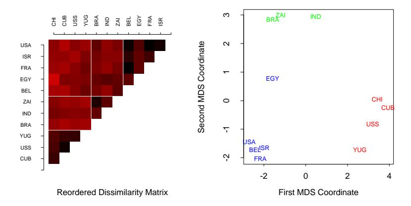

FIGURE 14.10. Survey of country dissimilarities. (Left panel:) dissimilarities reordered and blocked according to 3-medoid clustering. Heat map is coded from most similar (dark red) to least similar (bright red). (Right panel:) two-dimensional multidimensional scaling plot, with 3-medoid clusters indicated by different colors.

#### 14.3.11 Practical Issues

In order to apply K-means or K-medoids one must select the number of clusters  $K^*$  and an initialization. The latter can be defined by specifying an initial set of centers  $\{m_1, \ldots, m_K\}$  or  $\{i_1, \ldots, i_K\}$  or an initial encoder C(i). Usually specifying the centers is more convenient. Suggestions range from simple random selection to a deliberate strategy based on forward stepwise assignment. At each step a new center  $i_k$  is chosen to minimize the criterion (14.33) or (14.38), given the centers  $i_1, \ldots, i_{k-1}$  chosen at the previous steps. This continues for K steps, thereby producing K initial centers with which to begin the optimization algorithm.

A choice for the number of clusters K depends on the goal. For data segmentation K is usually defined as part of the problem. For example, a company may employ K sales people, and the goal is to partition a customer database into K segments, one for each sales person, such that the customers assigned to each one are as similar as possible. Often, however, cluster analysis is used to provide a descriptive statistic for ascertaining the extent to which the observations comprising the data base fall into natural distinct groupings. Here the number of such groups  $K^*$  is unknown and one requires that it, as well as the groupings themselves, be estimated from the data.

Data-based methods for estimating  $K^*$  typically examine the withincluster dissimilarity  $W_K$  as a function of the number of clusters K. Separate solutions are obtained for  $K \in \{1, 2, ..., K_{\text{max}}\}$ . The corresponding values  $\{W_1, W_2, \ldots, W_{K_{\text{max}}}\}$  generally decrease with increasing K. This will be the case even when the criterion is evaluated on an independent test set, since a large number of cluster centers will tend to fill the feature space densely and thus will be close to all data points. Thus cross-validation techniques, so useful for model selection in supervised learning, cannot be utilized in this context.

The intuition underlying the approach is that if there are actually  $K^*$  distinct groupings of the observations (as defined by the dissimilarity measure), then for  $K < K^*$  the clusters returned by the algorithm will each contain a subset of the true underlying groups. That is, the solution will not assign observations in the same naturally occurring group to different estimated clusters. To the extent that this is the case, the solution criterion value will tend to decrease substantially with each successive increase in the number of specified clusters,  $W_{K+1} \ll W_K$ , as the natural groups are successively assigned to separate clusters. For  $K > K^*$ , one of the estimated clusters must partition at least one of the natural groups into two subgroups. This will tend to provide a smaller decrease in the criterion as K is further increased. Splitting a natural group, within which the observations are all quite close to each other, reduces the criterion less than partitioning the union of two well-separated groups into their proper constituents.

To the extent this scenario is realized, there will be a sharp decrease in successive differences in criterion value,  $W_K - W_{K+1}$ , at  $K = K^*$ . That is,  $\{W_K - W_{K+1} \mid K < K^*\} \gg \{W_K - W_{K+1} \mid K \ge K^*\}$ . An estimate  $\hat{K}^*$  for  $K^*$  is then obtained by identifying a "kink" in the plot of  $W_K$  as a function of K. As with other aspects of clustering procedures, this approach is somewhat heuristic.

The recently proposed Gap statistic (Tibshirani et al., 2001b) compares the curve  $\log W_K$  to the curve obtained from data uniformly distributed over a rectangle containing the data. It estimates the optimal number of clusters to be the place where the gap between the two curves is largest. Essentially this is an automatic way of locating the aforementioned "kink." It also works reasonably well when the data fall into a single cluster, and in that case will tend to estimate the optimal number of clusters to be one. This is the scenario where most other competing methods fail.

Figure 14.11 shows the result of the Gap statistic applied to simulated data of Figure 14.4. The left panel shows  $\log W_K$  for  $K=1,2,\ldots,8$  clusters (green curve) and the expected value of  $\log W_K$  over 20 simulations from uniform data (blue curve). The right panel shows the gap curve, which is the expected curve minus the observed curve. Shown also are error bars of half-width  $s_K' = s_K \sqrt{1+1/20}$ , where  $s_K$  is the standard deviation of  $\log W_K$  over the 20 simulations. The Gap curve is maximized at K=2 clusters. If G(K) is the Gap curve at K clusters, the formal rule for estimating  $K^*$  is

$$K^* = \underset{K}{\operatorname{argmin}} \{ K | G(K) \ge G(K+1) - s'_{K+1} \}. \tag{14.39}$$

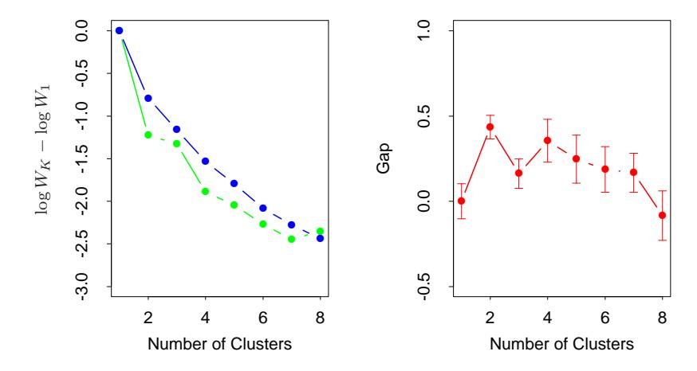

FIGURE 14.11. (Left panel): observed (green) and expected (blue) values of log W<sup>K</sup> for the simulated data of Figure 14.4. Both curves have been translated to equal zero at one cluster. (Right panel): Gap curve, equal to the difference between the observed and expected values of log WK. The Gap estimate K<sup>∗</sup> is the smallest K producing a gap within one standard deviation of the gap at K + 1; here K<sup>∗</sup> = 2.

This gives K<sup>∗</sup> = 2, which looks reasonable from Figure 14.4.

#### 14.3.12 Hierarchical Clustering

The results of applying K-means or K-medoids clustering algorithms depend on the choice for the number of clusters to be searched and a starting configuration assignment. In contrast, hierarchical clustering methods do not require such specifications. Instead, they require the user to specify a measure of dissimilarity between (disjoint) groups of observations, based on the pairwise dissimilarities among the observations in the two groups. As the name suggests, they produce hierarchical representations in which the clusters at each level of the hierarchy are created by merging clusters at the next lower level. At the lowest level, each cluster contains a single observation. At the highest level there is only one cluster containing all of the data.

Strategies for hierarchical clustering divide into two basic paradigms: agglomerative (bottom-up) and divisive (top-down). Agglomerative strategies start at the bottom and at each level recursively merge a selected pair of clusters into a single cluster. This produces a grouping at the next higher level with one less cluster. The pair chosen for merging consist of the two groups with the smallest intergroup dissimilarity. Divisive methods start at the top and at each level recursively split one of the existing clusters at that level into two new clusters. The split is chosen to produce two new groups with the largest between-group dissimilarity. With both paradigms there are N − 1 levels in the hierarchy.

Each level of the hierarchy represents a particular grouping of the data into disjoint clusters of observations. The entire hierarchy represents an ordered sequence of such groupings. It is up to the user to decide which level (if any) actually represents a "natural" clustering in the sense that observations within each of its groups are sufficiently more similar to each other than to observations assigned to different groups at that level. The Gap statistic described earlier can be used for this purpose.

Recursive binary splitting/agglomeration can be represented by a rooted binary tree. The nodes of the trees represent groups. The root node represents the entire data set. The N terminal nodes each represent one of the individual observations (singleton clusters). Each nonterminal node ("parent") has two daughter nodes. For divisive clustering the two daughters represent the two groups resulting from the split of the parent; for agglomerative clustering the daughters represent the two groups that were merged to form the parent.

Most agglomerative and some divisive methods (when viewed bottomup) possess a monotonicity property. That is, the dissimilarity between merged clusters is monotone increasing with the level of the merger. Thus the binary tree can be plotted so that the height of each node is proportional to the value of the intergroup dissimilarity between its two daughters. The terminal nodes representing individual observations are all plotted at zero height. This type of graphical display is called a dendrogram.

A dendrogram provides a highly interpretable complete description of the hierarchical clustering in a graphical format. This is one of the main reasons for the popularity of hierarchical clustering methods.

For the microarray data, Figure 14.12 shows the dendrogram resulting from agglomerative clustering with average linkage; agglomerative clustering and this example are discussed in more detail later in this chapter. Cutting the dendrogram horizontally at a particular height partitions the data into disjoint clusters represented by the vertical lines that intersect it. These are the clusters that would be produced by terminating the procedure when the optimal intergroup dissimilarity exceeds that threshold cut value. Groups that merge at high values, relative to the merger values of the subgroups contained within them lower in the tree, are candidates for natural clusters. Note that this may occur at several different levels, indicating a clustering hierarchy: that is, clusters nested within clusters.

Such a dendrogram is often viewed as a graphical summary of the data itself, rather than a description of the results of the algorithm. However, such interpretations should be treated with caution. First, different hierarchical methods (see below), as well as small changes in the data, can lead to quite different dendrograms. Also, such a summary will be valid only to the extent that the pairwise observation dissimilarities possess the hierar-

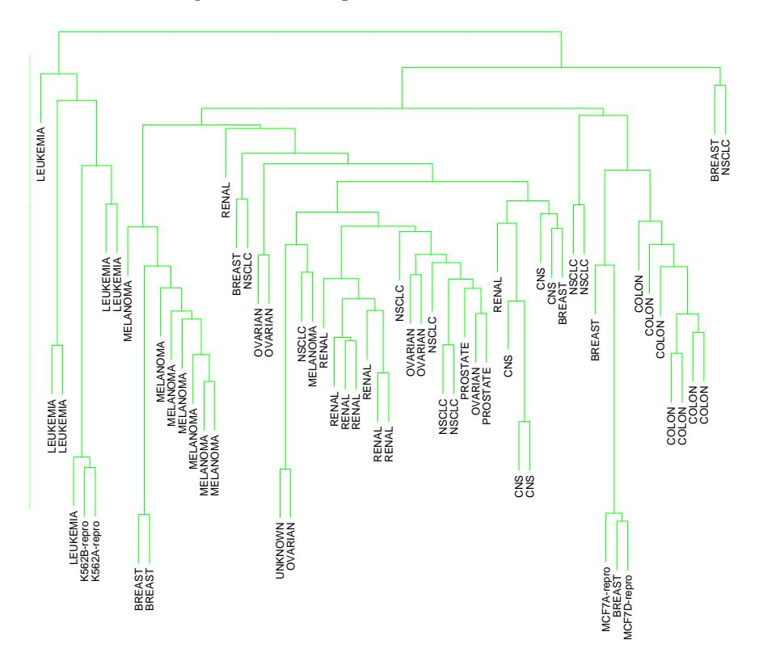

FIGURE 14.12. Dendrogram from agglomerative hierarchical clustering with average linkage to the human tumor microarray data.

chical structure produced by the algorithm. Hierarchical methods impose hierarchical structure whether or not such structure actually exists in the data.

The extent to which the hierarchical structure produced by a dendrogram actually represents the data itself can be judged by the cophenetic correlation coefficient. This is the correlation between the N(N-1)/2 pairwise observation dissimilarities  $d_{ii'}$  input to the algorithm and their corresponding cophenetic dissimilarities  $C_{ii'}$  derived from the dendrogram. The cophenetic dissimilarity  $C_{ii'}$  between two observations (i,i') is the intergroup dissimilarity at which observations i and i' are first joined together in the same cluster.

The cophenetic dissimilarity is a very restrictive dissimilarity measure. First, the  $C_{ii'}$  over the observations must contain many ties, since only N-1 of the total N(N-1)/2 values can be distinct. Also these dissimilarities obey the *ultrametric inequality* 

$$C_{ii'} \le \max\{C_{ik}, C_{i'k}\}$$
 (14.40)

for any three observations (i, i', k). As a geometric example, suppose the data were represented as points in a Euclidean coordinate system. In order for the set of interpoint distances over the data to conform to (14.40), the triangles formed by all triples of points must be isosceles triangles with the unequal length no longer than the length of the two equal sides (Jain and Dubes, 1988). Therefore it is unrealistic to expect general dissimilarities over arbitrary data sets to closely resemble their corresponding cophenetic dissimilarities as calculated from a dendrogram, especially if there are not many tied values. Thus the dendrogram should be viewed mainly as a description of the clustering structure of the data as imposed by the particular algorithm employed.

#### Agglomerative Clustering

Agglomerative clustering algorithms begin with every observation representing a singleton cluster. At each of the N-1 steps the closest two (least dissimilar) clusters are merged into a single cluster, producing one less cluster at the next higher level. Therefore, a measure of dissimilarity between two clusters (groups of observations) must be defined.

Let G and H represent two such groups. The dissimilarity d(G, H) between G and H is computed from the set of pairwise observation dissimilarities  $d_{ii'}$  where one member of the pair i is in G and the other i' is in H. Single linkage (SL) agglomerative clustering takes the intergroup dissimilarity to be that of the closest (least dissimilar) pair

$$d_{SL}(G, H) = \min_{\substack{i \in G \\ i' \in H}} d_{ii'}.$$
 (14.41)

This is also often called the *nearest-neighbor* technique. Complete linkage (CL) agglomerative clustering (furthest-neighbor technique) takes the intergroup dissimilarity to be that of the furthest (most dissimilar) pair

$$d_{CL}(G, H) = \max_{\substack{i \in G \\ i' \subseteq H}} d_{ii'}.$$
 (14.42)

Group average (GA) clustering uses the average dissimilarity between the groups

$$d_{GA}(G, H) = \frac{1}{N_G N_H} \sum_{i \in G} \sum_{i' \in H} d_{ii'}$$
 (14.43)

where  $N_G$  and  $N_H$  are the respective number of observations in each group. Although there have been many other proposals for defining intergroup dissimilarity in the context of agglomerative clustering, the above three are the ones most commonly used. Figure 14.13 shows examples of all three.

If the data dissimilarities  $\{d_{ii'}\}$  exhibit a strong clustering tendency, with each of the clusters being compact and well separated from others, then all three methods produce similar results. Clusters are compact if all of the

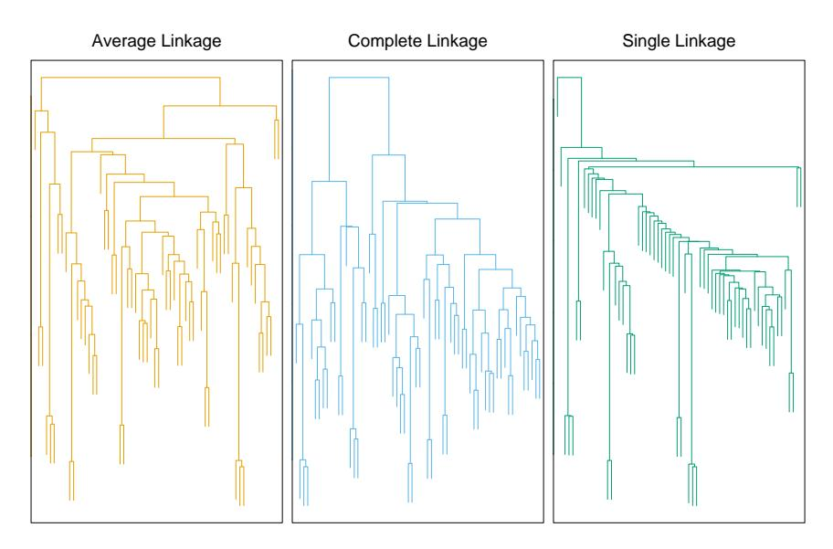

FIGURE 14.13. Dendrograms from agglomerative hierarchical clustering of human tumor microarray data.

observations within them are relatively close together (small dissimilarities) as compared with observations in different clusters. To the extent this is not the case, results will differ.

Single linkage (14.41) only requires that a single dissimilarity  $d_{ii'}$ ,  $i \in G$  and  $i' \in H$ , be small for two groups G and H to be considered close together, irrespective of the other observation dissimilarities between the groups. It will therefore have a tendency to combine, at relatively low thresholds, observations linked by a series of close intermediate observations. This phenomenon, referred to as *chaining*, is often considered a defect of the method. The clusters produced by single linkage can violate the "compactness" property that all observations within each cluster tend to be similar to one another, based on the supplied observation dissimilarities  $\{d_{ii'}\}$ . If we define the diameter  $D_G$  of a group of observations as the largest dissimilarity among its members

$$D_G = \max_{\substack{i \in G \\ i' \in G}} d_{ii'}, \tag{14.44}$$

then single linkage can produce clusters with very large diameters.

Complete linkage (14.42) represents the opposite extreme. Two groups G and H are considered close only if all of the observations in their union are relatively similar. It will tend to produce compact clusters with small diameters (14.44). However, it can produce clusters that violate the "closeness" property. That is, observations assigned to a cluster can be much

closer to members of other clusters than they are to some members of their own cluster.

Group average clustering (14.43) represents a compromise between the two extremes of single and complete linkage. It attempts to produce relatively compact clusters that are relatively far apart. However, its results depend on the numerical scale on which the observation dissimilarities  $d_{ii'}$  are measured. Applying a monotone strictly increasing transformation  $h(\cdot)$  to the  $d_{ii'}$ ,  $h_{ii'} = h(d_{ii'})$ , can change the result produced by (14.43). In contrast, (14.41) and (14.42) depend only on the ordering of the  $d_{ii'}$  and are thus invariant to such monotone transformations. This invariance is often used as an argument in favor of single or complete linkage over group average methods.

One can argue that group average clustering has a statistical consistency property violated by single and complete linkage. Assume we have attribute-value data  $X^T = (X_1, \ldots, X_p)$  and that each cluster k is a random sample from some population joint density  $p_k(x)$ . The complete data set is a random sample from a mixture of K such densities. The group average dissimilarity  $d_{GA}(G, H)$  (14.43) is an estimate of

$$\int \int d(x, x') \, p_G(x) \, p_H(x') \, dx \, dx', \qquad (14.45)$$

where d(x,x') is the dissimilarity between points x and x' in the space of attribute values. As the sample size N approaches infinity  $d_{GA}(G,H)$  (14.43) approaches (14.45), which is a characteristic of the relationship between the two densities  $p_G(x)$  and  $p_H(x)$ . For single linkage,  $d_{SL}(G,H)$  (14.41) approaches zero as  $N \to \infty$  independent of  $p_G(x)$  and  $p_H(x)$ . For complete linkage,  $d_{CL}(G,H)$  (14.42) becomes infinite as  $N \to \infty$ , again independent of the two densities. Thus, it is not clear what aspects of the population distribution are being estimated by  $d_{SL}(G,H)$  and  $d_{CL}(G,H)$ .

#### Example: Human Cancer Microarray Data (Continued)

The left panel of Figure 14.13 shows the dendrogram resulting from average linkage agglomerative clustering of the samples (columns) of the microarray data. The middle and right panels show the result using complete and single linkage. Average and complete linkage gave similar results, while single linkage produced unbalanced groups with long thin clusters. We focus on the average linkage clustering.

Like K-means clustering, hierarchical clustering is successful at clustering simple cancers together. However it has other nice features. By cutting off the dendrogram at various heights, different numbers of clusters emerge, and the sets of clusters are nested within one another. Secondly, it gives some partial ordering information about the samples. In Figure 14.14, we have arranged the genes (rows) and samples (columns) of the expression matrix in orderings derived from hierarchical clustering.

Note that if we flip the orientation of the branches of a dendrogram at any merge, the resulting dendrogram is still consistent with the series of hierarchical clustering operations. Hence to determine an ordering of the leaves, we must add a constraint. To produce the row ordering of Figure 14.14, we have used the default rule in S-PLUS: at each merge, the subtree with the tighter cluster is placed to the left (toward the bottom in the rotated dendrogram in the figure.) Individual genes are the tightest clusters possible, and merges involving two individual genes place them in order by their observation number. The same rule was used for the columns. Many other rules are possible—for example, ordering by a multidimensional scaling of the genes; see Section 14.8.

The two-way rearrangement of Figure 14.14 produces an informative picture of the genes and samples. This picture is more informative than the randomly ordered rows and columns of Figure 1.3 of Chapter 1. Furthermore, the dendrograms themselves are useful, as biologists can, for example, interpret the gene clusters in terms of biological processes.

#### Divisive Clustering

Divisive clustering algorithms begin with the entire data set as a single cluster, and recursively divide one of the existing clusters into two daughter clusters at each iteration in a top-down fashion. This approach has not been studied nearly as extensively as agglomerative methods in the clustering literature. It has been explored somewhat in the engineering literature (Gersho and Gray, 1992) in the context of compression. In the clustering setting, a potential advantage of divisive over agglomerative methods can occur when interest is focused on partitioning the data into a relatively small number of clusters.

The divisive paradigm can be employed by recursively applying any of the combinatorial methods such as K-means (Section 14.3.6) or K-medoids (Section 14.3.10), with K = 2, to perform the splits at each iteration. However, such an approach would depend on the starting configuration specified at each step. In addition, it would not necessarily produce a splitting sequence that possesses the monotonicity property required for dendrogram representation.

A divisive algorithm that avoids these problems was proposed by Macnaughton Smith et al. (1965). It begins by placing all observations in a single cluster G. It then chooses that observation whose average dissimilarity from all the other observations is largest. This observation forms the first member of a second cluster H. At each successive step that observation in G whose average distance from those in H, minus that for the remaining observations in G is largest, is transferred to H. This continues until the corresponding difference in averages becomes negative. That is, there are no longer any observations in G that are, on average, closer to those in H. The result is a split of the original cluster into two daughter clusters,

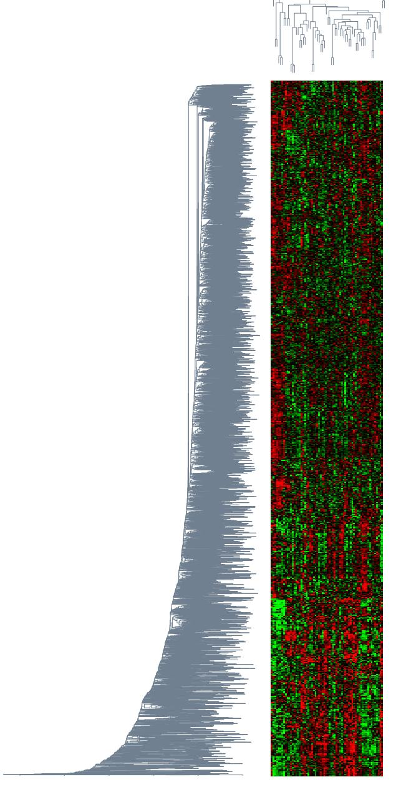

FIGURE 14.14. DNA microarray data: average linkage hierarchical clustering has been applied independently to the rows (genes) and columns (samples), determining the ordering of the rows and columns (see text). The colors range from bright green (negative, under-expressed) to bright red (positive, over-expressed).

the observations transferred to H, and those remaining in G. These two clusters represent the second level of the hierarchy. Each successive level is produced by applying this splitting procedure to one of the clusters at the previous level. Kaufman and Rousseeuw (1990) suggest choosing the cluster at each level with the largest diameter (14.44) for splitting. An alternative would be to choose the one with the largest average dissimilarity among its members

$$\bar{d}_G = \frac{1}{N_G^2} \sum_{i \in G} \sum_{i' \in G} d_{ii'}.$$

The recursive splitting continues until all clusters either become singletons or all members of each one have zero dissimilarity from one another.

# 14.4 Self-Organizing Maps

This method can be viewed as a constrained version of K-means clustering, in which the prototypes are encouraged to lie in a one- or two-dimensional manifold in the feature space. The resulting manifold is also referred to as a constrained topological map, since the original high-dimensional observations can be mapped down onto the two-dimensional coordinate system. The original SOM algorithm was online—observations are processed one at a time—and later a batch version was proposed. The technique also bears a close relationship to principal curves and surfaces, which are discussed in the next section.

We consider a SOM with a two-dimensional rectangular grid of K prototypes  $m_j \in \mathbb{R}^p$  (other choices, such as hexagonal grids, can also be used). Each of the K prototypes are parametrized with respect to an integer coordinate pair  $\ell_j \in \mathcal{Q}_1 \times \mathcal{Q}_2$ . Here  $\mathcal{Q}_1 = \{1, 2, \dots, q_1\}$ , similarly  $\mathcal{Q}_2$ , and  $K = q_1 \cdot q_2$ . The  $m_j$  are initialized, for example, to lie in the two-dimensional principal component plane of the data (next section). We can think of the prototypes as "buttons," "sewn" on the principal component plane in a regular pattern. The SOM procedure tries to bend the plane so that the buttons approximate the data points as well as possible. Once the model is fit, the observations can be mapped down onto the two-dimensional grid.

The observations  $x_i$  are processed one at a time. We find the closest prototype  $m_j$  to  $x_i$  in Euclidean distance in  $\mathbb{R}^p$ , and then for all neighbors  $m_k$  of  $m_j$ , move  $m_k$  toward  $x_i$  via the update

$$m_k \leftarrow m_k + \alpha(x_i - m_k). \tag{14.46}$$

The "neighbors" of  $m_j$  are defined to be all  $m_k$  such that the distance between  $\ell_j$  and  $\ell_k$  is small. The simplest approach uses Euclidean distance, and "small" is determined by a threshold r. This neighborhood always includes the closest prototype  $m_j$  itself.

Notice that distance is defined in the space  $Q_1 \times Q_2$  of integer topological coordinates of the prototypes, rather than in the feature space  $\mathbb{R}^p$ . The effect of the update (14.46) is to move the prototypes closer to the data, but also to maintain a smooth two-dimensional spatial relationship between the prototypes.

The performance of the SOM algorithm depends on the learning rate  $\alpha$  and the distance threshold r. Typically  $\alpha$  is decreased from say 1.0 to 0.0 over a few thousand iterations (one per observation). Similarly r is decreased linearly from starting value R to 1 over a few thousand iterations. We illustrate a method for choosing R in the example below.

We have described the simplest version of the SOM. More sophisticated versions modify the update step according to distance:

$$m_k \leftarrow m_k + \alpha h(\|\ell_j - \ell_k\|)(x_i - m_k), \tag{14.47}$$

where the neighborhood function h gives more weight to prototypes  $m_k$  with indices  $\ell_k$  closer to  $\ell_i$  than to those further away.

If we take the distance r small enough so that each neighborhood contains only one point, then the spatial connection between prototypes is lost. In that case one can show that the SOM algorithm is an online version of K-means clustering, and eventually stabilizes at one of the local minima found by K-means. Since the SOM is a constrained version of K-means clustering, it is important to check whether the constraint is reasonable in any given problem. One can do this by computing the reconstruction error  $||x - m_j||^2$ , summed over observations, for both methods. This will necessarily be smaller for K-means, but should not be much smaller if the SOM is a reasonable approximation.

As an illustrative example, we generated 90 data points in three dimensions, near the surface of a half sphere of radius 1. The points were in each of three clusters—red, green, and blue—located near (0,1,0), (0,0,1) and (1,0,0). The data are shown in Figure 14.15

By design, the red cluster was much tighter than the green or blue ones. (Full details of the data generation are given in Exercise 14.5.) A  $5\times 5$  grid of prototypes was used, with initial grid size R=2; this meant that about a third of the prototypes were initially in each neighborhood. We did a total of 40 passes through the dataset of 90 observations, and let r and  $\alpha$  decrease linearly over the 3600 iterations.

In Figure 14.16 the prototypes are indicated by circles, and the points that project to each prototype are plotted randomly within the corresponding circle. The left panel shows the initial configuration, while the right panel shows the final one. The algorithm has succeeded in separating the clusters; however, the separation of the red cluster indicates that the manifold has folded back on itself (see Figure 14.17). Since the distances in the two-dimensional display are not used, there is little indication in the SOM projection that the red cluster is tighter than the others.

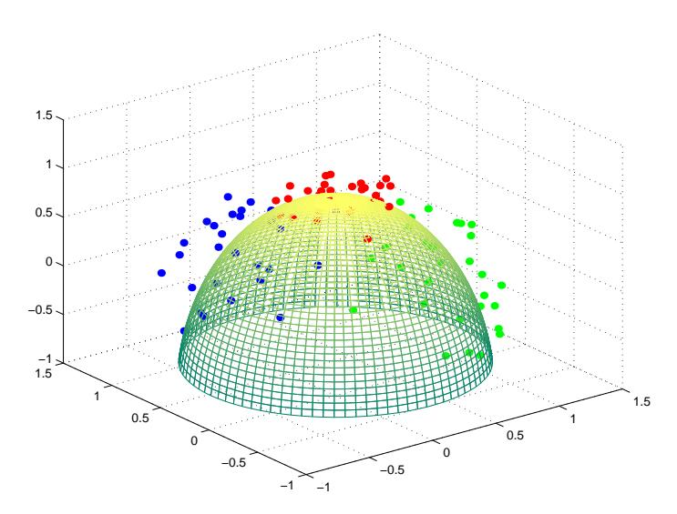

**FIGURE 14.15.** Simulated data in three classes, near the surface of a half-sphere.

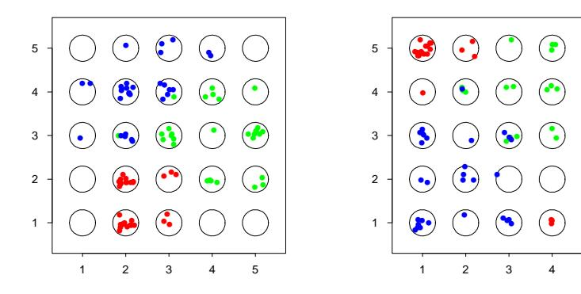

**FIGURE 14.16.** Self-organizing map applied to half-sphere data example. Left panel is the initial configuration, right panel the final one. The  $5 \times 5$  grid of prototypes are indicated by circles, and the points that project to each prototype are plotted randomly within the corresponding circle.

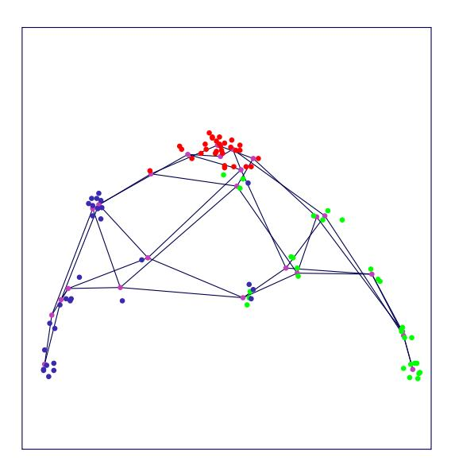

FIGURE 14.17. Wiremesh representation of the fitted SOM model in IR<sup>3</sup> . The lines represent the horizontal and vertical edges of the topological lattice. The double lines indicate that the surface was folded diagonally back on itself in order to model the red points. The cluster members have been jittered to indicate their color, and the purple points are the node centers.

Figure 14.18 shows the reconstruction error, equal to the total sum of squares of each data point around its prototype. For comparison we carried out a K-means clustering with 25 centroids, and indicate its reconstruction error by the horizontal line on the graph. We see that the SOM significantly decreases the error, nearly to the level of the K-means solution. This provides evidence that the two-dimensional constraint used by the SOM is reasonable for this particular dataset.

In the batch version of the SOM, we update each m<sup>j</sup> via

$$m_j = \frac{\sum w_k x_k}{\sum w_k}. (14.48)$$

The sum is over points x<sup>k</sup> that mapped (i.e., were closest to) neighbors m<sup>k</sup> of m<sup>j</sup> . The weight function may be rectangular, that is, equal to 1 for the neighbors of mk, or may decrease smoothly with distance kℓk−ℓjk as before. If the neighborhood size is chosen small enough so that it consists only of mk, with rectangular weights, this reduces to the K-means clustering procedure described earlier. It can also be thought of as a discrete version of principal curves and surfaces, described in Section 14.5.

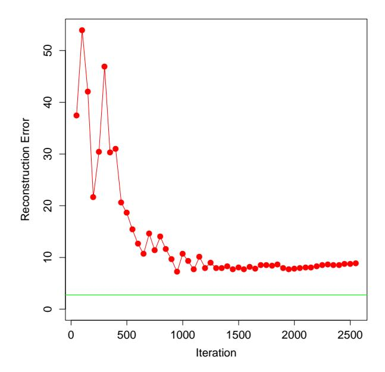

FIGURE 14.18. Half-sphere data: reconstruction error for the SOM as a function of iteration. Error for k-means clustering is indicated by the horizontal line.

#### Example: Document Organization and Retrieval

Document retrieval has gained importance with the rapid development of the Internet and the Web, and SOMs have proved to be useful for organizing and indexing large corpora. This example is taken from the WEBSOM homepage http://websom.hut.fi/ (Kohonen et al., 2000). Figure 14.19 represents a SOM fit to 12,088 newsgroup comp.ai.neural-nets articles. The labels are generated automatically by the WEBSOM software and provide a guide as to the typical content of a node.

In applications such as this, the documents have to be preprocessed in order to create a feature vector. A term-document matrix is created, where each row represents a single document. The entries in each row are the relative frequency of each of a predefined set of terms. These terms could be a large set of dictionary entries (50,000 words), or an even larger set of bigrams (word pairs), or subsets of these. These matrices are typically very sparse, and so often some preprocessing is done to reduce the number of features (columns). Sometimes the SVD (next section) is used to reduce the matrix; Kohonen et al. (2000) use a randomized variant thereof. These reduced vectors are then the input to the SOM.

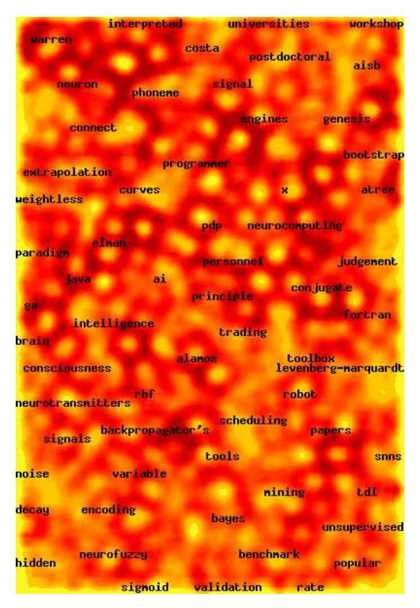

FIGURE 14.19. Heatmap representation of the SOM model fit to a corpus of 12,088 newsgroup comp.ai.neural-nets contributions (courtesy WEBSOM homepage). The lighter areas indicate higher-density areas. Populated nodes are automatically labeled according to typical content.

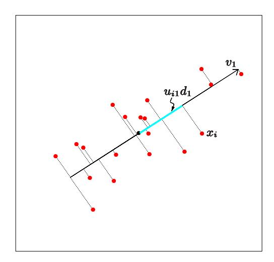

**FIGURE 14.20.** The first linear principal component of a set of data. The line minimizes the total squared distance from each point to its orthogonal projection onto the line.

In this application the authors have developed a "zoom" feature, which allows one to interact with the map in order to get more detail. The final level of zooming retrieves the actual news articles, which can then be read.

# 14.5 Principal Components, Curves and Surfaces

Principal components are discussed in Sections 3.4.1, where they shed light on the shrinkage mechanism of ridge regression. Principal components are a sequence of projections of the data, mutually uncorrelated and ordered in variance. In the next section we present principal components as linear manifolds approximating a set of N points  $x_i \in \mathbb{R}^p$ . We then present some nonlinear generalizations in Section 14.5.2. Other recent proposals for nonlinear approximating manifolds are discussed in Section 14.9.

#### 14.5.1 Principal Components

The principal components of a set of data in  $\mathbb{R}^p$  provide a sequence of best linear approximations to that data, of all ranks  $q \leq p$ .

Denote the observations by  $x_1, x_2, \ldots, x_N$ , and consider the rank-q linear model for representing them

$$f(\lambda) = \mu + \mathbf{V}_a \lambda,\tag{14.49}$$

where  $\mu$  is a location vector in  $\mathbb{R}^p$ ,  $\mathbf{V}_q$  is a  $p \times q$  matrix with q orthogonal unit vectors as columns, and  $\lambda$  is a q vector of parameters. This is the parametric representation of an affine hyperplane of rank q. Figures 14.20 and 14.21 illustrate for q = 1 and q = 2, respectively. Fitting such a model to the data by least squares amounts to minimizing the reconstruction error

$$\min_{\mu, \{\lambda_i\}, \mathbf{V}_q} \sum_{i=1}^N \|x_i - \mu - \mathbf{V}_q \lambda_i\|^2.$$
 (14.50)

We can partially optimize for  $\mu$  and the  $\lambda_i$  (Exercise 14.7) to obtain

$$\hat{\mu} = \bar{x}, \tag{14.51}$$

$$\hat{\mu} = \bar{x}, \qquad (14.51)$$

$$\hat{\lambda}_i = \mathbf{V}_q^T (x_i - \bar{x}). \qquad (14.52)$$

This leaves us to find the orthogonal matrix  $V_q$ :

$$\min_{\mathbf{V}_q} \sum_{i=1}^N ||(x_i - \bar{x}) - \mathbf{V}_q \mathbf{V}_q^T (x_i - \bar{x})||^2.$$
 (14.53)

For convenience we assume that  $\bar{x}=0$  (otherwise we simply replace the observations by their centered versions  $\tilde{x}_i = x_i - \bar{x}$ ). The  $p \times p$  matrix  $\mathbf{H}_q = \mathbf{V}_q \mathbf{V}_q^T$  is a projection matrix, and maps each point  $x_i$  onto its rankq reconstruction  $\mathbf{H}_q x_i$ , the orthogonal projection of  $x_i$  onto the subspace spanned by the columns of  $V_q$ . The solution can be expressed as follows. Stack the (centered) observations into the rows of an  $N \times p$  matrix X. We construct the singular value decomposition of X:

$$\mathbf{X} = \mathbf{U}\mathbf{D}\mathbf{V}^T. \tag{14.54}$$

This is a standard decomposition in numerical analysis, and many algorithms exist for its computation (Golub and Van Loan, 1983, for example). Here **U** is an  $N \times p$  orthogonal matrix ( $\mathbf{U}^T \mathbf{U} = \mathbf{I}_p$ ) whose columns  $\mathbf{u}_i$  are called the *left singular vectors*; V is a  $p \times p$  orthogonal matrix ( $\mathbf{V}^T \mathbf{V} = \mathbf{I}_p$ ) with columns  $v_i$  called the right singular vectors, and **D** is a  $p \times p$  diagonal matrix, with diagonal elements  $d_1 \geq d_2 \geq \cdots \geq d_n \geq 0$  known as the singular values. For each rank q, the solution  $V_q$  to (14.53) consists of the first q columns of V. The columns of UD are called the principal components of X (see Section 3.5.1). The N optimal  $\lambda_i$  in (14.52) are given by the first q principal components (the N rows of the  $N \times q$  matrix  $\mathbf{U}_q \mathbf{D}_q$ ).

The one-dimensional principal component line in  $\mathbb{R}^2$  is illustrated in Figure 14.20. For each data point  $x_i$ , there is a closest point on the line, given by  $u_{i1}d_1v_1$ . Here  $v_1$  is the direction of the line and  $\lambda_i = u_{i1}d_1$  measures distance along the line from the origin. Similarly Figure 14.21 shows the

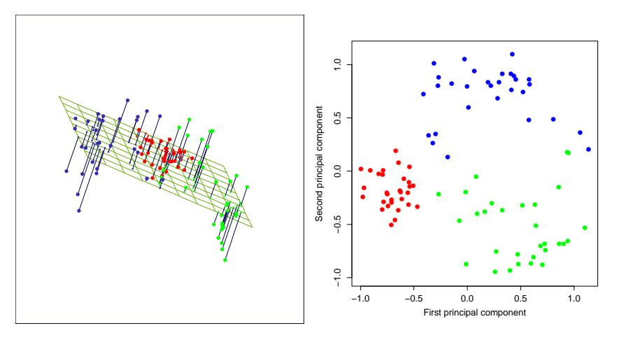

**FIGURE 14.21.** The best rank-two linear approximation to the half-sphere data. The right panel shows the projected points with coordinates given by  $U_2D_2$ , the first two principal components of the data.

two-dimensional principal component surface fit to the half-sphere data (left panel). The right panel shows the projection of the data onto the first two principal components. This projection was the basis for the initial configuration for the SOM method shown earlier. The procedure is quite successful at separating the clusters. Since the half-sphere is nonlinear, a nonlinear projection will do a better job, and this is the topic of the next section.

Principal components have many other nice properties, for example, the linear combination  $\mathbf{X}v_1$  has the highest variance among all linear combinations of the features;  $\mathbf{X}v_2$  has the highest variance among all linear combinations satisfying  $v_2$  orthogonal to  $v_1$ , and so on.

#### Example: Handwritten Digits

Principal components are a useful tool for dimension reduction and compression. We illustrate this feature on the handwritten digits data described in Chapter 1. Figure 14.22 shows a sample of 130 handwritten 3's, each a digitized  $16 \times 16$  grayscale image, from a total of 658 such 3's. We see considerable variation in writing styles, character thickness and orientation. We consider these images as points  $x_i$  in  $\mathbb{R}^{256}$ , and compute their principal components via the SVD (14.54).

Figure 14.23 shows the first two principal components of these data. For each of these first two principal components  $u_{i1}d_1$  and  $u_{i2}d_2$ , we computed the 5%, 25%, 50%, 75% and 95% quantile points, and used them to define the rectangular grid superimposed on the plot. The circled points indicate

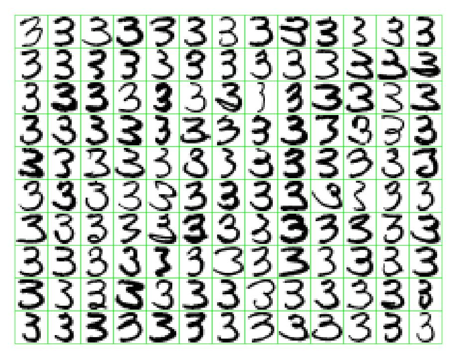

FIGURE 14.22. A sample of 130 handwritten 3's shows a variety of writing styles.

those images close to the vertices of the grid, where the distance measure focuses mainly on these projected coordinates, but gives some weight to the components in the orthogonal subspace. The right plot shows the images corresponding to these circled points. This allows us to visualize the nature of the first two principal components. We see that the v<sup>1</sup> (horizontal movement) mainly accounts for the lengthening of the lower tail of the three, while v<sup>2</sup> (vertical movement) accounts for character thickness. In terms of the parametrized model (14.49), this two-component model has the form

$$\hat{f}(\lambda) = \bar{x} + \lambda_1 v_1 + \lambda_2 v_2 
= + \lambda_1 \cdot + \lambda_2 \cdot . \qquad (14.55)$$

Here we have displayed the first two principal component directions, v<sup>1</sup> and v2, as images. Although there are a possible 256 principal components, approximately 50 account for 90% of the variation in the threes, 12 account for 63%. Figure 14.24 compares the singular values to those obtained for equivalent uncorrelated data, obtained by randomly scrambling each column of X. The pixels in a digitized image are inherently correlated, and since these are all the same digit the correlations are even stronger.

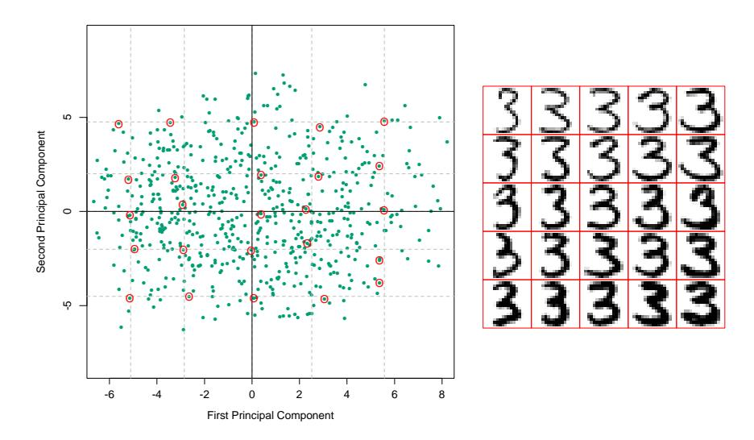

**FIGURE 14.23.** (Left panel:) the first two principal components of the handwritten threes. The circled points are the closest projected images to the vertices of a grid, defined by the marginal quantiles of the principal components. (Right panel:) The images corresponding to the circled points. These show the nature of the first two principal components.

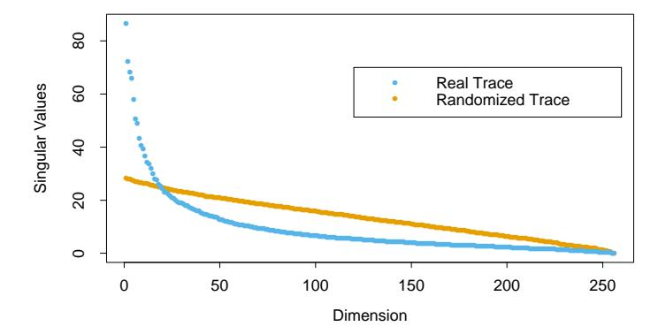

**FIGURE 14.24.** The 256 singular values for the digitized threes, compared to those for a randomized version of the data (each column of **X** was scrambled).

A relatively small subset of the principal components serve as excellent lower-dimensional features for representing the high-dimensional data.

Example: Procrustes Transformations and Shape Averaging

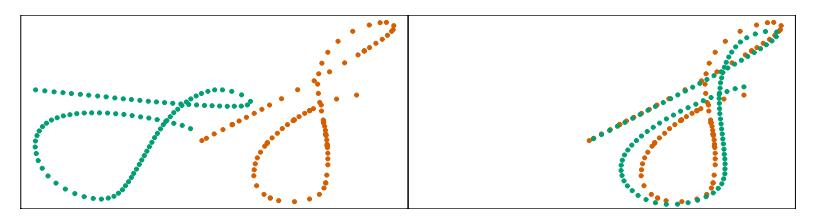

FIGURE 14.25. (Left panel:) Two different digitized handwritten Ss, each represented by 96 corresponding points in IR<sup>2</sup> . The green S has been deliberately rotated and translated for visual effect. (Right panel:) A Procrustes transformation applies a translation and rotation to best match up the two set of points.

Figure 14.25 represents two sets of points, the orange and green, in the same plot. In this instance these points represent two digitized versions of a handwritten S, extracted from the signature of a subject "Suresh." Figure 14.26 shows the entire signatures from which these were extracted (third and fourth panels). The signatures are recorded dynamically using touch-screen devices, familiar sights in modern supermarkets. There are N = 96 points representing each S, which we denote by the N ×2 matrices X<sup>1</sup> and X2. There is a correspondence between the points—the ith rows of X<sup>1</sup> and X<sup>2</sup> are meant to represent the same positions along the two S's. In the language of morphometrics, these points represent landmarks on the two objects. How one finds such corresponding landmarks is in general difficult and subject specific. In this particular case we used dynamic time warping of the speed signal along each signature (Hastie et al., 1992), but will not go into details here.

In the right panel we have applied a translation and rotation to the green points so as best to match the orange—a so-called Procrustes<sup>3</sup> transformation (Mardia et al., 1979, for example).

Consider the problem

$$\min_{\mu, \mathbf{R}} ||\mathbf{X}_2 - (\mathbf{X}_1 \mathbf{R} + \mathbf{1}\mu^T)||_F, \tag{14.56}$$

<sup>3</sup>Procrustes was an African bandit in Greek mythology, who stretched or squashed his visitors to fit his iron bed (eventually killing them).

with  $\mathbf{X}_1$  and  $\mathbf{X}_2$  both  $N \times p$  matrices of corresponding points,  $\mathbf{R}$  an orthonormal  $p \times p$  matrix<sup>4</sup>, and  $\mu$  a p-vector of location coordinates. Here  $||\mathbf{X}||_F^2 = \operatorname{trace}(\mathbf{X}^T\mathbf{X})$  is the squared *Frobenius* matrix norm.

Let  $\bar{x}_1$  and  $\bar{x}_2$  be the column mean vectors of the matrices, and  $\tilde{\mathbf{X}}_1$  and  $\tilde{\mathbf{X}}_2$  be the versions of these matrices with the means removed. Consider the SVD  $\tilde{\mathbf{X}}_1^T \tilde{\mathbf{X}}_2 = \mathbf{U} \mathbf{D} \mathbf{V}^T$ . Then the solution to (14.56) is given by (Exercise 14.8)

$$\hat{\mathbf{R}} = \mathbf{U}\mathbf{V}^T 
\hat{\mu} = \bar{x}_2 - \hat{\mathbf{R}}\bar{x}_1,$$
(14.57)

and the minimal distances is referred to as the *Procrustes distance*. From the form of the solution, we can center each matrix at its column centroid, and then ignore location completely. Hereafter we assume this is the case.

The *Procrustes distance with scaling* solves a slightly more general problem,

$$\min_{\beta, \mathbf{R}} ||\mathbf{X}_2 - \beta \mathbf{X}_1 \mathbf{R}||_F, \tag{14.58}$$

where  $\beta > 0$  is a positive scalar. The solution for **R** is as before, with  $\hat{\beta} = \text{trace}(D)/||\mathbf{X}_1||_F^2$ .

Related to Procrustes distance is the *Procrustes average* of a collection of L shapes, which solves the problem

$$\min_{\{\mathbf{R}_{\ell}\}_{1}^{L}, \mathbf{M}} \sum_{\ell=1}^{L} ||\mathbf{X}_{\ell} \mathbf{R}_{\ell} - \mathbf{M}||_{F}^{2}; \tag{14.59}$$

that is, find the shape M closest in average squared Procrustes distance to all the shapes. This is solved by a simple alternating algorithm:

- 0. Initialize  $\mathbf{M} = \mathbf{X}_1$  (for example).
- 1. Solve the L Procrustes rotation problems with  $\mathbf{M}$  fixed, yielding  $\mathbf{X}'_{\ell} \leftarrow \mathbf{X}\hat{\mathbf{R}}_{\ell}$ .
- 2. Let  $\mathbf{M} \leftarrow \frac{1}{L} \sum_{\ell=1}^{L} \mathbf{X}'_{\ell}$ .

Steps 1. and 2. are repeated until the criterion (14.59) converges.

Figure 14.26 shows a simple example with three shapes. Note that we can only expect a solution up to a rotation; alternatively, we can impose a constraint, such as that **M** be upper-triangular, to force uniqueness. One can easily incorporate scaling in the definition (14.59); see Exercise 14.9.

Most generally we can define the affine-invariant average of a set of shapes via

<sup>&</sup>lt;sup>4</sup>To simplify matters, we consider only orthogonal matrices which include reflections as well as rotations [the O(p) group]; although reflections are unlikely here, these methods can be restricted further to allow only rotations [SO(p) group].

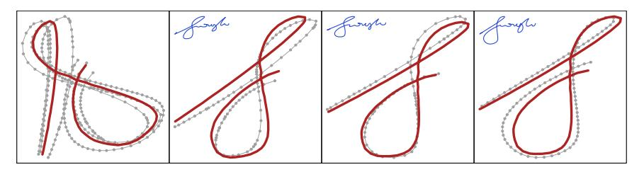

**FIGURE 14.26.** The Procrustes average of three versions of the leading S in Suresh's signatures. The left panel shows the preshape average, with each of the shapes  $\mathbf{X}'_{\ell}$  in preshape space superimposed. The right three panels map the preshape  $\mathbf{M}$  separately to match each of the original S's.

$$\min_{\{\mathbf{A}_{\ell}\}_{1}^{L}, \mathbf{M}} \sum_{\ell=1}^{L} ||\mathbf{X}_{\ell} \mathbf{A}_{\ell} - \mathbf{M}||_{F}^{2}, \tag{14.60}$$

where the  $\mathbf{A}_{\ell}$  are any  $p \times p$  nonsingular matrices. Here we require a standardization, such as  $\mathbf{M}^T \mathbf{M} = \mathbf{I}$ , to avoid a trivial solution. The solution is attractive, and can be computed without iteration (Exercise 14.10):

- 1. Let  $\mathbf{H}_{\ell} = \mathbf{X}_{\ell}(\mathbf{X}_{\ell}^T \mathbf{X}_{\ell})^{-1} \mathbf{X}_{\ell}^T$  be the rank-p projection matrix defined by  $\mathbf{X}_{\ell}$ .
- 2. **M** is the  $N \times p$  matrix formed from the p largest eigenvectors of  $\bar{\mathbf{H}} = \frac{1}{L} \sum_{\ell=1}^{L} \mathbf{H}_{\ell}$ .

#### 14.5.2 Principal Curves and Surfaces

Principal curves generalize the principal component line, providing a smooth one-dimensional curved approximation to a set of data points in  $\mathbb{R}^p$ . A principal surface is more general, providing a curved manifold approximation of dimension 2 or more.

We will first define principal curves for random variables  $X \in \mathbb{R}^p$ , and then move to the finite data case. Let  $f(\lambda)$  be a parameterized smooth curve in  $\mathbb{R}^p$ . Hence  $f(\lambda)$  is a vector function with p coordinates, each a smooth function of the single parameter  $\lambda$ . The parameter  $\lambda$  can be chosen, for example, to be arc-length along the curve from some fixed origin. For each data value x, let  $\lambda_f(x)$  define the closest point on the curve to x. Then  $f(\lambda)$  is called a principal curve for the distribution of the random vector X if

$$f(\lambda) = E(X|\lambda_f(X) = \lambda).$$
 (14.61)

This says  $f(\lambda)$  is the average of all data points that project to it, that is, the points for which it is "responsible." This is also known as a *self-consistency* property. Although in practice, continuous multivariate distributes have infinitely many principal curves (Duchamp and Stuetzle, 1996), we are

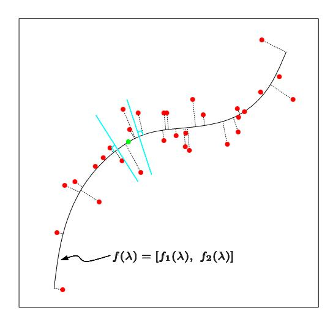

**FIGURE 14.27.** The principal curve of a set of data. Each point on the curve is the average of all data points that project there.

interested mainly in the smooth ones. A principal curve is illustrated in Figure 14.27.

Principal points are an interesting related concept. Consider a set of k prototypes and for each point x in the support of a distribution, identify the closest prototype, that is, the prototype that is responsible for it. This induces a partition of the feature space into so-called Voronoi regions. The set of k points that minimize the expected distance from K to its prototype are called the principal points of the distribution. Each principal point is self-consistent, in that it equals the mean of K in its Voronoi region. For example, with K=1, the principal point of a circular normal distribution is the mean vector; with K=1 they are a pair of points symmetrically placed on a ray through the mean vector. Principal points are the distributional analogs of centroids found by K-means clustering. Principal curves can be viewed as  $K=\infty$  principal points, but constrained to lie on a smooth curve, in a similar way that a SOM constrains K-means cluster centers to fall on a smooth manifold.

To find a principal curve  $f(\lambda)$  of a distribution, we consider its coordinate functions  $f(\lambda) = [f_1(\lambda), f_2(\lambda), \dots, f_p(\lambda)]$  and let  $X^T = (X_1, X_2, \dots, X_p)$ . Consider the following alternating steps:

(a) 
$$\hat{f}_j(\lambda) \leftarrow \mathrm{E}(X_j|\lambda(X) = \lambda); \ j = 1, 2, \dots, p,$$
  
(b)  $\hat{\lambda}_f(x) \leftarrow \mathrm{argmin}_{\lambda'} ||x - \hat{f}(\lambda')||^2.$  (14.62)

The first equation fixes  $\lambda$  and enforces the self-consistency requirement (14.61). The second equation fixes the curve and finds the closest point on

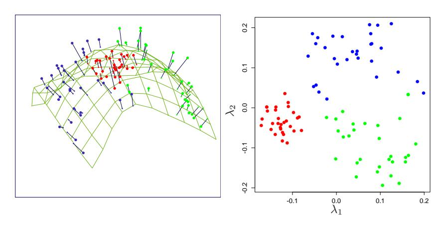

**FIGURE 14.28.** Principal surface fit to half-sphere data. (Left panel:) fitted two-dimensional surface. (Right panel:) projections of data points onto the surface, resulting in coordinates  $\hat{\lambda}_1, \hat{\lambda}_2$ .

the curve to each data point. With finite data, the principal curve algorithm starts with the linear principal component, and iterates the two steps in (14.62) until convergence. A scatterplot smoother is used to estimate the conditional expectations in step (a) by smoothing each  $X_j$  as a function of the arc-length  $\hat{\lambda}(X)$ , and the projection in (b) is done for each of the observed data points. Proving convergence in general is difficult, but one can show that if a linear least squares fit is used for the scatterplot smoothing, then the procedure converges to the first linear principal component, and is equivalent to the *power method* for finding the largest eigenvector of a matrix.

Principal surfaces have exactly the same form as principal curves, but are of higher dimension. The mostly commonly used is the two-dimensional principal surface, with coordinate functions

$$f(\lambda_1, \lambda_2) = [f_1(\lambda_1, \lambda_2), \dots, f_p(\lambda_1, \lambda_2)].$$

The estimates in step (a) above are obtained from two-dimensional surface smoothers. Principal surfaces of dimension greater than two are rarely used, since the visualization aspect is less attractive, as is smoothing in high dimensions.

Figure 14.28 shows the result of a principal surface fit to the half-sphere data. Plotted are the data points as a function of the estimated nonlinear coordinates  $\hat{\lambda}_1(x_i)$ ,  $\hat{\lambda}_2(x_i)$ . The class separation is evident.

Principal surfaces are very similar to self-organizing maps. If we use a kernel surface smoother to estimate each coordinate function  $f_j(\lambda_1, \lambda_2)$ , this has the same form as the batch version of SOMs (14.48). The SOM weights  $w_k$  are just the weights in the kernel. There is a difference, however:

the principal surface estimates a separate prototype  $f(\lambda_1(x_i), \lambda_2(x_i))$  for each data point  $x_i$ , while the SOM shares a smaller number of prototypes for all data points. As a result, the SOM and principal surface will agree only as the number of SOM prototypes grows very large.

There also is a conceptual difference between the two. Principal surfaces provide a smooth parameterization of the entire manifold in terms of its coordinate functions, while SOMs are discrete and produce only the estimated prototypes for approximating the data. The smooth parameterization in principal surfaces preserves distance locally: in Figure 14.28 it reveals that the red cluster is tighter than the green or blue clusters. In simple examples the estimates coordinate functions themselves can be informative: see Exercise 14.13.

#### 14.5.3 Spectral Clustering

Traditional clustering methods like K-means use a spherical or elliptical metric to group data points. Hence they will not work well when the clusters are non-convex, such as the concentric circles in the top left panel of Figure 14.29. Spectral clustering is a generalization of standard clustering methods, and is designed for these situations. It has close connections with the local multidimensional-scaling techniques (Section 14.9) that generalize MDS.

The starting point is a  $N \times N$  matrix of pairwise similarities  $s_{ii'} \geq 0$  between all observation pairs. We represent the observations in an undirected similarity graph  $G = \langle V, E \rangle$ . The N vertices  $v_i$  represent the observations, and pairs of vertices are connected by an edge if their similarity is positive (or exceeds some threshold). The edges are weighted by the  $s_{ii'}$ . Clustering is now rephrased as a graph-partition problem, where we identify connected components with clusters. We wish to partition the graph, such that edges between different groups have low weight, and within a group have high weight. The idea in spectral clustering is to construct similarity graphs that represent the local neighborhood relationships between observations.

To make things more concrete, consider a set of N points  $x_i \in \mathbb{R}^p$ , and let  $d_{ii'}$  be the Euclidean distance between  $x_i$  and  $x_{i'}$ . We will use as similarity matrix the radial-kernel gram matrix; that is,  $s_{ii'} = \exp(-d_{ii'}^2/c)$ , where c > 0 is a scale parameter.

There are many ways to define a similarity matrix and its associated similarity graph that reflect local behavior. The most popular is the mutual K-nearest-neighbor graph. Define  $\mathcal{N}_K$  to be the symmetric set of nearby pairs of points; specifically a pair (i,i') is in  $\mathcal{N}_K$  if point i is among the K-nearest neighbors of i', or vice-versa. Then we connect all symmetric nearest neighbors, and give them edge weight  $w_{ii'} = s_{ii'}$ ; otherwise the edge weight is zero. Equivalently we set to zero all the pairwise similarities not in  $\mathcal{N}_K$ , and draw the graph for this modified similarity matrix.

Alternatively, a fully connected graph includes all pairwise edges with weights  $w_{ii'} = s_{ii'}$ , and the local behavior is controlled by the scale parameter c.

The matrix of edge weights  $\mathbf{W} = \{w_{ii'}\}$  from a similarity graph is called the *adjacency matrix*. The *degree* of vertex i is  $g_i = \sum_{i'} w_{ii'}$ , the sum of the weights of the edges connected to it. Let  $\mathbf{G}$  be a diagonal matrix with diagonal elements  $g_i$ .

Finally, the graph Laplacian is defined by

$$\mathbf{L} = \mathbf{G} - \mathbf{W} \tag{14.63}$$

This is called the *unnormalized graph Laplacian*; a number of normalized versions have been proposed—these standardize the Laplacian with respect to the node degrees  $g_i$ , for example,  $\tilde{\mathbf{L}} = \mathbf{I} - \mathbf{G}^{-1}\mathbf{W}$ .

Spectral clustering finds the m eigenvectors  $\mathbf{Z}_{N \times m}$  corresponding to the m smallest eigenvalues of  $\mathbf{L}$  (ignoring the trivial constant eigenvector). Using a standard method like K-means, we then cluster the rows of  $\mathbf{Z}$  to yield a clustering of the original data points.

An example is presented in Figure 14.29. The top left panel shows 450 simulated data points in three circular clusters indicated by the colors. K-means clustering would clearly have difficulty identifying the outer clusters. We applied spectral clustering using a 10-nearest neighbor similarity graph, and display the eigenvector corresponding to the second and third smallest eigenvalue of the graph Laplacian in the lower left. The 15 smallest eigenvalues are shown in the top right panel. The two eigenvectors shown have identified the three clusters, and a scatterplot of the rows of the eigenvector matrix  $\mathbf{Y}$  in the bottom right clearly separates the clusters. A procedure such as K-means clustering applied to these transformed points would easily identify the three groups.

Why does spectral clustering work? For any vector  $\mathbf{f}$  we have

$$\mathbf{f}^{T}\mathbf{L}\mathbf{f} = \sum_{i=1}^{N} g_{i} f_{i}^{2} - \sum_{i=1}^{N} \sum_{i'=1}^{N} f_{i} f_{i'} w_{ii'}$$
$$= \frac{1}{2} \sum_{i=1}^{N} \sum_{i'=1}^{N} w_{ii'} (f_{i} - f_{i'})^{2}. \tag{14.64}$$

Formula 14.64 suggests that a small value of  $\mathbf{f}^T \mathbf{L} \mathbf{f}$  will be achieved if pairs of points with large adjacencies have coordinates  $f_i$  and  $f_{i'}$  close together.

Since  $\mathbf{1}^T \mathbf{L} \mathbf{1} = 0$  for any graph, the constant vector is a trivial eigenvector with eigenvalue zero. Not so obvious is the fact that if the graph is connected<sup>5</sup>, it is the *only* zero eigenvector (Exercise 14.21). Generalizing this argument, it is easy to show that for a graph with m connected components,

<sup>&</sup>lt;sup>5</sup>A graph is connected if any two nodes can be reached via a path of connected nodes.

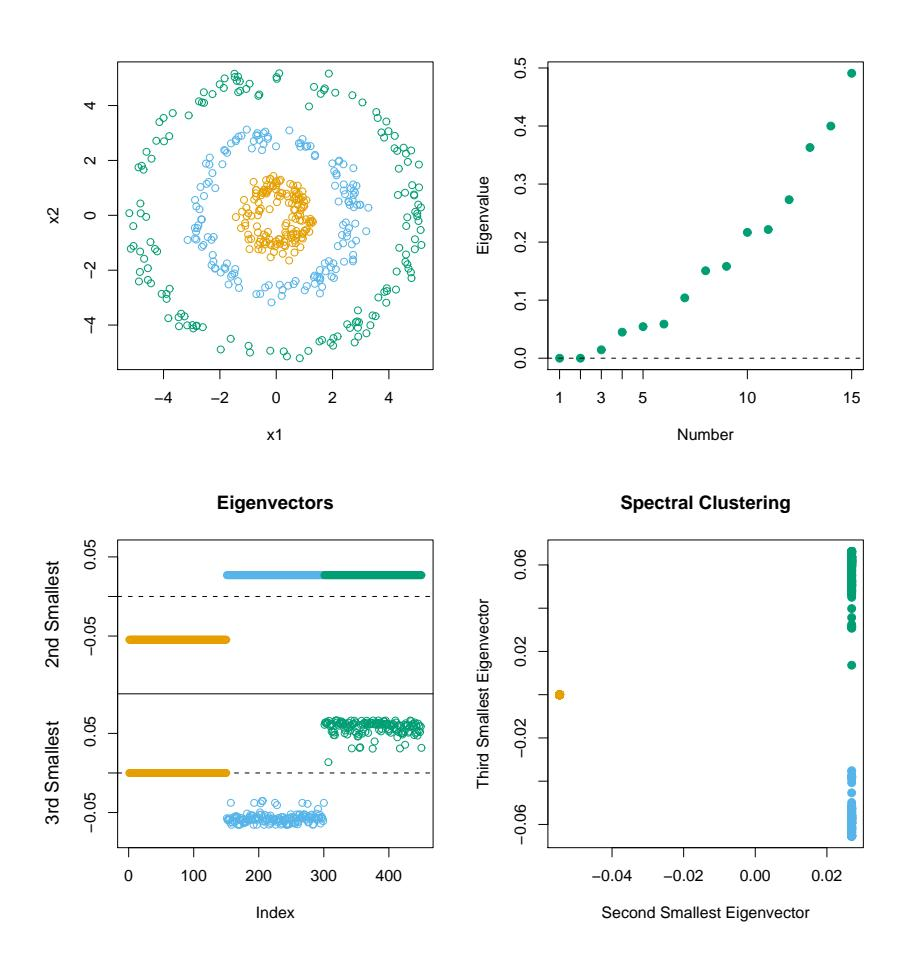

FIGURE 14.29. Toy example illustrating spectral clustering. Data in top left are 450 points falling in three concentric clusters of 150 points each. The points are uniformly distributed in angle, with radius 1, 2.8 and 5 in the three groups, and Gaussian noise with standard deviation 0.25 added to each point. Using a k = 10 nearest-neighbor similarity graph, the eigenvector corresponding to the second and third smallest eigenvalues of L are shown in the bottom left; the smallest eigenvector is constant. The data points are colored in the same way as in the top left. The 15 smallest eigenvalues are shown in the top right panel. The coordinates of the 2nd and 3rd eigenvectors (the 450 rows of Z) are plotted in the bottom right panel. Spectral clustering does standard (e.g., K-means) clustering of these points and will easily recover the three original clusters.

the nodes can be reordered so that  $\mathbf{L}$  is block diagonal with a block for each connected component. Then  $\mathbf{L}$  has m eigenvectors of eigenvalue zero, and the eigenspace of eigenvalue zero is spanned by the indicator vectors of the connected components. In practice one has strong and weak connections, so zero eigenvalues are approximated by small eigenvalues.

Spectral clustering is an interesting approach for finding non-convex clusters. When a normalized graph Laplacian is used, there is another way to view this method. Defining  $\mathbf{P} = \mathbf{G}^{-1}\mathbf{W}$ , we consider a random walk on the graph with transition probability matrix  $\mathbf{P}$ . Then spectral clustering yields groups of nodes such that the random walk seldom transitions from one group to another.

There are a number of issues that one must deal with in applying spectral clustering in practice. We must choose the type of similarity graph—eg. fully connected or nearest neighbors, and associated parameters such as the number of nearest of neighbors k or the scale parameter of the kernel c. We must also choose the number of eigenvectors to extract from  $\mathbf{L}$  and finally, as with all clustering methods, the number of clusters. In the toy example of Figure 14.29 we obtained good results for  $k \in [5, 200]$ , the value 200 corresponding to a fully connected graph. With k < 5 the results deteriorated. Looking at the top-right panel of Figure 14.29, we see no strong separation between the smallest three eigenvalues and the rest. Hence it is not clear how many eigenvectors to select.

#### 14.5.4 Kernel Principal Components

Spectral clustering is related to kernel principal components, a non-linear version of linear principal components. Standard linear principal components (PCA) are obtained from the eigenvectors of the covariance matrix, and give directions in which the data have maximal variance. Kernel PCA (Schölkopf et al., 1999) expand the scope of PCA, mimicking what we would obtain if we were to expand the features by non-linear transformations, and then apply PCA in this transformed feature space.

We show in Section 18.5.2 that the principal components variables  $\mathbf{Z}$  of a data matrix  $\mathbf{X}$  can be computed from the inner-product (gram) matrix  $\mathbf{K} = \mathbf{X}\mathbf{X}^T$ . In detail, we compute the eigen-decomposition of the double-centered version of the gram matrix

$$\widetilde{\mathbf{K}} = (\mathbf{I} - \mathbf{M})\mathbf{K}(\mathbf{I} - \mathbf{M}) = \mathbf{U}\mathbf{D}^2\mathbf{U}^T, \tag{14.65}$$

with  $\mathbf{M} = \mathbf{1}\mathbf{1}^T/N$ , and then  $\mathbf{Z} = \mathbf{U}\mathbf{D}$ . Exercise 18.15 shows how to compute the projections of new observations in this space.

Kernel PCA simply mimics this procedure, interpreting the kernel matrix  $\mathbf{K} = \{K(x_i, x_{i'})\}$  as an inner-product matrix of the implicit features  $\langle \phi(x_i), \phi(x_{i'}) \rangle$  and finding its eigenvectors. The elements of the mth component  $\mathbf{z}_m$  (mth column of  $\mathbf{Z}$ ) can be written (up to centering) as  $z_{im} = \sum_{j=1}^{N} \alpha_{jm} K(x_i, x_j)$ , where  $\alpha_{jm} = u_{jm}/d_m$  (Exercise 14.16).

We can gain more insight into kernel PCA by viewing the  $\mathbf{z}_m$  as sample evaluations of principal component functions  $g_m \in \mathcal{H}_K$ , with  $\mathcal{H}_K$  the reproducing kernel Hilbert space generated by K (see Section 5.8.1). The first principal component function  $g_1$  solves

$$\max_{g_1 \in \mathcal{H}_K} \operatorname{Var}_{\mathcal{T}} g_1(X) \text{ subject to } ||g_1||_{\mathcal{H}_K} = 1$$
 (14.66)

Here  $\operatorname{Var}_{\mathcal{T}}$  refers to the sample variance over training data  $\mathcal{T}$ . The norm constraint  $||g_1||_{\mathcal{H}_K} = 1$  controls the size and roughness of the function  $g_1$ , as dictated by the kernel K. As in the regression case it can be shown that the solution to (14.66) is finite dimensional with representation  $g_1(x) = \sum_{j=1}^N c_j K(x, x_j)$ . Exercise 14.17 shows that the solution is defined by  $\hat{c}_j = \alpha_{j1}, \ j = 1, \ldots, N$  above. The second principal component function is defined in a similar way, with the additional constraint that  $\langle g_1, g_2 \rangle_{\mathcal{H}_K} = 0$ , and so on.<sup>6</sup>

Schölkopf et al. (1999) demonstrate the use of kernel principal components as features for handwritten-digit classification, and show that they can improve the performance of a classifier when these are used instead of linear principal components.

Note that if we use the radial kernel

$$K(x, x') = \exp(-\|x - x'\|^2/c),$$
 (14.67)

then the kernel matrix  $\mathbf{K}$  has the same form as the similarity matrix  $\mathbf{S}$  in spectral clustering. The matrix of edge weights  $\mathbf{W}$  is a localized version of  $\mathbf{K}$ , setting to zero all similarities for pairs of points that are not nearest neighbors.

Kernel PCA finds the eigenvectors corresponding to the largest eigenvalues of  $\widetilde{\mathbf{K}}$ ; this is equivalent to finding the eigenvectors corresponding to the *smallest* eigenvalues of

$$\mathbf{I} - \widetilde{\mathbf{K}}.\tag{14.68}$$

This is almost the same as the Laplacian (14.63), the differences being the centering of  $\widetilde{\mathbf{K}}$  and the fact that  $\mathbf{G}$  has the degrees of the nodes along the diagonal.

Figure 14.30 examines the performance of kernel principal components in the toy example of Figure 14.29. In the upper left panel we used the radial kernel with c=2, the same value that was used in spectral clustering. This does not separate the groups, but with c=10 (upper right panel), the first component separates the groups well. In the lower-left panel we applied kernel PCA using the nearest-neighbor radial kernel **W** from spectral clustering. In the lower right panel we use the kernel matrix itself as the

<sup>&</sup>lt;sup>6</sup>This section benefited from helpful discussions with Jonathan Taylor.

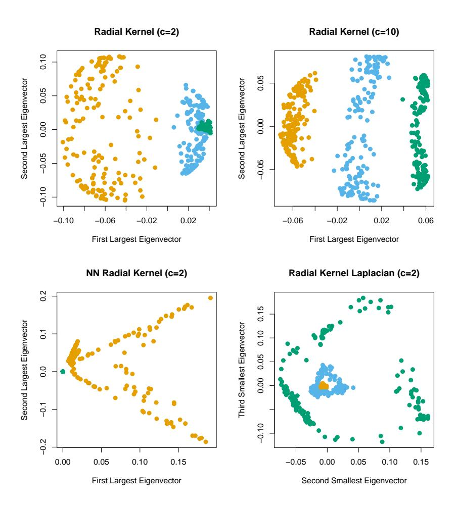

FIGURE 14.30. Kernel principal components applied to the toy example of Figure 14.29, using different kernels. (Top left:) Radial kernel (14.67) with c = 2. (Top right:) Radial kernel with c = 10. (Bottom left): Nearest neighbor radial kernel W from spectral clustering. (Bottom right:) Spectral clustering with Laplacian constructed from the radial kernel.

similarity matrix for constructing the Laplacian (14.63) in spectral clustering. In neither case do the projections separate the two groups. Adjusting c did not help either.

In this toy example, we see that kernel PCA is quite sensitive to the scale and nature of the kernel. We also see that the nearest-neighbor truncation of the kernel is important for the success of spectral clustering.

#### 14.5.5 Sparse Principal Components

We often interpret principal components by examining the direction vectors  $v_j$ , also known as loadings, to see which variables play a role. We did this with the image loadings in (14.55). Often this interpretation is made easier if the loadings are sparse. In this section we briefly discuss some methods for deriving principal components with sparse loadings. They are all based on lasso  $(L_1)$  penalties.

We start with an  $N \times p$  data matrix **X**, with centered columns. The proposed methods focus on either the maximum-variance property of principal components, or the minimum reconstruction error. The SCoTLASS procedure of Joliffe et al. (2003) takes the first approach, by solving

$$\max v^T(\mathbf{X}^T\mathbf{X})v$$
, subject to  $\sum_{j=1}^p |v_j| \le t$ ,  $v^Tv = 1$ . (14.69)

The absolute-value constraint encourages some of the loadings to be zero and hence v to be sparse. Further sparse principal components are found in the same way, by forcing the kth component to be orthogonal to the first k-1 components. Unfortunately this problem is not convex and the computations are difficult.

Zou et al. (2006) start instead with the regression/reconstruction property of PCA, similar to the approach in Section 14.5.1. Let  $x_i$  be the *i*th row of **X**. For a single component, their *sparse principal component* technique solves

$$\min_{\theta, v} \sum_{i=1}^{N} ||x_i - \theta v^T x_i||_2^2 + \lambda ||v||_2^2 + \lambda_1 ||v||_1$$
subject to  $||\theta||_2 = 1$ . (14.70)

Let's examine this formulation in more detail.

- If both  $\lambda$  and  $\lambda_1$  are zero and N > p, it is easy to show that  $v = \theta$  and is the largest principal component direction.
- When  $p \gg N$  the solution is not necessarily unique unless  $\lambda > 0$ . For any  $\lambda > 0$  and  $\lambda_1 = 0$  the solution for v is proportional to the largest principal component direction.
- The second penalty on v encourages sparseness of the loadings.

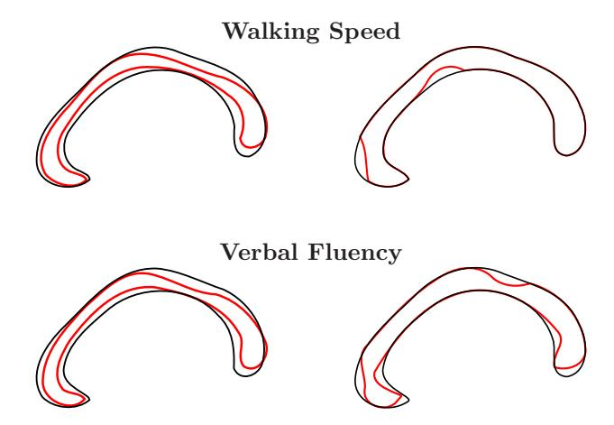

Principal Components Sparse Principal Components

**FIGURE 14.31.** Standard and sparse principal components from a study of the corpus callosum variation. The shape variations corresponding to significant principal components (red curves) are overlaid on the mean CC shape (black curves).

For multiple components, the sparse principal components procedures minimizes

$$\sum_{i=1}^{N} ||x_i - \mathbf{\Theta} \mathbf{V}^T x_i||^2 + \lambda \sum_{k=1}^{K} ||v_k||_2^2 + \sum_{k=1}^{K} \lambda_{1k} ||v_k||_1,$$
 (14.71)

subject to  $\mathbf{\Theta}^T \mathbf{\Theta} = \mathbf{I}_K$ . Here **V** is a  $p \times K$  matrix with columns  $v_k$  and  $\mathbf{\Theta}$  is also  $p \times K$ .

Criterion (14.71) is not jointly convex in  $\mathbf{V}$  and  $\mathbf{\Theta}$ , but it is convex in each parameter with the other parameter fixed<sup>7</sup>. Minimization over  $\mathbf{V}$  with  $\mathbf{\Theta}$  fixed is equivalent to K elastic net problems (Section 18.4) and can be done efficiently. On the other hand, minimization over  $\mathbf{\Theta}$  with  $\mathbf{V}$  fixed is a version of the Procrustes problem (14.56), and is solved by a simple SVD calculation (Exercise 14.12). These steps are alternated until convergence.

Figure 14.31 shows an example of sparse principal components analysis using (14.71), taken from Sjöstrand et al. (2007). Here the shape of the mid-sagittal cross-section of the corpus callosum (CC) is related to various clinical parameters in a study involving 569 elderly persons<sup>8</sup>. In this exam-

<sup>&</sup>lt;sup>7</sup>Note that the usual principal component criterion, for example (14.50), is not jointly convex in the parameters either. Nevertheless, the solution is well defined and an efficient algorithm is available.

<sup>&</sup>lt;sup>8</sup>We thank Rasmus Larsen and Karl Sjöstrand for suggesting this application, and supplying us with the postscript figures reproduced here.

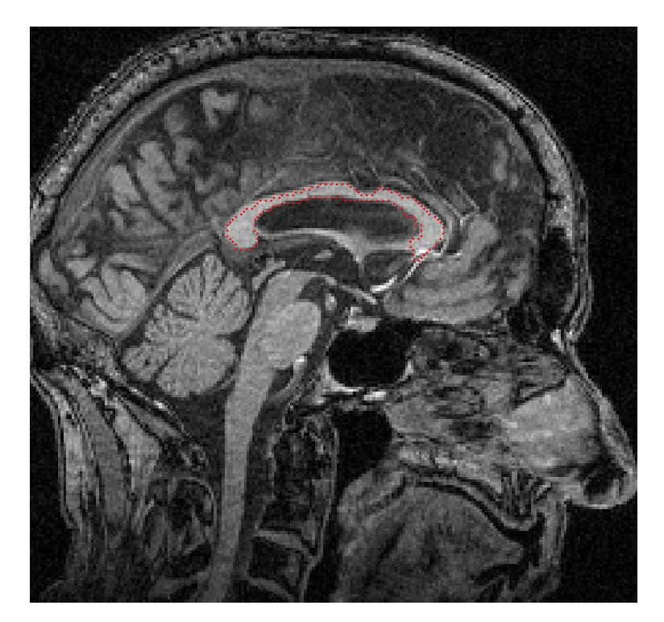

FIGURE 14.32. An example of a mid-saggital brain slice, with the corpus collosum annotated with landmarks.

ple PCA is applied to shape data, and is a popular tool in morphometrics. For such applications, a number of landmarks are identified along the circumference of the shape; an example is given in Figure 14.32. These are aligned by Procrustes analysis to allow for rotations, and in this case scaling as well (see Section 14.5.1). The features used for PCA are the sequence of coordinate pairs for each landmark, unpacked into a single vector.

In this analysis, both standard and sparse principal components were computed, and components that were significantly associated with various clinical parameters were identified. In the figure, the shape variations corresponding to significant principal components (red curves) are overlaid on the mean CC shape (black curves). Low walking speed relates to CCs that are thinner (displaying atrophy) in regions connecting the motor control and cognitive centers of the brain. Low verbal fluency relates to CCs that are thinner in regions connecting auditory/visual/cognitive centers. The sparse principal components procedure gives a more parsimonious, and potentially more informative picture of the important differences.

#### 14.6 Non-negative Matrix Factorization

Non-negative matrix factorization (Lee and Seung, 1999) is a recent alternative approach to principal components analysis, in which the data and components are assumed to be non-negative. It is useful for modeling non-negative data such as images.

The  $N \times p$  data matrix **X** is approximated by

$$\mathbf{X} \approx \mathbf{WH} \tag{14.72}$$

where **W** is  $N \times r$  and **H** is  $r \times p$ ,  $r \leq \max(N, p)$ . We assume that  $x_{ij}, w_{ik}, h_{kj} \geq 0$ .

The matrices W and H are found by maximizing

$$L(\mathbf{W}, \mathbf{H}) = \sum_{i=1}^{N} \sum_{j=1}^{p} [x_{ij} \log(\mathbf{W}\mathbf{H})_{ij} - (\mathbf{W}\mathbf{H})_{ij}].$$
 (14.73)

This is the log-likelihood from a model in which  $x_{ij}$  has a Poisson distribution with mean  $(\mathbf{WH})_{ij}$ —quite reasonable for positive data.

The following alternating algorithm (Lee and Seung, 2001) converges to a local maximum of  $L(\mathbf{W}, \mathbf{H})$ :

$$w_{ik} \leftarrow w_{ik} \frac{\sum_{j=1}^{p} h_{kj} x_{ij} / (\mathbf{WH})_{ij}}{\sum_{j=1}^{p} h_{kj}}$$

$$h_{kj} \leftarrow h_{kj} \frac{\sum_{i=1}^{N} w_{ik} x_{ij} / (\mathbf{WH})_{ij}}{\sum_{i=1}^{N} w_{ik}}$$
(14.74)

This algorithm can be derived as a minorization procedure for maximizing  $L(\mathbf{W}, \mathbf{H})$  (Exercise 14.23) and is also related to the iterative-proportional-scaling algorithm for log-linear models (Exercise 14.24).

Figure 14.33 shows an example taken from Lee and Seung (1999)<sup>9</sup>, comparing non-negative matrix factorization (NMF), vector quantization (VQ, equivalent to k-means clustering) and principal components analysis (PCA). The three learning methods were applied to a database of N=2,429 facial images, each consisting of  $19\times19$  pixels, resulting in a  $2,429\times381$  matrix  $\mathbf{X}$ . As shown in the  $7\times7$  array of montages (each a  $19\times19$  image), each method has learned a set of r=49 basis images. Positive values are illustrated with black pixels and negative values with red pixels. A particular instance of a face, shown at top right, is approximated by a linear superposition of basis images. The coefficients of the linear superposition are shown next to each montage, in a  $7\times7$  array<sup>10</sup>, and the resulting superpositions are shown to the right of the equality sign. The authors point

<sup>&</sup>lt;sup>9</sup>We thank Sebastian Seung for providing this image.

 $<sup>^{10}\</sup>text{These}~7\times7$  arrangements allow for a compact display, and have no structural significance.

out that unlike VQ and PCA, NMF learns to represent faces with a set of basis images resembling parts of faces.

Donoho and Stodden (2004) point out a potentially serious problem with non-negative matrix factorization. Even in situations where  $\mathbf{X} = \mathbf{W}\mathbf{H}$  holds exactly, the decomposition may not be unique. Figure 14.34 illustrates the problem. The data points lie in p=2 dimensions, and there is "open space" between the data and the coordinate axes. We can choose the basis vectors  $h_1$  and  $h_2$  anywhere in this open space, and represent each data point exactly with a nonnegative linear combination of these vectors. This non-uniqueness means that the solution found by the above algorithm depends on the starting values, and it would seem to hamper the interpretability of the factorization. Despite this interpretational drawback, the non-negative matrix factorization and its applications has attracted a lot of interest.

#### 14.6.1 Archetypal Analysis

This method, due to Cutler and Breiman (1994), approximates data points by prototypes that are themselves linear combinations of data points. In this sense it has a similar flavor to K-means clustering. However, rather than approximating each data point by a single nearby prototype, archetypal analysis approximates each data point by a convex combination of a collection of prototypes. The use of a convex combination forces the prototypes to lie on the convex hull of the data cloud. In this sense, the prototypes are "pure,", or "archetypal."

As in (14.72), the  $N \times p$  data matrix **X** is modeled as

$$\mathbf{X} \approx \mathbf{WH} \tag{14.75}$$

where **W** is  $N \times r$  and **H** is  $r \times p$ . We assume that  $w_{ik} \geq 0$  and  $\sum_{k=1}^{r} w_{ik} = 1 \ \forall i$ . Hence the N data points (rows of **X**) in p-dimensional space are represented by convex combinations of the r archetypes (rows of **H**). We also assume that

$$\mathbf{H} = \mathbf{BX} \tag{14.76}$$

where **B** is  $r \times N$  with  $b_{ki} \ge 0$  and  $\sum_{i=1}^{N} b_{ki} = 1 \ \forall k$ . Thus the archetypes themselves are convex combinations of the data points. Using both (14.75) and (14.76) we minimize

$$J(\mathbf{W}, \mathbf{B}) = ||\mathbf{X} - \mathbf{W}\mathbf{H}||^{2}$$
$$= ||\mathbf{X} - \mathbf{W}\mathbf{B}\mathbf{X}||^{2}$$
(14.77)

over the weights **W** and **B**. This function is minimized in an alternating fashion, with each separate minimization involving a convex optimization. The overall problem is not convex however, and so the algorithm converges to a local minimum of the criterion.

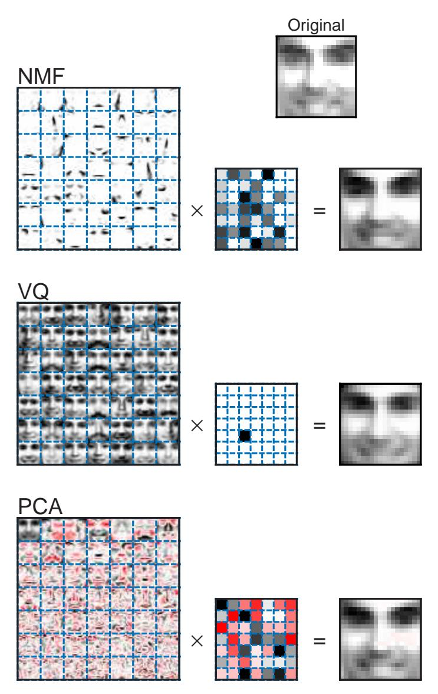

FIGURE 14.33. Non-negative matrix factorization (NMF), vector quantization (VQ, equivalent to k-means clustering) and principal components analysis (PCA) applied to a database of facial images. Details are given in the text. Unlike VQ and PCA, NMF learns to represent faces with a set of basis images resembling parts of faces.

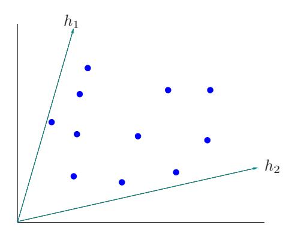

FIGURE 14.34. Non-uniqueness of the non-negative matrix factorization. There are 11 data points in two dimensions. Any choice of the basis vectors h<sup>1</sup> and h<sup>2</sup> in the open space between the coordinate axes and data, gives an exact reconstruction of the data.

Figure 14.35 shows an example with simulated data in two dimensions. The top panel displays the results of archetypal analysis, while the bottom panel shows the results from K-means clustering. In order to best reconstruct the data from convex combinations of the prototypes, it pays to locate the prototypes on the convex hull of the data. This is seen in the top panels of Figure 14.35 and is the case in general, as proven by Cutler and Breiman (1994). K-means clustering, shown in the bottom panels, chooses prototypes in the middle of the data cloud.

We can think of K-means clustering as a special case of the archetypal model, in which each row of W has a single one and the rest of the entries are zero.

Notice also that the archetypal model (14.75) has the same general form as the non-negative matrix factorization model (14.72). However, the two models are applied in different settings, and have somewhat different goals. Non-negative matrix factorization aims to approximate the columns of the data matrix X, and the main output of interest are the columns of W representing the primary non-negative components in the data. Archetypal analysis focuses instead on the approximation of the rows of X using the rows of H, which represent the archetypal data points. Non-negative matrix factorization also assumes that r ≤ p. With r = p, we can get an exact reconstruction simply choosing W to be the data X with columns scaled so that they sum to 1. In contrast, archetypal analysis requires r ≤ N, but allows r > p. In Figure 14.35, for example, p = 2, N = 50 while r = 2, 4 or 8. The additional constraint (14.76) implies that the archetypal approximation will not be perfect, even if r > p.

Figure 14.36 shows the results of archetypal analysis applied to the database of 3's displayed in Figure 14.22. The three rows in Figure 14.36 are the resulting archetypes from three runs, specifying two, three and four

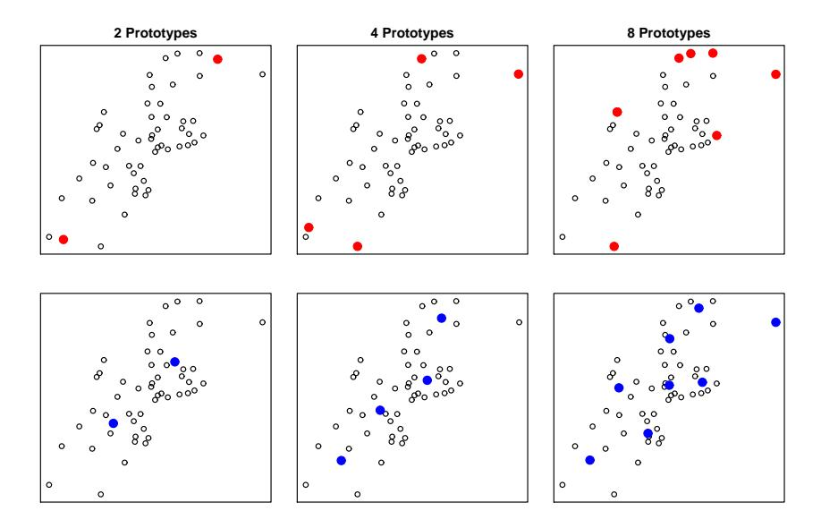

FIGURE 14.35. Archetypal analysis (top panels) and K-means clustering (bottom panels) applied to 50 data points drawn from a bivariate Gaussian distribution. The colored points show the positions of the prototypes in each case.

archetypes, respectively. As expected, the algorithm has produced extreme 3's both in size and shape.

# 14.7 Independent Component Analysis and Exploratory Projection Pursuit

Multivariate data are often viewed as multiple indirect measurements arising from an underlying source, which typically cannot be directly measured. Examples include the following:

- Educational and psychological tests use the answers to questionnaires to measure the underlying intelligence and other mental abilities of subjects.
- EEG brain scans measure the neuronal activity in various parts of the brain indirectly via electromagnetic signals recorded at sensors placed at various positions on the head.
- The trading prices of stocks change constantly over time, and reflect various unmeasured factors such as market confidence, external in-

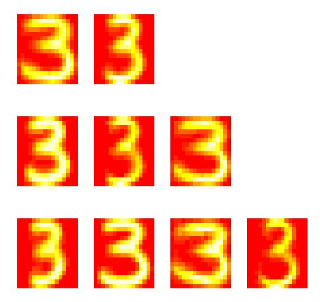

FIGURE 14.36. Archetypal analysis applied to the database of digitized 3's. The rows in the figure show the resulting archetypes from three runs, specifying two, three and four archetypes, respectively.

fluences, and other driving forces that may be hard to identify or measure.

Factor analysis is a classical technique developed in the statistical literature that aims to identify these latent sources. Factor analysis models are typically wed to Gaussian distributions, which has to some extent hindered their usefulness. More recently, independent component analysis has emerged as a strong competitor to factor analysis, and as we will see, relies on the non-Gaussian nature of the underlying sources for its success.

## 14.7.1 Latent Variables and Factor Analysis

The singular-value decomposition X = UDV<sup>T</sup> (14.54) has a latent variable representation. Writing S = √ NU and A<sup>T</sup> = DV<sup>T</sup> / √ N, we have X = SA<sup>T</sup> , and hence each of the columns of X is a linear combination of the columns of S. Now since U is orthogonal, and assuming as before that the columns of X (and hence U) each have mean zero, this implies that the columns of S have zero mean, are uncorrelated and have unit variance. In terms of random variables, we can interpret the SVD, or the corresponding principal component analysis (PCA) as an estimate of a latent variable model

$$X_{1} = a_{11}S_{1} + a_{12}S_{2} + \dots + a_{1p}S_{p}$$

$$X_{2} = a_{21}S_{1} + a_{22}S_{2} + \dots + a_{2p}S_{p}$$

$$\vdots \qquad \vdots$$

$$X_{p} = a_{p1}S_{1} + a_{p2}S_{2} + \dots + a_{pp}S_{p},$$

$$(14.78)$$

or simply  $X = \mathbf{A}S$ . The correlated  $X_j$  are each represented as a linear expansion in the uncorrelated, unit variance variables  $S_{\ell}$ . This is not too satisfactory, though, because given any orthogonal  $p \times p$  matrix  $\mathbf{R}$ , we can write

$$X = \mathbf{A}S$$

$$= \mathbf{A}\mathbf{R}^{T}\mathbf{R}S$$

$$= \mathbf{A}^{*}S^{*}, \qquad (14.79)$$

and  $\operatorname{Cov}(S^*) = \mathbf{R} \operatorname{Cov}(S) \mathbf{R}^T = \mathbf{I}$ . Hence there are many such decompositions, and it is therefore impossible to identify any particular latent variables as unique underlying sources. The SVD decomposition does have the property that any rank q < p truncated decomposition approximates  $\mathbf{X}$  in an optimal way.

The classical factor analysis model, developed primarily by researchers in psychometrics, alleviates these problems to some extent; see, for example, Mardia et al. (1979). With q < p, a factor analysis model has the form

$$X_{1} = a_{11}S_{1} + \dots + a_{1q}S_{q} + \varepsilon_{1}$$

$$X_{2} = a_{21}S_{1} + \dots + a_{2q}S_{q} + \varepsilon_{2}$$

$$\vdots \qquad \vdots$$

$$X_{p} = a_{p1}S_{1} + \dots + a_{pq}S_{q} + \varepsilon_{p},$$
(14.80)

or  $X = \mathbf{A}S + \varepsilon$ . Here S is a vector of q < p underlying latent variables or factors,  $\mathbf{A}$  is a  $p \times q$  matrix of factor loadings, and the  $\varepsilon_j$  are uncorrelated zero-mean disturbances. The idea is that the latent variables  $S_\ell$  are common sources of variation amongst the  $X_j$ , and account for their correlation structure, while the uncorrelated  $\varepsilon_j$  are unique to each  $X_j$  and pick up the remaining unaccounted variation. Typically the  $S_\ell$  and the  $\varepsilon_j$  are modeled as Gaussian random variables, and the model is fit by maximum likelihood. The parameters all reside in the covariance matrix

$$\mathbf{\Sigma} = \mathbf{A}\mathbf{A}^T + \mathbf{D}_{\varepsilon},\tag{14.81}$$

where  $\mathbf{D}_{\varepsilon} = \mathrm{diag}[\mathrm{Var}(\varepsilon_1), \ldots, \mathrm{Var}(\varepsilon_p)]$ . The  $S_{\ell}$  being Gaussian and uncorrelated makes them statistically independent random variables. Thus a battery of educational test scores would be thought to be driven by the independent underlying factors such as *intelligence*, *drive* and so on. The columns of  $\mathbf{A}$  are referred to as the *factor loadings*, and are used to name and interpret the factors.

Unfortunately the identifiability issue (14.79) remains, since A and AR<sup>T</sup> are equivalent in (14.81) for any q × q orthogonal R. This leaves a certain subjectivity in the use of factor analysis, since the user can search for rotated versions of the factors that are more easily interpretable. This aspect has left many analysts skeptical of factor analysis, and may account for its lack of popularity in contemporary statistics. Although we will not go into details here, the SVD plays a key role in the estimation of (14.81). For example, if the Var(ε<sup>j</sup> ) are all assumed to be equal, the leading q components of the SVD identify the subspace determined by A.

Because of the separate disturbances ε<sup>j</sup> for each X<sup>j</sup> , factor analysis can be seen to be modeling the correlation structure of the X<sup>j</sup> rather than the covariance structure. This can be easily seen by standardizing the covariance structure in (14.81) (Exercise 14.14). This is an important distinction between factor analysis and PCA, although not central to the discussion here. Exercise 14.15 discusses a simple example where the solutions from factor analysis and PCA differ dramatically because of this distinction.

# 14.7.2 Independent Component Analysis

The independent component analysis (ICA) model has exactly the same form as (14.78), except the S<sup>ℓ</sup> are assumed to be statistically independent rather than uncorrelated. Intuitively, lack of correlation determines the second-degree cross-moments (covariances) of a multivariate distribution, while in general statistical independence determines all of the crossmoments. These extra moment conditions allow us to identify the elements of A uniquely. Since the multivariate Gaussian distribution is determined by its second moments alone, it is the exception, and any Gaussian independent components can be determined only up to a rotation, as before. Hence identifiability problems in (14.78) and (14.80) can be avoided if we assume that the S<sup>ℓ</sup> are independent and non-Gaussian.

Here we will discuss the full p-component model as in (14.78), where the S<sup>ℓ</sup> are independent with unit variance; ICA versions of the factor analysis model (14.80) exist as well. Our treatment is based on the survey article by Hyv¨arinen and Oja (2000).

We wish to recover the mixing matrix A in X = AS. Without loss of generality, we can assume that X has already been whitened to have Cov(X) = I; this is typically achieved via the SVD described above. This in turn implies that A is orthogonal, since S also has covariance I. So solving the ICA problem amounts to finding an orthogonal A such that the components of the vector random variable S = A<sup>T</sup> X are independent (and non-Gaussian).

Figure 14.37 shows the power of ICA in separating two mixed signals. This is an example of the classical cocktail party problem, where different microphones X<sup>j</sup> pick up mixtures of different independent sources S<sup>ℓ</sup> (music, speech from different speakers, etc.). ICA is able to perform blind

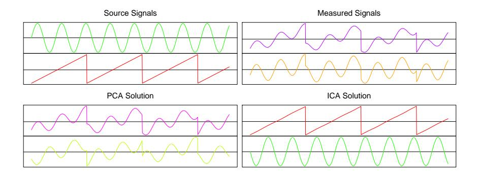

FIGURE 14.37. Illustration of ICA vs. PCA on artificial time-series data. The upper left panel shows the two source signals, measured at 1000 uniformly spaced time points. The upper right panel shows the observed mixed signals. The lower two panels show the principal components and independent component solutions.

source separation, by exploiting the independence and non-Gaussianity of the original sources.

Many of the popular approaches to ICA are based on entropy. The differential entropy H of a random variable Y with density g(y) is given by

$$H(Y) = -\int g(y)\log g(y)dy. \tag{14.82}$$

A well-known result in information theory says that among all random variables with equal variance, Gaussian variables have the maximum entropy. Finally, the *mutual information* I(Y) between the components of the random vector Y is a natural measure of dependence:

$$I(Y) = \sum_{j=1}^{p} H(Y_j) - H(Y).$$
(14.83)

The quantity I(Y) is called the Kullback-Leibler distance between the density g(y) of Y and its independence version  $\prod_{j=1}^p g_j(y_j)$ , where  $g_j(y_j)$  is the marginal density of  $Y_j$ . Now if X has covariance I, and  $Y = \mathbf{A}^T X$  with A orthogonal, then it is easy to show that

$$I(Y) = \sum_{j=1}^{p} H(Y_j) - H(X) - \log|\det \mathbf{A}|$$
 (14.84)

$$= \sum_{j=1}^{p} H(Y_j) - H(X). \tag{14.85}$$

Finding an **A** to minimize  $I(Y) = I(\mathbf{A}^T X)$  looks for the orthogonal transformation that leads to the most independence between its components. In

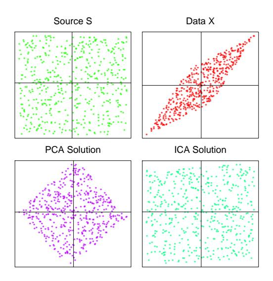

FIGURE 14.38. Mixtures of independent uniform random variables. The upper left panel shows 500 realizations from the two independent uniform sources, the upper right panel their mixed versions. The lower two panels show the PCA and ICA solutions, respectively.

light of (14.84) this is equivalent to minimizing the sum of the entropies of the separate components of Y, which in turn amounts to maximizing their departures from Gaussianity.

For convenience, rather than using the entropy  $H(Y_j)$ , Hyvärinen and Oja (2000) use the *negentropy* measure  $J(Y_i)$  defined by

$$J(Y_j) = H(Z_j) - H(Y_j), (14.86)$$

where  $Z_j$  is a Gaussian random variable with the same variance as  $Y_j$ . Negentropy is non-negative, and measures the departure of  $Y_j$  from Gaussianity. They propose simple approximations to negentropy which can be computed and optimized on data. The ICA solutions shown in Figures 14.37–14.39 use the approximation

$$J(Y_j) \approx [EG(Y_j) - EG(Z_j)]^2, \tag{14.87}$$

where  $G(u) = \frac{1}{a} \log \cosh(au)$  for  $1 \le a \le 2$ . When applied to a sample of  $x_i$ , the expectations are replaced by data averages. This is one of the options in the FastICA software provided by these authors. More classical (and less robust) measures are based on fourth moments, and hence look for departures from the Gaussian via kurtosis. See Hyvärinen and Oja (2000) for more details. In Section 14.7.4 we describe their approximate Newton algorithm for finding the optimal directions.

In summary then, ICA applied to multivariate data looks for a sequence of orthogonal projections such that the projected data look as far from

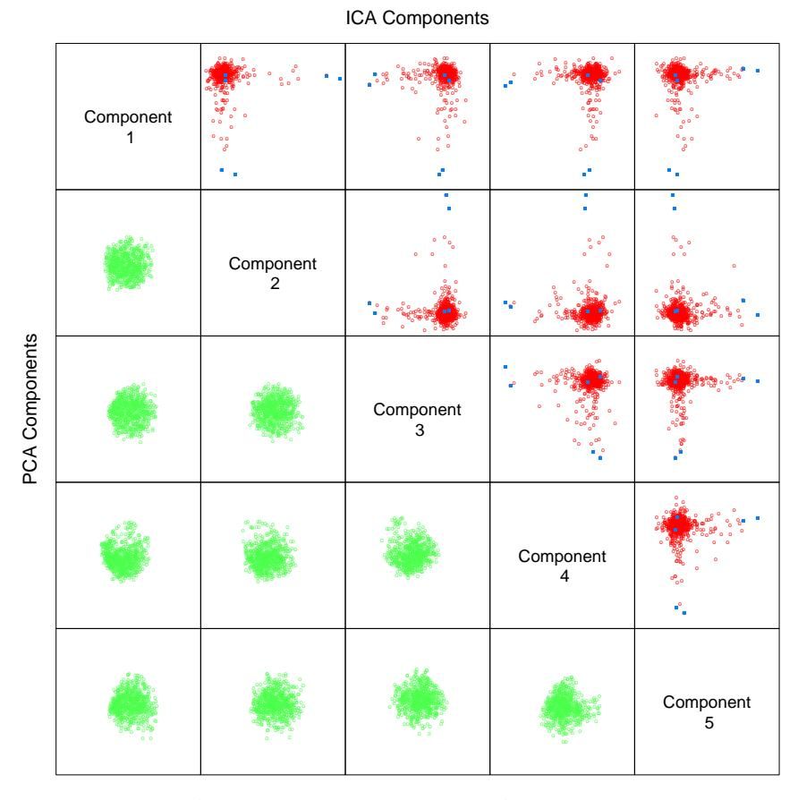

FIGURE 14.39. A comparison of the first five ICA components computed using FastICA (above diagonal) with the first five PCA components(below diagonal). Each component is standardized to have unit variance.

Gaussian as possible. With pre-whitened data, this amounts to looking for components that are as independent as possible.

ICA starts from essentially a factor analysis solution, and looks for rotations that lead to independent components. From this point of view, ICA is just another factor rotation method, along with the traditional "varimax" and "quartimax" methods used in psychometrics.

#### Example: Handwritten Digits

We revisit the handwritten threes analyzed by PCA in Section 14.5.1. Figure 14.39 compares the first five (standardized) principal components with the first five ICA components, all shown in the same standardized units. Note that each plot is a two-dimensional projection from a 256-dimensional

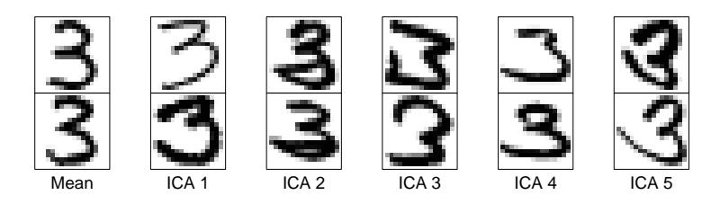

FIGURE 14.40. The highlighted digits from Figure 14.39. By comparing with the mean digits, we see the nature of the ICA component.

space. While the PCA components all appear to have joint Gaussian distributions, the ICA components have long-tailed distributions. This is not too surprising, since PCA focuses on variance, while ICA specifically looks for non-Gaussian distributions. All the components have been standardized, so we do not see the decreasing variances of the principal components.

For each ICA component we have highlighted two of the extreme digits, as well as a pair of central digits and displayed them in Figure 14.40. This illustrates the nature of each of the components. For example, ICA component five picks up the long sweeping tailed threes.

#### Example: EEG Time Courses

ICA has become an important tool in the study of brain dynamics—the example we present here uses ICA to untangle the components of signals in multi-channel electroencephalographic (EEG) data (Onton and Makeig, 2006).

Subjects wear a cap embedded with a lattice of 100 EEG electrodes, which record brain activity at different locations on the scalp. Figure 14.41<sup>11</sup> (top panel) shows 15 seconds of output from a subset of nine of these electrodes from a subject performing a standard "two-back" learning task over a 30 minute period. The subject is presented with a letter (B, H, J, C, F, or K) at roughly 1500-ms intervals, and responds by pressing one of two buttons to indicate whether the letter presented is the same or different from that presented two steps back. Depending on the answer, the subject earns or loses points, and occasionally earns bonus or loses penalty points. The time-course data show spatial correlation in the EEG signals—the signals of nearby sensors look very similar.

The key assumption here is that signals recorded at each scalp electrode are a mixture of independent potentials arising from different cortical ac-

<sup>11</sup>Reprinted from Progress in Brain Research, Vol. 159, Julie Onton and Scott Makeig, "Information based modeling of event-related brain dynamics," Page 106 , Copyright (2006), with permission from Elsevier. We thank Julie Onton and Scott Makeig for supplying an electronic version of the image.

tivities, as well as non-cortical artifact domains; see the reference for a detailed overview of ICA in this domain.

The lower part of Figure 14.41 shows a selection of ICA components. The colored images represent the estimated unmixing coefficient vectors  $\hat{a}_j$  as heatmap images superimposed on the scalp, indicating the location of activity. The corresponding time-courses show the activity of the learned ICA components.

For example, the subject blinked after each performance feedback signal (colored vertical lines), which accounts for the location and artifact signal in IC1 and IC3. IC12 is an artifact associated with the cardiac pulse. IC4 and IC7 account for frontal theta-band activities, and appear after a stretch of correct performance. See Onton and Makeig (2006) for a more detailed discussion of this example, and the use of ICA in EEG modeling.

#### 14.7.3 Exploratory Projection Pursuit

Friedman and Tukey (1974) proposed exploratory projection pursuit, a graphical exploration technique for visualizing high-dimensional data. Their view was that most low (one- or two-dimensional) projections of highdimensional data look Gaussian. Interesting structure, such as clusters or long tails, would be revealed by non-Gaussian projections. They proposed a number of projection indices for optimization, each focusing on a different departure from Gaussianity. Since their initial proposal, a variety of improvements have been suggested (Huber, 1985; Friedman, 1987), and a variety of indices, including entropy, are implemented in the interactive graphics package Xgobi (Swayne et al., 1991, now called GGobi). These projection indices are exactly of the same form as  $J(Y_i)$  above, where  $Y_i = a_i^T X$ , a normalized linear combination of the components of X. In fact, some of the approximations and substitutions for cross-entropy coincide with indices proposed for projection pursuit. Typically with projection pursuit, the directions  $a_i$  are not constrained to be orthogonal. Friedman (1987) transforms the data to look Gaussian in the chosen projection, and then searches for subsequent directions. Despite their different origins, ICA and exploratory projection pursuit are quite similar, at least in the representation described here.

#### 14.7.4 A Direct Approach to ICA


Independent components have by definition a joint product density

$$f_S(s) = \prod_{j=1}^p f_j(s_j),$$
 (14.88)

so here we present an approach that estimates this density directly using generalized additive models (Section 9.1). Full details can be found in

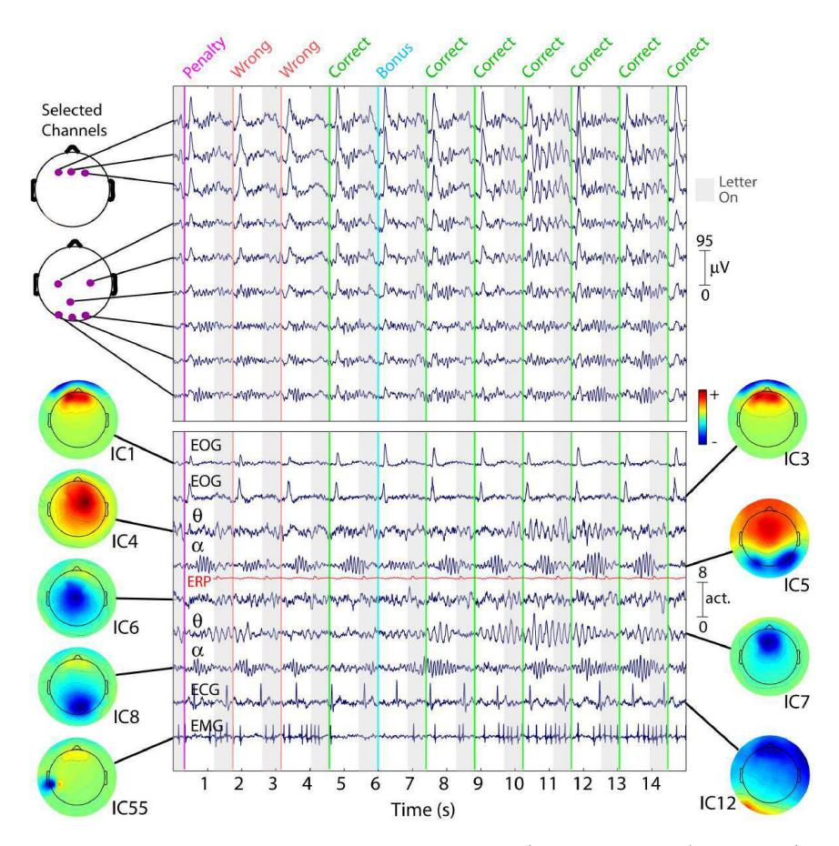

FIGURE 14.41. Fifteen seconds of EEG data (of 1917 seconds) at nine (of 100) scalp channels (top panel), as well as nine ICA components (lower panel). While nearby electrodes record nearly identical mixtures of brain and non-brain activity, ICA components are temporally distinct. The colored scalps represent the ICA unmixing coefficients aˆ<sup>j</sup> as a heatmap, showing brain or scalp location of the source.

Hastie and Tibshirani (2003), and the method is implemented in the R package ProDenICA, available from CRAN.

In the spirit of representing departures from Gaussianity, we represent each  $f_i$  as

$$f_j(s_j) = \phi(s_j)e^{g_j(s_j)},$$
 (14.89)

a tilted Gaussian density. Here  $\phi$  is the standard Gaussian density, and  $g_j$  satisfies the normalization conditions required of a density. Assuming as before that X is pre-whitened, the log-likelihood for the observed data  $X = \mathbf{A}S$  is

$$\ell(\mathbf{A}, \{g_j\}_1^p; \mathbf{X}) = \sum_{i=1}^N \sum_{j=1}^p \left[ \log \phi_j(a_j^T x_i) + g_j(a_j^T x_i) \right], \tag{14.90}$$

which we wish to maximize subject to the constraints that **A** is orthogonal and that the  $g_j$  result in densities in (14.89). Without imposing any further restrictions on  $g_j$ , the model (14.90) is over-parametrized, so we instead maximize a regularized version

$$\sum_{j=1}^{p} \left[ \frac{1}{N} \sum_{i=1}^{N} \left[ \log \phi(a_j^T x_i) + g_j(a_j^T x_i) \right] - \int \phi(t) e^{g_j(t)} dt - \lambda_j \int \{g_j'''(t)\}^2(t) dt \right].$$
(14.91)

We have subtracted two penalty terms (for each j) in (14.91), inspired by Silverman (1986, Section 5.4.4):

- The first enforces the density constraint  $\int \phi(t)e^{\hat{g}_j(t)}dt = 1$  on any solution  $\hat{g}_j$ .
- The second is a roughness penalty, which guarantees that the solution  $\hat{g}_j$  is a quartic-spline with knots at the observed values of  $s_{ij} = a_i^T x_i$ .

It can further be shown that the solution densities  $\hat{f}_j = \phi e^{\hat{g}_j}$  each have mean zero and variance one (Exercise 14.18). As we increase  $\lambda_j$ , these solutions approach the standard Gaussian  $\phi$ .

#### Algorithm 14.3 Product Density ICA Algorithm: ProDenICA

- 1. Initialize A (random Gaussian matrix followed by orthogonalization).
- 2. Alternate until convergence of **A**:
  - (a) Given **A**, optimize (14.91) w.r.t.  $g_j$  (separately for each j).
  - (b) Given  $g_j$ , j = 1, ..., p, perform one step of a fixed point algorithm towards finding the optimal **A**.

We fit the functions  $g_j$  and directions  $a_j$  by optimizing (14.91) in an alternating fashion, as described in Algorithm 14.3.

Step 2(a) amounts to a semi-parametric density estimation, which can be solved using a novel application of generalized additive models. For convenience we extract one of the p separate problems,

$$\frac{1}{N} \sum_{i=1}^{N} \left[ \log \phi(s_i) + g(s_i) \right] - \int \phi(t) e^{g(t)} dt - \lambda \int \{g'''(t)\}^2(t) dt.$$
 (14.92)

Although the second integral in (14.92) leads to a smoothing spline, the first integral is problematic, and requires an approximation. We construct a fine grid of L values  $s_{\ell}^*$  in increments  $\Delta$  covering the observed values  $s_i$ , and count the number of  $s_i$  in the resulting bins:

$$y_{\ell}^* = \frac{\#s_i \in (s_{\ell}^* - \Delta/2, s_{\ell}^* + \Delta/2)}{N}.$$
 (14.93)

Typically we pick L to be 1000, which is more than adequate. We can then approximate (14.92) by

$$\sum_{\ell=1}^{L} \left\{ y_i^* \left[ \log(\phi(s_\ell^*)) + g(s_\ell^*) \right] - \Delta \phi(s_\ell^*) e^{g(s_\ell^*)} \right\} - \lambda \int g'''^2(s) ds. \quad (14.94)$$

This last expression can be seen to be proportional to a penalized Poisson log-likelihood with response  $y_\ell^*/\Delta$  and penalty parameter  $\lambda/\Delta$ , and mean  $\mu(s) = \phi(s)e^{g(s)}$ . This is a generalized additive spline model (Hastie and Tibshirani, 1990; Efron and Tibshirani, 1996), with an offset term  $\log \phi(s)$ , and can be fit using a Newton algorithm in O(L) operations. Although a quartic spline is called for, we find in practice that a cubic spline is adequate. We have p tuning parameters  $\lambda_j$  to set; in practice we make them all the same, and specify the amount of smoothing via the effective degrees-of-freedom  $df(\lambda)$ . Our software uses 5df as a default value.

Step 2(b) in Algorithm 14.3 requires optimizing (14.91) with respect to  $\mathbf{A}$ , holding the  $\hat{g}_j$  fixed. Only the first terms in the sum involve  $\mathbf{A}$ , and since  $\mathbf{A}$  is orthogonal, the collection of terms involving  $\phi$  do not depend on  $\mathbf{A}$  (Exercise 14.19). Hence we need to maximize

$$C(\mathbf{A}) = \frac{1}{N} \sum_{j=1}^{p} \sum_{i=1}^{N} \hat{g}_{j}(a_{j}^{T} x_{i})$$

$$= \sum_{j=1}^{p} C_{j}(a_{j})$$
(14.95)

 $C(\mathbf{A})$  is a log-likelihood ratio between the fitted density and a Gaussian, and can be seen as an estimate of negentropy (14.86), with each  $\hat{g}_j$  a contrast function as in (14.87). The fixed point update in step 2(b) is a modified Newton step (Exercise 14.20)

1. For each j update

$$a_j \leftarrow \mathrm{E}\left\{X\hat{g}_j'(a_j^T X) - \mathrm{E}[\hat{g}_j''(a_j^T X)]a_j\right\},$$
 (14.96)

where E represents expectation w.r.t the sample  $x_i$ . Since  $\hat{g}_j$  is a fitted quartic (or cubic) spline, the first and second derivatives are readily available.

2. Orthogonalize **A** using the symmetric square-root transformation  $(\mathbf{A}\mathbf{A}^T)^{-\frac{1}{2}}\mathbf{A}$ . If  $\mathbf{A} = \mathbf{U}\mathbf{D}\mathbf{V}^T$  is the SVD of **A**, it is easy to show that this leads to the update  $\mathbf{A} \leftarrow \mathbf{U}\mathbf{V}^T$ .

Our ProDenICA algorithm works as well as FastICA on the artificial time series data of Figure 14.37, the mixture of uniforms data of Figure 14.38, and the digit data in Figure 14.39.

#### Example: Simulations

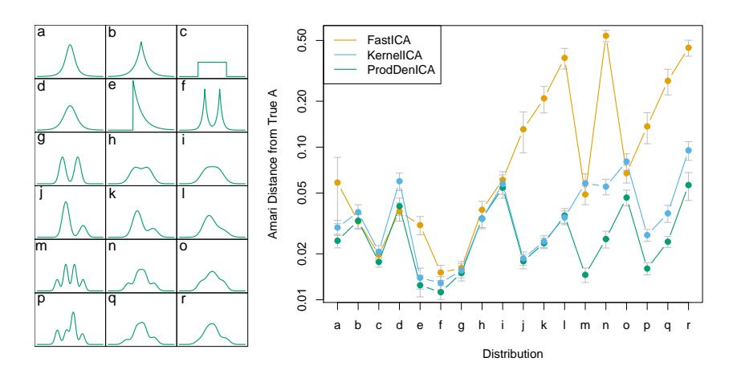

**FIGURE 14.42.** The left panel shows 18 distributions used for comparisons. These include the "t", uniform, exponential, mixtures of exponentials, symmetric and asymmetric Gaussian mixtures. The right panel shows (on the log scale) the average Amari metric for each method and each distribution, based on 30 simulations in  $\mathbb{R}^2$  for each distribution.

Figure 14.42 shows the results of a simulation comparing ProDenICA to FastICA, and another semi-parametric competitor KernelICA (Bach and Jordan, 2002). The left panel shows the 18 distributions used as a basis of comparison. For each distribution, we generated a pair of independent components (N=1024), and a random mixing matrix in  $\mathbb{R}^2$  with condition number between 1 and 2. We used our R implementations of FastICA, using the negentropy criterion (14.87), and ProDenICA. For KernelICA we used

the authors MATLAB code.<sup>12</sup> Since the search criteria are nonconvex, we used five random starts for each method. Each of the algorithms delivers an orthogonal mixing matrix  $\mathbf{A}$  (the data were *pre-whitened*), which is available for comparison with the generating orthogonalized mixing matrix  $\mathbf{A}_0$ . We used the Amari metric (Bach and Jordan, 2002) as a measure of the closeness of the two frames:

$$d(\mathbf{A}_0, \mathbf{A}) = \frac{1}{2p} \sum_{i=1}^{p} \left( \frac{\sum_{j=1}^{p} |r_{ij}|}{\max_{j} |r_{ij}|} - 1 \right) + \frac{1}{2p} \sum_{j=1}^{p} \left( \frac{\sum_{i=1}^{p} |r_{ij}|}{\max_{i} |r_{ij}|} - 1 \right), (14.97)$$

where  $r_{ij} = (\mathbf{A}_o \mathbf{A}^{-1})_{ij}$ . The right panel in Figure 14.42 compares the averages (on the log scale) of the Amari metric between the truth and the estimated mixing matrices. ProDenICA is competitive with FastICA and KernelICA in all situations, and dominates most of the mixture simulations.

# 14.8 Multidimensional Scaling

Both self-organizing maps and principal curves and surfaces map data points in  $\mathbb{R}^p$  to a lower-dimensional manifold. Multidimensional scaling (MDS) has a similar goal, but approaches the problem in a somewhat different way.

We start with observations  $x_1, x_2, \ldots, x_N \in \mathbb{R}^p$ , and let  $d_{ij}$  be the distance between observations i and j. Often we choose Euclidean distance  $d_{ij} = ||x_i - x_j||$ , but other distances may be used. Further, in some applications we may not even have available the data points  $x_i$ , but only have some dissimilarity measure  $d_{ij}$  (see Section 14.3.10). For example, in a wine tasting experiment,  $d_{ij}$  might be a measure of how different a subject judged wines i and j, and the subject provides such a measure for all pairs of wines i, j. MDS requires only the dissimilarities  $d_{ij}$ , in contrast to the SOM and principal curves and surfaces which need the data points  $x_i$ .

Multidimensional scaling seeks values  $z_1, z_2, \dots, z_N \in \mathbb{R}^k$  to minimize the so-called *stress function*<sup>13</sup>

$$S_M(z_1, z_2, \dots, z_N) = \sum_{i \neq i'} (d_{ii'} - ||z_i - z_{i'}||)^2.$$
 (14.98)

This is known as *least squares* or *Kruskal–Shephard* scaling. The idea is to find a lower-dimensional representation of the data that preserves the pairwise distances as well as possible. Notice that the approximation is

<sup>&</sup>lt;sup>12</sup>Francis Bach kindly supplied this code, and helped us set up the simulations.

 $<sup>^{13}</sup>$ Some authors define stress as the square-root of  $S_M$ ; since it does not affect the optimization, we leave it squared to make comparisons with other criteria simpler.

in terms of the distances rather than squared distances (which results in slightly messier algebra). A gradient descent algorithm is used to minimize  $S_M$ .

A variation on least squares scaling is the so-called Sammon mapping which minimizes

$$S_{Sm}(z_1, z_2, \dots, z_N) = \sum_{i \neq i'} \frac{(d_{ii'} - ||z_i - z_{i'}||)^2}{d_{ii'}}.$$
 (14.99)

Here more emphasis is put on preserving smaller pairwise distances.

In classical scaling, we instead start with similarities  $s_{ii'}$ : often we use the centered inner product  $s_{ii'} = \langle x_i - \bar{x}, x_{i'} - \bar{x} \rangle$ . The problem then is to minimize

$$S_C(z_1, z_2, \dots, z_N) = \sum_{i,i'} (s_{ii'} - \langle z_i - \bar{z}, z_{i'} - \bar{z} \rangle)^2$$
 (14.100)

over  $z_1, z_2, \ldots, z_N \in \mathbb{R}^k$ . This is attractive because there is an explicit solution in terms of eigenvectors: see Exercise 14.11. If we have distances rather than inner-products, we can convert them to centered inner-products if the distances are *Euclidean*;<sup>14</sup> see (18.31) on page 671 in Chapter 18. If the similarities are in fact centered inner-products, classical scaling is exactly equivalent to principal components, an inherently linear dimension-reduction technique. Classical scaling is not equivalent to least squares scaling; the loss functions are different, and the mapping can be nonlinear.

Least squares and classical scaling are referred to as *metric* scaling methods, in the sense that the actual dissimilarities or similarities are approximated. *Shephard–Kruskal nonmetric scaling* effectively uses only ranks. Nonmetric scaling seeks to minimize the stress function

$$S_{NM}(z_1, z_2, \dots, z_N) = \frac{\sum_{i \neq i'} \left[ ||z_i - z_{i'}|| - \theta(d_{ii'}) \right]^2}{\sum_{i \neq i'} ||z_i - z_{i'}||^2}$$
(14.101)

over the  $z_i$  and an arbitrary increasing function  $\theta$ . With  $\theta$  fixed, we minimize over  $z_i$  by gradient descent. With the  $z_i$  fixed, the method of isotonic regression is used to find the best monotonic approximation  $\theta(d_{ii'})$  to  $||z_i - z_{i'}||$ . These steps are iterated until the solutions stabilize.

Like the self-organizing map and principal surfaces, multidimensional scaling represents high-dimensional data in a low-dimensional coordinate system. Principal surfaces and SOMs go a step further, and approximate the original data by a low-dimensional manifold, parametrized in the low dimensional coordinate system. In a principal surface and SOM, points

 $<sup>^{14}{\</sup>rm An}~N\times N$  distance matrix is Euclidean if the entries represent pairwise Euclidean distances between N points in some dimensional space.

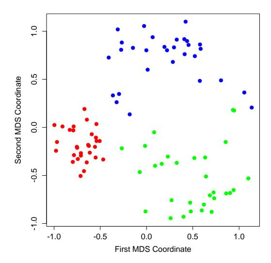

FIGURE 14.43. First two coordinates for half-sphere data, from classical multidimensional scaling.

close together in the original feature space should map close together on the manifold, but points far apart in feature space might also map close together. This is less likely in multidimensional scaling since it explicitly tries to preserve all pairwise distances.

Figure 14.43 shows the first two MDS coordinates from classical scaling for the half-sphere example. There is clear separation of the clusters, and the tighter nature of the red cluster is apparent.

# 14.9 Nonlinear Dimension Reduction and Local Multidimensional Scaling

Several methods have been recently proposed for nonlinear dimension reduction, similar in spirit to principal surfaces. The idea is that the data lie close to an intrinsically low-dimensional nonlinear manifold embedded in a high-dimensional space. These methods can be thought of as "flattening" the manifold, and hence reducing the data to a set of low-dimensional coordinates that represent their relative positions in the manifold. They are useful for problems where signal-to-noise ratio is very high (e.g., physical systems), and are probably not as useful for observational data with lower signal-to-noise ratios.

The basic goal is illustrated in the left panel of Figure 14.44. The data lie near a parabola with substantial curvature. Classical MDS does not pre-

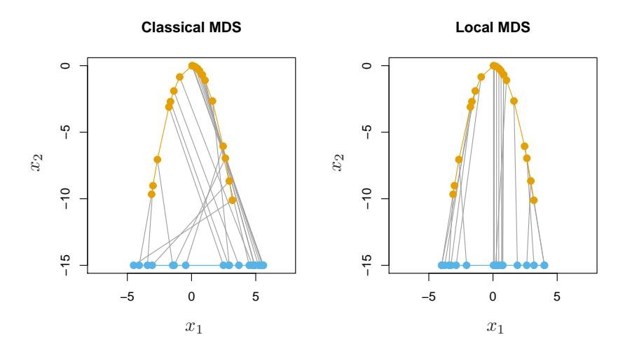

FIGURE 14.44. The orange points show data lying on a parabola, while the blue points shows multidimensional scaling representations in one dimension. Classical multidimensional scaling (left panel) does not preserve the ordering of the points along the curve, because it judges points on opposite ends of the curve to be close together. In contrast, local multidimensional scaling (right panel) does a good job of preserving the ordering of the points along the curve.

serve the ordering of the points along the curve, because it judges points on opposite ends of the curve to be close together. The right panel shows the results of local multi-dimensional scaling, one of the three methods for non-linear multi-dimensional scaling that we discuss below. These methods use only the coordinates of the points in p dimensions, and have no other information about the manifold. Local MDS has done a good job of preserving the ordering of the points along the curve.

We now briefly describe three new approaches to nonlinear dimension reduction and manifold mapping.

Isometric feature mapping (ISOMAP) (Tenenbaum et al., 2000) constructs a graph to approximate the geodesic distance between points along the manifold. Specifically, for each data point we find its neighbors—points within some small Euclidean distance of that point. We construct a graph with an edge between any two neighboring points. The geodesic distance between any two points is then approximated by the shortest path between points on the graph. Finally, classical scaling is applied to the graph distances, to produce a low-dimensional mapping.

Local linear embedding (Roweis and Saul, 2000) takes a very different approach, trying to preserve the local affine structure of the high-dimensional data. Each data point is approximated by a linear combination of neighboring points. Then a lower dimensional representation is constructed that best preserves these local approximations. The details are interesting, so we give them here.

- 1. For each data point  $x_i$  in p dimensions, we find its K-nearest neighbors  $\mathcal{N}(i)$  in Euclidean distance.
- 2. We approximate each point by an affine mixture of the points in its neighborhood:

$$\min_{W_{ik}} ||x_i - \sum_{k \in \mathcal{N}(i)} w_{ik} x_k||^2 \tag{14.102}$$

over weights  $w_{ik}$  satisfying  $w_{ik} = 0$ ,  $k \notin \mathcal{N}(i)$ ,  $\sum_{k=1}^{N} w_{ik} = 1$ .  $w_{ik}$  is the contribution of point k to the reconstruction of point i. Note that for a hope of a unique solution, we must have K < p.

3. Finally, we find points  $y_i$  in a space of dimension d < p to minimize

$$\sum_{i=1}^{N} ||y_i - \sum_{k=1}^{N} w_{ik} y_k||^2$$
 (14.103)

with  $w_{ik}$  fixed.

In step 3, we minimize

$$tr[(\mathbf{Y} - \mathbf{W}\mathbf{Y})^{T}(\mathbf{Y} - \mathbf{W}\mathbf{Y})] = tr[\mathbf{Y}^{T}(\mathbf{I} - \mathbf{W})^{T}(\mathbf{I} - \mathbf{W})\mathbf{Y}]$$
(14.104)

where **W** is  $N \times N$ ; **Y** is  $N \times d$ , for some small d < p. The solutions **Y** are the trailing eigenvectors of  $\mathbf{M} = (\mathbf{I} - \mathbf{W})^T (\mathbf{I} - \mathbf{W})$ . Since **1** is a trivial eigenvector with eigenvalue 0, we discard it and keep the next d. This has the side effect that  $\mathbf{1}^T \mathbf{Y} = 0$ , and hence the embedding coordinates are mean centered.

Local MDS (Chen and Buja, 2008) takes the simplest and arguably the most direct approach. We define  $\mathcal{N}$  to be the symmetric set of nearby pairs of points; specifically a pair (i, i') is in  $\mathcal{N}$  if point i is among the K-nearest neighbors of i', or vice-versa. Then we construct the stress function

$$S_L(z_1, z_2, \dots, z_N) = \sum_{(i, i') \in \mathcal{N}} (d_{ii'} - ||z_i - z_{i'}||)^2 + \sum_{(i, i') \notin \mathcal{N}} w \cdot (D - ||z_i - z_{i'}||)^2. (14.105)$$

Here D is some large constant and w is a weight. The idea is that points that are not neighbors are considered to be very far apart; such pairs are given a small weight w so that they don't dominate the overall stress function. To simplify the expression, we take  $w \sim 1/D$ , and let  $D \to \infty$ . Expanding (14.105), this gives

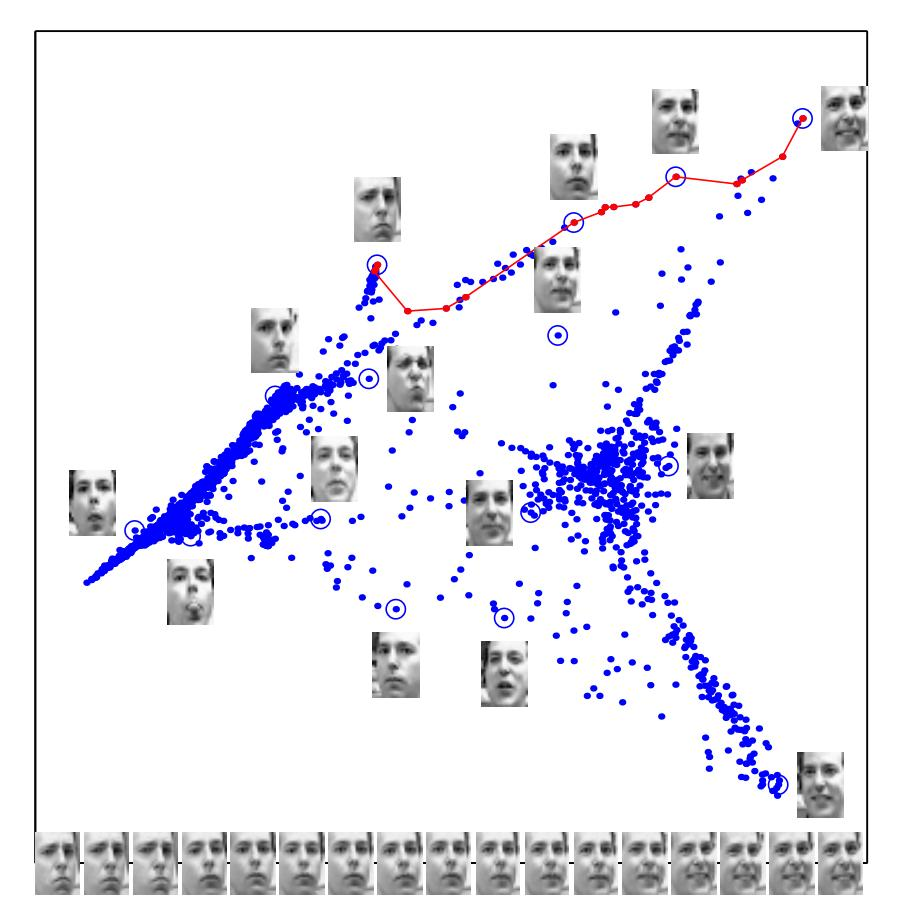

FIGURE 14.45. Images of faces mapped into the embedding space described by the first two coordinates of LLE. Next to the circled points, representative faces are shown in different parts of the space. The images at the bottom of the plot correspond to points along the top right path (linked by solid line), and illustrate one particular mode of variability in pose and expression.

$$S_L(z_1, z_2, \dots, z_N) = \sum_{(i, i') \in \mathcal{N}} (d_{ii'} - ||z_i - z_{i'}||)^2 - \tau \sum_{(i, i') \notin \mathcal{N}} ||z_i - z_{i'}||,$$
(14.106)

where τ = 2wD. The first term in (14.106) tries to preserve local structure in the data, while the second term encourages the representations z<sup>i</sup> , z<sup>i</sup> ′ for pairs (i, i′ ) that are non-neighbors to be farther apart. Local MDS minimizes the stress function (14.106) over z<sup>i</sup> , for fixed values of the number of neighbors K and the tuning parameter τ .

The right panel of Figure 14.44 shows the result of local MDS, using k = 2 neighbors and τ = 0.01. We used coordinate descent with multiple starting values to find a good minimum of the (nonconvex) stress function (14.106). The ordering of the points along the curve has been largely preserved,

Figure 14.45 shows a more interesting application of one of these methods (LLE)15. The data consist of 1965 photographs, digitized as 20 <sup>×</sup> <sup>28</sup> grayscale images. The result of the first two-coordinates of LLE are shown and reveal some variability in pose and expression. Similar pictures were produced by local MDS.

In experiments reported in Chen and Buja (2008), local MDS shows superior performance, as compared to ISOMAP and LLE. They also demonstrate the usefulness of local MDS for graph layout. There are also close connections between the methods discussed here, spectral clustering (Section 14.5.3) and kernel PCA (Section 14.5.4).

# 14.10 The Google PageRank Algorithm

In this section we give a brief description of the original PageRank algorithm used by the Google search engine, an interesting recent application of unsupervised learning methods.

We suppose that we have N web pages and wish to rank them in terms of importance. For example, the N pages might all contain a string match to "statistical learning" and we might wish to rank the pages in terms of their likely relevance to a websurfer.

The PageRank algorithm considers a webpage to be important if many other webpages point to it. However the linking webpages that point to a given page are not treated equally: the algorithm also takes into account both the importance (PageRank) of the linking pages and the number of outgoing links that they have. Linking pages with higher PageRank are given more weight, while pages with more outgoing links are given less weight. These ideas lead to a recursive definition for PageRank, detailed next.

<sup>15</sup>Sam Roweis and Lawrence Saul kindly provided this figure.

Let  $L_{ij} = 1$  if page j points to page i, and zero otherwise. Let  $c_j = \sum_{i=1}^{N} L_{ij}$  equal the number of pages pointed to by page j (number of outlinks). Then the Google  $PageRanks\ p_i$  are defined by the recursive relationship

$$p_i = (1 - d) + d \sum_{j=1}^{N} \left(\frac{L_{ij}}{c_j}\right) p_j$$
 (14.107)

where d is a positive constant (apparently set to 0.85).

The idea is that the importance of page i is the sum of the importances of pages that point to that page. The sums are weighted by  $1/c_j$ , that is, each page distributes a total vote of 1 to other pages. The constant d ensures that each page gets a PageRank of at least 1-d. In matrix notation

$$\mathbf{p} = (1 - d)\mathbf{e} + d \cdot \mathbf{L}\mathbf{D}_c^{-1}\mathbf{p} \tag{14.108}$$

where **e** is a vector of N ones and  $\mathbf{D}_c = \operatorname{diag}(\mathbf{c})$  is a diagonal matrix with diagonal elements  $c_j$ . Introducing the normalization  $\mathbf{e}^T \mathbf{p} = N$  (i.e., the average PageRank is 1), we can write (14.108) as

$$\mathbf{p} = [(1-d)\mathbf{e}\mathbf{e}^{T}/N + d\mathbf{L}\mathbf{D}_{c}^{-1}]\mathbf{p}$$
$$= \mathbf{A}\mathbf{p}$$
(14.109)

where the matrix  $\mathbf{A}$  is the expression in square braces.

Exploiting a connection with Markov chains (see below), it can be shown that the matrix **A** has a real eigenvalue equal to one, and one is its largest eigenvalue. This means that we can find  $\hat{\mathbf{p}}$  by the power method: starting with some  $\mathbf{p} = \mathbf{p}_0$  we iterate

$$\mathbf{p}_k \leftarrow \mathbf{A}\mathbf{p}_{k-1}; \quad \mathbf{p}_k \leftarrow N \frac{\mathbf{p}_k}{\mathbf{e}^T \mathbf{p}_k}.$$
 (14.110)

The fixed points  $\hat{\mathbf{p}}$  are the desired PageRanks.

In the original paper of Page et al. (1998), the authors considered PageR-ank as a model of user behavior, where a random web surfer clicks on links at random, without regard to content. The surfer does a random walk on the web, choosing among available outgoing links at random. The factor 1-d is the probability that he does not click on a link, but jumps instead to a random webpage.

Some descriptions of PageRank have (1-d)/N as the first term in definition (14.107), which would better coincide with the random surfer interpretation. Then the page rank solution (divided by N) is the stationary distribution of an irreducible, aperiodic Markov chain over the N webpages.

Definition (14.107) also corresponds to an irreducible, aperiodic Markov chain, with different transition probabilities than those from the (1-d)/N version. Viewing PageRank as a Markov chain makes clear why the matrix **A** has a maximal real eigenvalue of 1. Since **A** has positive entries with


FIGURE 14.46. PageRank algorithm: example of a small network

each column summing to one, Markov chain theory tells us that it has a unique eigenvector with eigenvalue one, corresponding to the stationary distribution of the chain (Bremaud, 1999).

A small network is shown for illustration in Figure 14.46. The link matrix is

$$\mathbf{L} = \begin{pmatrix} 0 & 0 & 1 & 0 \\ 1 & 0 & 0 & 0 \\ 1 & 1 & 0 & 1 \\ 0 & 0 & 0 & 0 \end{pmatrix} \tag{14.111}$$

and the number of outlinks is  $\mathbf{c} = (2, 1, 1, 1)$ .

The PageRank solution is  $\hat{\mathbf{p}} = (1.49, 0.78, 1.58, 0.15)$ . Notice that page 4 has no incoming links, and hence gets the minimum PageRank of 0.15.

# Bibliographic Notes

There are many books on clustering, including Hartigan (1975), Gordon (1999) and Kaufman and Rousseeuw (1990). K-means clustering goes back at least to Lloyd (1957), Forgy (1965), Jancey (1966) and MacQueen (1967). Applications in engineering, especially in image compression via vector quantization, can be found in Gersho and Gray (1992). The k-medoid procedure is described in Kaufman and Rousseeuw (1990). Association rules are outlined in Agrawal et al. (1995). The self-organizing map was proposed by Kohonen (1989) and Kohonen (1990); Kohonen et al. (2000) give a more recent account. Principal components analysis and multidimensional scaling are described in standard books on multivariate analysis, for example, Mardia et al. (1979). Buja et al. (2008) have implemented a powerful environment called Ggvis for multidimensional scaling, and the user manual

contains a lucid overview of the subject. Figures 14.17, 14.21 (left panel) and 14.28 (left panel) were produced in Xgobi, a multidimensional data visualization package by the same authors. GGobi is a more recent implementation (Cook and Swayne, 2007). Goodall (1991) gives a technical overview of Procrustes methods in statistics, and Ramsay and Silverman (1997) discuss the shape registration problem. Principal curves and surfaces were proposed in Hastie (1984) and Hastie and Stuetzle (1989). The idea of principal points was formulated in Flury (1990), Tarpey and Flury (1996) give an exposition of the general concept of self-consistency. An excellent tutorial on spectral clustering can be found in von Luxburg (2007); this was the main source for Section 14.5.3. Luxborg credits Donath and Hoffman (1973) and Fiedler (1973) with the earliest work on the subject. A history of spectral clustering my be found in Spielman and Teng (1996). Independent component analysis was proposed by Comon (1994), with subsequent developments by Bell and Sejnowski (1995); our treatment in Section 14.7 is based on Hyvärinen and Oja (2000). Projection pursuit was proposed by Friedman and Tukey (1974), and is discussed in detail in Huber (1985). A dynamic projection pursuit algorithm is implemented in GGobi.

#### Exercises

Ex. 14.1 Weights for clustering. Show that weighted Euclidean distance

$$d_e^{(w)}(x_i, x_{i'}) = \frac{\sum_{l=1}^p w_l (x_{il} - x_{i'l})^2}{\sum_{l=1}^p w_l}$$

satisfies

$$d_e^{(w)}(x_i, x_{i'}) = d_e(z_i, z_{i'}) = \sum_{l=1}^p (z_{il} - z_{i'l})^2,$$
(14.112)

where

$$z_{il} = x_{il} \cdot \left(\frac{w_l}{\sum_{l=1}^p w_l}\right)^{1/2}.$$
 (14.113)

Thus weighted Euclidean distance based on x is equivalent to unweighted Euclidean distance based on z.

Ex. 14.2 Consider a mixture model density in p-dimensional feature space,

$$g(x) = \sum_{k=1}^{K} \pi_k g_k(x), \qquad (14.114)$$

where  $g_k = N(\mu_k, \mathbf{L} \cdot \sigma^2)$  and  $\pi_k \ge 0 \ \forall k \text{ with } \sum_k \pi_k = 1$ . Here  $\{\mu_k, \pi_k\}, k = 1, \dots, K \text{ and } \sigma^2 \text{ are unknown parameters.}$ 

Suppose we have data  $x_1, x_2, \ldots, x_N \sim g(x)$  and we wish to fit the mixture model.

- 1. Write down the log-likelihood of the data
- 2. Derive an EM algorithm for computing the maximum likelihood estimates (see Section 8.1).
- 3. Show that if  $\sigma$  has a known value in the mixture model and we take  $\sigma \to 0$ , then in a sense this EM algorithm coincides with K-means clustering.

Ex. 14.3 In Section 14.2.6 we discuss the use of CART or PRIM for constructing generalized association rules. Show that a problem occurs with either of these methods when we generate the random data from the product-marginal distribution; i.e., by randomly permuting the values for each of the variables. Propose ways to overcome this problem.

Ex. 14.4 Cluster the demographic data of Table 14.1 using a classification tree. Specifically, generate a reference sample of the same size of the training set, by randomly permuting the values within each feature. Build a classification tree to the training sample (class 1) and the reference sample (class 0) and describe the terminal nodes having highest estimated class 1 probability. Compare the results to the PRIM results near Table 14.1 and also to the results of K-means clustering applied to the same data.

Ex. 14.5 Generate data with three features, with 30 data points in each of three classes as follows:

```
= U(-\pi/8, \pi/8)
\theta_1
      = U(0, 2\pi)
\phi_1
      = \sin(\theta_1)\cos(\phi_1) + W_{11}
x_1
      = \sin(\theta_1)\sin(\phi_1) + W_{12}
y_1
      = \cos(\theta_1) + W_{13}
z_1
\theta_2
      = U(\pi/2 - \pi/4, \pi/2 + \pi/4)
      = U(-\pi/4, \pi/4)
\phi_2
      = \sin(\theta_2)\cos(\phi_2) + W_{21}
x_2
      =
            \sin(\theta_2)\sin(\phi_2) + W_{22}
y_2
            \cos(\theta_2) + W_{23}
22
            U(\pi/2 - \pi/4, \pi/2 + \pi/4)
\theta_3
      = U(\pi/2 - \pi/4, \pi/2 + \pi/4)
\phi_3
      = \sin(\theta_3)\cos(\phi_3) + W_{31}
x_3
      =
            \sin(\theta_3)\sin(\phi_3) + W_{32}
y_3
      =
            \cos(\theta_3) + W_{33}
```

Here U(a,b) indicates a uniform variate on the range [a,b] and  $W_{jk}$  are independent normal variates with standard deviation 0.6. Hence the data

lie near the surface of a sphere in three clusters centered at (1,0,0), (0,1,0) and (0,0,1).

Write a program to fit a SOM to these data, using the learning rates given in the text. Carry out a K-means clustering of the same data, and compare the results to those in the text.

Ex. 14.6 Write programs to implement K-means clustering and a self-organizing map (SOM), with the prototype lying on a two-dimensional grid. Apply them to the columns of the human tumor microarray data, using K=2,5,10,20 centroids for both. Demonstrate that as the size of the SOM neighborhood is taken to be smaller and smaller, the SOM solution becomes more similar to the K-means solution.

Ex. 14.7 Derive (14.51) and (14.52) in Section 14.5.1. Show that  $\hat{\mu}$  is not unique, and characterize the family of equivalent solutions.

Ex. 14.8 Derive the solution (14.57) to the Procrustes problem (14.56). Derive also the solution to the Procrustes problem with scaling (14.58).

Ex. 14.9 Write an algorithm to solve

$$\min_{\{\beta_{\ell}, \mathbf{R}_{\ell}\}_{1}^{L}, \mathbf{M}} \sum_{\ell=1}^{L} ||\mathbf{X}_{\ell} \mathbf{R}_{\ell} - \mathbf{M}||_{F}^{2}.$$
 (14.115)

Apply it to the three S's, and compare the results to those shown in Figure 14.26.

Ex. 14.10 Derive the solution to the affine-invariant average problem (14.60). Apply it to the three S's, and compare the results to those computed in Exercise 14.9.

Ex. 14.11 Classical multidimensional scaling. Let **S** be the centered inner product matrix with elements  $\langle x_i - \bar{x}, x_j - \bar{x} \rangle$ . Let  $\lambda_1 > \lambda_2 > \cdots > \lambda_k$  be the k largest eigenvalues of **S**, with associated eigenvectors  $\mathbf{E}_k = (\mathbf{e}_1, \mathbf{e}_2, \dots, \mathbf{e}_k)$ . Let  $\mathbf{D}_k$  be a diagonal matrix with diagonal entries  $\sqrt{\lambda_1}$ ,  $\sqrt{\lambda_2}$ , ...,  $\sqrt{\lambda_k}$ . Show that the solutions  $z_i$  to the classical scaling problem (14.100) are the rows of  $\mathbf{E}_k \mathbf{D}_k$ .

Ex. 14.12 Consider the sparse PCA criterion (14.71).

- 1. Show that with  $\Theta$  fixed, solving for  $\mathbf{V}$  amounts to K separate elasticnet regression problems, with responses the K elements of  $\Theta^T x_i$ .
- 2. Show that with  ${\bf V}$  fixed, solving for  ${\bf \Theta}$  amounts to a reduced-rank version of the Procrustes problem, which reduces to

$$\max_{\mathbf{\Theta}} \operatorname{trace}(\mathbf{\Theta}^T \mathbf{M}) \text{ subject to } \mathbf{\Theta}^T \mathbf{\Theta} = \mathbf{I}_K, \tag{14.116}$$

where **M** and  $\Theta$  are both  $p \times K$  with  $K \leq p$ . If  $\mathbf{M} = \mathbf{U}\mathbf{D}\mathbf{Q}^T$  is the SVD of **M**, show that the optimal  $\Theta = \mathbf{U}\mathbf{Q}^T$ .

Ex. 14.13 Generate 200 data points with three features, lying close to a helix. In detail, define  $X_1 = \cos(s) + 0.1 \cdot Z_1, X_2 = \sin(s) + 0.1 \cdot Z_2, X_3 = s + 0.1 \cdot Z_3$  where s takes on 200 equally spaced values between 0 and  $2\pi$ , and  $Z_1, Z_2, Z_3$  are independent and have standard Gaussian distributions.

- (a) Fit a principal curve to the data and plot the estimated coordinate functions. Compare them to the underlying functions  $\cos(s)$ ,  $\sin(s)$  and s.
- (b) Fit a self-organizing map to the same data, and see if you can discover the helical shape of the original point cloud.

Ex. 14.14 Pre- and post-multiply equation (14.81) by a diagonal matrix containing the inverse variances of the  $X_j$ . Hence obtain an equivalent decomposition for the correlation matrix, in the sense that a simple scaling is applied to the matrix  $\mathbf{A}$ .

Ex. 14.15 Generate 200 observations of three variates  $X_1, X_2, X_3$  according to

$$X_1 \sim Z_1$$
  
 $X_2 = X_1 + 0.001 \cdot Z_2$   
 $X_3 = 10 \cdot Z_3$  (14.117)

where  $Z_1, Z_2, Z_3$  are independent standard normal variates. Compute the leading principal component and factor analysis directions. Hence show that the leading principal component aligns itself in the maximal variance direction  $X_3$ , while the leading factor essentially ignores the uncorrelated component  $X_3$ , and picks up the correlated component  $X_2 + X_1$  (Geoffrey Hinton, personal communication).

Ex. 14.16 Consider the kernel principal component procedure outlined in Section 14.5.4. Argue that the number M of principal components is equal to the rank of  $\mathbf{K}$ , which is the number of non-zero elements in  $\mathbf{D}$ . Show that the mth component  $\mathbf{z}_m$  (mth column of  $\mathbf{Z}$ ) can be written (up to centering) as  $z_{im} = \sum_{j=1}^{N} \alpha_{jm} K(x_i, x_j)$ , where  $\alpha_{jm} = u_{jm}/d_m$ . Show that the mapping of a new observation  $x_0$  to the mth component is given by  $z_{0m} = \sum_{j=1}^{N} \alpha_{jm} K(x_0, x_j)$ .

Ex. 14.17 Show that with  $g_1(x) = \sum_{j=1}^{N} c_j K(x, x_j)$ , the solution to (14.66) is given by  $\hat{c}_j = u_{j1}/d_1$ , where  $\mathbf{u}_1$  is the first column of  $\mathbf{U}$  in (14.65), and  $d_1$  the first diagonal element of  $\mathbf{D}$ . Show that the second and subsequent principal component functions are defined in a similar manner (hint: see Section 5.8.1.)

Ex. 14.18 Consider the regularized log-likelihood for the density estimation problem arising in ICA,

$$\frac{1}{N} \sum_{i=1}^{N} \left[ \log \phi(s_i) + g(s_i) \right] - \int \phi(t) e^{g(t)} dt - \lambda \int \{g'''(t)\}^2(t) dt. \quad (14.118)$$

The solution  $\hat{g}$  is a quartic smoothing spline, and can be written as  $\hat{g}(s) = \hat{q}(s) + \hat{q}_{\perp}(s)$ , where q is a quadratic function (in the null space of the penalty). Let  $q(s) = \theta_0 + \theta_1 s + \theta_2 s^2$ . By examining the stationarity conditions for  $\hat{\theta}_k$ , k = 1, 2, 3, show that the solution  $\hat{f} = \phi e^{\hat{g}}$  is a density, and has mean zero and variance one. If we used a second-derivative penalty  $\int \{g''(t)\}^2(t)dt$  instead, what simple modification could we make to the problem to maintain the three moment conditions?

Ex. 14.19 If **A** is  $p \times p$  orthogonal, show that the first term in (14.91) on page 567

$$\sum_{j=1}^{p} \sum_{i=1}^{N} \log \phi(a_j^T x_i),$$

with  $a_j$  the jth column of **A**, does not depend on **A**.

Ex. 14.20 Fixed point algorithm for ICA (Hyvärinen et al., 2001). Consider maximizing  $C(a) = E\{g(a^TX)\}$  with respect to a, with ||a|| = 1 and Cov(X) = I. Use a Lagrange multiplier to enforce the norm constraint, and write down the first two derivatives of the modified criterion. Use the approximation

$$\mathrm{E}\{XX^Tg^{\prime\prime}(a^TX)\}\approx\mathrm{E}\{XX^T\}\mathrm{E}\{g^{\prime\prime}(a^TX)\}$$

to show that the Newton update can be written as the fixed-point update (14.96).

Ex. 14.21 Consider an undirected graph with non-negative edge weights  $w_{ii'}$  and graph Laplacian L. Suppose there are m connected components  $A_1, A_2, \ldots, A_m$  in the graph. Show that there are m eigenvectors of L corresponding to eigenvalue zero, and the indicator vectors of these components  $I_{A_1}, I_{A_2}, \ldots, I_{A_m}$  span the zero eigenspace.

#### Ex. 14.22

- (a) Show that definition (14.108) implies that the sum of the PageRanks  $p_i$  is N, the number of web pages.
- (b) Write a program to compute the *PageRank* solutions by the power method using formulation (14.107). Apply it to the network of Figure 14.47.

Ex. 14.23 Algorithm for non-negative matrix factorization (Wu and Lange, 2007). A function g(x, y) to said to minorize a function f(x) if

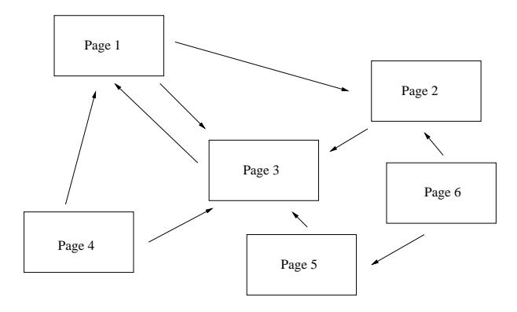

FIGURE 14.47. Example of a small network.

$$g(x,y) \le f(x), \ g(x,x) = f(x)$$
 (14.119)

for all x, y in the domain. This is useful for maximizing f(x) since it is easy to show that f(x) is nondecreasing under the update

$$x^{s+1} = \operatorname{argmax}_{x} g(x, x^{s}) \tag{14.120}$$

There are analogous definitions for majorization, for minimizing a function f(x). The resulting algorithms are known as MM algorithms, for "minorize-maximize" or "majorize-minimize" (Lange, 2004). It also can be shown that the EM algorithm (8.5) is an example of an MM algorithm: see Section 8.5.3 and Exercise 8.2 for details.

(a) Consider maximization of the function  $L(\mathbf{W}, \mathbf{H})$  in (14.73), written here without the matrix notation

$$L(\mathbf{W}, \mathbf{H}) = \sum_{i=1}^{N} \sum_{j=1}^{p} \left[ x_{ij} \log \left( \sum_{k=1}^{r} w_{ik} h_{kj} \right) - \sum_{k=1}^{r} w_{ik} h_{kj} \right].$$

Using the concavity of  $\log(x)$ , show that for any set of r values  $y_k \ge 0$  and  $0 \le c_k \le 1$  with  $\sum_{k=1}^r c_k = 1$ ,

$$\log\left(\sum_{k=1}^{r} y_k\right) \ge \sum_{k=1}^{r} c_k \log(y_k/c_k)$$

Hence

$$\log\left(\sum_{k=1}^r w_{ik} h_{kj}\right) \geq \sum_{k=1}^r \frac{a_{ikj}^s}{b_{ij}^s} \log\left(\frac{b_{ij}^s}{a_{ikj}^s} w_{ik} h_{kj}\right),$$

where

$$a_{ikj}^s = w_{ik}^s h_{kj}^s$$
 and  $b_{ij}^s = \sum_{k=1}^r w_{ik}^s h_{kj}^s$ ,

and s indicates the current iteration.

(b) Hence show that, ignoring constants, the function

$$g(\mathbf{W}, \mathbf{H} \mid \mathbf{W}^{s}, \mathbf{H}^{s}) = \sum_{i=1}^{N} \sum_{j=1}^{p} \sum_{k=1}^{r} x_{ij} \frac{a_{ikj}^{s}}{b_{ij}^{s}} \left( \log w_{ik} + \log h_{kj} \right)$$
$$- \sum_{i=1}^{N} \sum_{j=1}^{p} \sum_{k=1}^{r} w_{ik} h_{kj}$$

minorizes L(W, H).

(c) Set the partial derivatives of <sup>g</sup>(W, <sup>H</sup> <sup>|</sup> <sup>W</sup><sup>s</sup> , H<sup>s</sup> ) to zero and hence derive the updating steps (14.74).

Ex. 14.24 Consider the non-negative matrix factorization (14.72) in the rank one case (r = 1).

(a) Show that the updates (14.74) reduce to

$$w_{i} \leftarrow w_{i} \frac{\sum_{j=1}^{p} x_{ij}}{\sum_{j=1}^{p} w_{i} h_{j}}$$

$$h_{j} \leftarrow h_{j} \frac{\sum_{i=1}^{N} x_{ij}}{\sum_{i=1}^{N} w_{i} h_{j}}$$
(14.121)

where w<sup>i</sup> = wi1, h<sup>j</sup> = h1<sup>j</sup> . This is an example of the iterative proportional scaling procedure, applied to the independence model for a two-way contingency table (Fienberg, 1977, for example).

(b) Show that the final iterates have the explicit form

$$w_i = c \cdot \frac{\sum_{j=1}^p x_{ij}}{\sum_{i=1}^N \sum_{j=1}^p x_{ij}}, \quad h_k = \frac{1}{c} \cdot \frac{\sum_{i=1}^N x_{ik}}{\sum_{i=1}^N \sum_{j=1}^p x_{ij}}$$
 (14.122)

for any constant c > 0. These are equivalent to the usual row and column estimates for a two-way independence model.

Ex. 14.25 Fit a non-negative matrix factorization model to the collection of two's in the digits database. Use 25 basis elements, and compare with a 24- component (plus mean) PCA model. In both cases display the W and H matrices as in Figure 14.33.