# Random Forests

# 15.1 Introduction

Bagging or bootstrap aggregation (section 8.7) is a technique for reducing the variance of an estimated prediction function. Bagging seems to work especially well for high-variance, low-bias procedures, such as trees. For regression, we simply fit the same regression tree many times to bootstrapsampled versions of the training data, and average the result. For classification, a committee of trees each cast a vote for the predicted class.

Boosting in Chapter 10 was initially proposed as a committee method as well, although unlike bagging, the committee of weak learners evolves over time, and the members cast a weighted vote. Boosting appears to dominate bagging on most problems, and became the preferred choice.

Random forests (Breiman, 2001) is a substantial modification of bagging that builds a large collection of de-correlated trees, and then averages them. On many problems the performance of random forests is very similar to boosting, and they are simpler to train and tune. As a consequence, random forests are popular, and are implemented in a variety of packages.

# 15.2 Definition of Random Forests

The essential idea in bagging (Section 8.7) is to average many noisy but approximately unbiased models, and hence reduce the variance. Trees are ideal candidates for bagging, since they can capture complex interaction

#### Algorithm 15.1 Random Forest for Regression or Classification.

- 1. For b = 1 to B:
  - (a) Draw a bootstrap sample  $\mathbf{Z}^*$  of size N from the training data.
  - (b) Grow a random-forest tree  $T_b$  to the bootstrapped data, by recursively repeating the following steps for each terminal node of the tree, until the minimum node size  $n_{min}$  is reached.
    - i. Select m variables at random from the p variables.
    - ii. Pick the best variable/split-point among the m.
    - iii. Split the node into two daughter nodes.
- 2. Output the ensemble of trees  $\{T_b\}_1^B$ .

To make a prediction at a new point x:

Regression:  $\hat{f}_{rf}^B(x) = \frac{1}{B} \sum_{b=1}^B T_b(x)$ .

Classification: Let  $\hat{C}_b(x)$  be the class prediction of the bth random-forest tree. Then  $\hat{C}_{\rm rf}^B(x) = majority \ vote \ \{\hat{C}_b(x)\}_1^B$ .

structures in the data, and if grown sufficiently deep, have relatively low bias. Since trees are notoriously noisy, they benefit greatly from the averaging. Moreover, since each tree generated in bagging is identically distributed (i.d.), the expectation of an average of B such trees is the same as the expectation of any one of them. This means the bias of bagged trees is the same as that of the individual (bootstrap) trees, and the only hope of improvement is through variance reduction. This is in contrast to boosting, where the trees are grown in an adaptive way to remove bias, and hence are not i.d.

An average of B i.i.d. random variables, each with variance  $\sigma^2$ , has variance  $\frac{1}{B}\sigma^2$ . If the variables are simply i.d. (identically distributed, but not necessarily independent) with positive pairwise correlation  $\rho$ , the variance of the average is (Exercise 15.1)

$$\rho\sigma^2 + \frac{1-\rho}{B}\sigma^2. \tag{15.1}$$

As B increases, the second term disappears, but the first remains, and hence the size of the correlation of pairs of bagged trees limits the benefits of averaging. The idea in random forests (Algorithm 15.1) is to improve the variance reduction of bagging by reducing the correlation between the trees, without increasing the variance too much. This is achieved in the tree-growing process through random selection of the input variables.

Specifically, when growing a tree on a bootstrapped dataset:

Before each split, select  $m \leq p$  of the input variables at random as candidates for splitting.

Typically values for m are  $\sqrt{p}$  or even as low as 1.

After B such trees  $\{T(x; \dot{\Theta}_b)\}_1^B$  are grown, the random forest (regression) predictor is

$$\hat{f}_{\rm rf}^B(x) = \frac{1}{B} \sum_{b=1}^B T(x; \Theta_b).$$
 (15.2)

As in Section 10.9 (page 356),  $\Theta_b$  characterizes the *b*th random forest tree in terms of split variables, cutpoints at each node, and terminal-node values. Intuitively, reducing m will reduce the correlation between any pair of trees in the ensemble, and hence by (15.1) reduce the variance of the average.

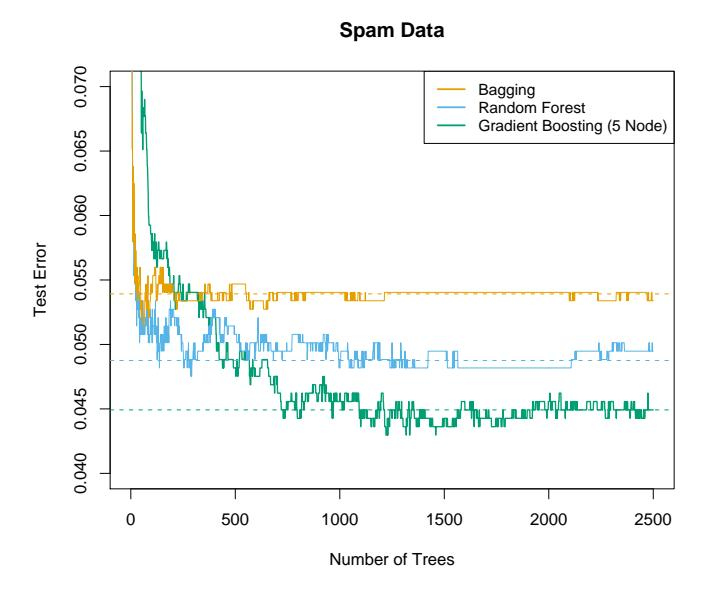

**FIGURE 15.1.** Bagging, random forest, and gradient boosting, applied to the spam data. For boosting, 5-node trees were used, and the number of trees were chosen by 10-fold cross-validation (2500 trees). Each "step" in the figure corresponds to a change in a single misclassification (in a test set of 1536).

Not all estimators can be improved by shaking up the data like this. It seems that highly nonlinear estimators, such as trees, benefit the most. For bootstrapped trees,  $\rho$  is typically small (0.05 or lower is typical; see Figure 15.9), while  $\sigma^2$  is not much larger than the variance for the original tree. On the other hand, bagging does not change *linear* estimates, such as the sample mean (hence its variance either); the pairwise correlation between bootstrapped means is about 50% (Exercise 15.4).

Random forests are popular. Leo Breiman's1 collaborator Adele Cutler maintains a random forest website2 where the software is freely available, with more than 3000 downloads reported by 2002. There is a randomForest package in R, maintained by Andy Liaw, available from the CRAN website.

The authors make grand claims about the success of random forests: "most accurate," "most interpretable," and the like. In our experience random forests do remarkably well, with very little tuning required. A random forest classifier achieves 4.88% misclassification error on the spam test data, which compares well with all other methods, and is not significantly worse than gradient boosting at 4.5%. Bagging achieves 5.4% which is significantly worse than either (using the McNemar test outlined in Exercise 10.6), so it appears on this example the additional randomization helps.

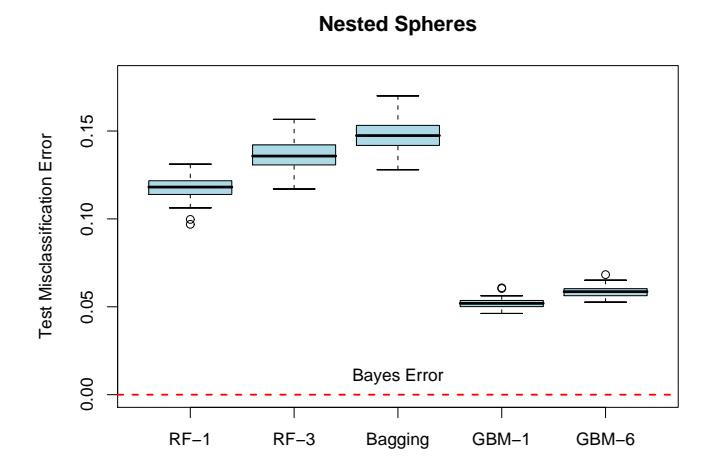

FIGURE 15.2. The results of 50 simulations from the "nested spheres" model in IR10. The Bayes decision boundary is the surface of a sphere (additive). "RF-3" refers to a random forest with m = 3, and "GBM-6" a gradient boosted model with interaction order six; similarly for "RF-1" and "GBM-1." The training sets were of size 2000, and the test sets 10, 000.

Figure 15.1 shows the test-error progression on 2500 trees for the three methods. In this case there is some evidence that gradient boosting has started to overfit, although 10-fold cross-validation chose all 2500 trees.

1Sadly, Leo Breiman died in July, 2005.

2http://www.math.usu.edu/∼adele/forests/

#### **California Housing Data**

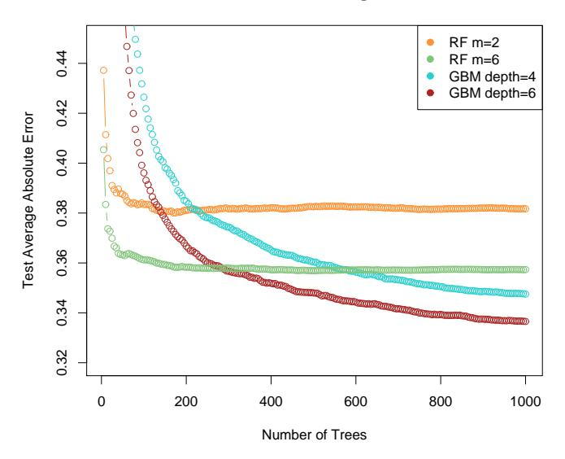

FIGURE 15.3. Random forests compared to gradient boosting on the California housing data. The curves represent mean absolute error on the test data as a function of the number of trees in the models. Two random forests are shown, with m = 2 and m = 6. The two gradient boosted models use a shrinkage parameter ν = 0.05 in (10.41), and have interaction depths of 4 and 6. The boosted models outperform random forests.

Figure 15.2 shows the results of a simulation3 comparing random forests to gradient boosting on the nested spheres problem [Equation (10.2) in Chapter 10]. Boosting easily outperforms random forests here. Notice that smaller m is better here, although part of the reason could be that the true decision boundary is additive.

Figure 15.3 compares random forests to boosting (with shrinkage) in a regression problem, using the California housing data (Section 10.14.1). Two strong features that emerge are

- Random forests stabilize at about 200 trees, while at 1000 trees boosting continues to improve. Boosting is slowed down by the shrinkage, as well as the fact that the trees are much smaller.
- Boosting outperforms random forests here. At 1000 terms, the weaker boosting model (GBM depth 4) has a smaller error than the stronger

3Details: The random forests were fit using the R package randomForest 4.5-11, with 500 trees. The gradient boosting models were fit using R package gbm 1.5, with shrinkage parameter set to 0.05, and 2000 trees.

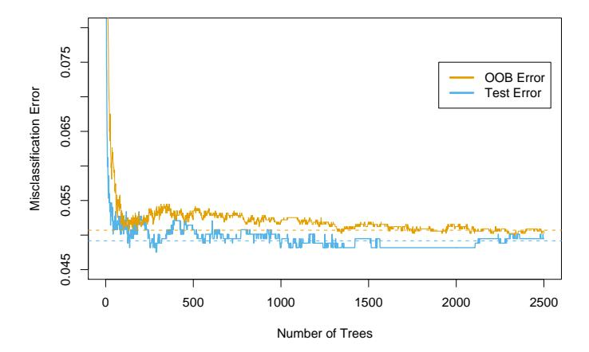

FIGURE 15.4. oob error computed on the spam training data, compared to the test error computed on the test set.

random forest (RF m = 6); a Wilcoxon test on the mean differences in absolute errors has a p-value of 0.007. For larger m the random forests performed no better.

# 15.3 Details of Random Forests

We have glossed over the distinction between random forests for classification versus regression. When used for classification, a random forest obtains a class vote from each tree, and then classifies using majority vote (see Section 8.7 on bagging for a similar discussion). When used for regression, the predictions from each tree at a target point x are simply averaged, as in (15.2). In addition, the inventors make the following recommendations:

- For classification, the default value for m is ⌊ √p⌋ and the minimum node size is one.
- For regression, the default value for m is ⌊p/3⌋ and the minimum node size is five.

In practice the best values for these parameters will depend on the problem, and they should be treated as tuning parameters. In Figure 15.3 m = 6 performs much better than the default value ⌊8/3⌋ = 2.

# 15.3.1 Out of Bag Samples

An important feature of random forests is its use of out-of-bag (oob) samples:

For each observation zi = (xi , yi), construct its random forest predictor by averaging only those trees corresponding to bootstrap samples in which zi did not appear.

An oob error estimate is almost identical to that obtained by N-fold crossvalidation; see Exercise 15.2. Hence unlike many other nonlinear estimators, random forests can be fit in one sequence, with cross-validation being performed along the way. Once the oob error stabilizes, the training can be terminated.

Figure 15.4 shows the oob misclassification error for the spam data, compared to the test error. Although 2500 trees are averaged here, it appears from the plot that about 200 would be sufficient.

#### 15.3.2 Variable Importance

Variable importance plots can be constructed for random forests in exactly the same way as they were for gradient-boosted models (Section 10.13). At each split in each tree, the improvement in the split-criterion is the importance measure attributed to the splitting variable, and is accumulated over all the trees in the forest separately for each variable. The left plot of Figure 15.5 shows the variable importances computed in this way for the spam data; compare with the corresponding Figure 10.6 on page 354 for gradient boosting. Boosting ignores some variables completely, while the random forest does not. The candidate split-variable selection increases the chance that any single variable gets included in a random forest, while no such selection occurs with boosting.

Random forests also use the oob samples to construct a different variableimportance measure, apparently to measure the prediction strength of each variable. When the bth tree is grown, the oob samples are passed down the tree, and the prediction accuracy is recorded. Then the values for the jth variable are randomly permuted in the oob samples, and the accuracy is again computed. The decrease in accuracy as a result of this permuting is averaged over all trees, and is used as a measure of the importance of variable j in the random forest. These are expressed as a percent of the maximum in the right plot in Figure 15.5. Although the rankings of the two methods are similar, the importances in the right plot are more uniform over the variables. The randomization effectively voids the effect of a variable, much like setting a coefficient to zero in a linear model (Exercise 15.7). This does not measure the effect on prediction were this variable not available, because if the model was refitted without the variable, other variables could be used as surrogates.

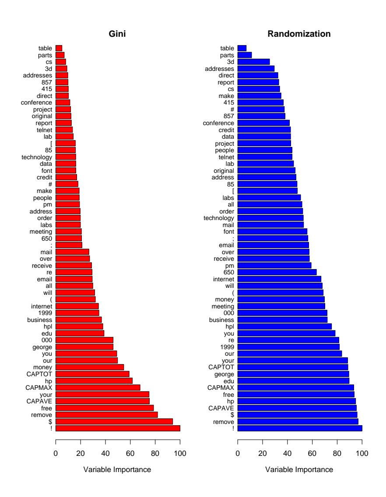

FIGURE 15.5. Variable importance plots for a classification random forest grown on the spam data. The left plot bases the importance on the Gini splitting index, as in gradient boosting. The rankings compare well with the rankings produced by gradient boosting (Figure 10.6 on page 354). The right plot uses oob randomization to compute variable importances, and tends to spread the importances more uniformly.

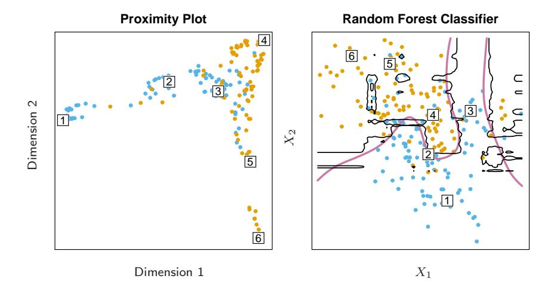

FIGURE 15.6. (Left): Proximity plot for a random forest classifier grown to the mixture data. (Right): Decision boundary and training data for random forest on mixture data. Six points have been identified in each plot.

#### 15.3.3 Proximity Plots

One of the advertised outputs of a random forest is a proximity plot. Figure 15.6 shows a proximity plot for the mixture data defined in Section 2.3.3 in Chapter 2. In growing a random forest, an N × N proximity matrix is accumulated for the training data. For every tree, any pair of oob observations sharing a terminal node has their proximity increased by one. This proximity matrix is then represented in two dimensions using multidimensional scaling (Section 14.8). The idea is that even though the data may be high-dimensional, involving mixed variables, etc., the proximity plot gives an indication of which observations are effectively close together in the eyes of the random forest classifier.

Proximity plots for random forests often look very similar, irrespective of the data, which casts doubt on their utility. They tend to have a star shape, one arm per class, which is more pronounced the better the classification performance.

Since the mixture data are two-dimensional, we can map points from the proximity plot to the original coordinates, and get a better understanding of what they represent. It seems that points in pure regions class-wise map to the extremities of the star, while points nearer the decision boundaries map nearer the center. This is not surprising when we consider the construction of the proximity matrices. Neighboring points in pure regions will often end up sharing a bucket, since when a terminal node is pure, it is no longer split by a random forest tree-growing algorithm. On the other hand, pairs of points that are close but belong to different classes will sometimes share a terminal node, but not always.

#### 15.3.4 Random Forests and Overfitting

When the number of variables is large, but the fraction of relevant variables small, random forests are likely to perform poorly with small m. At each split the chance can be small that the relevant variables will be selected. Figure 15.7 shows the results of a simulation that supports this claim. Details are given in the figure caption and Exercise 15.3. At the top of each pair we see the hyper-geometric probability that a relevant variable will be selected at any split by a random forest tree (in this simulation, the relevant variables are all equal in stature). As this probability gets small, the gap between boosting and random forests increases. When the number of relevant variables increases, the performance of random forests is surprisingly robust to an increase in the number of noise variables. For example, with 6 relevant and 100 noise variables, the probability of a relevant variable being selected at any split is 0.46, assuming m = p (6 + 100) ≈ 10. According to Figure 15.7, this does not hurt the performance of random forests compared with boosting. This robustness is largely due to the relative insensitivity of misclassification cost to the bias and variance of the probability estimates in each tree. We consider random forests for regression in the next section.

Another claim is that random forests "cannot overfit" the data. It is certainly true that increasing B does not cause the random forest sequence to overfit; like bagging, the random forest estimate (15.2) approximates the expectation

$$\hat{f}_{\rm rf}(x) = \mathcal{E}_{\Theta} T(x; \Theta) = \lim_{B \to \infty} \hat{f}(x)_{\rm rf}^B$$
 (15.3)

with an average over B realizations of Θ. The distribution of Θ here is conditional on the training data. However, this limit can overfit the data; the average of fully grown trees can result in too rich a model, and incur unnecessary variance. Segal (2004) demonstrates small gains in performance by controlling the depths of the individual trees grown in random forests. Our experience is that using full-grown trees seldom costs much, and results in one less tuning parameter.

Figure 15.8 shows the modest effect of depth control in a simple regression example. Classifiers are less sensitive to variance, and this effect of overfitting is seldom seen with random-forest classification.

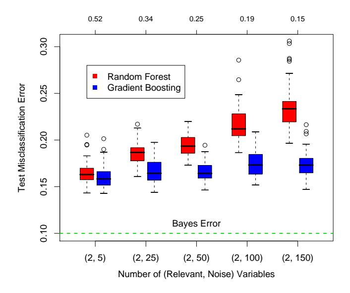

FIGURE 15.7. A comparison of random forests and gradient boosting on problems with increasing numbers of noise variables. In each case the true decision boundary depends on two variables, and an increasing number of noise variables are included. Random forests uses its default value m = √p. At the top of each pair is the probability that one of the relevant variables is chosen at any split. The results are based on 50 simulations for each pair, with a training sample of 300, and a test sample of 500. See Exercise 15.3.

# 15.4 Analysis of Random Forests

In this section we analyze the mechanisms at play with the additional randomization employed by random forests. For this discussion we focus on regression and squared error loss, since this gets at the main points, and bias and variance are more complex with 0–1 loss (see Section 7.3.1). Furthermore, even in the case of a classification problem, we can consider the random-forest average as an estimate of the class posterior probabilities, for which bias and variance are appropriate descriptors.

# 15.4.1 Variance and the De-Correlation Effect

The limiting form (B → ∞) of the random forest regression estimator is

$$\hat{f}_{rf}(x) = \mathcal{E}_{\Theta|\mathbf{Z}} T(x; \Theta(\mathbf{Z})), \tag{15.4}$$

where we have made explicit the dependence on the training data Z. Here we consider estimation at a single target point x. From (15.1) we see that

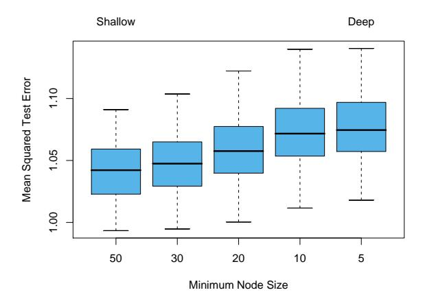

FIGURE 15.8. The effect of tree size on the error in random forest regression. In this example, the true surface was additive in two of the 12 variables, plus additive unit-variance Gaussian noise. Tree depth is controlled here by the minimum node size; the smaller the minimum node size, the deeper the trees.

$$Var \hat{f}_{rf}(x) = \rho(x)\sigma^2(x). \tag{15.5}$$

Here

• ρ(x) is the sampling correlation between any pair of trees used in the averaging:

$$\rho(x) = \operatorname{corr}[T(x; \Theta_1(\mathbf{Z})), T(x; \Theta_2(\mathbf{Z}))], \tag{15.6}$$

where Θ1(Z) and Θ2(Z) are a randomly drawn pair of random forest trees grown to the randomly sampled Z;

• σ 2 (x) is the sampling variance of any single randomly drawn tree,

$$\sigma^{2}(x) = \operatorname{Var} T(x; \Theta(\mathbf{Z})). \tag{15.7}$$

It is easy to confuse ρ(x) with the average correlation between fitted trees in a given random-forest ensemble; that is, think of the fitted trees as Nvectors, and compute the average pairwise correlation between these vectors, conditioned on the data. This is not the case; this conditional correlation is not directly relevant in the averaging process, and the dependence on x in ρ(x) warns us of the distinction. Rather, ρ(x) is the theoretical correlation between a pair of random-forest trees evaluated at x, induced by repeatedly making training sample draws Z from the population, and then drawing a pair of random forest trees. In statistical jargon, this is the correlation induced by the sampling distribution of Z and Θ.

More precisely, the variability averaged over in the calculations in (15.6) and (15.7) is both

- conditional on Z: due to the bootstrap sampling and feature sampling at each split, and
- a result of the sampling variability of Z itself.

In fact, the conditional covariance of a pair of tree fits at x is zero, because the bootstrap and feature sampling is i.i.d; see Exercise 15.5.

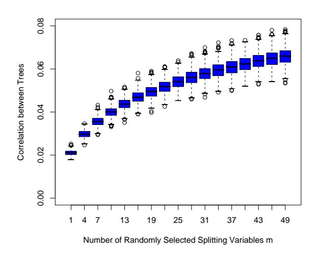

FIGURE 15.9. Correlations between pairs of trees drawn by a random-forest regression algorithm, as a function of m. The boxplots represent the correlations at 600 randomly chosen prediction points x.

The following demonstrations are based on a simulation model

$$Y = \frac{1}{\sqrt{50}} \sum_{j=1}^{50} X_j + \varepsilon,$$
 (15.8)

with all the Xj and ε iid Gaussian. We use 500 training sets of size 100, and a single set of test locations of size 600. Since regression trees are nonlinear in Z, the patterns we see below will differ somewhat depending on the structure of the model.

Figure 15.9 shows how the correlation (15.6) between pairs of trees decreases as m decreases: pairs of tree predictions at x for different training sets Z are likely to be less similar if they do not use the same splitting variables.

In the left panel of Figure 15.10 we consider the variances of single tree predictors, VarT(x; Θ(Z)) (averaged over 600 prediction points x drawn randomly from our simulation model). This is the total variance, and can be decomposed into two parts using standard conditional variance arguments (see Exercise 15.5):

$$Var_{\Theta,\mathbf{Z}}T(x;\Theta(\mathbf{Z})) = Var_{\mathbf{Z}}E_{\Theta|\mathbf{Z}}T(x;\Theta(\mathbf{Z})) + E_{\mathbf{Z}}Var_{\Theta|\mathbf{Z}}T(x;\Theta(\mathbf{Z}))$$

$$Total\ Variance = Var_{\mathbf{Z}}\hat{f}_{rf}(x) + within-\mathbf{Z}\ Variance$$

$$(15.9)$$

The second term is the within-Z variance—a result of the randomization, which increases as m decreases. The first term is in fact the sampling variance of the random forest ensemble (shown in the right panel), which decreases as m decreases. The variance of the individual trees does not change appreciably over much of the range of m, hence in light of (15.5), the variance of the ensemble is dramatically lower than this tree variance.

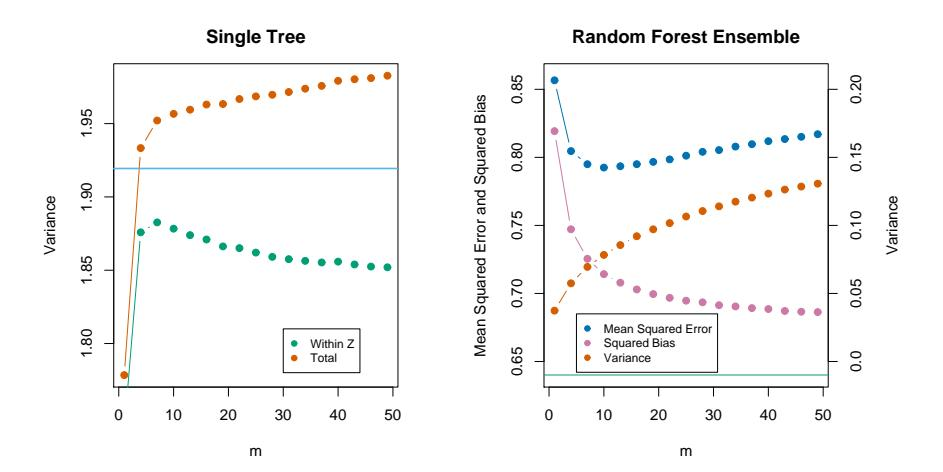

FIGURE 15.10. Simulation results. The left panel shows the average variance of a single random forest tree, as a function of m. "Within Z" refers to the average within-sample contribution to the variance, resulting from the bootstrap sampling and split-variable sampling (15.9). "Total" includes the sampling variability of Z. The horizontal line is the average variance of a single fully grown tree (without bootstrap sampling). The right panel shows the average mean-squared error, squared bias and variance of the ensemble, as a function of m. Note that the variance axis is on the right (same scale, different level). The horizontal line is the average squared-bias of a fully grown tree.

# 15.4.2 Bias

As in bagging, the bias of a random forest is the same as the bias of any of the individual sampled trees T(x; Θ(Z)):

$$Bias(x) = \mu(x) - E_{\mathbf{Z}}\hat{f}_{rf}(x)$$
  
=  $\mu(x) - E_{\mathbf{Z}}E_{\Theta|\mathbf{Z}}T(x;\Theta(\mathbf{Z})).$  (15.10)

This is also typically greater (in absolute terms) than the bias of an unpruned tree grown to Z, since the randomization and reduced sample space impose restrictions. Hence the improvements in prediction obtained by bagging or random forests are solely a result of variance reduction.

Any discussion of bias depends on the unknown true function. Figure 15.10 (right panel) shows the squared bias for our additive model simulation (estimated from the 500 realizations). Although for different models the shape and rate of the bias curves may differ, the general trend is that as m decreases, the bias increases. Shown in the figure is the mean-squared error, and we see a classical bias-variance trade-off in the choice of m. For all m the squared bias of the random forest is greater than that for a single tree (horizontal line).

These patterns suggest a similarity with ridge regression (Section 3.4.1). Ridge regression is useful (in linear models) when one has a large number of variables with similarly sized coefficients; ridge shrinks their coefficients toward zero, and those of strongly correlated variables toward each other. Although the size of the training sample might not permit all the variables to be in the model, this regularization via ridge stabilizes the model and allows all the variables to have their say (albeit diminished). Random forests with small m perform a similar averaging. Each of the relevant variables get their turn to be the primary split, and the ensemble averaging reduces the contribution of any individual variable. Since this simulation example (15.8) is based on a linear model in all the variables, ridge regression achieves a lower mean-squared error (about 0.45 with df(λopt) ≈ 29).

# 15.4.3 Adaptive Nearest Neighbors

The random forest classifier has much in common with the k-nearest neighbor classifier (Section 13.3); in fact a weighted version thereof. Since each tree is grown to maximal size, for a particular Θ∗ , T(x; Θ∗ (Z)) is the response value for one of the training samples4 . The tree-growing algorithm finds an "optimal" path to that observation, choosing the most informative predictors from those at its disposal. The averaging process assigns weights to these training responses, which ultimately vote for the prediction. Hence via the random-forest voting mechanism, those observations close to the target point get assigned weights—an equivalent kernel—which combine to form the classification decision.

Figure 15.11 demonstrates the similarity between the decision boundary of 3-nearest neighbors and random forests on the mixture data.

4We gloss over the fact that pure nodes are not split further, and hence there can be more than one observation in a terminal node

#### Random Forest Classifier

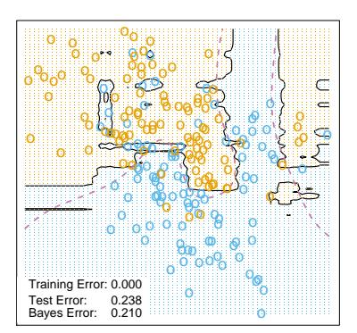

#### 3-Nearest Neighbors

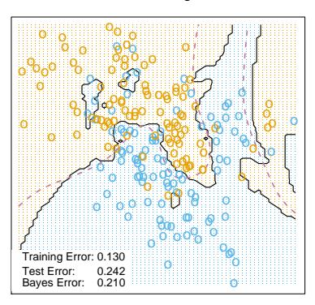

**FIGURE 15.11.** Random forests versus 3-NN on the mixture data. The axis-oriented nature of the individual trees in a random forest lead to decision regions with an axis-oriented flavor.

# Bibliographic Notes

Random forests as described here were introduced by Breiman (2001), although many of the ideas had cropped up earlier in the literature in different forms. Notably Ho (1995) introduced the term "random forest," and used a consensus of trees grown in random subspaces of the features. The idea of using stochastic perturbation and averaging to avoid overfitting was introduced by Kleinberg (1990), and later in Kleinberg (1996). Amit and Geman (1997) used randomized trees grown on image features for image classification problems. Breiman (1996a) introduced bagging, a precursor to his version of random forests. Dietterich (2000b) also proposed an improvement on bagging using additional randomization. His approach was to rank the top 20 candidate splits at each node, and then select from the list at random. He showed through simulations and real examples that this additional randomization improved over the performance of bagging. Friedman and Hall (2007) showed that sub-sampling (without replacement) is an effective alternative to bagging. They showed that growing and averaging trees on samples of size N/2 is approximately equivalent (in terms bias/variance considerations) to bagging, while using smaller fractions of N reduces the variance even further (through decorrelation).

There are several free software implementations of random forests. In this chapter we used the randomForest package in R, maintained by Andy Liaw, available from the CRAN website. This allows both split-variable selection, as well as sub-sampling. Adele Cutler maintains a random forest website http://www.math.usu.edu/~adele/forests/ where (as of August 2008) the software written by Leo Breiman and Adele Cutler is freely

available. Their code, and the name "random forests", is exclusively licensed to Salford Systems for commercial release. The Weka machine learning archive http://www.cs.waikato.ac.nz/ml/weka/ at Waikato University, New Zealand, offers a free java implementation of random forests.

#### Exercises

Ex. 15.1 Derive the variance formula (15.1). This appears to fail if  $\rho$  is negative; diagnose the problem in this case.

Ex. 15.2 Show that as the number of bootstrap samples B gets large, the OOB error estimate for a random forest approaches its N-fold CV error estimate, and that in the limit, the identity is exact.

Ex. 15.3 Consider the simulation model used in Figure 15.7 (Mease and Wyner, 2008). Binary observations are generated with probabilities

$$\Pr(Y = 1|X) = q + (1 - 2q) \cdot I\left[\sum_{j=1}^{J} X_j > J/2\right],$$
(15.11)

where  $X \sim U[0,1]^p$ ,  $0 \le q \le \frac{1}{2}$ , and  $J \le p$  is some predefined (even) number. Describe this probability surface, and give the Bayes error rate.

Ex. 15.4 Suppose  $x_i$ ,  $i=1,\ldots,N$  are iid  $(\mu,\sigma^2)$ . Let  $\bar{x}_1^*$  and  $\bar{x}_2^*$  be two bootstrap realizations of the sample mean. Show that the sampling correlation  $\operatorname{corr}(\bar{x}_1^*,\bar{x}_2^*)=\frac{n}{2n-1}\approx 50\%$ . Along the way, derive  $\operatorname{var}(\bar{x}_1^*)$  and the variance of the bagged mean  $\bar{x}_{bag}$ . Here  $\bar{x}$  is a linear statistic; bagging produces no reduction in variance for linear statistics.

Ex. 15.5 Show that the sampling correlation between a pair of randomforest trees at a point x is given by

$$\rho(x) = \frac{\operatorname{Var}_{\mathbf{Z}}[E_{\Theta|\mathbf{Z}}T(x;\Theta(\mathbf{Z}))]}{\operatorname{Var}_{\mathbf{Z}}[E_{\Theta|\mathbf{Z}}T(x;\Theta(\mathbf{Z}))] + E_{\mathbf{Z}}\operatorname{Var}_{\Theta|\mathbf{Z}}[T(x;\Theta(\mathbf{Z}))]}.$$
 (15.12)

The term in the numerator is  $\operatorname{Var}_{\mathbf{Z}}[\hat{f}_{\mathrm{rf}}(x)]$ , and the second term in the denominator is the expected conditional variance due to the randomization in random forests.

Ex. 15.6 Fit a series of random-forest classifiers to the spam data, to explore the sensitivity to the parameter m. Plot both the OOB error as well as the test error against a suitably chosen range of values for m.

Ex. 15.7 Suppose we fit a linear regression model to N observations with response  $y_i$  and predictors  $x_{i1}, \ldots, x_{ip}$ . Assume that all variables are standardized to have mean zero and standard deviation one. Let RSS be the mean-squared residual on the training data, and  $\hat{\beta}$  the estimated coefficient. Denote by  $RSS_j^*$  the mean-squared residual on the training data using the same  $\hat{\beta}$ , but with the N values for the jth variable randomly permuted before the predictions are calculated. Show that

$$E_P[RSS_i^* - RSS] = 2\hat{\beta}_i^2, \tag{15.13}$$

where  $E_P$  denotes expectation with respect to the permutation distribution. Argue that this is approximately true when the evaluations are done using an independent test set.