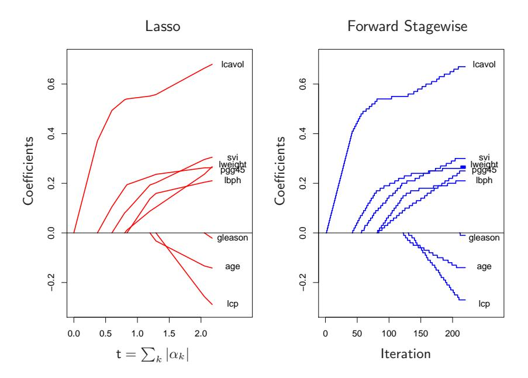
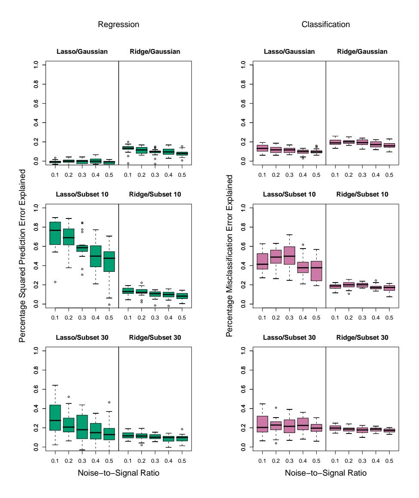
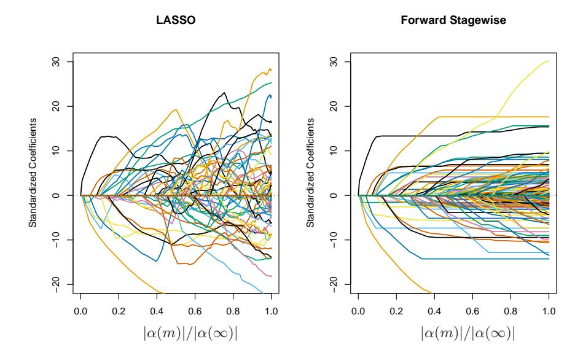
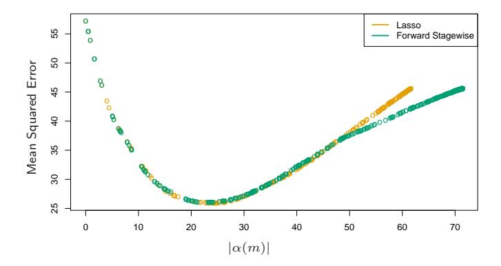
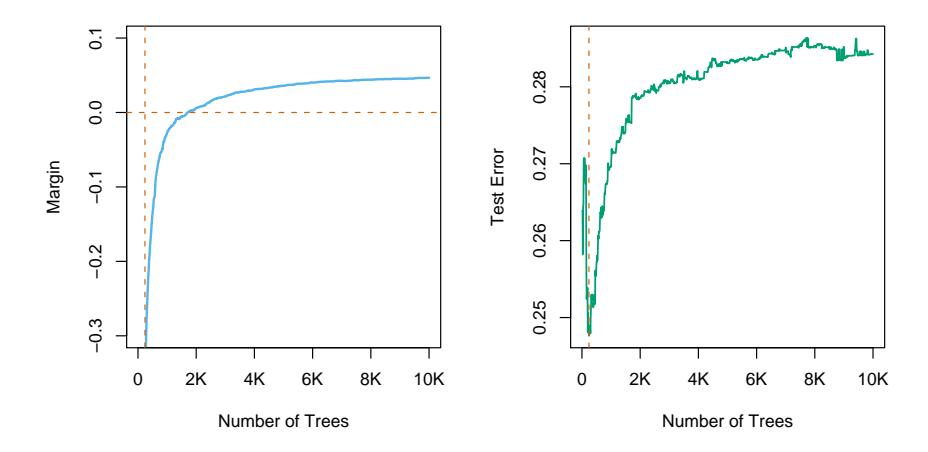
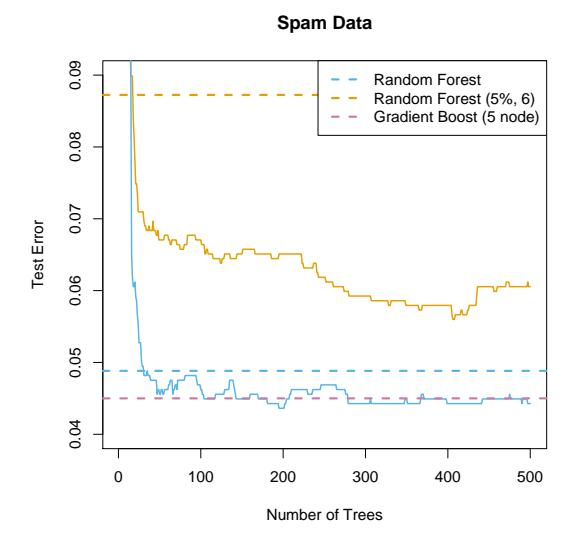
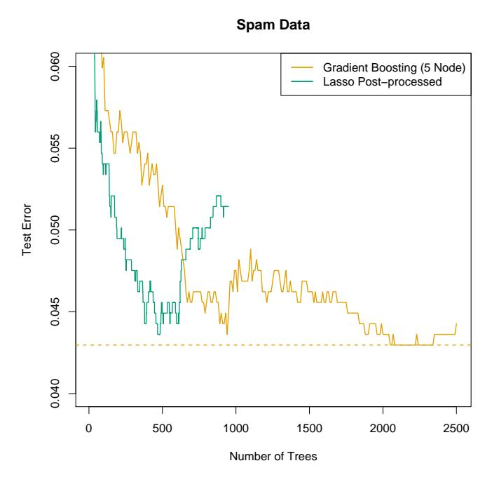
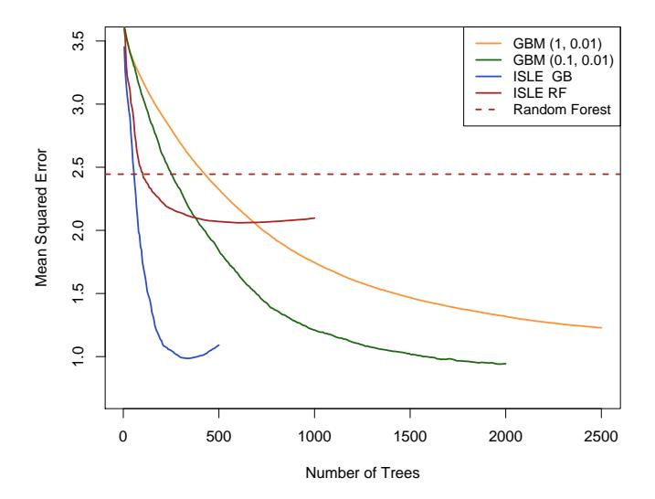
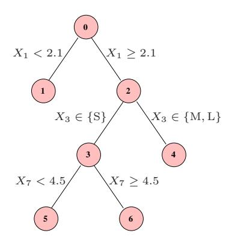
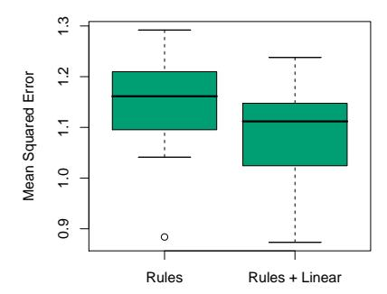

# Ensemble Learning

# 16.1 Introduction

The idea of ensemble learning is to build a prediction model by combining the strengths of a collection of simpler base models. We have already seen a number of examples that fall into this category.

Bagging in Section 8.7 and random forests in Chapter 15 are ensemble methods for classification, where a committee of trees each cast a vote for the predicted class. Boosting in Chapter 10 was initially proposed as a committee method as well, although unlike random forests, the committee of weak learners evolves over time, and the members cast a weighted vote. Stacking (Section 8.8) is a novel approach to combining the strengths of a number of fitted models. In fact one could characterize any dictionary method, such as regression splines, as an ensemble method, with the basis functions serving the role of weak learners.

Bayesian methods for nonparametric regression can also be viewed as ensemble methods: a large number of candidate models are averaged with respect to the posterior distribution of their parameter settings (e.g. (Neal and Zhang, 2006)).

Ensemble learning can be broken down into two tasks: developing a population of base learners from the training data, and then combining them to form the composite predictor. In this chapter we discuss boosting technology that goes a step further; it builds an ensemble model by conducting a regularized and supervised search in a high-dimensional space of weak learners.

An early example of a learning ensemble is a method designed for multiclass classification using *error-correcting output codes* (Dietterich and Bakiri, 1995, ECOC). Consider the 10-class digit classification problem, and the coding matrix **C** given in Table 16.1.

**TABLE 16.1.** Part of a 15-bit error-correcting coding matrix **C** for the 10-class digit classification problem. Each column defines a two-class classification problem.

| Digit | $C_1$ | $C_2$ | $C_3$ | $C_4$ | $C_5$ | $C_6$ | • • • | $C_{15}$ |
|-------|-------|-------|-------|-------|-------|-------|-------|----------|
| 0     | 1     | 1     | 0     | 0     | 0     | 0     |       | 1        |
| 1     | 0     | 0     | 1     | 1     | 1     | 1     |       | 0        |
| 2     | 1     | 0     | 0     | 1     | 0     | 0     |       | 1        |
| :     | :     | :     |       |       |       |       |       | :        |
| :     | :     |       |       |       |       |       |       | :        |
| 8     | 1     | 1     | 0     | 1     | 0     | 1     |       | 1        |
| 9     | 0     | 1     | 1     | 1     | 0     | 0     |       | 0        |

Note that the  $\ell$ th column of the coding matrix  $C_{\ell}$  defines a two-class variable that merges all the original classes into two groups. The method works as follows:

- 1. Learn a separate classifier for each of the L=15 two class problems defined by the columns of the coding matrix.
- 2. At a test point x, let  $\hat{p}_{\ell}(x)$  be the predicted probability of a one for the  $\ell$ th response.
- 3. Define  $\delta_k(x) = \sum_{\ell=1}^L |C_{k\ell} \hat{p}_{\ell}(x)|$ , the discriminant function for the kth class, where  $C_{k\ell}$  is the entry for row k and column  $\ell$  in Table 16.1.

Each row of  $\mathbf{C}$  is a binary code for representing that class. The rows have more bits than is necessary, and the idea is that the redundant "error-correcting" bits allow for some inaccuracies, and can improve performance. In fact, the full code matrix  $\mathbf{C}$  above has a minimum Hamming distance of 7 between any pair of rows. Note that even the indicator response coding (Section 4.2) is redundant, since 10 classes require only  $\lceil \log_2 10 = 4 \rceil$  bits for their unique representation. Dietterich and Bakiri (1995) showed impressive improvements in performance for a variety of multiclass problems when classification trees were used as the base classifier.

James and Hastie (1998) analyzed the ECOC approach, and showed that random code assignment worked as well as the optimally constructed error-correcting codes. They also argued that the main benefit of the coding was in variance reduction (as in bagging and random forests), because the different coded problems resulted in different trees, and the decoding step (3) above has a similar effect as averaging.

 $$^{^{1}\}$mathrm{The}$  Hamming distance between two vectors is the number of mismatches between corresponding entries.

# 16.2 Boosting and Regularization Paths

In Section 10.12.2 of the first edition of this book, we suggested an analogy between the sequence of models produced by a gradient boosting algorithm and regularized model fitting in high-dimensional feature spaces. This was primarily motivated by observing the close connection between a boosted version of linear regression and the lasso (Section 3.4.2). These connections have been pursued by us and others, and here we present our current thinking in this area. We start with the original motivation, which fits more naturally in this chapter on ensemble learning.

#### 16.2.1 Penalized Regression

Intuition for the success of the shrinkage strategy (10.41) of gradient boosting (page 364 in Chapter 10) can be obtained by drawing analogies with penalized linear regression with a large basis expansion. Consider the dictionary of all possible J-terminal node regression trees  $\mathcal{T} = \{T_k\}$  that could be realized on the training data as basis functions in  $\mathbb{R}^p$ . The linear model is

$$f(x) = \sum_{k=1}^{K} \alpha_k T_k(x),$$
 (16.1)

where  $K = \operatorname{card}(\mathcal{T})$ . Suppose the coefficients are to be estimated by least squares. Since the number of such trees is likely to be much larger than even the largest training data sets, some form of regularization is required. Let  $\hat{\alpha}(\lambda)$  solve

$$\min_{\alpha} \left\{ \sum_{i=1}^{N} \left( y_i - \sum_{k=1}^{K} \alpha_k T_k(x_i) \right)^2 + \lambda \cdot J(\alpha) \right\}, \tag{16.2}$$

 $J(\alpha)$  is a function of the coefficients that generally penalizes larger values. Examples are

$$J(\alpha) = \sum_{k=1}^{K} |\alpha_k|^2$$
 ridge regression, (16.3)

$$J(\alpha) = \sum_{k=1}^{K} |\alpha_k| \quad \text{lasso}, \tag{16.4}$$

(16.5)

both covered in Section 3.4. As discussed there, the solution to the lasso problem with moderate to large  $\lambda$  tends to be sparse; many of the  $\hat{\alpha}_k(\lambda) = 0$ . That is, only a small fraction of all possible trees enter the model (16.1).

#### Algorithm 16.1 Forward Stagewise Linear Regression.

- 1. Initialize ˇ\alpha$^{k}$ = 0, k = 1, . . . , K. Set \epsilon > 0 to some small constant, and M large.
- 2. For m = 1 to M:

(a) 
$$(\beta^*, k^*) = \arg\min_{\beta, k} \sum_{i=1}^{N} \left( y_i - \sum_{l=1}^{K} \check{\alpha}_l T_l(x_i) - \beta T_k(x_i) \right)^2$$
.

- (b) ˇ\alphak$^{∗}$ ← \alphaˇk$^{∗}$ + \epsilon \cdot sign(\beta ∗ ).
- 3. Output fM(x) = P$^{K}$ $^{k}$=1 \alphaˇkTk(x).

This seems reasonable since it is likely that only a small fraction of all possible trees will be relevant in approximating any particular target function. However, the relevant subset will be different for different targets. Those coefficients that are not set to zero are shrunk by the lasso in that their absolute values are smaller than their corresponding least squares values$^{2}$ : | \alphaˆk(\lambda)| < | \alphaˆk(0)|. As \lambda increases, the coefficients all shrink, each one ultimately becoming zero.

Owing to the very large number of basis functions Tk, directly solving (16.2) with the lasso penalty (16.4) is not possible. However, a feasible forward stagewise strategy exists that closely approximates the effect of the lasso, and is very similar to boosting and the forward stagewise Algorithm 10.2. Algorithm 16.1 gives the details. Although phrased in terms of tree basis functions Tk, the algorithm can be used with any set of basis functions. Initially all coefficients are zero in line 1; this corresponds to \lambda = \infty in (16.2). At each successive step, the tree Tk$^{∗}$ is selected that best fits the current residuals in line 2(a). Its corresponding coefficient ˇ\alphak$^{∗}$ is then incremented or decremented by an infinitesimal amount in 2(b), while all other coefficients ˇ\alphak, k 6= k $^{∗}$ are left unchanged. In principle, this process could be iterated until either all the residuals are zero, or \beta $^{∗}$ = 0. The latter case can occur if K < N, and at that point the coefficient values represent a least squares solution. This corresponds to \lambda = 0 in (16.2).

After applying Algorithm 16.1 with M < \infty iterations, many of the coefficients will be zero, namely, those that have yet to be incremented. The others will tend to have absolute values smaller than their corresponding least squares solution values, | \alphaˇk(M)| < | \alphaˆk(0)|. Therefore this M-iteration solution qualitatively resembles the lasso, with M inversely related to \lambda.

Figure 16.1 shows an example, using the prostate data studied in Chapter 3. Here, instead of using trees Tk(X) as basis functions, we use the origi-

$^{2}$ If K > N, there is in general no unique "least squares value," since infinitely many solutions will exist that fit the data perfectly. We can pick the minimum L1-norm solution amongst these, which is the unique lasso solution.

**FIGURE 16.1.** Profiles of estimated coefficients from linear regression, for the prostate data studied in Chapter 3. The left panel shows the results from the lasso, for different values of the bound parameter  $t = \sum_k |\alpha_k|$ . The right panel shows the results of the stagewise linear regression Algorithm 16.1, using M = 220 consecutive steps of size  $\varepsilon = .01$ .

nal variables  $X_k$  themselves; that is, a multiple linear regression model. The left panel displays the profiles of estimated coefficients from the lasso, for different values of the bound parameter  $t = \sum_k |\alpha_k|$ . The right panel shows the results of the stagewise Algorithm 16.1, with M=250 and  $\varepsilon=0.01$ . [The left and right panels of Figure 16.1 are the same as Figure 3.10 and the left panel of Figure 3.19, respectively.] The similarity between the two graphs is striking.

In some situations the resemblance is more than qualitative. For example, if all of the basis functions  $T_k$  are mutually uncorrelated, then as  $\varepsilon \downarrow 0$ ,  $M \uparrow$  such that  $M\epsilon \to t$ , Algorithm 16.1 yields exactly the same solution as the lasso for bound parameter  $t = \sum_k |\alpha_k|$  (and likewise for all solutions along the path). Of course, tree-based regressors are not uncorrelated. However, the solution sets are also identical if the coefficients  $\hat{\alpha}_k(\lambda)$  are all monotone functions of  $\lambda$ . This is often the case when the correlation between the variables is low. When the  $\hat{\alpha}_k(\lambda)$  are not monotone in  $\lambda$ , then the solution sets are not identical. The solution sets for Algorithm 16.1 tend to change less rapidly with changing values of the regularization parameter than those of the lasso.

Efron et al. (2004) make the connections more precise, by characterizing the exact solution paths in the  $\varepsilon$ -limiting case. They show that the coefficient paths are piece-wise linear functions, both for the lasso and forward stagewise. This facilitates efficient algorithms which allow the entire paths to be computed with the same cost as a single least-squares fit. This least angle regression algorithm is described in more detail in Section 3.8.1.

Hastie et al. (2007) show that this infinitesimal forward stagewise algorithm (FS$_{0}$) fits a monotone version of the lasso, which optimally reduces at each step the loss function for a given increase in the *arc length* of the coefficient path (see Sections 16.2.3 and 3.8.1). The arc-length for the  $\epsilon > 0$  case is  $M\epsilon$ , and hence proportional to the number of steps.

Tree boosting (Algorithm 10.3) with shrinkage (10.41) closely resembles Algorithm 16.1, with the learning rate parameter  $\nu$  corresponding to  $\varepsilon$ . For squared error loss, the only difference is that the optimal tree to be selected at each iteration  $T_{k*}$  is approximated by the standard top-down greedy tree-induction algorithm. For other loss functions, such as the exponential loss of AdaBoost and the binomial deviance, Rosset et al. (2004a) show similar results to what we see here. Thus, one can view tree boosting with shrinkage as a form of monotone ill-posed regression on all possible (*J*-terminal node) trees, with the lasso penalty (16.4) as a regularizer. We return to this topic in Section 16.2.3.

The choice of no shrinkage  $[\nu=1]$  in equation (10.41)] is analogous to forward-stepwise regression, and its more aggressive cousin best-subset selection, which penalizes the *number* of non zero coefficients  $J(\alpha) = \sum_k |\alpha_k|^0$ . With a small fraction of dominant variables, best subset approaches often work well. But with a moderate fraction of strong variables, it is well known that subset selection can be excessively greedy (Copas, 1983), often yielding poor results when compared to less aggressive strategies such as the lasso or ridge regression. The dramatic improvements often seen when shrinkage is used with boosting are yet another confirmation of this approach.

#### 16.2.2 The "Bet on Sparsity" Principle

As shown in the previous section, boosting's forward stagewise strategy with shrinkage approximately minimizes the same loss function with a lasso-style  $L_1$  penalty. The model is built up slowly, searching through "model space" and adding shrunken basis functions derived from important predictors. In contrast, the  $L_2$  penalty is computationally much easier to deal with, as shown in Section 12.3.7. With the basis functions and  $L_2$  penalty chosen to match a particular positive-definite kernel, one can solve the corresponding optimization problem without explicitly searching over individual basis functions.

However, the sometimes superior performance of boosting over procedures such as the support vector machine may be largely due to the implicit use of the  $L_1$  versus  $L_2$  penalty. The shrinkage resulting from the

L$^{1}$ penalty is better suited to sparse situations, where there are few basis functions with nonzero coefficients (among all possible choices).

We can strengthen this argument through a simple example, taken from Friedman et al. (2004). Suppose we have 10, 000 data points and our model is a linear combination of a million trees. If the true population coefficients of these trees arose from a Gaussian distribution, then we know that in a Bayesian sense the best predictor is ridge regression (Exercise 3.6). That is, we should use an L$^{2}$ rather than an L$^{1}$ penalty when fitting the coefficients. On the other hand, if there are only a small number (e.g., 1000) coefficients that are nonzero, the lasso (L$^{1}$ penalty) will work better. We think of this as a sparse scenario, while the first case (Gaussian coefficients) is dense. Note however that in the dense scenario, although the L$^{2}$ penalty is best, neither method does very well since there is too little data from which to estimate such a large number of nonzero coefficients. This is the curse of dimensionality taking its toll. In a sparse setting, we can potentially do well with the L$^{1}$ penalty, since the number of nonzero coefficients is small. The L$^{2}$ penalty fails again.

In other words, use of the L$^{1}$ penalty follows what we call the "bet on sparsity" principle for high-dimensional problems:

Use a procedure that does well in sparse problems, since no procedure does well in dense problems.

These comments need some qualification:

- For any given application, the degree of sparseness/denseness depends on the unknown true target function, and the chosen dictionary T .
- The notion of sparse versus dense is relative to the size of the training data set and/or the noise-to-signal ratio (NSR). Larger training sets allow us to estimate coefficients with smaller standard errors. Likewise in situations with small NSR, we can identify more nonzero coefficients with a given sample size than in situations where the NSR is larger.
- The size of the dictionary plays a role as well. Increasing the size of the dictionary may lead to a sparser representation for our function, but the search problem becomes more difficult leading to higher variance.

Figure 16.2 illustrates these points in the context of linear models using simulation. We compare ridge regression and lasso, both for classification and regression problems. Each run has 50 observations with 300 independent Gaussian predictors. In the top row all 300 coefficients are nonzero, generated from a Gaussian distribution. In the middle row, only 10 are nonzero and generated from a Gaussian, and the last row has 30 non zero Gaussian coefficients. For regression, standard Gaussian noise is

FIGURE 16.2. Simulations that show the superiority of the L$^{1}$ (lasso) penalty over L$^{2}$ (ridge) in regression and classification. Each run has 50 observations with 300 independent Gaussian predictors. In the top row all 300 coefficients are nonzero, generated from a Gaussian distribution. In the middle row, only 10 are nonzero, and the last row has 30 nonzero. Gaussian errors are added to the linear predictor \eta(X) for the regression problems, and binary responses generated via the inverse-logit transform for the classification problems. Scaling of \eta(X) resulted in the noise-to-signal ratios shown. Lasso is used in the left sub-columns, ridge in the right. We report the optimal percentage of error explained on test data (relative to the error of a constant model), displayed as boxplots over 20 realizations for each combination. In the only situation where ridge beats lasso (top row), neither do well.

added to the linear predictor \eta(X) = X$^{T}$ \beta to produce a continuous response. For classification the linear predictor is transformed via the inverselogit to a probability, and a binary response is generated. Five different noise-to-signal ratios are presented, obtained by scaling \eta(X) prior to generating the response. In both cases this is defined to be NSR = Var(Y |\eta(X))/Var(\eta(X)). Both the ridge regression and lasso coefficient paths were fit using a series of 50 values of \lambda corresponding to a range of df from 1 to 50 (see Chapter 3 for details). The models were evaluated on a large test set (infinite for Gaussian, 5000 for binary), and in each case the value for \lambda was chosen to minimize the test-set error. We report percentage variance explained for the regression problems, and percentage misclassification error explained for the classification problems (relative to a baseline error of 0.5). There are 20 simulation runs for each scenario.

Note that for the classification problems, we are using squared-error loss to fit the binary response. Note also that we do not using the training data to select \lambda, but rather are reporting the best possible behavior for each method in the different scenarios. The L$^{2}$ penalty performs poorly everywhere. The Lasso performs reasonably well in the only two situations where it can (sparse coefficients). As expected the performance gets worse as the NSR increases (less so for classification), and as the model becomes denser. The differences are less marked for classification than for regression.

These empirical results are supported by a large body of theoretical results (Donoho and Johnstone, 1994; Donoho and Elad, 2003; Donoho, 2006b; Candes and Tao, 2007) that support the superiority of L$^{1}$ estimation in sparse settings.

# 16.2.3 Regularization Paths, Over-fitting and Margins

It has often been observed that boosting "does not overfit," or more astutely is "slow to overfit." Part of the explanation for this phenomenon was made earlier for random forests — misclassification error is less sensitive to variance than is mean-squared error, and classification is the major focus in the boosting community. In this section we show that the regularization paths of boosted models are "well behaved," and that for certain loss functions they have an appealing limiting form.

Figure 16.3 shows the coefficient paths for lasso and infinitesimal forward stagewise (FS0) in a simulated regression setting. The data consists of a dictionary of 1000 Gaussian variables, strongly correlated (\rho = 0.95) within blocks of 20, but uncorrelated between blocks. The generating model has nonzero coefficients for 50 variables, one drawn from each block, and the coefficient values are drawn from a standard Gaussian. Finally, Gaussian noise is added, with a noise-to-signal ratio of 0.72 (Exercise 16.1.) The FS$^{0}$ algorithm is a limiting form of algorithm 16.1, where the step size \epsilon is shrunk to zero (Section 3.8.1). The grouping of the variables is intended to mimic the correlations of nearby trees, and with the forward-stagewise

**FIGURE 16.3.** Comparison of lasso and infinitesimal forward stagewise paths on simulated regression data. The number of samples is 60 and the number of variables is 1000. The forward-stagewise paths fluctuate less than those of lasso in the final stages of the algorithms.

algorithm, this setup is intended as an idealized version of gradient boosting with shrinkage. For both these algorithms, the coefficient paths can be computed exactly, since they are piecewise linear (see the LARS algorithm in Section 3.8.1).

Here the coefficient profiles are similar only in the early stages of the paths. For the later stages, the forward stagewise paths tend to be monotone and smoother, while those for the lasso fluctuate widely. This is due to the strong correlations among subsets of the variables —lasso suffers somewhat from the multi-collinearity problem (Exercise 3.28).

The performance of the two models is rather similar (Figure 16.4), and they achieve about the same minimum. In the later stages forward stagewise takes longer to overfit, a likely consequence of the smoother paths.

Hastie et al. (2007) show that FS$_{0}$ solves a monotone version of the lasso problem for squared error loss. Let  $\mathcal{T}^a = \mathcal{T} \cup \{-\mathcal{T}\}$  be the augmented dictionary obtained by including a negative copy of every basis element in  $\mathcal{T}$ . We consider models  $f(x) = \sum_{T_k \in \mathcal{T}^a} \alpha_k T_k(x)$  with non-negative coefficients  $\alpha_k \geq 0$ . In this expanded space, the lasso coefficient paths are positive, while those of FS$_{0}$ are monotone nondecreasing.

The monotone lasso path is characterized by a differential equation

$$\frac{\partial \alpha}{\partial \ell} = \rho^{ml}(\alpha(\ell)),\tag{16.6}$$

**FIGURE 16.4.** Mean squared error for lasso and infinitesimal forward stagewise on the simulated data. Despite the difference in the coefficient paths, the two models perform similarly over the critical part of the regularization path. In the right tail, lasso appears to overfit more rapidly.

with initial condition  $\alpha(0) = 0$ , where  $\ell$  is the  $L_1$  arc-length of the path  $\alpha(\ell)$  (Exercise 16.2). The monotone lasso move direction (velocity vector)  $\rho^{ml}(\alpha(\ell))$  decreases the loss at the optimal quadratic rate per unit increase in the  $L_1$  arc-length of the path. Since  $\rho_k^{ml}(\alpha(\ell)) \geq 0 \ \forall k, \ell$ , the solution paths are monotone.

The lasso can similarly be characterized as the solution to a differential equation as in (16.6), except that the move directions decrease the loss optimally per unit increase in the  $L_1$  norm of the path. As a consequence, they are not necessarily positive, and hence the lasso paths need not be monotone.

In this augmented dictionary, restricting the coefficients to be positive is natural, since it avoids an obvious ambiguity. It also ties in more naturally with tree boosting—we always find trees positively correlated with the current residual.

There have been suggestions that boosting performs well (for two-class classification) because it exhibits maximal-margin properties, much like the support-vector machines of Chapters 4.5.2 and 12. Schapire et al. (1998) define the normalized  $L_1$  margin of a fitted model  $f(x) = \sum_k \alpha_k T_k(x)$  as

$$m(f) = \min_{i} \frac{y_i f(x_i)}{\sum_{k=1}^{K} |\alpha_k|}.$$
 (16.7)

Here the minimum is taken over the training sample, and  $y_i \in \{-1, +1\}$ . Unlike the  $L_2$  margin (4.40) of support vector machines, the  $L_1$  margin m(f) measures the distance to the closest training point in  $L_{\infty}$  units (maximum coordinate distance).

FIGURE 16.5. The left panel shows the L$^{1}$ margin m(f) for the Adaboost classifier on the mixture data, as a function of the number of 4-node trees. The model was fit using the R package gbm, with a shrinkage factor of 0.02. After 10, 000 trees, m(f) has settled down. Note that when the margin crosses zero, the training error becomes zero. The right panel shows the test error, which is minimized at 240 trees. In this case, Adaboost overfits dramatically if run to convergence.

Schapire et al. (1998) prove that with separable data, Adaboost increases m(f) with each iteration, converging to a margin-symmetric solution. R¨atsch and Warmuth (2002) prove the asymptotic convergence of Adaboost with shrinkage to a L1-margin-maximizing solution. Rosset et al. (2004a) consider regularized models of the form (16.2) for general loss functions. They show that as \lambda ↓ 0, for particular loss functions the solution converges to a margin-maximizing configuration. In particular they show this to be the case for the exponential loss of Adaboost, as well as binomial deviance.

Collecting together the results of this section, we reach the following summary for boosted classifiers:

The sequence of boosted classifiers form an L1-regularized monotone path to a margin-maximizing solution.

Of course the margin-maximizing end of the path can be a very poor, overfit solution, as it is in the example in Figure 16.5. Early stopping amounts to picking a point along the path, and should be done with the aid of a validation dataset.

# 16.3 Learning Ensembles

The insights learned from the previous sections can be harnessed to produce a more effective and efficient ensemble model. Again we consider functions of the form

$$f(x) = \alpha_0 + \sum_{T_k \in \mathcal{T}} \alpha_k T_k(x), \tag{16.8}$$

where  $\mathcal{T}$  is a dictionary of basis functions, typically trees. For gradient boosting and random forests,  $|\mathcal{T}|$  is very large, and it is quite typical for the final model to involve many thousands of trees. In the previous section we argue that gradient boosting with shrinkage fits an  $L_1$  regularized monotone path in this space of trees.

Friedman and Popescu (2003) propose a hybrid approach which breaks this process down into two stages:

- A finite dictionary  $\mathcal{T}_L = \{T_1(x), T_2(x), \dots, T_M(x)\}$  of basis functions is induced from the training data;
- A family of functions  $f_{\lambda}(x)$  is built by fitting a lasso path in this dictionary:

$$\alpha(\lambda) = \arg\min_{\alpha} \sum_{i=1}^{N} L[y_i, \alpha_0 + \sum_{m=1}^{M} \alpha_m T_m(x_i)] + \lambda \sum_{m=1}^{M} |\alpha_m|.$$
 (16.9)

In its simplest form this model could be seen as a way of post-processing boosting or random forests, taking for  $\mathcal{T}_L$  the collection of trees produced by the gradient boosting or random forest algorithms. By fitting the lasso path to these trees, we would typically use a much reduced set, which would save in computations and storage for future predictions. In the next section we describe modifications of this prescription that reduce the correlations in the ensemble  $\mathcal{T}_L$ , and improve the performance of the lasso post processor.

As an initial illustration, we apply this procedure to a random forest ensemble grown on the spam data.

Figure 16.6 shows that a lasso post-processing offers modest improvement over the random forest (blue curve), and reduces the forest to about 40 trees, rather than the original 1000. The post-processed performance matches that of gradient boosting. The orange curves represent a modified version of random forests, designed to reduce the correlations between trees even more. Here a random sub-sample (without replacement) of 5% of the training sample is used to grow each tree, and the trees are restricted to be shallow (about six terminal nodes). The post-processing offers more dramatic improvements here, and the training costs are reduced by a factor of about 100. However, the performance of the post-processed model falls somewhat short of the blue curves.

#### 16.3.1 Learning a Good Ensemble

Not all ensembles  $\mathcal{T}_L$  will perform well with post-processing. In terms of basis functions, we want a collection that covers the space well in places

FIGURE 16.6. Application of the lasso post-processing (16.9) to the spam data. The horizontal blue line is the test error of a random forest fit to the spam data, using 1000 trees grown to maximum depth (with m=7; see Algorithm 15.1). The jagged blue curve is the test error after post-processing the first 500 trees using the lasso, as a function of the number of trees with nonzero coefficients. The orange curve/line use a modified form of random forest, where a random draw of 5% of the data are used to grow each tree, and the trees are forced to be shallow (typically six terminal nodes). Here the post-processing offers much greater improvement over the random forest that generated the ensemble.

where they are needed, and are sufficiently different from each other for the post-processor to be effective.

Friedman and Popescu (2003) gain insights from numerical quadrature and importance sampling. They view the unknown function as an integral

$$f(x) = \int \beta(\gamma)b(x;\gamma)d\gamma, \qquad (16.10)$$

where  $\gamma \in \Gamma$  indexes the basis functions  $b(x; \gamma)$ . For example, if the basis functions are trees, then  $\gamma$  indexes the splitting variables, the split-points and the values in the terminal nodes. Numerical quadrature amounts to finding a set of M evaluation points  $\gamma_m \in \Gamma$  and corresponding weights  $\alpha_m$  so that  $f_M(x) = \alpha_0 + \sum_{m=1}^M \alpha_m b(x; \gamma_m)$  approximates f(x) well over the domain of x. Importance sampling amounts to sampling  $\gamma$  at random, but giving more weight to relevant regions of the space  $\Gamma$ . Friedman and Popescu (2003) suggest a measure of (lack of) relevance that uses the loss function (16.9):

$$Q(\gamma) = \min_{c_0, c_1} \sum_{i=1}^{N} L(y_i, c_0 + c_1 b(x_i; \gamma)),$$
 (16.11)

evaluated on the training data.

If a single basis function were to be selected (e.g., a tree), it would be the global minimizer  $\gamma^* = \arg\min_{\gamma \in \Gamma} Q(\gamma)$ . Introducing randomness in the selection of  $\gamma$  would necessarily produce less optimal values with  $Q(\gamma) \geq Q(\gamma^*)$ . They propose a natural measure of the characteristic width  $\sigma$  of the sampling scheme  $\mathcal{S}$ ,

$$\sigma = \mathbb{E}_{\mathcal{S}}[Q(\gamma) - Q(\gamma^*)]. \tag{16.12}$$

- $\sigma$  too narrow suggests too many of the  $b(x; \gamma_m)$  look alike, and similar to  $b(x; \gamma^*)$ ;
- $\sigma$  too wide implies a large spread in the  $b(x; \gamma_m)$ , but possibly consisting of many irrelevant cases.

Friedman and Popescu (2003) use sub-sampling as a mechanism for introducing randomness, leading to their ensemble-generation algorithm 16.2.

#### Algorithm 16.2 ISLE Ensemble Generation.

- 1.  $f_0(x) = \arg\min_c \sum_{i=1}^{N} L(y_i, c)$
- 2. For m = 1 to M do
  - (a)  $\gamma_m = \arg\min_{\gamma} \sum_{i \in S_m(\eta)} L(y_i, f_{m-1}(x_i) + b(x_i; \gamma))$
  - (b)  $f_m(x) = f_{m-1}(x) + \nu b(x; \gamma_m)$
- 3.  $\mathcal{T}_{ISLE} = \{b(x; \gamma_1), b(x; \gamma_2), \dots, b(x; \gamma_M)\}.$

 $S_m(\eta)$  refers to a subsample of  $N \cdot \eta$  ( $\eta \in (0,1]$ ) of the training observations, typically without replacement. Their simulations suggest picking  $\eta \leq \frac{1}{2}$ , and for large N picking  $\eta \sim 1/\sqrt{N}$ . Reducing  $\eta$  increases the randomness, and hence the width  $\sigma$ . The parameter  $\nu \in [0,1]$  introduces memory into the randomization process; the larger  $\nu$ , the more the procedure avoids  $b(x;\gamma)$  similar to those found before. A number of familiar randomization schemes are special cases of Algorithm 16.2:

Bagging has  $\eta = 1$ , but samples with replacement, and has  $\nu = 0$ . Friedman and Hall (2007) argue that sampling without replacement with  $\eta = 1/2$  is equivalent to sampling with replacement with  $\eta = 1$ , and the former is much more efficient.

Random forest sampling is similar, with more randomness introduced by the selection of the splitting variable. Reducing  $\eta < 1/2$  in algorithm 16.2 has a similar effect to reducing m in random forests, but does not suffer from the potential biases discussed in Section 15.4.2.

Gradient boosting with shrinkage (10.41) uses  $\eta = 1$ , but typically does not produce sufficient width  $\sigma$ .

Stochastic gradient boosting (Friedman, 1999) follows the recipe exactly.

The authors recommend values  $\nu = 0.1$  and  $\eta \leq \frac{1}{2}$ , and call their combined procedure (ensemble generation and post processing) *Importance sampled learning ensemble* (ISLE).

Figure 16.7 shows the performance of an ISLE on the spam data. It does

**FIGURE 16.7.** Importance sampling learning ensemble (ISLE) fit to the spam data. Here we used  $\eta = 1/2$ ,  $\nu = 0.05$ , and trees with five terminal nodes. The lasso post-processed ensemble does not improve the prediction error in this case, but it reduces the number of trees by a factor of five.

not improve the predictive performance, but is able to produce a more parsimonious model. Note that in practice the post-processing includes the selection of the regularization parameter  $\lambda$  in (16.9), which would be

chosen by cross-validation. Here we simply demonstrate the effects of post-processing by showing the entire path on the test data.

Figure 16.8 shows various ISLEs on a regression example. The generating

**FIGURE 16.8.** Demonstration of ensemble methods on a regression simulation example. The notation GBM (0.1, 0.01) refers to a gradient boosted model, with parameters  $(\eta, \nu)$ . We report mean-squared error from the true (known) function. Note that the sub-sampled GBM model (green) outperforms the full GBM model (orange). The lasso post-processed version achieves similar error. The random forest is outperformed by its post-processed version, but both fall short of the other models.

function is

$$f(X) = 10 \cdot \prod_{j=1}^{5} e^{-2X_j^2} + \sum_{j=6}^{35} X_j,$$
 (16.13)

where  $X \sim U[0,1]^{100}$  (the last 65 elements are noise variables). The response  $Y = f(X) + \varepsilon$  where  $\varepsilon \sim N(0,\sigma^2)$ ; we chose  $\sigma = 1.3$  resulting in a signal-to-noise ratio of approximately 2. We used a training sample of size 1000, and estimated the mean squared error  $\mathrm{E}(\hat{f}(X) - f(X))^2$  by averaging over a test set of 500 samples. The sub-sampled GBM curve (light blue) is an instance of stochastic gradient boosting (Friedman, 1999) discussed in Section 10.12, and it outperforms gradient boosting on this example.

#### 16.3.2 Rule Ensembles

Here we describe a modification of the tree-ensemble method that focuses on individual rules (Friedman and Popescu, 2003). We encountered rules in Section 9.3 in the discussion of the PRIM method. The idea is to enlarge an ensemble of trees by constructing a set of rules from each of the trees in the collection.

FIGURE 16.9. A typical tree in an ensemble, from which rules can be derived.

Figure 16.9 depicts a small tree, with numbered nodes. The following rules can be derived from this tree:

$$R_{1}(X) = I(X_{1} < 2.1)$$

$$R_{2}(X) = I(X_{1} \ge 2.1)$$

$$R_{3}(X) = I(X_{1} \ge 2.1) \cdot I(X_{3} \in \{S\})$$

$$R_{4}(X) = I(X_{1} \ge 2.1) \cdot I(X_{3} \in \{M, L\})$$

$$R_{5}(X) = I(X_{1} \ge 2.1) \cdot I(X_{3} \in \{S\}) \cdot I(X_{7} < 4.5)$$

$$R_{6}(X) = I(X_{1} \ge 2.1) \cdot I(X_{3} \in \{S\}) \cdot I(X_{7} \ge 4.5)$$

$$(16.14)$$

A linear expansion in rules 1, 4, 5 and 6 is equivalent to the tree itself (Exercise 16.3); hence (16.14) is an *over-complete* basis for the tree.

For each tree  $T_m$  in an ensemble  $\mathcal{T}$ , we can construct its mini-ensemble of rules  $\mathcal{T}_{RULE}^m$ , and then combine them all to form a larger ensemble

$$\mathcal{T}_{\text{RULE}} = \bigcup_{m=1}^{M} \mathcal{T}_{\text{RULE}}^{m}.$$
 (16.15)

This is then treated like any other ensemble, and post-processed via the lasso or similar regularized procedure.

There are several advantages to this approach of deriving rules from the more complex trees:

The space of models is enlarged, and can lead to improved performance.

FIGURE 16.10. Mean squared error for rule ensembles, using 20 realizations of the simulation example (16.13).

- Rules are easier to interpret than trees, so there is the potential for a simplified model.
- It is often natural to augment T RULE by including each variable X$^{j}$ separately as well, thus allowing the ensemble to model linear functions well.

Friedman and Popescu (2008) demonstrate the power of this procedure on a number of illustrative examples, including the simulation example (16.13). Figure 16.10 shows boxplots of the mean-squared error from the true model for twenty realizations from this model. The models were all fit using the Rulefit software, available on the ESL homepage$^{3}$ , which runs in an automatic mode.

On the same training set as used in Figure 16.8, the rule based model achieved a mean-squared error of 1.06. Although slightly worse than the best achieved in that figure, the results are not comparable because crossvalidation was used here to select the final model.

# Bibliographic Notes

As noted in the introduction, many of the new methods in machine learning have been dubbed "ensemble" methods. These include neural networks boosting, bagging and random forests; Dietterich (2000a) gives a survey of tree-based ensemble methods. Neural networks (Chapter 11) are perhaps more deserving of the name, since they simultaneously learn the parameters

$^{3}$ESL homepage: www-stat.stanford.edu/ElemStatLearn

of the hidden units (basis functions), along with how to combine them. Bishop (2006) discusses neural networks in some detail, along with the Bayesian perspective (MacKay, 1992; Neal, 1996). Support vector machines (Chapter 12) can also be regarded as an ensemble method; they perform L$^{2}$ regularized model fitting in high-dimensional feature spaces. Boosting and lasso exploit sparsity through L$^{1}$ regularization to overcome the highdimensionality, while SVMs rely on the "kernel trick" characteristic of L$^{2}$ regularization.

C5.0 (Quinlan, 2004) is a commercial tree and rule generation package, with some goals in common with Rulefit.

There is a vast and varied literature often referred to as "combining classifiers" which abounds in ad-hoc schemes for mixing methods of different types to achieve better performance. For a principled approach, see Kittler et al. (1998).

# Exercises

Ex. 16.1 Describe exactly how to generate the block correlated data used in the simulation in Section 16.2.3.

Ex. 16.2 Let $^{\alpha}$(t) $^{\in}$ IR$^{p}$ be a piecewise-differentiable and continuous coefficient profile, with \alpha(0) = 0. The L$^{1}$ arc-length of \alpha from time 0 to t is defined by

$$\Lambda(t) = \int_0^t |\dot{\alpha}(t)|_1 dt. \tag{16.16}$$

Show that Λ(t) $\ge$ |$\alpha$(t)|1, with equality iff $\alpha$(t) is monotone.

Ex. 16.3 Show that fitting a linear regression model using rules 1, 4, 5 and 6 in equation (16.14) gives the same fit as the regression tree corresponding to this tree. Show the same is true for classification, if a logistic regression model is fit.

Ex. 16.4 Program and run the simulation study described in Figure 16.2.