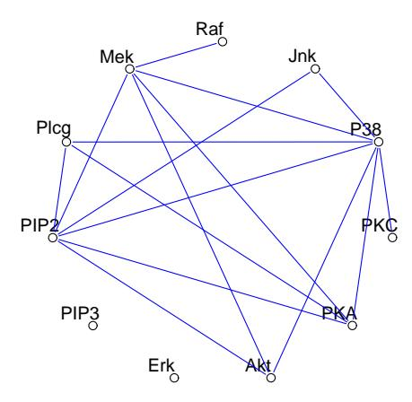
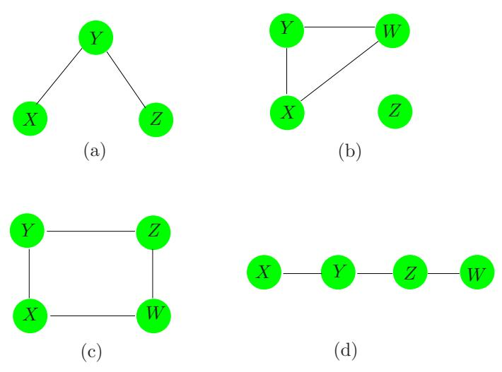
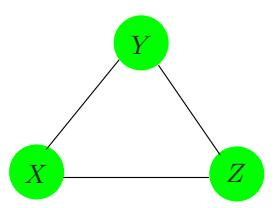
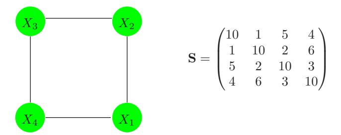
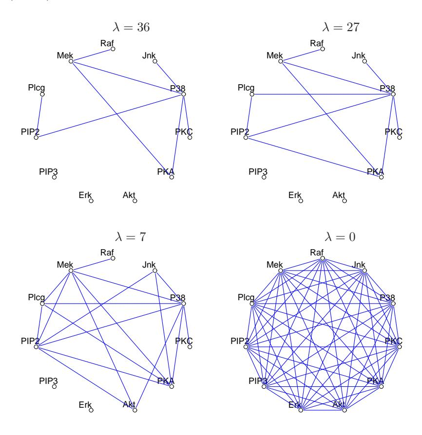
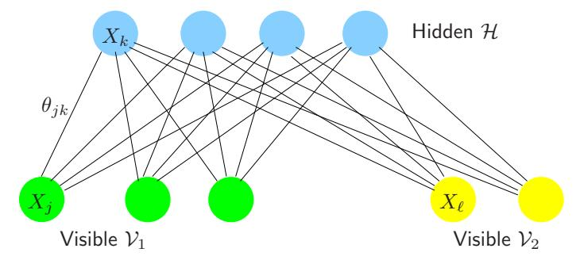
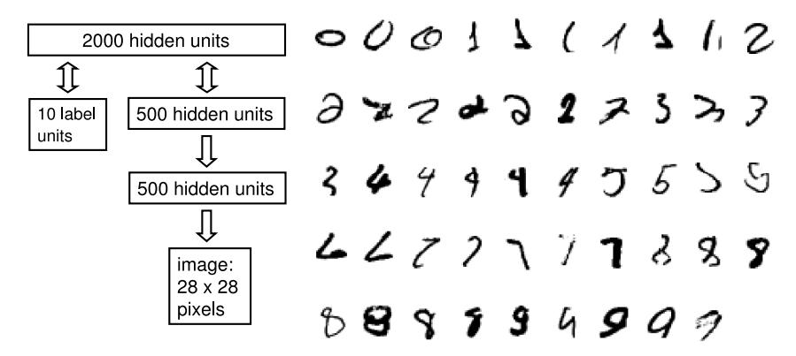
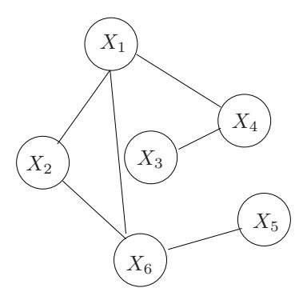

# Undirected Graphical Models

# 17.1 Introduction

A graph consists of a set of vertices (nodes), along with a set of edges joining some pairs of the vertices. In graphical models, each vertex represents a random variable, and the graph gives a visual way of understanding the joint distribution of the entire set of random variables. They can be useful for either unsupervised or supervised learning. In an undirected graph, the edges have no directional arrows. We restrict our discussion to undirected graphical models, also known as Markov random fields or Markov networks. In these graphs, the absence of an edge between two vertices has a special meaning: the corresponding random variables are conditionally independent, given the other variables.

Figure 17.1 shows an example of a graphical model for a flow-cytometry dataset with p = 11 proteins measured on N = 7466 cells, from Sachs et al. (2005). Each vertex in the graph corresponds to the real-valued expression level of a protein. The network structure was estimated assuming a multivariate Gaussian distribution, using the graphical lasso procedure discussed later in this chapter.

Sparse graphs have a relatively small number of edges, and are convenient for interpretation. They are useful in a variety of domains, including genomics and proteomics, where they provide rough models of cell pathways. Much work has been done in defining and understanding the structure of graphical models; see the Bibliographic Notes for references.

FIGURE 17.1. Example of a sparse undirected graph, estimated from a flow cytometry dataset, with p = 11 proteins measured on N = 7466 cells. The network structure was estimated using the graphical lasso procedure discussed in this chapter.

As we will see, the edges in a graph are parametrized by values or potentials that encode the strength of the conditional dependence between the random variables at the corresponding vertices. The main challenges in working with graphical models are model selection (choosing the structure of the graph), estimation of the edge parameters from data, and computation of marginal vertex probabilities and expectations, from their joint distribution. The last two tasks are sometimes called learning and inference in the computer science literature.

We do not attempt a comprehensive treatment of this interesting area. Instead, we introduce some basic concepts, and then discuss a few simple methods for estimation of the parameters and structure of undirected graphical models; methods that relate to the techniques already discussed in this book. The estimation approaches that we present for continuous and discrete-valued vertices are different, so we treat them separately. Sections 17.3.1 and 17.3.2 may be of particular interest, as they describe new, regression-based procedures for estimating graphical models.

There is a large and active literature on directed graphical models or Bayesian networks; these are graphical models in which the edges have directional arrows (but no directed cycles). Directed graphical models represent probability distributions that can be factored into products of conditional distributions, and have the potential for causal interpretations. We refer the reader to Wasserman (2004) for a brief overview of both undirected and directed graphs; the next section follows closely his Chapter 18.

**FIGURE 17.2.** Examples of undirected graphical models or Markov networks. Each node or vertex represents a random variable, and the lack of an edge between two nodes indicates conditional independence. For example, in graph (a), X and Z are conditionally independent, given Y. In graph (b), Z is independent of each of X, Y, and W.

A longer list of useful references is given in the Bibliographic Notes on page 645.

# 17.2 Markov Graphs and Their Properties

In this section we discuss the basic properties of graphs as models for the joint distribution of a set of random variables. We defer discussion of (a) parametrization and estimation of the edge parameters from data, and (b) estimation of the topology of a graph, to later sections.

Figure 17.2 shows four examples of undirected graphs. A graph  $\mathcal{G}$  consists of a pair (V, E), where V is a set of vertices and E the set of edges (defined by pairs of vertices). Two vertices X and Y are called *adjacent* if there is a edge joining them; this is denoted by  $X \sim Y$ . A path  $X_1, X_2, \ldots, X_n$  is a set of vertices that are joined, that is  $X_{i-1} \sim X_i$  for  $i = 2, \ldots, n$ . A complete graph is a graph with every pair of vertices joined by an edge. A subgraph  $U \in V$  is a subset of vertices together with their edges. For example, (X, Y, Z) in Figure 17.2(a) form a path but not a complete graph.

Suppose that we have a graph  $\mathcal{G}$  whose vertex set V represents a set of random variables having joint distribution P. In a Markov graph  $\mathcal{G}$ , the absence of an edge implies that the corresponding random variables are conditionally independent given the variables at the other vertices. This is expressed with the following notation:

No edge joining 
$$X$$
 and  $Y \iff X \perp Y | \text{rest}$  (17.1)

where "rest" refers to all of the other vertices in the graph. For example in Figure 17.2(a)  $X \perp Z|Y$ . These are known as the *pairwise Markov* independencies of  $\mathcal{G}$ .

If A, B and C are subgraphs, then C is said to separate A and B if every path between A and B intersects a node in C. For example, Y separates X and Z in Figures 17.2(a) and (d), and Z separates Y and W in (d). In Figure 17.2(b) Z is not connected to X, Y, W so we say that the two sets are separated by the empty set. In Figure 17.2(c),  $C = \{X, Z\}$  separates Y and W.

Separators have the nice property that they break the graph into conditionally independent pieces. Specifically, in a Markov graph  $\mathcal{G}$  with subgraphs A, B and C,

if C separates A and B then 
$$A \perp B|C$$
. (17.2)

These are known as the global Markov properties of  $\mathcal G$ . It turns out that the pairwise and global Markov properties of a graph are equivalent (for graphs with positive distributions). That is, the set of graphs with associated probability distributions that satisfy the pairwise Markov independencies and global Markov assumptions are the same. This result is useful for inferring global independence relations from simple pairwise properties. For example in Figure 17.2(d)  $X \perp Z|\{Y,W\}$  since it is a Markov graph and there is no link joining X and Z. But Y also separates X from Z and W and hence by the global Markov assumption we conclude that  $X \perp Z|Y$  and  $X \perp W|Y$ . Similarly we have  $Y \perp W|Z$ .

The global Markov property allows us to decompose graphs into smaller more manageable pieces and thus leads to essential simplifications in computation and interpretation. For this purpose we separate the graph into cliques. A *clique* is a complete subgraph— a set of vertices that are all adjacent to one another; it is called *maximal* if it is a clique and no other vertices can be added to it and still yield a clique. The maximal cliques for the graphs of Figure 17.2 are

- (a)  $\{X, Y\}, \{Y, Z\},$
- (b)  $\{X, Y, W\}, \{Z\},$
- (c)  $\{X,Y\}, \{Y,Z\}, \{Z,W\}, \{X,W\},$ and
- (d)  $\{X,Y\}, \{Y,Z\}, \{Z,W\}.$

Although the following applies to both continuous and discrete distributions, much of the development has been for the latter. A probability density function f over a Markov graph  $\mathcal G$  can be can represented as

$$f(x) = \frac{1}{Z} \prod_{C \in \mathcal{C}} \psi_C(x_C) \tag{17.3}$$

where C is the set of maximal cliques, and the positive functions  $\psi_C(\cdot)$  are called *clique potentials*. These are not in general density functions1, but rather are affinities that capture the dependence in  $X_C$  by scoring certain instances  $x_C$  higher than others. The quantity

$$Z = \sum_{x \in \mathcal{X}} \prod_{C \in \mathcal{C}} \psi_C(x_C) \tag{17.4}$$

is the normalizing constant, also known as the partition function. Alternatively, the representation (17.3) implies a graph with independence properties defined by the cliques in the product. This result holds for Markov networks  $\mathcal{G}$  with positive distributions, and is known as the Hammersley-Clifford theorem (Hammersley and Clifford, 1971; Clifford, 1990).

Many of the methods for estimation and computation on graphs first decompose the graph into its maximal cliques. Relevant quantities are computed in the individual cliques and then accumulated across the entire graph. A prominent example is the *join tree* or *junction tree* algorithm for computing marginal and low order probabilities from the joint distribution on a graph. Details can be found in Pearl (1986), Lauritzen and Spiegelhalter (1988), Pearl (1988), Shenoy and Shafer (1988), Jensen et al. (1990), or Koller and Friedman (2007).

**FIGURE 17.3.** A complete graph does not uniquely specify the higher-order dependence structure in the joint distribution of the variables.

A graphical model does not always uniquely specify the higher-order dependence structure of a joint probability distribution. Consider the complete three-node graph in Figure 17.3. It could represent the dependence structure of either of the following distributions:

$$f^{(2)}(x,y,z) = \frac{1}{Z}\psi(x,y)\psi(x,z)\psi(y,z);$$
  

$$f^{(3)}(x,y,z) = \frac{1}{Z}\psi(x,y,z).$$
(17.5)

The first specifies only second order dependence (and can be represented with fewer parameters). Graphical models for discrete data are a special

&lt;sup>1If the cliques are separated, then the potentials can be densities, but this is in general not the case.

case of loglinear models for multiway contingency tables (Bishop et al., 1975, e.g.); in that language  $f^{(2)}$  is referred to as the "no second-order interaction" model.

For the remainder of this chapter we focus on pairwise Markov graphs (Koller and Friedman, 2007). Here there is a potential function for each edge (pair of variables as in  $f^{(2)}$  above), and at most second—order interactions are represented. These are more parsimonious in terms of parameters, easier to work with, and give the minimal complexity implied by the graph structure. The models for both continuous and discrete data are functions of only the pairwise marginal distributions of the variables represented in the edge set.

# 17.3 Undirected Graphical Models for Continuous Variables

Here we consider Markov networks where all the variables are continuous. The Gaussian distribution is almost always used for such graphical models, because of its convenient analytical properties. We assume that the observations have a multivariate Gaussian distribution with mean  $\mu$  and covariance matrix  $\Sigma$ . Since the Gaussian distribution represents at most second-order relationships, it automatically encodes a pairwise Markov graph. The graph in Figure 17.1 is an example of a Gaussian graphical model.

The Gaussian distribution has the property that all conditional distributions are also Gaussian. The inverse covariance matrix  $\Sigma^{-1}$  contains information about the *partial covariances* between the variables; that is, the covariances between pairs i and j, conditioned on all other variables. In particular, if the ijth component of  $\Theta = \Sigma^{-1}$  is zero, then variables i and j are conditionally independent, given the other variables (Exercise 17.3).

It is instructive to examine the conditional distribution of one variable versus the rest, where the role of  $\Theta$  is explicit. Suppose we partition X = (Z, Y) where  $Z = (X_1, \ldots, X_{p-1})$  consists of the first p-1 variables and  $Y = X_p$  is the last. Then we have the conditional distribution of Y give Z (Mardia et al., 1979, e.g.)

$$Y|Z = z \sim N \left(\mu_Y + (z - \mu_Z)^T \mathbf{\Sigma}_{ZZ}^{-1} \sigma_{ZY}, \ \sigma_{YY} - \sigma_{ZY}^T \mathbf{\Sigma}_{ZZ}^{-1} \sigma_{ZY}\right), \quad (17.6)$$

where we have partitioned  $\Sigma$  as

$$\Sigma = \begin{pmatrix} \Sigma_{ZZ} & \sigma_{ZY} \\ \sigma_{ZY}^T & \sigma_{YY} \end{pmatrix}. \tag{17.7}$$

The conditional mean in (17.6) has exactly the same form as the population multiple linear regression of Y on Z, with regression coefficient  $\beta = \Sigma_{ZZ}^{-1} \sigma_{ZY}$  [see (2.16) on page 19]. If we partition  $\Theta$  in the same way, since  $\Sigma \Theta = \mathbf{I}$  standard formulas for partitioned inverses give

$$\theta_{ZY} = -\theta_{YY} \cdot \Sigma_{ZZ}^{-1} \sigma_{ZY}, \tag{17.8}$$

where  $1/\theta_{YY} = \sigma_{YY} - \sigma_{ZY}^T \Sigma_{ZZ}^{-1} \sigma_{ZY} > 0$ . Hence

$$\beta = \Sigma_{ZZ}^{-1} \sigma_{ZY} = -\theta_{ZY} / \theta_{YY}.$$
 (17.9)

We have learned two things here:

- The dependence of Y on Z in (17.6) is in the mean term alone. Here we see explicitly that zero elements in  $\beta$  and hence  $\theta_{ZY}$  mean that the corresponding elements of Z are conditionally independent of Y, given the rest.
- We can learn about this dependence structure through multiple linear regression.

Thus  $\Theta$  captures all the second-order information (both structural and quantitative) needed to describe the conditional distribution of each node given the rest, and is the so-called "natural" parameter for the Gaussian graphical model2.

Another (different) kind of graphical model is the *covariance graph* or *relevance network*, in which vertices are connected by bidirectional edges if the covariance (rather than the partial covariance) between the corresponding variables is nonzero. These are popular in genomics, see especially Butte et al. (2000). The negative log-likelihood from these models is not convex, making the computations more challenging (Chaudhuri et al., 2007).

# 17.3.1 Estimation of the Parameters when the Graph Structure is Known

Given some realizations of X, we would like to estimate the parameters of an undirected graph that approximates their joint distribution. Suppose first that the graph is complete (fully connected). We assume that we have N multivariate normal realizations  $x_i$ ,  $i=1,\ldots,N$  with population mean  $\mu$  and covariance  $\Sigma$ . Let

$$\mathbf{S} = \frac{1}{N} \sum_{i=1}^{N} (x_i - \bar{x})(x_i - \bar{x})^T$$
 (17.10)

be the empirical covariance matrix, with  $\bar{x}$  the sample mean vector. Ignoring constants, the log-likelihood of the data can be written as

&lt;sup>2The distribution arising from a Gaussian graphical model is a Wishart distribution. This is a member of the exponential family, with canonical or "natural" parameter  $\Theta = \Sigma^{-1}$ . Indeed, the partially maximized log-likelihood (17.11) is (up to constants) the Wishart log-likelihood.

$$\ell(\mathbf{\Theta}) = \log \det \mathbf{\Theta} - \operatorname{trace}(\mathbf{S}\mathbf{\Theta}). \tag{17.11}$$

In (17.11) we have partially maximized with respect to the mean parameter µ. The quantity −ℓ(Θ) is a convex function of Θ. It is easy to show that the maximum likelihood estimate of Σ is simply S.

Now to make the graph more useful (especially in high-dimensional settings) let's assume that some of the edges are missing; for example, the edge between PIP3 and Erk is one of several missing in Figure 17.1. As we have seen, for the Gaussian distribution this implies that the corresponding entries of Θ = Σ−1 are zero. Hence we now would like to maximize (17.11) under the constraints that some pre-defined subset of the parameters are zero. This is an equality-constrained convex optimization problem, and a number of methods have been proposed for solving it, in particular the iterative proportional fitting procedure (Speed and Kiiveri, 1986). This and other methods are summarized for example in Whittaker (1990) and Lauritzen (1996). These methods exploit the simplifications that arise from decomposing the graph into its maximal cliques, as described in the previous section. Here we outline a simple alternate approach, that exploits the sparsity in a different way. The fruits of this approach will become apparent later when we discuss the problem of estimation of the graph structure.

The idea is based on linear regression, as inspired by (17.6) and (17.9). In particular, suppose that we want to estimate the edge parameters θij for the vertices that are joined to a given vertex i, restricting those that are not joined to be zero. Then it would seem that the linear regression of the node i values on the other relevant vertices might provide a reasonable estimate. But this ignores the dependence structure among the predictors in this regression. It turns out that if instead we use our current (model-based) estimate of the cross-product matrix of the predictors when we perform our regressions, this gives the correct solutions and solves the constrained maximum-likelihood problem exactly. We now give details.

To constrain the log-likelihood (17.11), we add Lagrange constants for all missing edges

$$\ell_C(\mathbf{\Theta}) = \log \det \mathbf{\Theta} - \operatorname{trace}(\mathbf{S}\mathbf{\Theta}) - \sum_{(j,k) \notin E} \gamma_{jk} \theta_{jk}.$$
 (17.12)

The gradient equation for maximizing (17.12) can be written as

$$\mathbf{\Theta}^{-1} - \mathbf{S} - \mathbf{\Gamma} = \mathbf{0},\tag{17.13}$$

using the fact that the derivative of log det Θ equals Θ−1 (Boyd and Vandenberghe, 2004, for example, page 641). Γ is a matrix of Lagrange parameters with nonzero values for all pairs with edges absent.

We will show how we can use regression to solve for Θ and its inverse W = Θ−1 one row and column at a time. For simplicity let's focus on the last row and column. Then the upper right block of equation (17.13) can be written as

$$w_{12} - s_{12} - \gamma_{12} = 0. (17.14)$$

Here we have partitioned the matrices into two parts as in (17.7): part 1 being the first p-1 rows and columns, and part 2 the pth row and column. With  $\mathbf{W}$  and its inverse  $\mathbf{\Theta}$  partitioned in a similar fashion, we have

$$\begin{pmatrix} \mathbf{W}_{11} & w_{12} \\ w_{12}^T & w_{22} \end{pmatrix} \begin{pmatrix} \mathbf{\Theta}_{11} & \theta_{12} \\ \theta_{12}^T & \theta_{22} \end{pmatrix} = \begin{pmatrix} \mathbf{I} & 0 \\ 0^T & 1 \end{pmatrix}. \tag{17.15}$$

This implies

$$w_{12} = -\mathbf{W}_{11}\theta_{12}/\theta_{22} \tag{17.16}$$

$$= \mathbf{W}_{11}\beta \tag{17.17}$$

where  $\beta = -\theta_{12}/\theta_{22}$  as in (17.9). Now substituting (17.17) into (17.14) gives

$$\mathbf{W}_{11}\beta - s_{12} - \gamma_{12} = 0. \tag{17.18}$$

These can be interpreted as the p-1 estimating equations for the constrained regression of  $X_p$  on the other predictors, except that the observed mean cross-products matrix  $\mathbf{S}_{11}$  is replaced by  $\mathbf{W}_{11}$ , the current estimated covariance matrix from the model.

Now we can solve (17.18) by simple subset regression. Suppose there are p-q nonzero elements in  $\gamma_{12}$ —i.e., p-q edges constrained to be zero. These p-q rows carry no information and can be removed. Furthermore we can reduce  $\beta$  to  $\beta^*$  by removing its p-q zero elements, yielding the reduced  $q \times q$  system of equations

$$\mathbf{W}_{11}^* \beta^* - s_{12}^* = 0, \tag{17.19}$$

with solution  $\hat{\beta}^* = \mathbf{W}_{11}^{*-1} s_{12}^*$ . This is padded with p - q zeros to give  $\hat{\beta}$ .

Although it appears from (17.16) that we only recover the elements  $\theta_{12}$  up to a scale factor  $1/\theta_{22}$ , it is easy to show that

$$\frac{1}{\theta_{22}} = w_{22} - w_{12}^T \beta \tag{17.20}$$

(using partitioned inverse formulas). Also  $w_{22} = s_{22}$ , since the diagonal of  $\Gamma$  in (17.13) is zero.

This leads to the simple iterative procedure given in Algorithm 17.1 for estimating both  $\hat{\mathbf{W}}$  and its inverse  $\hat{\mathbf{\Theta}}$ , subject to the constraints of the missing edges.

Note that this algorithm makes conceptual sense. The graph estimation problem is not p separate regression problems, but rather p coupled problems. The use of the common  $\mathbf{W}$  in step (b), in place of the observed cross-products matrix, couples the problems together in the appropriate fashion. Surprisingly, we were not able to find this procedure in the literature. However it is related to the covariance selection procedures of

Algorithm 17.1 A Modified Regression Algorithm for Estimation of an Undirected Gaussian Graphical Model with Known Structure.

- 1. Initialize  $\mathbf{W} = \mathbf{S}$ .
- 2. Repeat for j = 1, 2, ..., p, 1, ... until convergence:
  - (a) Partition the matrix  $\mathbf{W}$  into part 1: all but the jth row and column, and part 2: the jth row and column.
  - (b) Solve  $\mathbf{W}_{11}^*\beta^* s_{12}^* = 0$  for the unconstrained edge parameters  $\beta^*$ , using the reduced system of equations as in (17.19). Obtain  $\hat{\beta}$  by padding  $\hat{\beta}^*$  with zeros in the appropriate positions.
  - (c) Update  $w_{12} = \mathbf{W}_{11}\hat{\beta}$
- 3. In the final cycle (for each j) solve for  $\hat{\theta}_{12} = -\hat{\beta} \cdot \hat{\theta}_{22}$ , with  $1/\hat{\theta}_{22} = s_{22} w_{12}^T \hat{\beta}$ .

FIGURE 17.4. A simple graph for illustration, along with the empirical covariance matrix.

Dempster (1972), and is similar in flavor to the iterative conditional fitting procedure for covariance graphs, proposed by Chaudhuri et al. (2007).

Here is a little example, borrowed from Whittaker (1990). Suppose that our model is as depicted in Figure 17.4, along with its empirical covariance matrix **S**. We apply algorithm (17.1) to this problem; for example, in the modified regression for variable 1 in step (b), variable 3 is left out. The procedure quickly converged to the solutions:

$$\hat{\boldsymbol{\Sigma}} = \begin{pmatrix} 10.00 & 1.00 & 1.31 & 4.00 \\ 1.00 & 10.00 & 2.00 & 0.87 \\ 1.31 & 2.00 & 10.00 & 3.00 \\ 4.00 & 0.87 & 3.00 & 10.00 \end{pmatrix}, \quad \hat{\boldsymbol{\Sigma}}^{-1} = \begin{pmatrix} 0.12 & -0.01 & 0.00 & -0.05 \\ -0.01 & 0.11 & -0.02 & 0.00 \\ 0.00 & -0.02 & 0.11 & -0.03 \\ -0.05 & 0.00 & -0.03 & 0.13 \end{pmatrix}.$$

Note the zeroes in  $\hat{\Sigma}^{-1}$ , corresponding to the missing edges (1,3) and (2,4). Note also that the corresponding elements in  $\hat{\Sigma}$  are the only elements different from **S**. The estimation of  $\hat{\Sigma}$  is an example of what is sometimes called the positive definite "completion" of **S**.

#### 17.3.2 Estimation of the Graph Structure

In most cases we do not know which edges to omit from our graph, and so would like to try to discover this from the data itself. In recent years a number of authors have proposed the use of  $L_1$  (lasso) regularization for this purpose.

Meinshausen and Bühlmann (2006) take a simple approach to the problem: rather than trying to fully estimate  $\Sigma$  or  $\Theta = \Sigma^{-1}$ , they only estimate which components of  $\theta_{ij}$  are nonzero. To do this, they fit a lasso regression using each variable as the response and the others as predictors. The component  $\theta_{ij}$  is then estimated to be nonzero if either the estimated coefficient of variable i on j is nonzero, OR the estimated coefficient of variable j on i is nonzero (alternatively they use an AND rule). They show that asymptotically this procedure consistently estimates the set of nonzero elements of  $\Theta$ .

We can take a more systematic approach with the lasso penalty, following the development of the previous section. Consider maximizing the penalized log-likelihood

$$\log \det \mathbf{\Theta} - \operatorname{trace}(\mathbf{S}\mathbf{\Theta}) - \lambda ||\mathbf{\Theta}||_1, \tag{17.21}$$

where  $||\Theta||_1$  is the  $L_1$  norm—the sum of the absolute values of the elements of  $\Sigma^{-1}$ , and we have ignored constants. The negative of this penalized likelihood is a convex function of  $\Theta$ .

It turns out that one can adapt the lasso to give the exact maximizer of the penalized log-likelihood. In particular, we simply replace the modified regression step (b) in Algorithm 17.1 by a modified lasso step. Here are the details.

The analog of the gradient equation (17.13) is now

$$\mathbf{\Theta}^{-1} - \mathbf{S} - \lambda \cdot \operatorname{Sign}(\mathbf{\Theta}) = \mathbf{0}. \tag{17.22}$$

Here we use sub-gradient notation, with  $\operatorname{Sign}(\theta_{jk}) = \operatorname{sign}(\theta_{jk})$  if  $\theta_{jk} \neq 0$ , else  $\operatorname{Sign}(\theta_{jk}) \in [-1, 1]$  if  $\theta_{jk} = 0$ . Continuing the development in the previous section, we reach the analog of (17.18)

$$\mathbf{W}_{11}\beta - s_{12} + \lambda \cdot \operatorname{Sign}(\beta) = 0 \tag{17.23}$$

(recall that  $\beta$  and  $\theta_{12}$  have opposite signs). We will now see that this system is exactly equivalent to the estimating equations for a lasso regression.

Consider the usual regression setup with outcome variables  ${\bf y}$  and predictor matrix  ${\bf Z}$ . There the lasso minimizes

$$\frac{1}{2}(\mathbf{y} - \mathbf{Z}\beta)^{T}(\mathbf{y} - \mathbf{Z}\beta) + \lambda \cdot ||\beta||_{1}$$
 (17.24)

[see (3.52) on page 68; here we have added a factor  $\frac{1}{2}$  for convenience]. The gradient of this expression is

#### Algorithm 17.2 Graphical Lasso.

- 1. Initialize  $\mathbf{W} = \mathbf{S} + \lambda \mathbf{I}$ . The diagonal of  $\mathbf{W}$  remains unchanged in what follows.
- 2. Repeat for  $j = 1, 2, \dots, p, 1, 2, \dots, p, \dots$  until convergence:
  - (a) Partition the matrix  $\mathbf{W}$  into part 1: all but the jth row and column, and part 2: the jth row and column.
  - (b) Solve the estimating equations  $\mathbf{W}_{11}\beta s_{12} + \lambda \cdot \operatorname{Sign}(\beta) = 0$  using the cyclical coordinate-descent algorithm (17.26) for the modified lasso.
  - (c) Update  $w_{12} = \mathbf{W}_{11}\hat{\beta}$
- 3. In the final cycle (for each j) solve for  $\hat{\theta}_{12} = -\hat{\beta} \cdot \hat{\theta}_{22}$ , with  $1/\hat{\theta}_{22} = w_{22} w_{12}^T \hat{\beta}$ .

$$\mathbf{Z}^{T}\mathbf{Z}\beta - \mathbf{Z}^{T}\mathbf{y} + \lambda \cdot \operatorname{Sign}(\beta) = 0$$
 (17.25)

So up to a factor 1/N,  $\mathbf{Z}^T\mathbf{y}$  is the analog of  $s_{12}$ , and we replace  $\mathbf{Z}^T\mathbf{Z}$  by  $\mathbf{W}_{11}$ , the estimated cross-product matrix from our current model.

The resulting procedure is called the *graphical lasso*, proposed by Friedman et al. (2008b) building on the work of Banerjee et al. (2008). It is summarized in Algorithm 17.2.

Friedman et al. (2008b) use the pathwise coordinate descent method (Section 3.8.6) to solve the modified lasso problem at each stage. Here are the details of pathwise coordinate descent for the graphical lasso algorithm. Letting  $\mathbf{V} = \mathbf{W}_{11}$ , the update has the form

$$\hat{\beta}_j \leftarrow S\left(s_{12j} - \sum_{k \neq j} V_{kj} \hat{\beta}_k, \lambda\right) / V_{jj}$$
 (17.26)

for  $j=1,2,\ldots,p-1,1,2,\ldots,p-1,\ldots,$  where S is the soft-threshold operator:

$$S(x,t) = sign(x)(|x| - t)_{+}.$$
(17.27)

The procedure cycles through the predictors until convergence.

It is easy to show that the diagonal elements  $w_{jj}$  of the solution matrix **W** are simply  $s_{jj} + \lambda$ , and these are fixed in step 1 of Algorithm 17.23.

The graphical lasso algorithm is extremely fast, and can solve a moderately sparse problem with 1000 nodes in less than a minute. It is easy to modify the algorithm to have edge-specific penalty parameters  $\lambda_{jk}$ ; since

&lt;sup>3An alternative formulation of the problem (17.21) can be posed, where we don't penalize the diagonal of  $\Theta$ . Then the diagonal elements  $w_{jj}$  of the solution matrix are  $s_{jj}$ , and the rest of the algorithm is unchanged.

λjk = ∞ will force ˆθjk to be zero, this algorithm subsumes Algorithm 17.1. By casting the sparse inverse-covariance problem as a series of regressions, one can also quickly compute and examine the solution paths as a function of the penalty parameter λ. More details can be found in Friedman et al. (2008b).

FIGURE 17.5. Four different graphical-lasso solutions for the flow-cytometry data.

Figure 17.1 shows the result of applying the graphical lasso to the flowcytometry dataset. Here the lasso penalty parameter λ was set at 14. In practice it is informative to examine the different sets of graphs that are obtained as λ is varied. Figure 17.5 shows four different solutions. The graph becomes more sparse as the penalty parameter is increased.

Finally note that the values at some of the nodes in a graphical model can be unobserved; that is, missing or hidden. If only some values are missing at a node, the EM algorithm can be used to impute the missing values (Exercise 17.9). However, sometimes the entire node is hidden or latent. In the Gaussian model, if a node has all missing values, due to linearity one can simply average over the missing nodes to yield another Gaussian model over the observed nodes. Hence the inclusion of hidden nodes does not enrich the resulting model for the observed nodes; in fact, it imposes additional structure on its covariance matrix. However in the discrete model (described next) the inherent nonlinearities make hidden units a powerful way of expanding the model.

# 17.4 Undirected Graphical Models for Discrete Variables

Undirected Markov networks with all discrete variables are popular, and in particular pairwise Markov networks with binary variables being the most common. They are sometimes called Ising models in the statistical mechanics literature, and Boltzmann machines in the machine learning literature, where the vertices are referred to as "nodes" or "units" and are binary-valued.

In addition, the values at each node can be observed ("visible") or unobserved ("hidden"). The nodes are often organized in layers, similar to a neural network. Boltzmann machines are useful both for unsupervised and supervised learning, especially for structured input data such as images, but have been hampered by computational difficulties. Figure 17.6 shows a restricted Boltzmann machine (discussed later), in which some variables are hidden, and only some pairs of nodes are connected. We first consider the simpler case in which all p nodes are visible with edge pairs (j, k) enumerated in E.

Denoting the binary valued variable at node j by Xj , the Ising model for their joint probabilities is given by

$$p(X, \mathbf{\Theta}) = \exp\left[\sum_{(j,k)\in E} \theta_{jk} X_j X_k - \Phi(\mathbf{\Theta})\right] \text{ for } X \in \mathcal{X},$$
 (17.28)

with X = {0, 1} p . As with the Gaussian model of the previous section, only pairwise interactions are modeled. The Ising model was developed in statistical mechanics, and is now used more generally to model the joint effects of pairwise interactions. Φ(Θ) is the log of the partition function, and is defined by

$$\Phi(\mathbf{\Theta}) = \log \sum_{x \in \mathcal{X}} \left[ \exp\left(\sum_{(j,k) \in E} \theta_{jk} x_j x_k\right) \right]. \tag{17.29}$$

The partition function ensures that the probabilities add to one over the sample space. The terms θjkXjXk represent a particular parametrization of the (log) potential functions (17.5), and for technical reasons requires a *constant* node  $X_0 \equiv 1$  to be included (Exercise 17.10), with "edges" to all the other nodes. In the statistics literature, this model is equivalent to a first-order-interaction Poisson log-linear model for multiway tables of counts (Bishop et al., 1975; McCullagh and Nelder, 1989; Agresti, 2002).

The Ising model implies a logistic form for each node conditional on the others (exercise 17.11):

$$\Pr(X_j = 1 | X_{-j} = x_{-j}) = \frac{1}{1 + \exp(-\theta_{j0} - \sum_{(j,k) \in E} \theta_{jk} x_k)}, \quad (17.30)$$

where  $X_{-j}$  denotes all of the nodes except j. Hence the parameter  $\theta_{jk}$  measures the dependence of  $X_j$  on  $X_k$ , conditional on the other nodes.

#### 17.4.1 Estimation of the Parameters when the Graph Structure is Known

Given some data from this model, how can we estimate the parameters? Suppose we have observations  $x_i = (x_{i1}, x_{i2}, \dots, x_{ip}) \in \{0, 1\}^p, i = 1, \dots, N$ . The log-likelihood is

$$\ell(\mathbf{\Theta}) = \sum_{i=1}^{N} \log \Pr_{\mathbf{\Theta}}(X_i = x_i)$$

$$= \sum_{i=1}^{N} \left[ \sum_{(j,k) \in E} \theta_{jk} x_{ij} x_{ik} - \Phi(\mathbf{\Theta}) \right]$$
(17.31)

The gradient of the log-likelihood is

$$\frac{\partial \ell(\mathbf{\Theta})}{\partial \theta_{jk}} = \sum_{i=1}^{N} x_{ij} x_{ik} - N \frac{\partial \Phi(\mathbf{\Theta})}{\partial \theta_{jk}}$$
(17.32)

and

$$\frac{\partial \Phi(\mathbf{\Theta})}{\partial \theta_{jk}} = \sum_{x \in \mathcal{X}} x_j x_k \cdot p(x, \mathbf{\Theta})$$

$$= \mathbb{E}_{\mathbf{\Theta}}(X_j X_k) \tag{17.33}$$

Setting the gradient to zero gives

$$\hat{\mathbf{E}}(X_j X_k) - \mathbf{E}_{\mathbf{\Theta}}(X_j X_k) = 0 \tag{17.34}$$

where we have defined

$$\hat{E}(X_j X_k) = \frac{1}{N} \sum_{i=1}^{N} x_{ij} x_{ik}, \qquad (17.35)$$

the expectation taken with respect to the empirical distribution of the data. Looking at (17.34), we see that the maximum likelihood estimates simply match the estimated inner products between the nodes to their observed inner products. This is a standard form for the score (gradient) equation for exponential family models, in which sufficient statistics are set equal to their expectations under the model.

To find the maximum likelihood estimates, we can use gradient search or Newton methods. However the computation of  $E_{\Theta}(X_j X_k)$  involves enumeration of  $p(X, \Theta)$  over  $2^{p-2}$  of the  $|\mathcal{X}| = 2^p$  possible values of X, and is not generally feasible for large p (e.g., larger than about 30). For smaller p, a number of standard statistical approaches are available:

Poisson log-linear modeling, where we treat the problem as a large regression problem (Exercise 17.12). The response vector  $\mathbf{y}$  is the vector of  $2^p$  counts in each of the cells of the multiway tabulation of the data4. The predictor matrix  $\mathbf{Z}$  has  $2^p$  rows and up to  $1+p+p^2$  columns that characterize each of the cells, although this number depends on the sparsity of the graph. The computational cost is essentially that of a regression problem of this size, which is  $O(p^42^p)$  and is manageable for p < 20. The Newton updates are typically computed by iteratively reweighted least squares, and the number of steps is usually in the single digits. See Agresti (2002) and McCullagh and Nelder (1989) for details. Standard software (such as the R package glm) can be used to fit this model.

Gradient descent requires at most  $O(p^22^{p-2})$  computations to compute the gradient, but may require many more gradient steps than the second-order Newton methods. Nevertheless, it can handle slightly larger problems with  $p \leq 30$ . These computations can be reduced by exploiting the special clique structure in sparse graphs, using the junction-tree algorithm. Details are not given here.

Iterative proportional fitting (IPF) performs cyclical coordinate descent on the gradient equations (17.34). At each step a parameter is updated so that its gradient equation is exactly zero. This is done in a cyclical fashion until all the gradients are zero. One complete cycle costs the same as a gradient evaluation, but may be more efficient. Jirouśek and Přeučil (1995) implement an efficient version of IPF, using junction trees.

 $^4$ Each of the cell counts is treated as an independent Poisson variable. We get the multinomial model corresponding to (17.28) by conditioning on the total count N (which is also Poisson under this framework).

When p is large (> 30) other approaches have been used to approximate the gradient.

- The mean field approximation (Peterson and Anderson, 1987) estimates EΘ(XjXk) by EΘ(Xj )EΘ(Xj ), and replaces the input variables by their means, leading to a set of nonlinear equations for the parameters θjk.
- To obtain near-exact solutions, Gibbs sampling (Section 8.6) is used to approximate EΘ(XjXk) by successively sampling from the estimated model probabilities PrΘ(Xj |X−j ) (see e.g. Ripley (1996)).

We have not discussed decomposable models, for which the maximum likelihood estimates can be found in closed form without any iteration whatsoever. These models arise, for example, in trees: special graphs with tree-structured topology. When computational tractability is a concern, trees represent a useful class of models and they sidestep the computational concerns raised in this section. For details, see for example Chapter 12 of Whittaker (1990).

# 17.4.2 Hidden Nodes

We can increase the complexity of a discrete Markov network by including latent or hidden nodes. Suppose that a subset of the variables XH are unobserved or "hidden", and the remainder XV are observed or "visible." Then the log-likelihood of the observed data is

$$\ell(\boldsymbol{\Theta}) = \sum_{i=1}^{N} \log[\Pr_{\boldsymbol{\Theta}}(X_{\mathcal{V}} = x_{i\mathcal{V}})]$$

$$= \sum_{i=1}^{N} \left[\log \sum_{x_{\mathcal{H}} \in \mathcal{X}_{\mathcal{H}}} \exp \sum_{(j,k) \in E} (\theta_{jk} x_{ij} x_{ik} - \Phi(\boldsymbol{\Theta}))\right]. \quad (17.36)$$

The sum over xH means that we are summing over all possible {0, 1} values for the hidden units. The gradient works out to be

$$\frac{d\ell(\mathbf{\Theta})}{d\theta_{jk}} = \hat{\mathbf{E}}_{\mathcal{V}} \mathbf{E}_{\mathbf{\Theta}}(X_j X_k | X_{\mathcal{V}}) - \mathbf{E}_{\mathbf{\Theta}}(X_j X_k)$$
 (17.37)

The first term is an empirical average of XjXk if both are visible; if one or both are hidden, they are first imputed given the visible data, and then averaged over the hidden variables. The second term is the unconditional expectation of XjXk.

The inner expectation in the first term can be evaluated using basic rules of conditional expectation and properties of Bernoulli random variables. In detail, for observation i

$$E_{\mathbf{\Theta}}(X_{j}X_{k}|X_{\mathcal{V}}=x_{i\mathcal{V}}) = \begin{cases} x_{ij}x_{ik} & \text{if } j,k \in \mathcal{V} \\ x_{ij}\operatorname{Pr}_{\mathbf{\Theta}}(X_{k}=1|X_{\mathcal{V}}=x_{i\mathcal{V}}) & \text{if } j \in \mathcal{V}, k \in \mathcal{H} \\ \operatorname{Pr}_{\mathbf{\Theta}}(X_{j}=1,X_{k}=1|X_{\mathcal{V}}=x_{i\mathcal{V}}) & \text{if } j,k \in \mathcal{H}. \end{cases}$$

$$(17.38)$$

Now two separate runs of Gibbs sampling are required; the first to estimate  $E_{\Theta}(X_jX_k)$  by sampling from the model as above, and the second to estimate  $E_{\Theta}(X_jX_k|X_{\mathcal{V}}=x_{i\mathcal{V}})$ . In this latter run, the visible units are fixed ("clamped") at their observed values and only the hidden variables are sampled. Gibbs sampling must be done for each observation in the training set, at each stage of the gradient search. As a result this procedure can be very slow, even for moderate-sized models. In Section 17.4.4 we consider further model restrictions to make these computations manageable.

#### 17.4.3 Estimation of the Graph Structure

The use of a lasso penalty with binary pairwise Markov networks has been suggested by Lee et al. (2007) and Wainwright et al. (2007). The first authors investigate a conjugate gradient procedure for exact maximization of a penalized log-likelihood. The bottleneck is the computation of  $E_{\Theta}(X_jX_k)$  in the gradient; exact computation via the junction tree algorithm is manageable for sparse graphs but becomes unwieldy for dense graphs.

The second authors propose an approximate solution, analogous to the Meinshausen and Bühlmann (2006) approach for the Gaussian graphical model. They fit an  $L_1$ -penalized logistic regression model to each node as a function of the other nodes, and then symmetrize the edge parameter estimates in some fashion. For example if  $\theta_{jk}$  is the estimate of the j-k edge parameter from the logistic model for outcome node j, the "min" symmetrization sets  $\hat{\theta}_{ik}$  to either  $\tilde{\theta}_{ik}$  or  $\tilde{\theta}_{ki}$ , whichever is smallest in absolute value. The "max" criterion is defined similarly. They show that under certain conditions either approximation estimates the nonzero edges correctly as the sample size goes to infinity. Hoefling and Tibshirani (2008) extend the graphical lasso to discrete Markov networks, obtaining a procedure which is somewhat faster than conjugate gradients, but still must deal with computation of  $E_{\Theta}(X_iX_k)$ . They also compare the exact and approximate solutions in an extensive simulation study and find the "min" or "max" approximations are only slightly less accurate than the exact procedure, both for estimating the nonzero edges and for estimating the actual values of the edge parameters, and are *much* faster. Furthermore, they can handle denser graphs because they never need to compute the quantities  $E_{\mathbf{\Theta}}(X_iX_k).$ 

Finally, we point out a key difference between the Gaussian and binary models. In the Gaussian case, both  $\Sigma$  and its inverse will often be of interest, and the graphical lasso procedure delivers estimates for both of these quantities. However, the approximation of Meinshausen and Bühlmann (2006) for Gaussian graphical models, analogous to the Wainwright et al. (2007)

**FIGURE 17.6.** A restricted Boltzmann machine (RBM) in which there are no connections between nodes in the same layer. The visible units are subdivided to allow the RBM to model the joint density of feature  $V_1$  and their labels  $V_2$ .

approximation for the binary case, only yields an estimate of  $\Sigma^{-1}$ . In contrast, in the Markov model for binary data,  $\Theta$  is the object of interest, and its inverse is not of interest. The approximate method of Wainwright et al. (2007) estimates  $\Theta$  efficiently and hence is an attractive solution for the binary problem.

#### 17.4.4 Restricted Boltzmann Machines

In this section we consider a particular architecture for graphical models inspired by neural networks, where the units are organized in layers. A restricted Boltzmann machine (RBM) consists of one layer of visible units and one layer of hidden units with no connections within each layer. It is much simpler to compute the conditional expectations (as in (17.37) and (17.38)) if the connections between hidden units are removed 5. Figure 17.6 shows an example; the visible layer is divided into input variables  $\mathcal{V}_1$  and output variables  $\mathcal{V}_2$ , and there is a hidden layer  $\mathcal{H}$ . We denote such a network by

$$\mathcal{V}_1 \leftrightarrow \mathcal{H} \leftrightarrow \mathcal{V}_2.$$
 (17.39)

For example,  $V_1$  could be the binary pixels of an image of a handwritten digit, and  $V_2$  could have 10 units, one for each of the observed class labels 0-9.

The restricted form of this model simplifies the Gibbs sampling for estimating the expectations in (17.37), since the variables in each layer are independent of one another, given the variables in the other layers. Hence they can be sampled together, using the conditional probabilities given by expression (17.30).

The resulting model is less general than a Boltzmann machine, but is still useful; for example it can learn to extract interesting features from images.

&lt;sup>5We thank Geoffrey Hinton for assistance in the preparation of the material on RBMs.

By alternately sampling the variables in each layer of the RBM shown in Figure 17.6, it is possible to generate samples from the joint density model. If the V1 part of the visible layer is clamped at a particular feature vector during the alternating sampling, it is possible to sample from the distribution over labels given V1. Alternatively classification of test items can also be achieved by comparing the unnormalized joint densities of each label category with the observed features. We do not need to compute the partition function as it is the same for all of these combinations.

As noted the restricted Boltzmann machine has the same generic form as a single hidden layer neural network (Section 11.3). The edges in the latter model are directed, the hidden units are usually real-valued, and the fitting criterion is different. The neural network minimizes the error (crossentropy) between the targets and their model predictions, conditional on the input features. In contrast, the restricted Boltzmann machine maximizes the log-likelihood for the joint distribution of all visible units—that is, the features and targets. It can extract information from the input features that is useful for predicting the labels, but, unlike supervised learning methods, it may also use some of its hidden units to model structure in the feature vectors that is not immediately relevant for predicting the labels. These features may turn out to be useful, however, when combined with features derived from other hidden layers.

Unfortunately, Gibbs sampling in a restricted Boltzmann machine can be very slow, as it can take a long time to reach stationarity. As the network weights get larger, the chain mixes more slowly and we need to run more steps to get the unconditional estimates. Hinton (2002) noticed empirically that learning still works well if we estimate the second expectation in (17.37) by starting the Markov chain at the data and only running for a few steps (instead of to convergence). He calls this contrastive divergence: we sample H given V1, V2, then V1, V2 given H and finally H given V1, V2 again. The idea is that when the parameters are far from the solution, it may be wasteful to iterate the Gibbs sampler to stationarity, as just a single iteration will reveal a good direction for moving the estimates.

We now give an example to illustrate the use of an RBM. Using contrastive divergence, it is possible to train an RBM to recognize hand-written digits from the MNIST dataset (LeCun et al., 1998). With 2000 hidden units, 784 visible units for representing binary pixel intensities and one 10-way multinomial visible unit for representing labels, the RBM achieves an error rate of 1.9% on the test set. This is a little higher than the 1.4% achieved by a support vector machine and comparable to the error rate achieved by a neural network trained with backpropagation. The error rate of the RBM, however, can be reduced to 1.25% by replacing the 784 pixel intensities by 500 features that are produced from the images without using any label information. First, an RBM with 784 visible units and 500 hidden units is trained, using contrastive divergence, to model the set of images. Then the hidden states of the first RBM are used as data for training a

FIGURE 17.7. Example of a restricted Boltzmann machine for handwritten digit classification. The network is depicted in the schematic on the left. Displayed on the right are some difficult test images that the model classifies correctly.

second RBM that has 500 visible units and 500 hidden units. Finally, the hidden states of the second RBM are used as the features for training an RBM with 2000 hidden units as a joint density model. The details and justification for learning features in this greedy, layer-by-layer way are described in Hinton et al. (2006). Figure 17.7 gives a representation of the composite model that is learned in this way and also shows some examples of the types of distortion that it can cope with.

# Bibliographic Notes

Much work has been done in defining and understanding the structure of graphical models. Comprehensive treatments of graphical models can be found in Whittaker (1990), Lauritzen (1996), Cox and Wermuth (1996), Edwards (2000), Pearl (2000), Anderson (2003), Jordan (2004), and Koller and Friedman (2007). Wasserman (2004) gives a brief introduction, and Chapter 8 of Bishop (2006) gives a more detailed overview. Boltzmann machines were proposed in Ackley et al. (1985). Ripley (1996) has a detailed chapter on topics in graphical models that relate to machine learning. We found this particularly useful for its discussion of Boltzmann machines.

# Exercises

Ex. 17.1 For the Markov graph of Figure 17.8, list all of the implied conditional independence relations and find the maximal cliques.

**FIGURE 17.8.** 

Ex. 17.2 Consider random variables  $X_1, X_2, X_3, X_4$ . In each of the following cases draw a graph that has the given independence relations:

- (a)  $X_1 \perp X_3 | X_2$  and  $X_2 \perp X_4 | X_3$ .
- (b)  $X_1 \perp X_4 | X_2, X_3$  and  $X_2 \perp X_4 | X_1, X_3$ .
- (c)  $X_1 \perp X_4 | X_2, X_3, X_1 \perp X_3 | X_2, X_4 \text{ and } X_3 \perp X_4 | X_1, X_2$ .

Ex. 17.3 Let  $\Sigma$  be the covariance matrix of a set of p variables X. Consider the partial covariance matrix  $\Sigma_{a,b} = \Sigma_{aa} - \Sigma_{ab} \Sigma_{bb}^{-1} \Sigma_{ba}$  between the two subsets of variables  $X_a = (X_1, X_2)$  consisting of the first two, and  $X_b$  the rest. This is the covariance matrix between these two variables, after linear adjustment for all the rest. In the Gaussian distribution, this is the covariance matrix of the conditional distribution of  $X_a|X_b$ . The partial correlation coefficient  $\rho_{jk|\text{rest}}$  between the pair  $X_a$  conditional on the rest  $X_b$ , is simply computed from this partial covariance. Define  $\Theta = \Sigma^{-1}$ .

- 1. Show that  $\Sigma_{a.b} = \Theta_{aa}^{-1}$ .
- 2. Show that if any off-diagonal element of  $\Theta$  is zero, then the partial correlation coefficient between the corresponding variables is zero.
- 3. Show that if we treat  $\Theta$  as if it were a covariance matrix, and compute the corresponding "correlation" matrix

$$\mathbf{R} = \operatorname{diag}(\mathbf{\Theta})^{-1/2} \cdot \mathbf{\Theta} \cdot \operatorname{diag}(\mathbf{\Theta})^{-1/2}, \tag{17.40}$$

then  $r_{jk} = -\rho_{jk|rest}$ 

Ex. 17.4 Denote by

$$f(X_1|X_2,X_3,\ldots,X_p)$$

the conditional density of  $X_1$  given  $X_2, \ldots, X_p$ . If

$$f(X_1|X_2,X_3,\ldots,X_p) = f(X_1|X_3,\ldots,X_p),$$

show that  $X_1 \perp X_2 | X_3, \dots, X_p$ .

Ex. 17.5 Consider the setup in Section 17.3.1 with no missing edges. Show that

$$\mathbf{S}_{11}\beta - s_{12} = 0$$

are the estimating equations for the multiple regression coefficients of the last variable on the rest.

Ex. 17.6 Recovery of  $\hat{\Theta} = \hat{\Sigma}^{-1}$  from Algorithm 17.1. Use expression (17.16) to derive the standard partitioned inverse expressions

$$\theta_{12} = -\mathbf{W}_{11}^{-1} w_{12} \theta_{22} \tag{17.41}$$

$$\theta_{22} = 1/(w_{22} - w_{12}^T \mathbf{W}_{11}^{-1} w_{12}). \tag{17.42}$$

Since  $\hat{\beta} = \mathbf{W}_{11}^{-1} w_{12}$ , show that  $\hat{\theta}_{22} = 1/(w_{22} - w_{12}^T \hat{\beta})$  and  $\hat{\theta}_{12} = -\hat{\beta}\hat{\theta}_{22}$ . Thus  $\hat{\theta}_{12}$  is a simply rescaling of  $\hat{\beta}$  by  $-\hat{\theta}_{22}$ .

Ex. 17.7 Write a program to implement the modified regression procedure in Algorithm 17.1 for fitting the Gaussian graphical model with pre-specified edges missing. Test it on the flow cytometry data from the book website, using the graph of Figure 17.1.

#### Ex. 17.8

- (a) Write a program to fit the lasso using the coordinate descent procedure (17.26). Compare its results to those from the lars program or some other convex optimizer, to check that it is working correctly.
- (b) Using the program from (a), write code to implement the graphical lasso (Algorithm 17.2). Apply it to the flow cytometry data from the book website. Vary the regularization parameter and examine the resulting networks.

Ex. 17.9 Suppose that we have a Gaussian graphical model in which some or all of the data at some vertices are missing.

(a) Consider the EM algorithm for a dataset of N i.i.d. multivariate observations  $x_i \in \mathbb{R}^p$  with mean  $\mu$  and covariance matrix  $\Sigma$ . For each sample i, let  $o_i$  and  $m_i$  index the predictors that are observed and missing, respectively. Show that in the E step, the observations are imputed from the current estimates of  $\mu$  and  $\Sigma$ :

$$\hat{x}_{i,m_i} = \mathcal{E}(x_{i,m_i}|x_{i,o_i},\theta) = \hat{\mu}_{m_i} + \hat{\Sigma}_{m_i,o_i}\hat{\Sigma}_{o_i,o_i}^{-1}(x_{i,o_i} - \hat{\mu}_{o_i})$$
(17.43)

while in the M step,  $\mu$  and  $\Sigma$  are re-estimated from the empirical mean and (modified) covariance of the imputed data:

$$\hat{\mu}_j = \sum_{i=1}^N \hat{x}_{ij}/N$$

$$\hat{\Sigma}_{jj'} = \sum_{i=1}^{N} [(\hat{x}_{ij} - \hat{\mu}_j)(\hat{x}_{ij'} - \hat{\mu}_{j'}) + c_{i,jj'}]/N \qquad (17.44)$$

where ci,jj′ = Σˆ jj′ if j, j′ ∈ mi and zero otherwise. Explain the reason for the correction term ci,jj′ (Little and Rubin, 2002).

- (b) Implement the EM algorithm for the Gaussian graphical model using the modified regression procedure from Exercise 17.7 for the M-step.
- (c) For the flow cytometry data on the book website, set the data for the last protein Jnk in the first 1000 observations to missing, fit the model of Figure 17.1, and compare the predicted values to the actual values for Jnk. Compare the results to those obtained from a regression of Jnk on the other vertices with edges to Jnk in Figure 17.1, using only the non-missing data.

Ex. 17.10 Using a simple binary graphical model with just two variables, show why it is essential to include a constant node X0 ≡ 1 in the model.

Ex. 17.11 Show that the Ising model (17.28) for the joint probabilities in a discrete graphical model implies that the conditional distributions have the logistic form (17.30).

Ex. 17.12 Consider a Poisson regression problem with p binary variables xij , j = 1, . . . , p and response variable yi which measures the number of observations with predictor xi ∈ {0, 1} p . The design is balanced, in that all n = 2p possible combinations are measured. We assume a log-linear model for the Poisson mean in each cell

$$\log \mu(X) = \theta_{00} + \sum_{(j,k)\in E} x_{ij} x_{ik} \theta_{jk}, \tag{17.45}$$

using the same notation as in Section 17.4.1 (including the constant variable xi0 = 1∀i). We assume the response is distributed as

$$\Pr(Y = y | X = x) = \frac{e^{-\mu(x)}\mu(x)^y}{y!}.$$
 (17.46)

Write down the conditional log-likelihood for the observed responses yi , and compute the gradient.

- (a) Show that the gradient equation for θ00 computes the partition function (17.29).
- (b) Show that the gradient equations for the remainder of the parameters are equivalent to the gradient (17.34).