# High-Dimensional Problems: p ≫ N

# 18.1 When p is Much Bigger than N

In this chapter we discuss prediction problems in which the number of features p is much larger than the number of observations N, often written p ≫ N. Such problems have become of increasing importance, especially in genomics and other areas of computational biology. We will see that high variance and overfitting are a major concern in this setting. As a result, simple, highly regularized approaches often become the methods of choice. The first part of the chapter focuses on prediction in both the classification and regression settings, while the second part discusses the more basic problem of feature selection and assessment.

To get us started, Figure 18.1 summarizes a small simulation study that demonstrates the "less fitting is better" principle that applies when p ≫ N. For each of N = 100 samples, we generated p standard Gaussian features X with pairwise correlation 0.2. The outcome Y was generated according to a linear model

$$Y = \sum_{j=1}^{p} X_j \beta_j + \sigma \varepsilon \tag{18.1}$$

where $\epsilon$ was generated from a standard Gaussian distribution. For each dataset, the set of coefficients $\beta$$^{j}$ were also generated from a standard Gaussian distribution. We investigated three cases: p = 20, 100, and 1000. The standard deviation $\sigma$ was chosen in each case so that the signal-to-noise ratio Var[E($^{Y}$ $^{|}$X)]/$\sigma$$^{2}$ equaled 2. As a result, the number of significant uni-

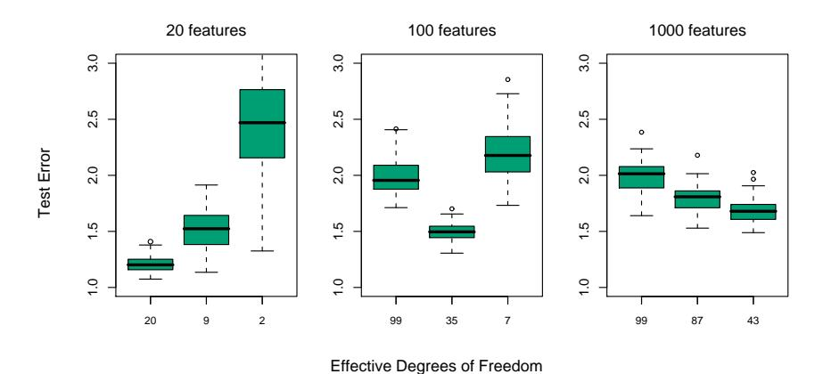

**FIGURE 18.1.** Test-error results for simulation experiments. Shown are boxplots of the relative test errors over 100 simulations, for three different values of p, the number of features. The relative error is the test error divided by the Bayes error,  $\sigma^2$ . From left to right, results are shown for ridge regression with three different values of the regularization parameter  $\lambda$ : 0.001, 100 and 1000. The (average) effective degrees of freedom in the fit is indicated below each plot.

variate regression coefficients$^{1}$ was 9, 33 and 331, respectively, averaged over the 100 simulation runs. The p=1000 case is designed to mimic the kind of data that we might see in a high-dimensional genomic or proteomic dataset, for example.

We fit a ridge regression to the data, with three different values for the regularization parameter  $\lambda$ : 0.001, 100, and 1000. When  $\lambda=0.001$ , this is nearly the same as least squares regression, with a little regularization just to ensure that the problem is non-singular when p>N. Figure 18.1 shows boxplots of the relative test error achieved by the different estimators in each scenario. The corresponding average degrees of freedom used in each ridge-regression fit is indicated (computed using formula (3.50) on page  $68^2$ ). The degrees of freedom is a more interpretable parameter than  $\lambda$ . We see that ridge regression with  $\lambda=0.001$  (20 df) wins when p=20;  $\lambda=100$  (35 df) wins when p=100, and  $\lambda=1000$  (43 df) wins when p=1000.

Here is an explanation for these results. When p = 20, we fit all the way and we can identify as many of the significant coefficients as possible with

$ ^{1} $We call a regression coefficient significant if  $|\hat{\beta}_j/\hat{se}_j| \geq 2$ , where  $\hat{\beta}_j$  is the estimated (univariate) coefficient and  $\hat{se}_j$  is its estimated standard error.

$ ^{2} $For a fixed value of the regularization parameter  $\lambda$ , the degrees of freedom depends on the observed predictor values in each simulation. Hence we compute the average degrees of freedom over simulations.

low bias. When p=100, we can identify some non-zero coefficients using moderate shrinkage. Finally, when p=1000, even though there are many nonzero coefficients, we don't have a hope for finding them and we need to shrink all the way down. As evidence of this, let  $t_j = \hat{\beta}_j/\hat{\text{se}}_j$ , where  $\hat{\beta}_j$  is the ridge regression estimate and  $\hat{\text{se}}_j$  its estimated standard error. Then using the optimal ridge parameter in each of the three cases, the median value of  $|t_j|$  was 2.0, 0.6 and 0.2, and the average number of  $|t_j|$  values exceeding 2 was equal to 9.8, 1.2 and 0.0.

Ridge regression with  $\lambda=0.001$  successfully exploits the correlation in the features when p< N, but cannot do so when  $p\gg N$ . In the latter case there is not enough information in the relatively small number of samples to efficiently estimate the high-dimensional covariance matrix. In that case, more regularization leads to superior prediction performance.

Thus it is not surprising that the analysis of high-dimensional data requires either modification of procedures designed for the N>p scenario, or entirely new procedures. In this chapter we discuss examples of both kinds of approaches for high dimensional classification and regression; these methods tend to regularize quite heavily, using scientific contextual knowledge to suggest the appropriate form for this regularization. The chapter ends with a discussion of feature selection and multiple testing.

## 18.2 Diagonal Linear Discriminant Analysis and Nearest Shrunken Centroids

Gene expression arrays are an important new technology in biology, and are discussed in Chapters 1 and 14. The data in our next example form a matrix of 2308 genes (columns) and 63 samples (rows), from a set of microarray experiments. Each expression value is a log-ratio  $\log(R/G)$ . R is the amount of gene-specific RNA in the target sample that hybridizes to a particular (gene-specific) spot on the microarray, and G is the corresponding amount of RNA from a reference sample. The samples arose from small, round blue-cell tumors (SRBCT) found in children, and are classified into four major types: BL (Burkitt lymphoma), EWS (Ewing's sarcoma), NB (neuroblastoma), and RMS (rhabdomyosarcoma). There is an additional test data set of 20 observations. We will not go into the scientific background here.

Since  $p \gg N$ , we cannot fit a full linear discriminant analysis (LDA) to the data; some sort of regularization is needed. The method we describe here is similar to the methods of Section 4.3.1, but with important modifications that achieve feature selection. The simplest form of regularization assumes that the features are independent within each class, that is, the within-class covariance matrix is diagonal. Despite the fact that features will rarely be independent within a class, when  $p \gg N$  we don't have

enough data to estimate their dependencies. The assumption of independence greatly reduces the number of parameters in the model and often results in an effective and interpretable classifier.

Thus we consider the diagonal-covariance LDA rule for classifying the classes. The discriminant score [see (4.12) on page 110] for class k is

$$\delta_k(x^*) = -\sum_{j=1}^p \frac{(x_j^* - \bar{x}_{kj})^2}{s_j^2} + 2\log \pi_k.$$
 (18.2)

Here  $x^* = (x_1^*, x_2^*, \dots, x_p^*)^T$  is a vector of expression values for a test observation,  $s_j$  is the pooled within-class standard deviation of the jth gene, and  $\bar{x}_{kj} = \sum_{i \in C_k} x_{ij}/N_k$  is the mean of the  $N_k$  values for gene j in class k, with  $C_k$  being the index set for class k. We call  $\tilde{x}_k = (\bar{x}_{k1}, \bar{x}_{k2}, \dots \bar{x}_{kp})^T$  the centroid of class k. The first part of (18.2) is simply the (negative) standardized squared distance of  $x^*$  to the kth centroid. The second part is a correction based on the class prior probability  $\pi_k$ , where  $\sum_{k=1}^K \pi_k = 1$ . The classification rule is then

$$C(x^*) = \ell \text{ if } \delta_{\ell}(x^*) = \max_k \delta_k(x^*). \tag{18.3}$$

We see that the diagonal LDA classifier is equivalent to a nearest centroid classifier after appropriate standardization. It is also a special case of the naive-Bayes classifier, as described in Section 6.6.3. It assumes that the features in each class have independent Gaussian distributions with the same variance.

The diagonal LDA classifier is often effective in high dimensional settings. It is also called the "independence rule" in Bickel and Levina (2004), who demonstrate theoretically that it will often outperform standard linear discriminant analysis in high-dimensional problems. Here the diagonal LDA classifier yielded five misclassification errors for the 20 test samples. One drawback of the diagonal LDA classifier is that it uses all of the features (genes), and hence is not convenient for interpretation. With further regularization we can do better—both in terms of test error and interpretability.

We would like to regularize in a way that automatically drops out features that are not contributing to the class predictions. We can do this by shrinking the classwise mean toward the overall mean, for each feature separately. The result is a regularized version of the nearest centroid classifier, or equivalently a regularized version of the diagonal-covariance form of LDA. We call the procedure nearest shrunken centroids (NSC).

The shrinkage procedure is defined as follows. Let

$$d_{kj} = \frac{\bar{x}_{kj} - \bar{x}_j}{m_k(s_j + s_0)},\tag{18.4}$$

where  $\bar{x}_j$  is the overall mean for gene j,  $m_k^2 = 1/N_k - 1/N$  and  $s_0$  is a small positive constant, typically chosen to be the median of the  $s_j$  values.

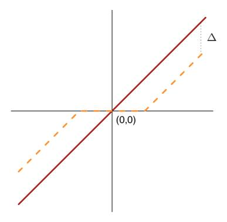

**FIGURE 18.2.** Soft thresholding function  $sign(x)(|x| - \Delta)_+$  is shown in orange, along with the 45° line in red.

This constant guards against large  $d_{kj}$  values that arise from expression values near zero. With constant within-class variance  $\sigma^2$ , the variance of the contrast  $\bar{x}_{kj} - \bar{x}_j$  in the numerator is  $m_k^2 \sigma^2$ , and hence the form of the standardization in the denominator. We shrink the  $d_{kj}$  toward zero using soft thresholding

$$d'_{kj} = sign(d_{kj})(|d_{kj}| - \Delta)_{+};$$
(18.5)

see Figure 18.2. Here  $\Delta$  is a parameter to be determined; we used 10-fold cross-validation in the example (see the top panel of Figure 18.4). Each  $d_{kj}$  is reduced by an amount  $\Delta$  in absolute value, and is set to zero if its value is less than zero. The soft-thresholding function is shown in Figure 18.2; the same thresholding is applied to wavelet coefficients in Section 5.9. An alternative is to use hard thresholding

$$d'_{kj} = d_{kj} \cdot I(|d_{kj}| \ge \Delta); \tag{18.6}$$

we prefer soft-thresholding, as it is a smoother operation and typically works better. The shrunken versions of  $\bar{x}_{kj}$  are then obtained by reversing the transformation in (18.4):

$$\bar{x}'_{kj} = \bar{x}_j + m_k(s_j + s_0)d'_{kj}. \tag{18.7}$$

We then use the shrunken centroids  $\bar{x}'_{kj}$  in place of the original  $\bar{x}_{kj}$  in the discriminant score (18.2). The estimator (18.7) can also be viewed as a lasso-style estimator for the class means (Exercise 18.2).

Notice that only the genes that have a nonzero  $d'_{kj}$  for at least one of the classes play a role in the classification rule, and hence the vast majority of genes can often be discarded. In this example, all but 43 genes were discarded, leaving a small interpretable set of genes that characterize each class. Figure 18.3 represents the genes in a heatmap.

Figure 18.4 (top panel) demonstrates the effectiveness of the shrinkage. With no shrinkage we make 5/20 errors on the test data, and several errors

on the training and CV data. The shrunken centroids achieve zero test errors for a fairly broad band of values for  $\Delta$ . The bottom panel of Figure 18.4 shows the four centroids for the SRBCT data (gray), relative to the overall centroid. The blue bars are shrunken versions of these centroids, obtained by soft-thresholding the gray bars, using  $\Delta=4.3$ . The discriminant scores (18.2) can be used to construct class probability estimates:

$$\hat{p}_k(x^*) = \frac{e^{\frac{1}{2}\delta_k(x^*)}}{\sum_{\ell=1}^K e^{\frac{1}{2}\delta_\ell(x^*)}}.$$
(18.8)

These can be used to rate the classifications, or to decide not to classify a particular sample at all.

Note that other forms of feature selection can be used in this setting, including hard thresholding. Fan and Fan (2008) show theoretically the importance of carrying out some kind of feature selection with diagonal linear discriminant analysis in high-dimensional problems.

# 18.3 Linear Classifiers with Quadratic Regularization

Ramaswamy et al. (2001) present a more difficult microarray classification problem, involving a training set of 144 patients with 14 different types of cancer, and a test set of 54 patients. Gene expression measurements were available for 16,063 genes.

Table 18.1 shows the prediction results from eight different classification methods. The data from each patient was first standardized to have mean 0 and variance 1; this seems to improve prediction accuracy overall this example, suggesting that the "shape" of each gene-expression profile is important, rather than the absolute expression levels. In each case, the
available for 16,063 genes.

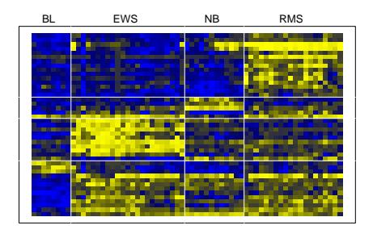

**FIGURE 18.3.** Heat-map of the chosen 43 genes. Within each of the horizontal partitions, we have ordered the genes by hierarchical clustering, and similarly for the samples within each vertical partition. Yellow represents over- and blue under-expression.

#### Number of Genes

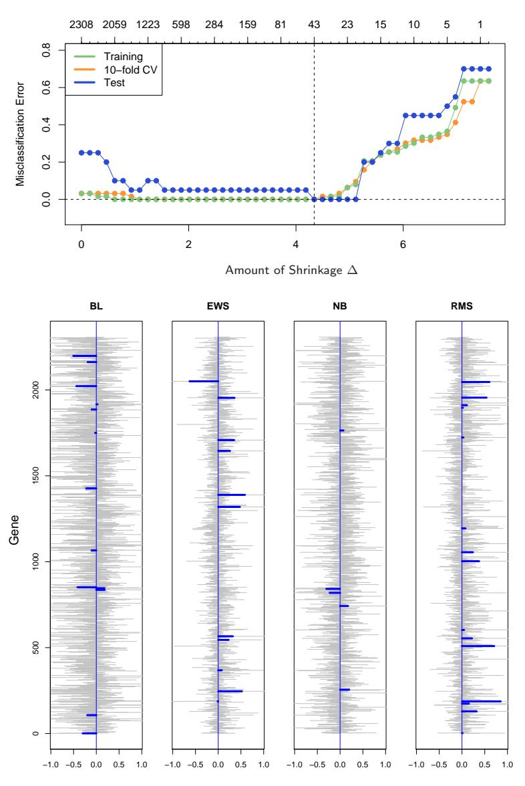

Centroids: Average Expression Centered at Overall Centroid

FIGURE 18.4. (Top): Error curves for the SRBCT data. Shown are the training, 10-fold cross-validation, and test misclassification errors as the threshold parameter $\Delta$ is varied. The value $\Delta$ = 4.34 is chosen by CV, resulting in a subset of 43 selected genes. (Bottom): Four centroids profiles dkj for the SRBCT data (gray), relative to the overall centroid. Each centroid has 2308 components, and we see considerable noise. The blue bars are shrunken versions d ′ kj of these centroids, obtained by soft-thresholding the gray bars, using $\Delta$ = 4.3.

**TABLE 18.1.** Prediction results for microarray data with 14 cancer classes. Method 1 is described in Section 18.2. Methods 2, 3 and 6 are discussed in Section 18.3, while 4, 7 and 8 are discussed in Section 18.4. Method 5 is described in Section 13.3. The elastic-net penalized multinomial does the best on the test data, but the standard error of each test-error estimate is about 3, so such comparisons are inconclusive.

| Methods                                   | CV errors (SE) Out of 144 | Test errors Out of 54 | Number of Genes Used |
|-------------------------------------------|------------------------------|--------------------------|-------------------------|
|                                           | 27 (7 2)                     |                          |                         |
| 1. Nearest shrunken centroids             | 35 (5.0)                     | 17                       | $6,\!520$               |
| 2. $L_2$ -penalized discriminant analysis | 25 (4.1)                     | 12                       | 16,063                  |
| 3. Support vector classifier              | 26(4.2)                      | 14                       | 16,063                  |
| 4. Lasso regression (one vs all)          | 30.7 (1.8)                   | 12.5                     | 1,429                   |
| 5. k-nearest neighbors                    | 41 (4.6)                     | 26                       | 16,063                  |
| 6. $L_2$ -penalized multinomial           | 26 (4.2)                     | 15                       | 16,063                  |
| 7. $L_1$ -penalized multinomial           | 17 (2.8)                     | 13                       | 269                     |
| 8. Elastic-net penalized multinomial      | 22 (3.7)                     | 11.8                     | 384                     |

regularization parameter has been chosen to minimize the cross-validation error, and the test error at that value of the parameter is shown. When more than one value of the regularization parameter yields the minimal cross-validation error, the average test error at these values is reported.

RDA (regularized discriminant analysis), regularized multinomial logistic regression, and the support vector machine are more complex methods that try to exploit multivariate information in the data. We describe each in turn, as well as a variety of regularization methods, including both  $L_1$  and  $L_2$  and some in between.

#### 18.3.1 Regularized Discriminant Analysis

Regularized discriminant analysis (RDA) is described in Section 4.3.1. Linear discriminant analysis involves the inversion of a  $p \times p$  within-covariance matrix. When  $p \gg N$ , this matrix can be huge, has rank at most N < p, and hence is singular. RDA overcomes the singularity issues by regularizing the within-covariance estimate  $\hat{\Sigma}$ . Here we use a version of RDA that shrinks  $\hat{\Sigma}$  towards its diagonal:

$$\hat{\mathbf{\Sigma}}(\gamma) = \gamma \hat{\mathbf{\Sigma}} + (1 - \gamma) \operatorname{diag}(\hat{\mathbf{\Sigma}}), \text{ with } \gamma \in [0, 1].$$
 (18.9)

Note that  $\gamma = 0$  corresponds to diagonal LDA, which is the "no shrinkage" version of nearest shrunken centroids. The form of shrinkage in (18.9) is

much like ridge regression (Section 3.4.1), which shrinks the total covariance matrix of the features towards a diagonal (scalar) matrix. In fact, viewing linear discriminant analysis as linear regression with optimal scoring of the categorical response (see (12.57) in Section 12.6), the equivalence becomes more precise.

The computational burden of inverting this large  $p \times p$  matrix is overcome using the methods discussed in Section 18.3.5. The value of  $\gamma$  was chosen by cross-validation in line 2 of Table 18.1; all values of  $\gamma \in (0.002, 0.550)$  gave the same CV and test error. Further development of RDA, including shrinkage of the centroids in addition to the covariance matrix, can be found in Guo et al. (2006).

#### 18.3.2 Logistic Regression with Quadratic Regularization

Logistic regression (Section 4.4) can be modified in a similar way, to deal with the  $p \gg N$  case. With K classes, we use a symmetric version of the multiclass logistic model (4.17) on page 119:

$$\Pr(G = k | X = x) = \frac{\exp(\beta_{k0} + x^T \beta_k)}{\sum_{\ell=1}^{K} \exp(\beta_{\ell0} + x^T \beta_\ell)}.$$
 (18.10)

This has K coefficient vectors of log-odds parameters  $\beta_1, \beta_2, \ldots, \beta_K$ . We regularize the fitting by maximizing the penalized log-likelihood

$$\max_{\{\beta_{0k}, \beta_k\}_1^K} \left[ \sum_{i=1}^N \log \Pr(g_i|x_i) - \frac{\lambda}{2} \sum_{k=1}^K ||\beta_k||_2^2 \right].$$
 (18.11)

This regularization automatically resolves the redundancy in the parametrization, and forces  $\sum_{k=1}^{K} \hat{\beta}_{kj} = 0$ ,  $j = 1, \ldots, p$  (Exercise 18.3). Note that the constant terms  $\beta_{k0}$  are not regularized (and so one should be set to zero). The resulting optimization problem is convex, and can be solved by a Newton algorithm or other numerical techniques. Details are given in Zhu and Hastie (2004). Friedman et al. (2010) provide software for computing the regularization path for the two- and multiclass logistic regression models. Table 18.1, line 6 reports the results for the multiclass logistic regression model, referred to there as "multinomial". It can be shown (Rosset et al., 2004a) that for separable data, as  $\lambda \to 0$ , the regularized (two-class) logistic regression estimate (renormalized) converges to the maximal margin classifier (Section 12.2). This gives an attractive alternative to the support-vector machine, discussed next, especially in the multiclass case.

#### 18.3.3 The Support Vector Classifier

The support vector classifier is described for the two-class case in Section 12.2. When p > N, it is especially attractive because in general the

classes are perfectly separable by a hyperplane unless there are identical feature vectors in different classes. Without any regularization the support vector classifier finds the separating hyperplane with the largest margin; that is, the hyperplane yielding the biggest gap between the classes in the training data. Somewhat surprisingly, when  $p\gg N$  the unregularized support vector classifier often works about as well as the best regularized version. Overfitting often does not seem to be a problem, partly because of the insensitivity of misclassification loss.

There are many different methods for generalizing the two-class support-vector classifier to K > 2 classes. In the "one versus one" (OVO) approach, we compute all  $\binom{K}{2}$  pairwise classifiers. For each test point, the predicted class is the one that wins the most pairwise contests. In the "one versus all" (OVA) approach, each class is compared to all of the others in K two-class comparisons. To classify a test point, we compute the confidences (signed distance from the hyperplane) for each of the K classifiers. The winner is the class with the highest confidence. Finally, Vapnik (1998) and Weston and Watkins (1999) suggested (somewhat complex) multiclass criteria which generalize the two-class criterion (12.7).

Tibshirani and Hastie (2007) propose the *margin tree* classifier, in which support-vector classifiers are used in a binary tree, much as in CART (Chapter 9). The classes are organized in a hierarchical manner, which can be useful for classifying patients into different cancer types, for example.

Line 3 of Table 18.1 shows the results for the support vector classifier using the OVA method; Ramaswamy et al. (2001) reported (and we confirmed) that this approach worked best for this problem. The errors are very similar to those in line 6, as we might expect from the comments at the end of the previous section. The error rates are insensitive to the choice of C [the regularization parameter in (12.8) on page 420], for values of C>0.001. Since p>N, the support vector hyperplane can perfectly separate the training data by setting  $C=\infty$ .

#### 18.3.4 Feature Selection

Feature selection is an important scientific requirement for a classifier when p is large. Neither discriminant analysis, logistic regression, nor the support-vector classifier perform feature selection automatically, because all use quadratic regularization. All features have nonzero weights in both models. Ad-hoc methods for feature selection have been proposed, for example, removing genes with small coefficients, and refitting the classifier. This is done in a backward stepwise manner, starting with the smallest weights and moving on to larger weights. This is known as recursive feature elimination (Guyon et al., 2002). It was not successful in this example; Ramaswamy et al. (2001) report, for example, that the accuracy of the support-vector classifier starts to degrade as the number of genes is reduced from the full

set of 16,063. This is rather remarkable, as the number of training samples is only 144. We do not have an explanation for this behavior.

All three methods discussed in this section (RDA, LR and SVM) can be modified to fit nonlinear decision boundaries using kernels. Usually the motivation for such an approach is to increase the model complexity. With  $p\gg N$  the models are already sufficiently complex and overfitting is always a danger. Yet despite the high dimensionality, radial kernels (Section 12.3.3) sometimes deliver superior results in these high dimensional problems. The radial kernel tends to dampen inner products between points far away from each other, which in turn leads to robustness to outliers. This occurs often in high dimensions, and may explain the positive results. We tried a radial kernel with the SVM in Table 18.1, but in this case the performance was inferior.

#### 18.3.5 Computational Shortcuts When $p \gg N$

The computational techniques discussed in this section apply to any method that fits a linear model with quadratic regularization on the coefficients. That includes all the methods discussed in this section, and many more. When p > N, the computations can be carried out in an N-dimensional space, rather than p, via the singular value decomposition introduced in Section 14.5. Here is the geometric intuition: just like two points in three-dimensional space always lie on a line, N points in p-dimensional space lie in an (N-1)-dimensional affine subspace.

Given the  $N \times p$  data matrix **X**, let

$$\mathbf{X} = \mathbf{U}\mathbf{D}\mathbf{V}^T \tag{18.12}$$

$$= \mathbf{R}\mathbf{V}^T \tag{18.13}$$

be the singular-value decomposition (SVD) of  $\mathbf{X}$ ; that is,  $\mathbf{V}$  is  $p \times N$  with orthonormal columns,  $\mathbf{U}$  is  $N \times N$  orthogonal, and  $\mathbf{D}$  a diagonal matrix with elements  $d_1 \geq d_2 \geq d_N \geq 0$ . The matrix  $\mathbf{R}$  is  $N \times N$ , with rows  $r_i^T$ .

As a simple example, let's first consider the estimates from a ridge regression:

$$\hat{\beta} = (\mathbf{X}^T \mathbf{X} + \lambda \mathbf{I})^{-1} \mathbf{X}^T \mathbf{y}. \tag{18.14}$$

Replacing X by  $RV^T$  and after some further manipulations, this can be shown to equal

$$\hat{\beta} = \mathbf{V}(\mathbf{R}^T \mathbf{R} + \lambda \mathbf{I})^{-1} \mathbf{R}^T \mathbf{y}$$
 (18.15)

(Exercise 18.4). Thus  $\hat{\beta} = \mathbf{V}\hat{\theta}$ , where  $\hat{\theta}$  is the ridge-regression estimate using the N observations  $(r_i, y_i)$ , i = 1, 2, ..., N. In other words, we can simply reduce the data matrix from  $\mathbf{X}$  to  $\mathbf{R}$ , and work with the rows of  $\mathbf{R}$ . This trick reduces the computational cost from  $O(p^3)$  to  $O(pN^2)$  when p > N.

These results can be generalized to all models that are linear in the parameters and have quadratic penalties. Consider any supervised learning problem where we use a linear function  $f(X) = \beta_0 + X^T \beta$  to model a parameter in the conditional distribution of Y|X. We fit the parameters  $\beta$  by minimizing some loss function  $\sum_{i=1}^{N} L(y_i, f(x_i))$  over the data with a quadratic penalty on  $\beta$ . Logistic regression is a useful example to have in mind. Then we have the following simple theorem:

Let  $f^*(r_i) = \theta_0 + r_i^T \theta$  with  $r_i$  defined in (18.13), and consider the pair of optimization problems:

$$(\hat{\beta}_0, \hat{\beta}) = \arg\min_{\beta_0, \beta \in \mathbb{R}^p} \sum_{i=1}^N L(y_i, \beta_0 + x_i^T \beta) + \lambda \beta^T \beta; \quad (18.16)$$

$$(\hat{\theta}_0, \hat{\theta}) = \arg \min_{\theta_0, \theta \in \mathbb{R}^N} \sum_{i=1}^N L(y_i, \theta_0 + r_i^T \theta) + \lambda \theta^T \theta.$$
 (18.17)

Then the  $\hat{\beta}_0 = \hat{\theta}_0$ , and  $\hat{\beta} = \mathbf{V}\hat{\theta}$ .

The theorem says that we can simply replace the p vectors  $x_i$  by the N-vectors  $r_i$ , and perform our penalized fit as before, but with far fewer predictors. The N-vector solution  $\hat{\theta}$  is then transformed back to the p-vector solution via a simple matrix multiplication. This result is part of the statistics folklore, and deserves to be known more widely—see Hastie and Tibshirani (2004) for further details.

Geometrically, we are rotating the features to a coordinate system in which all but the first N coordinates are zero. Such rotations are allowed since the quadratic penalty is invariant under rotations, and linear models are equivariant.

This result can be applied to many of the learning methods discussed in this chapter, such as regularized (multiclass) logistic regression, linear discriminant analysis (Exercise 18.6), and support vector machines. It also applies to neural networks with quadratic regularization (Section 11.5.2). Note, however, that it does not apply to methods such as the lasso, which uses nonquadratic  $(L_1)$  penalties on the coefficients.

Typically we use cross-validation to select the parameter  $\lambda$ . It can be seen (Exercise 18.12) that we only need to construct  $\mathbf{R}$  once, on the original data, and use it as the data for each of the CV folds.

The support vector "kernel trick" of Section 12.3.7 exploits the same reduction used in this section, in a slightly different context. Suppose we have at our disposal the  $N \times N$  gram (inner-product) matrix  $\mathbf{K} = \mathbf{X}\mathbf{X}^T$ . From (18.12) we have  $\mathbf{K} = \mathbf{U}\mathbf{D}^2\mathbf{U}^T$ , and so  $\mathbf{K}$  captures the same information as  $\mathbf{R}$ . Exercise 18.13 shows how we can exploit the ideas in this section to fit a ridged logistic regression with  $\mathbf{K}$  using its SVD.

# 18.4 Linear Classifiers with $L_1$ Regularization

The methods of Section 18.3 use an  $L_2$  penalty to regularize their parameters, just as in ridge regression. All of the estimated coefficients are nonzero, and hence no feature selection is performed. In this section we discuss methods that use  $L_1$  penalties instead, and hence provide automatic feature selection.

Recall the lasso of Section 3.4.2,

$$\min_{\beta} \frac{1}{2} \sum_{i=1}^{N} \left( y_i - \beta_0 - \sum_{j=1}^{p} x_{ij} \beta_j \right)^2 + \lambda \sum_{j=1}^{p} |\beta_j|, \tag{18.18}$$

which we have written in the Lagrange form (3.52). As discussed there, the use of the  $L_1$  penalty causes a subset of the solution coefficients  $\hat{\beta}_j$  to be exactly zero, for a sufficiently large value of the tuning parameter  $\lambda$ .

In Section 3.8.1 we discussed the LARS algorithm, an efficient procedure for computing the lasso solution for all  $\lambda$ . When p>N (as in this chapter), as  $\lambda$  approaches zero, the lasso fits the training data exactly. In fact, by convex duality one can show that when p>N the number of non-zero coefficients is at most N for all values of  $\lambda$  (Rosset and Zhu, 2007, for example). Thus the lasso provides a (severe) form of feature selection.

Lasso regression can be applied to a two-class classification problem by coding the outcome  $\pm 1$ , and applying a cutoff (usually 0) to the predictions. For more than two classes, there are many possible approaches, including the OVA and OVO methods discussed in Section 18.3.3. We tried the OVA-approach on the cancer data in Section 18.3. The results are shown in line (4) of Table 18.1. Its performance is among the best.

A more natural approach for classification problems is to use the lasso penalty to regularize logistic regression. Several implementations have been proposed in the literature, including path algorithms similar to LARS (Park and Hastie, 2007). Because the paths are piecewise smooth but nonlinear, exact methods are slower than the LARS algorithm, and are less feasible when p is large.

Friedman et al. (2010) provide very fast algorithms for fitting  $L_1$ -penalized logistic and multinomial regression models. They use the symmetric multinomial logistic regression model as in (18.10) in Section 18.3.2, and maximize the penalized log-likelihood

$$\max_{\{\beta_{0k}, \beta_k \in \mathbb{R}^p\}_1^K} \left[ \sum_{i=1}^N \log \Pr(g_i|x_i) - \lambda \sum_{k=1}^K \sum_{j=1}^p |\beta_{kj}| \right];$$
 (18.19)

compare with (18.11). Their algorithm computes the exact solution at a pre-chosen sequence of values for  $\lambda$  by cyclical coordinate descent (Section 3.8.6), and exploits the fact that solutions are sparse when  $p \gg N$ ,

as well as the fact that solutions for neighboring values of $\lambda$ tend to be very similar. This method was used in line (7) of Table 18.1, with the overall tuning parameter $\lambda$ chosen by cross-validation. The performance was similar to that of the best methods, except here the automatic feature selection chose 269 genes altogether. A similar approach is used in Genkin et al. (2007); although they present their model from a Bayesian point of view, they in fact compute the posterior mode, which solves the penalized maximum-likelihood problem.

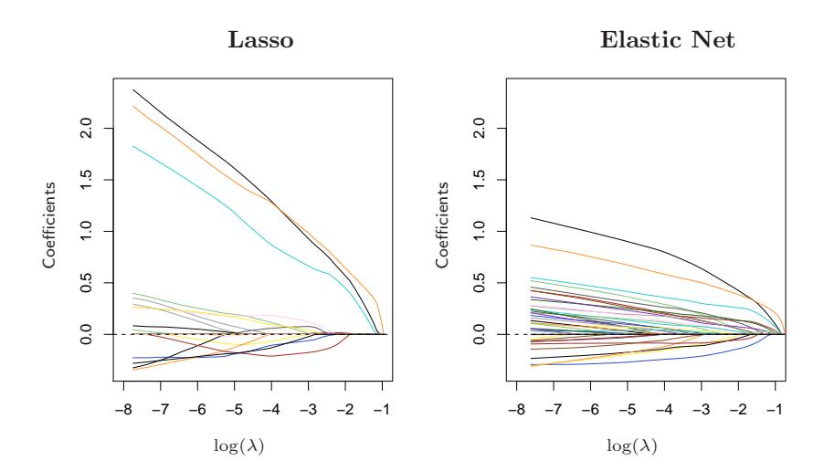

FIGURE 18.5. Regularized logistic regression paths for the leukemia data. The left panel is the lasso path, the right panel the elastic-net path with $\alpha$ = 0.8. At the ends of the path (extreme left), there are 19 nonzero coefficients for the lasso, and 39 for the elastic net. The averaging effect of the elastic net results in more non-zero coefficients than the lasso, but with smaller magnitudes.

In genomic applications, there are often strong correlations among the variables; genes tend to operate in molecular pathways. The lasso penalty is somewhat indifferent to the choice among a set of strong but correlated variables (Exercise 3.28). The ridge penalty, on the other hand, tends to shrink the coefficients of correlated variables toward each other (Exercise 3.29 on page 99). The elastic net penalty (Zou and Hastie, 2005) is a compromise, and has the form

$$\sum_{j=1}^{p} (\alpha |\beta_j| + (1 - \alpha)\beta_j^2).$$
 (18.20)

The second term encourages highly correlated features to be averaged, while the first term encourages a sparse solution in the coefficients of these averaged features. The elastic net penalty can be used with any linear model, in particular for regression or classification.

Hence the multinomial problem above with elastic-net penalty becomes

$$\max_{\{\beta_{0k},\beta_{k}\in\mathbb{R}^{p}\}_{1}^{K}} \left[ \sum_{i=1}^{N} \log \Pr(g_{i}|x_{i}) - \lambda \sum_{k=1}^{K} \sum_{j=1}^{p} \left(\alpha|\beta_{kj}| + (1-\alpha)\beta_{kj}^{2}\right) \right].$$
(18.21)

The parameter  $\alpha$  determines the mix of the penalties, and is often prechosen on qualitative grounds. The elastic net can yield more that N nonzero coefficients when p>N, a potential advantage over the lasso. Line (8) in Table 18.1 uses this model, with  $\alpha$  and  $\lambda$  chosen by cross-validation. We used a sequence of 20 values of  $\alpha$  between 0.05 and 1.0, and a 100 values of  $\lambda$  uniform on the log scale covering the entire range. Values of  $\alpha \in [0.75, 0.80]$  gave the minimum CV error, with values of  $\lambda < 0.001$  for all tied solutions. Although it has the lowest test error among all methods, the margin is small and not significant. Interestingly, when CV is performed separately for each value of  $\alpha$ , a minimum test error of 8.8 is achieved at  $\alpha = 0.10$ , but this is not the value chosen in the two-dimensional CV.

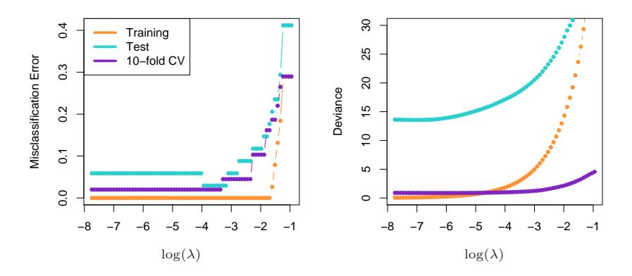

**FIGURE 18.6.** Training, test, and 10-fold cross validation curves for lasso logistic regression on the leukemia data. The left panel shows misclassification errors, the right panel shows deviance.

Figure 18.5 shows the lasso and elastic-net coefficient paths on the two-class leukemia data (Golub et al., 1999). There are 7129 gene-expression measurements on 38 samples, 27 of them in class ALL (acute lymphocytic leukemia), and 11 in class AML (acute myelogenous leukemia). There is also a test set with 34 samples (20, 14). Since the data are linearly separable, the solution is undefined at  $\lambda=0$  (Exercise 18.11), and degrades for very small values of  $\lambda$ . Hence the paths have been truncated as the fitted probabilities approach 0 and 1. There are 19 non-zero coefficients in the left plot, and 39 in the right. Figure 18.6 (left panel) shows the misclas-

sification errors for the lasso logistic regression on the training and test data, as well as for 10-fold cross-validation on the training data. The right panel uses binomial deviance to measure errors, and is much smoother. The small sample sizes lead to considerable sampling variance in these curves, even though individual curves are relatively smooth (see, for example, Figure 7.1 on page 220). Both of these plots suggest that the limiting solution $\lambda$ ↓ 0 is adequate, leading to 3/34 misclassifications in the test set. The corresponding figures for the elastic net are qualitatively similar and are not shown.

For p ≫ N, the limiting coefficients diverge for all regularized logistic regression models, so in practical software implementations a minimum value for $\lambda$ > 0 is either explicitly or implicitly set. However, renormalized versions of the coefficients converge, and these limiting solutions can be thought of as interesting alternatives to the linear optimal separating hyperplane (SVM). With $\alpha$ = 0 the limiting solution coincides with the SVM (see end of Section 18.3.2), but all the 7129 genes are selected. With $\alpha$ = 1, the limiting solution coincides with an L$^{1}$ separating hyperplane (Rosset et al., 2004a), and includes at most 38 genes. As $\alpha$ decreases from 1, the elastic-net solutions include more genes in the separating hyperplane.

#### 18.4.1 Application of Lasso to Protein Mass Spectroscopy

Protein mass spectrometry has become a popular technology for analyzing the proteins in blood, and can be used to diagnose a disease or understand the processes underlying it.

For each blood serum sample i, we observe the intensity xij for many time of flight values t$^{j}$ . This intensity is related to the number of particles observed to take approximately t$^{j}$ time to pass from the emitter to the detector during a cycle of operation of the machine. The time of flight has a known relationship to the mass over charge ratio (m/z) of the constituent proteins in the blood. Hence the identification of a peak in the spectrum at a certain t$^{j}$ tells us that there is a protein with a corresponding mass and charge. The identity of this protein can then be determined by other means.

Figure 18.7 shows an example taken from Adam et al. (2003). It shows the average spectra for healthy patients and those with prostate cancer. There are 16,898 m/z sites in total, ranging in value from 2000 to 40,000. The full dataset consists of 157 healthy patients and 167 with cancer, and the goal is to find m/z sites that discriminate between the two groups. This is an example of functional data; the predictors can be viewed as a function of m/z. There has been much interest in this problem in the past few years; see e.g. Petricoin et al. (2002).

The data were first standardized (baseline subtraction and normalization), and we restricted attention to m/z values between 2000 and 40,000 (spectra outside of this range were not of interest). We then applied near-

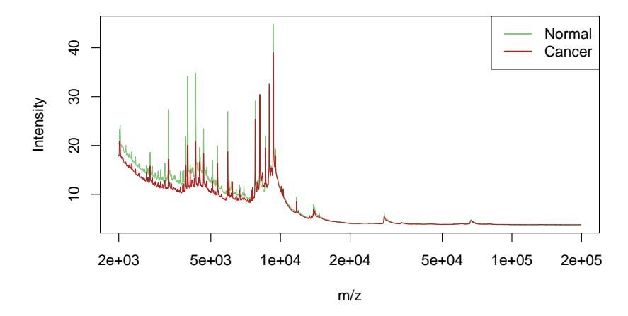

FIGURE 18.7. Protein mass spectrometry data: average profiles from normal and prostate cancer patients.

est shrunken centroids and lasso regression to the data, with the results for both methods shown in Table 18.2.

By fitting harder to the data, the lasso achieves a considerably lower test error rate. However, it may not provide a scientifically useful solution. Ideally, protein mass spectrometry resolves a biological sample into its constituent proteins, and these should appear as peaks in the spectra. The lasso doesn't treat peaks in any special way, so not surprisingly only some of the non-zero lasso weights were situated near peaks in the spectra. Furthermore, the same protein may yield a peak at slightly different m/z values in different spectra. In order to identify common peaks, some kind of m/z warping is needed from sample to sample.

To address this, we applied a standard peak-extraction algorithm to each spectrum, yielding a total of 5178 peaks in the 217 training spectra. Our idea was to pool the collection of peaks from all patients, and hence construct a set of common peaks. For this purpose, we applied hierarchical clustering to the positions of these peaks along the log m/z axis. We cut the resulting dendrogram horizontally at height log(0.005)$^{3}$ , and computed averages of the peak positions in each resulting cluster. This process yielded 728 common clusters and their corresponding peak centers.

Given these 728 common peaks, we determined which of these were present in each individual spectrum, and if present, the height of the peak. A peak height of zero was assigned if that peak was not found. This produced a 217 $\times$ 728 matrix of peak heights as features, which was used in a lasso regression. We scored the test spectra for the same 728 peaks.

$^{3}$Use of the value 0.005 means that peaks with positions less than 0.5% apart are considered the same peak, a fairly common assumption.

| Method                        | Test Errors/108 | Number of Sites |
|-------------------------------|-----------------|-----------------|
| 1. Nearest shrunken centroids | 34              | 459             |
| 2. Lasso                      | 22              | 113             |
| 3. Lasso on peaks             | 28              | 35              |

TABLE 18.2. Results for the prostate data example. The standard deviation for the test errors is about 4.5.

The prediction results for this application of the lasso to the peaks are shown in the last line of Table 18.2: it does fairly well, but not as well as the lasso on the raw spectra. However, the fitted model may be more useful to the biologist as it yields 35 peak positions for further study. On the other hand, the results suggest that there may be useful discriminatory information between the peaks of the spectra, and the positions of the lasso sites from line (2) of the table also deserve further examination.

### 18.4.2 The Fused Lasso for Functional Data

In the previous example, the features had a natural order, determined by the mass-to-charge ratio m/z. More generally, we may have functional features xi(t) that are ordered according to some index variable t. We have already discussed several approaches for exploiting such structure.

We can represent xi(t) by their coefficients in a basis of functions in t, such as splines, wavelets or Fourier bases, and then apply a regression using these coefficients as predictors. Equivalently, one can instead represent the coefficients of the original features in these bases. These approaches are described in Section 5.3.

In the classification setting, we discuss the analogous approach of penalized discriminant analysis in Section 12.6. This uses a penalty that explicitly controls the resulting smoothness of the coefficient vector.

The above methods tend to smooth the coefficients uniformly. Here we present a more adaptive strategy that modifies the lasso penalty to take into account the ordering of the features. The fused lasso (Tibshirani et al., 2005) solves

$$\min_{\beta \in \mathbb{R}^p} \left\{ \sum_{i=1}^N (y_i - \beta_0 - \sum_{j=1}^p x_{ij} \beta_j)^2 + \lambda_1 \sum_{j=1}^p |\beta_j| + \lambda_2 \sum_{j=1}^{p-1} |\beta_{j+1} - \beta_j| \right\}.$$
 (18.22)

This criterion is strictly convex in $\beta$, so a unique solution exists. The first penalty encourages the solution to be sparse, while the second encourages it to be smooth in the index j.

The difference penalty in (18.22) assumes an uniformly spaced index j. If instead the underlying index variable t has nonuniform values t$^{j}$ , a natural generalization of (18.22) would be based on divided differences

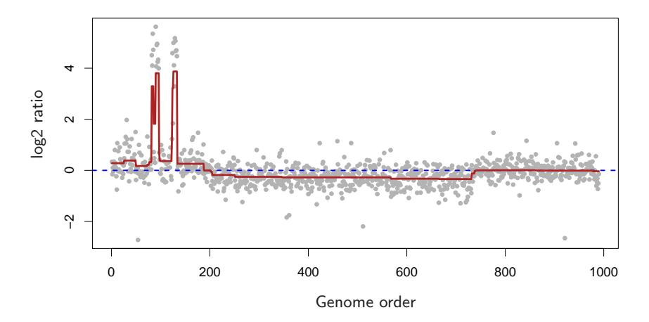

**FIGURE 18.8.** Fused lasso applied to CGH data. Each point represents the copy-number of a gene in a tumor sample, relative to that of a control (on the log base-2 scale).

$$\lambda_2 \sum_{j=1}^{p-1} \frac{|\beta_{j+1} - \beta_j|}{|t_{j+1} - t_j|}.$$
 (18.23)

This amounts to having a penalty modifier for each of the terms in the series.

A particularly useful special case arises when the predictor matrix  $\mathbf{X} = \mathbf{I}_N$ , the  $N \times N$  identity matrix. This is a special case of the fused lasso, used to approximate a sequence  $\{y_i\}_1^N$ . The fused lasso signal approximator solves

$$\min_{\beta \in \mathbb{R}^N} \left\{ \sum_{i=1}^N (y_i - \beta_0 - \beta_i)^2 + \lambda_1 \sum_{i=1}^N |\beta_i| + \lambda_2 \sum_{i=1}^{N-1} |\beta_{i+1} - \beta_i| \right\}.$$
 (18.24)

Figure 18.8 shows an example taken from Tibshirani and Wang (2007). The data in the panel come from a Comparative Genomic Hybridization (CGH) array, measuring the approximate log (base-two) ratio of the number of copies of each gene in a tumor sample, as compared to a normal sample. The horizontal axis represents the chromosomal location of each gene. The idea is that in cancer cells, genes are often amplified (duplicated) or deleted, and it is of interest to detect these events. Furthermore, these events tend to occur in contiguous regions. The smoothed signal estimate from the fused lasso signal approximator is shown in dark red (with appropriately chosen values for  $\lambda_1$  and  $\lambda_2$ ). The significantly nonzero regions can be used to detect locations of gains and losses of genes in the tumor.

There is also a two-dimensional version of the fused lasso, in which the parameters are laid out in a grid of pixels, and a penalty is applied to the first differences to the left, right, above and below the target pixel. This can be useful for denoising or classifying images. Friedman et al. (2007) develop fast generalized coordinate descent algorithms for the one- and two-dimensional fused lasso.

# 18.5 Classification When Features are Unavailable

In some applications the objects under study are more abstract in nature, and it is not obvious how to define a feature vector. As long as we can fill in an N $\times$N proximity matrix of similarities between pairs of objects in our database, it turns out we can put to use many of the classifiers in our arsenal by interpreting the proximities as inner-products. Protein structures fall into this category, and we explore an example in Section 18.5.1 below.

In other applications, such as document classification, feature vectors are available but can be extremely high-dimensional. Here we may not wish to compute with such high-dimensional data, but rather store the innerproducts between pairs of documents. Often these inner-products can be approximated by sampling techniques.

Pairwise distances serve a similar purpose, because they can be turned into centered inner-products. Proximity matrices are discussed in more detail in Chapter 14.

# 18.5.1 Example: String Kernels and Protein Classification

An important problem in computational biology is to classify proteins into functional and structural classes based on their sequence similarities. Protein molecules are strings of amino acids, differing in both length and composition. In the example we consider, the lengths vary between 75–160 amino-acid molecules, each of which can be one of 20 different types, labeled using letters. Here are two examples, of length 110 and 153, respectively:

IPTSALVKETLALLSTHRTLLIANETLRIPVPVHKNHQLCTEEIFQGIGTLESQTVQGGTV ERLFKNLSLIKKYIDGQKKKCGEERRRVNQFLDYLQEFLGVMNTEWI

PHRRDLCSRSIWLARKIRSDLTALTESYVKHQGLWSELTEAERLQENLQAYRTFHVLLA RLLEDQQVHFTPTEGDFHQAIHTLLLQVAAFAYQIEELMILLEYKIPRNEADGMLFEKK LWGLKVLQELSQWTVRSIHDLRFISSHQTGIP

There have been many proposals for measuring the similarity between a pair of protein molecules. Here we focus on a measure based on the count of matching substrings (Leslie et al., 2004), such as the LQE above.

To construct our features, we count the number of times that a given sequence of length m occurs in our string, and we compute this number for all possible sequences of length m. Formally, for a string x, we define a feature map

$$\Phi_m(x) = \{\phi_a(x)\}_{a \in \mathcal{A}_m} \tag{18.25}$$

where A$^{m}$ is the set of subsequences of length m, and φa(x) is the number of times that "a" occurs in our string x. Using this, we define the inner product

$$K_m(x_1, x_2) = \langle \Phi_m(x_1), \Phi_m(x_2) \rangle, \qquad (18.26)$$

which measures the similarity between the two strings x1, x2. This can be used to drive, for example, a support vector classifier for classifying strings into different protein classes.

Now the number of possible sequences $^{a}$ is |Am$^{|}$ = 20m, which can be very large for moderate m, and the vast majority of the subsequences do not match the strings in our training set. It turns out that we can compute the N $\times$ N inner-product matrix or string kernel K$^{m}$ (18.26) efficiently using tree-structures, without actually computing the individual vectors. This methodology, and the data to follow, come from Leslie et al. (2004).$^{4}$

The data consist of 1708 proteins in two classes— negative (1663) and positive (45). The two examples above, which we will call "x1" and "x2", are from this set. We have marked the occurrences of subsequence LQE, which appears in both proteins. There are 20$^{3}$ possible subsequences, so $\Phi$3(x) will be a vector of length 8000. For this example φLQE(x1) = 1 and φLQE(x2) = 2.

Using software from Leslie et al. (2004), we computed the string kernel for m = 4, which was then used in a support vector classifier to find the maximal margin solution in this 20$^{4}$ = 160, 000-dimensional feature space. We used 10-fold cross-validation to compute the SVM predictions on all of the training data. The orange curve in Figure 18.9 shows the cross-validated ROC curve for the support vector classifier, computed by varying the cutpoint on the real-valued predictions from the cross-validated support vector classifier. The area under the curve is 0.84. Leslie et al. (2004) show that the string kernel method is competitive with, but perhaps not as accurate as, more specialized methods for protein string matching.

Many other classifiers can be computed using only the information in the kernel matrix; some details are given in the next section. The results for the nearest centroid classifier (green), and distance-weighted one-nearest neighbors (blue) are shown in Figure 18.9. Their performance is similar to that of the support vector classifier.

$^{4}$We thank Christina Leslie for her help and for providing the data, which is available on our book website.

#### **ROC Curves for String Kernel**

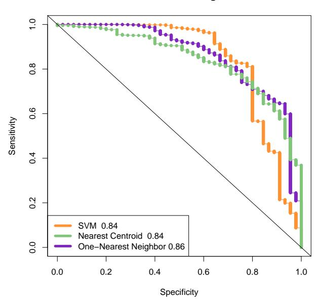

FIGURE 18.9. Cross-validated ROC curves for protein example using the string kernel. The numbers next to each method in the legend give the area under the curve, an overall measure of accuracy. The SVM achieves better sensitivities than the other two, which achieve better specificities.

# 18.5.2 Classification and Other Models Using Inner-Product Kernels and Pairwise Distances

There are a number of other classifiers, besides the support-vector machine, that can be implemented using only inner-product matrices. This also implies they can be "kernelized" like the SVM.

An obvious example is nearest-neighbor classification, since we can transform pairwise inner-products to pairwise distances:

$$||x_i - x_{i'}||^2 = \langle x_i, x_i \rangle + \langle x_{i'}, x_{i'} \rangle - 2\langle x_i, x_{i'} \rangle.$$
 (18.27)

A variation of 1-NN classification is used in Figure 18.9, which produces a continuous discriminant score needed to construct a ROC curve. This distance-weighted 1-NN makes use of the distance of a test points to the closest member of each class; see Exercise 18.14.

Nearest-centroid classification follows easily as well. For training pairs (x$^{i}$ , gi), i = 1, . . . , N, a test point x0, and class centroids ¯xk, k = 1, . . . , K we can write

$$||x_0 - \bar{x}_k||^2 = \langle x_0, x_0 \rangle - \frac{2}{N_k} \sum_{g_i = k} \langle x_0, x_i \rangle + \frac{1}{N_k^2} \sum_{g_i = k} \sum_{g_{i'} = k} \langle x_i, x_{i'} \rangle, \quad (18.28)$$

Hence we can compute the distance of the test point to each of the centroids, and perform nearest centroid classification. This also implies that methods like K-means clustering can also be implemented, using only the inner products of the data points.

Logistic and multinomial regression with quadratic regularization can also be implemented with inner-product kernels; see Section 12.3.3 and Exercise 18.13. Exercise 12.10 derives linear discriminant analysis using an inner-product kernel.

Principal components can be computed using inner-product kernels as well; since this is frequently useful, we give some details. Suppose first that we have a centered data matrix  $\mathbf{X}$ , and let  $\mathbf{X} = \mathbf{U}\mathbf{D}\mathbf{V}^T$  be its SVD (18.12). Then  $\mathbf{Z} = \mathbf{U}\mathbf{D}$  is the matrix of principal component variables (see Section 14.5.1). But if  $\mathbf{K} = \mathbf{X}\mathbf{X}^T$ , then it follows that  $\mathbf{K} = \mathbf{U}\mathbf{D}^2\mathbf{U}^T$ , and hence we can compute  $\mathbf{Z}$  from the eigen decomposition of  $\mathbf{K}$ . If  $\mathbf{X}$  is not centered, then we can center it using  $\tilde{\mathbf{X}} = (\mathbf{I} - \mathbf{M})\mathbf{X}$ , where  $\mathbf{M} = \frac{1}{N}\mathbf{1}\mathbf{1}^T$  is the mean operator. Thus we compute the eigenvectors of the double-centered kernel  $(\mathbf{I} - \mathbf{M})\mathbf{K}(\mathbf{I} - \mathbf{M})$  for the principal components from an uncentered inner-product matrix. Exercise 18.15 explores this further, and Section 14.5.4 discusses in more detail kernel PCA for general kernels, such as the radial kernel used in SVMs.

If instead we had available only the pairwise (squared) Euclidean distances between observations,

$$\Delta_{ii'}^2 = ||x_i - x_{i'}||^2, \tag{18.29}$$

it turns out we can do all of the above as well. The trick is to convert the pairwise distances to centered inner-products, and then proceed as before. We write

$$\Delta_{ii'}^2 = ||x_i - \bar{x}||^2 + ||x_{i'} - \bar{x}||^2 - 2\langle x_i - \bar{x}, x_{i'} - \bar{x}\rangle. \tag{18.30}$$

Defining  $\mathbf{B} = \{-\Delta_{ii'}^2/2\}$ , we double center  $\mathbf{B}$ :

$$\tilde{\mathbf{K}} = (\mathbf{I} - \mathbf{M})\mathbf{B}(\mathbf{I} - \mathbf{M}); \tag{18.31}$$

it is easy to check that  $\tilde{K}_{ii'} = \langle x_i - \bar{x}, x_{i'} - \bar{x} \rangle$ , the centered inner-product matrix.

Distances and inner-products also allow us to compute the medoid in each class—the observation with smallest average distance to other observations in that class. This can be used for classification (closest medoids), as well as to drive k-medoids clustering (Section 14.3.10). With abstract data objects like proteins, medoids have a practical advantage over means. The medoid is one of the training examples, and can be displayed. We tried closest medoids in the example in the next section (see Table 18.3), and its performance is disappointing.

It is useful to consider what we *cannot* do with inner-product kernels and distances:

TABLE 18.3. Cross-validated error rates for the abstracts example. The nearest shrunken centroids ended up using no-shrinkage, but does use a word-by-word standardization (section 18.2). This standardization gives it a distinct advantage over the other methods.

|    | Method                     | CV Error (SE) |
|----|----------------------------|---------------|
| 1. | Nearest shrunken centroids | 0.17 (0.05)   |
| 2. | SVM                        | 0.23 (0.06)   |
| 3. | Nearest medoids            | 0.65 (0.07)   |
| 4. | 1-NN                       | 0.44 (0.07)   |
| 5. | Nearest centroids          | 0.29 (0.07)   |

- We cannot standardize the variables; standardization significantly improves performance in the example in the next section.
- We cannot assess directly the contributions of individual variables. In particular, we cannot perform individual t-tests, fit the nearest shrunken centroids model, or fit any model that uses the lasso penalty.
- We cannot separate the good variables from the noise: all variables get an equal say. If, as is often the case, the ratio of relevant to irrelevant variables is small, methods that use kernels are not likely to work as well as methods that do feature selection.

#### 18.5.3 Example: Abstracts Classification

This somewhat whimsical example serves to illustrate a limitation of kernel approaches. We collected the abstracts from 48 papers, 16 each from Bradley Efron (BE), Trevor Hastie and Rob Tibshirani (HT) (frequent coauthors), and Jerome Friedman (JF). We extracted all unique words from these abstracts, and defined features xij to be the number of times word j appears in abstract i. This is the so-called bag of words representation. Quotations, parentheses and special characters were first removed from the abstracts, and all characters were converted to lower case. We also removed the word "we", which could unfairly discriminate HT abstracts from the others.

There were 4492 total words, of which p = 1310 were unique. We sought to classify the documents into BE, HT or JF on the basis of the features xij . Although it is artificial, this example allows us to assess the possible degradation in performance if information specific to the raw features is not used.

We first applied the nearest shrunken centroid classifier to the data, using 10-fold cross-validation. It essentially chose no shrinkage, and so used all the features; see the first line of Table 18.3. The error rate is 17%; the number of features can be reduced to about 500 without much loss in accuracy. Note that the nearest shrunken classifier requires the raw feature matrix X in order to standardize the features individually. Figure 18.10 shows the

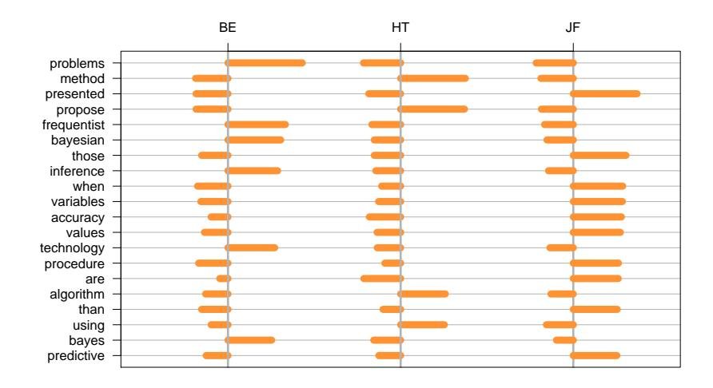

FIGURE 18.10. Abstracts example: top 20 scores from nearest shrunken centroids. Each score is the standardized difference in frequency for the word in the given class (BE, HT or JF) versus all classes. Thus a positive score (to the right of the vertical grey zero lines) indicates a higher frequency in that class; a negative score indicates a lower relative frequency.

top 20 discriminating words, with a positive score indicating that a word appears more in that class than in the other classes.

Some of these terms make sense: for example "frequentist" and "Bayesian" reflect Efron's greater emphasis on statistical inference. However, many others are surprising, and reflect personal writing styles: for example, Friedman's use of "presented" and HT's use of "propose".

We then applied the support vector classifier with linear kernel and no regularization, using the "all pairs" (ovo) method to handle the three classes (regularization of the SVM did not improve its performance). The result is shown in Table 18.3. It does somewhat worse than the nearest shrunken centroid classifier.

As mentioned, the first line of Table 18.3 represents nearest shrunken centroids (with no shrinkage). Denote by s$^{j}$ the pooled within-class standard deviation for feature j, and s$^{0}$ the median of the s$^{j}$ values. Then line (1) also corresponds to nearest centroid classification, after first standardizing each feature by s$^{j}$ + s$^{0}$ [recall (18.4) on page 652].

Line (3) shows that the performance of nearest medoids is very poor, something which surprised us. It is perhaps due to the small sample sizes and high dimensions, with medoids having much higher variance than means. The performance of the one-nearest neighbor classifier is also poor.

The performance of the nearest centroid classifier is also shown in Table 18.3 in line (5): it is better than nearest medoids, but worse than that of nearest shrunken centroids, even with no shrinkage. The difference seems to be the standardization of each feature that is done in nearest shrunken centroids. This standardization is important here, and requires access to the individual feature values. Nearest centroids uses a spherical metric, and relies on the fact that the features are in similar units. The support vector machine estimates a linear combination of the features and can better deal with unstandardized features.

# 18.6 High-Dimensional Regression: Supervised Principal Components

In this section we describe a simple approach to regression and generalized regression that is especially useful when p ≫ N. We illustrate the method on another microarray data example. The data is taken from Rosenwald et al. (2002) and consists of 240 samples from patients with diffuse large B-cell lymphoma (DLBCL), with gene expression measurements for 7399 genes. The outcome is survival time, either observed or right censored. We randomly divided the lymphoma samples into a training set of size 160 and a test set of size 80.

Although supervised principal components is useful for linear regression, its most interesting applications may be in survival studies, which is the focus of this example.

We have not yet discussed regression with censored survival data in this book; it represents a generalized form of regression in which the outcome variable (survival time) is only partly observed for some individuals. Suppose for example we carry out a medical study that lasts for 365 days, and for simplicity all subjects are recruited on day one. We might observe one individual to die 200 days after the start of the study. Another individual might still be alive at 365 days when the study ends. This individual is said to be "right censored" at 365 days. We know only that he or she lived at least 365 days. Although we do not know how long past 365 days the individual actually lived, the censored observation is still informative. This is illustrated in Figure 18.11. Figure 18.12 shows the survival curve estimated by the Kaplan–Meier method for the 80 patients in the test set. See for example Kalbfleisch and Prentice (1980) for a description of the Kaplan–Meier method.

Our objective in this example is to find a set of features (genes) that can predict the survival of an independent set of patients. This could be

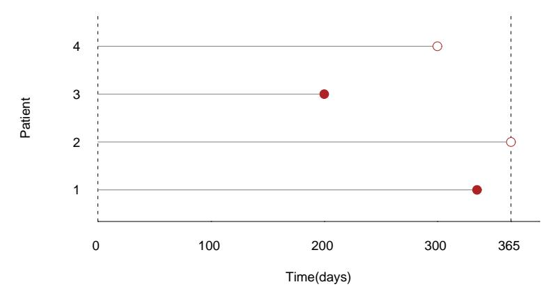

FIGURE 18.11. Censored survival data. For illustration there are four patients. The first and third patients die before the study ends. The second patient is alive at the end of the study (365 days), while the fourth patient is lost to follow-up before the study ends. For example, this patient might have moved out of the country. The survival times for patients two and four are said to be "censored."

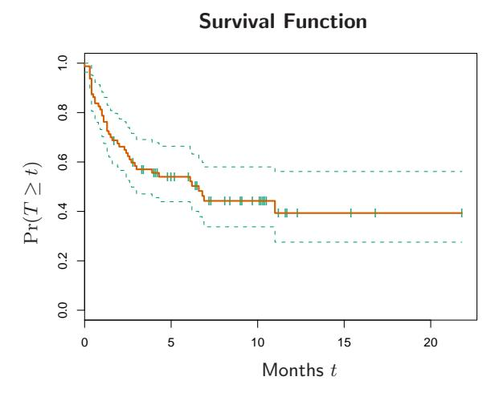

FIGURE 18.12. Lymphoma data. The Kaplan–Meier estimate of the survival function for the 80 patients in the test set, along with one-standard-error curves. The curve estimates the probability of surviving past t months. The ticks indicate censored observations.

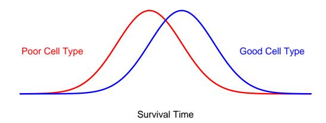

FIGURE 18.13. Underlying conceptual model for supervised principal components. There are two cell types, and patients with the good cell type live longer on the average. Supervised principal components estimate the cell type, by averaging the expression of genes that reflect it.

useful as a prognostic indicator to aid in choosing treatments, or to help understand the biological basis for the disease.

The underlying conceptual model for supervised principal components is shown in Figure 18.13. We imagine that there are two cell types, and patients with the good cell type live longer on the average. However there is considerable overlap in the two sets of survival times. We might think of survival time as a "noisy surrogate" for cell type. A fully supervised approach would give the most weight to those genes having the strongest relationship with survival. These genes are partially, but not perfectly, related to cell type. If we could instead discover the underlying cell types of the patients, often reflected by a sizable signature of genes acting together in pathways, then we might do a better job of predicting patient survival.

Although the cell type in Figure 18.13 is discrete, it is useful to imagine a continuous cell type, define by some linear combination of the features. We will estimate the cell type as a continuous quantity, and then discretize it for display and interpretation.

How can we find the linear combination that defines the important underlying cell types? Principal components analysis (Section 14.5) is an effective method for finding linear combinations of features that exhibit large variation in a dataset. But what we seek here are linear combinations with both high variance and significant correlation with the outcome. The lower right panel of Figure 18.14 shows the result of applying standard principal components in this example; the leading component does not correlate strongly with survival (details are given in the figure caption).

Hence we want to encourage principal component analysis to find linear combinations of features that have high correlation with the outcome. To do this, we restrict attention to features which by themselves have a sizable correlation with the outcome. This is summarized in the supervised principal components Algorithm 18.1, and illustrated in Figure 18.14.

The details in steps (1) and (2b) will depend on the type of outcome variable. For a standard regression problem, we use the univariate linear least squares coefficients in step (1) and a linear least squares model in

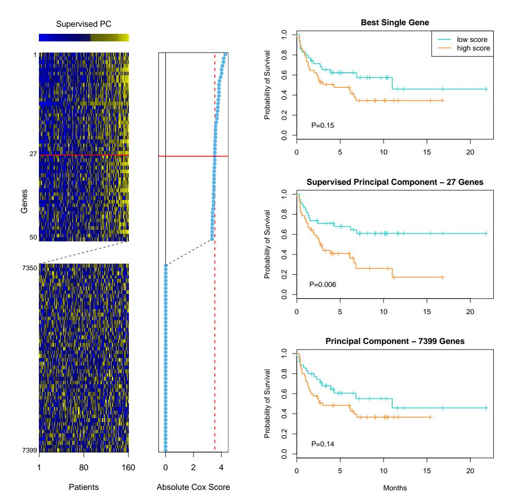

FIGURE 18.14. Supervised principal components on the lymphoma data. The left panel shows a heatmap of a subset of the gene-expression training data. The rows are ordered by the magnitude of the univariate Cox-score, shown in the middle vertical column. The top 50 and bottom 50 genes are shown. The supervised principal component uses the top 27 genes (chosen by 10-fold CV). It is represented by the bar at the top of the heatmap, and is used to order the columns of the expression matrix. In addition, each row is multiplied by the sign of the Cox-score. The middle panel on the right shows the survival curves on the test data when we create a low and high group by splitting this supervised PC at zero (training data mean). The curves are well separated, as indicated by the p-value for the log-rank test. The top panel does the same, using the top-scoring gene on the training data. The curves are somewhat separated, but not significantly. The bottom panel uses the first principal component on all the genes, and the separation is also poor. Each of the top genes can be interpreted as noisy surrogates for a latent underlying cell-type characteristic, and supervised principal components uses them all to estimate this latent factor.

#### Algorithm 18.1 Supervised Principal Components.

- 1. Compute the standardized univariate regression coefficients for the outcome as a function of each feature separately.
- 2. For each value of the threshold $\theta$ from the list 0 $\le$ $\theta$$^{1}$ < $\theta$$^{2}$ < $\cdot$ $\cdot$ $\cdot$ < $\theta$K:
  - (a) Form a reduced data matrix consisting of only those features whose univariate coefficient exceeds $\theta$ in absolute value, and compute the first m principal components of this matrix.
  - (b) Use these principal components in a regression model to predict the outcome.
- 3. Pick $\theta$ (and m) by cross-validation.

step (2b). For survival problems, Cox's proportional hazards regression model is widely used; hence we use the score test from this model in step (1) and the multivariate Cox model in step (2b). The details are not essential for understanding the basic method; they may be found in Bair et al. (2006).

Figure 18.14 shows the results of supervised principal components in this example. We used a Cox-score cutoff of 3.53, yielding 27 genes, where the value 3.53 was found through 10-fold cross-validation. We then computed the first principal component (m = 1) using just this subset of the data, as well as its value for each of the test observations. We included this as a quantitative predictor in a Cox regression model, and its likelihood-ratio significance was p = 0.005. When dichotomized (using the mean score on the training data as a threshold), it clearly separates the patients in the test set into low and high risk groups (middle-right panel of Figure 18.14, p = 0.006).

The top-right panel of Figure 18.14 uses the top scoring gene (dichotomized) alone as a predictor of survival. It is not significant on the test set. Likewise, the lower-right panel shows the dichotomized principal component using all the training data, which is also not significant.

Our procedure allows m > 1 principal components in step (2a). However, the supervision in step (1) encourages the principal components to align with the outcome, and thus in most cases only the first or first few components tend to be useful for prediction. In the mathematical development below, we consider only the first component, but extensions to more than one component can be derived in a similar way.

## 18.6.1 Connection to Latent-Variable Modeling

A formal connection between supervised principal components and the underlying cell type model (Figure 18.13) can be seen through a latent variable model for the data. Suppose we have a response variable Y which is related to an underlying latent variable U by a linear model

$$Y = \beta_0 + \beta_1 U + \varepsilon. \tag{18.32}$$

In addition, we have measurements on a set of features  $X_j$  indexed by  $j \in \mathcal{P}$  (for pathway), for which

$$X_j = \alpha_{0j} + \alpha_{1j}U + \epsilon_j, \quad j \in \mathcal{P}. \tag{18.33}$$

The errors  $\varepsilon$  and  $\epsilon_j$  are assumed to have mean zero and are independent of all other random variables in their respective models.

We also have many additional features  $X_k$ ,  $k \notin \mathcal{P}$  which are independent of U. We would like to identify  $\mathcal{P}$ , estimate U, and hence fit the prediction model (18.32). This is a special case of a latent-structure model, or single-component factor-analysis model (Mardia et al., 1979, see also Section 14.7). The latent factor U is a continuous version of the cell type conceptualized in Figure 18.13.

The supervised principal component algorithm can be seen as a method for fitting this model:

- The screening step (1) estimates the set  $\mathcal{P}$ .
- Given  $\widehat{\mathcal{P}}$ , the largest principal component in step (2a) estimates the latent factor U.
- Finally, the regression fit in step (2b) estimates the coefficient in model (18.32).

Step (1) is natural, since on average the regression coefficient is nonzero only if  $\alpha_{1j}$  is non-zero. Hence this step should select the features  $j \in \mathcal{P}$ . Step (2a) is natural if we assume that the errors  $\epsilon_j$  have a Gaussian distribution, with the same variance. In this case the principal component is the maximum likelihood estimate for the single factor model (Mardia et al., 1979). The regression in (2b) is an obvious final step.

Suppose there are a total of p features, with  $p_1$  features in the relevant set  $\mathcal{P}$ . Then if p and  $p_1$  grow but  $p_1$  is small relative to p, one can show (under reasonable conditions) that the leading supervised principal component is consistent for the underlying latent factor. The usual leading principal component may not be consistent, since it can be contaminated by the presence of a large number of "noise" features.

Finally, suppose that the threshold used in step (1) of the supervised principal component procedure yields a large number of features for computation of the principal component. Then for interpretational purposes, as well as for practical uses, we would like some way of finding a reduced a set of features that approximates the model. Pre-conditioning (Section 18.6.3) is one way of doing this.

#### 18.6.2 Relationship with Partial Least Squares

Supervised principal components is closely related to partial least squares regression (Section 3.5.2). Bair et al. (2006) found that the key to the good performance of supervised principal components was the filtering out of noisy features in step (2a). Partial least squares (Section 3.5.2) downweights noisy features, but does not throw them away; as a result a large number of noisy features can contaminate the predictions. However, a modification of the partial least squares procedure has been proposed that has a similar flavor to supervised principal components [Brown et al. (1991),Nadler and Coifman (2005), for example]. We select the features as in steps (1) and (2a) of supervised principal components, but then apply PLS (rather than principal components) to these features. For our current discussion, we call this "thresholded PLS."

Thresholded PLS can be viewed as a noisy version of supervised principal components, and hence we might not expect it to work as well in practice. Assume the variables are all standardized. The first PLS variate has the form

$$\mathbf{z} = \sum_{j \in \mathcal{P}} \langle \mathbf{y}, \mathbf{x}_j \rangle \mathbf{x}_j, \tag{18.34}$$

and can be thought of as an estimate of the latent factor U in model (18.33). In contrast, the supervised principal components direction uˆ satisfies

$$\hat{\mathbf{u}} = \frac{1}{d^2} \sum_{j \in \mathcal{P}} \langle \hat{\mathbf{u}}, \mathbf{x}_j \rangle \mathbf{x}_j, \tag{18.35}$$

where d is the leading singular value of X$^{P}$ . This follows from the definition of the leading principal component. Hence thresholded PLS uses weights which are the inner product of y with each of the features, while supervised principal components uses the features to derive a "self-consistent" estimate uˆ. Since many features contribute to the estimate uˆ, rather than just the single outcome y, we can expect uˆ to be less noisy than z. In fact, if there are p$^{1}$ features in the set P, and N, p and p$^{1}$ go to infinity with p1/N $\to$ 0, then it can be shown using the techniques in Bair et al. (2006) that

$$\mathbf{z} = \mathbf{u} + O_p(1)$$

$$\hat{\mathbf{u}} = \mathbf{u} + O_p(\sqrt{p_1/N}), \qquad (18.36)$$

where u is the true (unobservable) latent variable in the model (18.32), (18.33).

We now present a simulation example to compare the methods numerically. There are N = 100 samples and p = 5000 genes. We generated the data as follows:

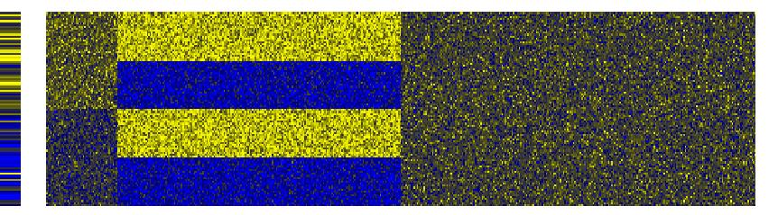

FIGURE 18.15. Heatmap of the outcome (left column) and first 500 genes from a realization from model (18.37). The genes are in the columns, and the samples are in the rows.

$$x_{ij} = \begin{cases} 3 + \epsilon_{ij} & \text{if } i \le 50, \\ 4 + \epsilon_{ij} & \text{if } i > 50 \end{cases} \qquad j = 1, \dots, 50$$

$$x_{ij} = \begin{cases} 1.5 + \epsilon_{ij} & \text{if } 1 \le i \le 25 \text{ or } 51 \le i \le 75 \\ 5.5 + \epsilon_{ij} & \text{if } 26 \le i \le 50 \text{ or } 76 \le i \le 100 \end{cases} \qquad j = 51, \dots, 250$$

$$x_{ij} = \epsilon_{ij} \qquad j = 251, \dots, 5000$$

$$y_{i} = 2 \cdot \frac{1}{50} \sum_{j=1}^{50} x_{ij} + \epsilon_{i} \qquad (18.37)$$

where  $\epsilon_{ij}$  and  $\epsilon_i$  are independent normal random variables with mean 0 and standard deviations 1 and 1.5, respectively. Thus in the first 50 genes, there is an average difference of 1 unit between samples 1–50 and 51–100, and this difference correlates with the outcome y. The next 200 genes have a large average difference of 4 units between samples (1–25, 51–75) and (26–50, 76–100), but this difference is uncorrelated with the outcome. The rest of the genes are noise. Figure 18.15 shows a heatmap of a typical realization, with the outcome at the left, and the first 500 genes to the right.

We generated 100 simulations from this model, and summarize the test error results in Figure 18.16. The test errors of principal components and partial least squares are shown at the right of the plot; both are badly affected by the noisy features in the data. Supervised principal components and thresholded PLS work best over a wide range of the number of selected features, with the former showing consistently lower test errors.

While this example seems "tailor-made" for supervised principal components, its good performance seems to hold in other simulated and real datasets (Bair et al., 2006).

## 18.6.3 Pre-Conditioning for Feature Selection

Supervised principal components can yield lower test errors than competing methods, as shown in Figure 18.16. However, it does not always produce a sparse model involving only a small number of features (genes). Even if the thresholding in Step (1) of the algorithm yields a relatively small number
the former showing consistently lower test errors.

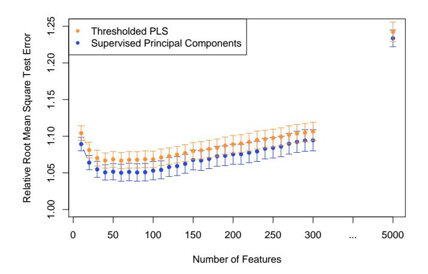

FIGURE 18.16. Root mean squared test error ($\pm$ one standard error), for supervised principal components and thresholded PLS on 100 realizations from model (18.37). All methods use one component, and the errors are relative to the noise standard deviation (the Bayes error is 1.0). For both methods, different values for the filtering threshold were tried and the number of features retained is shown on the horizontal axis. The extreme right points correspond to regular principal components and partial least squares, using all the genes.
of features, it may be that some of the omitted features have sizable inner products with the supervised principal component (and could act as a good surrogate). In addition, highly correlated features will tend to be chosen together, and there may be great deal of redundancy in the set of selected features.

The lasso (Sections 18.4 and 3.4.2), on the other hand, produces a sparse model from the data. How do the test errors of the two methods compare on the simulated example of the last section? Figure 18.17 shows the test errors for one realization from model (18.37) for the lasso, supervised principal components, and the pre-conditioned lasso (described below).

We see that supervised principal components (orange curve) reaches its lowest error when about 50 features are included in the model, which is the correct number for the simulation. Although a linear model in the first 50 features is optimal, the lasso (green) is adversely affected by the large number of noisy features, and starts overfitting when far fewer are in the model.

Can we get the low test error of supervised principal components along with the sparsity of the lasso? This is the goal of pre-conditioning (Paul et al., 2008). In this approach, one first computes the supervised principal component predictor ˆy$^{i}$ for each observation in the training set (with the

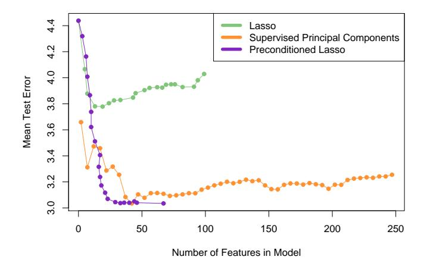

FIGURE 18.17. Test errors for the lasso, supervised principal components, and pre-conditioned lasso, for one realization from model (18.37). Each model is indexed by the number of non-zero features. The supervised principal component path is truncated at 250 features. The lasso self-truncates at 100, the sample size (see Section 18.4). In this case, the pre-conditioned lasso achieves the lowest error with about 25 features.

threshold selected by cross-validation). Then we apply the lasso with ˆy$^{i}$ as the outcome variable, in place of the usual outcome y$^{i}$ . All features are used in the lasso fit, not just those that were retained in the thresholding step in supervised principal components. The idea is that by first denoising the outcome variable, the lasso should not be as adversely affected by the large number of noise features. Figure 18.17 shows that pre-conditioning (purple curve) has been successful here, yielding much lower test error than the usual lasso, and as low (in this case) as for supervised principal components. It also can achieve this using less features. The usual lasso, applied to the raw outcome, starts to overfit more quickly than the pre-conditioned version. Overfitting is not a problem, since the outcome variable has been denoised. We usually select the tuning parameter for the pre-conditioned lasso on more subjective grounds, like parsimony.

Pre-conditioning can be applied in a variety of settings, using initial estimates other than supervised principal components and post-processors other than the lasso. More details may be found in Paul et al. (2008).

# 18.7 Feature Assessment and the Multiple-Testing Problem

In the first part of this chapter we discuss prediction models in the p ≫ N setting. Here we consider the more basic problem of assessing the significance of each of the p features. Consider the protein mass spectrometry example of Section 18.4.1. In that problem, the scientist might not be interested in predicting whether a given patient has prostate cancer. Rather the goal might be to identify proteins whose abundance differs between normal and cancer samples, in order to enhance understanding of the disease and suggest targets for drug development. Thus our goal is to assess the significance of individual features. This assessment is usually done without the use of a multivariate predictive model like those in the first part of this chapter. The feature assessment problem moves our focus from prediction to the traditional statistical topic of multiple hypothesis testing. For the remainder of this chapter we will use M instead of p to denote the number of features, since we will frequently be referring to p-values.

**TABLE 18.4.** Subset of the 12,625 genes from microarray study of radiation sensitivity. There are a total of 44 samples in the normal group and 14 in the radiation sensitive group; we only show three samples from each group.

|               |        | Norn  | nal    |   | R      | adiation | Sensitive |   |
|---------------|--------|-------|--------|---|--------|----------|-----------|---|
| Gene 1        | 7.85   | 29.74 | 29.50  |   | 17.20  | -50.75   | -18.89    |   |
| Gene 2        | 15.44  | 2.70  | 19.37  |   | 6.57   | -7.41    | 79.18     |   |
| Gene 3        | -1.79  | 15.52 | -3.13  |   | -8.32  | 12.64    | 4.75      |   |
| Gene 4        | -11.74 | 22.35 | -36.11 |   | -52.17 | 7.24     | -2.32     |   |
| :             | :      | :     | :      | : | :      | :        | :         | : |
| Gene $12,625$ | -14.09 | 32.77 | 57.78  |   | -32.84 | 24.09    | -101.44   |   |

Consider, for example, the microarray data in Table 18.4, taken from a study on the sensitivity of cancer patients to ionizing radiation treatment (Rieger et al., 2004). Each row consists of the expression of genes in 58 patient samples: 44 samples were from patients with a normal reaction, and 14 from patients who had a severe reaction to radiation. The measurements were made on oligo-nucleotide microarrays. The object of the experiment was to find genes whose expression was different in the radiation sensitive group of patients. There are M=12,625 genes altogether; the table shows the data for some of the genes and samples for illustration.

To identify informative genes, we construct a two-sample t-statistic for each gene.

$$t_j = \frac{\bar{x}_{2j} - \bar{x}_{1j}}{\text{se}_j},\tag{18.38}$$

where  $\bar{x}_{kj} = \sum_{i \in C_{\ell}} x_{ij}/N_{\ell}$ . Here  $C_{\ell}$  are the indices of the  $N_{\ell}$  samples in group  $\ell$ , where  $\ell = 1$  is the normal group and  $\ell = 2$  is the sensitive group. The quantity  $\mathbf{s}_{ij}$  is the pooled within-group standard error for gene j:

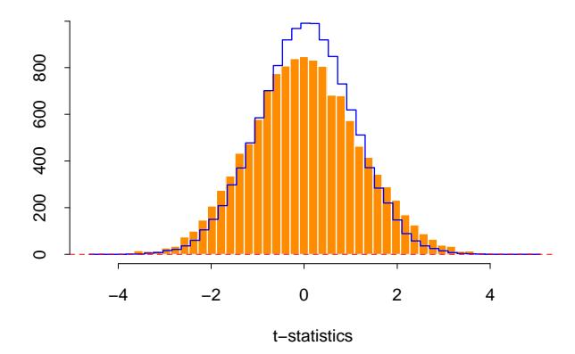

**FIGURE 18.18.** Radiation sensitivity microarray example. A histogram of the 12,625 t-statistics comparing the radiation-sensitive versus insensitive groups. Overlaid in blue is the histogram of the t-statistics from 1000 permutations of the sample labels.

$$\operatorname{se}_{j} = \hat{\sigma}_{j} \sqrt{\frac{1}{N_{1}} + \frac{1}{N_{2}}}; \quad \hat{\sigma}_{j}^{2} = \frac{1}{N_{1} + N_{2} - 2} \left( \sum_{i \in C_{1}} (x_{ij} - \bar{x}_{1j})^{2} + \sum_{i \in C_{2}} (x_{ij} - \bar{x}_{2j})^{2} \right). \tag{18.39}$$

A histogram of the 12,625 t-statistics is shown in orange in Figure 18.18, ranging in value from -4.7 to 5.0. If the  $t_j$  values were normally distributed we could consider any value greater than two in absolute value to be significantly large. This would correspond to a significance level of about 5%. Here there are 1189 genes with  $|t_j| \geq 2$ . However with 12,625 genes we would expect many large values to occur by chance, even if the grouping is unrelated to any gene. For example, if the genes were independent (which they are surely not), the number of falsely significant genes would have a binomial distribution with mean 12,625  $\cdot$  0.05 = 631.3 and standard deviation 24.5; the actual 1189 is way out of range.

How do we assess the results for all 12,625 genes? This is called the *multiple testing* problem. We can start as above by computing a *p*-value for each gene. This can be done using the theoretical *t*-distribution probabilities, which assumes the features are normally distributed. An attractive alternative approach is to use the permutation distribution, since it avoids assumptions about the distribution of the data. We compute (in principle) all  $K = \binom{58}{14}$  permutations of the sample labels, and for each permutation k compute the t-statistics  $t_j^k$ . Then the p-value for gene j is

$$p_j = \frac{1}{K} \sum_{k=1}^{K} I(|t_j^k| > |t_j|).$$
(18.40)

Of course,  $\binom{58}{14}$  is a large number (around  $10^{13}$ ) and so we can't enumerate all of the possible permutations. Instead we take a random sample of the possible permutations; here we took a random sample of K=1000 permutations.

To exploit the fact that the genes are similar (e.g., measured on the same scale), we can instead pool the results for all genes in computing the *p*-values.

$$p_j = \frac{1}{MK} \sum_{j'=1}^{M} \sum_{k=1}^{K} I(|t_{j'}^k| > |t_j|).$$
 (18.41)

This also gives more granular p-values than does (18.40), since there many more values in the pooled null distribution than there are in each individual null distribution.

Using this set of p-values, we would like to test the hypotheses:

$$H_{0j}$$
 = treatment has no effect on gene  $j$ 

$$versus \tag{18.42}$$

 $H_{1j}$  = treatment has an effect on gene j

for all j = 1, 2, ..., M. We reject  $H_{0j}$  at level  $\alpha$  if  $p_j < \alpha$ . This test has type-I error equal to  $\alpha$ ; that is, the probability of falsely rejecting  $H_{0j}$  is  $\alpha$ .

Now with many tests to consider, it is not clear what we should use as an overall measure of error. Let  $A_j$  be the event that  $H_{0j}$  is falsely rejected; by definition  $\Pr(A_j) = \alpha$ . The family-wise error rate (FWER) is the probability of at least one false rejection, and is a commonly used overall measure of error. In detail, if  $A = \bigcup_{j=1}^M A_j$  is the event of at least one false rejection, then the FWER is  $\Pr(A)$ . Generally  $\Pr(A) \gg \alpha$  for large M, and depends on the correlation between the tests. If the tests are independent each with type-I error rate  $\alpha$ , then the family-wise error rate of the collection of tests is  $(1 - (1 - \alpha)^M)$ . On the other hand, if the tests have positive dependence, that is  $\Pr(A_j|A_k) > \Pr(A_j)$ , then the FWER will be less than  $(1 - (1 - \alpha)^M)$ . Positive dependence between tests often occurs in practice, in particular in genomic studies.

One of the simplest approaches to multiple testing is the *Bonferroni* method. It makes each individual test more stringent, in order to make the FWER equal to at most  $\alpha$ : we reject  $H_{0j}$  if  $p_j < \alpha/M$ . It is easy to show that the resulting FWER is  $\leq \alpha$  (Exercise 18.16). The Bonferroni method can be useful if M is relatively small, but for large M it is too conservative, that is, it calls too few genes significant.

In our example, if we test at level say  $\alpha=0.05$ , then we must use the threshold  $0.05/12,625=3.9\times10^{-6}$ . None of the 12,625 genes had a *p*-value this small.

There are variations to this approach that adjust the individual p-values to achieve an FWER of at most $\alpha$, with some approaches avoiding the assumption of independence; see, e.g., Dudoit et al. (2002b).

#### 18.7.1 The False Discovery Rate

A different approach to multiple testing does not try to control the FWER, but focuses instead on the proportion of falsely significant genes. As we will see, this approach has a strong practical appeal.

Table 18.5 summarizes the theoretical outcomes of M hypothesis tests. Note that the family-wise error rate is Pr(V $\ge$ 1). Here we instead focus

TABLE 18.5. Possible outcomes from M hypothesis tests. Note that V is the number of false-positive tests; the type-I error rate is E(V )/M0. The type-II error rate is E(T)/M1, and the power is 1 − E(T)/M1.

|             | Called          | Called      |       |
|-------------|-----------------|-------------|-------|
|             | Not Significant | Significant | Total |
| H0 True  | U               | V           | M0    |
| H0 False | T               | S           | M1    |
| Total       | M − R        | R           | M     |

on the false discovery rate

$$FDR = E(V/R). (18.43)$$

In the microarray setting, this is the expected proportion of genes that are incorrectly called significant, among the R genes that are called significant. The expectation is taken over the population from which the data are generated. Benjamini and Hochberg (1995) first proposed the notion of false discovery rate, and gave a testing procedure (Algorithm 18.2) whose FDR is bounded by a user-defined level $\alpha$. The Benjamini–Hochberg (BH) procedure is based on p-values; these can be obtained from an asymptotic approximation to the test statistic (e.g., Gaussian), or a permutation distribution, as is done here.

If the hypotheses are independent, Benjamini and Hochberg (1995) show that regardless of how many null hypotheses are true and regardless of the distribution of the p-values when the null hypothesis is false, this procedure has the property

$$FDR \le \frac{M_0}{M} \alpha \le \alpha. \tag{18.45}$$

For illustration we chose $\alpha$ = 0.15. Figure 18.19 shows a plot of the ordered p-values p(j) , and the line with slope 0.15/12625.

#### Algorithm 18.2 Benjamini-Hochberg (BH) Method.

- 1. Fix the false discovery rate  $\alpha$  and let  $p_{(1)} \leq p_{(2)} \leq \cdots \leq p_{(M)}$  denote the ordered p-values
- 2. Define

$$L = \max \left\{ j : p_{(j)} < \alpha \cdot \frac{j}{M} \right\}. \tag{18.44}$$

3. Reject all hypotheses  $H_{0j}$  for which  $p_j \leq p_{(L)}$ , the BH rejection threshold.

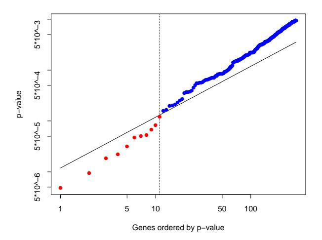

**FIGURE 18.19.** Microarray example continued. Shown is a plot of the ordered p-values  $p_{(j)}$  and the line  $0.15 \cdot (j/12, 625)$ , for the Benjamini–Hochberg method. The largest j for which the p-value  $p_{(j)}$  falls below the line, gives the BH threshold. Here this occurs at j = 11, indicated by the vertical line. Thus the BH method calls significant the 11 genes (in red) with smallest p-values.

#### **Algorithm 18.3** The Plug-in Estimate of the False Discovery Rate.

- 1. Create K permutations of the data, producing t-statistics  $t_j^k$  for features  $j=1,2,\ldots,M$  and permutations  $k=1,2,\ldots,K$ .
- 2. For a range of values of the cut-point C, let

$$R_{\text{obs}} = \sum_{j=1}^{M} I(|t_j| > C), \quad \widehat{\mathbf{E}(V)} = \frac{1}{K} \sum_{j=1}^{M} \sum_{k=1}^{K} I(|t_j^k| > C). \quad (18.46)$$

3. Estimate the FDR by  $\widehat{\text{FDR}} = \widehat{\text{E}(V)}/R_{\text{obs}}$ .

Starting at the left and moving right, the BH method finds the last time that the p-values fall below the line. This occurs at j = 11, so we reject the 11 genes with smallest p-values. Note that the cutoff occurs at the 11th smallest p-value, 0.00012, and the 11th largest of the values  $|t_j|$  is 4.101 Thus we reject the 11 genes with  $|t_j| \ge 4.101$ .

From our brief description, it is not clear how the BH procedure works; that is, why the corresponding FDR is at most 0.15, the value used for  $\alpha$ . Indeed, the proof of this fact is quite complicated (Benjamini and Hochberg, 1995).

A more direct way to proceed is a plug-in approach. Rather than starting with a value for  $\alpha$ , we fix a cut-point for our t-statistics, say the value 4.101 that appeared above. The number of observed values  $|t_j|$  equal or greater than 4.101 is 11. The total number of permutation values  $|t_j|$  equal or greater than 4.101 is 1518, for an average of 1518/1000 = 1.518 per permutation. Thus a direct estimate of the false discovery rate is  $\widehat{\text{FDR}} = 1.518/11 \approx 14\%$ . Note that 14% is approximately equal to the value of  $\alpha = 0.15$  used above (the difference is due to discreteness). This procedure is summarized in Algorithm 18.3. To recap:

The plug-in estimate of FDR of Algorithm 18.3 is equivalent to the BH procedure of Algorithm 18.2, using the permutation p-values (18.40).

This correspondence between the BH method and the plug-in estimate is not a coincidence. Exercise 18.17 shows that they are equivalent in general. Note that this procedure makes no reference to p-values at all, but rather works directly with the test statistics.

The plug-in estimate is based on the approximation

$$E(V/R) \approx \frac{E(V)}{E(R)},$$
 (18.47)

and in general  $\widehat{\text{FDR}}$  is a consistent estimate of FDR (Storey, 2002; Storey et al., 2004). Note that the numerator  $\widehat{\text{E}(V)}$  actually estimates  $(M/M_0)\text{E}(V)$ ,

since the permutation distribution uses M rather  $M_0$  null hypotheses. Hence if an estimate of  $M_0$  is available, a better estimate of FDR can be obtained from  $(\hat{M}_0/M) \cdot \widehat{\text{FDR}}$ . Exercise 18.19 shows a way to estimate  $M_0$ . The most conservative (upwardly biased) estimate of FDR uses  $M_0 = M$ . Equivalently, an estimate of  $M_0$  can be used to improve the BH method, through relation (18.45).

The reader might be surprised that we chose a value as large as 0.15 for  $\alpha$ , the FDR bound. We must remember that the FDR is not the same as type-I error, for which 0.05 is the customary choice. For the scientist, the false discovery rate is the expected proportion of false positive genes among the list of genes that the statistician tells him are significant. Microarray experiments with FDRs as high as 0.15 might still be useful, especially if they are exploratory in nature.

#### 18.7.2 Asymmetric Cutpoints and the SAM Procedure

In the testing methods described above, we used the absolute value of the test statistic  $t_j$ , and hence applied the same cut-points to both positive and negative values of the statistic. In some experiments, it might happen that most or all of the differentially expressed genes change in the positive direction (or all in the negative direction). For this situation it is advantageous to derive separate cut-points for the two cases.

The significance analysis of microarrays (SAM) approach offers a way of doing this. The basis of the SAM method is shown in Figure 18.20. On the vertical axis we have plotted the ordered test statistics  $t_{(1)} \leq t_{(2)} \leq \cdots \leq t_{(M)}$ , while the horizontal axis shows the expected order statistics from the permutations of the data:  $\tilde{t}_{(j)} = (1/K) \sum_{k=1}^{K} t_{(j)}^k$ , where  $t_{(1)}^k \leq t_{(2)}^k \leq \cdots \leq t_{(M)}^k$  are the ordered test statistics from permutation k.

Two lines are drawn, parallel to the 45° line,  $\Delta$  units away. Starting at the origin and moving to the right, we find the first place that the genes leave the band. This defines the upper cutpoint  $C_{\text{hi}}$  and all genes beyond that point are called significant (marked red). Similarly we find the lower cutpoint  $C_{\text{low}}$  for genes in the bottom left corner. Thus each value of the tuning parameter  $\Delta$  defines upper and lower cutpoints, and the plug-in estimate  $\widehat{\text{FDR}}$  for each of these cutpoints is estimated as before. Typically a range of values of  $\Delta$  and associated  $\widehat{\text{FDR}}$  values are computed, from which a particular pair are chosen on subjective grounds.

The advantage of the SAM approach lies in the possible asymmetry of the cutpoints. In the example of Figure 18.20, with  $\Delta=0.71$  we obtain 11 significant genes; they are all in the upper right. The data points in the bottom left never leave the band, and hence  $C_{low}=-\infty$ . Hence for this value of  $\Delta$ , no genes are called significant on the left (negative) side. We do not impose symmetry on the cutpoints, as was done in Section 18.7.1, as there is no reason to assume similar behavior at the two ends.

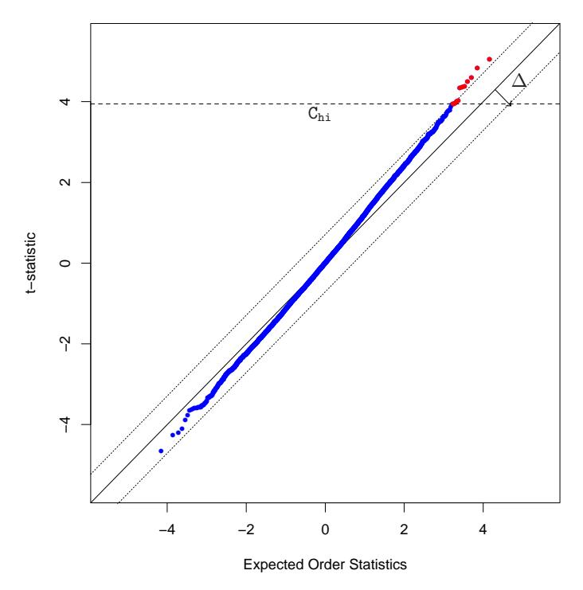

**FIGURE 18.20.** SAM plot for the radiation sensitivity microarray data. On the vertical axis we have plotted the ordered test statistics, while the horizontal axis shows the expected order statistics of the test statistics from permutations of the data. Two lines are drawn, parallel to the 45° line,  $\Delta$  units away from it. Starting at the origin and moving to the right, we find the first place that the genes leave the band. This defines the upper cut-point  $C_{hi}$  and all genes beyond that point are called significant (marked in red). Similarly we define a lower cutpoint  $C_{low}$ . For the particular value of  $\Delta=0.71$  in the plot, no genes are called significant in the bottom left.

There is some similarity between this approach and the asymmetry possible with likelihood-ratio tests. Suppose we have a log-likelihood  $\ell_0(t_j)$  under the null-hypothesis of no effect, and a log-likelihood  $\ell(t_j)$  under the alternative. Then a likelihood ratio test amounts to rejecting the null-hypothesis if

$$\ell(t_j) - \ell_0(t_j) > \Delta, \tag{18.48}$$

for some  $\Delta$ . Depending on the likelihoods, and particularly their relative values, this can result in a different threshold for  $t_j$  than for  $-t_j$ . The SAM procedure rejects the null-hypothesis if

$$|t_{(j)} - \tilde{t}_{(j)}| > \Delta \tag{18.49}$$

Again, the threshold for each  $t_{(j)}$  depends on the corresponding value of the null value  $\tilde{t}_{(j)}$ .

#### 18.7.3 A Bayesian Interpretation of the FDR

There is an interesting Bayesian view of the FDR, developed in Storey (2002) and Efron and Tibshirani (2002). First we need to define the *positive false discovery rate* (pFDR) as

$$pFDR = E\left\lceil \frac{V}{R} \middle| R > 0 \right\rceil. \tag{18.50}$$

The additional term *positive* refers to the fact that we are only interested in estimating an error rate where positive findings have occurred. It is this slightly modified version of the FDR that has a clean Bayesian interpretation. Note that the usual FDR [expression (18.43)] is not defined if Pr(R=0) > 0.

Let  $\Gamma$  be a rejection region for a single test; in the example above we used  $\Gamma = (-\infty, -4.10) \cup (4.10, \infty)$ . Suppose that M identical simple hypothesis tests are performed with the i.i.d. statistics  $t_1, \ldots, t_M$  and rejection region  $\Gamma$ . We define a random variable  $Z_j$  which equals 0 if the jth null hypothesis is true, and 1 otherwise. We assume that each pair  $(t_j, Z_j)$  are i.i.d random variables with

$$t_j|Z_j \sim (1-Z_j) \cdot F_0 + Z_j \cdot F_1$$
 (18.51)

for some distributions  $F_0$  and  $F_1$ . This says that each test statistic  $t_j$  comes from one of two distributions:  $F_0$  if the null hypothesis is true, and  $F_1$  otherwise. Letting  $\Pr(Z_j = 0) = \pi_0$ , marginally we have:

$$t_j \sim \pi_0 \cdot F_0 + (1 - \pi_0) \cdot F_1.$$
 (18.52)

Then it can be shown (Efron et al., 2001; Storey, 2002) that

$$pFDR(\Gamma) = Pr(Z_j = 0 | t_j \in \Gamma). \tag{18.53}$$

Hence under the mixture model (18.51), the pFDR is the posterior probability that the null hypothesis it true, given that test statistic falls in the rejection region for the test; that is, given that we reject the null hypothesis (Exercise 18.20).

The false discovery rate provides a measure of accuracy for tests based on an entire rejection region, such as |t$^{j}$ | $\ge$ 2. But if the FDR of such a test is say 10%, then a gene with say t$^{j}$ = 5 will be more significant than a gene with t$^{j}$ = 2. Thus it is of interest to derive a local (gene-specific) version of the FDR. The q-value (Storey, 2003) of a test statistic t$^{j}$ is defined to be the smallest FDR over all rejection regions that reject t$^{j}$ . That is, for symmetric rejection regions, the q-value for t$^{j}$ = 2 is defined to be the FDR for the rejection region $\Gamma$ = {−($\infty$, −2) ∪ (2,$\infty$)}. Thus the q-value for t$^{j}$ = 5 will be smaller than that for t$^{j}$ = 2, reflecting the fact that t$^{j}$ = 5 is more significant than t$^{j}$ = 2. The local false discovery rate (Efron and Tibshirani, 2002) at t = t$^{0}$ is defined to be

$$\Pr(Z_j = 0 | t_j = t_0). \tag{18.54}$$

This is the (positive) FDR for an infinitesimal rejection region surrounding the value t$^{j}$ = t0.

# 18.8 Bibliographic Notes

Many references were given at specific points in this chapter; we give some additional ones here. Dudoit et al. (2002a) give an overview and comparison of discrimination methods for gene expression data. Levina (2002) does some mathematical analysis comparing diagonal LDA to full LDA, as p, N $\to$ $\infty$ with p > N. She shows that with reasonable assumptions diagonal LDA has a lower asymptotic error rate than full LDA. Tibshirani et al. (2001a) and Tibshirani et al. (2003) proposed the nearest shrunken-centroid classifier. Zhu and Hastie (2004) study regularized logistic regression. Highdimensional regression and the lasso are very active areas of research, and many references are given in Section 3.8.5. The fused lasso was proposed by Tibshirani et al. (2005), while Zou and Hastie (2005) introduced the elastic net. Supervised principal components is discussed in Bair and Tibshirani (2004) and Bair et al. (2006). For an introduction to the analysis of censored survival data, see Kalbfleisch and Prentice (1980).

Microarray technology has led to a flurry of statistical research: see for example the books by Speed (2003), Parmigiani et al. (2003), Simon et al. (2004), and Lee (2004).

The false discovery rate was proposed by Benjamini and Hochberg (1995), and studied and generalized in subsequent papers by these authors and many others. A partial list of papers on FDR may be found on Yoav Benjamini's homepage. Some more recent papers include Efron and Tibshirani (2002), Storey (2002), Genovese and Wasserman (2004), Storey and Tibshirani (2003) and Benjamini and Yekutieli (2005). Dudoit et al. (2002b) review methods for identifying differentially expressed genes in microarray studies.

#### Exercises

Ex. 18.1 For a coefficient estimate  $\hat{\beta}_j$ , let  $\hat{\beta}_j/||\hat{\beta}_j||_2$  be the normalized version. Show that as  $\lambda \to \infty$ , the normalized ridge-regression estimates converge to the renormalized partial-least-squares one-component estimates.

Ex. 18.2 Nearest shrunken centroids and the lasso. Consider a (naive Bayes) Gaussian model for classification in which the features  $j=1,2,\ldots,p$  are assumed to be independent within each class  $k=1,2,\ldots,K$ . With observations  $i=1,2,\ldots,N$  and  $C_k$  equal to the set of indices of the  $N_k$  observations in class k, we observe  $x_{ij} \sim N(\mu_j + \mu_{jk}, \sigma_j^2)$  for  $i \in C_k$  with  $\sum_{k=1}^K \mu_{jk} = 0$ . Set  $\hat{\sigma}_j^2 = s_j^2$ , the pooled within-class variance for feature j, and consider the lasso-style minimization problem

$$\min_{\{\mu_j, \mu_{jk}\}} \left\{ \frac{1}{2} \sum_{j=1}^p \sum_{k=1}^K \sum_{i \in C_k} \frac{(x_{ij} - \mu_j - \mu_{jk})^2}{s_j^2} + \lambda \sqrt{N_k} \sum_{j=1}^p \sum_{k=1}^K \frac{|\mu_{jk}|}{s_j} \right\} (18.55)$$

Show that the solution is equivalent to the nearest shrunken centroid estimator (18.7), with  $s_0$  set to zero, and  $m_k^2$  equal to  $1/N_k$  instead of  $1/N_k - 1/N$  as before.

Ex. 18.3 Show that the fitted coefficients for the regularized multiclass logistic regression problem (18.10) satisfy  $\sum_{k=1}^K \hat{\beta}_{kj} = 0$ ,  $j = 1, \ldots, p$ . What about the  $\hat{\beta}_{k0}$ ? Discuss issues with these constant parameters, and how they can be resolved.

Ex. 18.4 Derive the computational formula (18.15) for ridge regression. [Hint: Use the first derivative of the penalized sum-of-squares criterion to show that if  $\lambda > 0$ , then  $\hat{\beta} = \mathbf{X}^T s$  for some  $s \in \mathbb{R}^N$ .]

Ex. 18.5 Prove the theorem (18.16)–(18.17) in Section 18.3.5, by decomposing  $\beta$  and the rows of **X** into their projections into the column space of **V** and its complement in  $\mathbb{R}^p$ .

Ex. 18.6 Show how the theorem in Section 18.3.5 can be applied to regularized discriminant analysis [Equations 4.14 and (18.9)].

Ex. 18.7 Consider a linear regression problem where  $p \gg N$ , and assume the rank of **X** is N. Let the SVD of  $\mathbf{X} = \mathbf{U}\mathbf{D}\mathbf{V}^T = \mathbf{R}\mathbf{V}^T$ , where **R** is  $N \times N$  nonsingular, and **V** is  $p \times N$  with orthonormal columns.

- (a) Show that there are infinitely many least-squares solutions all with zero residuals.
- (b) Show that the ridge-regression estimate for  $\beta$  can be written

$$\hat{\beta}_{\lambda} = \mathbf{V}(\mathbf{R}^T \mathbf{R} + \lambda \mathbf{I})^{-1} \mathbf{R}^T \mathbf{y}$$
 (18.56)

(c) Show that when  $\lambda=0$ , the solution  $\hat{\beta}_0=\mathbf{V}\mathbf{D}^{-1}\mathbf{U}^T\mathbf{y}$  has residuals all equal to zero, and is unique in that it has the smallest Euclidean norm amongst all zero-residual solutions.

Ex. 18.8 Data Piling. Exercise 4.2 shows that the two-class LDA solution can be obtained by a linear regression of a binary response vector  $\mathbf{y}$  consisting of -1s and +1s. The prediction  $\hat{\beta}^T x$  for any x is (up to a scale and shift) the LDA score  $\delta(x)$ . Suppose now that  $p \gg N$ .

- (a) Consider the linear regression model  $f(x) = \alpha + \beta^T x$  fit to a binary response  $Y \in \{-1, +1\}$ . Using Exercise 18.7, show that there are infinitely many directions defined by  $\hat{\beta}$  in  $\mathbb{R}^p$  onto which the data project to exactly two points, one for each class. These are known as data piling directions (Ahn and Marron, 2005).
- (b) Show that the distance between the projected points is  $2/||\hat{\beta}||$ , and hence these directions define separating hyperplanes with that margin.
- (c) Argue that there is a single maximal data piling direction for which this distance is largest, and is defined by  $\hat{\beta}_0 = \mathbf{V}\mathbf{D}^{-1}\mathbf{U}^T\mathbf{y} = \mathbf{X}^-\mathbf{y}$ , where  $\mathbf{X} = \mathbf{U}\mathbf{D}\mathbf{V}^T$  is the SVD of  $\mathbf{X}$ .

Ex. 18.9 Compare the data piling direction of Exercise 18.8 to the direction of the optimal separating hyperplane (Section 4.5.2) qualitatively. Which makes the widest margin, and why? Use a small simulation to demonstrate the difference.

Ex. 18.10 When  $p \gg N$ , linear discriminant analysis (see Section 4.3) is degenerate because the within-class covariance matrix **W** is singular. One version of regularized discriminant analysis (4.14) replaces **W** by a ridged version  $\mathbf{W} + \lambda \mathbf{I}$ , leading to a regularized discriminant function  $\delta_{\lambda}(x) = x^T(\mathbf{W} + \lambda \mathbf{I})^{-1}(\bar{x}_1 - \bar{x}_{-1})$ . Show that  $\delta_0(x) = \lim_{\lambda \downarrow 0} \delta_{\lambda}(x)$  corresponds to the maximal data piling direction defined in Exercise 18.8.

Ex. 18.11 Suppose you have a sample of N pairs  $(x_i, y_i)$ , with  $y_i$  binary and  $x_i \in \mathbb{R}^1$ . Suppose also that the two classes are separable; e.g., for each

pair i, i' with  $y_i = 0$  and  $y_{i'} = 1$ ,  $x_{i'} - x_i \ge C$  for some C > 0. You wish to fit a linear logistic regression model logitPr $(Y = 1|X) = \alpha + \beta X$  by maximum-likelihood. Show that  $\hat{\beta}$  is undefined.

Ex. 18.12 Suppose we wish to select the ridge parameter  $\lambda$  by 10-fold cross-validation in a  $p \gg N$  situation (for any linear model). We wish to use the computational shortcuts described in Section 18.3.5. Show that we need only to reduce the  $N \times p$  matrix  $\mathbf{X}$  to the  $N \times N$  matrix  $\mathbf{R}$  once, and can use it in all the cross-validation runs.

Ex. 18.13 Suppose our p > N predictors are presented as an  $N \times N$  inner-product matrix  $\mathbf{K} = \mathbf{X}\mathbf{X}^T$ , and we wish to fit the equivalent of a linear logistic regression model in the original features with quadratic regularization. Our predictions are also to be made using inner products; a new  $x_0$  is presented as  $k_0 = \mathbf{X}x_0$ . Let  $\mathbf{K} = \mathbf{U}\mathbf{D}^2\mathbf{U}^T$  be the eigen-decomposition of  $\mathbf{K}$ . Show that the predictions are given by  $\hat{f}_0 = k_0^T \hat{\alpha}$ , where

- (a)  $\hat{\alpha} = \mathbf{U}\mathbf{D}^{-1}\hat{\beta}$ , and
- (b)  $\hat{\beta}$  is the ridged logistic regression estimate with input matrix  $\mathbf{R} = \mathbf{UD}$ .

Argue that the same approach can be used for any appropriate kernel matrix K.

Ex. 18.14 Distance weighted 1-NN classification. Consider the 1-nearest-neighbor method (Section 13.3) in a two-class classification problem. Let  $d_+(x_0)$  be the shortest distance to a training observation in class +1, and likewise  $d_-(x_0)$  the shortest distance for class -1. Let  $N_-$  be the number of samples in class -1,  $N_+$  the number in class +1, and  $N=N_-+N_+$ .

(a) Show that

$$\delta(x_0) = \log \frac{d_-(x_0)}{d_+(x_0)} \tag{18.57}$$

can be viewed as a nonparametric discriminant function corresponding to 1-NN classification. [Hint: Show that  $\hat{f}_+(x_0) = \frac{1}{N_+d_+(x_0)}$  can be viewed as a nonparametric estimate of the density in class +1 at  $x_0$ ].

- (b) How would you modify this function to introduce class prior probabilities  $\pi_+$  and  $\pi_-$  different from the sample-priors  $N_+/N$  and  $N_-/N$ ?
- (c) How would you generalize this approach for K-NN classification?

Ex. 18.15 Kernel PCA. In Section 18.5.2 we show how to compute the principal component variables **Z** from an uncentered inner-product matrix **K**. We compute the eigen-decomposition  $(\mathbf{I} - \mathbf{M})\mathbf{K}(\mathbf{I} - \mathbf{M}) = \mathbf{U}\mathbf{D}^2\mathbf{U}^T$ , with  $\mathbf{M} = \mathbf{1}\mathbf{1}^T/N$ , and then  $\mathbf{Z} = \mathbf{U}\mathbf{D}$ . Suppose we have the inner-product

vector  $\mathbf{k}_0$ , containing the N inner-products between a new point  $x_0$  and each of the  $x_i$  in our training set. Show that the (centered) projections of  $x_0$  onto the principal-component directions are given by

$$\mathbf{z}_0 = \mathbf{D}^{-1} \mathbf{U}^T (\mathbf{I} - \mathbf{M}) \left[ \mathbf{k}_0 - \mathbf{K} \mathbf{1} / N \right]. \tag{18.58}$$

Ex. 18.16 Bonferroni method for multiple comparisons. Suppose we are in a multiple-testing scenario with null hypotheses  $H_{0j}$ ,  $j=1,2,\ldots,M$ , and corresponding p-values  $p_j$ ,  $i=1,2,\ldots,M$ . Let A be the event that at least one null hypothesis is falsely rejected, and let  $A_j$  be the event that the jth null hypothesis is falsely rejected. Suppose that we use the Bonferroni method, rejecting the jth null hypothesis if  $p_j < \alpha/M$ .

- (a) Show that  $\Pr(A) \leq \alpha$ . [Hint:  $\Pr(A_j \cup A_{j'}) = \Pr(A_j) + \Pr(A_{j'}) \Pr(A_j \cap A_{j'})$ ]
- (b) If the hypotheses  $H_{0j}$ ,  $j=1,2,\ldots,M$ , are independent, then  $\Pr(A)=1-\Pr(A^C)=1-\prod_{j=1}^M\Pr(A_j^C)=1-(1-\alpha/M)^M$ . Use this to show that  $\Pr(A)\approx \alpha$  in this case.

Ex. 18.17 Equivalence between Benjamini-Hochberg and plug-in methods.

- (a) In the notation of Algorithm 18.2, show that for rejection threshold  $p_0 = p_{(L)}$ , a proportion of at most  $p_0$  of the permuted values  $t_j^k$  exceed  $|T|_{(L)}$  where  $|T|_{(L)}$  is the Lth largest value among the  $|t_j|$ . Hence show that the plug-in FDR estimate  $\widehat{\text{FDR}}$  is less than or equal to  $p_0 \cdot M/L = \alpha$ .
- (b) Show that the cut-point  $|T|_{(L+1)}$  produces a test with estimated FDR greater than  $\alpha$ .

Ex. 18.18 Use result (18.53) to show that

$$pFDR = \frac{\pi_0 \cdot \{Type \ I \ error \ of \ \Gamma\}}{\pi_0 \cdot \{Type \ I \ error \ of \ \Gamma\} + \pi_1 \{Power \ of \ \Gamma\}}$$
(18.59)

(Storey, 2003).

Ex. 18.19 Consider the data in Table 18.4 of Section (18.7), available from the book website.

- (a) Using a symmetric two-sided rejection region based on the t-statistic, compute the plug-in estimate of the FDR for various values of the cut-point.
- (b) Carry out the BH procedure for various FDR levels  $\alpha$  and show the equivalence of your results, with those from part (a).

- (c) Let (q.25, q.75) be the quartiles of the t-statistics from the permuted datasets. Let ˆ$\pi$$^{0}$ = {#t$^{j}$ $\in$ (q.25, q.75)}/(.5M), and set ˆ$\pi$$^{0}$ = min(ˆ$\pi$0, 1). Multiply the FDR estimates from (a) by ˆ$\pi$$^{0}$ and examine the results.
- (d) Give a motivation for the estimate in part (c).

(Storey, 2003)

Ex. 18.20 Proof of result (18.53). Write

$$pFDR = E\left(\frac{V}{R}|R>0\right)$$
 (18.60)

$$= \sum_{k=1}^{M} E\left[\frac{V}{R}|R=k\right] \Pr(R=k|R>0)$$
 (18.61)

Use the fact that given R = k, V is a binomial random variable, with k trials and probability of success Pr(H = 0|T $\in$ $\Gamma$), to complete the proof.